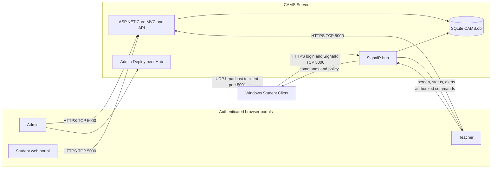
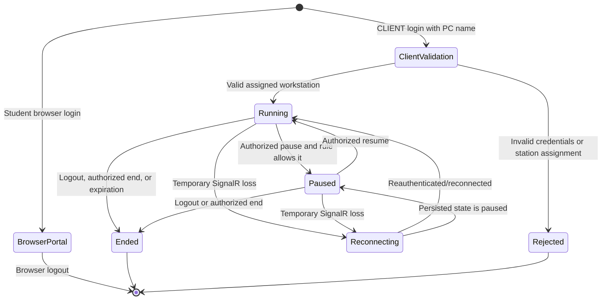

# CAMS Computer Account Management System

## User And System Guide

CAMS supports supervised classroom monitoring and computer laboratory management on a private Windows LAN. This guide describes the implemented role scope and operational limits. For installation and trust procedures, see [DEPLOYMENT.md](DEPLOYMENT.md).

## System Architecture

The server sends discovery broadcasts; clients receive UDP `5001`. The server requires inbound Private TCP `5000`, not inbound UDP `5001`. LAN Status is detected and read-only; CAMS does not configure DHCP, DNS, gateways, adapters, or runtime network binding.

## Roles And Authorization

Roles are fixed as `Admin`, `Teacher`, and `Student`. They are not configurable RBAC. The Roles and Permissions page is a view of seeded metadata; server authorization uses fixed role claims plus object-level checks.

| Role | Scope |
| --- | --- |
| Admin | Global users, classes, rosters, computers/mappings, policies, session rules, lab-wide session controls, reports, logs, lockouts, database maintenance, LAN status, and Deployment Hub. |
| Teacher | Assigned classes and rosters, accessible students and computers, owned sessions and restrictions, scoped monitoring, alerts, records, and exports. |
| Student | Web session/alert/account pages, or an assigned-workstation session through the Windows client. |

## Login Semantics

### Browser login

Open `https://<server>:5000/Account/Login`. Admin, Teacher, and Student credentials route to their respective browser portal. A Student browser login does not identify a workstation and therefore does not create the strict assigned-PC client session.

### Windows CLIENT login

The WinForms client submits the student username or student number, password, and Windows machine name over HTTPS. Login succeeds only when the active student is mapped to the `Computer.LaboratoryStation` matching that machine name. It creates or resumes the student's active `LabSession` and then opens authenticated SignalR.

There are no default passwords. Interactive server setup securely creates or recovers the Administrator account without writing its password to configuration. Teacher and Student accounts are created from the authenticated Admin portal. Accounts store password hashes, not plain passwords.

## Administrator

### Global controls UI

The Admin dashboard provides persisted lab-wide `Pause All`, `Resume Paused`, and `End All` controls. These affect eligible active sessions across teachers and notify connected clients. Admin also has global account activation/unlock controls, global restrictions, default session rules, reports, and database maintenance.

### Account, class, and computer management

- Create, edit, activate/deactivate, unlock, and manage teacher/student accounts.
- Create, update, archive, restore, or delete classes as permitted by data integrity rules.
- Assign/reassign teachers and manage class rosters.
- Create, edit, archive, and map unique workstation profiles. A workstation or student cannot participate in more than one active session, and one workstation cannot be assigned to multiple students.
- Removing/archive operations preserve historical records where the UI states that behavior.

### Policy and records

- Manage global application/domain block or allow rules.
- Manage duration, pause, remote-control, default, and active flags for session rules.
- Review and export usage, sessions, audit, system, alert, browser-status, and command records available in the UI.
- Back up and validate SQLite; a staged restore is revalidated and applied at restart.

### LAN Status and Deployment Hub

LAN Status displays the detected request and SignalR paths only. Deployment Hub at `/Admin/Deployment` is authenticated and local: it validates the packaged client installer, checksum, manifest, client/server version match, active certificate, and compatible endpoints. It displays connected-client count and creates offline workstation bundles. The public GitHub Pages portal is informational and must never host a deployment's root CER or private PFX.

## Teacher

### Scope rules

A teacher can act only on assigned active classes, students reachable through those class/adviser/roster relationships, computers assigned to those students or used by the teacher's active sessions, and sessions owned by that teacher. Hub commands repeat authorization checks at the target object; hiding an item in the UI is not the security boundary.

### Student and roster semantics

- A teacher creates a student from one of the teacher's class rosters so the account is assigned immediately.
- A teacher may edit identity fields and set a new password only for an accessible student.
- Removing a student from the teacher's Students page removes accessible class membership/adviser association and preserves the student account.
- Removing a student from one class removes that class enrollment; it is not global account deletion.
- A teacher may create and edit a class assigned to self, archive/restore or delete it when allowed, but cannot assign/reassign another teacher.
- Existing-student enrollment is limited to students already accessible to that teacher; moving between classes is explicit.
- A teacher may rename or change status of an accessible workstation, but Admin owns global creation, archival, and student-to-workstation mapping.

### Sessions and monitoring

1. Start a session for an accessible student and available assigned computer, optionally using an active session rule.
2. Use teacher bulk controls only for that teacher's sessions. Pause is allowed only when the session rule permits it.
3. Monitor authorized live cards showing screen frames, connectivity, active application, and idle state.
4. Use allowed actions: lock, release CAMS lock state, force logout, restart, shutdown, warning, broadcast, or remote input.
5. End the session to persist its end state, notify the connected client, release the workstation, and log out the client.

The capture loop targets a 50 ms delay with one frame in flight. This is not a 20 FPS guarantee; capture and network conditions determine observed updates.

### Windows control limits

`Lock` calls the Windows workstation lock. `Unlock` only releases CAMS-maintained lock state; it cannot dismiss or inject credentials into the Windows secure desktop. A user must sign in to Windows normally. Remote input, restart, shutdown, and lock effects depend on Windows privileges, endpoint security, and local policy and must be validated on target machines.

### Restrictions, warnings, and alerts

Active global rules and teacher-owned rules for the student's active session are sent to the client and refreshed after policy changes.

- Application block violations may terminate the matching process and report an infraction.
- Website policy uses a privacy-normalized domain from supported collection paths. CAMS does not collect browser credentials, cookies, page content, full paths, queries, or fragments.
- A website violation does not close the browser. It shows a CAMS-owned, topmost WinForms dialog, not a browser popup.
- Teacher warnings also appear as CAMS topmost dialogs.
- Alerts can be grouped, filtered, acknowledged, dismissed with a reason, reopened, and exported where supported.

## Student

### Client session

After strict assigned-workstation login, the client shows the unit, student identity, session state, and timer. It streams screen frames and status while connected, applies active policies, queues bounded telemetry during temporary interruptions, and reconnects according to configured resilience behavior.

When a session ends, the client displays a CAMS session-ended dialog, logs out/exits, and may lock the workstation. Secure-desktop unlock still requires Windows sign-in.

### Web portal

The authenticated Student portal provides session information, alert history, and account/password settings. It is distinct from the WinForms client: portal login is not proof that the user is at the assigned workstation, does not open the client SignalR agent, and does not start screen monitoring.

## Session Lifecycle

Only one active session per student and per computer is allowed. A transient hub disconnect removes the live connection/card but does not by itself guarantee that the persisted lab session is ended; reconnection can resume it. Confirm recovery behavior on the target LAN.

## Key URLs

| URL | Purpose |
| --- | --- |
| `/Account/Login` | Browser login for all three fixed roles. |
| `/Admin` | Admin dashboard and global session controls. |
| `/Admin/LanConfig` | Detected, read-only LAN status. |
| `/Admin/Deployment` | Authenticated local Deployment Hub. |
| `/AdminDatabase` | Admin database maintenance. |
| `/Teacher` | Teacher dashboard. |
| `/Teacher/Sessions` | Teacher-owned session management. |
| `/Teacher/Monitoring` | Scoped live monitoring and workstation controls. |
| `/Student` | Student web portal. |
| `/remoteMonitoringHub` | Authenticated SignalR hub used by client and dashboards. |
| `/api/client/login` | Strict student CLIENT login with workstation identity. |
| `/api/deployment/ping` | TLS readiness check used by the offline bundle. |

## Deployment Summary

1. Configure the first Admin secret and install the self-contained server.
2. Establish first trust from the locally generated public root CER or use a public production certificate. Never distribute PFX files.
3. Sign in to local `/Admin/Deployment`; select a detected certificate-compatible endpoint.
4. Verify hashes/manifests and matching client/server versions.
5. Install interactively per intended Windows user, or use the approved offline bundle procedure.
6. Open server inbound Private TCP `5000`. Clients receive UDP `5001` only for optional discovery.
7. Restart the server after a network/address change, confirm certificate coverage, and update saved client URLs if needed.
8. Confirm each connected client in Deployment Hub and the correct teacher's monitoring grid.

## Windows And LAN Validation Checklist

- Verify current-user installation and trust context, or explicitly approve the offline bundle's machine-wide root import.
- Verify TLS fingerprint/SHA-256 and endpoint SAN coverage without bypassing warnings.
- Test browser portal login separately from strict assigned-workstation CLIENT login.
- Test TCP `5000`, optional client-received UDP `5001`, client isolation, and reconnect behavior.
- Test the 50 ms capture target under realistic load without assuming guaranteed FPS.
- Test CAMS warning dialogs, policy enforcement, monitoring scope, and connected-client confirmation.
- Test lock/CAMS-unlock semantics and Windows secure desktop behavior.
- Test remote input, restart, and shutdown under the site's Windows and endpoint-security policies.
- Change the server network/address, restart, verify the new compatible endpoint, update client URL, and retest.

## Related Diagrams

- [ERD](DIAGRAMS/ERD.md)
- [System Flowchart](DIAGRAMS/Flowchart.md)
- [Menu Structure](DIAGRAMS/Menu-Structure-Diagram.md)
- [SignalR Message Flow](DIAGRAMS/SignalR-Message-Flow.md)
- [Use Cases](DIAGRAMS/Use-Case-Diagram.md)
