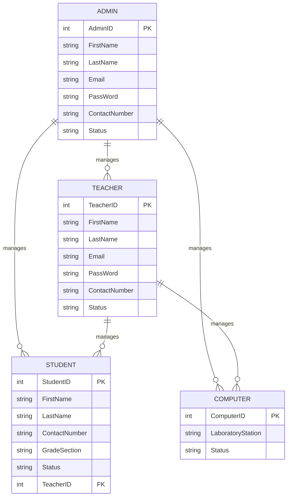

# Entity Relationship Diagram (ERD)

## Relationships

| Relationship | Cardinality | Meaning |
| --- | --- | --- |
| ADMIN → TEACHER | 1 : N | An admin manages many teacher accounts. |
| ADMIN → STUDENT | 1 : N | An admin manages many student profiles. |
| ADMIN → COMPUTER | 1 : N | An admin manages many computer profiles. |
| TEACHER → STUDENT | 1 : N | A teacher manages many student profiles. |
| TEACHER → COMPUTER | 1 : N | A teacher manages many computer profiles. |

## Notes

Reconstructed from the draw.io ERD image via OCR. "LaboratyStation" was corrected to `LaboratoryStation`.
