# CAMS Entity Relationship Diagram

Every persisted table in CAMS Computer Account Management System, as defined by the EF Core model in `Server/Data/ApplicationDbContext.cs` and `Server/Models`. Scalar columns that carry no structural meaning are summarised rather than listed in full. Passwords exist only as `PasswordHash` values.

Editable draw.io copies of the same model live beside this file:

- [`CAMS-Database-Schema.drawio`](CAMS-Database-Schema.drawio) - the physical schema in crow's foot notation: all 28 tables, every column with its SQLite storage type, declared maximum length and nullability, marked `PK`, `FK`, `UK` or `UQ`. Those rows are generated from `ApplicationDbContextModelSnapshot.cs`, so a column that changes in the database changes in the diagram rather than drifting from it.
- [`CAMS-Crowsfoot-ERD.drawio`](CAMS-Crowsfoot-ERD.drawio) - the same schema narrowed to the 15 tables the Chen diagram describes, so the two can be read side by side: every column of those tables in full, on a first page, with an *Integrity and Scope Notes* second page for the rules no line can carry. The Chen diagram names two or three attributes per entity to stay legible; this is where the rest of them live.
- [`CAMS-Chen-ERD.drawio`](CAMS-Chen-ERD.drawio) - the conceptual model in Chen notation: 11 entities and 15 relationships, with cardinalities and participation taken from the schema. A nullable foreign key is partial participation, drawn as a single line; a `NOT NULL` one is total, drawn as a double line, which is why `LAB_SESSION` in *Attends* and `COMPUTER_STATUS_HISTORY` in *Logs status* are the only double lines. It leaves out `Role` and `Permission`, and the telemetry that identifies a student by value rather than by foreign key, because neither is a relationship the database holds.

Open any of them at [app.diagrams.net](https://app.diagrams.net) with **File > Open From > Device**.

In both crow's foot drawings the parent end is a double bar when the child's foreign key is `NOT NULL` and a bar with a circle when it is nullable; the child end is always a crow's foot with a circle, because no foreign key can oblige a parent to have children.

## Accounts, classes, workstations and sessions

These are the relationships EF Core enforces with real foreign keys.

```mermaid
erDiagram
    ADMIN {
        int Id PK
        string Username UK
        string PasswordHash
        string FullName
        bool IsActive
        int FailedLoginAttempts
        datetime LockoutEndUtc "nullable"
    }

    TEACHER {
        int TeacherId PK
        string Username
        string PasswordHash
        string FirstName
        string LastName
        string Email
        string ContactNumber
        string Status
        int FailedLoginAttempts
        datetime LockoutEndUtc "nullable"
        string CreatedByType "Admin | Teacher | System"
        int CreatedById "nullable, no FK"
    }

    STUDENT {
        int Id PK
        string StudentNumber UK
        string Username UK
        string PasswordHash
        string FirstName
        string LastName
        string GradeSection
        string Status
        int FailedLoginAttempts
        datetime LockoutEndUtc "nullable"
        int ClassId FK "nullable, SET NULL"
        int AdviserId FK "nullable, SET NULL"
        string CreatedByType "Admin | Teacher | System"
        int CreatedById "nullable, no FK"
    }

    CLASS {
        int ClassId PK
        string ClassName
        string Section
        string Subject
        string GradeLevel
        string Schedule
        string AcademicYear
        string Status
        bool IsArchived
        datetime CreatedAt
        int TeacherId FK "nullable, SET NULL"
        string CreatedByType "Admin | Teacher | System"
        int CreatedById "nullable, no FK"
    }

    CLASS_STUDENT {
        int ClassStudentId PK
        int ClassId FK
        int StudentId FK
        datetime EnrolledAt
    }

    COMPUTER {
        int ComputerId PK
        string LaboratoryStation UK "NOCASE"
        string Status
        string AssignedTo UK "nullable, not an FK"
    }

    COMPUTER_STATUS_HISTORY {
        int ComputerStatusHistoryId PK
        int ComputerId FK "CASCADE"
        string Status
        datetime ChangedAt
        string ChangedByType
        int ChangedById "nullable"
    }

    SESSION_RULE {
        int SessionRuleId PK
        string Name
        int MaxDurationMinutes
        bool AllowPause
        bool AllowRemoteControl
        bool IsDefault
        bool IsActive
        datetime CreatedAt
    }

    LAB_SESSION {
        int Id PK
        int StudentId FK
        int TeacherId FK "nullable"
        int ComputerId FK "nullable"
        int SessionRuleId FK "nullable"
        string PCName
        string IPAddress
        datetime StartTime
        datetime PauseTime "nullable"
        int AccumulatedPauseSeconds
        datetime EndTime "nullable"
        bool IsActive
        string Status
        int MaxDurationMinutes "nullable"
    }

    ROLE {
        int RoleId PK
        string Name
        string Description
    }

    PERMISSION {
        int PermissionId PK
        string Name
        string Description
    }

    TEACHER o|--o{ CLASS : teaches
    TEACHER o|--o{ STUDENT : advises
    CLASS o|--o{ STUDENT : primary_class
    CLASS ||--o{ CLASS_STUDENT : has_membership
    STUDENT ||--o{ CLASS_STUDENT : enrolled_through
    STUDENT ||--o{ LAB_SESSION : attends
    TEACHER o|--o{ LAB_SESSION : supervises
    COMPUTER o|--o{ LAB_SESSION : hosts
    SESSION_RULE o|--o{ LAB_SESSION : governs
    COMPUTER ||--o{ COMPUTER_STATUS_HISTORY : records
    ROLE }o--o{ PERMISSION : role_permissions
    ADMIN ||..o{ TEACHER : created_by_identifier
    ADMIN ||..o{ STUDENT : created_by_identifier
    ADMIN ||..o{ CLASS : created_by_identifier
```

## Policy, telemetry and operations

`RESTRICTION_RULE`, `USAGE_LOG` and `WEBSITE_USAGE_LOG` carry real foreign keys. Everything else in this half correlates to a student, workstation or connection through plain string or integer identifiers, so those links are drawn as dashed associations rather than enforced constraints.

```mermaid
erDiagram
    TEACHER {
        int TeacherId PK
    }

    STUDENT {
        int Id PK
    }

    RESTRICTION_RULE {
        int RestrictionRuleId PK
        string RuleType "Application | Website"
        string Target
        string Description
        string Mode "Block | Allow"
        bool IsGlobal
        int TeacherId FK "nullable"
        bool IsActive
        datetime CreatedAt
    }

    BLACKLIST_ITEM {
        int BlacklistItemId PK
        string TargetType
        string Value
        string Reason
        bool IsActive
        datetime CreatedAt
    }

    APPLICATION_CATEGORY {
        int ApplicationCategoryId PK
        string Name
        string Pattern
        string Mode
        bool IsActive
    }

    WEBSITE_CATEGORY {
        int WebsiteCategoryId PK
        string Name
        string DomainPattern
        string Mode
        bool IsActive
    }

    SESSION_RULE {
        int SessionRuleId PK
    }

    USAGE_LOG {
        int UsageLogId PK
        int StudentId FK "nullable"
        string PcName
        string AppName
        datetime Timestamp
    }

    WEBSITE_USAGE_LOG {
        int WebsiteUsageLogId PK
        int StudentId FK "nullable"
        string Domain
        string Browser
        datetime Timestamp
    }

    ACTIVITY_EVENT {
        int ActivityEventId PK
        string ConnectionId
        string StudentId "identifier, no FK"
        string PcName
        string EventType
        string ApplicationName "nullable"
        string Details "nullable"
        datetime Timestamp
    }

    IDLE_INTERVAL {
        int IdleIntervalId PK
        string ConnectionId
        string StudentId "identifier, no FK"
        string PcName
        datetime StartedAt
        datetime EndedAt "nullable"
    }

    BROWSER_MONITORING_RECORD {
        int BrowserMonitoringRecordId PK
        string ConnectionId
        string StudentId "identifier, no FK"
        string PcName
        string Browser
        int Mode "enum"
        string Detail "nullable"
        datetime Timestamp
    }

    MONITORING_ALERT {
        int MonitoringAlertId PK
        string StudentId "identifier, no FK"
        string PcName
        string Severity
        string Title
        string Message
        bool IsAcknowledged
        datetime AcknowledgedAt "nullable"
        int AcknowledgedByTeacherId "nullable"
        datetime DismissedAt "nullable"
        int DismissedByTeacherId "nullable"
        string DismissalReason "nullable"
        string DedupeKey
        string GroupKey
        int OccurrenceCount
        datetime CreatedAt
        datetime LastSeenAt
    }

    REMOTE_CONTROL_SESSION {
        int RemoteControlSessionId PK
        int TeacherId "identifier, no FK"
        string StudentId "identifier, no FK"
        string PcName
        string ConnectionId
        datetime StartedAt
        datetime EndedAt "nullable"
        bool IsActive
    }

    REMOTE_COMMAND_LOG {
        int RemoteCommandLogId PK
        int RemoteControlSessionId "nullable, no FK"
        int TeacherId "identifier, no FK"
        string StudentId "identifier, no FK"
        string PcName
        string Command
        string Details
        datetime Timestamp
    }

    NOTIFICATION {
        int NotificationId PK
        int StudentId "nullable, no FK"
        string Type
        string Title
        string Message
        bool IsRead
        datetime CreatedAt
    }

    AUDIT_LOG {
        int AuditLogId PK
        string UserType "Admin | Teacher | Student | System"
        int UserId "nullable, no FK"
        string Action
        string Details
        string IpAddress "nullable"
        datetime Timestamp
    }

    SYSTEM_LOG {
        int SystemLogId PK
        string Level
        string Message
        string StackTrace "nullable"
        datetime Timestamp
    }

    LAN_CONFIGURATION {
        int LanConfigurationId PK
        string ServerAddress
        int ServerPort
        string DhcpRangeStart "nullable"
        string DhcpRangeEnd "nullable"
        string Gateway "nullable"
        string DnsServer "nullable"
        bool IsActive
        datetime UpdatedAt
    }

    TEACHER o|--o{ RESTRICTION_RULE : owns_scoped_rule
    STUDENT o|--o{ USAGE_LOG : produces
    STUDENT o|--o{ WEBSITE_USAGE_LOG : produces
    STUDENT ||..o{ ACTIVITY_EVENT : correlates_by_identifier
    STUDENT ||..o{ IDLE_INTERVAL : correlates_by_identifier
    STUDENT ||..o{ BROWSER_MONITORING_RECORD : correlates_by_identifier
    STUDENT ||..o{ MONITORING_ALERT : correlates_by_identifier
    STUDENT ||..o{ NOTIFICATION : correlates_by_identifier
    TEACHER ||..o{ REMOTE_CONTROL_SESSION : operates
    TEACHER ||..o{ REMOTE_COMMAND_LOG : issues
    REMOTE_CONTROL_SESSION ||..o{ REMOTE_COMMAND_LOG : groups
```



## Integrity And Scope Notes

- `Admin`, `Teacher` and `Student` are separate account tables. Each stores `PasswordHash`, `FailedLoginAttempts` and `LockoutEndUtc`. No plain password column exists.
- `Student`, `Teacher` and `Class` record who created them in `CreatedByType` and `CreatedById`. The creator may be an administrator or a teacher, and those live in different tables, so the type says which table the id belongs to. This is the same pair `AuditLog` and `ComputerStatusHistory` already use, and like those it is not a foreign key: the database cannot check that the id exists, and deleting an administrator leaves the ids pointing at nobody. Rows that predate the columns, and rows the seeder writes, carry `System`. Added by the `RecordWhoCreatedAccountsAndClasses` migration; `DatabaseInitializer` adds the same columns to databases that were created before it.
- Application roles are fixed. `Role`, `Permission` and the `RolePermissions` join table hold seeded metadata for display only; they do not drive runtime authorisation.
- `Student.ClassId` is the primary class association and is set to null when the class is deleted. `ClassStudent` records explicit roster membership and is unique on `(ClassId, StudentId)`.
- `Computer.AssignedTo` holds the assigned student identifier as text. It is unique when present but is not an EF foreign key; assignment integrity is enforced in application code.
- Filtered unique indexes allow at most one active `LabSession` per student, and at most one active `LabSession` per computer.
- `Computer.LaboratoryStation` is unique under a `NOCASE` collation.
- `Classes` carries a non-unique index on `(ClassName, AcademicYear)`, added after this diagram was first drawn.
- A global `RestrictionRule` has no teacher owner. A teacher-owned rule carries `TeacherId` and applies only within that teacher's active-session scope.
- Telemetry and operations tables (`ActivityEvent`, `IdleInterval`, `BrowserMonitoringRecord`, `MonitoringAlert`, `RemoteControlSession`, `RemoteCommandLog`, `Notification`, `AuditLog`) identify students, teachers and workstations by value rather than by foreign key. Retention is time-based, which is why they are deliberately decoupled from the account tables.
- Reporting indexes exist on the busy telemetry tables: `(PcName, Timestamp)` and `(StudentId, Timestamp)` for activity, `(ConnectionId, StartedAt)` and `(StudentId, StartedAt)` for idle intervals, `(StudentId, Timestamp)` and `(PcName, Timestamp)` for browser records, and both `(StudentId, DedupeKey, CreatedAt)` and `(StudentId, GroupKey, LastSeenAt)` for alerts.
- `RestrictionRule.Mode` of `Allow` is the whitelist. As of v2.18.5 an allow rule is an exception: nothing is blocked for being absent from the rules, and application rules are stored but no longer enforced on the workstation. That is behaviour, not schema; the tables are unchanged.
