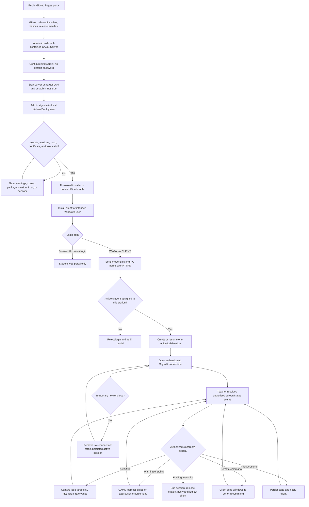

# CAMS System Flowchart

This flow separates public release discovery, authenticated local deployment, browser portal login, and strict Windows CLIENT login.

## Operational Notes

1. The public portal and GitHub release contain public packages only. A deployment root CER and offline bundle come from the authenticated local Deployment Hub.
2. Deployment Hub recomputes installer SHA-256, checks manifest/checksum/version consistency, inspects certificate coverage, and reports connected clients.
3. Browser Student login does not create an assigned-workstation monitoring session. The CLIENT path requires the mapped station name.
4. Teacher views and commands are scoped to assigned classes, accessible students/computers, and owned sessions. Admin has global UI controls.
5. Website warnings are CAMS topmost dialogs, not browser popups. CAMS does not close the browser.
6. Unlock releases CAMS lock state but cannot unlock the Windows secure desktop.
7. The server sends UDP discovery to client port `5001`; operational HTTPS/SignalR uses server inbound Private TCP `5000`.
8. After a server network/address change, restart CAMS, verify a certificate-compatible endpoint, update saved client URLs when needed, and confirm reconnection in Deployment Hub and the monitoring grid.
