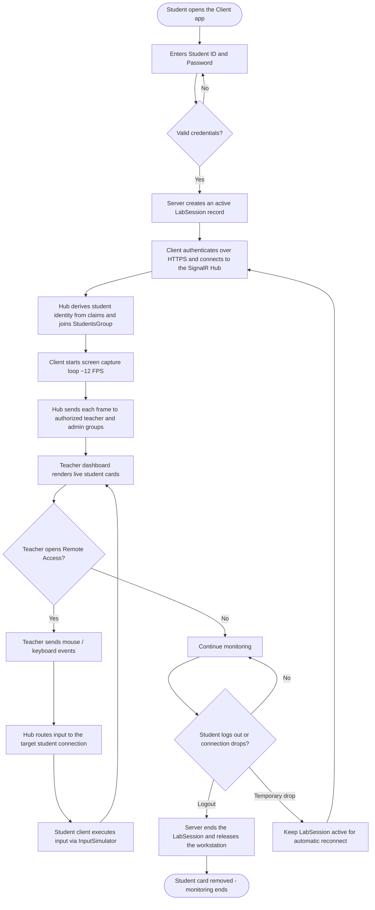

# System Flowchart

How the Remote Access Monitoring system works end to end.

## Step-by-step summary

1. **Student login** — the WinForms client submits credentials; `AuthenticationService` validates them and creates an active `LabSession` (PC name, IP, start time).
2. **Hub connection** — the client connects to the HTTPS `/remoteMonitoringHub`; the authenticated cookie supplies the student identity and the hub joins the `StudentsGroup` automatically.
3. **Screen streaming** — `ScreenCaptureService` captures the screen every ~80 ms and sends `ScreenFrameMessage` frames via `SendScreenFrame`.
4. **Teacher monitoring** — the authenticated web dashboard joins its teacher-specific group; `ReceiveScreenFrame` events and connection status are delivered only to authorized teachers and administrators.
5. **Remote control** — the teacher opens the remote modal; mouse move/click/scroll and keydown events are sent as `RemoteInputMessage` through `SendRemoteInput`, the hub routes them to the specific student connection, and the client executes them with `InputSimulator`.
6. **Logout / disconnect** — `LogoutAsync`, forced logout, teacher end, and expiration close the active `LabSession`. A transient SignalR disconnect removes the live card but preserves the session for automatic reconnect.
