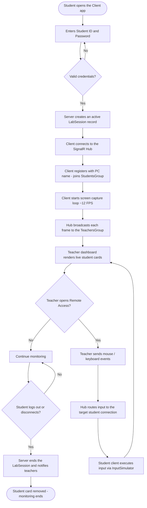

# System Flowchart

How the Remote Access Monitoring system works end to end.

## Step-by-step summary

1. **Student login** — the WinForms client submits credentials; `AuthenticationService` validates them and creates an active `LabSession` (PC name, IP, start time).
2. **Hub connection** — the client connects to `/remoteMonitoringHub`, calls `RegisterStudent`, and joins the `StudentsGroup`.
3. **Screen streaming** — `ScreenCaptureService` captures the screen every ~80 ms and sends `ScreenFrameMessage` frames via `SendScreenFrame`.
4. **Teacher monitoring** — the web dashboard connects, calls `RegisterTeacher` (joins `TeachersGroup`), and receives `ReceiveScreenFrame` events to update live cards; `StudentConnected` / `StudentDisconnected` events add and remove cards.
5. **Remote control** — the teacher opens the remote modal; mouse move/click/scroll and keydown events are sent as `RemoteInputMessage` through `SendRemoteInput`, the hub routes them to the specific student connection, and the client executes them with `InputSimulator`.
6. **Logout / disconnect** — `LogoutAsync` closes the active `LabSession`; on disconnect the hub broadcasts `StudentDisconnected` and the student card is removed.
