# CAMS Menu Structure Diagram

**Computer Account Management System** for Pardo Elementary School — B.S. in Information Technology, March 2026.

```mermaid
flowchart TD
    CAMS["CAMS (COMPUTER ACCOUNT MANAGEMENT SYSTEM)"]

    CAMS --> ADM["ADMINISTRATOR MENU (FULL SYSTEM CONTROL)"]
    CAMS --> TCH["TEACHER MENU (LABORATORY SESSION CONTROL)"]
    CAMS --> STD["STUDENT INTERFACE (RESTRICTED USAGE)"]
    CAMS --> SHR["SHARED MODULES (SECURE AUTHENTICATION)"]

    %% ===== ADMINISTRATOR =====
    ADM --> ADM1["User Management"]
    ADM1 --> ADM1a["Manage Teacher Accounts"]
    ADM1 --> ADM1b["Manage Student Accounts"]
    ADM1 --> ADM1c["Manage Roles & Permissions"]
    ADM --> ADM2["System Configuration"]
    ADM2 --> ADM2a["Define Global Restriction Rules"]
    ADM2 --> ADM2b["Manage Website/App Blacklists"]
    ADM2 --> ADM2c["Set Default Session Rules"]
    ADM2 --> ADM2d["LAN Configuration Settings"]
    ADM --> ADM3["Administrative Reports"]
    ADM3 --> ADM3a["Generate Lab Usage Reports"]
    ADM3 --> ADM3b["Generate Resource Allocation Summaries"]
    ADM --> ADM4["System Logs"]
    ADM4 --> ADM4a["View Basic Audit Trail"]
    ADM4 --> ADM4b["View System Error Logs"]

    %% ===== TEACHER =====
    TCH --> TCH1["Session Management"]
    TCH1 --> TCH1a["Start laboratory session"]
    TCH1 --> TCH1b["Pause laboratory session"]
    TCH1 --> TCH1c["End laboratory session"]
    TCH --> TCH2["Live Monitoring"]
    TCH2 --> TCH2a["Student Screen Grid View"]
    TCH2 --> TCH2b["Active Application Tracker"]
    TCH2 --> TCH2c["Idle/Active Status Monitor"]
    TCH --> TCH3["Remote Control Panel"]
    TCH3 --> TCH3a["Lock/Unlock Student PCs Remotely"]
    TCH3 --> TCH3b["Broadcast Screen"]
    TCH3 --> TCH3c["Force Remote Logout"]
    TCH --> TCH4["Access Restriction Control"]
    TCH4 --> TCH4a["Apply Application Restrictions"]
    TCH4 --> TCH4b["Apply Website Restrictions for Current Session"]
    TCH --> TCH5["Classroom Records"]
    TCH5 --> TCH5a["View Session Usage Logs"]
    TCH5 --> TCH5b["Generate Simple Class Reports"]

    %% ===== STUDENT =====
    STD --> STD1["Session Info"]
    STD1 --> STD1a["View Remaining Time Countdown"]
    STD1 --> STD1b["View Assigned Unit Details"]
    STD --> STD2["Alert Center"]
    STD2 --> STD2a["View Teacher Notifications"]
    STD2 --> STD2b["View Warnings/Alerts"]
    STD --> STD3["Account Settings"]
    STD3 --> STD3a["Manage Profile / Reset Password"]

    %% ===== SHARED =====
    SHR --> SHR1["User Authentication"]
    SHR1 --> SHR1a["Secure User Login"]
    SHR1 --> SHR1b["Secure User Logout"]
    SHR1 --> SHR1c["Session Validation"]

classDef role fill:#1c1f27,stroke:#2a2e38,color:#e6e6e6;
classDef item fill:#2d3142,stroke:#3b3f56,color:#fff;
class ADM,TCH,STD,SHR role;
```

## Legend

| Menu | Access | Capability |
| --- | --- | --- |
| **ADMINISTRATOR MENU** | Full system control | User management, system configuration, reports, logs |
| **TEACHER MENU** | Laboratory session control | Session, monitoring, remote control, restrictions, records |
| **STUDENT INTERFACE** | Restricted usage | Session info, alerts, account settings |
| **SHARED MODULES** | Secure authentication | Login, logout, session validation |

*Reconstructed from the draw.io menu structure diagram.*
