# CAMS Menu Structure

CAMS Computer Account Management System uses three fixed roles. The Roles and Permissions Admin page displays metadata; it is not a configurable RBAC editor.

```mermaid
flowchart TD
    CAMS[CAMS classroom monitoring]
    CAMS --> PUB[Public portal]
    CAMS --> AUTH[Authenticated local server]
    CAMS --> CLIENT[Windows Student Client]

    PUB --> PR[Capabilities, privacy, install guidance]
    PUB --> REL[GitHub release downloads and hashes]

    AUTH --> ADM[Admin]
    AUTH --> TCH[Teacher]
    AUTH --> STD[Student web portal]

    ADM --> AD[Dashboard and lab-wide pause/resume/end]
    ADM --> AU[Teachers, students, classes, fixed-role metadata]
    ADM --> AC[Computer profiles and student mappings]
    ADM --> AL[LAN Status - detected/read-only]
    ADM --> AH[Deployment Hub]
    AH --> AHI[Validated installer, manifest, public root CER]
    AH --> AHB[Offline workstation bundle]
    AH --> AHC[Certificate/endpoints and connected clients]
    ADM --> AP[Global restrictions and session rules]
    ADM --> AR[Reports, audit, system logs]
    ADM --> AB[Database backup, validation, staged restore]
    ADM --> AS[Account settings and lockouts]

    TCH --> TD[Dashboard and teacher-owned session controls]
    TCH --> TG[Lab-wide pause/resume/end]
    TCH --> TM[Lab-wide live monitoring]
    TM --> TMC[Lock/CAMS unlock, logout, restart, shutdown]
    TM --> TMR[Warning, broadcast, permitted remote input]
    TCH --> TS[Global student and workstation management via shared Admin actions]
    TCH --> TC[Global classes and rosters via shared Admin actions]
    TC --> TCR[Create/edit roster; removal preserves account]
    TCH --> TP[Global policy management via shared Admin actions]
    TCH --> TA[Scoped alerts, analytics, records, exports]

    STD --> SI[Session information]
    STD --> SN[Alerts and notifications]
    STD --> SA[Account/password settings]

    CLIENT --> CL[Login and automatic safe workstation registration]
    CLIENT --> CS[Session toolbar and screen/status reporting]
    CLIENT --> CE[Policy enforcement and CAMS topmost dialogs]
    CLIENT --> CC[Authorized workstation commands]
```

## Scope Summary

| Surface | Scope |
| --- | --- |
| Public portal | Informational static GitHub Pages site and public release links; no local certificate, credentials, or authenticated controls. |
| Admin | Global control UI and all system/deployment administration. LAN Status does not configure the network. |
| Teacher | Active teachers can monitor and control all connected student clients and use lab-wide pause/resume/end actions. Explicitly shared `/Admin/...` actions provide global account, class, roster, workstation and policy management. Individual session actions, older `/Teacher/...` management pages, and analytics/record queries retain their teacher or adviser/class checks. Admin-only administration remains restricted. |
| Student web portal | Session, alert, and account views without strict station validation. |
| Windows CLIENT | Student credentials plus automatic safe workstation registration, monitoring agent, policy UI, and command receiver. |
