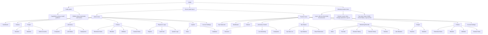

# CAMS Menu Structure

CAMS (Computer Account Management System) uses three fixed roles. An administrator and a teacher each get a sidebar in the web portal; a student uses the Windows client and has no portal menu. The Roles page lists the roles; it is not a configurable permission editor.

Each sidebar reads top to bottom as its single links, then its groups, then Account Settings. The name in the page header opens Account Settings too. Both sidebars come from one definition, `Server/Services/NavigationBuilder.cs`.

```mermaid
flowchart TD
    CAMS[CAMS]
    CAMS --> PUB[Public portal]
    CAMS --> SRV[Server portal: log in]
    CAMS --> CLIENT[Windows student client]

    PUB --> PR[Capabilities, privacy, install guidance]
    PUB --> REL[GitHub release downloads and hashes]

    SRV --> ADM[Admin menu]
    SRV --> TCH[Teacher menu]

    ADM --> AD[Dashboard]
    ADM --> ACL[Classes]
    ADM --> AP[People]
    AP --> AP1[Teachers]
    AP --> AP2[Students]
    AP --> AP3[Admin Accounts]
    ADM --> AL[Laboratory]
    AL --> AL1[Computers]
    AL --> AL2[LAN Status]
    AL --> AL3[Deployment]
    ADM --> APO[Policies]
    APO --> APO1[Restriction Rules]
    APO --> APO2[Blacklist]
    APO --> APO3[Whitelist]
    APO --> APO4[Session Rules]
    ADM --> AR["Reports & Logs"]
    AR --> AR1[Reports]
    AR --> AR2[Audit Trail]
    AR --> AR3[System Logs]
    ADM --> AS[System]
    AS --> AS1[Roles]
    AS --> AS2[Database]
    ADM --> AA[Account Settings]

    TCH --> TM[My Classroom]
    TCH --> TD[Dashboard]
    TCH --> TCL[Classes]
    TCH --> TL[Laboratory Control]
    TL --> TL1[Sessions]
    TL --> TL2[Live Monitoring]
    TL --> TL3[Computers]
    TCH --> TC[My Classes]
    TC --> TC1[My Class List]
    TC --> TC2[My Students]
    TC --> TC3[Class Restrictions]
    TCH --> TR[Monitoring Records]
    TR --> TR1[Alerts]
    TR --> TR2[Records]
    TR --> TR3[Browser History]
    TR --> TR4[Remote History]
    TR --> TR5[Timeline]
    TR --> TR6[Lab Utilization]
    TCH --> TP[People]
    TP --> TP1[Teachers]
    TP --> TP2[Students]
    TCH --> TPO[Policies]
    TPO --> TPO1[Restriction Rules]
    TPO --> TPO2[Blacklist]
    TPO --> TPO3[Whitelist]
    TPO --> TPO4[Session Rules]
    TCH --> TA[Account Settings]

    CLIENT --> CL[Log in, after the client finds the lab server]
    CLIENT --> CS[Session screen: timer, Change password, Log out]
    CLIENT --> CT[Tray menu: Open CAMS, Check Status, Log out, Exit]
```

## The two sidebars

| Admin | Teacher |
| --- | --- |
| Dashboard | My Classroom |
| Classes | Dashboard |
| **People**: Teachers, Students, Admin Accounts | Classes |
| **Laboratory**: Computers, LAN Status, Deployment | **Laboratory Control**: Sessions, Live Monitoring, Computers |
| **Policies**: Restriction Rules, Blacklist, Whitelist, Session Rules | **My Classes**: My Class List, My Students, Class Restrictions |
| **Reports & Logs**: Reports, Audit Trail, System Logs | **Monitoring Records**: Alerts, Records, Browser History, Remote History, Timeline, Lab Utilization |
| **System**: Roles, Database | **People**: Teachers, Students |
| Account Settings | **Policies**: Restriction Rules, Blacklist, Whitelist, Session Rules |
| | Account Settings |

After logging in, an administrator opens the Dashboard and a teacher opens My Classroom. Dashboard, Classes, Computers, People and Policies are the same lab-wide pages in both sidebars; a teacher reaches them through actions the administrator shares. My Classes holds the teacher's own classes, students and rules.

## Scope Summary

| Surface | Scope |
| --- | --- |
| Public portal | Informational static GitHub Pages site and public release links; no local certificate, credentials, or authenticated controls. |
| Admin | Global control UI and all system and deployment administration. LAN Status does not configure the network. |
| Teacher | Active teachers can monitor and control all connected student clients and use lab-wide pause, resume and end. The shared lab-wide pages give them account, class, roster, computer and policy management. Individual session actions, the teacher's own pages, and the records and analytics keep their teacher or class checks. Admin-only administration remains restricted. |
| Student web portal | Closed. A student who logs in on the website is told to use the CAMS student client on the lab computer. |
| Windows client | Student log in with automatic safe workstation registration, the monitoring agent, the website rules, and the receiver of the teacher's commands. |
