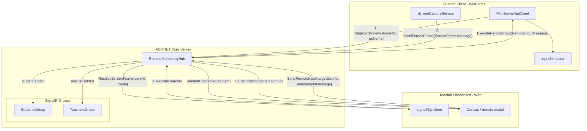

# SignalR Message Flow

How real-time events flow between the Student Client, the Server Hub, and the Teacher Dashboard over SignalR.

## Event reference

| Direction | Event | Sent by | Payload | Purpose |
| --- | --- | --- | --- | --- |
| Client → Server | `RegisterStudent` | Student client | `studentId`, `pcName` | Add connection to `StudentsGroup`, notify teachers |
| Client → Server | `SendScreenFrame` | Student client | `ScreenFrameMessage` | Broadcast live frame to `TeachersGroup` |
| Dashboard → Server | `RegisterTeacher` | Teacher dashboard | — | Add connection to `TeachersGroup` |
| Server → Dashboard | `ReceiveScreenFrame` | Server hub | `connectionId`, `ScreenFrameMessage` | Render live frame / feed the remote canvas |
| Server → Dashboard | `StudentConnected` / `StudentDisconnected` | Server hub | `StudentConnectionMessage` / `connectionId` | Add / remove student cards |
| Dashboard → Server | `SendRemoteInput` | Teacher dashboard | `targetConnectionId`, `RemoteInputMessage` | Forward a mouse/keyboard event to one student |
| Server → Client | `ExecuteRemoteInput` | Server hub | `RemoteInputMessage` | Target the specific student connection; handled by `InputSimulator` |