# SignalR Message Flow

How real-time events flow between the Student Client, the Server Hub, and the Teacher Dashboard over SignalR.

```mermaid
flowchart TD
    subgraph Client[Student Client - WinForms]
        C1[MonitoringHubClient]
        C2[ScreenCaptureService]
        C3[InputSimulator]
    end

    subgraph Server[ASP.NET Core Server]
        H[RemoteMonitoringHub]
        subgraph Groups[SignalR Groups]
            G1[StudentsGroup]
            G2[TeachersGroup]
        end
    end

    subgraph Dashboard[Teacher Dashboard - Web]
        D1[signalR.js client]
        D2[Canvas / remote modal]
    end

    C1 -- "1. HTTPS client login + authenticated hub connection" --> H
    C2 -- "2. SendScreenFrame(ScreenFrameMessage)" --> H

    H -->|student added| G1

    D1 -- "3. Authenticated hub connection" --> H
    H -->|teacher claims validated| G2

    H -- "ReceiveScreenFrame(connId, frame)" --> D1
    H -- "StudentConnected(student)" --> D2
    H -- "StudentDisconnected(connId)" --> D2

    D2 -- "SendRemoteInput(targetConnId, RemoteInputMessage)" --> H
    H -- "ExecuteRemoteInput(RemoteInputMessage)" --> C1
    C1 --> C3
    D2 -- "SendWarningPopup(id, NotificationMessage)" --> H
    H -- "SendWarningPopup(NotificationMessage)" --> C1
    D2 -- "ShutdownStudent(connectionId)" --> H
    H -- "ShutdownStudent" --> C1
    C1 -- "ReportInfraction(InfractionMessage)" --> H
    H -- "InfractionDetected(InfractionMessage)" --> D1
    H -- "GlobalSessionState(GlobalSessionMessage)" --> C1
    H -- "GlobalSessionState(GlobalSessionMessage)" --> D1
    H -- "SessionEnded" --> C1
    H -- "SessionEnded" --> D2
    D1 -- "BroadcastScreen(frameBase64)" --> H
    H -- "BroadcastScreen(BroadcastMessage)" --> C1
```

## Event reference

| Direction | Event | Sent by | Payload | Purpose |
| --- | --- | --- | --- | --- |
| Client → Server | HTTPS login + hub connection | Student client | credentials over TLS, workstation name | Validate identity, add connection to `StudentsGroup`, notify teachers |
| Client → Server | `SendScreenFrame` | Student client | `ScreenFrameMessage` | Broadcast live frame to `TeachersGroup` |
| Dashboard → Server | Authenticated hub connection | Teacher dashboard | auth cookie | Validate teacher role and add connection to `TeachersGroup` |
| Server → Dashboard | `ReceiveScreenFrame` | Server hub | `connectionId`, `ScreenFrameMessage` | Render live frame / feed the remote canvas |
| Server → Dashboard | `StudentConnected` / `StudentDisconnected` | Server hub | `StudentConnectionMessage` / `connectionId` | Add / remove student cards |
| Dashboard → Server | `SendRemoteInput` | Teacher dashboard | `targetConnectionId`, `RemoteInputMessage` | Forward a mouse/keyboard event to one student |
| Server → Client | `ExecuteRemoteInput` | Server hub | `RemoteInputMessage` | Target the specific student connection; handled by `InputSimulator` |
| Dashboard → Server | `SendWarningPopup` | Teacher dashboard | `targetConnectionId`, `NotificationMessage` | Send a warning dialog to a student or all students |
| Dashboard → Server | `ShutdownStudent` | Teacher dashboard | `connectionId` | Remotely shut down a student workstation |
| Client → Server | `ReportInfraction` | Student client | `InfractionMessage` | Report a blocked app/site attempt to the teacher |
| Server → Dashboard | `InfractionDetected` | Server hub | `InfractionMessage` | Flash the violation card and increment the alert badge |
| Server → Client | `GlobalSessionState` | Server hub | `GlobalSessionMessage` | Push start/pause/ended state with elapsed seconds |
| Server → Client | `SessionEnded` | Server hub | — | Force logout + lock when teacher/admin ends the session |
| Client → Server | `FetchRestrictions` | Student client | — | Pull the active restriction rules after login |
| Server → Client | `RestrictionsReceived` | Server hub | `List<RestrictionRuleMessage>` | Deliver whitelist/blacklist rules to the client |
| Server → Client | `SendWarningPopup` | Server hub | `NotificationMessage` | Show a warning popup on one or all student screens |
| Dashboard → Server | `BroadcastScreen` | Teacher dashboard | frameBase64 string | Send the teacher's own screen to all students |
| Server → Client | `BroadcastScreen` | Server hub | `BroadcastMessage` | Render the teacher's screen on student clients |
