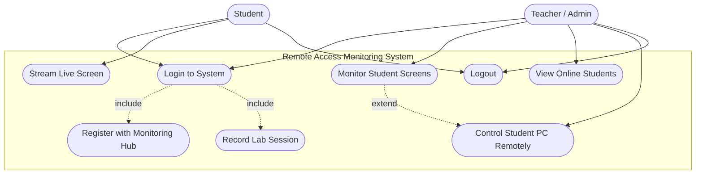

# Use Case Diagram

## Legend

| Actor | Description |
| --- | --- |
| **Student** | Runs the WinForms client on a lab PC, streams their live screen, and can receive remote input. |
| **Teacher / Admin** | Logs in on the web dashboard, watches live screens, and can take remote control of any student PC. |

## Notes

- **Login to System** — validates credentials against the `Students` / `Admins` tables.
- **Record Lab Session** — the server creates an active `LabSession` (PC name, IP, start time) on successful student login.
- **Register with Monitoring Hub** — the client joins the SignalR `StudentsGroup` after login.
- **Stream Live Screen** — the client captures the screen (~12 FPS) and sends JPEG frames through the hub.
- **Monitor Student Screens** — the dashboard joins the `TeachersGroup` and renders live frames as student cards.
- **Control Student PC Remotely** — extends monitoring: the teacher's mouse/keyboard events are routed to the selected student connection and executed with `InputSimulator`.
- **Logout** — closes the active `LabSession` (end time set) and ends the stream.
