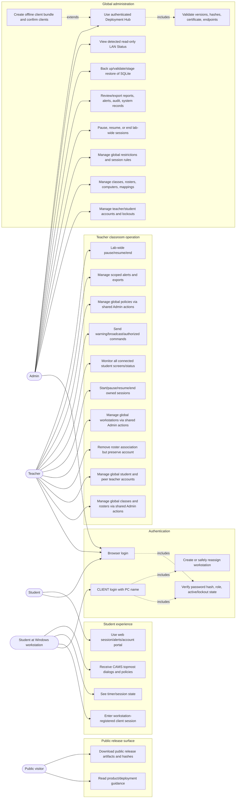

# CAMS Use Case Diagram

An editable draw.io copy sits beside this file: [`CAMS-Use-Case-Diagram.drawio`](CAMS-Use-Case-Diagram.drawio). One page, 38 module boxes, 201 use cases, with `<<include>>` and `<<extend>>` arrows. Every use case is strict verb-noun: an imperative verb first, then the noun it acts on. Each one still maps to the function that implements it, and the module caption names the declaring type - an ellipse reading `CREATE STUDENT` is `AdminController.CreateStudent` - but where the identifier is a bare noun, a noun phrase, or puts its modifier in front of the verb, the caption supplies the word order a reader expects: `AdminController.Teachers` reads `VIEW TEACHERS`, `LabUtilization` reads `VIEW LAB UTILIZATION`, and `GlobalEndSession` reads `END LAB SESSIONS`. Where the identifier and the behaviour disagree the behaviour wins: `AdminController.DeleteComputer` archives the workstation rather than deleting it, so it reads `ARCHIVE COMPUTER`, and `PermanentlyDeleteComputer` is the one that reads `DELETE COMPUTER`. Captions run from two to four words; none is a single word, and none names a threading convention - the `*Async` service methods that used to appear as `<<include>>` of their own callers have been removed. Each box carries a single actor standing outside it on the left. The drawing itself carries no figure numbers - those belong to the written specifications, where each module is reproduced under a numbered caption (*Figure 3.3: System Use Case for Manage Admin Account*) in both the Word and PDF copies. Open it at [app.diagrams.net](https://app.diagrams.net) with **File > Open From > Device**.

Coverage is checked rather than assumed: a script walks every controller action and every hub method and maps each one to a use case, so an action nobody has accounted for shows up as a gap. It currently reports full coverage of **181 distinct actions and hub methods**, with ten deliberately excluded. `Error` and `AccessDenied` are error pages rather than actor goals, and `OnConnectedAsync` and `OnDisconnectedAsync` are SignalR lifecycle callbacks nobody initiates. One is `TeacherController.ExportRecordsCsv`: the endpoint works, but nothing in the interface calls it - no link, no form, no script - and the only Export button on the Records page runs `window.print()`. A use case nobody can reach is not a use case, so it is not drawn. The other five are the whole of `StudentController` - `Index`, `Alerts`, `MarkRead`, `Settings` and `ResetPassword` - because the student web portal is closed by design: `AccountController.Login` answers a student with *"This portal is for teachers and administrators. Sign in on the CAMS Student Client on your workstation instead"* and never signs them in, and nothing anywhere sets the `StudentId` session key those actions read. A student reaches CAMS only through the client agent, so the student band carries only the client's use cases.

That coverage script walks the **server** project alone - its controllers and its hub. The five use cases in *USE THE CLIENT AGENT* and *SET SERVER ADDRESS* have no controller action behind them: they are Windows Forms handlers in the client project (`MainForm.RestoreFromTray`, `MainForm.ShowTrayStatus`, `MainForm.ExitFromTray`, `MainForm.ShowServerUrlDialog`, `ServerDiscoveryClient.DiscoverAsync`), and their specifications are marked CLIENT rather than given an HTTP verb they do not have. They were read off the client source by hand, so unlike the server side they are not machine-checked for completeness.

The actors use fixed roles. Every authenticated operation includes server-side role and object-scope validation; CAMS does not expose configurable RBAC.

There are exactly three actors: **Administrator**, **Teacher** and **Student**. The division between the administrator and teacher bands is read off the code rather than assumed: `AdminController` is `[Authorize(Roles = AdminOrTeacher)]`, and its authorization filter admits a teacher only to actions marked `[TeacherSharedAction]`. Fifty-six of its actions carry that attribute, so the teacher band repeats the whole shared administration surface - peer teacher accounts, student accounts, workstations, classes, rosters, restriction rules, lists, categories, session rules, and lab-wide pause, resume and end. The administrator band keeps what is not shared: administrator accounts, roles, LAN configuration, reports, audit and system logs, and everything in `AdminDatabaseController` and `AdminDeploymentController`.

One asymmetry is worth knowing because it looks like a mistake and is not: the administrator can pause, resume and end a laboratory-wide session but cannot start one. `AdminController` exposes `PauseAllSessions`, `ResumeAllSessions` and `EndAllSessions` and no start; `GlobalStartSession` lives on `TeacherController`. The diagram follows the code.

The workstation client and the hosted background workers are **not** actors. They are parts of the system, so what they do is drawn as included behaviour of the case a person actually starts: capturing application, website and idle telemetry is included by the student's *Work at a monitored workstation*, discovering the server is included by *Log in at the workstation*, and ending a session that has run past its limit is included by *Apply the governing session rule*.

## Scope And Limits

| Actor | Boundary |
| --- | --- |
| Public visitor | Receives public packages and documentation only. No local root CER, PFX, credentials, offline bundle, or Admin access. |
| Admin | Global controls and deployment administration through the UI. LAN Status is read-only and does not configure DHCP/DNS/network adapters. |
| Teacher | Active teachers can monitor and control all connected student clients and use lab-wide pause/resume/end actions. Explicitly shared `/Admin/...` actions provide global account, class, roster, workstation and policy management. Individual session actions, older `/Teacher/...` management pages, and analytics/record queries retain their teacher or adviser/class checks. Admin-only administration remains restricted. |
| Student browser user | Can use Student portal without workstation identity; this is not a monitored CLIENT session. |
| Student CLIENT user | Registers or safely reassigns the workstation, rejects conflicting active use, and then participates in monitoring, policy, and authorized command flows. |

Windows execution remains subject to the target environment. In particular, CAMS unlock cannot unlock the Windows secure desktop, 50 ms is a capture target rather than guaranteed FPS, and restart/shutdown/remote input must be validated under local policy.
