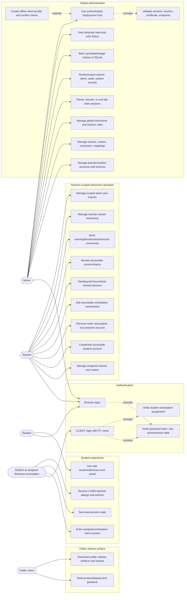

# CAMS Use Case Diagram

The actors use fixed roles. Every authenticated operation includes server-side role and object-scope validation; CAMS does not expose configurable RBAC.

## Scope And Limits

| Actor | Boundary |
| --- | --- |
| Public visitor | Receives public packages and documentation only. No local root CER, PFX, credentials, offline bundle, or Admin access. |
| Admin | Global controls and deployment administration through the UI. LAN Status is read-only and does not configure DHCP/DNS/network adapters. |
| Teacher | Only assigned/access-checked classes, students, computers, sessions, alerts, records, and teacher-owned restrictions. Cannot reassign teachers or globally delete a student through roster removal. |
| Student browser user | Can use Student portal without workstation identity; this is not a monitored CLIENT session. |
| Student CLIENT user | Must match the assigned workstation and then participates in monitoring, policy, and authorized command flows. |

Windows execution remains subject to the target environment. In particular, CAMS unlock cannot unlock the Windows secure desktop, 50 ms is a capture target rather than guaranteed FPS, and restart/shutdown/remote input must be validated under local policy.
