# Use Case Diagram

```mermaid
flowchart TD
    ADMIN([ADMIN])
    TEACHER([TEACHER])

    subgraph Login["PROCESS LOG IN"]
        direction TB
        L1([LOGIN USER])
        L2([VERIFY CREDENTIALS])
        L3([VERIFY ACCESS CONTROL])
        L1 -. include .-> L2
        L1 -. include .-> L3
    end
    ADMIN --> L1
    TEACHER --> L1

    subgraph AdmComputer["MANAGE ADMIN COMPUTER PROFILE"]
        direction TB
        C_CREATE([CREATE COMPUTER PROFILE])
        C_VIEW([VIEW COMPUTER PROFILE])
        C_DELETE([DELETE COMPUTER PROFILE])
        C_EDIT([EDIT COMPUTER PROFILE])
        C_CREATE -. extend .-> C_VIEW
        C_DELETE -. extend .-> C_VIEW
        C_EDIT -. extend .-> C_VIEW
    end
    ADMIN --> C_VIEW

    subgraph AdmTeacher["MANAGE ADMIN TEACHER PROFILE"]
        direction TB
        T_CREATE([CREATE TEACHER ACCOUNT])
        T_VIEW([VIEW TEACHER ACCOUNT])
        T_DELETE([DELETE TEACHER ACCOUNT])
        T_EDIT([EDIT TEACHER ACCOUNT])
        T_SEARCH([SEARCH TEACHER ACCOUNT])
        T_CREATE -. extend .-> T_VIEW
        T_DELETE -. extend .-> T_VIEW
        T_EDIT -. extend .-> T_VIEW
        T_SEARCH -. extend .-> T_VIEW
    end
    ADMIN --> T_VIEW

    subgraph AdmStudent["MANAGE ADMIN STUDENT PROFILE"]
        direction TB
        S_CREATE([CREATE STUDENT ACCOUNT])
        S_VIEW([VIEW STUDENT PROFILE])
        S_DELETE([DELETE STUDENT ACCOUNT])
        S_EDIT([EDIT STUDENT ACCOUNT])
        S_SEARCH([SEARCH STUDENT PROFILE])
        S_CREATE -. extend .-> S_VIEW
        S_DELETE -. extend .-> S_VIEW
        S_EDIT -. extend .-> S_VIEW
        S_SEARCH -. extend .-> S_VIEW
    end
    ADMIN --> S_VIEW

    subgraph AdmClass["MANAGE ADMIN CLASS"]
        direction TB
        CL_CREATE([CREATE CLASS])
        CL_VIEW([VIEW CLASS MANAGEMENT])
        CL_DETAILS([VIEW CLASS DETAILS])
        CL_DELETE([DELETE CLASS])
        CL_EDIT([EDIT CLASS])
        CL_SEARCH([SEARCH CLASS])
        CL_ADD([ADD STUDENT])
        CL_BULK([ADD BULK STUDENT])
        CL_ARCHIVE([ARCHIVE CLASS])
        CL_CREATE -. extend .-> CL_VIEW
        CL_DELETE -. extend .-> CL_VIEW
        CL_EDIT -. extend .-> CL_VIEW
        CL_SEARCH -. extend .-> CL_VIEW
        CL_DETAILS -. extend .-> CL_VIEW
        CL_ADD -. extend .-> CL_DETAILS
        CL_BULK -. extend .-> CL_DETAILS
        CL_ARCHIVE -. extend .-> CL_DETAILS
    end
    ADMIN --> CL_VIEW

    subgraph TeachComputer["MANAGE TEACHER COMPUTER PROFILE"]
        direction TB
        TC_VIEW([VIEW COMPUTER PROFILE])
        TC_EDIT([EDIT COMPUTER PROFILE])
        TC_EDIT -. extend .-> TC_VIEW
    end
    TEACHER --> TC_VIEW

    subgraph TeachStudent["MANAGE TEACHER STUDENT PROFILE"]
        direction TB
        TS_CREATE([CREATE STUDENT ACCOUNT])
        TS_VIEW([VIEW STUDENT ACCOUNT])
        TS_DELETE([DELETE STUDENT ACCOUNT])
        TS_EDIT([EDIT STUDENT ACCOUNT])
        TS_SEARCH([SEARCH STUDENT PROFILE])
        TS_CREATE -. extend .-> TS_VIEW
        TS_DELETE -. extend .-> TS_VIEW
        TS_EDIT -. extend .-> TS_VIEW
        TS_SEARCH -. extend .-> TS_VIEW
    end
    TEACHER --> TS_VIEW

    subgraph TeachClass["MANAGE TEACHER CLASS"]
        direction TB
        TCL_VIEW([VIEW CLASS])
        TCL_SEARCH([SEARCH CLASS])
        TCL_DETAILS([VIEW CLASS DETAILS])
        TCL_SEARCH -. extend .-> TCL_VIEW
        TCL_DETAILS -. extend .-> TCL_VIEW
    end
    TEACHER --> TCL_VIEW
```

## Actors

| Actor | Description |
| --- | --- |
| **ADMIN** | Full management rights: computer profiles, teacher accounts, student profiles, and classes. |
| **TEACHER** | Limited rights: view/edit own computer profile, manage student accounts, and view classes. |

## Legend

- `include` — the base use case always runs the included one (e.g. **LOGIN USER** always verifies credentials and access control).
- `extend` — the extension is optional and triggered from the base use case (e.g. **VIEW COMPUTER PROFILE** can optionally lead to create/edit/delete/search).

## Notes

Recreated from the draw.io source. The original canvas had a duplicated "PROCESS LOG IN" block and some stray shapes — those were omitted here.
