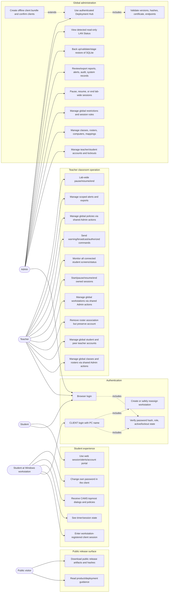

# CAMS Use Case Diagram

An editable draw.io copy sits beside this file: [`CAMS-Use-Case-Diagram.drawio`](CAMS-Use-Case-Diagram.drawio). One page, 25 module boxes, 84 use cases, with six `<<include>>` and eight `<<extend>>` arrows, and ADMIN drawn as a generalization of TEACHER in each of the twelve shared modules. Every use case is a goal the actor gets done, named verb first, and each one still maps to the functions that implement it; the module caption names the declaring type. Four rules keep it small:

- **Overlap is drawn once.** The Admin and the Teacher share most of the portal, so the twelve modules they share are drawn once, under **ADMIN AND TEACHER**. In each one the use cases are joined to TEACHER, and ADMIN is a generalization of TEACHER - a solid line with a hollow triangle pointing at TEACHER - so the Admin inherits every use case the Teacher has there. ASSIGN CLASS TEACHER, which only the Admin has, stays in MANAGE CLASS joined to ADMIN alone. START LAB SESSION, which only the Teacher has, sits in the Teacher's own CONTROL STUDENT SESSION module, where the Admin does not inherit it.
- **A page that only shows information is not a use case on its own.** It is drawn only where an export extends it, which is why seven VIEW use cases remain - VIEW REPORTS, VIEW AUDIT LOGS, VIEW SYSTEM LOGS, VIEW ALERTS, VIEW REMOTE HISTORY, VIEW BROWSER HISTORY and VIEW STUDENT DETAILS - and no other page is drawn.
- **Delete only where CAMS deletes.** Restriction rules, blacklist entries and whitelist entries are removed for good (DELETE RESTRICTION, DELETE BLACKLIST ENTRY, DELETE WHITELIST ENTRY). Everything else is switched off with TOGGLE … STATUS and keeps its history: `SetAccountActive` is TOGGLE ADMIN, TEACHER and STUDENT STATUS, and `DeleteComputer`, which archives, with `UpdateComputer`, which brings a workstation back, is TOGGLE COMPUTER STATUS.
- **One goal, one use case.** `EnrollStudent`, `EnrollStudents`, `AddStudentToClass` and `AssignStudentToClass` all put students into a class, so they are ENROLL STUDENTS; locking one workstation or every one on the wall is LOCK WORKSTATION; the four exports on Reports are EXPORT REPORTS CSV.

Each box carries its actor standing outside it on the left - in a shared module, TEACHER with ADMIN beneath it. A use case no actor starts on its own - one reached only through `<<include>>` or `<<extend>>` - stands in a second column with no line to an actor; where both ends of an `<<include>>` are started by the actor, as STAGE DATABASE RESTORE includes VALIDATE BACKUP, the arrow runs down the right of the column. The drawing itself carries no figure numbers - those belong to the written specifications, where each module is reproduced under a numbered caption (*Figure 3.1: System Use Case for Process Log In*) in both the Word and PDF copies. Open it at [app.diagrams.net](https://app.diagrams.net) with **File > Open From > Device**.

What is left out is left out on purpose, and each exclusion can be named. Pages that only show information - dashboards, settings pages, lists, histories, LAN Status, timelines and analytics - are not drawn unless an export extends them. The hard deletes of accounts, classes, workstations and categories still in the code - `DeleteAdmin`, `DeleteTeacher`, `DeleteClass`, `PermanentlyDeleteComputer`, `DeleteApplicationCategory` and `DeleteWebsiteCategory` - are not drawn; the diagram describes the status toggles that keep those records instead. The Roles page (`CreateRole`, `DeleteRole`) is not drawn because CAMS roles are fixed: the Roles table is descriptive, grants nothing, and has no status to toggle. `TeacherController.AssignTeacher` is not drawn for the Teacher because it always refuses (*Only administrators can assign or reassign teachers.*). Nothing in the interface calls `SendNotification` on the hub or on `TeacherController`, or `TeacherController.ExportRecordsCsv`, and a use case nobody can reach is not a use case. `DeploymentPingController` answers the installer script's check that the server is reachable, not anything a student does. `Error` and `AccessDenied` are error pages, `OnConnectedAsync` and `OnDisconnectedAsync` are SignalR lifecycle callbacks, and the hub methods the client agent calls on its own - `FetchRestrictions`, `ReportActiveApp`, `ReportWebsiteActivity`, `ReportIdleStatus`, `ReportBrowserMonitoringStatus`, `ReportTelemetryBatch` and `ReportInfraction` - are the system's behaviour rather than any actor's goal. The whole of `StudentController` stays out because the student web portal is closed by design: `AccountController.Login` answers a student with *"This portal is for teachers and administrators. Sign in on the CAMS Student Client on your workstation instead"*, so a student reaches CAMS only through the client.

Three of the student's use cases have no controller action behind them: FIND LAB SERVER (`MainForm.GetServerUrlAsync` and `ServerDiscoveryClient.DiscoverAsync`), SET SERVER ADDRESS (`MainForm.ShowServerUrlDialog`) and EXIT CLIENT AGENT (`MainForm.ExitFromTray`) are handlers in the Windows client, and their specifications say CAMS client rather than an HTTP verb they do not have. LOG IN TO WORKSTATION, LOG OUT OF WORKSTATION and CHANGE PASSWORD pair the client with `ClientAuthController`.

The actors use fixed roles. Every authenticated operation includes server-side role and object-scope validation; CAMS does not expose configurable RBAC.

There are three actors, **Administrator**, **Teacher** and **Student**. Where the Administrator and the Teacher share a module, the Administrator is drawn as a generalization of the Teacher. The line between the administrator and the teacher is read off the code rather than assumed: `AdminController` is `[Authorize(Roles = AdminOrTeacher)]`, and its authorization filter admits a teacher only to actions marked `[TeacherSharedAction]`. Fifty-six of its actions carry that attribute - peer teacher accounts, student accounts, workstations, classes, rosters, restriction rules, lists, categories, session rules, and lab-wide pause, resume and end - so that whole shared surface is drawn once, for TEACHER, and ADMIN inherits it. The generalization is drawn only inside those shared modules. The administrator keeps what is not shared: administrator accounts, reports, audit and system logs, and everything in `AdminDatabaseController` and `AdminDeploymentController`. The teacher keeps the classroom: student sessions, the monitoring wall, workstation commands, messages, alerts and records.

One asymmetry is worth knowing because it looks like a mistake and is not: the administrator can pause, resume and end a laboratory-wide session but cannot start one. `AdminController` exposes `PauseAllSessions`, `ResumeAllSessions` and `EndAllSessions` and no start; starting the lab is `TeacherController.StartSession`, the Teacher's START LAB SESSION, which is why it sits in the Teacher's own module rather than the shared one. The diagram follows the code.

The workstation client and the hosted background workers are **not** actors. They are parts of the system, so what they do is drawn as included behaviour of the case a person actually starts: capturing application, website and idle telemetry runs inside the client for as long as a student is signed in and is not drawn at all, finding the server is included by LOG IN TO WORKSTATION, and streaming each screen is included by OPEN MONITORING WALL.

```mermaid
flowchart LR
    ADMIN([Admin])
    TEACHER([Teacher])
    STUDENT([Student])
    CLIENT([Student at Windows workstation])
    PUBLIC([Public visitor])

    subgraph PublicUse[Public release surface]
        P1[Read product/deployment guidance]
        P2[Download public release artifacts and hashes]
    end

    subgraph Auth[Authentication]
        L1[Browser login]
        L2[CLIENT login with PC name]
        L3[Verify password hash, role, active/lockout state]
        L4[Create or safely reassign workstation]
        L1 -. includes .-> L3
        L2 -. includes .-> L3
        L2 -. includes .-> L4
    end

    subgraph AdminUse[Global administration]
        A1[Manage teacher/student accounts and lockouts]
        A2[Manage classes, rosters, computers, mappings]
        A3[Manage global restrictions and session rules]
        A4[Pause, resume, or end lab-wide sessions]
        A5[Review/export reports, alerts, audit, system records]
        A6[Back up/validate/stage restore of SQLite]
        A7[View detected read-only LAN Status]
        A8[Use authenticated Deployment Hub]
        A9[Validate versions, hashes, certificate, endpoints]
        A10[Create offline client bundle and confirm clients]
        A8 -. includes .-> A9
        A10 -. extends .-> A8
    end

    subgraph TeacherUse[Teacher classroom operation]
        T1[Manage global classes and rosters via shared Admin actions]
        T2[Manage global student and peer teacher accounts]
        T3[Remove roster association but preserve account]
        T4[Manage global workstations via shared Admin actions]
        T5[Start/pause/resume/end owned sessions]
        T6[Monitor all connected student screens/status]
        T7[Send warning/broadcast/authorized commands]
        T8[Manage global policies via shared Admin actions]
        T9[Manage scoped alerts and exports]
        T10[Lab-wide pause/resume/end]
    end

    subgraph StudentUse[Student experience]
        S1[Use web session/alerts/account portal]
        S2[Enter workstation-registered client session]
        S3[See timer/session state]
        S4[Receive CAMS topmost dialogs and policies]
        S5[Change own password in the client]
    end

    PUBLIC --> P1
    PUBLIC --> P2
    ADMIN --> L1
    TEACHER --> L1
    STUDENT --> L1
    CLIENT --> L2
    ADMIN --> A1
    ADMIN --> A2
    ADMIN --> A3
    ADMIN --> A4
    ADMIN --> A5
    ADMIN --> A6
    ADMIN --> A7
    ADMIN --> A8
    TEACHER --> T1
    TEACHER --> T2
    TEACHER --> T3
    TEACHER --> T4
    TEACHER --> T5
    TEACHER --> T6
    TEACHER --> T7
    TEACHER --> T8
    TEACHER --> T9
    TEACHER --> T10
    STUDENT --> S1
    CLIENT --> S2
    CLIENT --> S3
    CLIENT --> S4
    CLIENT --> S5
```

## Scope And Limits

| Actor | Boundary |
| --- | --- |
| Public visitor | Receives public packages and documentation only. No local root CER, PFX, credentials, offline bundle, or Admin access. |
| Admin | Global controls and deployment administration through the UI. LAN Status is read-only and does not configure DHCP/DNS/network adapters. |
| Teacher | Active teachers can monitor and control all connected student clients and use lab-wide pause/resume/end actions. Explicitly shared `/Admin/...` actions provide global account, class, roster, workstation and policy management. Individual session actions, older `/Teacher/...` management pages, and analytics/record queries retain their teacher or adviser/class checks. Admin-only administration remains restricted. |
| Student browser user | Can use Student portal without workstation identity; this is not a monitored CLIENT session. |
| Student CLIENT user | Registers or safely reassigns the workstation, rejects conflicting active use, and then participates in monitoring, policy, and authorized command flows. |

Windows execution remains subject to the target environment. In particular, CAMS unlock cannot unlock the Windows secure desktop, 50 ms is a capture target rather than guaranteed FPS, and restart/shutdown/remote input must be validated under local policy.
