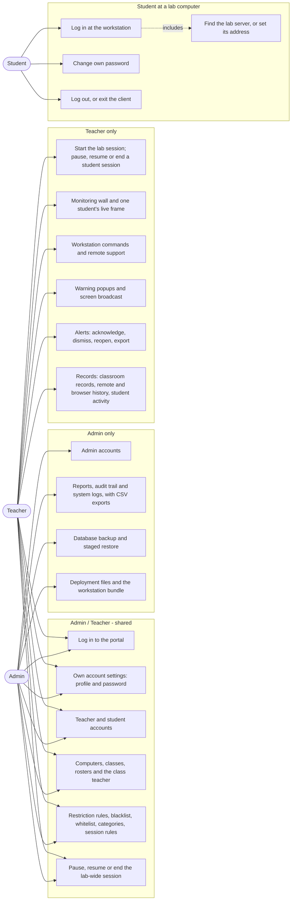

# CAMS Use Case Diagram

An editable draw.io copy sits beside this file: [`CAMS-Use-Case-Diagram.drawio`](CAMS-Use-Case-Diagram.drawio). One page, 26 system use case boxes, 91 use cases, with four `<<include>>` and forty `<<extend>>` arrows, and one actor named *Admin / Teacher* beside each of the twelve boxes the two share. Every use case is a goal the actor gets done, named verb first, and each one maps to the functions that implement it. Five rules shape it:

- **Overlap is drawn once.** The Admin and the Teacher share most of the portal, so the twelve boxes they share are drawn once, under **ADMIN / TEACHER**, each with a single actor named for both roles and no generalization arrow. A use case only one of them has stays in that actor's own boxes: START LAB SESSION, which only the Teacher has, sits in the Teacher's CONTROL STUDENT SESSION.
- **A list is a View use case, and what is done on it extends it.** Every page that lists records has a base VIEW use case joined to the actor, and the actions done to a record on that list - Edit, Delete, Export, Enroll, Assign and the like - `<<extend>>` it. Create, Import, Add and Register are started from the page itself, so they are base use cases of their own. A page that only shows information, with nothing to extend it, is not drawn.
- **Delete only for the policies CAMS deletes.** Restriction rules, blacklist entries, whitelist entries and categories are removed for good (DELETE RESTRICTION, DELETE BLACKLIST ENTRY, DELETE WHITELIST ENTRY, DELETE CATEGORY). Accounts, classes, computers and session rules are deactivated or archived instead and keep their history. Of those, only an account's Deactivate / Activate button is drawn, as TOGGLE TEACHER STATUS, TOGGLE STUDENT STATUS and TOGGLE ADMIN STATUS.
- **Short names.** A use case name has at most three words and no "to", "and" or "or". A name that would run to four words drops "List" (VIEW AUDIT LOG, VIEW CLASS STUDENT). VIEW STUDENT LIVE FRAME is the one four-word name. Every name says "Log In" or "Log Out", never "Sign".
- **One goal, one use case.** Locking, unlocking, logging out, restarting, shutting down and remotely supporting a workstation are all CONTROL WORKSTATION, done from VIEW STUDENT LIVE FRAME; the four exports on Reports are EXPORT REPORT LIST; acknowledging, dismissing and reopening alerts are EDIT ALERT STATUS.

Each box carries its actor standing outside it on the left. The use cases an actor starts stand in the first column; one reached only through `<<include>>` or `<<extend>>` stands in a column to the right, with no line to an actor. The drawing itself carries no figure numbers - those belong to the written use cases, where each box is reproduced under a numbered caption (*Figure 3.3: System Use Case for Process Log In* to *Figure 3.28*) in the Word and PDF copies, followed by one written use case for every base use case in it, 48 in all. Open the drawing at [app.diagrams.net](https://app.diagrams.net) with **File > Open From > Device**.

| Section | Boxes | Use cases | Written use cases |
| --- | ---: | ---: | ---: |
| Admin / Teacher (shared) | 12 | 47 | 25 |
| Admin only | 5 | 16 | 9 |
| Teacher only | 6 | 22 | 10 |
| Student | 3 | 6 | 4 |

What is left out is left out on purpose, and each exclusion can be named. Pages that only show information - the two dashboards, LAN Status, Lab Utilization, the timeline, class analytics, and the history of a computer or of an alert - are not drawn. The deletes, archives and unlocks of accounts, classes and computers still in the code - `DeleteAdmin`, `DeleteTeacher`, `ArchiveClass`, `DeleteClass`, `DeleteComputer`, `PermanentlyDeleteComputer` and `UnlockAccount` - are not drawn, and neither is `DeleteSessionRule`, which only deactivates the rule. Logging out of the portal (`AccountController.Logout`) is not drawn; the Student's LOG OUT WORKSTATION is. The Roles page (`CreateRole`, `DeleteRole`) is not drawn because CAMS roles are fixed: the Roles table is descriptive and grants nothing. `TeacherController.AssignTeacher` is not drawn because it always refuses (*Only administrators can assign or reassign teachers.*); assigning a class's teacher is done on the lab-wide class page, by either role. Nothing in the interface calls `SendNotification` on the hub or on `TeacherController`, and a use case nobody can reach is not a use case. `DeploymentPingController` answers the installer script's check that the server is reachable, not anything a student does. `Error` and `AccessDenied` are error pages, `OnConnectedAsync` and `OnDisconnectedAsync` are SignalR lifecycle callbacks, and the hub methods the client agent calls on its own - `FetchRestrictions`, `ReportWebsiteActivity`, `ReportIdleStatus`, `ReportBrowserMonitoringStatus`, `ReportTelemetryBatch` and `ReportInfraction`, and `ReportActiveApp`, which the server now accepts and drops - are the system's behaviour rather than any actor's goal. The whole of `StudentController` stays out because the student web portal is closed by design: `AccountController.Login` answers a student with *"This portal is for teachers and administrators. Sign in on the CAMS Student Client on your workstation instead"*, so a student reaches CAMS only through the client.

Three of the student's use cases have no controller action behind them: FIND LAB SERVER (`MainForm.GetServerUrlAsync` and `ServerDiscoveryClient.DiscoverAsync`), SET SERVER ADDRESS (`MainForm.ShowServerUrlDialog`) and EXIT CLIENT AGENT (`MainForm.ExitFromTray`) are handlers in the Windows client. LOG IN WORKSTATION, LOG OUT WORKSTATION and CHANGE PASSWORD pair the client with `ClientAuthController`.

The actors use fixed roles. Every authenticated operation includes server-side role and object-scope validation; CAMS does not expose configurable RBAC.

There are three actors, **Administrator**, **Teacher** and **Student**. Where the Administrator and the Teacher share a box, it has one actor named Admin / Teacher. The line between the administrator and the teacher is read off the code rather than assumed: `AdminController` is `[Authorize(Roles = AdminOrTeacher)]`, and its authorization filter admits a teacher only to actions marked `[TeacherSharedAction]`. Sixty of its actions carry that attribute - peer teacher accounts, student accounts, computers, classes and their teacher, rosters, restriction rules, lists, categories, session rules, and lab-wide pause, resume and end - so that whole shared surface is drawn once. The administrator keeps what is not shared: administrator accounts, reports, audit and system logs, and everything in `AdminDatabaseController` and `AdminDeploymentController`. The teacher keeps the classroom: student sessions, the monitoring wall, workstation commands, messages, alerts and records.

On the lab-wide pages a teacher has the administrator's reach: any class, rule or student there can be changed by either of them, and either can assign a class's teacher. "Only their own" applies on the teacher's own pages - My Class List, My Students and Class Restrictions - which reach the same use cases for the teacher's own records.

One asymmetry is worth knowing because it looks like a mistake and is not: the administrator can pause, resume and end a laboratory-wide session but cannot start one. `AdminController` exposes `PauseAllSessions`, `ResumeAllSessions` and `EndAllSessions` and no start; starting the lab is `TeacherController.StartSession`, the Teacher's START LAB SESSION, which is why it sits in the Teacher's own box rather than a shared one. The diagram follows the code.

The workstation client and the hosted background workers are **not** actors. They are parts of the system, so what they do is drawn as included behaviour of the case a person actually starts: reporting the websites a student opens and the idle state runs inside the client for as long as a student is logged in and is not drawn at all, finding the server is included by LOG IN WORKSTATION, and streaming each screen is included by OPEN MONITORING WALL. The client no longer reports the application in front of the student; usage is websites only.

```mermaid
flowchart LR
    ADMIN([Admin])
    TEACHER([Teacher])
    STUDENT([Student])

    subgraph Shared[Admin / Teacher - shared]
        S1[Log in to the portal]
        S2[Own account settings: profile and password]
        S3[Teacher and student accounts]
        S4[Computers, classes, rosters and the class teacher]
        S5[Restriction rules, blacklist, whitelist, categories, session rules]
        S6[Pause, resume or end the lab-wide session]
    end

    subgraph AdminUse[Admin only]
        A1[Admin accounts]
        A2[Reports, audit trail and system logs, with CSV exports]
        A3[Database backup and staged restore]
        A4[Deployment files and the workstation bundle]
    end

    subgraph TeacherUse[Teacher only]
        T1[Start the lab session; pause, resume or end a student session]
        T2[Monitoring wall and one student's live frame]
        T3[Workstation commands and remote support]
        T4[Warning popups and screen broadcast]
        T5[Alerts: acknowledge, dismiss, reopen, export]
        T6[Records: classroom records, remote and browser history, student activity]
    end

    subgraph StudentUse[Student at a lab computer]
        C1[Log in at the workstation]
        C2[Find the lab server, or set its address]
        C3[Change own password]
        C4[Log out, or exit the client]
        C1 -. includes .-> C2
    end

    ADMIN --> S1
    ADMIN --> S2
    ADMIN --> S3
    ADMIN --> S4
    ADMIN --> S5
    ADMIN --> S6
    TEACHER --> S1
    TEACHER --> S2
    TEACHER --> S3
    TEACHER --> S4
    TEACHER --> S5
    TEACHER --> S6
    ADMIN --> A1
    ADMIN --> A2
    ADMIN --> A3
    ADMIN --> A4
    TEACHER --> T1
    TEACHER --> T2
    TEACHER --> T3
    TEACHER --> T4
    TEACHER --> T5
    TEACHER --> T6
    STUDENT --> C1
    STUDENT --> C3
    STUDENT --> C4
```

## Scope And Limits

| Actor | Boundary |
| --- | --- |
| Admin | Global controls and deployment administration through the portal. LAN Status is read-only and does not configure DHCP, DNS or network adapters. |
| Teacher | Active teachers can monitor and control all connected student clients and use lab-wide pause, resume and end. Explicitly shared `/Admin/...` actions give them the lab-wide account, class, roster, computer and policy pages. Individual session actions, the teacher's own `/Teacher/...` pages, and the records and analytics keep their teacher or class checks. Admin-only administration remains restricted. |
| Student | Uses the Windows client only: logs in at a lab computer, works under monitoring and the website rules, changes their own password, and logs out. The web portal refuses a student account. |

Windows execution remains subject to the target environment. In particular, CAMS unlock cannot unlock the Windows secure desktop, 50 ms is a capture target rather than guaranteed FPS, and restart, shutdown and remote input must be validated under local policy.
