# CAMS Written Use Cases

A written specification for every use case in [`CAMS-Use-Case-Diagram.drawio`](CAMS-Use-Case-Diagram.drawio), set out in the ten fields the course handout uses: use case name, purpose, actors, input parameters, output parameters, pre-condition, post-condition, successful scenario, exception scenario and additional remarks.

**204 use cases** across 29 modules. Each one is named after the function that implements it, and the inputs, HTTP verb and authorisation rule in each specification are read out of that function rather than written from memory, so a specification cannot claim a parameter the action does not take.

| Actor | Use cases | Modules |
| --- | ---: | ---: |
| Admin | 85 | 17 |
| Teacher | 102 | 18 |
| Student | 17 | 6 |

---

## Contents

**ADMIN**  
- PROCESS LOG IN — A-001, A-002
- VIEW ADMIN HOME — A-003, A-004, A-005, A-006
- MANAGE ADMIN ACCOUNT — A-007, A-008, A-009
- MANAGE TEACHER ACCOUNT — A-010, A-011, A-012, A-013, A-014, A-015
- MANAGE STUDENT ACCOUNT — A-016, A-017, A-018, A-019, A-020, A-021
- MANAGE COMPUTER PROFILE — A-022, A-023, A-024, A-025, A-026, A-027, A-028
- MANAGE CLASS — A-029, A-030, A-031, A-032, A-033, A-034
- MANAGE CLASS ROSTER — A-035, A-036, A-037, A-038, A-039, A-040
- MANAGE RESTRICTION RULE — A-041, A-042, A-043, A-044
- MANAGE BLACKLIST AND WHITELIST — A-045, A-046, A-047, A-048, A-049, A-050, A-051
- MANAGE CATEGORY — A-052, A-053, A-054, A-055, A-056, A-057
- MANAGE SESSION RULE — A-058, A-059, A-060, A-061
- MANAGE ROLE AND PERMISSION — A-062, A-063, A-064
- CONTROL LABORATORY SESSION — A-065, A-066, A-067
- VIEW REPORTS AND LOGS — A-068, A-069, A-070, A-071, A-072, A-073, A-074, A-075, A-076
- MANAGE DATABASE — A-077, A-078, A-079, A-080
- MANAGE DEPLOYMENT — A-081, A-082, A-083, A-084, A-085

**TEACHER**  
- PROCESS LOG IN — T-086, T-087
- MANAGE OWN ACCOUNT — T-088, T-089
- MANAGE PEER TEACHER ACCOUNT — T-090, T-091, T-092, T-093, T-094, T-095
- MANAGE STUDENT ACCOUNT — T-096, T-097, T-098, T-099, T-100, T-101
- MANAGE COMPUTER PROFILE — T-102, T-103, T-104, T-105, T-106, T-107, T-108
- MANAGE CLASS — T-109, T-110, T-111, T-112, T-113, T-114
- MANAGE CLASS ROSTER — T-115, T-116, T-117, T-118, T-119
- MANAGE RESTRICTION RULE — T-120, T-121, T-122, T-123
- MANAGE BLACKLIST AND WHITELIST — T-124, T-125, T-126, T-127, T-128, T-129, T-130
- MANAGE CATEGORY — T-131, T-132, T-133, T-134, T-135, T-136
- MANAGE SESSION RULE — T-137, T-138, T-139, T-140
- CONTROL LABORATORY SESSION — T-141, T-142, T-143, T-144
- CONTROL STUDENT SESSION — T-145, T-146, T-147, T-148
- MONITOR STUDENT SCREEN — T-149, T-150, T-151, T-152
- CONTROL STUDENT WORKSTATION — T-153, T-154, T-155, T-156, T-157, T-158, T-159, T-160, T-161, T-162
- SEND MESSAGE TO STUDENT — T-163, T-164, T-165, T-166
- MANAGE MONITORING ALERT — T-167, T-168, T-169, T-170, T-171, T-172, T-173, T-174
- VIEW TEACHER RECORDS — T-175, T-176, T-177, T-178, T-179, T-180, T-181, T-182, T-183, T-184, T-185, T-186, T-187

**STUDENT**  
- PROCESS LOG IN — S-188, S-189
- LOG IN AT WORKSTATION — S-190, S-191, S-192
- WORK AT MONITORED WORKSTATION — S-193, S-194, S-195, S-196, S-197, S-198, S-199
- VIEW STUDENT SESSION — S-200
- MANAGE STUDENT ALERT — S-201, S-202
- MANAGE STUDENT ACCOUNT — S-203, S-204

---

# ADMIN

## PROCESS LOG IN  ·  `AccountController`

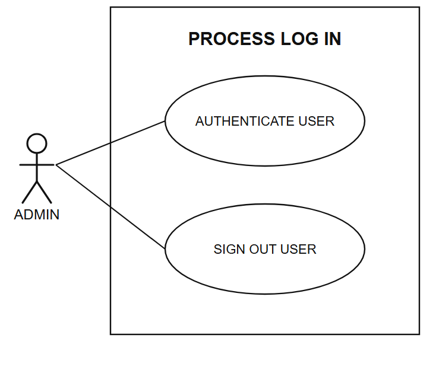

*Figure 3.1: System Use Case for process log in*

### A-001  ·  AUTHENTICATE USER

**Use Case Name:** AUTHENTICATE USER  
**Purpose:** Let a person sign in to the CAMS web portal with a username and password, and place them in the part of the system their role allows.  
**Actors:**

- Admin (Primary Actor)

**Input Parameters:**

- `username` : `string`
- `password` : `string`

**Output Parameters:**

- An authentication cookie carrying the account role as a claim, and a redirect to the landing page for that role.

**Pre-Condition:**

- None. This is the sign-in endpoint and is reachable without an account session; the CAMS server must be running and reachable.

**Post-Condition:**

- The change is committed to the database and visible to the next read.
- The caller sees the outcome reported on the page they return to.

**Successful Scenario:**

1. The Admin opens the CAMS sign-in page.
2. The Admin enters a username and a password and submits the form.
3. The server validates the antiforgery token that accompanied the form.
4. The server checks the credentials against each account table in turn and finds the matching account.
5. The server confirms the account is active and not locked out.
6. The server issues an authentication cookie carrying the role as a claim.
7. The Admin is redirected to the landing page for that role.

**Exception Scenario:**

- **The username matches no account** — the page reports that the sign-in failed, without saying which half was wrong.
- **The password does not match the stored hash** — the failed-attempt counter is raised and the same message is shown.
- **The account is locked out** — the sign-in is refused until the lockout expires, even with the right password.
- **The account is deactivated** — the sign-in is refused and the person is told to contact an administrator.

**Additional Remarks:**

- Implemented by `AccountController.Login` (POST).
- Appears in the *PROCESS LOG IN* module of the use case diagram.

### A-002  ·  SIGN OUT USER

**Use Case Name:** SIGN OUT USER  
**Purpose:** End the signed-in session and clear the authentication cookie, so the next visitor to the browser starts as an anonymous user.  
**Actors:**

- Admin (Primary Actor)

**Input Parameters:**

- None beyond the signed-in identity carried on the authentication cookie.

**Output Parameters:**

- The authentication cookie is cleared and the browser is returned to the sign-in page.

**Pre-Condition:**

- The caller is signed in.

**Post-Condition:**

- The change is committed to the database and visible to the next read.
- The caller sees the outcome reported on the page they return to.

**Successful Scenario:**

1. The Admin chooses to sign out.
2. The server closes any lab session the account still has open.
3. The server clears the authentication cookie.
4. The browser is returned to the sign-in page as an anonymous visitor.

**Exception Scenario:**

- **Not signed in or wrong role** — the request is refused and the caller is sent to the access denied page.
- **Validation fails** — the form is redisplayed with the offending fields marked and nothing is written.

**Additional Remarks:**

- Implemented by `AccountController.Logout` (POST).
- Appears in the *PROCESS LOG IN* module of the use case diagram.

## VIEW ADMIN HOME  ·  `AdminController`

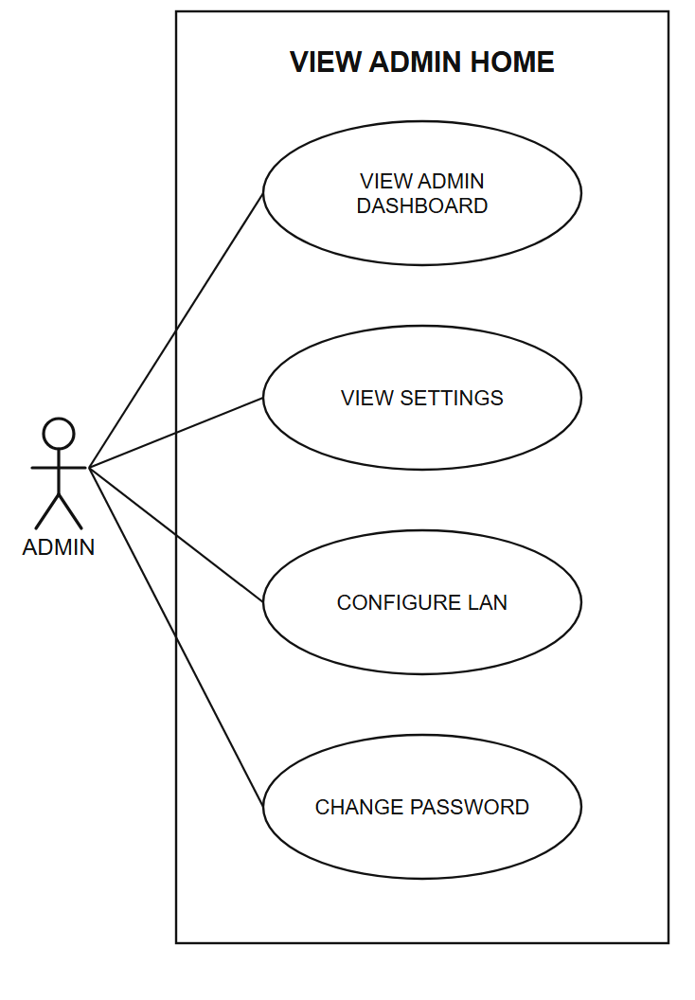

*Figure 3.2: System Use Case for view admin home*

### A-003  ·  VIEW ADMIN DASHBOARD

**Use Case Name:** VIEW ADMIN DASHBOARD  
**Purpose:** Show the administrator landing page, summarising the state of the laboratory.  
**Actors:**

- Admin (Primary Actor)

**Input Parameters:**

- None beyond the signed-in identity carried on the authentication cookie.

**Output Parameters:**

- The rendered page, or a JSON payload where the caller is the page’s own script.

**Pre-Condition:**

- The caller is signed in as an administrator or a teacher. A teacher reaches this action only because it carries `[TeacherSharedAction]`; the teacher account must also be active.

**Post-Condition:**

- The caller has the requested information. Nothing in the database has changed.

**Successful Scenario:**

1. The Admin opens the page and CAMS confirms the role on the authentication cookie.
2. The server reads the records the caller is entitled to see.
3. The page renders with those records.

**Exception Scenario:**

- **Not signed in or wrong role** — the request is refused and the caller is sent to the access denied page.

**Additional Remarks:**

- Implemented by `AdminController.Index` (GET).
- Appears in the *VIEW ADMIN HOME* module of the use case diagram.

### A-004  ·  VIEW SETTINGS

**Use Case Name:** VIEW SETTINGS  
**Purpose:** Show the settings page for the signed-in user.  
**Actors:**

- Admin (Primary Actor)

**Input Parameters:**

- None beyond the signed-in identity carried on the authentication cookie.

**Output Parameters:**

- The rendered page, or a JSON payload where the caller is the page’s own script.

**Pre-Condition:**

- The caller is signed in as an administrator or a teacher.

**Post-Condition:**

- The caller has the requested information. Nothing in the database has changed.

**Successful Scenario:**

1. The Admin opens the page and CAMS confirms the role on the authentication cookie.
2. The server reads the records the caller is entitled to see.
3. The page renders with those records.

**Exception Scenario:**

- **Not signed in or wrong role** — the request is refused and the caller is sent to the access denied page.

**Additional Remarks:**

- Implemented by `AdminController.Settings` (GET).
- Appears in the *VIEW ADMIN HOME* module of the use case diagram.

### A-005  ·  CONFIGURE LAN

**Use Case Name:** CONFIGURE LAN  
**Purpose:** Show the network configuration the server detected, as a read-only diagnostic.  
**Actors:**

- Admin (Primary Actor)

**Input Parameters:**

- None beyond the signed-in identity carried on the authentication cookie.

**Output Parameters:**

- The rendered page, or a JSON payload where the caller is the page’s own script.

**Pre-Condition:**

- The caller is signed in as an administrator or a teacher.

**Post-Condition:**

- The caller has the requested information. Nothing in the database has changed.

**Successful Scenario:**

1. The Admin opens the page and CAMS confirms the role on the authentication cookie.
2. The server reads the records the caller is entitled to see.
3. The page renders with those records.

**Exception Scenario:**

- **Not signed in or wrong role** — the request is refused and the caller is sent to the access denied page.

**Additional Remarks:**

- Implemented by `AdminController.LanConfig` (GET).
- Appears in the *VIEW ADMIN HOME* module of the use case diagram.

### A-006  ·  CHANGE PASSWORD

**Use Case Name:** CHANGE PASSWORD  
**Purpose:** Let the signed-in user replace their own password after proving they know the current one.  
**Actors:**

- Admin (Primary Actor)

**Input Parameters:**

- `input` : `PasswordChangeInput`

**Output Parameters:**

- A redirect back to the listing page, carrying a success or failure message for display.

**Pre-Condition:**

- The caller is signed in as an administrator or a teacher.

**Post-Condition:**

- The change is committed to the database and visible to the next read.
- The caller sees the outcome reported on the page they return to.

**Successful Scenario:**

1. The Admin opens the page and CAMS confirms the role on the authentication cookie.
2. The Admin fills the form and submits it.
3. The server validates the antiforgery token that accompanied the form.
4. The server validates the submitted values against the model rules.
5. The change is written to the database through `ApplicationDbContext`.
6. The server redirects back to the listing, where the result is shown.

**Exception Scenario:**

- **Not signed in or wrong role** — the request is refused and the caller is sent to the access denied page.
- **Missing or stale antiforgery token** — the submission is rejected and must be retried from a freshly loaded form.
- **Validation fails** — the form is redisplayed with the offending fields marked and nothing is written.

**Additional Remarks:**

- Implemented by `AdminController.ChangePassword` (POST).
- Appears in the *VIEW ADMIN HOME* module of the use case diagram.

## MANAGE ADMIN ACCOUNT  ·  `AdminController`

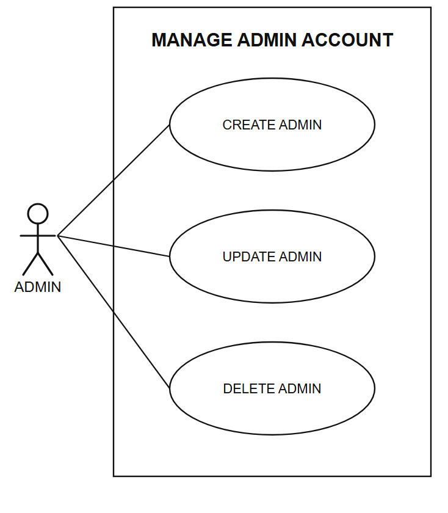

*Figure 3.3: System Use Case for manage admin account*

### A-007  ·  CREATE ADMIN

**Use Case Name:** CREATE ADMIN  
**Purpose:** Record a new administrator account in the system.  
**Actors:**

- Admin (Primary Actor)

**Input Parameters:**

- `admin` : `Admin`

**Output Parameters:**

- A redirect back to the listing page, carrying a success or failure message for display.

**Pre-Condition:**

- The caller is signed in as an administrator or a teacher.

**Post-Condition:**

- The change is committed to the database and visible to the next read.
- The caller sees the outcome reported on the page they return to.

**Successful Scenario:**

1. The Admin opens the page and CAMS confirms the role on the authentication cookie.
2. The Admin fills the form and submits it.
3. The server validates the antiforgery token that accompanied the form.
4. The server validates the submitted values against the model rules.
5. The change is written to the database through `ApplicationDbContext`.
6. The server redirects back to the listing, where the result is shown.

**Exception Scenario:**

- **Not signed in or wrong role** — the request is refused and the caller is sent to the access denied page.
- **Missing or stale antiforgery token** — the submission is rejected and must be retried from a freshly loaded form.
- **Validation fails** — the form is redisplayed with the offending fields marked and nothing is written.

**Additional Remarks:**

- Implemented by `AdminController.CreateAdmin` (POST).
- Appears in the *MANAGE ADMIN ACCOUNT* module of the use case diagram.

### A-008  ·  UPDATE ADMIN

**Use Case Name:** UPDATE ADMIN  
**Purpose:** Amend the stored details of an existing administrator account.  
**Actors:**

- Admin (Primary Actor)

**Input Parameters:**

- `admin` : `Admin`
- `newPassword` : `string?`

**Output Parameters:**

- A redirect back to the listing page, carrying a success or failure message for display.

**Pre-Condition:**

- The caller is signed in as an administrator or a teacher.

**Post-Condition:**

- The change is committed to the database and visible to the next read.
- The caller sees the outcome reported on the page they return to.

**Successful Scenario:**

1. The Admin opens the page and CAMS confirms the role on the authentication cookie.
2. The Admin fills the form and submits it.
3. The server validates the antiforgery token that accompanied the form.
4. The server validates the submitted values against the model rules.
5. The change is written to the database through `ApplicationDbContext`.
6. The server redirects back to the listing, where the result is shown.

**Exception Scenario:**

- **Not signed in or wrong role** — the request is refused and the caller is sent to the access denied page.
- **Missing or stale antiforgery token** — the submission is rejected and must be retried from a freshly loaded form.
- **Validation fails** — the form is redisplayed with the offending fields marked and nothing is written.

**Additional Remarks:**

- Implemented by `AdminController.UpdateAdmin` (POST).
- Appears in the *MANAGE ADMIN ACCOUNT* module of the use case diagram.

### A-009  ·  DELETE ADMIN

**Use Case Name:** DELETE ADMIN  
**Purpose:** Remove a administrator account from the system.  
**Actors:**

- Admin (Primary Actor)

**Input Parameters:**

- `id` : `int`

**Output Parameters:**

- A redirect back to the listing page, carrying a success or failure message for display.

**Pre-Condition:**

- The caller is signed in as an administrator or a teacher.
- The record named by the identifier exists.

**Post-Condition:**

- The change is committed to the database and visible to the next read.
- The caller sees the outcome reported on the page they return to.

**Successful Scenario:**

1. The Admin opens the page and CAMS confirms the role on the authentication cookie.
2. The Admin fills the form and submits it.
3. The server validates the antiforgery token that accompanied the form.
4. The server validates the submitted values against the model rules.
5. The change is written to the database through `ApplicationDbContext`.
6. The server redirects back to the listing, where the result is shown.

**Exception Scenario:**

- **Not signed in or wrong role** — the request is refused and the caller is sent to the access denied page.
- **Missing or stale antiforgery token** — the submission is rejected and must be retried from a freshly loaded form.
- **Validation fails** — the form is redisplayed with the offending fields marked and nothing is written.
- **The identifier matches no record** — the action reports that the record was not found and makes no change.
- **The record is still referenced** — the deletion is refused rather than leaving dangling references.

**Additional Remarks:**

- Implemented by `AdminController.DeleteAdmin` (POST).
- Appears in the *MANAGE ADMIN ACCOUNT* module of the use case diagram.

## MANAGE TEACHER ACCOUNT  ·  `AdminController`

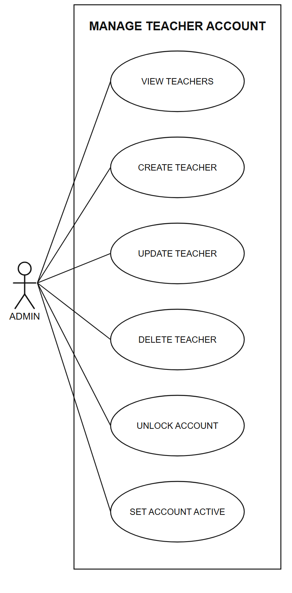

*Figure 3.4: System Use Case for manage teacher account*

### A-010  ·  VIEW TEACHERS

**Use Case Name:** VIEW TEACHERS  
**Purpose:** List the teachers the signed-in user is allowed to see.  
**Actors:**

- Admin (Primary Actor)

**Input Parameters:**

- None beyond the signed-in identity carried on the authentication cookie.

**Output Parameters:**

- The rendered page, or a JSON payload where the caller is the page’s own script.

**Pre-Condition:**

- The caller is signed in as an administrator or a teacher. A teacher reaches this action only because it carries `[TeacherSharedAction]`; the teacher account must also be active.

**Post-Condition:**

- The caller has the requested information. Nothing in the database has changed.

**Successful Scenario:**

1. The Admin opens the page and CAMS confirms the role on the authentication cookie.
2. The server reads the records the caller is entitled to see.
3. The page renders with those records.

**Exception Scenario:**

- **Not signed in or wrong role** — the request is refused and the caller is sent to the access denied page.

**Additional Remarks:**

- Implemented by `AdminController.Teachers` (GET).
- Appears in the *MANAGE TEACHER ACCOUNT* module of the use case diagram.

### A-011  ·  CREATE TEACHER

**Use Case Name:** CREATE TEACHER  
**Purpose:** Record a new teacher account in the system.  
**Actors:**

- Admin (Primary Actor)

**Input Parameters:**

- `teacher` : `Teacher`

**Output Parameters:**

- A redirect back to the listing page, carrying a success or failure message for display.

**Pre-Condition:**

- The caller is signed in as an administrator or a teacher. A teacher reaches this action only because it carries `[TeacherSharedAction]`; the teacher account must also be active.

**Post-Condition:**

- The change is committed to the database and visible to the next read.
- The caller sees the outcome reported on the page they return to.

**Successful Scenario:**

1. The Admin opens the page and CAMS confirms the role on the authentication cookie.
2. The Admin fills the form and submits it.
3. The server validates the antiforgery token that accompanied the form.
4. The server validates the submitted values against the model rules.
5. The change is written to the database through `ApplicationDbContext`.
6. The server redirects back to the listing, where the result is shown.

**Exception Scenario:**

- **Not signed in or wrong role** — the request is refused and the caller is sent to the access denied page.
- **Missing or stale antiforgery token** — the submission is rejected and must be retried from a freshly loaded form.
- **Validation fails** — the form is redisplayed with the offending fields marked and nothing is written.

**Additional Remarks:**

- Implemented by `AdminController.CreateTeacher` (POST).
- Appears in the *MANAGE TEACHER ACCOUNT* module of the use case diagram.

### A-012  ·  UPDATE TEACHER

**Use Case Name:** UPDATE TEACHER  
**Purpose:** Amend the stored details of an existing teacher account.  
**Actors:**

- Admin (Primary Actor)

**Input Parameters:**

- `teacher` : `Teacher`
- `newPassword` : `string?`

**Output Parameters:**

- A redirect back to the listing page, carrying a success or failure message for display.

**Pre-Condition:**

- The caller is signed in as an administrator or a teacher. A teacher reaches this action only because it carries `[TeacherSharedAction]`; the teacher account must also be active.

**Post-Condition:**

- The change is committed to the database and visible to the next read.
- The caller sees the outcome reported on the page they return to.

**Successful Scenario:**

1. The Admin opens the page and CAMS confirms the role on the authentication cookie.
2. The Admin fills the form and submits it.
3. The server validates the antiforgery token that accompanied the form.
4. The server validates the submitted values against the model rules.
5. The change is written to the database through `ApplicationDbContext`.
6. The server redirects back to the listing, where the result is shown.

**Exception Scenario:**

- **Not signed in or wrong role** — the request is refused and the caller is sent to the access denied page.
- **Missing or stale antiforgery token** — the submission is rejected and must be retried from a freshly loaded form.
- **Validation fails** — the form is redisplayed with the offending fields marked and nothing is written.

**Additional Remarks:**

- Implemented by `AdminController.UpdateTeacher` (POST).
- Appears in the *MANAGE TEACHER ACCOUNT* module of the use case diagram.

### A-013  ·  DELETE TEACHER

**Use Case Name:** DELETE TEACHER  
**Purpose:** Remove a teacher account from the system.  
**Actors:**

- Admin (Primary Actor)

**Input Parameters:**

- `id` : `int`

**Output Parameters:**

- A redirect back to the listing page, carrying a success or failure message for display.

**Pre-Condition:**

- The caller is signed in as an administrator or a teacher. A teacher reaches this action only because it carries `[TeacherSharedAction]`; the teacher account must also be active.
- The record named by the identifier exists.

**Post-Condition:**

- The change is committed to the database and visible to the next read.
- The caller sees the outcome reported on the page they return to.

**Successful Scenario:**

1. The Admin opens the page and CAMS confirms the role on the authentication cookie.
2. The Admin fills the form and submits it.
3. The server validates the antiforgery token that accompanied the form.
4. The server validates the submitted values against the model rules.
5. The change is written to the database through `ApplicationDbContext`.
6. The server redirects back to the listing, where the result is shown.

**Exception Scenario:**

- **Not signed in or wrong role** — the request is refused and the caller is sent to the access denied page.
- **Missing or stale antiforgery token** — the submission is rejected and must be retried from a freshly loaded form.
- **Validation fails** — the form is redisplayed with the offending fields marked and nothing is written.
- **The identifier matches no record** — the action reports that the record was not found and makes no change.
- **The record is still referenced** — the deletion is refused rather than leaving dangling references.

**Additional Remarks:**

- Implemented by `AdminController.DeleteTeacher` (POST).
- Appears in the *MANAGE TEACHER ACCOUNT* module of the use case diagram.

### A-014  ·  UNLOCK ACCOUNT

**Use Case Name:** UNLOCK ACCOUNT  
**Purpose:** Clear the lockout on an account that has been locked by repeated failed sign-in attempts.  
**Actors:**

- Admin (Primary Actor)

**Input Parameters:**

- `accountRole` : `AccountRole`
- `id` : `int`

**Output Parameters:**

- A redirect back to the listing page, carrying a success or failure message for display.

**Pre-Condition:**

- The caller is signed in as an administrator or a teacher. A teacher reaches this action only because it carries `[TeacherSharedAction]`; the teacher account must also be active.
- The record named by the identifier exists.

**Post-Condition:**

- The change is committed to the database and visible to the next read.
- The caller sees the outcome reported on the page they return to.

**Successful Scenario:**

1. The Admin opens the page and CAMS confirms the role on the authentication cookie.
2. The Admin fills the form and submits it.
3. The server validates the antiforgery token that accompanied the form.
4. The server validates the submitted values against the model rules.
5. The change is written to the database through `ApplicationDbContext`.
6. The server redirects back to the listing, where the result is shown.

**Exception Scenario:**

- **Not signed in or wrong role** — the request is refused and the caller is sent to the access denied page.
- **Missing or stale antiforgery token** — the submission is rejected and must be retried from a freshly loaded form.
- **Validation fails** — the form is redisplayed with the offending fields marked and nothing is written.
- **The identifier matches no record** — the action reports that the record was not found and makes no change.

**Additional Remarks:**

- Implemented by `AdminController.UnlockAccount` (POST).
- Appears in the *MANAGE TEACHER ACCOUNT* module of the use case diagram.

### A-015  ·  TOGGLE ACCOUNT STATUS

**Use Case Name:** TOGGLE ACCOUNT STATUS  
**Purpose:** Activate or deactivate an account without deleting it, so a person can be kept out of the system while their records survive.  
**Actors:**

- Admin (Primary Actor)

**Input Parameters:**

- `accountRole` : `AccountRole`
- `id` : `int`
- `isActive` : `bool`

**Output Parameters:**

- A redirect back to the listing page, carrying a success or failure message for display.

**Pre-Condition:**

- The caller is signed in as an administrator or a teacher. A teacher reaches this action only because it carries `[TeacherSharedAction]`; the teacher account must also be active.
- The record named by the identifier exists.

**Post-Condition:**

- The change is committed to the database and visible to the next read.
- The caller sees the outcome reported on the page they return to.

**Successful Scenario:**

1. The Admin opens the page and CAMS confirms the role on the authentication cookie.
2. The Admin fills the form and submits it.
3. The server validates the antiforgery token that accompanied the form.
4. The server validates the submitted values against the model rules.
5. The change is written to the database through `ApplicationDbContext`.
6. The server redirects back to the listing, where the result is shown.

**Exception Scenario:**

- **Not signed in or wrong role** — the request is refused and the caller is sent to the access denied page.
- **Missing or stale antiforgery token** — the submission is rejected and must be retried from a freshly loaded form.
- **Validation fails** — the form is redisplayed with the offending fields marked and nothing is written.
- **The identifier matches no record** — the action reports that the record was not found and makes no change.

**Additional Remarks:**

- Implemented by `AdminController.SetAccountActive` (POST).
- Appears in the *MANAGE TEACHER ACCOUNT* module of the use case diagram.

## MANAGE STUDENT ACCOUNT  ·  `AdminController`

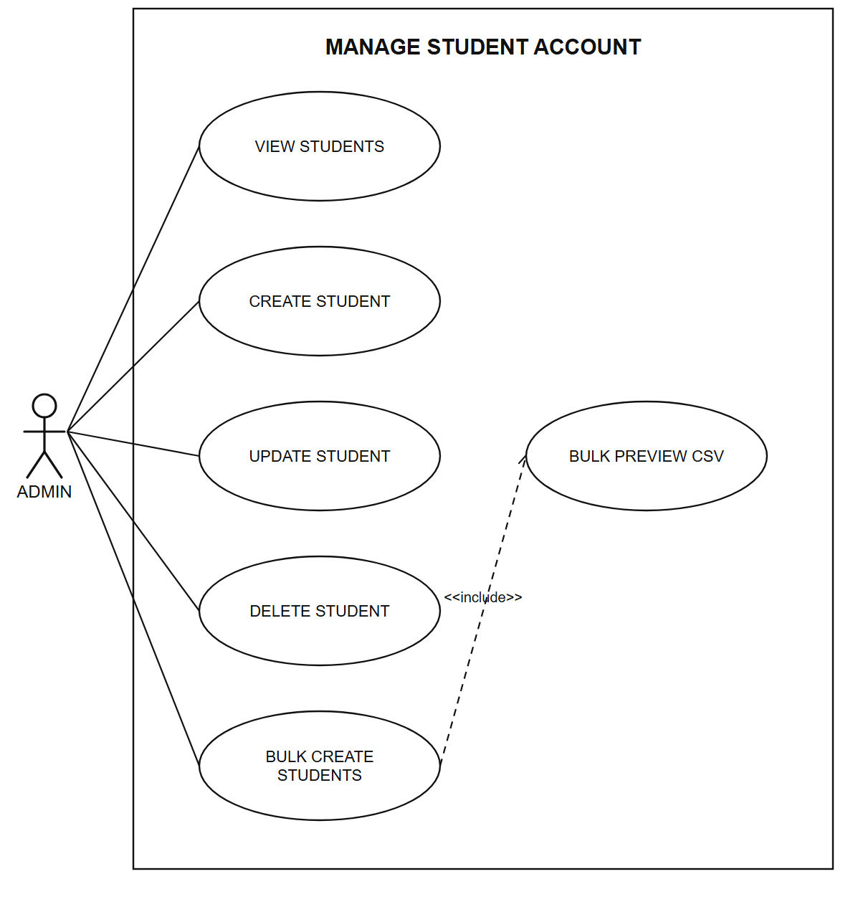

*Figure 3.5: System Use Case for manage student account*

### A-016  ·  VIEW STUDENTS

**Use Case Name:** VIEW STUDENTS  
**Purpose:** List the students the signed-in user is allowed to see.  
**Actors:**

- Admin (Primary Actor)

**Input Parameters:**

- None beyond the signed-in identity carried on the authentication cookie.

**Output Parameters:**

- The rendered page, or a JSON payload where the caller is the page’s own script.

**Pre-Condition:**

- The caller is signed in as an administrator or a teacher. A teacher reaches this action only because it carries `[TeacherSharedAction]`; the teacher account must also be active.

**Post-Condition:**

- The caller has the requested information. Nothing in the database has changed.

**Successful Scenario:**

1. The Admin opens the page and CAMS confirms the role on the authentication cookie.
2. The server reads the records the caller is entitled to see.
3. The page renders with those records.

**Exception Scenario:**

- **Not signed in or wrong role** — the request is refused and the caller is sent to the access denied page.

**Additional Remarks:**

- Implemented by `AdminController.Students` (GET).
- Appears in the *MANAGE STUDENT ACCOUNT* module of the use case diagram.

### A-017  ·  CREATE STUDENT

**Use Case Name:** CREATE STUDENT  
**Purpose:** Record a new student account in the system.  
**Actors:**

- Admin (Primary Actor)

**Input Parameters:**

- `student` : `Student`

**Output Parameters:**

- A redirect back to the listing page, carrying a success or failure message for display.

**Pre-Condition:**

- The caller is signed in as an administrator or a teacher. A teacher reaches this action only because it carries `[TeacherSharedAction]`; the teacher account must also be active.

**Post-Condition:**

- The change is committed to the database and visible to the next read.
- The caller sees the outcome reported on the page they return to.

**Successful Scenario:**

1. The Admin opens the page and CAMS confirms the role on the authentication cookie.
2. The Admin fills the form and submits it.
3. The server validates the antiforgery token that accompanied the form.
4. The server validates the submitted values against the model rules.
5. The change is written to the database through `ApplicationDbContext`.
6. The server redirects back to the listing, where the result is shown.

**Exception Scenario:**

- **Not signed in or wrong role** — the request is refused and the caller is sent to the access denied page.
- **Missing or stale antiforgery token** — the submission is rejected and must be retried from a freshly loaded form.
- **Validation fails** — the form is redisplayed with the offending fields marked and nothing is written.

**Additional Remarks:**

- Implemented by `AdminController.CreateStudent` (POST).
- Appears in the *MANAGE STUDENT ACCOUNT* module of the use case diagram.

### A-018  ·  UPDATE STUDENT

**Use Case Name:** UPDATE STUDENT  
**Purpose:** Amend the stored details of an existing student account.  
**Actors:**

- Admin (Primary Actor)

**Input Parameters:**

- `student` : `Student`
- `newPassword` : `string?`

**Output Parameters:**

- A redirect back to the listing page, carrying a success or failure message for display.

**Pre-Condition:**

- The caller is signed in as an administrator or a teacher. A teacher reaches this action only because it carries `[TeacherSharedAction]`; the teacher account must also be active.

**Post-Condition:**

- The change is committed to the database and visible to the next read.
- The caller sees the outcome reported on the page they return to.

**Successful Scenario:**

1. The Admin opens the page and CAMS confirms the role on the authentication cookie.
2. The Admin fills the form and submits it.
3. The server validates the antiforgery token that accompanied the form.
4. The server validates the submitted values against the model rules.
5. The change is written to the database through `ApplicationDbContext`.
6. The server redirects back to the listing, where the result is shown.

**Exception Scenario:**

- **Not signed in or wrong role** — the request is refused and the caller is sent to the access denied page.
- **Missing or stale antiforgery token** — the submission is rejected and must be retried from a freshly loaded form.
- **Validation fails** — the form is redisplayed with the offending fields marked and nothing is written.

**Additional Remarks:**

- Implemented by `AdminController.UpdateStudent` (POST).
- Appears in the *MANAGE STUDENT ACCOUNT* module of the use case diagram.

### A-019  ·  DELETE STUDENT

**Use Case Name:** DELETE STUDENT  
**Purpose:** Remove a student account from the system.  
**Actors:**

- Admin (Primary Actor)

**Input Parameters:**

- `id` : `int`

**Output Parameters:**

- A redirect back to the listing page, carrying a success or failure message for display.

**Pre-Condition:**

- The caller is signed in as an administrator or a teacher. A teacher reaches this action only because it carries `[TeacherSharedAction]`; the teacher account must also be active.
- The record named by the identifier exists.

**Post-Condition:**

- The change is committed to the database and visible to the next read.
- The caller sees the outcome reported on the page they return to.

**Successful Scenario:**

1. The Admin opens the page and CAMS confirms the role on the authentication cookie.
2. The Admin fills the form and submits it.
3. The server validates the antiforgery token that accompanied the form.
4. The server validates the submitted values against the model rules.
5. The change is written to the database through `ApplicationDbContext`.
6. The server redirects back to the listing, where the result is shown.

**Exception Scenario:**

- **Not signed in or wrong role** — the request is refused and the caller is sent to the access denied page.
- **Missing or stale antiforgery token** — the submission is rejected and must be retried from a freshly loaded form.
- **Validation fails** — the form is redisplayed with the offending fields marked and nothing is written.
- **The identifier matches no record** — the action reports that the record was not found and makes no change.
- **The record is still referenced** — the deletion is refused rather than leaving dangling references.

**Additional Remarks:**

- Implemented by `AdminController.DeleteStudent` (POST).
- Appears in the *MANAGE STUDENT ACCOUNT* module of the use case diagram.

### A-020  ·  IMPORT STUDENT ROSTER

**Use Case Name:** IMPORT STUDENT ROSTER  
**Purpose:** Create many student accounts in one operation from pasted or uploaded CSV rows.  
**Actors:**

- Admin (Primary Actor)

**Input Parameters:**

- `bulkFirstNames` : `List<string>?`
- `bulkLastNames` : `List<string>?`
- `bulkUserNames` : `List<string>?`
- `bulkPasswords` : `List<string>?`

**Output Parameters:**

- A redirect back to the listing page, carrying a success or failure message for display.

**Pre-Condition:**

- The caller is signed in as an administrator or a teacher. A teacher reaches this action only because it carries `[TeacherSharedAction]`; the teacher account must also be active.

**Post-Condition:**

- The change is committed to the database and visible to the next read.
- The caller sees the outcome reported on the page they return to.

**Successful Scenario:**

1. The Admin opens the page and CAMS confirms the role on the authentication cookie.
2. The Admin fills the form and submits it.
3. The server validates the antiforgery token that accompanied the form.
4. The server validates the submitted values against the model rules.
5. The change is written to the database through `ApplicationDbContext`.
6. The server redirects back to the listing, where the result is shown.

**Exception Scenario:**

- **Not signed in or wrong role** — the request is refused and the caller is sent to the access denied page.
- **Missing or stale antiforgery token** — the submission is rejected and must be retried from a freshly loaded form.
- **Validation fails** — the form is redisplayed with the offending fields marked and nothing is written.

**Additional Remarks:**

- Implemented by `AdminController.BulkCreateStudents` (POST).
- Appears in the *MANAGE STUDENT ACCOUNT* module of the use case diagram.
- Pulls in **PREVIEW ROSTER FILE** (`<<include>>`).

### A-021  ·  PREVIEW ROSTER FILE

**Use Case Name:** PREVIEW ROSTER FILE  
**Purpose:** Parse the submitted CSV and show what would be created, so mistakes are caught before any account exists.  
**Actors:**

- Admin (Primary Actor)
- None; this behaviour runs inside **IMPORT STUDENT ROSTER** (Secondary Actor)

**Input Parameters:**

- `classId` : `int`
- `file` : `IFormFile?`

**Output Parameters:**

- A redirect back to the listing page, carrying a success or failure message for display.

**Pre-Condition:**

- The caller is signed in as an administrator or a teacher. A teacher reaches this action only because it carries `[TeacherSharedAction]`; the teacher account must also be active.
- The record named by the identifier exists.
- **IMPORT STUDENT ROSTER** has reached the point where this is always performed.

**Post-Condition:**

- The change is committed to the database and visible to the next read.
- The caller sees the outcome reported on the page they return to.

**Successful Scenario:**

1. The Admin opens the page and CAMS confirms the role on the authentication cookie.
2. The Admin fills the form and submits it.
3. The server validates the antiforgery token that accompanied the form.
4. The server validates the submitted values against the model rules.
5. The change is written to the database through `ApplicationDbContext`.
6. The server redirects back to the listing, where the result is shown.

**Exception Scenario:**

- **Not signed in or wrong role** — the request is refused and the caller is sent to the access denied page.
- **Missing or stale antiforgery token** — the submission is rejected and must be retried from a freshly loaded form.
- **Validation fails** — the form is redisplayed with the offending fields marked and nothing is written.
- **The identifier matches no record** — the action reports that the record was not found and makes no change.

**Additional Remarks:**

- Implemented by `AdminController.BulkPreviewCsv` (POST).
- Appears in the *MANAGE STUDENT ACCOUNT* module of the use case diagram.
- Drawn as `<<include>>` from **IMPORT STUDENT ROSTER**.

## MANAGE COMPUTER PROFILE  ·  `AdminController`

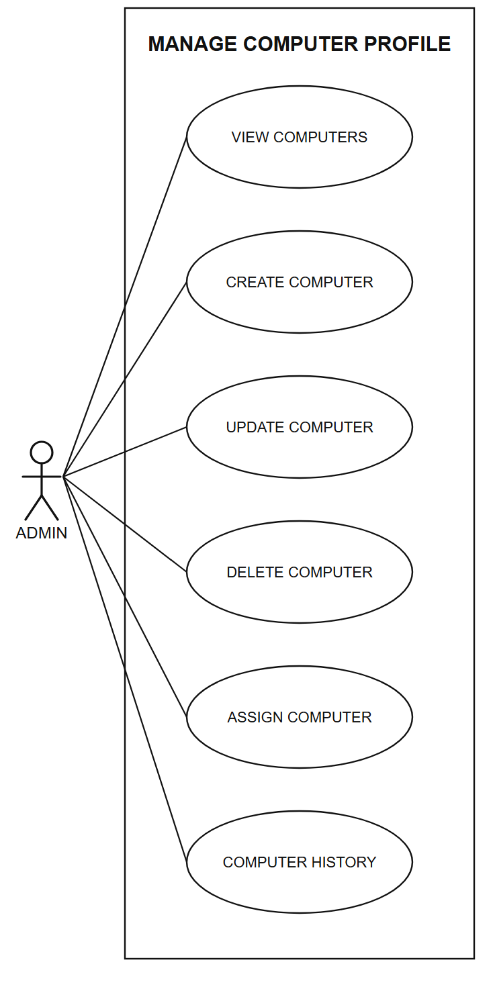

*Figure 3.6: System Use Case for manage computer profile*

### A-022  ·  VIEW COMPUTERS

**Use Case Name:** VIEW COMPUTERS  
**Purpose:** List the computers the signed-in user is allowed to see.  
**Actors:**

- Admin (Primary Actor)

**Input Parameters:**

- None beyond the signed-in identity carried on the authentication cookie.

**Output Parameters:**

- The rendered page, or a JSON payload where the caller is the page’s own script.

**Pre-Condition:**

- The caller is signed in as an administrator or a teacher. A teacher reaches this action only because it carries `[TeacherSharedAction]`; the teacher account must also be active.

**Post-Condition:**

- The caller has the requested information. Nothing in the database has changed.

**Successful Scenario:**

1. The Admin opens the page and CAMS confirms the role on the authentication cookie.
2. The server reads the records the caller is entitled to see.
3. The page renders with those records.

**Exception Scenario:**

- **Not signed in or wrong role** — the request is refused and the caller is sent to the access denied page.

**Additional Remarks:**

- Implemented by `AdminController.Computers` (GET).
- Appears in the *MANAGE COMPUTER PROFILE* module of the use case diagram.

### A-023  ·  REGISTER COMPUTER

**Use Case Name:** REGISTER COMPUTER  
**Purpose:** Record a new workstation profile in the system.  
**Actors:**

- Admin (Primary Actor)

**Input Parameters:**

- `computer` : `Computer`

**Output Parameters:**

- A redirect back to the listing page, carrying a success or failure message for display.

**Pre-Condition:**

- The caller is signed in as an administrator or a teacher. A teacher reaches this action only because it carries `[TeacherSharedAction]`; the teacher account must also be active.

**Post-Condition:**

- The change is committed to the database and visible to the next read.
- The caller sees the outcome reported on the page they return to.

**Successful Scenario:**

1. The Admin opens the page and CAMS confirms the role on the authentication cookie.
2. The Admin fills the form and submits it.
3. The server validates the antiforgery token that accompanied the form.
4. The server validates the submitted values against the model rules.
5. The change is written to the database through `ApplicationDbContext`.
6. The server redirects back to the listing, where the result is shown.

**Exception Scenario:**

- **Not signed in or wrong role** — the request is refused and the caller is sent to the access denied page.
- **Missing or stale antiforgery token** — the submission is rejected and must be retried from a freshly loaded form.
- **Validation fails** — the form is redisplayed with the offending fields marked and nothing is written.

**Additional Remarks:**

- Implemented by `AdminController.CreateComputer` (POST).
- Appears in the *MANAGE COMPUTER PROFILE* module of the use case diagram.

### A-024  ·  UPDATE COMPUTER

**Use Case Name:** UPDATE COMPUTER  
**Purpose:** Amend the stored details of an existing workstation profile.  
**Actors:**

- Admin (Primary Actor)

**Input Parameters:**

- `computer` : `Computer`

**Output Parameters:**

- A redirect back to the listing page, carrying a success or failure message for display.

**Pre-Condition:**

- The caller is signed in as an administrator or a teacher. A teacher reaches this action only because it carries `[TeacherSharedAction]`; the teacher account must also be active.

**Post-Condition:**

- The change is committed to the database and visible to the next read.
- The caller sees the outcome reported on the page they return to.

**Successful Scenario:**

1. The Admin opens the page and CAMS confirms the role on the authentication cookie.
2. The Admin fills the form and submits it.
3. The server validates the antiforgery token that accompanied the form.
4. The server validates the submitted values against the model rules.
5. The change is written to the database through `ApplicationDbContext`.
6. The server redirects back to the listing, where the result is shown.

**Exception Scenario:**

- **Not signed in or wrong role** — the request is refused and the caller is sent to the access denied page.
- **Missing or stale antiforgery token** — the submission is rejected and must be retried from a freshly loaded form.
- **Validation fails** — the form is redisplayed with the offending fields marked and nothing is written.

**Additional Remarks:**

- Implemented by `AdminController.UpdateComputer` (POST).
- Appears in the *MANAGE COMPUTER PROFILE* module of the use case diagram.

### A-025  ·  ARCHIVE COMPUTER

**Use Case Name:** ARCHIVE COMPUTER  
**Purpose:** Retire a workstation from the laboratory without erasing it. The record is marked archived and unassigned, so past lab sessions and status history still resolve to a named station. Refused while a lab session is running on it.  
**Actors:**

- Admin (Primary Actor)

**Input Parameters:**

- `id` : `int`

**Output Parameters:**

- A redirect back to the listing page, carrying a success or failure message for display.

**Pre-Condition:**

- The caller is signed in as an administrator or a teacher. A teacher reaches this action only because it carries `[TeacherSharedAction]`; the teacher account must also be active.
- The record named by the identifier exists.

**Post-Condition:**

- The change is committed to the database and visible to the next read.
- The caller sees the outcome reported on the page they return to.

**Successful Scenario:**

1. The Admin opens the page and CAMS confirms the role on the authentication cookie.
2. The Admin fills the form and submits it.
3. The server validates the antiforgery token that accompanied the form.
4. The server validates the submitted values against the model rules.
5. The change is written to the database through `ApplicationDbContext`.
6. The server redirects back to the listing, where the result is shown.

**Exception Scenario:**

- **Not signed in or wrong role** — the request is refused and the caller is sent to the access denied page.
- **Missing or stale antiforgery token** — the submission is rejected and must be retried from a freshly loaded form.
- **Validation fails** — the form is redisplayed with the offending fields marked and nothing is written.
- **The identifier matches no record** — the action reports that the record was not found and makes no change.
- **The record is still referenced** — the deletion is refused rather than leaving dangling references.

**Additional Remarks:**

- Implemented by `AdminController.DeleteComputer` (POST).
- Appears in the *MANAGE COMPUTER PROFILE* module of the use case diagram.

### A-026  ·  DELETE COMPUTER

**Use Case Name:** DELETE COMPUTER  
**Purpose:** Remove a workstation record outright, for a station entered by mistake or one that has left the laboratory for good. Past lab sessions are kept and merely lose their link to the station; the status history for the station is discarded. Refused while a lab session is running on it.  
**Actors:**

- Admin (Primary Actor)

**Input Parameters:**

- None beyond the signed-in identity carried on the authentication cookie.

**Output Parameters:**

- The behaviour completes and its effect is visible to the use case that includes it.

**Pre-Condition:**

- The caller is signed in.

**Post-Condition:**

- The caller has the requested information. Nothing in the database has changed.

**Successful Scenario:**

1. The including use case reaches the point where this behaviour is required.
2. The server runs `PermanentlyDeleteComputer` and applies its result.
3. Control returns to the including use case, which continues.

**Exception Scenario:**

- The behaviour fails and the including use case reports the failure rather than continuing as if it had succeeded.

**Additional Remarks:**

- Implemented by `PermanentlyDeleteComputer`.
- Appears in the *MANAGE COMPUTER PROFILE* module of the use case diagram.

### A-027  ·  MAP STUDENT WORKSTATION

**Use Case Name:** MAP STUDENT WORKSTATION  
**Purpose:** Map a workstation to a student so the workstation is recognised when that student signs in at it. An archived station cannot be mapped.  
**Actors:**

- Admin (Primary Actor)

**Input Parameters:**

- `studentId` : `int`
- `computerId` : `int?`

**Output Parameters:**

- A redirect back to the listing page, carrying a success or failure message for display.

**Pre-Condition:**

- The caller is signed in as an administrator or a teacher. A teacher reaches this action only because it carries `[TeacherSharedAction]`; the teacher account must also be active.
- The record named by the identifier exists.

**Post-Condition:**

- The change is committed to the database and visible to the next read.
- The caller sees the outcome reported on the page they return to.

**Successful Scenario:**

1. The Admin opens the page and CAMS confirms the role on the authentication cookie.
2. The Admin fills the form and submits it.
3. The server validates the antiforgery token that accompanied the form.
4. The server validates the submitted values against the model rules.
5. The change is written to the database through `ApplicationDbContext`.
6. The server redirects back to the listing, where the result is shown.

**Exception Scenario:**

- **Not signed in or wrong role** — the request is refused and the caller is sent to the access denied page.
- **Missing or stale antiforgery token** — the submission is rejected and must be retried from a freshly loaded form.
- **Validation fails** — the form is redisplayed with the offending fields marked and nothing is written.
- **The identifier matches no record** — the action reports that the record was not found and makes no change.

**Additional Remarks:**

- Implemented by `AdminController.AssignComputer` (POST).
- Appears in the *MANAGE COMPUTER PROFILE* module of the use case diagram.

### A-028  ·  VIEW COMPUTER HISTORY

**Use Case Name:** VIEW COMPUTER HISTORY  
**Purpose:** Show the recorded status changes for a workstation, and who made each one.  
**Actors:**

- Admin (Primary Actor)

**Input Parameters:**

- `id` : `int`

**Output Parameters:**

- The rendered page, or a JSON payload where the caller is the page’s own script.

**Pre-Condition:**

- The caller is signed in as an administrator or a teacher. A teacher reaches this action only because it carries `[TeacherSharedAction]`; the teacher account must also be active.
- The record named by the identifier exists.

**Post-Condition:**

- The caller has the requested information. Nothing in the database has changed.

**Successful Scenario:**

1. The Admin opens the page and CAMS confirms the role on the authentication cookie.
2. The server reads the records the caller is entitled to see.
3. The page renders with those records.

**Exception Scenario:**

- **Not signed in or wrong role** — the request is refused and the caller is sent to the access denied page.
- **The identifier matches no record** — the action reports that the record was not found and makes no change.

**Additional Remarks:**

- Implemented by `AdminController.ComputerHistory` (GET).
- Appears in the *MANAGE COMPUTER PROFILE* module of the use case diagram.

## MANAGE CLASS  ·  `AdminController`

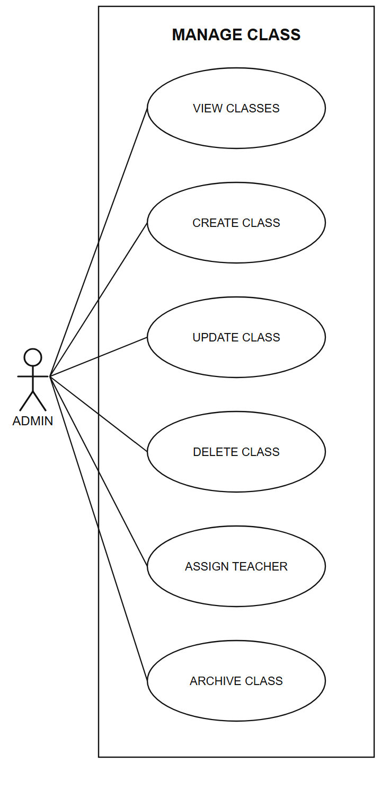

*Figure 3.7: System Use Case for manage class*

### A-029  ·  VIEW CLASSES

**Use Case Name:** VIEW CLASSES  
**Purpose:** List the classes the signed-in user is allowed to see.  
**Actors:**

- Admin (Primary Actor)

**Input Parameters:**

- None beyond the signed-in identity carried on the authentication cookie.

**Output Parameters:**

- The rendered page, or a JSON payload where the caller is the page’s own script.

**Pre-Condition:**

- The caller is signed in as an administrator or a teacher. A teacher reaches this action only because it carries `[TeacherSharedAction]`; the teacher account must also be active.

**Post-Condition:**

- The caller has the requested information. Nothing in the database has changed.

**Successful Scenario:**

1. The Admin opens the page and CAMS confirms the role on the authentication cookie.
2. The server reads the records the caller is entitled to see.
3. The page renders with those records.

**Exception Scenario:**

- **Not signed in or wrong role** — the request is refused and the caller is sent to the access denied page.

**Additional Remarks:**

- Implemented by `AdminController.Classes` (GET).
- Appears in the *MANAGE CLASS* module of the use case diagram.

### A-030  ·  CREATE CLASS

**Use Case Name:** CREATE CLASS  
**Purpose:** Record a new class in the system.  
**Actors:**

- Admin (Primary Actor)

**Input Parameters:**

- `cls` : `Class`

**Output Parameters:**

- A redirect back to the listing page, carrying a success or failure message for display.

**Pre-Condition:**

- The caller is signed in as an administrator or a teacher. A teacher reaches this action only because it carries `[TeacherSharedAction]`; the teacher account must also be active.

**Post-Condition:**

- The change is committed to the database and visible to the next read.
- The caller sees the outcome reported on the page they return to.

**Successful Scenario:**

1. The Admin opens the page and CAMS confirms the role on the authentication cookie.
2. The Admin fills the form and submits it.
3. The server validates the antiforgery token that accompanied the form.
4. The server validates the submitted values against the model rules.
5. The change is written to the database through `ApplicationDbContext`.
6. The server redirects back to the listing, where the result is shown.

**Exception Scenario:**

- **Not signed in or wrong role** — the request is refused and the caller is sent to the access denied page.
- **Missing or stale antiforgery token** — the submission is rejected and must be retried from a freshly loaded form.
- **Validation fails** — the form is redisplayed with the offending fields marked and nothing is written.

**Additional Remarks:**

- Implemented by `AdminController.CreateClass` (POST).
- Appears in the *MANAGE CLASS* module of the use case diagram.

### A-031  ·  UPDATE CLASS

**Use Case Name:** UPDATE CLASS  
**Purpose:** Amend the stored details of an existing class.  
**Actors:**

- Admin (Primary Actor)

**Input Parameters:**

- `cls` : `Class`

**Output Parameters:**

- A redirect back to the listing page, carrying a success or failure message for display.

**Pre-Condition:**

- The caller is signed in as an administrator or a teacher. A teacher reaches this action only because it carries `[TeacherSharedAction]`; the teacher account must also be active.

**Post-Condition:**

- The change is committed to the database and visible to the next read.
- The caller sees the outcome reported on the page they return to.

**Successful Scenario:**

1. The Admin opens the page and CAMS confirms the role on the authentication cookie.
2. The Admin fills the form and submits it.
3. The server validates the antiforgery token that accompanied the form.
4. The server validates the submitted values against the model rules.
5. The change is written to the database through `ApplicationDbContext`.
6. The server redirects back to the listing, where the result is shown.

**Exception Scenario:**

- **Not signed in or wrong role** — the request is refused and the caller is sent to the access denied page.
- **Missing or stale antiforgery token** — the submission is rejected and must be retried from a freshly loaded form.
- **Validation fails** — the form is redisplayed with the offending fields marked and nothing is written.

**Additional Remarks:**

- Implemented by `AdminController.UpdateClass` (POST).
- Appears in the *MANAGE CLASS* module of the use case diagram.

### A-032  ·  DELETE CLASS

**Use Case Name:** DELETE CLASS  
**Purpose:** Remove a class from the system.  
**Actors:**

- Admin (Primary Actor)

**Input Parameters:**

- `classId` : `int`

**Output Parameters:**

- A redirect back to the listing page, carrying a success or failure message for display.

**Pre-Condition:**

- The caller is signed in as an administrator or a teacher. A teacher reaches this action only because it carries `[TeacherSharedAction]`; the teacher account must also be active.
- The record named by the identifier exists.

**Post-Condition:**

- The change is committed to the database and visible to the next read.
- The caller sees the outcome reported on the page they return to.

**Successful Scenario:**

1. The Admin opens the page and CAMS confirms the role on the authentication cookie.
2. The Admin fills the form and submits it.
3. The server validates the antiforgery token that accompanied the form.
4. The server validates the submitted values against the model rules.
5. The change is written to the database through `ApplicationDbContext`.
6. The server redirects back to the listing, where the result is shown.

**Exception Scenario:**

- **Not signed in or wrong role** — the request is refused and the caller is sent to the access denied page.
- **Missing or stale antiforgery token** — the submission is rejected and must be retried from a freshly loaded form.
- **Validation fails** — the form is redisplayed with the offending fields marked and nothing is written.
- **The identifier matches no record** — the action reports that the record was not found and makes no change.
- **The record is still referenced** — the deletion is refused rather than leaving dangling references.

**Additional Remarks:**

- Implemented by `AdminController.DeleteClass` (POST).
- Appears in the *MANAGE CLASS* module of the use case diagram.

### A-033  ·  ASSIGN TEACHER

**Use Case Name:** ASSIGN TEACHER  
**Purpose:** Put a teacher in charge of a class.  
**Actors:**

- Admin (Primary Actor)

**Input Parameters:**

- `classId` : `int`
- `teacherId` : `int?`

**Output Parameters:**

- A redirect back to the listing page, carrying a success or failure message for display.

**Pre-Condition:**

- The caller is signed in as an administrator or a teacher. A teacher reaches this action only because it carries `[TeacherSharedAction]`; the teacher account must also be active.
- The record named by the identifier exists.

**Post-Condition:**

- The change is committed to the database and visible to the next read.
- The caller sees the outcome reported on the page they return to.

**Successful Scenario:**

1. The Admin opens the page and CAMS confirms the role on the authentication cookie.
2. The Admin fills the form and submits it.
3. The server validates the antiforgery token that accompanied the form.
4. The server validates the submitted values against the model rules.
5. The change is written to the database through `ApplicationDbContext`.
6. The server redirects back to the listing, where the result is shown.

**Exception Scenario:**

- **Not signed in or wrong role** — the request is refused and the caller is sent to the access denied page.
- **Missing or stale antiforgery token** — the submission is rejected and must be retried from a freshly loaded form.
- **Validation fails** — the form is redisplayed with the offending fields marked and nothing is written.
- **The identifier matches no record** — the action reports that the record was not found and makes no change.

**Additional Remarks:**

- Implemented by `AdminController.AssignTeacher` (POST).
- Appears in the *MANAGE CLASS* module of the use case diagram.

### A-034  ·  ARCHIVE CLASS

**Use Case Name:** ARCHIVE CLASS  
**Purpose:** Take a class out of active use while keeping its roster and records.  
**Actors:**

- Admin (Primary Actor)

**Input Parameters:**

- `id` : `int`

**Output Parameters:**

- A redirect back to the listing page, carrying a success or failure message for display.

**Pre-Condition:**

- The caller is signed in as an administrator or a teacher. A teacher reaches this action only because it carries `[TeacherSharedAction]`; the teacher account must also be active.
- The record named by the identifier exists.

**Post-Condition:**

- The change is committed to the database and visible to the next read.
- The caller sees the outcome reported on the page they return to.

**Successful Scenario:**

1. The Admin opens the page and CAMS confirms the role on the authentication cookie.
2. The Admin fills the form and submits it.
3. The server validates the antiforgery token that accompanied the form.
4. The server validates the submitted values against the model rules.
5. The change is written to the database through `ApplicationDbContext`.
6. The server redirects back to the listing, where the result is shown.

**Exception Scenario:**

- **Not signed in or wrong role** — the request is refused and the caller is sent to the access denied page.
- **Missing or stale antiforgery token** — the submission is rejected and must be retried from a freshly loaded form.
- **Validation fails** — the form is redisplayed with the offending fields marked and nothing is written.
- **The identifier matches no record** — the action reports that the record was not found and makes no change.

**Additional Remarks:**

- Implemented by `AdminController.ArchiveClass` (POST).
- Appears in the *MANAGE CLASS* module of the use case diagram.

## MANAGE CLASS ROSTER  ·  `AdminController`

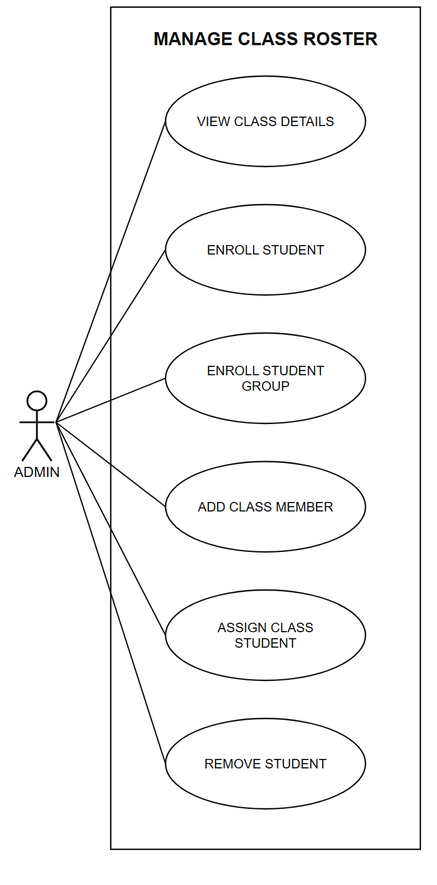

*Figure 3.8: System Use Case for manage class roster*

### A-035  ·  VIEW CLASS DETAILS

**Use Case Name:** VIEW CLASS DETAILS  
**Purpose:** Show one class with its roster and the students enrolled in it.  
**Actors:**

- Admin (Primary Actor)

**Input Parameters:**

- `id` : `int`

**Output Parameters:**

- The rendered page, or a JSON payload where the caller is the page’s own script.

**Pre-Condition:**

- The caller is signed in as an administrator or a teacher. A teacher reaches this action only because it carries `[TeacherSharedAction]`; the teacher account must also be active.
- The record named by the identifier exists.

**Post-Condition:**

- The caller has the requested information. Nothing in the database has changed.

**Successful Scenario:**

1. The Admin opens the page and CAMS confirms the role on the authentication cookie.
2. The server reads the records the caller is entitled to see.
3. The page renders with those records.

**Exception Scenario:**

- **Not signed in or wrong role** — the request is refused and the caller is sent to the access denied page.
- **The identifier matches no record** — the action reports that the record was not found and makes no change.

**Additional Remarks:**

- Implemented by `AdminController.ClassDetails` (GET).
- Appears in the *MANAGE CLASS ROSTER* module of the use case diagram.

### A-036  ·  ENROLL STUDENT

**Use Case Name:** ENROLL STUDENT  
**Purpose:** Add an existing student to a class roster.  
**Actors:**

- Admin (Primary Actor)

**Input Parameters:**

- `classId` : `int`
- `studentId` : `int`
- `moveStudent` : `bool` (optional)

**Output Parameters:**

- A redirect back to the listing page, carrying a success or failure message for display.

**Pre-Condition:**

- The caller is signed in as an administrator or a teacher. A teacher reaches this action only because it carries `[TeacherSharedAction]`; the teacher account must also be active.
- The record named by the identifier exists.

**Post-Condition:**

- The change is committed to the database and visible to the next read.
- The caller sees the outcome reported on the page they return to.

**Successful Scenario:**

1. The Admin opens the page and CAMS confirms the role on the authentication cookie.
2. The Admin fills the form and submits it.
3. The server validates the antiforgery token that accompanied the form.
4. The server validates the submitted values against the model rules.
5. The change is written to the database through `ApplicationDbContext`.
6. The server redirects back to the listing, where the result is shown.

**Exception Scenario:**

- **Not signed in or wrong role** — the request is refused and the caller is sent to the access denied page.
- **Missing or stale antiforgery token** — the submission is rejected and must be retried from a freshly loaded form.
- **Validation fails** — the form is redisplayed with the offending fields marked and nothing is written.
- **The identifier matches no record** — the action reports that the record was not found and makes no change.

**Additional Remarks:**

- Implemented by `AdminController.EnrollStudent` (POST).
- Appears in the *MANAGE CLASS ROSTER* module of the use case diagram.

### A-037  ·  ENROLL STUDENT GROUP

**Use Case Name:** ENROLL STUDENT GROUP  
**Purpose:** Add several existing students to a class roster in one operation.  
**Actors:**

- Admin (Primary Actor)

**Input Parameters:**

- `classId` : `int`
- `studentIds` : `List<int>?`
- `moveStudent` : `bool` (optional)

**Output Parameters:**

- A redirect back to the listing page, carrying a success or failure message for display.

**Pre-Condition:**

- The caller is signed in as an administrator or a teacher. A teacher reaches this action only because it carries `[TeacherSharedAction]`; the teacher account must also be active.
- The record named by the identifier exists.

**Post-Condition:**

- The change is committed to the database and visible to the next read.
- The caller sees the outcome reported on the page they return to.

**Successful Scenario:**

1. The Admin opens the page and CAMS confirms the role on the authentication cookie.
2. The Admin fills the form and submits it.
3. The server validates the antiforgery token that accompanied the form.
4. The server validates the submitted values against the model rules.
5. The change is written to the database through `ApplicationDbContext`.
6. The server redirects back to the listing, where the result is shown.

**Exception Scenario:**

- **Not signed in or wrong role** — the request is refused and the caller is sent to the access denied page.
- **Missing or stale antiforgery token** — the submission is rejected and must be retried from a freshly loaded form.
- **Validation fails** — the form is redisplayed with the offending fields marked and nothing is written.
- **The identifier matches no record** — the action reports that the record was not found and makes no change.

**Additional Remarks:**

- Implemented by `AdminController.EnrollStudents` (POST).
- Appears in the *MANAGE CLASS ROSTER* module of the use case diagram.

### A-038  ·  ADD CLASS MEMBER

**Use Case Name:** ADD CLASS MEMBER  
**Purpose:** Create a new student account and place it on a class roster in one step.  
**Actors:**

- Admin (Primary Actor)

**Input Parameters:**

- `classId` : `int`
- `firstName` : `string`
- `lastName` : `string`
- `username` : `string?`
- `password` : `string?`

**Output Parameters:**

- A redirect back to the listing page, carrying a success or failure message for display.

**Pre-Condition:**

- The caller is signed in as an administrator or a teacher. A teacher reaches this action only because it carries `[TeacherSharedAction]`; the teacher account must also be active.
- The record named by the identifier exists.

**Post-Condition:**

- The change is committed to the database and visible to the next read.
- The caller sees the outcome reported on the page they return to.

**Successful Scenario:**

1. The Admin opens the page and CAMS confirms the role on the authentication cookie.
2. The Admin fills the form and submits it.
3. The server validates the antiforgery token that accompanied the form.
4. The server validates the submitted values against the model rules.
5. The change is written to the database through `ApplicationDbContext`.
6. The server redirects back to the listing, where the result is shown.

**Exception Scenario:**

- **Not signed in or wrong role** — the request is refused and the caller is sent to the access denied page.
- **Missing or stale antiforgery token** — the submission is rejected and must be retried from a freshly loaded form.
- **Validation fails** — the form is redisplayed with the offending fields marked and nothing is written.
- **The identifier matches no record** — the action reports that the record was not found and makes no change.

**Additional Remarks:**

- Implemented by `AdminController.AddStudentToClass` (POST).
- Appears in the *MANAGE CLASS ROSTER* module of the use case diagram.

### A-039  ·  ASSIGN CLASS STUDENT

**Use Case Name:** ASSIGN CLASS STUDENT  
**Purpose:** Set the primary class a student belongs to.  
**Actors:**

- Admin (Primary Actor)

**Input Parameters:**

- `studentId` : `int`
- `classId` : `int?`
- `moveStudent` : `bool` (optional)

**Output Parameters:**

- A redirect back to the listing page, carrying a success or failure message for display.

**Pre-Condition:**

- The caller is signed in as an administrator or a teacher. A teacher reaches this action only because it carries `[TeacherSharedAction]`; the teacher account must also be active.
- The record named by the identifier exists.

**Post-Condition:**

- The change is committed to the database and visible to the next read.
- The caller sees the outcome reported on the page they return to.

**Successful Scenario:**

1. The Admin opens the page and CAMS confirms the role on the authentication cookie.
2. The Admin fills the form and submits it.
3. The server validates the antiforgery token that accompanied the form.
4. The server validates the submitted values against the model rules.
5. The change is written to the database through `ApplicationDbContext`.
6. The server redirects back to the listing, where the result is shown.

**Exception Scenario:**

- **Not signed in or wrong role** — the request is refused and the caller is sent to the access denied page.
- **Missing or stale antiforgery token** — the submission is rejected and must be retried from a freshly loaded form.
- **Validation fails** — the form is redisplayed with the offending fields marked and nothing is written.
- **The identifier matches no record** — the action reports that the record was not found and makes no change.

**Additional Remarks:**

- Implemented by `AdminController.AssignStudentToClass` (POST).
- Appears in the *MANAGE CLASS ROSTER* module of the use case diagram.

### A-040  ·  REMOVE STUDENT

**Use Case Name:** REMOVE STUDENT  
**Purpose:** Take a student off a class roster while leaving the student account intact.  
**Actors:**

- Admin (Primary Actor)

**Input Parameters:**

- `classId` : `int`
- `studentId` : `int`

**Output Parameters:**

- A redirect back to the listing page, carrying a success or failure message for display.

**Pre-Condition:**

- The caller is signed in as an administrator or a teacher. A teacher reaches this action only because it carries `[TeacherSharedAction]`; the teacher account must also be active.
- The record named by the identifier exists.

**Post-Condition:**

- The change is committed to the database and visible to the next read.
- The caller sees the outcome reported on the page they return to.

**Successful Scenario:**

1. The Admin opens the page and CAMS confirms the role on the authentication cookie.
2. The Admin fills the form and submits it.
3. The server validates the antiforgery token that accompanied the form.
4. The server validates the submitted values against the model rules.
5. The change is written to the database through `ApplicationDbContext`.
6. The server redirects back to the listing, where the result is shown.

**Exception Scenario:**

- **Not signed in or wrong role** — the request is refused and the caller is sent to the access denied page.
- **Missing or stale antiforgery token** — the submission is rejected and must be retried from a freshly loaded form.
- **Validation fails** — the form is redisplayed with the offending fields marked and nothing is written.
- **The identifier matches no record** — the action reports that the record was not found and makes no change.

**Additional Remarks:**

- Implemented by `AdminController.RemoveStudent` (POST).
- Appears in the *MANAGE CLASS ROSTER* module of the use case diagram.

## MANAGE RESTRICTION RULE  ·  `AdminController`

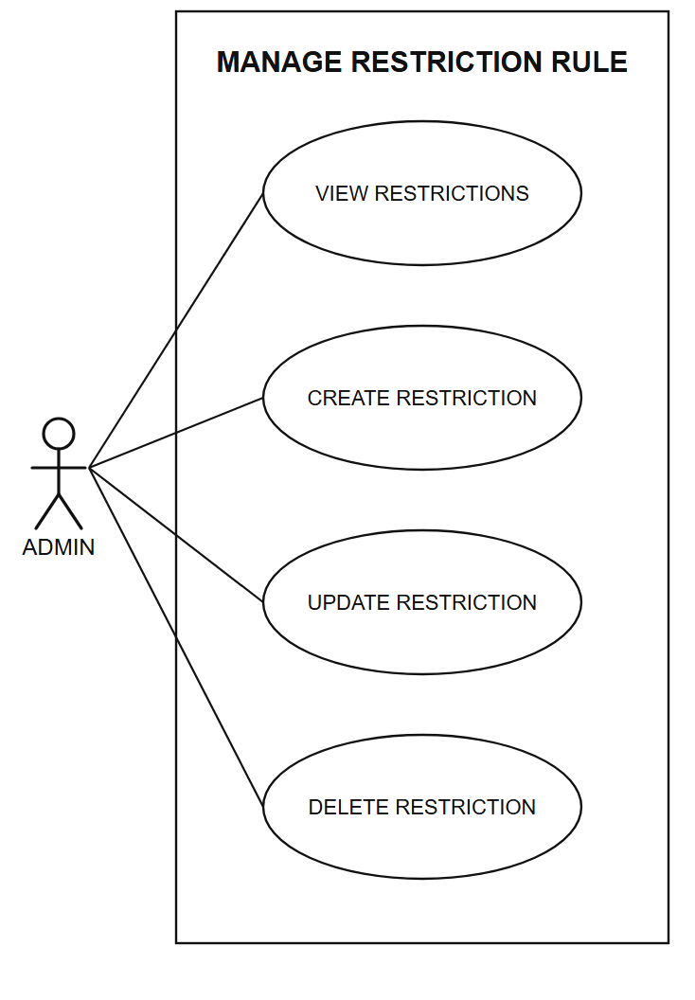

*Figure 3.9: System Use Case for manage restriction rule*

### A-041  ·  VIEW RESTRICTIONS

**Use Case Name:** VIEW RESTRICTIONS  
**Purpose:** List the restrictions the signed-in user is allowed to see.  
**Actors:**

- Admin (Primary Actor)

**Input Parameters:**

- None beyond the signed-in identity carried on the authentication cookie.

**Output Parameters:**

- The rendered page, or a JSON payload where the caller is the page’s own script.

**Pre-Condition:**

- The caller is signed in as an administrator or a teacher. A teacher reaches this action only because it carries `[TeacherSharedAction]`; the teacher account must also be active.

**Post-Condition:**

- The caller has the requested information. Nothing in the database has changed.

**Successful Scenario:**

1. The Admin opens the page and CAMS confirms the role on the authentication cookie.
2. The server reads the records the caller is entitled to see.
3. The page renders with those records.

**Exception Scenario:**

- **Not signed in or wrong role** — the request is refused and the caller is sent to the access denied page.

**Additional Remarks:**

- Implemented by `AdminController.Restrictions` (GET).
- Appears in the *MANAGE RESTRICTION RULE* module of the use case diagram.

### A-042  ·  CREATE RESTRICTION

**Use Case Name:** CREATE RESTRICTION  
**Purpose:** Record a new restriction rule in the system.  
**Actors:**

- Admin (Primary Actor)

**Input Parameters:**

- `rule` : `RestrictionRule`

**Output Parameters:**

- A redirect back to the listing page, carrying a success or failure message for display.

**Pre-Condition:**

- The caller is signed in as an administrator or a teacher. A teacher reaches this action only because it carries `[TeacherSharedAction]`; the teacher account must also be active.

**Post-Condition:**

- The change is committed to the database and visible to the next read.
- The caller sees the outcome reported on the page they return to.

**Successful Scenario:**

1. The Admin opens the page and CAMS confirms the role on the authentication cookie.
2. The Admin fills the form and submits it.
3. The server validates the antiforgery token that accompanied the form.
4. The server validates the submitted values against the model rules.
5. The change is written to the database through `ApplicationDbContext`.
6. The server redirects back to the listing, where the result is shown.

**Exception Scenario:**

- **Not signed in or wrong role** — the request is refused and the caller is sent to the access denied page.
- **Missing or stale antiforgery token** — the submission is rejected and must be retried from a freshly loaded form.
- **Validation fails** — the form is redisplayed with the offending fields marked and nothing is written.

**Additional Remarks:**

- Implemented by `AdminController.CreateRestriction` (POST).
- Appears in the *MANAGE RESTRICTION RULE* module of the use case diagram.

### A-043  ·  UPDATE RESTRICTION

**Use Case Name:** UPDATE RESTRICTION  
**Purpose:** Amend the stored details of an existing restriction rule.  
**Actors:**

- Admin (Primary Actor)

**Input Parameters:**

- `input` : `RestrictionRule`

**Output Parameters:**

- A redirect back to the listing page, carrying a success or failure message for display.

**Pre-Condition:**

- The caller is signed in as an administrator or a teacher. A teacher reaches this action only because it carries `[TeacherSharedAction]`; the teacher account must also be active.

**Post-Condition:**

- The change is committed to the database and visible to the next read.
- The caller sees the outcome reported on the page they return to.

**Successful Scenario:**

1. The Admin opens the page and CAMS confirms the role on the authentication cookie.
2. The Admin fills the form and submits it.
3. The server validates the antiforgery token that accompanied the form.
4. The server validates the submitted values against the model rules.
5. The change is written to the database through `ApplicationDbContext`.
6. The server redirects back to the listing, where the result is shown.

**Exception Scenario:**

- **Not signed in or wrong role** — the request is refused and the caller is sent to the access denied page.
- **Missing or stale antiforgery token** — the submission is rejected and must be retried from a freshly loaded form.
- **Validation fails** — the form is redisplayed with the offending fields marked and nothing is written.

**Additional Remarks:**

- Implemented by `AdminController.UpdateRestriction` (POST).
- Appears in the *MANAGE RESTRICTION RULE* module of the use case diagram.

### A-044  ·  DELETE RESTRICTION

**Use Case Name:** DELETE RESTRICTION  
**Purpose:** Remove a restriction rule from the system.  
**Actors:**

- Admin (Primary Actor)

**Input Parameters:**

- `id` : `int`

**Output Parameters:**

- A redirect back to the listing page, carrying a success or failure message for display.

**Pre-Condition:**

- The caller is signed in as an administrator or a teacher. A teacher reaches this action only because it carries `[TeacherSharedAction]`; the teacher account must also be active.
- The record named by the identifier exists.

**Post-Condition:**

- The change is committed to the database and visible to the next read.
- The caller sees the outcome reported on the page they return to.

**Successful Scenario:**

1. The Admin opens the page and CAMS confirms the role on the authentication cookie.
2. The Admin fills the form and submits it.
3. The server validates the antiforgery token that accompanied the form.
4. The server validates the submitted values against the model rules.
5. The change is written to the database through `ApplicationDbContext`.
6. The server redirects back to the listing, where the result is shown.

**Exception Scenario:**

- **Not signed in or wrong role** — the request is refused and the caller is sent to the access denied page.
- **Missing or stale antiforgery token** — the submission is rejected and must be retried from a freshly loaded form.
- **Validation fails** — the form is redisplayed with the offending fields marked and nothing is written.
- **The identifier matches no record** — the action reports that the record was not found and makes no change.
- **The record is still referenced** — the deletion is refused rather than leaving dangling references.

**Additional Remarks:**

- Implemented by `AdminController.DeleteRestriction` (POST).
- Appears in the *MANAGE RESTRICTION RULE* module of the use case diagram.

## MANAGE BLACKLIST AND WHITELIST  ·  `AdminController`

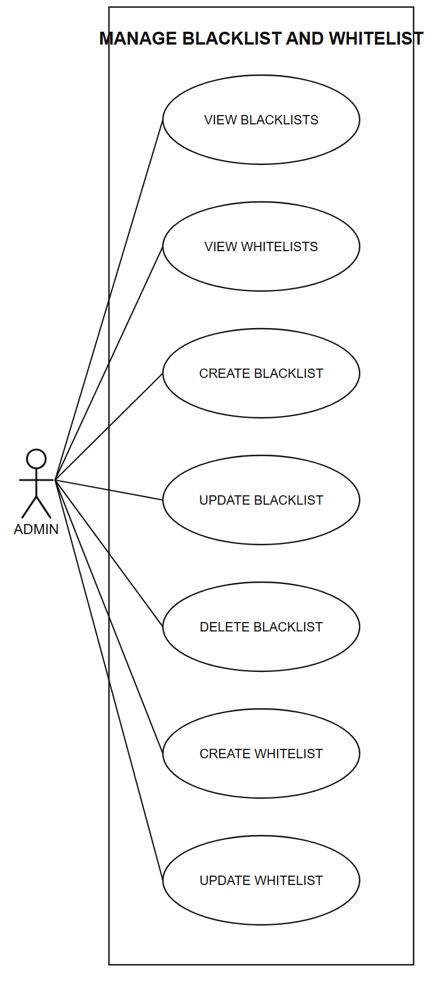

*Figure 3.10: System Use Case for manage blacklist and whitelist*

### A-045  ·  VIEW BLACKLISTS

**Use Case Name:** VIEW BLACKLISTS  
**Purpose:** List the blacklists the signed-in user is allowed to see.  
**Actors:**

- Admin (Primary Actor)

**Input Parameters:**

- None beyond the signed-in identity carried on the authentication cookie.

**Output Parameters:**

- The rendered page, or a JSON payload where the caller is the page’s own script.

**Pre-Condition:**

- The caller is signed in as an administrator or a teacher. A teacher reaches this action only because it carries `[TeacherSharedAction]`; the teacher account must also be active.

**Post-Condition:**

- The caller has the requested information. Nothing in the database has changed.

**Successful Scenario:**

1. The Admin opens the page and CAMS confirms the role on the authentication cookie.
2. The server reads the records the caller is entitled to see.
3. The page renders with those records.

**Exception Scenario:**

- **Not signed in or wrong role** — the request is refused and the caller is sent to the access denied page.

**Additional Remarks:**

- Implemented by `AdminController.Blacklists` (GET).
- Appears in the *MANAGE BLACKLIST AND WHITELIST* module of the use case diagram.

### A-046  ·  VIEW WHITELISTS

**Use Case Name:** VIEW WHITELISTS  
**Purpose:** List the whitelists the signed-in user is allowed to see.  
**Actors:**

- Admin (Primary Actor)

**Input Parameters:**

- None beyond the signed-in identity carried on the authentication cookie.

**Output Parameters:**

- The rendered page, or a JSON payload where the caller is the page’s own script.

**Pre-Condition:**

- The caller is signed in as an administrator or a teacher. A teacher reaches this action only because it carries `[TeacherSharedAction]`; the teacher account must also be active.

**Post-Condition:**

- The caller has the requested information. Nothing in the database has changed.

**Successful Scenario:**

1. The Admin opens the page and CAMS confirms the role on the authentication cookie.
2. The server reads the records the caller is entitled to see.
3. The page renders with those records.

**Exception Scenario:**

- **Not signed in or wrong role** — the request is refused and the caller is sent to the access denied page.

**Additional Remarks:**

- Implemented by `AdminController.Whitelists` (GET).
- Appears in the *MANAGE BLACKLIST AND WHITELIST* module of the use case diagram.

### A-047  ·  CREATE BLACKLIST

**Use Case Name:** CREATE BLACKLIST  
**Purpose:** Record a new blacklist entry in the system.  
**Actors:**

- Admin (Primary Actor)

**Input Parameters:**

- `RestrictionRuleId` — bound from the submitted form
- `RuleType` — bound from the submitted form
- `Target` — bound from the submitted form
- `Description` — bound from the submitted form
- `IsGlobal` — bound from the submitted form
- `IsActive` — bound from the submitted form
- `item` : `BlacklistItem`

**Output Parameters:**

- A redirect back to the listing page, carrying a success or failure message for display.

**Pre-Condition:**

- The caller is signed in as an administrator or a teacher. A teacher reaches this action only because it carries `[TeacherSharedAction]`; the teacher account must also be active.

**Post-Condition:**

- The change is committed to the database and visible to the next read.
- The caller sees the outcome reported on the page they return to.

**Successful Scenario:**

1. The Admin opens the page and CAMS confirms the role on the authentication cookie.
2. The Admin fills the form and submits it.
3. The server validates the antiforgery token that accompanied the form.
4. The server validates the submitted values against the model rules.
5. The change is written to the database through `ApplicationDbContext`.
6. The server redirects back to the listing, where the result is shown.

**Exception Scenario:**

- **Not signed in or wrong role** — the request is refused and the caller is sent to the access denied page.
- **Missing or stale antiforgery token** — the submission is rejected and must be retried from a freshly loaded form.
- **Validation fails** — the form is redisplayed with the offending fields marked and nothing is written.

**Additional Remarks:**

- Implemented by `AdminController.CreateBlacklist` (POST).
- Appears in the *MANAGE BLACKLIST AND WHITELIST* module of the use case diagram.

### A-048  ·  UPDATE BLACKLIST

**Use Case Name:** UPDATE BLACKLIST  
**Purpose:** Amend the stored details of an existing blacklist entry.  
**Actors:**

- Admin (Primary Actor)

**Input Parameters:**

- `input` : `BlacklistItem`

**Output Parameters:**

- A redirect back to the listing page, carrying a success or failure message for display.

**Pre-Condition:**

- The caller is signed in as an administrator or a teacher. A teacher reaches this action only because it carries `[TeacherSharedAction]`; the teacher account must also be active.

**Post-Condition:**

- The change is committed to the database and visible to the next read.
- The caller sees the outcome reported on the page they return to.

**Successful Scenario:**

1. The Admin opens the page and CAMS confirms the role on the authentication cookie.
2. The Admin fills the form and submits it.
3. The server validates the antiforgery token that accompanied the form.
4. The server validates the submitted values against the model rules.
5. The change is written to the database through `ApplicationDbContext`.
6. The server redirects back to the listing, where the result is shown.

**Exception Scenario:**

- **Not signed in or wrong role** — the request is refused and the caller is sent to the access denied page.
- **Missing or stale antiforgery token** — the submission is rejected and must be retried from a freshly loaded form.
- **Validation fails** — the form is redisplayed with the offending fields marked and nothing is written.

**Additional Remarks:**

- Implemented by `AdminController.UpdateBlacklist` (POST).
- Appears in the *MANAGE BLACKLIST AND WHITELIST* module of the use case diagram.

### A-049  ·  DELETE BLACKLIST

**Use Case Name:** DELETE BLACKLIST  
**Purpose:** Remove a blacklist entry from the system.  
**Actors:**

- Admin (Primary Actor)

**Input Parameters:**

- `id` : `int`

**Output Parameters:**

- A redirect back to the listing page, carrying a success or failure message for display.

**Pre-Condition:**

- The caller is signed in as an administrator or a teacher. A teacher reaches this action only because it carries `[TeacherSharedAction]`; the teacher account must also be active.
- The record named by the identifier exists.

**Post-Condition:**

- The change is committed to the database and visible to the next read.
- The caller sees the outcome reported on the page they return to.

**Successful Scenario:**

1. The Admin opens the page and CAMS confirms the role on the authentication cookie.
2. The Admin fills the form and submits it.
3. The server validates the antiforgery token that accompanied the form.
4. The server validates the submitted values against the model rules.
5. The change is written to the database through `ApplicationDbContext`.
6. The server redirects back to the listing, where the result is shown.

**Exception Scenario:**

- **Not signed in or wrong role** — the request is refused and the caller is sent to the access denied page.
- **Missing or stale antiforgery token** — the submission is rejected and must be retried from a freshly loaded form.
- **Validation fails** — the form is redisplayed with the offending fields marked and nothing is written.
- **The identifier matches no record** — the action reports that the record was not found and makes no change.
- **The record is still referenced** — the deletion is refused rather than leaving dangling references.

**Additional Remarks:**

- Implemented by `AdminController.DeleteBlacklist` (POST).
- Appears in the *MANAGE BLACKLIST AND WHITELIST* module of the use case diagram.

### A-050  ·  CREATE WHITELIST

**Use Case Name:** CREATE WHITELIST  
**Purpose:** Record a new whitelist entry in the system.  
**Actors:**

- Admin (Primary Actor)

**Input Parameters:**

- `rule` : `RestrictionRule`

**Output Parameters:**

- A redirect back to the listing page, carrying a success or failure message for display.

**Pre-Condition:**

- The caller is signed in as an administrator or a teacher. A teacher reaches this action only because it carries `[TeacherSharedAction]`; the teacher account must also be active.

**Post-Condition:**

- The change is committed to the database and visible to the next read.
- The caller sees the outcome reported on the page they return to.

**Successful Scenario:**

1. The Admin opens the page and CAMS confirms the role on the authentication cookie.
2. The Admin fills the form and submits it.
3. The server validates the antiforgery token that accompanied the form.
4. The server validates the submitted values against the model rules.
5. The change is written to the database through `ApplicationDbContext`.
6. The server redirects back to the listing, where the result is shown.

**Exception Scenario:**

- **Not signed in or wrong role** — the request is refused and the caller is sent to the access denied page.
- **Missing or stale antiforgery token** — the submission is rejected and must be retried from a freshly loaded form.
- **Validation fails** — the form is redisplayed with the offending fields marked and nothing is written.

**Additional Remarks:**

- Implemented by `AdminController.CreateWhitelist` (POST).
- Appears in the *MANAGE BLACKLIST AND WHITELIST* module of the use case diagram.

### A-051  ·  UPDATE WHITELIST

**Use Case Name:** UPDATE WHITELIST  
**Purpose:** Amend the stored details of an existing whitelist entry.  
**Actors:**

- Admin (Primary Actor)

**Input Parameters:**

- `RuleType` — bound from the submitted form
- `Target` — bound from the submitted form
- `Description` — bound from the submitted form
- `IsGlobal` — bound from the submitted form
- `IsActive` — bound from the submitted form
- `rule` : `RestrictionRule`

**Output Parameters:**

- A redirect back to the listing page, carrying a success or failure message for display.

**Pre-Condition:**

- The caller is signed in as an administrator or a teacher. A teacher reaches this action only because it carries `[TeacherSharedAction]`; the teacher account must also be active.

**Post-Condition:**

- The change is committed to the database and visible to the next read.
- The caller sees the outcome reported on the page they return to.

**Successful Scenario:**

1. The Admin opens the page and CAMS confirms the role on the authentication cookie.
2. The Admin fills the form and submits it.
3. The server validates the antiforgery token that accompanied the form.
4. The server validates the submitted values against the model rules.
5. The change is written to the database through `ApplicationDbContext`.
6. The server redirects back to the listing, where the result is shown.

**Exception Scenario:**

- **Not signed in or wrong role** — the request is refused and the caller is sent to the access denied page.
- **Missing or stale antiforgery token** — the submission is rejected and must be retried from a freshly loaded form.
- **Validation fails** — the form is redisplayed with the offending fields marked and nothing is written.

**Additional Remarks:**

- Implemented by `AdminController.UpdateWhitelist` (POST).
- Appears in the *MANAGE BLACKLIST AND WHITELIST* module of the use case diagram.

## MANAGE CATEGORY  ·  `AdminController`

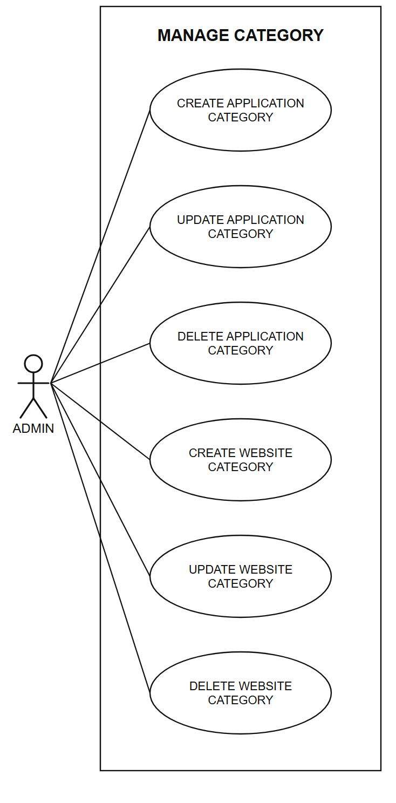

*Figure 3.11: System Use Case for manage category*

### A-052  ·  CREATE APPLICATION CATEGORY

**Use Case Name:** CREATE APPLICATION CATEGORY  
**Purpose:** Record a new application category in the system.  
**Actors:**

- Admin (Primary Actor)

**Input Parameters:**

- `category` : `ApplicationCategory`

**Output Parameters:**

- A redirect back to the listing page, carrying a success or failure message for display.

**Pre-Condition:**

- The caller is signed in as an administrator or a teacher. A teacher reaches this action only because it carries `[TeacherSharedAction]`; the teacher account must also be active.

**Post-Condition:**

- The change is committed to the database and visible to the next read.
- The caller sees the outcome reported on the page they return to.

**Successful Scenario:**

1. The Admin opens the page and CAMS confirms the role on the authentication cookie.
2. The Admin fills the form and submits it.
3. The server validates the antiforgery token that accompanied the form.
4. The server validates the submitted values against the model rules.
5. The change is written to the database through `ApplicationDbContext`.
6. The server redirects back to the listing, where the result is shown.

**Exception Scenario:**

- **Not signed in or wrong role** — the request is refused and the caller is sent to the access denied page.
- **Missing or stale antiforgery token** — the submission is rejected and must be retried from a freshly loaded form.
- **Validation fails** — the form is redisplayed with the offending fields marked and nothing is written.

**Additional Remarks:**

- Implemented by `AdminController.CreateApplicationCategory` (POST).
- Appears in the *MANAGE CATEGORY* module of the use case diagram.

### A-053  ·  UPDATE APPLICATION CATEGORY

**Use Case Name:** UPDATE APPLICATION CATEGORY  
**Purpose:** Amend the stored details of an existing application category.  
**Actors:**

- Admin (Primary Actor)

**Input Parameters:**

- `input` : `ApplicationCategory`

**Output Parameters:**

- A redirect back to the listing page, carrying a success or failure message for display.

**Pre-Condition:**

- The caller is signed in as an administrator or a teacher. A teacher reaches this action only because it carries `[TeacherSharedAction]`; the teacher account must also be active.

**Post-Condition:**

- The change is committed to the database and visible to the next read.
- The caller sees the outcome reported on the page they return to.

**Successful Scenario:**

1. The Admin opens the page and CAMS confirms the role on the authentication cookie.
2. The Admin fills the form and submits it.
3. The server validates the antiforgery token that accompanied the form.
4. The server validates the submitted values against the model rules.
5. The change is written to the database through `ApplicationDbContext`.
6. The server redirects back to the listing, where the result is shown.

**Exception Scenario:**

- **Not signed in or wrong role** — the request is refused and the caller is sent to the access denied page.
- **Missing or stale antiforgery token** — the submission is rejected and must be retried from a freshly loaded form.
- **Validation fails** — the form is redisplayed with the offending fields marked and nothing is written.

**Additional Remarks:**

- Implemented by `AdminController.UpdateApplicationCategory` (POST).
- Appears in the *MANAGE CATEGORY* module of the use case diagram.

### A-054  ·  DELETE APPLICATION CATEGORY

**Use Case Name:** DELETE APPLICATION CATEGORY  
**Purpose:** Remove a application category from the system.  
**Actors:**

- Admin (Primary Actor)

**Input Parameters:**

- `id` : `int`

**Output Parameters:**

- A redirect back to the listing page, carrying a success or failure message for display.

**Pre-Condition:**

- The caller is signed in as an administrator or a teacher. A teacher reaches this action only because it carries `[TeacherSharedAction]`; the teacher account must also be active.
- The record named by the identifier exists.

**Post-Condition:**

- The change is committed to the database and visible to the next read.
- The caller sees the outcome reported on the page they return to.

**Successful Scenario:**

1. The Admin opens the page and CAMS confirms the role on the authentication cookie.
2. The Admin fills the form and submits it.
3. The server validates the antiforgery token that accompanied the form.
4. The server validates the submitted values against the model rules.
5. The change is written to the database through `ApplicationDbContext`.
6. The server redirects back to the listing, where the result is shown.

**Exception Scenario:**

- **Not signed in or wrong role** — the request is refused and the caller is sent to the access denied page.
- **Missing or stale antiforgery token** — the submission is rejected and must be retried from a freshly loaded form.
- **Validation fails** — the form is redisplayed with the offending fields marked and nothing is written.
- **The identifier matches no record** — the action reports that the record was not found and makes no change.
- **The record is still referenced** — the deletion is refused rather than leaving dangling references.

**Additional Remarks:**

- Implemented by `AdminController.DeleteApplicationCategory` (POST).
- Appears in the *MANAGE CATEGORY* module of the use case diagram.

### A-055  ·  CREATE WEBSITE CATEGORY

**Use Case Name:** CREATE WEBSITE CATEGORY  
**Purpose:** Record a new website category in the system.  
**Actors:**

- Admin (Primary Actor)

**Input Parameters:**

- `category` : `WebsiteCategory`

**Output Parameters:**

- A redirect back to the listing page, carrying a success or failure message for display.

**Pre-Condition:**

- The caller is signed in as an administrator or a teacher. A teacher reaches this action only because it carries `[TeacherSharedAction]`; the teacher account must also be active.

**Post-Condition:**

- The change is committed to the database and visible to the next read.
- The caller sees the outcome reported on the page they return to.

**Successful Scenario:**

1. The Admin opens the page and CAMS confirms the role on the authentication cookie.
2. The Admin fills the form and submits it.
3. The server validates the antiforgery token that accompanied the form.
4. The server validates the submitted values against the model rules.
5. The change is written to the database through `ApplicationDbContext`.
6. The server redirects back to the listing, where the result is shown.

**Exception Scenario:**

- **Not signed in or wrong role** — the request is refused and the caller is sent to the access denied page.
- **Missing or stale antiforgery token** — the submission is rejected and must be retried from a freshly loaded form.
- **Validation fails** — the form is redisplayed with the offending fields marked and nothing is written.

**Additional Remarks:**

- Implemented by `AdminController.CreateWebsiteCategory` (POST).
- Appears in the *MANAGE CATEGORY* module of the use case diagram.

### A-056  ·  UPDATE WEBSITE CATEGORY

**Use Case Name:** UPDATE WEBSITE CATEGORY  
**Purpose:** Amend the stored details of an existing website category.  
**Actors:**

- Admin (Primary Actor)

**Input Parameters:**

- `input` : `WebsiteCategory`

**Output Parameters:**

- A redirect back to the listing page, carrying a success or failure message for display.

**Pre-Condition:**

- The caller is signed in as an administrator or a teacher. A teacher reaches this action only because it carries `[TeacherSharedAction]`; the teacher account must also be active.

**Post-Condition:**

- The change is committed to the database and visible to the next read.
- The caller sees the outcome reported on the page they return to.

**Successful Scenario:**

1. The Admin opens the page and CAMS confirms the role on the authentication cookie.
2. The Admin fills the form and submits it.
3. The server validates the antiforgery token that accompanied the form.
4. The server validates the submitted values against the model rules.
5. The change is written to the database through `ApplicationDbContext`.
6. The server redirects back to the listing, where the result is shown.

**Exception Scenario:**

- **Not signed in or wrong role** — the request is refused and the caller is sent to the access denied page.
- **Missing or stale antiforgery token** — the submission is rejected and must be retried from a freshly loaded form.
- **Validation fails** — the form is redisplayed with the offending fields marked and nothing is written.

**Additional Remarks:**

- Implemented by `AdminController.UpdateWebsiteCategory` (POST).
- Appears in the *MANAGE CATEGORY* module of the use case diagram.

### A-057  ·  DELETE WEBSITE CATEGORY

**Use Case Name:** DELETE WEBSITE CATEGORY  
**Purpose:** Remove a website category from the system.  
**Actors:**

- Admin (Primary Actor)

**Input Parameters:**

- `id` : `int`

**Output Parameters:**

- A redirect back to the listing page, carrying a success or failure message for display.

**Pre-Condition:**

- The caller is signed in as an administrator or a teacher. A teacher reaches this action only because it carries `[TeacherSharedAction]`; the teacher account must also be active.
- The record named by the identifier exists.

**Post-Condition:**

- The change is committed to the database and visible to the next read.
- The caller sees the outcome reported on the page they return to.

**Successful Scenario:**

1. The Admin opens the page and CAMS confirms the role on the authentication cookie.
2. The Admin fills the form and submits it.
3. The server validates the antiforgery token that accompanied the form.
4. The server validates the submitted values against the model rules.
5. The change is written to the database through `ApplicationDbContext`.
6. The server redirects back to the listing, where the result is shown.

**Exception Scenario:**

- **Not signed in or wrong role** — the request is refused and the caller is sent to the access denied page.
- **Missing or stale antiforgery token** — the submission is rejected and must be retried from a freshly loaded form.
- **Validation fails** — the form is redisplayed with the offending fields marked and nothing is written.
- **The identifier matches no record** — the action reports that the record was not found and makes no change.
- **The record is still referenced** — the deletion is refused rather than leaving dangling references.

**Additional Remarks:**

- Implemented by `AdminController.DeleteWebsiteCategory` (POST).
- Appears in the *MANAGE CATEGORY* module of the use case diagram.

## MANAGE SESSION RULE  ·  `AdminController`

*Figure 3.12: System Use Case for manage session rule*

### A-058  ·  VIEW SESSION RULES

**Use Case Name:** VIEW SESSION RULES  
**Purpose:** List the session rules the signed-in user is allowed to see.  
**Actors:**

- Admin (Primary Actor)

**Input Parameters:**

- None beyond the signed-in identity carried on the authentication cookie.

**Output Parameters:**

- The rendered page, or a JSON payload where the caller is the page’s own script.

**Pre-Condition:**

- The caller is signed in as an administrator or a teacher. A teacher reaches this action only because it carries `[TeacherSharedAction]`; the teacher account must also be active.

**Post-Condition:**

- The caller has the requested information. Nothing in the database has changed.

**Successful Scenario:**

1. The Admin opens the page and CAMS confirms the role on the authentication cookie.
2. The server reads the records the caller is entitled to see.
3. The page renders with those records.

**Exception Scenario:**

- **Not signed in or wrong role** — the request is refused and the caller is sent to the access denied page.

**Additional Remarks:**

- Implemented by `AdminController.SessionRules` (GET).
- Appears in the *MANAGE SESSION RULE* module of the use case diagram.

### A-059  ·  CREATE SESSION RULE

**Use Case Name:** CREATE SESSION RULE  
**Purpose:** Record a new session rule in the system.  
**Actors:**

- Admin (Primary Actor)

**Input Parameters:**

- `rule` : `SessionRule`

**Output Parameters:**

- A redirect back to the listing page, carrying a success or failure message for display.

**Pre-Condition:**

- The caller is signed in as an administrator or a teacher. A teacher reaches this action only because it carries `[TeacherSharedAction]`; the teacher account must also be active.

**Post-Condition:**

- The change is committed to the database and visible to the next read.
- The caller sees the outcome reported on the page they return to.

**Successful Scenario:**

1. The Admin opens the page and CAMS confirms the role on the authentication cookie.
2. The Admin fills the form and submits it.
3. The server validates the antiforgery token that accompanied the form.
4. The server validates the submitted values against the model rules.
5. The change is written to the database through `ApplicationDbContext`.
6. The server redirects back to the listing, where the result is shown.

**Exception Scenario:**

- **Not signed in or wrong role** — the request is refused and the caller is sent to the access denied page.
- **Missing or stale antiforgery token** — the submission is rejected and must be retried from a freshly loaded form.
- **Validation fails** — the form is redisplayed with the offending fields marked and nothing is written.

**Additional Remarks:**

- Implemented by `AdminController.CreateSessionRule` (POST).
- Appears in the *MANAGE SESSION RULE* module of the use case diagram.

### A-060  ·  UPDATE SESSION RULE

**Use Case Name:** UPDATE SESSION RULE  
**Purpose:** Amend the stored details of an existing session rule.  
**Actors:**

- Admin (Primary Actor)

**Input Parameters:**

- `input` : `SessionRule`

**Output Parameters:**

- A redirect back to the listing page, carrying a success or failure message for display.

**Pre-Condition:**

- The caller is signed in as an administrator or a teacher. A teacher reaches this action only because it carries `[TeacherSharedAction]`; the teacher account must also be active.

**Post-Condition:**

- The change is committed to the database and visible to the next read.
- The caller sees the outcome reported on the page they return to.

**Successful Scenario:**

1. The Admin opens the page and CAMS confirms the role on the authentication cookie.
2. The Admin fills the form and submits it.
3. The server validates the antiforgery token that accompanied the form.
4. The server validates the submitted values against the model rules.
5. The change is written to the database through `ApplicationDbContext`.
6. The server redirects back to the listing, where the result is shown.

**Exception Scenario:**

- **Not signed in or wrong role** — the request is refused and the caller is sent to the access denied page.
- **Missing or stale antiforgery token** — the submission is rejected and must be retried from a freshly loaded form.
- **Validation fails** — the form is redisplayed with the offending fields marked and nothing is written.

**Additional Remarks:**

- Implemented by `AdminController.UpdateSessionRule` (POST).
- Appears in the *MANAGE SESSION RULE* module of the use case diagram.

### A-061  ·  DEACTIVATE SESSION RULE

**Use Case Name:** DEACTIVATE SESSION RULE  
**Purpose:** Take a session rule out of use while keeping it on file. The rule is marked inactive and loses any default flag, and sessions already recorded against it still resolve to a named rule; where the rule allowed remote control, open remote sessions under it are closed.  
**Actors:**

- Admin (Primary Actor)

**Input Parameters:**

- `id` : `int`

**Output Parameters:**

- A redirect back to the listing page, carrying a success or failure message for display.

**Pre-Condition:**

- The caller is signed in as an administrator or a teacher. A teacher reaches this action only because it carries `[TeacherSharedAction]`; the teacher account must also be active.
- The record named by the identifier exists.

**Post-Condition:**

- The change is committed to the database and visible to the next read.
- The caller sees the outcome reported on the page they return to.

**Successful Scenario:**

1. The Admin opens the page and CAMS confirms the role on the authentication cookie.
2. The Admin fills the form and submits it.
3. The server validates the antiforgery token that accompanied the form.
4. The server validates the submitted values against the model rules.
5. The change is written to the database through `ApplicationDbContext`.
6. The server redirects back to the listing, where the result is shown.

**Exception Scenario:**

- **Not signed in or wrong role** — the request is refused and the caller is sent to the access denied page.
- **Missing or stale antiforgery token** — the submission is rejected and must be retried from a freshly loaded form.
- **Validation fails** — the form is redisplayed with the offending fields marked and nothing is written.
- **The identifier matches no record** — the action reports that the record was not found and makes no change.
- **The record is still referenced** — the deletion is refused rather than leaving dangling references.

**Additional Remarks:**

- Implemented by `AdminController.DeleteSessionRule` (POST).
- Appears in the *MANAGE SESSION RULE* module of the use case diagram.

## MANAGE ROLE AND PERMISSION  ·  `AdminController`

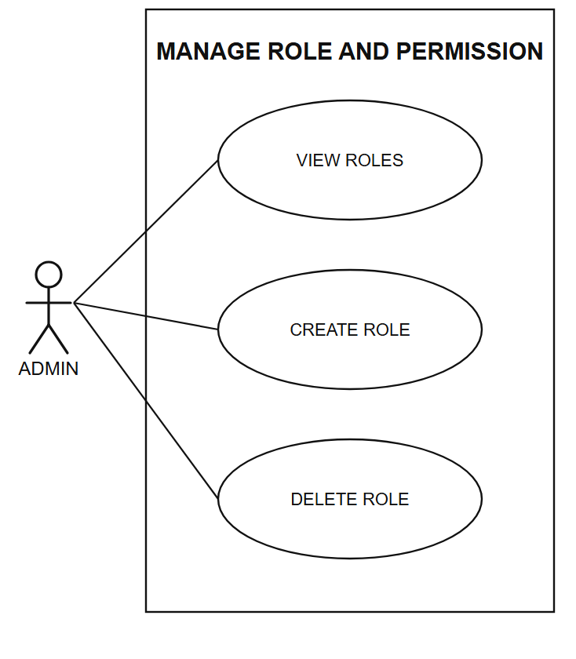

*Figure 3.13: System Use Case for manage role and permission*

### A-062  ·  VIEW ROLES

**Use Case Name:** VIEW ROLES  
**Purpose:** Show the seeded roles and the permissions attached to them.  
**Actors:**

- Admin (Primary Actor)

**Input Parameters:**

- None beyond the signed-in identity carried on the authentication cookie.

**Output Parameters:**

- The rendered page, or a JSON payload where the caller is the page’s own script.

**Pre-Condition:**

- The caller is signed in as an administrator or a teacher.

**Post-Condition:**

- The caller has the requested information. Nothing in the database has changed.

**Successful Scenario:**

1. The Admin opens the page and CAMS confirms the role on the authentication cookie.
2. The server reads the records the caller is entitled to see.
3. The page renders with those records.

**Exception Scenario:**

- **Not signed in or wrong role** — the request is refused and the caller is sent to the access denied page.

**Additional Remarks:**

- Implemented by `AdminController.Roles` (GET).
- Appears in the *MANAGE ROLE AND PERMISSION* module of the use case diagram.

### A-063  ·  CREATE ROLE

**Use Case Name:** CREATE ROLE  
**Purpose:** Add a role to the seeded reference data.  
**Actors:**

- Admin (Primary Actor)

**Input Parameters:**

- `role` : `Role`

**Output Parameters:**

- A redirect back to the listing page, carrying a success or failure message for display.

**Pre-Condition:**

- The caller is signed in as an administrator or a teacher.

**Post-Condition:**

- The change is committed to the database and visible to the next read.
- The caller sees the outcome reported on the page they return to.

**Successful Scenario:**

1. The Admin opens the page and CAMS confirms the role on the authentication cookie.
2. The Admin fills the form and submits it.
3. The server validates the antiforgery token that accompanied the form.
4. The server validates the submitted values against the model rules.
5. The change is written to the database through `ApplicationDbContext`.
6. The server redirects back to the listing, where the result is shown.

**Exception Scenario:**

- **Not signed in or wrong role** — the request is refused and the caller is sent to the access denied page.
- **Missing or stale antiforgery token** — the submission is rejected and must be retried from a freshly loaded form.
- **Validation fails** — the form is redisplayed with the offending fields marked and nothing is written.

**Additional Remarks:**

- Implemented by `AdminController.CreateRole` (POST).
- Appears in the *MANAGE ROLE AND PERMISSION* module of the use case diagram.

### A-064  ·  DELETE ROLE

**Use Case Name:** DELETE ROLE  
**Purpose:** Remove a role from the seeded reference data.  
**Actors:**

- Admin (Primary Actor)

**Input Parameters:**

- `id` : `int`

**Output Parameters:**

- A redirect back to the listing page, carrying a success or failure message for display.

**Pre-Condition:**

- The caller is signed in as an administrator or a teacher.
- The record named by the identifier exists.

**Post-Condition:**

- The change is committed to the database and visible to the next read.
- The caller sees the outcome reported on the page they return to.

**Successful Scenario:**

1. The Admin opens the page and CAMS confirms the role on the authentication cookie.
2. The Admin fills the form and submits it.
3. The server validates the antiforgery token that accompanied the form.
4. The server validates the submitted values against the model rules.
5. The change is written to the database through `ApplicationDbContext`.
6. The server redirects back to the listing, where the result is shown.

**Exception Scenario:**

- **Not signed in or wrong role** — the request is refused and the caller is sent to the access denied page.
- **Missing or stale antiforgery token** — the submission is rejected and must be retried from a freshly loaded form.
- **Validation fails** — the form is redisplayed with the offending fields marked and nothing is written.
- **The identifier matches no record** — the action reports that the record was not found and makes no change.
- **The record is still referenced** — the deletion is refused rather than leaving dangling references.

**Additional Remarks:**

- Implemented by `AdminController.DeleteRole` (POST).
- Appears in the *MANAGE ROLE AND PERMISSION* module of the use case diagram.

## CONTROL LABORATORY SESSION  ·  `AdminController`

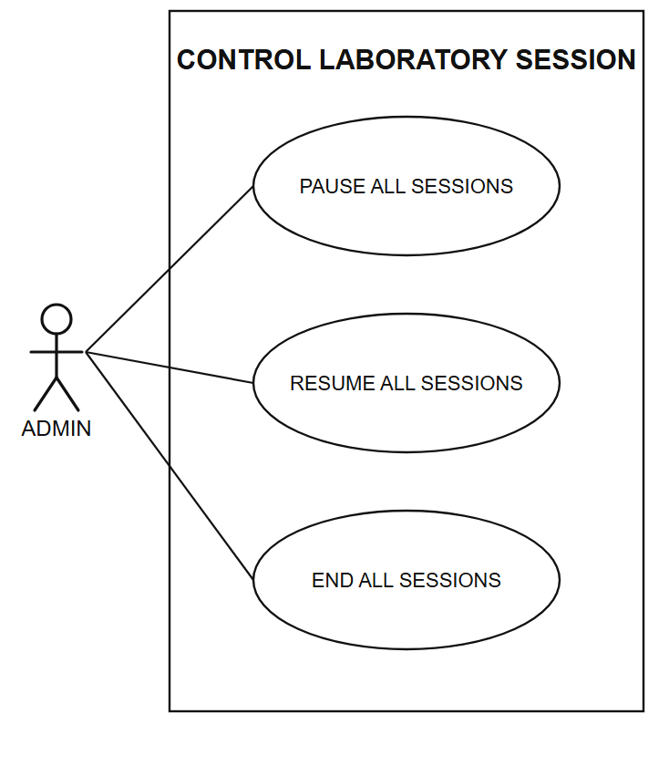

*Figure 3.14: System Use Case for control laboratory session*

### A-065  ·  PAUSE ALL SESSIONS

**Use Case Name:** PAUSE ALL SESSIONS  
**Purpose:** Pause every active laboratory session at once, freezing the timers across the room.  
**Actors:**

- Admin (Primary Actor)

**Input Parameters:**

- None beyond the signed-in identity carried on the authentication cookie.

**Output Parameters:**

- A redirect back to the listing page, carrying a success or failure message for display.

**Pre-Condition:**

- The caller is signed in as an administrator or a teacher. A teacher reaches this action only because it carries `[TeacherSharedAction]`; the teacher account must also be active.

**Post-Condition:**

- The change is committed to the database and visible to the next read.
- The caller sees the outcome reported on the page they return to.

**Successful Scenario:**

1. The Admin opens the page and CAMS confirms the role on the authentication cookie.
2. The Admin fills the form and submits it.
3. The server validates the antiforgery token that accompanied the form.
4. The server validates the submitted values against the model rules.
5. The change is written to the database through `ApplicationDbContext`.
6. The server redirects back to the listing, where the result is shown.

**Exception Scenario:**

- **Not signed in or wrong role** — the request is refused and the caller is sent to the access denied page.
- **Missing or stale antiforgery token** — the submission is rejected and must be retried from a freshly loaded form.
- **Validation fails** — the form is redisplayed with the offending fields marked and nothing is written.

**Additional Remarks:**

- Implemented by `AdminController.PauseAllSessions` (POST).
- Appears in the *CONTROL LABORATORY SESSION* module of the use case diagram.

### A-066  ·  RESUME ALL SESSIONS

**Use Case Name:** RESUME ALL SESSIONS  
**Purpose:** Resume every paused laboratory session at once.  
**Actors:**

- Admin (Primary Actor)

**Input Parameters:**

- None beyond the signed-in identity carried on the authentication cookie.

**Output Parameters:**

- A redirect back to the listing page, carrying a success or failure message for display.

**Pre-Condition:**

- The caller is signed in as an administrator or a teacher. A teacher reaches this action only because it carries `[TeacherSharedAction]`; the teacher account must also be active.

**Post-Condition:**

- The change is committed to the database and visible to the next read.
- The caller sees the outcome reported on the page they return to.

**Successful Scenario:**

1. The Admin opens the page and CAMS confirms the role on the authentication cookie.
2. The Admin fills the form and submits it.
3. The server validates the antiforgery token that accompanied the form.
4. The server validates the submitted values against the model rules.
5. The change is written to the database through `ApplicationDbContext`.
6. The server redirects back to the listing, where the result is shown.

**Exception Scenario:**

- **Not signed in or wrong role** — the request is refused and the caller is sent to the access denied page.
- **Missing or stale antiforgery token** — the submission is rejected and must be retried from a freshly loaded form.
- **Validation fails** — the form is redisplayed with the offending fields marked and nothing is written.

**Additional Remarks:**

- Implemented by `AdminController.ResumeAllSessions` (POST).
- Appears in the *CONTROL LABORATORY SESSION* module of the use case diagram.

### A-067  ·  END ALL SESSIONS

**Use Case Name:** END ALL SESSIONS  
**Purpose:** End every active laboratory session at once and tell the workstations.  
**Actors:**

- Admin (Primary Actor)

**Input Parameters:**

- None beyond the signed-in identity carried on the authentication cookie.

**Output Parameters:**

- A redirect back to the listing page, carrying a success or failure message for display.

**Pre-Condition:**

- The caller is signed in as an administrator or a teacher. A teacher reaches this action only because it carries `[TeacherSharedAction]`; the teacher account must also be active.

**Post-Condition:**

- The change is committed to the database and visible to the next read.
- The caller sees the outcome reported on the page they return to.

**Successful Scenario:**

1. The Admin opens the page and CAMS confirms the role on the authentication cookie.
2. The Admin fills the form and submits it.
3. The server validates the antiforgery token that accompanied the form.
4. The server validates the submitted values against the model rules.
5. The change is written to the database through `ApplicationDbContext`.
6. The server redirects back to the listing, where the result is shown.

**Exception Scenario:**

- **Not signed in or wrong role** — the request is refused and the caller is sent to the access denied page.
- **Missing or stale antiforgery token** — the submission is rejected and must be retried from a freshly loaded form.
- **Validation fails** — the form is redisplayed with the offending fields marked and nothing is written.

**Additional Remarks:**

- Implemented by `AdminController.EndAllSessions` (POST).
- Appears in the *CONTROL LABORATORY SESSION* module of the use case diagram.

## VIEW REPORTS AND LOGS  ·  `AdminController`

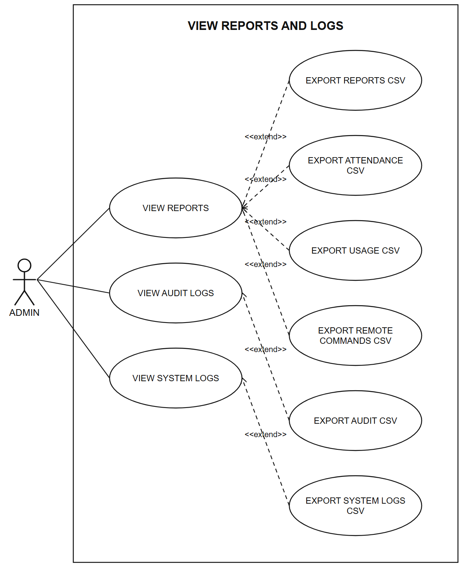

*Figure 3.15: System Use Case for view reports and logs*

### A-068  ·  VIEW REPORTS

**Use Case Name:** VIEW REPORTS  
**Purpose:** Show the laboratory reports an administrator uses for oversight.  
**Actors:**

- Admin (Primary Actor)

**Input Parameters:**

- `from` : `DateTime?`
- `to` : `DateTime?`
- `classId` : `int?` (optional)
- `station` : `string?` (optional)
- `page` : `int` (optional)
- `pageSize` : `int` (optional)

**Output Parameters:**

- The rendered page, or a JSON payload where the caller is the page’s own script.

**Pre-Condition:**

- The caller is signed in as an administrator or a teacher.
- The record named by the identifier exists.

**Post-Condition:**

- The caller has the requested information. Nothing in the database has changed.

**Successful Scenario:**

1. The Admin opens the page and CAMS confirms the role on the authentication cookie.
2. The server reads the records the caller is entitled to see.
3. The page renders with those records.

**Exception Scenario:**

- **Not signed in or wrong role** — the request is refused and the caller is sent to the access denied page.
- **The identifier matches no record** — the action reports that the record was not found and makes no change.

**Additional Remarks:**

- Implemented by `AdminController.Reports` (GET).
- Appears in the *VIEW REPORTS AND LOGS* module of the use case diagram.
- Pulls in **EXPORT REPORTS CSV** (`<<extend>>`), **EXPORT ATTENDANCE CSV** (`<<extend>>`), **EXPORT USAGE CSV** (`<<extend>>`), **EXPORT REMOTE COMMANDS CSV** (`<<extend>>`).

### A-069  ·  VIEW AUDIT LOGS

**Use Case Name:** VIEW AUDIT LOGS  
**Purpose:** Show the audit trail of administrative actions.  
**Actors:**

- Admin (Primary Actor)

**Input Parameters:**

- None beyond the signed-in identity carried on the authentication cookie.

**Output Parameters:**

- The rendered page, or a JSON payload where the caller is the page’s own script.

**Pre-Condition:**

- The caller is signed in as an administrator or a teacher.

**Post-Condition:**

- The caller has the requested information. Nothing in the database has changed.

**Successful Scenario:**

1. The Admin opens the page and CAMS confirms the role on the authentication cookie.
2. The server reads the records the caller is entitled to see.
3. The page renders with those records.

**Exception Scenario:**

- **Not signed in or wrong role** — the request is refused and the caller is sent to the access denied page.

**Additional Remarks:**

- Implemented by `AdminController.AuditLogs` (GET).
- Appears in the *VIEW REPORTS AND LOGS* module of the use case diagram.
- Pulls in **EXPORT AUDIT CSV** (`<<extend>>`).

### A-070  ·  VIEW SYSTEM LOGS

**Use Case Name:** VIEW SYSTEM LOGS  
**Purpose:** Show the technical log the server writes.  
**Actors:**

- Admin (Primary Actor)

**Input Parameters:**

- None beyond the signed-in identity carried on the authentication cookie.

**Output Parameters:**

- The rendered page, or a JSON payload where the caller is the page’s own script.

**Pre-Condition:**

- The caller is signed in as an administrator or a teacher.

**Post-Condition:**

- The caller has the requested information. Nothing in the database has changed.

**Successful Scenario:**

1. The Admin opens the page and CAMS confirms the role on the authentication cookie.
2. The server reads the records the caller is entitled to see.
3. The page renders with those records.

**Exception Scenario:**

- **Not signed in or wrong role** — the request is refused and the caller is sent to the access denied page.

**Additional Remarks:**

- Implemented by `AdminController.SystemLogs` (GET).
- Appears in the *VIEW REPORTS AND LOGS* module of the use case diagram.
- Pulls in **EXPORT SYSTEM LOGS CSV** (`<<extend>>`).

### A-071  ·  EXPORT REPORTS CSV

**Use Case Name:** EXPORT REPORTS CSV  
**Purpose:** Produce the reports view as a CSV file the user can download.  
**Actors:**

- Admin (Primary Actor)
- None; this behaviour runs inside **VIEW REPORTS** (Secondary Actor)

**Input Parameters:**

- `from` : `DateTime?` (optional)
- `to` : `DateTime?` (optional)
- `classId` : `int?` (optional)
- `station` : `string?` (optional)

**Output Parameters:**

- The rendered page, or a JSON payload where the caller is the page’s own script.

**Pre-Condition:**

- The caller is signed in as an administrator or a teacher.
- The record named by the identifier exists.
- **VIEW REPORTS** has reached the point where this is optionally performed.

**Post-Condition:**

- The caller has the requested information. Nothing in the database has changed.

**Successful Scenario:**

1. The Admin opens the page and CAMS confirms the role on the authentication cookie.
2. The server reads the records the caller is entitled to see.
3. The page renders with those records.

**Exception Scenario:**

- **Not signed in or wrong role** — the request is refused and the caller is sent to the access denied page.
- **The identifier matches no record** — the action reports that the record was not found and makes no change.

**Additional Remarks:**

- Implemented by `AdminController.ExportReportsCsv` (GET).
- Appears in the *VIEW REPORTS AND LOGS* module of the use case diagram.
- Drawn as `<<extend>>` to **VIEW REPORTS**.

### A-072  ·  EXPORT ATTENDANCE CSV

**Use Case Name:** EXPORT ATTENDANCE CSV  
**Purpose:** Produce the attendance view as a CSV file the user can download.  
**Actors:**

- Admin (Primary Actor)
- None; this behaviour runs inside **VIEW REPORTS** (Secondary Actor)

**Input Parameters:**

- `from` : `DateTime?` (optional)
- `to` : `DateTime?` (optional)
- `classId` : `int?` (optional)

**Output Parameters:**

- The rendered page, or a JSON payload where the caller is the page’s own script.

**Pre-Condition:**

- The caller is signed in as an administrator or a teacher.
- The record named by the identifier exists.
- **VIEW REPORTS** has reached the point where this is optionally performed.

**Post-Condition:**

- The caller has the requested information. Nothing in the database has changed.

**Successful Scenario:**

1. The Admin opens the page and CAMS confirms the role on the authentication cookie.
2. The server reads the records the caller is entitled to see.
3. The page renders with those records.

**Exception Scenario:**

- **Not signed in or wrong role** — the request is refused and the caller is sent to the access denied page.
- **The identifier matches no record** — the action reports that the record was not found and makes no change.

**Additional Remarks:**

- Implemented by `AdminController.ExportAttendanceCsv` (GET).
- Appears in the *VIEW REPORTS AND LOGS* module of the use case diagram.
- Drawn as `<<extend>>` to **VIEW REPORTS**.

### A-073  ·  EXPORT USAGE CSV

**Use Case Name:** EXPORT USAGE CSV  
**Purpose:** Produce the usage view as a CSV file the user can download.  
**Actors:**

- Admin (Primary Actor)
- None; this behaviour runs inside **VIEW REPORTS** (Secondary Actor)

**Input Parameters:**

- `from` : `DateTime?`
- `to` : `DateTime?`

**Output Parameters:**

- The rendered page, or a JSON payload where the caller is the page’s own script.

**Pre-Condition:**

- The caller is signed in as an administrator or a teacher.
- **VIEW REPORTS** has reached the point where this is optionally performed.

**Post-Condition:**

- The caller has the requested information. Nothing in the database has changed.

**Successful Scenario:**

1. The Admin opens the page and CAMS confirms the role on the authentication cookie.
2. The server reads the records the caller is entitled to see.
3. The page renders with those records.

**Exception Scenario:**

- **Not signed in or wrong role** — the request is refused and the caller is sent to the access denied page.

**Additional Remarks:**

- Implemented by `AdminController.ExportUsageCsv` (GET).
- Appears in the *VIEW REPORTS AND LOGS* module of the use case diagram.
- Drawn as `<<extend>>` to **VIEW REPORTS**.

### A-074  ·  EXPORT REMOTE COMMANDS CSV

**Use Case Name:** EXPORT REMOTE COMMANDS CSV  
**Purpose:** Produce the remote commands view as a CSV file the user can download.  
**Actors:**

- Admin (Primary Actor)
- None; this behaviour runs inside **VIEW REPORTS** (Secondary Actor)

**Input Parameters:**

- `from` : `DateTime?` (optional)
- `to` : `DateTime?` (optional)
- `teacherId` : `int?` (optional)

**Output Parameters:**

- The rendered page, or a JSON payload where the caller is the page’s own script.

**Pre-Condition:**

- The caller is signed in as an administrator or a teacher.
- The record named by the identifier exists.
- **VIEW REPORTS** has reached the point where this is optionally performed.

**Post-Condition:**

- The caller has the requested information. Nothing in the database has changed.

**Successful Scenario:**

1. The Admin opens the page and CAMS confirms the role on the authentication cookie.
2. The server reads the records the caller is entitled to see.
3. The page renders with those records.

**Exception Scenario:**

- **Not signed in or wrong role** — the request is refused and the caller is sent to the access denied page.
- **The identifier matches no record** — the action reports that the record was not found and makes no change.

**Additional Remarks:**

- Implemented by `AdminController.ExportRemoteCommandsCsv` (GET).
- Appears in the *VIEW REPORTS AND LOGS* module of the use case diagram.
- Drawn as `<<extend>>` to **VIEW REPORTS**.

### A-075  ·  EXPORT AUDIT CSV

**Use Case Name:** EXPORT AUDIT CSV  
**Purpose:** Produce the audit view as a CSV file the user can download.  
**Actors:**

- Admin (Primary Actor)
- None; this behaviour runs inside **VIEW AUDIT LOGS** (Secondary Actor)

**Input Parameters:**

- None beyond the signed-in identity carried on the authentication cookie.

**Output Parameters:**

- The rendered page, or a JSON payload where the caller is the page’s own script.

**Pre-Condition:**

- The caller is signed in as an administrator or a teacher.
- **VIEW AUDIT LOGS** has reached the point where this is optionally performed.

**Post-Condition:**

- The caller has the requested information. Nothing in the database has changed.

**Successful Scenario:**

1. The Admin opens the page and CAMS confirms the role on the authentication cookie.
2. The server reads the records the caller is entitled to see.
3. The page renders with those records.

**Exception Scenario:**

- **Not signed in or wrong role** — the request is refused and the caller is sent to the access denied page.

**Additional Remarks:**

- Implemented by `AdminController.ExportAuditCsv` (GET).
- Appears in the *VIEW REPORTS AND LOGS* module of the use case diagram.
- Drawn as `<<extend>>` to **VIEW AUDIT LOGS**.

### A-076  ·  EXPORT SYSTEM LOGS CSV

**Use Case Name:** EXPORT SYSTEM LOGS CSV  
**Purpose:** Produce the system logs view as a CSV file the user can download.  
**Actors:**

- Admin (Primary Actor)
- None; this behaviour runs inside **VIEW SYSTEM LOGS** (Secondary Actor)

**Input Parameters:**

- None beyond the signed-in identity carried on the authentication cookie.

**Output Parameters:**

- The rendered page, or a JSON payload where the caller is the page’s own script.

**Pre-Condition:**

- The caller is signed in as an administrator or a teacher.
- **VIEW SYSTEM LOGS** has reached the point where this is optionally performed.

**Post-Condition:**

- The caller has the requested information. Nothing in the database has changed.

**Successful Scenario:**

1. The Admin opens the page and CAMS confirms the role on the authentication cookie.
2. The server reads the records the caller is entitled to see.
3. The page renders with those records.

**Exception Scenario:**

- **Not signed in or wrong role** — the request is refused and the caller is sent to the access denied page.

**Additional Remarks:**

- Implemented by `AdminController.ExportSystemLogsCsv` (GET).
- Appears in the *VIEW REPORTS AND LOGS* module of the use case diagram.
- Drawn as `<<extend>>` to **VIEW SYSTEM LOGS**.

## MANAGE DATABASE  ·  `AdminDatabaseController`

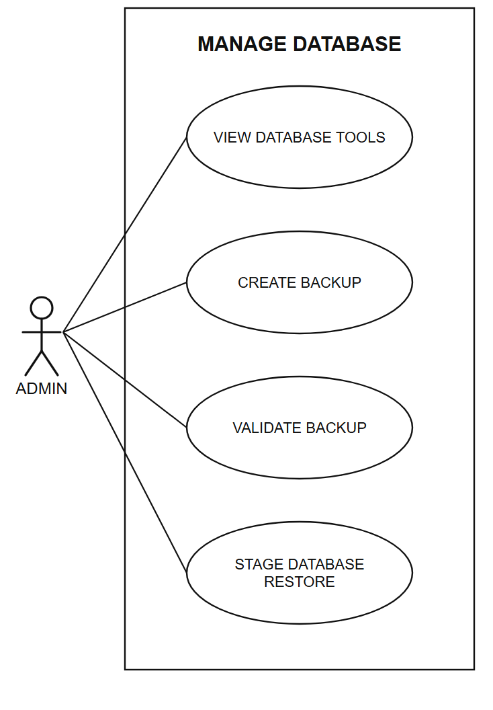

*Figure 3.16: System Use Case for manage database*

### A-077  ·  VIEW DATABASE TOOLS

**Use Case Name:** VIEW DATABASE TOOLS  
**Purpose:** Show database health: file size, integrity check, applied and pending migrations, and the backups on disk.  
**Actors:**

- Admin (Primary Actor)

**Input Parameters:**

- None beyond the signed-in identity carried on the authentication cookie.

**Output Parameters:**

- The rendered page, or a JSON payload where the caller is the page’s own script.

**Pre-Condition:**

- The caller is signed in as an administrator.

**Post-Condition:**

- The caller has the requested information. Nothing in the database has changed.

**Successful Scenario:**

1. The Admin opens the page and CAMS confirms the role on the authentication cookie.
2. The server reads the records the caller is entitled to see.
3. The page renders with those records.

**Exception Scenario:**

- **Not signed in or wrong role** — the request is refused and the caller is sent to the access denied page.

**Additional Remarks:**

- Implemented by `AdminDatabaseController.Index` (GET).
- Appears in the *MANAGE DATABASE* module of the use case diagram.

### A-078  ·  CREATE BACKUP

**Use Case Name:** CREATE BACKUP  
**Purpose:** Take a backup copy of the SQLite database file and store it on the server.  
**Actors:**

- Admin (Primary Actor)

**Input Parameters:**

- `label` : `string?`

**Output Parameters:**

- A redirect back to the listing page, carrying a success or failure message for display.

**Pre-Condition:**

- The caller is signed in as an administrator.

**Post-Condition:**

- The change is committed to the database and visible to the next read.
- The caller sees the outcome reported on the page they return to.

**Successful Scenario:**

1. The Admin opens the page and CAMS confirms the role on the authentication cookie.
2. The Admin fills the form and submits it.
3. The server validates the antiforgery token that accompanied the form.
4. The server validates the submitted values against the model rules.
5. The change is written to the database through `ApplicationDbContext`.
6. The server redirects back to the listing, where the result is shown.

**Exception Scenario:**

- **Not signed in or wrong role** — the request is refused and the caller is sent to the access denied page.
- **Missing or stale antiforgery token** — the submission is rejected and must be retried from a freshly loaded form.
- **Validation fails** — the form is redisplayed with the offending fields marked and nothing is written.

**Additional Remarks:**

- Implemented by `AdminDatabaseController.CreateBackup` (POST).
- Appears in the *MANAGE DATABASE* module of the use case diagram.

### A-079  ·  VALIDATE BACKUP

**Use Case Name:** VALIDATE BACKUP  
**Purpose:** Check that a backup file is a readable, intact database before anybody relies on it.  
**Actors:**

- Admin (Primary Actor)

**Input Parameters:**

- `backupFileName` : `string`

**Output Parameters:**

- A redirect back to the listing page, carrying a success or failure message for display.

**Pre-Condition:**

- The caller is signed in as an administrator.

**Post-Condition:**

- The change is committed to the database and visible to the next read.
- The caller sees the outcome reported on the page they return to.

**Successful Scenario:**

1. The Admin opens the page and CAMS confirms the role on the authentication cookie.
2. The Admin fills the form and submits it.
3. The server validates the antiforgery token that accompanied the form.
4. The server validates the submitted values against the model rules.
5. The change is written to the database through `ApplicationDbContext`.
6. The server redirects back to the listing, where the result is shown.

**Exception Scenario:**

- **Not signed in or wrong role** — the request is refused and the caller is sent to the access denied page.
- **Missing or stale antiforgery token** — the submission is rejected and must be retried from a freshly loaded form.
- **Validation fails** — the form is redisplayed with the offending fields marked and nothing is written.

**Additional Remarks:**

- Implemented by `AdminDatabaseController.ValidateBackup` (POST).
- Appears in the *MANAGE DATABASE* module of the use case diagram.

### A-080  ·  STAGE DATABASE RESTORE

**Use Case Name:** STAGE DATABASE RESTORE  
**Purpose:** Stage a backup so the server restores it on the next restart, rather than swapping the file underneath a running system.  
**Actors:**

- Admin (Primary Actor)

**Input Parameters:**

- `backupFileName` : `string`
- `confirmation` : `string?`

**Output Parameters:**

- A redirect back to the listing page, carrying a success or failure message for display.

**Pre-Condition:**

- The caller is signed in as an administrator.

**Post-Condition:**

- The change is committed to the database and visible to the next read.
- The caller sees the outcome reported on the page they return to.

**Successful Scenario:**

1. The Admin opens the page and CAMS confirms the role on the authentication cookie.
2. The Admin fills the form and submits it.
3. The server validates the antiforgery token that accompanied the form.
4. The server validates the submitted values against the model rules.
5. The change is written to the database through `ApplicationDbContext`.
6. The server redirects back to the listing, where the result is shown.

**Exception Scenario:**

- **Not signed in or wrong role** — the request is refused and the caller is sent to the access denied page.
- **Missing or stale antiforgery token** — the submission is rejected and must be retried from a freshly loaded form.
- **Validation fails** — the form is redisplayed with the offending fields marked and nothing is written.

**Additional Remarks:**

- Implemented by `AdminDatabaseController.StageRestore` (POST).
- Appears in the *MANAGE DATABASE* module of the use case diagram.

## MANAGE DEPLOYMENT  ·  `AdminDeploymentController`

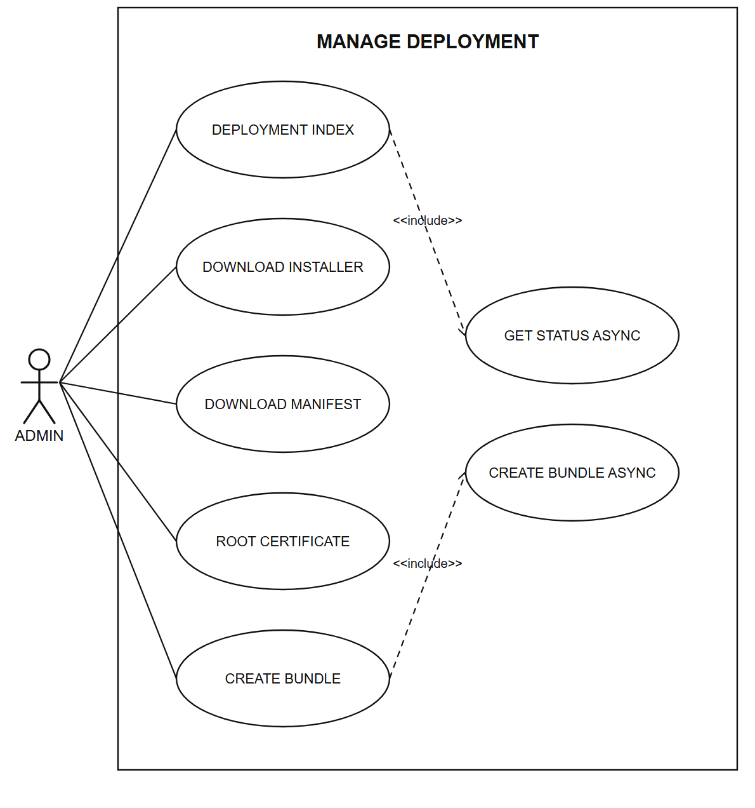

*Figure 3.17: System Use Case for manage deployment*

### A-081  ·  VIEW DEPLOYMENT HUB

**Use Case Name:** VIEW DEPLOYMENT HUB  
**Purpose:** Show the deployment hub: release version, installer and certificate state, and the endpoint clients should use.  
**Actors:**

- Admin (Primary Actor)

**Input Parameters:**

- None beyond the signed-in identity carried on the authentication cookie.

**Output Parameters:**

- The rendered page, or a JSON payload where the caller is the page’s own script.

**Pre-Condition:**

- The caller is signed in as an administrator.

**Post-Condition:**

- The caller has the requested information. Nothing in the database has changed.

**Successful Scenario:**

1. The Admin opens the page and CAMS confirms the role on the authentication cookie.
2. The server reads the records the caller is entitled to see.
3. The page renders with those records.

**Exception Scenario:**

- **Not signed in or wrong role** — the request is refused and the caller is sent to the access denied page.

**Additional Remarks:**

- Implemented by `AdminDeploymentController.Index` (GET).
- Appears in the *MANAGE DEPLOYMENT* module of the use case diagram.

### A-082  ·  DOWNLOAD INSTALLER

**Use Case Name:** DOWNLOAD INSTALLER  
**Purpose:** Download the client installer for deployment to a workstation.  
**Actors:**

- Admin (Primary Actor)

**Input Parameters:**

- None beyond the signed-in identity carried on the authentication cookie.

**Output Parameters:**

- The rendered page, or a JSON payload where the caller is the page’s own script.

**Pre-Condition:**

- The caller is signed in as an administrator.

**Post-Condition:**

- The caller has the requested information. Nothing in the database has changed.

**Successful Scenario:**

1. The Admin opens the page and CAMS confirms the role on the authentication cookie.
2. The server reads the records the caller is entitled to see.
3. The page renders with those records.

**Exception Scenario:**

- **Not signed in or wrong role** — the request is refused and the caller is sent to the access denied page.

**Additional Remarks:**

- Implemented by `AdminDeploymentController.Installer` (GET).
- Appears in the *MANAGE DEPLOYMENT* module of the use case diagram.

### A-083  ·  DOWNLOAD MANIFEST

**Use Case Name:** DOWNLOAD MANIFEST  
**Purpose:** Download the release manifest listing the files and their hashes.  
**Actors:**

- Admin (Primary Actor)

**Input Parameters:**

- None beyond the signed-in identity carried on the authentication cookie.

**Output Parameters:**

- The rendered page, or a JSON payload where the caller is the page’s own script.

**Pre-Condition:**

- The caller is signed in as an administrator.

**Post-Condition:**

- The caller has the requested information. Nothing in the database has changed.

**Successful Scenario:**

1. The Admin opens the page and CAMS confirms the role on the authentication cookie.
2. The server reads the records the caller is entitled to see.
3. The page renders with those records.

**Exception Scenario:**

- **Not signed in or wrong role** — the request is refused and the caller is sent to the access denied page.

**Additional Remarks:**

- Implemented by `AdminDeploymentController.Manifest` (GET).
- Appears in the *MANAGE DEPLOYMENT* module of the use case diagram.

### A-084  ·  DOWNLOAD ROOT CERTIFICATE

**Use Case Name:** DOWNLOAD ROOT CERTIFICATE  
**Purpose:** Download the root certificate a workstation must trust to reach the server over HTTPS.  
**Actors:**

- Admin (Primary Actor)

**Input Parameters:**

- None beyond the signed-in identity carried on the authentication cookie.

**Output Parameters:**

- The rendered page, or a JSON payload where the caller is the page’s own script.

**Pre-Condition:**

- The caller is signed in as an administrator.

**Post-Condition:**

- The caller has the requested information. Nothing in the database has changed.

**Successful Scenario:**

1. The Admin opens the page and CAMS confirms the role on the authentication cookie.
2. The server reads the records the caller is entitled to see.
3. The page renders with those records.

**Exception Scenario:**

- **Not signed in or wrong role** — the request is refused and the caller is sent to the access denied page.

**Additional Remarks:**

- Implemented by `AdminDeploymentController.RootCertificate` (GET).
- Appears in the *MANAGE DEPLOYMENT* module of the use case diagram.

### A-085  ·  CREATE BUNDLE

**Use Case Name:** CREATE BUNDLE  
**Purpose:** Build and download an offline client bundle for a workstation with no access to the server yet.  
**Actors:**

- Admin (Primary Actor)

**Input Parameters:**

- `endpoint` : `string`

**Output Parameters:**

- A redirect back to the listing page, carrying a success or failure message for display.

**Pre-Condition:**

- The caller is signed in as an administrator.

**Post-Condition:**

- The change is committed to the database and visible to the next read.
- The caller sees the outcome reported on the page they return to.

**Successful Scenario:**

1. The Admin opens the page and CAMS confirms the role on the authentication cookie.
2. The Admin fills the form and submits it.
3. The server validates the antiforgery token that accompanied the form.
4. The server validates the submitted values against the model rules.
5. The change is written to the database through `ApplicationDbContext`.
6. The server redirects back to the listing, where the result is shown.

**Exception Scenario:**

- **Not signed in or wrong role** — the request is refused and the caller is sent to the access denied page.
- **Missing or stale antiforgery token** — the submission is rejected and must be retried from a freshly loaded form.
- **Validation fails** — the form is redisplayed with the offending fields marked and nothing is written.

**Additional Remarks:**

- Implemented by `AdminDeploymentController.Bundle` (POST).
- Appears in the *MANAGE DEPLOYMENT* module of the use case diagram.

# TEACHER

## PROCESS LOG IN  ·  `AccountController`

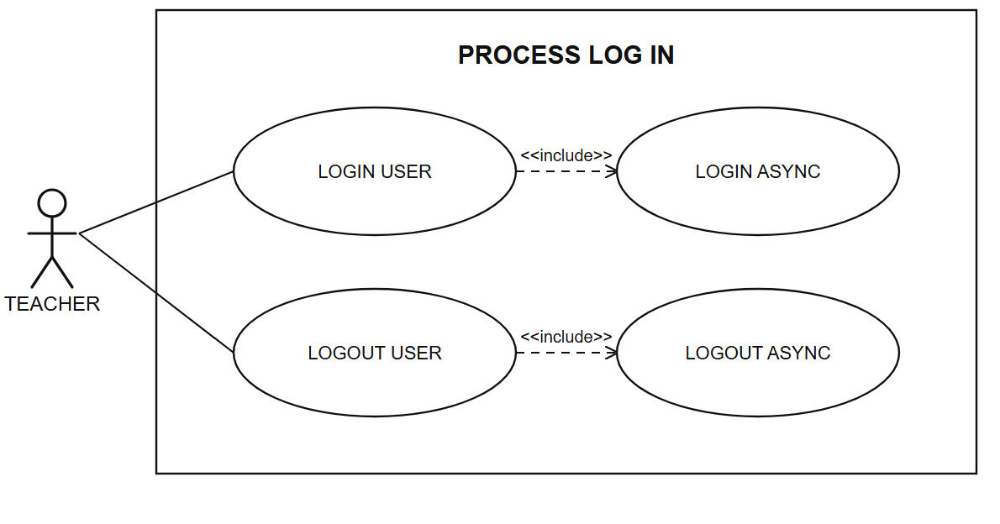

*Figure 3.18: System Use Case for process log in*

### T-086  ·  AUTHENTICATE USER

**Use Case Name:** AUTHENTICATE USER  
**Purpose:** Let a person sign in to the CAMS web portal with a username and password, and place them in the part of the system their role allows.  
**Actors:**

- Teacher (Primary Actor)

**Input Parameters:**

- `username` : `string`
- `password` : `string`

**Output Parameters:**

- An authentication cookie carrying the account role as a claim, and a redirect to the landing page for that role.

**Pre-Condition:**

- None. This is the sign-in endpoint and is reachable without an account session; the CAMS server must be running and reachable.

**Post-Condition:**

- The change is committed to the database and visible to the next read.
- The caller sees the outcome reported on the page they return to.

**Successful Scenario:**

1. The Teacher opens the CAMS sign-in page.
2. The Teacher enters a username and a password and submits the form.
3. The server validates the antiforgery token that accompanied the form.
4. The server checks the credentials against each account table in turn and finds the matching account.
5. The server confirms the account is active and not locked out.
6. The server issues an authentication cookie carrying the role as a claim.
7. The Teacher is redirected to the landing page for that role.

**Exception Scenario:**

- **The username matches no account** — the page reports that the sign-in failed, without saying which half was wrong.
- **The password does not match the stored hash** — the failed-attempt counter is raised and the same message is shown.
- **The account is locked out** — the sign-in is refused until the lockout expires, even with the right password.
- **The account is deactivated** — the sign-in is refused and the person is told to contact an administrator.

**Additional Remarks:**

- Implemented by `AccountController.Login` (POST).
- Appears in the *PROCESS LOG IN* module of the use case diagram.

### T-087  ·  SIGN OUT USER

**Use Case Name:** SIGN OUT USER  
**Purpose:** End the signed-in session and clear the authentication cookie, so the next visitor to the browser starts as an anonymous user.  
**Actors:**

- Teacher (Primary Actor)

**Input Parameters:**

- None beyond the signed-in identity carried on the authentication cookie.

**Output Parameters:**

- The authentication cookie is cleared and the browser is returned to the sign-in page.

**Pre-Condition:**

- The caller is signed in.

**Post-Condition:**

- The change is committed to the database and visible to the next read.
- The caller sees the outcome reported on the page they return to.

**Successful Scenario:**

1. The Teacher chooses to sign out.
2. The server closes any lab session the account still has open.
3. The server clears the authentication cookie.
4. The browser is returned to the sign-in page as an anonymous visitor.

**Exception Scenario:**

- **Not signed in or wrong role** — the request is refused and the caller is sent to the access denied page.
- **Validation fails** — the form is redisplayed with the offending fields marked and nothing is written.

**Additional Remarks:**

- Implemented by `AccountController.Logout` (POST).
- Appears in the *PROCESS LOG IN* module of the use case diagram.

## MANAGE OWN ACCOUNT  ·  `TeacherController`

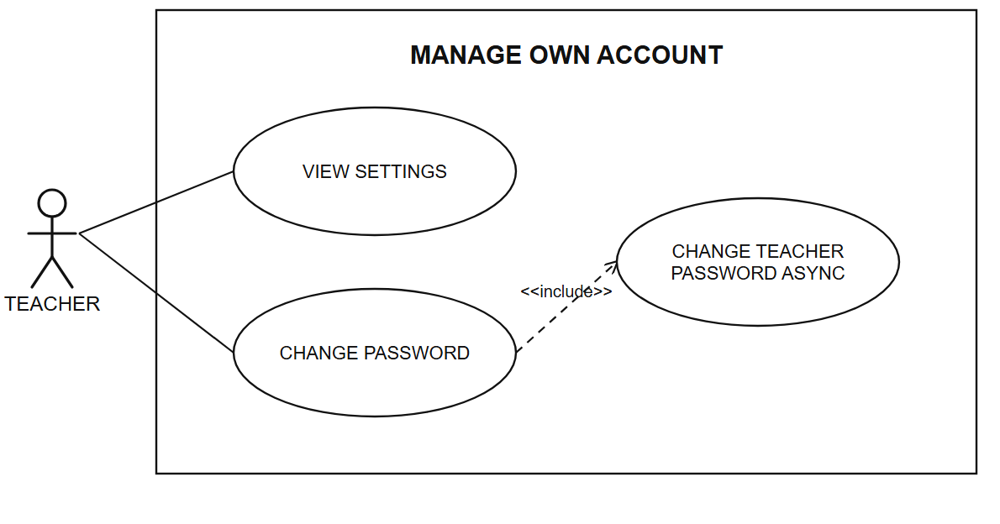

*Figure 3.19: System Use Case for manage own account*

### T-088  ·  VIEW SETTINGS

**Use Case Name:** VIEW SETTINGS  
**Purpose:** Show the settings page for the signed-in user.  
**Actors:**

- Teacher (Primary Actor)

**Input Parameters:**

- None beyond the signed-in identity carried on the authentication cookie.

**Output Parameters:**

- The rendered page, or a JSON payload where the caller is the page’s own script.

**Pre-Condition:**

- The caller is signed in as a teacher.

**Post-Condition:**

- The caller has the requested information. Nothing in the database has changed.

**Successful Scenario:**

1. The Teacher opens the page and CAMS confirms the role on the authentication cookie.
2. The server reads the records the caller is entitled to see.
3. The page renders with those records.

**Exception Scenario:**

- **Not signed in or wrong role** — the request is refused and the caller is sent to the access denied page.

**Additional Remarks:**

- Implemented by `TeacherController.Settings` (GET).
- Appears in the *MANAGE OWN ACCOUNT* module of the use case diagram.

### T-089  ·  CHANGE PASSWORD

**Use Case Name:** CHANGE PASSWORD  
**Purpose:** Let the signed-in user replace their own password after proving they know the current one.  
**Actors:**

- Teacher (Primary Actor)

**Input Parameters:**

- `input` : `PasswordChangeInput`

**Output Parameters:**

- A redirect back to the listing page, carrying a success or failure message for display.

**Pre-Condition:**

- The caller is signed in as a teacher.

**Post-Condition:**

- The change is committed to the database and visible to the next read.
- The caller sees the outcome reported on the page they return to.

**Successful Scenario:**

1. The Teacher opens the page and CAMS confirms the role on the authentication cookie.
2. The Teacher fills the form and submits it.
3. The server validates the antiforgery token that accompanied the form.
4. The server validates the submitted values against the model rules.
5. The change is written to the database through `ApplicationDbContext`.
6. The server redirects back to the listing, where the result is shown.

**Exception Scenario:**

- **Not signed in or wrong role** — the request is refused and the caller is sent to the access denied page.
- **Missing or stale antiforgery token** — the submission is rejected and must be retried from a freshly loaded form.
- **Validation fails** — the form is redisplayed with the offending fields marked and nothing is written.

**Additional Remarks:**

- Implemented by `TeacherController.ChangePassword` (POST).
- Appears in the *MANAGE OWN ACCOUNT* module of the use case diagram.

## MANAGE PEER TEACHER ACCOUNT  ·  `AdminController`

*Figure 3.20: System Use Case for manage peer teacher account*

### T-090  ·  VIEW TEACHERS

**Use Case Name:** VIEW TEACHERS  
**Purpose:** List the teachers the signed-in user is allowed to see.  
**Actors:**

- Teacher (Primary Actor)

**Input Parameters:**

- None beyond the signed-in identity carried on the authentication cookie.

**Output Parameters:**

- The rendered page, or a JSON payload where the caller is the page’s own script.

**Pre-Condition:**

- The caller is signed in as an administrator or a teacher. A teacher reaches this action only because it carries `[TeacherSharedAction]`; the teacher account must also be active.

**Post-Condition:**

- The caller has the requested information. Nothing in the database has changed.

**Successful Scenario:**

1. The Teacher opens the page and CAMS confirms the role on the authentication cookie.
2. The server reads the records the caller is entitled to see.
3. The page renders with those records.

**Exception Scenario:**

- **Not signed in or wrong role** — the request is refused and the caller is sent to the access denied page.

**Additional Remarks:**

- Implemented by `AdminController.Teachers` (GET).
- Appears in the *MANAGE PEER TEACHER ACCOUNT* module of the use case diagram.

### T-091  ·  CREATE TEACHER

**Use Case Name:** CREATE TEACHER  
**Purpose:** Record a new teacher account in the system.  
**Actors:**

- Teacher (Primary Actor)

**Input Parameters:**

- `teacher` : `Teacher`

**Output Parameters:**

- A redirect back to the listing page, carrying a success or failure message for display.

**Pre-Condition:**

- The caller is signed in as an administrator or a teacher. A teacher reaches this action only because it carries `[TeacherSharedAction]`; the teacher account must also be active.

**Post-Condition:**

- The change is committed to the database and visible to the next read.
- The caller sees the outcome reported on the page they return to.

**Successful Scenario:**

1. The Teacher opens the page and CAMS confirms the role on the authentication cookie.
2. The Teacher fills the form and submits it.
3. The server validates the antiforgery token that accompanied the form.
4. The server validates the submitted values against the model rules.
5. The change is written to the database through `ApplicationDbContext`.
6. The server redirects back to the listing, where the result is shown.

**Exception Scenario:**

- **Not signed in or wrong role** — the request is refused and the caller is sent to the access denied page.
- **Missing or stale antiforgery token** — the submission is rejected and must be retried from a freshly loaded form.
- **Validation fails** — the form is redisplayed with the offending fields marked and nothing is written.

**Additional Remarks:**

- Implemented by `AdminController.CreateTeacher` (POST).
- Appears in the *MANAGE PEER TEACHER ACCOUNT* module of the use case diagram.

### T-092  ·  UPDATE TEACHER

**Use Case Name:** UPDATE TEACHER  
**Purpose:** Amend the stored details of an existing teacher account.  
**Actors:**

- Teacher (Primary Actor)

**Input Parameters:**

- `teacher` : `Teacher`
- `newPassword` : `string?`

**Output Parameters:**

- A redirect back to the listing page, carrying a success or failure message for display.

**Pre-Condition:**

- The caller is signed in as an administrator or a teacher. A teacher reaches this action only because it carries `[TeacherSharedAction]`; the teacher account must also be active.

**Post-Condition:**

- The change is committed to the database and visible to the next read.
- The caller sees the outcome reported on the page they return to.

**Successful Scenario:**

1. The Teacher opens the page and CAMS confirms the role on the authentication cookie.
2. The Teacher fills the form and submits it.
3. The server validates the antiforgery token that accompanied the form.
4. The server validates the submitted values against the model rules.
5. The change is written to the database through `ApplicationDbContext`.
6. The server redirects back to the listing, where the result is shown.

**Exception Scenario:**

- **Not signed in or wrong role** — the request is refused and the caller is sent to the access denied page.
- **Missing or stale antiforgery token** — the submission is rejected and must be retried from a freshly loaded form.
- **Validation fails** — the form is redisplayed with the offending fields marked and nothing is written.

**Additional Remarks:**

- Implemented by `AdminController.UpdateTeacher` (POST).
- Appears in the *MANAGE PEER TEACHER ACCOUNT* module of the use case diagram.

### T-093  ·  DELETE TEACHER

**Use Case Name:** DELETE TEACHER  
**Purpose:** Remove a teacher account from the system.  
**Actors:**

- Teacher (Primary Actor)

**Input Parameters:**

- `id` : `int`

**Output Parameters:**

- A redirect back to the listing page, carrying a success or failure message for display.

**Pre-Condition:**

- The caller is signed in as an administrator or a teacher. A teacher reaches this action only because it carries `[TeacherSharedAction]`; the teacher account must also be active.
- The record named by the identifier exists.

**Post-Condition:**

- The change is committed to the database and visible to the next read.
- The caller sees the outcome reported on the page they return to.

**Successful Scenario:**

1. The Teacher opens the page and CAMS confirms the role on the authentication cookie.
2. The Teacher fills the form and submits it.
3. The server validates the antiforgery token that accompanied the form.
4. The server validates the submitted values against the model rules.
5. The change is written to the database through `ApplicationDbContext`.
6. The server redirects back to the listing, where the result is shown.

**Exception Scenario:**

- **Not signed in or wrong role** — the request is refused and the caller is sent to the access denied page.
- **Missing or stale antiforgery token** — the submission is rejected and must be retried from a freshly loaded form.
- **Validation fails** — the form is redisplayed with the offending fields marked and nothing is written.
- **The identifier matches no record** — the action reports that the record was not found and makes no change.
- **The record is still referenced** — the deletion is refused rather than leaving dangling references.

**Additional Remarks:**

- Implemented by `AdminController.DeleteTeacher` (POST).
- Appears in the *MANAGE PEER TEACHER ACCOUNT* module of the use case diagram.

### T-094  ·  UNLOCK ACCOUNT

**Use Case Name:** UNLOCK ACCOUNT  
**Purpose:** Clear the lockout on an account that has been locked by repeated failed sign-in attempts.  
**Actors:**

- Teacher (Primary Actor)

**Input Parameters:**

- `accountRole` : `AccountRole`
- `id` : `int`

**Output Parameters:**

- A redirect back to the listing page, carrying a success or failure message for display.

**Pre-Condition:**

- The caller is signed in as an administrator or a teacher. A teacher reaches this action only because it carries `[TeacherSharedAction]`; the teacher account must also be active.
- The record named by the identifier exists.

**Post-Condition:**

- The change is committed to the database and visible to the next read.
- The caller sees the outcome reported on the page they return to.

**Successful Scenario:**

1. The Teacher opens the page and CAMS confirms the role on the authentication cookie.
2. The Teacher fills the form and submits it.
3. The server validates the antiforgery token that accompanied the form.
4. The server validates the submitted values against the model rules.
5. The change is written to the database through `ApplicationDbContext`.
6. The server redirects back to the listing, where the result is shown.

**Exception Scenario:**

- **Not signed in or wrong role** — the request is refused and the caller is sent to the access denied page.
- **Missing or stale antiforgery token** — the submission is rejected and must be retried from a freshly loaded form.
- **Validation fails** — the form is redisplayed with the offending fields marked and nothing is written.
- **The identifier matches no record** — the action reports that the record was not found and makes no change.

**Additional Remarks:**

- Implemented by `AdminController.UnlockAccount` (POST).
- Appears in the *MANAGE PEER TEACHER ACCOUNT* module of the use case diagram.

### T-095  ·  TOGGLE ACCOUNT STATUS

**Use Case Name:** TOGGLE ACCOUNT STATUS  
**Purpose:** Activate or deactivate an account without deleting it, so a person can be kept out of the system while their records survive.  
**Actors:**

- Teacher (Primary Actor)

**Input Parameters:**

- `accountRole` : `AccountRole`
- `id` : `int`
- `isActive` : `bool`

**Output Parameters:**

- A redirect back to the listing page, carrying a success or failure message for display.

**Pre-Condition:**

- The caller is signed in as an administrator or a teacher. A teacher reaches this action only because it carries `[TeacherSharedAction]`; the teacher account must also be active.
- The record named by the identifier exists.

**Post-Condition:**

- The change is committed to the database and visible to the next read.
- The caller sees the outcome reported on the page they return to.

**Successful Scenario:**

1. The Teacher opens the page and CAMS confirms the role on the authentication cookie.
2. The Teacher fills the form and submits it.
3. The server validates the antiforgery token that accompanied the form.
4. The server validates the submitted values against the model rules.
5. The change is written to the database through `ApplicationDbContext`.
6. The server redirects back to the listing, where the result is shown.

**Exception Scenario:**

- **Not signed in or wrong role** — the request is refused and the caller is sent to the access denied page.
- **Missing or stale antiforgery token** — the submission is rejected and must be retried from a freshly loaded form.
- **Validation fails** — the form is redisplayed with the offending fields marked and nothing is written.
- **The identifier matches no record** — the action reports that the record was not found and makes no change.

**Additional Remarks:**

- Implemented by `AdminController.SetAccountActive` (POST).
- Appears in the *MANAGE PEER TEACHER ACCOUNT* module of the use case diagram.

## MANAGE STUDENT ACCOUNT  ·  `TeacherController`

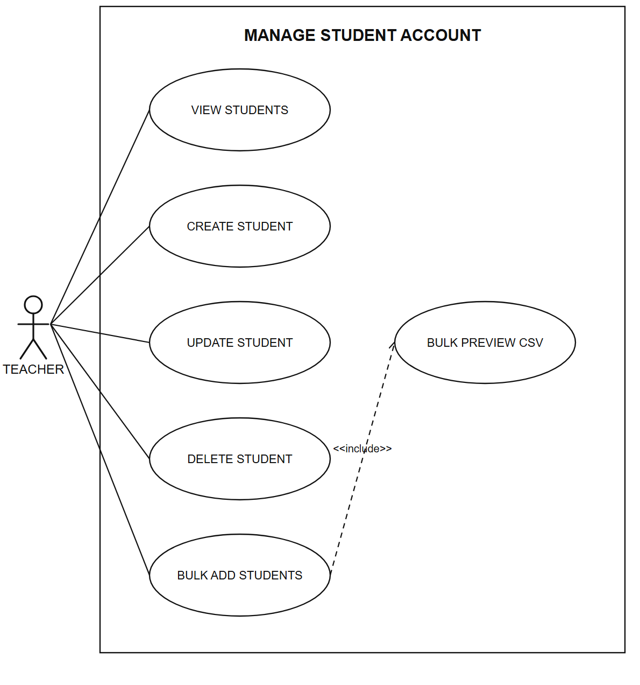

*Figure 3.21: System Use Case for manage student account*

### T-096  ·  VIEW STUDENTS

**Use Case Name:** VIEW STUDENTS  
**Purpose:** List the students the signed-in user is allowed to see.  
**Actors:**

- Teacher (Primary Actor)

**Input Parameters:**

- `search` : `string?` (optional)

**Output Parameters:**

- The rendered page, or a JSON payload where the caller is the page’s own script.

**Pre-Condition:**

- The caller is signed in as a teacher.

**Post-Condition:**

- The caller has the requested information. Nothing in the database has changed.

**Successful Scenario:**

1. The Teacher opens the page and CAMS confirms the role on the authentication cookie.
2. The server reads the records the caller is entitled to see.
3. The page renders with those records.

**Exception Scenario:**

- **Not signed in or wrong role** — the request is refused and the caller is sent to the access denied page.

**Additional Remarks:**

- Implemented by `TeacherController.Students` (GET).
- Appears in the *MANAGE STUDENT ACCOUNT* module of the use case diagram.

### T-097  ·  CREATE STUDENT

**Use Case Name:** CREATE STUDENT  
**Purpose:** Record a new student account in the system.  
**Actors:**

- Teacher (Primary Actor)

**Input Parameters:**

- `student` : `Student`
- `classId` : `int?` (optional)
- `search` : `string?` (optional)

**Output Parameters:**

- A redirect back to the listing page, carrying a success or failure message for display.

**Pre-Condition:**

- The caller is signed in as a teacher.
- The record named by the identifier exists.

**Post-Condition:**

- The change is committed to the database and visible to the next read.
- The caller sees the outcome reported on the page they return to.

**Successful Scenario:**

1. The Teacher opens the page and CAMS confirms the role on the authentication cookie.
2. The Teacher fills the form and submits it.
3. The server validates the antiforgery token that accompanied the form.
4. The server validates the submitted values against the model rules.
5. The change is written to the database through `ApplicationDbContext`.
6. The server redirects back to the listing, where the result is shown.

**Exception Scenario:**

- **Not signed in or wrong role** — the request is refused and the caller is sent to the access denied page.
- **Missing or stale antiforgery token** — the submission is rejected and must be retried from a freshly loaded form.
- **Validation fails** — the form is redisplayed with the offending fields marked and nothing is written.
- **The identifier matches no record** — the action reports that the record was not found and makes no change.

**Additional Remarks:**

- Implemented by `TeacherController.CreateStudent` (POST).
- Appears in the *MANAGE STUDENT ACCOUNT* module of the use case diagram.

### T-098  ·  UPDATE STUDENT

**Use Case Name:** UPDATE STUDENT  
**Purpose:** Amend the stored details of an existing student account.  
**Actors:**

- Teacher (Primary Actor)

**Input Parameters:**

- `student` : `Student`
- `newPassword` : `string?`
- `search` : `string?` (optional)

**Output Parameters:**

- A redirect back to the listing page, carrying a success or failure message for display.

**Pre-Condition:**

- The caller is signed in as a teacher.

**Post-Condition:**

- The change is committed to the database and visible to the next read.
- The caller sees the outcome reported on the page they return to.

**Successful Scenario:**

1. The Teacher opens the page and CAMS confirms the role on the authentication cookie.
2. The Teacher fills the form and submits it.
3. The server validates the antiforgery token that accompanied the form.
4. The server validates the submitted values against the model rules.
5. The change is written to the database through `ApplicationDbContext`.
6. The server redirects back to the listing, where the result is shown.

**Exception Scenario:**

- **Not signed in or wrong role** — the request is refused and the caller is sent to the access denied page.
- **Missing or stale antiforgery token** — the submission is rejected and must be retried from a freshly loaded form.
- **Validation fails** — the form is redisplayed with the offending fields marked and nothing is written.

**Additional Remarks:**

- Implemented by `TeacherController.UpdateStudent` (POST).
- Appears in the *MANAGE STUDENT ACCOUNT* module of the use case diagram.

### T-099  ·  DELETE STUDENT

**Use Case Name:** DELETE STUDENT  
**Purpose:** Remove a student account from the system.  
**Actors:**

- Teacher (Primary Actor)

**Input Parameters:**

- `studentId` : `int`
- `search` : `string?` (optional)

**Output Parameters:**

- A redirect back to the listing page, carrying a success or failure message for display.

**Pre-Condition:**

- The caller is signed in as a teacher.
- The record named by the identifier exists.

**Post-Condition:**

- The change is committed to the database and visible to the next read.
- The caller sees the outcome reported on the page they return to.

**Successful Scenario:**

1. The Teacher opens the page and CAMS confirms the role on the authentication cookie.
2. The Teacher fills the form and submits it.
3. The server validates the antiforgery token that accompanied the form.
4. The server validates the submitted values against the model rules.
5. The change is written to the database through `ApplicationDbContext`.
6. The server redirects back to the listing, where the result is shown.

**Exception Scenario:**

- **Not signed in or wrong role** — the request is refused and the caller is sent to the access denied page.
- **Missing or stale antiforgery token** — the submission is rejected and must be retried from a freshly loaded form.
- **Validation fails** — the form is redisplayed with the offending fields marked and nothing is written.
- **The identifier matches no record** — the action reports that the record was not found and makes no change.
- **The record is still referenced** — the deletion is refused rather than leaving dangling references.

**Additional Remarks:**

- Implemented by `TeacherController.DeleteStudent` (POST).
- Appears in the *MANAGE STUDENT ACCOUNT* module of the use case diagram.

### T-100  ·  IMPORT CLASS ROSTER

**Use Case Name:** IMPORT CLASS ROSTER  
**Purpose:** Create many student accounts at once and enrol them into a class in the same operation.  
**Actors:**

- Teacher (Primary Actor)

**Input Parameters:**

- `classId` : `int`
- `bulkFirstNames` : `List<string>?`
- `bulkLastNames` : `List<string>?`
- `bulkUserNames` : `List<string>?`
- `bulkPasswords` : `List<string>?`

**Output Parameters:**

- A redirect back to the listing page, carrying a success or failure message for display.

**Pre-Condition:**

- The caller is signed in as a teacher.
- The record named by the identifier exists.

**Post-Condition:**

- The change is committed to the database and visible to the next read.
- The caller sees the outcome reported on the page they return to.

**Successful Scenario:**

1. The Teacher opens the page and CAMS confirms the role on the authentication cookie.
2. The Teacher fills the form and submits it.
3. The server validates the antiforgery token that accompanied the form.
4. The server validates the submitted values against the model rules.
5. The change is written to the database through `ApplicationDbContext`.
6. The server redirects back to the listing, where the result is shown.

**Exception Scenario:**

- **Not signed in or wrong role** — the request is refused and the caller is sent to the access denied page.
- **Missing or stale antiforgery token** — the submission is rejected and must be retried from a freshly loaded form.
- **Validation fails** — the form is redisplayed with the offending fields marked and nothing is written.
- **The identifier matches no record** — the action reports that the record was not found and makes no change.

**Additional Remarks:**

- Implemented by `TeacherController.BulkAddStudents` (POST).
- Appears in the *MANAGE STUDENT ACCOUNT* module of the use case diagram.
- Pulls in **PREVIEW ROSTER FILE** (`<<include>>`).

### T-101  ·  PREVIEW ROSTER FILE

**Use Case Name:** PREVIEW ROSTER FILE  
**Purpose:** Parse the submitted CSV and show what would be created, so mistakes are caught before any account exists.  
**Actors:**

- Teacher (Primary Actor)
- None; this behaviour runs inside **IMPORT CLASS ROSTER** (Secondary Actor)

**Input Parameters:**

- `classId` : `int`
- `file` : `IFormFile?`

**Output Parameters:**

- A redirect back to the listing page, carrying a success or failure message for display.

**Pre-Condition:**

- The caller is signed in as a teacher.
- The record named by the identifier exists.
- **IMPORT CLASS ROSTER** has reached the point where this is always performed.

**Post-Condition:**

- The change is committed to the database and visible to the next read.
- The caller sees the outcome reported on the page they return to.

**Successful Scenario:**

1. The Teacher opens the page and CAMS confirms the role on the authentication cookie.
2. The Teacher fills the form and submits it.
3. The server validates the antiforgery token that accompanied the form.
4. The server validates the submitted values against the model rules.
5. The change is written to the database through `ApplicationDbContext`.
6. The server redirects back to the listing, where the result is shown.

**Exception Scenario:**

- **Not signed in or wrong role** — the request is refused and the caller is sent to the access denied page.
- **Missing or stale antiforgery token** — the submission is rejected and must be retried from a freshly loaded form.
- **Validation fails** — the form is redisplayed with the offending fields marked and nothing is written.
- **The identifier matches no record** — the action reports that the record was not found and makes no change.

**Additional Remarks:**

- Implemented by `TeacherController.BulkPreviewCsv` (POST).
- Appears in the *MANAGE STUDENT ACCOUNT* module of the use case diagram.
- Drawn as `<<include>>` from **IMPORT CLASS ROSTER**.

## MANAGE COMPUTER PROFILE  ·  `AdminController`

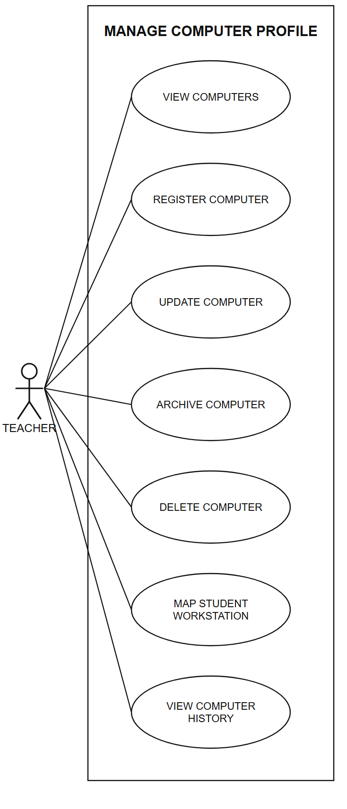

*Figure 3.22: System Use Case for manage computer profile*

### T-102  ·  VIEW COMPUTERS

**Use Case Name:** VIEW COMPUTERS  
**Purpose:** List the computers the signed-in user is allowed to see.  
**Actors:**

- Teacher (Primary Actor)

**Input Parameters:**

- None beyond the signed-in identity carried on the authentication cookie.

**Output Parameters:**

- The rendered page, or a JSON payload where the caller is the page’s own script.

**Pre-Condition:**

- The caller is signed in as an administrator or a teacher. A teacher reaches this action only because it carries `[TeacherSharedAction]`; the teacher account must also be active.

**Post-Condition:**

- The caller has the requested information. Nothing in the database has changed.

**Successful Scenario:**

1. The Teacher opens the page and CAMS confirms the role on the authentication cookie.
2. The server reads the records the caller is entitled to see.
3. The page renders with those records.

**Exception Scenario:**

- **Not signed in or wrong role** — the request is refused and the caller is sent to the access denied page.

**Additional Remarks:**

- Implemented by `AdminController.Computers` (GET).
- Appears in the *MANAGE COMPUTER PROFILE* module of the use case diagram.

### T-103  ·  REGISTER COMPUTER

**Use Case Name:** REGISTER COMPUTER  
**Purpose:** Record a new workstation profile in the system.  
**Actors:**

- Teacher (Primary Actor)

**Input Parameters:**

- `computer` : `Computer`

**Output Parameters:**

- A redirect back to the listing page, carrying a success or failure message for display.

**Pre-Condition:**

- The caller is signed in as an administrator or a teacher. A teacher reaches this action only because it carries `[TeacherSharedAction]`; the teacher account must also be active.

**Post-Condition:**

- The change is committed to the database and visible to the next read.
- The caller sees the outcome reported on the page they return to.

**Successful Scenario:**

1. The Teacher opens the page and CAMS confirms the role on the authentication cookie.
2. The Teacher fills the form and submits it.
3. The server validates the antiforgery token that accompanied the form.
4. The server validates the submitted values against the model rules.
5. The change is written to the database through `ApplicationDbContext`.
6. The server redirects back to the listing, where the result is shown.

**Exception Scenario:**

- **Not signed in or wrong role** — the request is refused and the caller is sent to the access denied page.
- **Missing or stale antiforgery token** — the submission is rejected and must be retried from a freshly loaded form.
- **Validation fails** — the form is redisplayed with the offending fields marked and nothing is written.

**Additional Remarks:**

- Implemented by `AdminController.CreateComputer` (POST).
- Appears in the *MANAGE COMPUTER PROFILE* module of the use case diagram.

### T-104  ·  UPDATE COMPUTER

**Use Case Name:** UPDATE COMPUTER  
**Purpose:** Amend the stored details of an existing workstation profile.  
**Actors:**

- Teacher (Primary Actor)

**Input Parameters:**

- `computer` : `Computer`

**Output Parameters:**

- A redirect back to the listing page, carrying a success or failure message for display.

**Pre-Condition:**

- The caller is signed in as an administrator or a teacher. A teacher reaches this action only because it carries `[TeacherSharedAction]`; the teacher account must also be active.

**Post-Condition:**

- The change is committed to the database and visible to the next read.
- The caller sees the outcome reported on the page they return to.

**Successful Scenario:**

1. The Teacher opens the page and CAMS confirms the role on the authentication cookie.
2. The Teacher fills the form and submits it.
3. The server validates the antiforgery token that accompanied the form.
4. The server validates the submitted values against the model rules.
5. The change is written to the database through `ApplicationDbContext`.
6. The server redirects back to the listing, where the result is shown.

**Exception Scenario:**

- **Not signed in or wrong role** — the request is refused and the caller is sent to the access denied page.
- **Missing or stale antiforgery token** — the submission is rejected and must be retried from a freshly loaded form.
- **Validation fails** — the form is redisplayed with the offending fields marked and nothing is written.

**Additional Remarks:**

- Implemented by `AdminController.UpdateComputer` (POST).
- Appears in the *MANAGE COMPUTER PROFILE* module of the use case diagram.

### T-105  ·  ARCHIVE COMPUTER

**Use Case Name:** ARCHIVE COMPUTER  
**Purpose:** Retire a workstation from the laboratory without erasing it. The record is marked archived and unassigned, so past lab sessions and status history still resolve to a named station. Refused while a lab session is running on it.  
**Actors:**

- Teacher (Primary Actor)

**Input Parameters:**

- `id` : `int`

**Output Parameters:**

- A redirect back to the listing page, carrying a success or failure message for display.

**Pre-Condition:**

- The caller is signed in as an administrator or a teacher. A teacher reaches this action only because it carries `[TeacherSharedAction]`; the teacher account must also be active.
- The record named by the identifier exists.

**Post-Condition:**

- The change is committed to the database and visible to the next read.
- The caller sees the outcome reported on the page they return to.

**Successful Scenario:**

1. The Teacher opens the page and CAMS confirms the role on the authentication cookie.
2. The Teacher fills the form and submits it.
3. The server validates the antiforgery token that accompanied the form.
4. The server validates the submitted values against the model rules.
5. The change is written to the database through `ApplicationDbContext`.
6. The server redirects back to the listing, where the result is shown.

**Exception Scenario:**

- **Not signed in or wrong role** — the request is refused and the caller is sent to the access denied page.
- **Missing or stale antiforgery token** — the submission is rejected and must be retried from a freshly loaded form.
- **Validation fails** — the form is redisplayed with the offending fields marked and nothing is written.
- **The identifier matches no record** — the action reports that the record was not found and makes no change.
- **The record is still referenced** — the deletion is refused rather than leaving dangling references.

**Additional Remarks:**

- Implemented by `AdminController.DeleteComputer` (POST).
- Appears in the *MANAGE COMPUTER PROFILE* module of the use case diagram.

### T-106  ·  DELETE COMPUTER

**Use Case Name:** DELETE COMPUTER  
**Purpose:** Remove a workstation record outright, for a station entered by mistake or one that has left the laboratory for good. Past lab sessions are kept and merely lose their link to the station; the status history for the station is discarded. Refused while a lab session is running on it.  
**Actors:**

- Teacher (Primary Actor)

**Input Parameters:**

- None beyond the signed-in identity carried on the authentication cookie.

**Output Parameters:**

- The behaviour completes and its effect is visible to the use case that includes it.

**Pre-Condition:**

- The caller is signed in.

**Post-Condition:**

- The caller has the requested information. Nothing in the database has changed.

**Successful Scenario:**

1. The including use case reaches the point where this behaviour is required.
2. The server runs `PermanentlyDeleteComputer` and applies its result.
3. Control returns to the including use case, which continues.

**Exception Scenario:**

- The behaviour fails and the including use case reports the failure rather than continuing as if it had succeeded.

**Additional Remarks:**

- Implemented by `PermanentlyDeleteComputer`.
- Appears in the *MANAGE COMPUTER PROFILE* module of the use case diagram.

### T-107  ·  MAP STUDENT WORKSTATION

**Use Case Name:** MAP STUDENT WORKSTATION  
**Purpose:** Map a workstation to a student so the workstation is recognised when that student signs in at it. An archived station cannot be mapped.  
**Actors:**

- Teacher (Primary Actor)

**Input Parameters:**

- `studentId` : `int`
- `computerId` : `int?`

**Output Parameters:**

- A redirect back to the listing page, carrying a success or failure message for display.

**Pre-Condition:**

- The caller is signed in as an administrator or a teacher. A teacher reaches this action only because it carries `[TeacherSharedAction]`; the teacher account must also be active.
- The record named by the identifier exists.

**Post-Condition:**

- The change is committed to the database and visible to the next read.
- The caller sees the outcome reported on the page they return to.

**Successful Scenario:**

1. The Teacher opens the page and CAMS confirms the role on the authentication cookie.
2. The Teacher fills the form and submits it.
3. The server validates the antiforgery token that accompanied the form.
4. The server validates the submitted values against the model rules.
5. The change is written to the database through `ApplicationDbContext`.
6. The server redirects back to the listing, where the result is shown.

**Exception Scenario:**

- **Not signed in or wrong role** — the request is refused and the caller is sent to the access denied page.
- **Missing or stale antiforgery token** — the submission is rejected and must be retried from a freshly loaded form.
- **Validation fails** — the form is redisplayed with the offending fields marked and nothing is written.
- **The identifier matches no record** — the action reports that the record was not found and makes no change.

**Additional Remarks:**

- Implemented by `AdminController.AssignComputer` (POST).
- Appears in the *MANAGE COMPUTER PROFILE* module of the use case diagram.

### T-108  ·  VIEW COMPUTER HISTORY

**Use Case Name:** VIEW COMPUTER HISTORY  
**Purpose:** Show the recorded status changes for a workstation, and who made each one.  
**Actors:**

- Teacher (Primary Actor)

**Input Parameters:**

- `id` : `int`

**Output Parameters:**

- The rendered page, or a JSON payload where the caller is the page’s own script.

**Pre-Condition:**

- The caller is signed in as an administrator or a teacher. A teacher reaches this action only because it carries `[TeacherSharedAction]`; the teacher account must also be active.
- The record named by the identifier exists.

**Post-Condition:**

- The caller has the requested information. Nothing in the database has changed.

**Successful Scenario:**

1. The Teacher opens the page and CAMS confirms the role on the authentication cookie.
2. The server reads the records the caller is entitled to see.
3. The page renders with those records.

**Exception Scenario:**

- **Not signed in or wrong role** — the request is refused and the caller is sent to the access denied page.
- **The identifier matches no record** — the action reports that the record was not found and makes no change.

**Additional Remarks:**

- Implemented by `AdminController.ComputerHistory` (GET).
- Appears in the *MANAGE COMPUTER PROFILE* module of the use case diagram.

## MANAGE CLASS  ·  `TeacherController`

*Figure 3.23: System Use Case for manage class*

### T-109  ·  VIEW CLASSES

**Use Case Name:** VIEW CLASSES  
**Purpose:** List the classes the signed-in user is allowed to see.  
**Actors:**

- Teacher (Primary Actor)

**Input Parameters:**

- None beyond the signed-in identity carried on the authentication cookie.

**Output Parameters:**

- The rendered page, or a JSON payload where the caller is the page’s own script.

**Pre-Condition:**

- The caller is signed in as a teacher.

**Post-Condition:**

- The caller has the requested information. Nothing in the database has changed.

**Successful Scenario:**

1. The Teacher opens the page and CAMS confirms the role on the authentication cookie.
2. The server reads the records the caller is entitled to see.
3. The page renders with those records.

**Exception Scenario:**

- **Not signed in or wrong role** — the request is refused and the caller is sent to the access denied page.

**Additional Remarks:**

- Implemented by `TeacherController.Classes` (GET).
- Appears in the *MANAGE CLASS* module of the use case diagram.

### T-110  ·  CREATE CLASS

**Use Case Name:** CREATE CLASS  
**Purpose:** Record a new class in the system.  
**Actors:**

- Teacher (Primary Actor)

**Input Parameters:**

- `cls` : `Class`

**Output Parameters:**

- A redirect back to the listing page, carrying a success or failure message for display.

**Pre-Condition:**

- The caller is signed in as a teacher.

**Post-Condition:**

- The change is committed to the database and visible to the next read.
- The caller sees the outcome reported on the page they return to.

**Successful Scenario:**

1. The Teacher opens the page and CAMS confirms the role on the authentication cookie.
2. The Teacher fills the form and submits it.
3. The server validates the antiforgery token that accompanied the form.
4. The server validates the submitted values against the model rules.
5. The change is written to the database through `ApplicationDbContext`.
6. The server redirects back to the listing, where the result is shown.

**Exception Scenario:**

- **Not signed in or wrong role** — the request is refused and the caller is sent to the access denied page.
- **Missing or stale antiforgery token** — the submission is rejected and must be retried from a freshly loaded form.
- **Validation fails** — the form is redisplayed with the offending fields marked and nothing is written.

**Additional Remarks:**

- Implemented by `TeacherController.CreateClass` (POST).
- Appears in the *MANAGE CLASS* module of the use case diagram.

### T-111  ·  UPDATE CLASS

**Use Case Name:** UPDATE CLASS  
**Purpose:** Amend the stored details of an existing class.  
**Actors:**

- Teacher (Primary Actor)

**Input Parameters:**

- `cls` : `Class`

**Output Parameters:**

- A redirect back to the listing page, carrying a success or failure message for display.

**Pre-Condition:**

- The caller is signed in as a teacher.

**Post-Condition:**

- The change is committed to the database and visible to the next read.
- The caller sees the outcome reported on the page they return to.

**Successful Scenario:**

1. The Teacher opens the page and CAMS confirms the role on the authentication cookie.
2. The Teacher fills the form and submits it.
3. The server validates the antiforgery token that accompanied the form.
4. The server validates the submitted values against the model rules.
5. The change is written to the database through `ApplicationDbContext`.
6. The server redirects back to the listing, where the result is shown.

**Exception Scenario:**

- **Not signed in or wrong role** — the request is refused and the caller is sent to the access denied page.
- **Missing or stale antiforgery token** — the submission is rejected and must be retried from a freshly loaded form.
- **Validation fails** — the form is redisplayed with the offending fields marked and nothing is written.

**Additional Remarks:**

- Implemented by `TeacherController.UpdateClass` (POST).
- Appears in the *MANAGE CLASS* module of the use case diagram.

### T-112  ·  DELETE CLASS

**Use Case Name:** DELETE CLASS  
**Purpose:** Remove a class from the system.  
**Actors:**

- Teacher (Primary Actor)

**Input Parameters:**

- `classId` : `int`

**Output Parameters:**

- A redirect back to the listing page, carrying a success or failure message for display.

**Pre-Condition:**

- The caller is signed in as a teacher.
- The record named by the identifier exists.

**Post-Condition:**

- The change is committed to the database and visible to the next read.
- The caller sees the outcome reported on the page they return to.

**Successful Scenario:**

1. The Teacher opens the page and CAMS confirms the role on the authentication cookie.
2. The Teacher fills the form and submits it.
3. The server validates the antiforgery token that accompanied the form.
4. The server validates the submitted values against the model rules.
5. The change is written to the database through `ApplicationDbContext`.
6. The server redirects back to the listing, where the result is shown.

**Exception Scenario:**

- **Not signed in or wrong role** — the request is refused and the caller is sent to the access denied page.
- **Missing or stale antiforgery token** — the submission is rejected and must be retried from a freshly loaded form.
- **Validation fails** — the form is redisplayed with the offending fields marked and nothing is written.
- **The identifier matches no record** — the action reports that the record was not found and makes no change.
- **The record is still referenced** — the deletion is refused rather than leaving dangling references.

**Additional Remarks:**

- Implemented by `TeacherController.DeleteClass` (POST).
- Appears in the *MANAGE CLASS* module of the use case diagram.

### T-113  ·  ASSIGN TEACHER

**Use Case Name:** ASSIGN TEACHER  
**Purpose:** Put a teacher in charge of a class.  
**Actors:**

- Teacher (Primary Actor)

**Input Parameters:**

- `classId` : `int`
- `teacherId` : `int?`

**Output Parameters:**

- A redirect back to the listing page, carrying a success or failure message for display.

**Pre-Condition:**

- The caller is signed in as a teacher.
- The record named by the identifier exists.

**Post-Condition:**

- The change is committed to the database and visible to the next read.
- The caller sees the outcome reported on the page they return to.

**Successful Scenario:**

1. The Teacher opens the page and CAMS confirms the role on the authentication cookie.
2. The Teacher fills the form and submits it.
3. The server validates the antiforgery token that accompanied the form.
4. The server validates the submitted values against the model rules.
5. The change is written to the database through `ApplicationDbContext`.
6. The server redirects back to the listing, where the result is shown.

**Exception Scenario:**

- **Not signed in or wrong role** — the request is refused and the caller is sent to the access denied page.
- **Missing or stale antiforgery token** — the submission is rejected and must be retried from a freshly loaded form.
- **Validation fails** — the form is redisplayed with the offending fields marked and nothing is written.
- **The identifier matches no record** — the action reports that the record was not found and makes no change.

**Additional Remarks:**

- Implemented by `TeacherController.AssignTeacher` (POST).
- Appears in the *MANAGE CLASS* module of the use case diagram.

### T-114  ·  ARCHIVE CLASS

**Use Case Name:** ARCHIVE CLASS  
**Purpose:** Take a class out of active use while keeping its roster and records.  
**Actors:**

- Teacher (Primary Actor)

**Input Parameters:**

- `id` : `int`

**Output Parameters:**

- A redirect back to the listing page, carrying a success or failure message for display.

**Pre-Condition:**

- The caller is signed in as a teacher.
- The record named by the identifier exists.

**Post-Condition:**

- The change is committed to the database and visible to the next read.
- The caller sees the outcome reported on the page they return to.

**Successful Scenario:**

1. The Teacher opens the page and CAMS confirms the role on the authentication cookie.
2. The Teacher fills the form and submits it.
3. The server validates the antiforgery token that accompanied the form.
4. The server validates the submitted values against the model rules.
5. The change is written to the database through `ApplicationDbContext`.
6. The server redirects back to the listing, where the result is shown.

**Exception Scenario:**

- **Not signed in or wrong role** — the request is refused and the caller is sent to the access denied page.
- **Missing or stale antiforgery token** — the submission is rejected and must be retried from a freshly loaded form.
- **Validation fails** — the form is redisplayed with the offending fields marked and nothing is written.
- **The identifier matches no record** — the action reports that the record was not found and makes no change.

**Additional Remarks:**

- Implemented by `TeacherController.ArchiveClass` (POST).
- Appears in the *MANAGE CLASS* module of the use case diagram.

## MANAGE CLASS ROSTER  ·  `TeacherController`

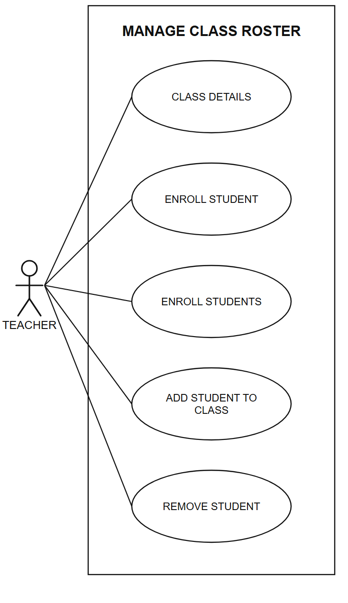

*Figure 3.24: System Use Case for manage class roster*

### T-115  ·  VIEW CLASS DETAILS

**Use Case Name:** VIEW CLASS DETAILS  
**Purpose:** Show one class with its roster and the students enrolled in it.  
**Actors:**

- Teacher (Primary Actor)

**Input Parameters:**

- `id` : `int`

**Output Parameters:**

- The rendered page, or a JSON payload where the caller is the page’s own script.

**Pre-Condition:**

- The caller is signed in as a teacher.
- The record named by the identifier exists.

**Post-Condition:**

- The caller has the requested information. Nothing in the database has changed.

**Successful Scenario:**

1. The Teacher opens the page and CAMS confirms the role on the authentication cookie.
2. The server reads the records the caller is entitled to see.
3. The page renders with those records.

**Exception Scenario:**

- **Not signed in or wrong role** — the request is refused and the caller is sent to the access denied page.
- **The identifier matches no record** — the action reports that the record was not found and makes no change.

**Additional Remarks:**

- Implemented by `TeacherController.ClassDetails` (GET).
- Appears in the *MANAGE CLASS ROSTER* module of the use case diagram.

### T-116  ·  ENROLL STUDENT

**Use Case Name:** ENROLL STUDENT  
**Purpose:** Add an existing student to a class roster.  
**Actors:**

- Teacher (Primary Actor)

**Input Parameters:**

- `classId` : `int`
- `studentId` : `int`
- `moveStudent` : `bool` (optional)

**Output Parameters:**

- A redirect back to the listing page, carrying a success or failure message for display.

**Pre-Condition:**

- The caller is signed in as a teacher.
- The record named by the identifier exists.

**Post-Condition:**

- The change is committed to the database and visible to the next read.
- The caller sees the outcome reported on the page they return to.

**Successful Scenario:**

1. The Teacher opens the page and CAMS confirms the role on the authentication cookie.
2. The Teacher fills the form and submits it.
3. The server validates the antiforgery token that accompanied the form.
4. The server validates the submitted values against the model rules.
5. The change is written to the database through `ApplicationDbContext`.
6. The server redirects back to the listing, where the result is shown.

**Exception Scenario:**

- **Not signed in or wrong role** — the request is refused and the caller is sent to the access denied page.
- **Missing or stale antiforgery token** — the submission is rejected and must be retried from a freshly loaded form.
- **Validation fails** — the form is redisplayed with the offending fields marked and nothing is written.
- **The identifier matches no record** — the action reports that the record was not found and makes no change.

**Additional Remarks:**

- Implemented by `TeacherController.EnrollStudent` (POST).
- Appears in the *MANAGE CLASS ROSTER* module of the use case diagram.

### T-117  ·  ENROLL STUDENT GROUP

**Use Case Name:** ENROLL STUDENT GROUP  
**Purpose:** Add several existing students to a class roster in one operation.  
**Actors:**

- Teacher (Primary Actor)

**Input Parameters:**

- `classId` : `int`
- `studentIds` : `List<int>?`
- `moveStudent` : `bool` (optional)

**Output Parameters:**

- A redirect back to the listing page, carrying a success or failure message for display.

**Pre-Condition:**

- The caller is signed in as a teacher.
- The record named by the identifier exists.

**Post-Condition:**

- The change is committed to the database and visible to the next read.
- The caller sees the outcome reported on the page they return to.

**Successful Scenario:**

1. The Teacher opens the page and CAMS confirms the role on the authentication cookie.
2. The Teacher fills the form and submits it.
3. The server validates the antiforgery token that accompanied the form.
4. The server validates the submitted values against the model rules.
5. The change is written to the database through `ApplicationDbContext`.
6. The server redirects back to the listing, where the result is shown.

**Exception Scenario:**

- **Not signed in or wrong role** — the request is refused and the caller is sent to the access denied page.
- **Missing or stale antiforgery token** — the submission is rejected and must be retried from a freshly loaded form.
- **Validation fails** — the form is redisplayed with the offending fields marked and nothing is written.
- **The identifier matches no record** — the action reports that the record was not found and makes no change.

**Additional Remarks:**

- Implemented by `TeacherController.EnrollStudents` (POST).
- Appears in the *MANAGE CLASS ROSTER* module of the use case diagram.

### T-118  ·  ADD CLASS MEMBER

**Use Case Name:** ADD CLASS MEMBER  
**Purpose:** Create a new student account and place it on a class roster in one step.  
**Actors:**

- Teacher (Primary Actor)

**Input Parameters:**

- `classId` : `int`
- `firstName` : `string`
- `lastName` : `string`
- `username` : `string?`
- `password` : `string?`

**Output Parameters:**

- A redirect back to the listing page, carrying a success or failure message for display.

**Pre-Condition:**

- The caller is signed in as a teacher.
- The record named by the identifier exists.

**Post-Condition:**

- The change is committed to the database and visible to the next read.
- The caller sees the outcome reported on the page they return to.

**Successful Scenario:**

1. The Teacher opens the page and CAMS confirms the role on the authentication cookie.
2. The Teacher fills the form and submits it.
3. The server validates the antiforgery token that accompanied the form.
4. The server validates the submitted values against the model rules.
5. The change is written to the database through `ApplicationDbContext`.
6. The server redirects back to the listing, where the result is shown.

**Exception Scenario:**

- **Not signed in or wrong role** — the request is refused and the caller is sent to the access denied page.
- **Missing or stale antiforgery token** — the submission is rejected and must be retried from a freshly loaded form.
- **Validation fails** — the form is redisplayed with the offending fields marked and nothing is written.
- **The identifier matches no record** — the action reports that the record was not found and makes no change.

**Additional Remarks:**

- Implemented by `TeacherController.AddStudentToClass` (POST).
- Appears in the *MANAGE CLASS ROSTER* module of the use case diagram.

### T-119  ·  REMOVE STUDENT

**Use Case Name:** REMOVE STUDENT  
**Purpose:** Take a student off a class roster while leaving the student account intact.  
**Actors:**

- Teacher (Primary Actor)

**Input Parameters:**

- `classId` : `int`
- `studentId` : `int`

**Output Parameters:**

- A redirect back to the listing page, carrying a success or failure message for display.

**Pre-Condition:**

- The caller is signed in as a teacher.
- The record named by the identifier exists.

**Post-Condition:**

- The change is committed to the database and visible to the next read.
- The caller sees the outcome reported on the page they return to.

**Successful Scenario:**

1. The Teacher opens the page and CAMS confirms the role on the authentication cookie.
2. The Teacher fills the form and submits it.
3. The server validates the antiforgery token that accompanied the form.
4. The server validates the submitted values against the model rules.
5. The change is written to the database through `ApplicationDbContext`.
6. The server redirects back to the listing, where the result is shown.

**Exception Scenario:**

- **Not signed in or wrong role** — the request is refused and the caller is sent to the access denied page.
- **Missing or stale antiforgery token** — the submission is rejected and must be retried from a freshly loaded form.
- **Validation fails** — the form is redisplayed with the offending fields marked and nothing is written.
- **The identifier matches no record** — the action reports that the record was not found and makes no change.

**Additional Remarks:**

- Implemented by `TeacherController.RemoveStudent` (POST).
- Appears in the *MANAGE CLASS ROSTER* module of the use case diagram.

## MANAGE RESTRICTION RULE  ·  `TeacherController`

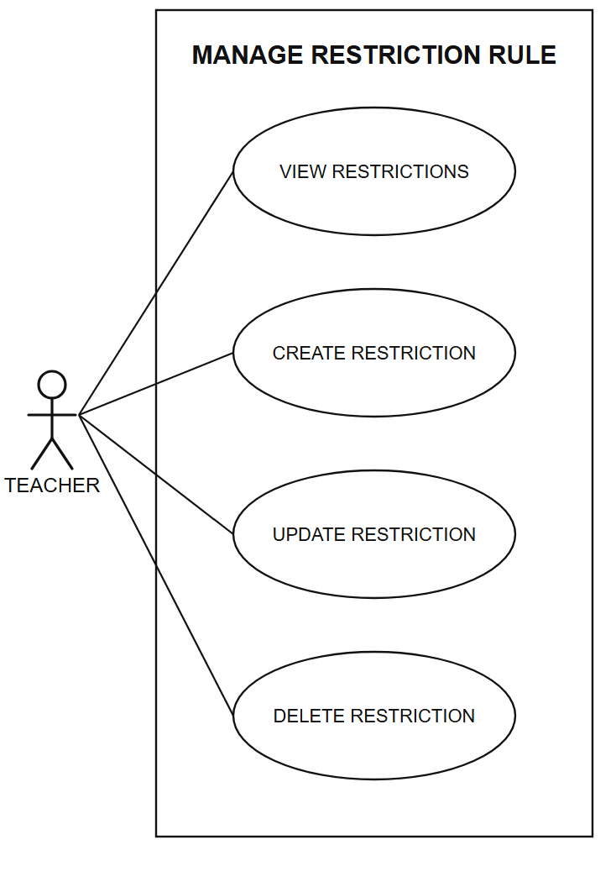

*Figure 3.25: System Use Case for manage restriction rule*

### T-120  ·  VIEW RESTRICTIONS

**Use Case Name:** VIEW RESTRICTIONS  
**Purpose:** List the restrictions the signed-in user is allowed to see.  
**Actors:**

- Teacher (Primary Actor)

**Input Parameters:**

- None beyond the signed-in identity carried on the authentication cookie.

**Output Parameters:**

- The rendered page, or a JSON payload where the caller is the page’s own script.

**Pre-Condition:**

- The caller is signed in as a teacher.

**Post-Condition:**

- The caller has the requested information. Nothing in the database has changed.

**Successful Scenario:**

1. The Teacher opens the page and CAMS confirms the role on the authentication cookie.
2. The server reads the records the caller is entitled to see.
3. The page renders with those records.

**Exception Scenario:**

- **Not signed in or wrong role** — the request is refused and the caller is sent to the access denied page.

**Additional Remarks:**

- Implemented by `TeacherController.Restrictions` (GET).
- Appears in the *MANAGE RESTRICTION RULE* module of the use case diagram.

### T-121  ·  CREATE RESTRICTION

**Use Case Name:** CREATE RESTRICTION  
**Purpose:** Record a new restriction rule in the system.  
**Actors:**

- Teacher (Primary Actor)

**Input Parameters:**

- `rule` : `RestrictionRule`

**Output Parameters:**

- A redirect back to the listing page, carrying a success or failure message for display.

**Pre-Condition:**

- The caller is signed in as a teacher.

**Post-Condition:**

- The change is committed to the database and visible to the next read.
- The caller sees the outcome reported on the page they return to.

**Successful Scenario:**

1. The Teacher opens the page and CAMS confirms the role on the authentication cookie.
2. The Teacher fills the form and submits it.
3. The server validates the antiforgery token that accompanied the form.
4. The server validates the submitted values against the model rules.
5. The change is written to the database through `ApplicationDbContext`.
6. The server redirects back to the listing, where the result is shown.

**Exception Scenario:**

- **Not signed in or wrong role** — the request is refused and the caller is sent to the access denied page.
- **Missing or stale antiforgery token** — the submission is rejected and must be retried from a freshly loaded form.
- **Validation fails** — the form is redisplayed with the offending fields marked and nothing is written.

**Additional Remarks:**

- Implemented by `TeacherController.CreateRestriction` (POST).
- Appears in the *MANAGE RESTRICTION RULE* module of the use case diagram.

### T-122  ·  UPDATE RESTRICTION

**Use Case Name:** UPDATE RESTRICTION  
**Purpose:** Amend the stored details of an existing restriction rule.  
**Actors:**

- Teacher (Primary Actor)

**Input Parameters:**

- `input` : `RestrictionRule`

**Output Parameters:**

- A redirect back to the listing page, carrying a success or failure message for display.

**Pre-Condition:**

- The caller is signed in as a teacher.

**Post-Condition:**

- The change is committed to the database and visible to the next read.
- The caller sees the outcome reported on the page they return to.

**Successful Scenario:**

1. The Teacher opens the page and CAMS confirms the role on the authentication cookie.
2. The Teacher fills the form and submits it.
3. The server validates the antiforgery token that accompanied the form.
4. The server validates the submitted values against the model rules.
5. The change is written to the database through `ApplicationDbContext`.
6. The server redirects back to the listing, where the result is shown.

**Exception Scenario:**

- **Not signed in or wrong role** — the request is refused and the caller is sent to the access denied page.
- **Missing or stale antiforgery token** — the submission is rejected and must be retried from a freshly loaded form.
- **Validation fails** — the form is redisplayed with the offending fields marked and nothing is written.

**Additional Remarks:**

- Implemented by `TeacherController.UpdateRestriction` (POST).
- Appears in the *MANAGE RESTRICTION RULE* module of the use case diagram.

### T-123  ·  DELETE RESTRICTION

**Use Case Name:** DELETE RESTRICTION  
**Purpose:** Remove a restriction rule from the system.  
**Actors:**

- Teacher (Primary Actor)

**Input Parameters:**

- `id` : `int`

**Output Parameters:**

- A redirect back to the listing page, carrying a success or failure message for display.

**Pre-Condition:**

- The caller is signed in as a teacher.
- The record named by the identifier exists.

**Post-Condition:**

- The change is committed to the database and visible to the next read.
- The caller sees the outcome reported on the page they return to.

**Successful Scenario:**

1. The Teacher opens the page and CAMS confirms the role on the authentication cookie.
2. The Teacher fills the form and submits it.
3. The server validates the antiforgery token that accompanied the form.
4. The server validates the submitted values against the model rules.
5. The change is written to the database through `ApplicationDbContext`.
6. The server redirects back to the listing, where the result is shown.

**Exception Scenario:**

- **Not signed in or wrong role** — the request is refused and the caller is sent to the access denied page.
- **Missing or stale antiforgery token** — the submission is rejected and must be retried from a freshly loaded form.
- **Validation fails** — the form is redisplayed with the offending fields marked and nothing is written.
- **The identifier matches no record** — the action reports that the record was not found and makes no change.
- **The record is still referenced** — the deletion is refused rather than leaving dangling references.

**Additional Remarks:**

- Implemented by `TeacherController.DeleteRestriction` (POST).
- Appears in the *MANAGE RESTRICTION RULE* module of the use case diagram.

## MANAGE BLACKLIST AND WHITELIST  ·  `AdminController`

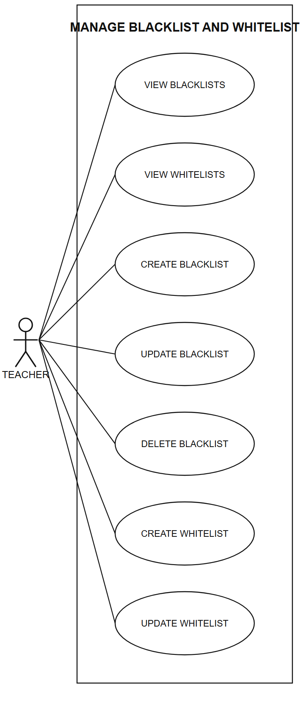

*Figure 3.26: System Use Case for manage blacklist and whitelist*

### T-124  ·  VIEW BLACKLISTS

**Use Case Name:** VIEW BLACKLISTS  
**Purpose:** List the blacklists the signed-in user is allowed to see.  
**Actors:**

- Teacher (Primary Actor)

**Input Parameters:**

- None beyond the signed-in identity carried on the authentication cookie.

**Output Parameters:**

- The rendered page, or a JSON payload where the caller is the page’s own script.

**Pre-Condition:**

- The caller is signed in as an administrator or a teacher. A teacher reaches this action only because it carries `[TeacherSharedAction]`; the teacher account must also be active.

**Post-Condition:**

- The caller has the requested information. Nothing in the database has changed.

**Successful Scenario:**

1. The Teacher opens the page and CAMS confirms the role on the authentication cookie.
2. The server reads the records the caller is entitled to see.
3. The page renders with those records.

**Exception Scenario:**

- **Not signed in or wrong role** — the request is refused and the caller is sent to the access denied page.

**Additional Remarks:**

- Implemented by `AdminController.Blacklists` (GET).
- Appears in the *MANAGE BLACKLIST AND WHITELIST* module of the use case diagram.

### T-125  ·  VIEW WHITELISTS

**Use Case Name:** VIEW WHITELISTS  
**Purpose:** List the whitelists the signed-in user is allowed to see.  
**Actors:**

- Teacher (Primary Actor)

**Input Parameters:**

- None beyond the signed-in identity carried on the authentication cookie.

**Output Parameters:**

- The rendered page, or a JSON payload where the caller is the page’s own script.

**Pre-Condition:**

- The caller is signed in as an administrator or a teacher. A teacher reaches this action only because it carries `[TeacherSharedAction]`; the teacher account must also be active.

**Post-Condition:**

- The caller has the requested information. Nothing in the database has changed.

**Successful Scenario:**

1. The Teacher opens the page and CAMS confirms the role on the authentication cookie.
2. The server reads the records the caller is entitled to see.
3. The page renders with those records.

**Exception Scenario:**

- **Not signed in or wrong role** — the request is refused and the caller is sent to the access denied page.

**Additional Remarks:**

- Implemented by `AdminController.Whitelists` (GET).
- Appears in the *MANAGE BLACKLIST AND WHITELIST* module of the use case diagram.

### T-126  ·  CREATE BLACKLIST

**Use Case Name:** CREATE BLACKLIST  
**Purpose:** Record a new blacklist entry in the system.  
**Actors:**

- Teacher (Primary Actor)

**Input Parameters:**

- `RestrictionRuleId` — bound from the submitted form
- `RuleType` — bound from the submitted form
- `Target` — bound from the submitted form
- `Description` — bound from the submitted form
- `IsGlobal` — bound from the submitted form
- `IsActive` — bound from the submitted form
- `item` : `BlacklistItem`

**Output Parameters:**

- A redirect back to the listing page, carrying a success or failure message for display.

**Pre-Condition:**

- The caller is signed in as an administrator or a teacher. A teacher reaches this action only because it carries `[TeacherSharedAction]`; the teacher account must also be active.

**Post-Condition:**

- The change is committed to the database and visible to the next read.
- The caller sees the outcome reported on the page they return to.

**Successful Scenario:**

1. The Teacher opens the page and CAMS confirms the role on the authentication cookie.
2. The Teacher fills the form and submits it.
3. The server validates the antiforgery token that accompanied the form.
4. The server validates the submitted values against the model rules.
5. The change is written to the database through `ApplicationDbContext`.
6. The server redirects back to the listing, where the result is shown.

**Exception Scenario:**

- **Not signed in or wrong role** — the request is refused and the caller is sent to the access denied page.
- **Missing or stale antiforgery token** — the submission is rejected and must be retried from a freshly loaded form.
- **Validation fails** — the form is redisplayed with the offending fields marked and nothing is written.

**Additional Remarks:**

- Implemented by `AdminController.CreateBlacklist` (POST).
- Appears in the *MANAGE BLACKLIST AND WHITELIST* module of the use case diagram.

### T-127  ·  UPDATE BLACKLIST

**Use Case Name:** UPDATE BLACKLIST  
**Purpose:** Amend the stored details of an existing blacklist entry.  
**Actors:**

- Teacher (Primary Actor)

**Input Parameters:**

- `input` : `BlacklistItem`

**Output Parameters:**

- A redirect back to the listing page, carrying a success or failure message for display.

**Pre-Condition:**

- The caller is signed in as an administrator or a teacher. A teacher reaches this action only because it carries `[TeacherSharedAction]`; the teacher account must also be active.

**Post-Condition:**

- The change is committed to the database and visible to the next read.
- The caller sees the outcome reported on the page they return to.

**Successful Scenario:**

1. The Teacher opens the page and CAMS confirms the role on the authentication cookie.
2. The Teacher fills the form and submits it.
3. The server validates the antiforgery token that accompanied the form.
4. The server validates the submitted values against the model rules.
5. The change is written to the database through `ApplicationDbContext`.
6. The server redirects back to the listing, where the result is shown.

**Exception Scenario:**

- **Not signed in or wrong role** — the request is refused and the caller is sent to the access denied page.
- **Missing or stale antiforgery token** — the submission is rejected and must be retried from a freshly loaded form.
- **Validation fails** — the form is redisplayed with the offending fields marked and nothing is written.

**Additional Remarks:**

- Implemented by `AdminController.UpdateBlacklist` (POST).
- Appears in the *MANAGE BLACKLIST AND WHITELIST* module of the use case diagram.

### T-128  ·  DELETE BLACKLIST

**Use Case Name:** DELETE BLACKLIST  
**Purpose:** Remove a blacklist entry from the system.  
**Actors:**

- Teacher (Primary Actor)

**Input Parameters:**

- `id` : `int`

**Output Parameters:**

- A redirect back to the listing page, carrying a success or failure message for display.

**Pre-Condition:**

- The caller is signed in as an administrator or a teacher. A teacher reaches this action only because it carries `[TeacherSharedAction]`; the teacher account must also be active.
- The record named by the identifier exists.

**Post-Condition:**

- The change is committed to the database and visible to the next read.
- The caller sees the outcome reported on the page they return to.

**Successful Scenario:**

1. The Teacher opens the page and CAMS confirms the role on the authentication cookie.
2. The Teacher fills the form and submits it.
3. The server validates the antiforgery token that accompanied the form.
4. The server validates the submitted values against the model rules.
5. The change is written to the database through `ApplicationDbContext`.
6. The server redirects back to the listing, where the result is shown.

**Exception Scenario:**

- **Not signed in or wrong role** — the request is refused and the caller is sent to the access denied page.
- **Missing or stale antiforgery token** — the submission is rejected and must be retried from a freshly loaded form.
- **Validation fails** — the form is redisplayed with the offending fields marked and nothing is written.
- **The identifier matches no record** — the action reports that the record was not found and makes no change.
- **The record is still referenced** — the deletion is refused rather than leaving dangling references.

**Additional Remarks:**

- Implemented by `AdminController.DeleteBlacklist` (POST).
- Appears in the *MANAGE BLACKLIST AND WHITELIST* module of the use case diagram.

### T-129  ·  CREATE WHITELIST

**Use Case Name:** CREATE WHITELIST  
**Purpose:** Record a new whitelist entry in the system.  
**Actors:**

- Teacher (Primary Actor)

**Input Parameters:**

- `rule` : `RestrictionRule`

**Output Parameters:**

- A redirect back to the listing page, carrying a success or failure message for display.

**Pre-Condition:**

- The caller is signed in as an administrator or a teacher. A teacher reaches this action only because it carries `[TeacherSharedAction]`; the teacher account must also be active.

**Post-Condition:**

- The change is committed to the database and visible to the next read.
- The caller sees the outcome reported on the page they return to.

**Successful Scenario:**

1. The Teacher opens the page and CAMS confirms the role on the authentication cookie.
2. The Teacher fills the form and submits it.
3. The server validates the antiforgery token that accompanied the form.
4. The server validates the submitted values against the model rules.
5. The change is written to the database through `ApplicationDbContext`.
6. The server redirects back to the listing, where the result is shown.

**Exception Scenario:**

- **Not signed in or wrong role** — the request is refused and the caller is sent to the access denied page.
- **Missing or stale antiforgery token** — the submission is rejected and must be retried from a freshly loaded form.
- **Validation fails** — the form is redisplayed with the offending fields marked and nothing is written.

**Additional Remarks:**

- Implemented by `AdminController.CreateWhitelist` (POST).
- Appears in the *MANAGE BLACKLIST AND WHITELIST* module of the use case diagram.

### T-130  ·  UPDATE WHITELIST

**Use Case Name:** UPDATE WHITELIST  
**Purpose:** Amend the stored details of an existing whitelist entry.  
**Actors:**

- Teacher (Primary Actor)

**Input Parameters:**

- `RuleType` — bound from the submitted form
- `Target` — bound from the submitted form
- `Description` — bound from the submitted form
- `IsGlobal` — bound from the submitted form
- `IsActive` — bound from the submitted form
- `rule` : `RestrictionRule`

**Output Parameters:**

- A redirect back to the listing page, carrying a success or failure message for display.

**Pre-Condition:**

- The caller is signed in as an administrator or a teacher. A teacher reaches this action only because it carries `[TeacherSharedAction]`; the teacher account must also be active.

**Post-Condition:**

- The change is committed to the database and visible to the next read.
- The caller sees the outcome reported on the page they return to.

**Successful Scenario:**

1. The Teacher opens the page and CAMS confirms the role on the authentication cookie.
2. The Teacher fills the form and submits it.
3. The server validates the antiforgery token that accompanied the form.
4. The server validates the submitted values against the model rules.
5. The change is written to the database through `ApplicationDbContext`.
6. The server redirects back to the listing, where the result is shown.

**Exception Scenario:**

- **Not signed in or wrong role** — the request is refused and the caller is sent to the access denied page.
- **Missing or stale antiforgery token** — the submission is rejected and must be retried from a freshly loaded form.
- **Validation fails** — the form is redisplayed with the offending fields marked and nothing is written.

**Additional Remarks:**

- Implemented by `AdminController.UpdateWhitelist` (POST).
- Appears in the *MANAGE BLACKLIST AND WHITELIST* module of the use case diagram.

## MANAGE CATEGORY  ·  `AdminController`

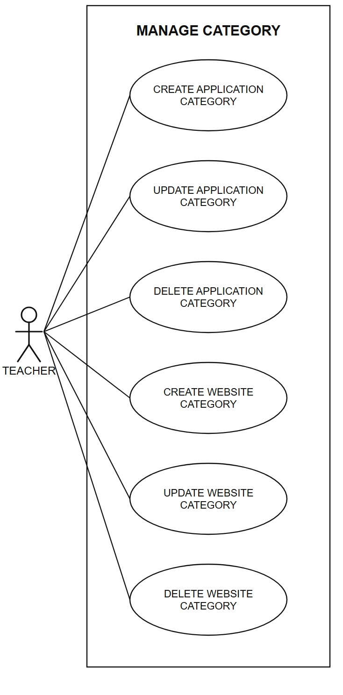

*Figure 3.27: System Use Case for manage category*

### T-131  ·  CREATE APPLICATION CATEGORY

**Use Case Name:** CREATE APPLICATION CATEGORY  
**Purpose:** Record a new application category in the system.  
**Actors:**

- Teacher (Primary Actor)

**Input Parameters:**

- `category` : `ApplicationCategory`

**Output Parameters:**

- A redirect back to the listing page, carrying a success or failure message for display.

**Pre-Condition:**

- The caller is signed in as an administrator or a teacher. A teacher reaches this action only because it carries `[TeacherSharedAction]`; the teacher account must also be active.

**Post-Condition:**

- The change is committed to the database and visible to the next read.
- The caller sees the outcome reported on the page they return to.

**Successful Scenario:**

1. The Teacher opens the page and CAMS confirms the role on the authentication cookie.
2. The Teacher fills the form and submits it.
3. The server validates the antiforgery token that accompanied the form.
4. The server validates the submitted values against the model rules.
5. The change is written to the database through `ApplicationDbContext`.
6. The server redirects back to the listing, where the result is shown.

**Exception Scenario:**

- **Not signed in or wrong role** — the request is refused and the caller is sent to the access denied page.
- **Missing or stale antiforgery token** — the submission is rejected and must be retried from a freshly loaded form.
- **Validation fails** — the form is redisplayed with the offending fields marked and nothing is written.

**Additional Remarks:**

- Implemented by `AdminController.CreateApplicationCategory` (POST).
- Appears in the *MANAGE CATEGORY* module of the use case diagram.

### T-132  ·  UPDATE APPLICATION CATEGORY

**Use Case Name:** UPDATE APPLICATION CATEGORY  
**Purpose:** Amend the stored details of an existing application category.  
**Actors:**

- Teacher (Primary Actor)

**Input Parameters:**

- `input` : `ApplicationCategory`

**Output Parameters:**

- A redirect back to the listing page, carrying a success or failure message for display.

**Pre-Condition:**

- The caller is signed in as an administrator or a teacher. A teacher reaches this action only because it carries `[TeacherSharedAction]`; the teacher account must also be active.

**Post-Condition:**

- The change is committed to the database and visible to the next read.
- The caller sees the outcome reported on the page they return to.

**Successful Scenario:**

1. The Teacher opens the page and CAMS confirms the role on the authentication cookie.
2. The Teacher fills the form and submits it.
3. The server validates the antiforgery token that accompanied the form.
4. The server validates the submitted values against the model rules.
5. The change is written to the database through `ApplicationDbContext`.
6. The server redirects back to the listing, where the result is shown.

**Exception Scenario:**

- **Not signed in or wrong role** — the request is refused and the caller is sent to the access denied page.
- **Missing or stale antiforgery token** — the submission is rejected and must be retried from a freshly loaded form.
- **Validation fails** — the form is redisplayed with the offending fields marked and nothing is written.

**Additional Remarks:**

- Implemented by `AdminController.UpdateApplicationCategory` (POST).
- Appears in the *MANAGE CATEGORY* module of the use case diagram.

### T-133  ·  DELETE APPLICATION CATEGORY

**Use Case Name:** DELETE APPLICATION CATEGORY  
**Purpose:** Remove a application category from the system.  
**Actors:**

- Teacher (Primary Actor)

**Input Parameters:**

- `id` : `int`

**Output Parameters:**

- A redirect back to the listing page, carrying a success or failure message for display.

**Pre-Condition:**

- The caller is signed in as an administrator or a teacher. A teacher reaches this action only because it carries `[TeacherSharedAction]`; the teacher account must also be active.
- The record named by the identifier exists.

**Post-Condition:**

- The change is committed to the database and visible to the next read.
- The caller sees the outcome reported on the page they return to.

**Successful Scenario:**

1. The Teacher opens the page and CAMS confirms the role on the authentication cookie.
2. The Teacher fills the form and submits it.
3. The server validates the antiforgery token that accompanied the form.
4. The server validates the submitted values against the model rules.
5. The change is written to the database through `ApplicationDbContext`.
6. The server redirects back to the listing, where the result is shown.

**Exception Scenario:**

- **Not signed in or wrong role** — the request is refused and the caller is sent to the access denied page.
- **Missing or stale antiforgery token** — the submission is rejected and must be retried from a freshly loaded form.
- **Validation fails** — the form is redisplayed with the offending fields marked and nothing is written.
- **The identifier matches no record** — the action reports that the record was not found and makes no change.
- **The record is still referenced** — the deletion is refused rather than leaving dangling references.

**Additional Remarks:**

- Implemented by `AdminController.DeleteApplicationCategory` (POST).
- Appears in the *MANAGE CATEGORY* module of the use case diagram.

### T-134  ·  CREATE WEBSITE CATEGORY

**Use Case Name:** CREATE WEBSITE CATEGORY  
**Purpose:** Record a new website category in the system.  
**Actors:**

- Teacher (Primary Actor)

**Input Parameters:**

- `category` : `WebsiteCategory`

**Output Parameters:**

- A redirect back to the listing page, carrying a success or failure message for display.

**Pre-Condition:**

- The caller is signed in as an administrator or a teacher. A teacher reaches this action only because it carries `[TeacherSharedAction]`; the teacher account must also be active.

**Post-Condition:**

- The change is committed to the database and visible to the next read.
- The caller sees the outcome reported on the page they return to.

**Successful Scenario:**

1. The Teacher opens the page and CAMS confirms the role on the authentication cookie.
2. The Teacher fills the form and submits it.
3. The server validates the antiforgery token that accompanied the form.
4. The server validates the submitted values against the model rules.
5. The change is written to the database through `ApplicationDbContext`.
6. The server redirects back to the listing, where the result is shown.

**Exception Scenario:**

- **Not signed in or wrong role** — the request is refused and the caller is sent to the access denied page.
- **Missing or stale antiforgery token** — the submission is rejected and must be retried from a freshly loaded form.
- **Validation fails** — the form is redisplayed with the offending fields marked and nothing is written.

**Additional Remarks:**

- Implemented by `AdminController.CreateWebsiteCategory` (POST).
- Appears in the *MANAGE CATEGORY* module of the use case diagram.

### T-135  ·  UPDATE WEBSITE CATEGORY

**Use Case Name:** UPDATE WEBSITE CATEGORY  
**Purpose:** Amend the stored details of an existing website category.  
**Actors:**

- Teacher (Primary Actor)

**Input Parameters:**

- `input` : `WebsiteCategory`

**Output Parameters:**

- A redirect back to the listing page, carrying a success or failure message for display.

**Pre-Condition:**

- The caller is signed in as an administrator or a teacher. A teacher reaches this action only because it carries `[TeacherSharedAction]`; the teacher account must also be active.

**Post-Condition:**

- The change is committed to the database and visible to the next read.
- The caller sees the outcome reported on the page they return to.

**Successful Scenario:**

1. The Teacher opens the page and CAMS confirms the role on the authentication cookie.
2. The Teacher fills the form and submits it.
3. The server validates the antiforgery token that accompanied the form.
4. The server validates the submitted values against the model rules.
5. The change is written to the database through `ApplicationDbContext`.
6. The server redirects back to the listing, where the result is shown.

**Exception Scenario:**

- **Not signed in or wrong role** — the request is refused and the caller is sent to the access denied page.
- **Missing or stale antiforgery token** — the submission is rejected and must be retried from a freshly loaded form.
- **Validation fails** — the form is redisplayed with the offending fields marked and nothing is written.

**Additional Remarks:**

- Implemented by `AdminController.UpdateWebsiteCategory` (POST).
- Appears in the *MANAGE CATEGORY* module of the use case diagram.

### T-136  ·  DELETE WEBSITE CATEGORY

**Use Case Name:** DELETE WEBSITE CATEGORY  
**Purpose:** Remove a website category from the system.  
**Actors:**

- Teacher (Primary Actor)

**Input Parameters:**

- `id` : `int`

**Output Parameters:**

- A redirect back to the listing page, carrying a success or failure message for display.

**Pre-Condition:**

- The caller is signed in as an administrator or a teacher. A teacher reaches this action only because it carries `[TeacherSharedAction]`; the teacher account must also be active.
- The record named by the identifier exists.

**Post-Condition:**

- The change is committed to the database and visible to the next read.
- The caller sees the outcome reported on the page they return to.

**Successful Scenario:**

1. The Teacher opens the page and CAMS confirms the role on the authentication cookie.
2. The Teacher fills the form and submits it.
3. The server validates the antiforgery token that accompanied the form.
4. The server validates the submitted values against the model rules.
5. The change is written to the database through `ApplicationDbContext`.
6. The server redirects back to the listing, where the result is shown.

**Exception Scenario:**

- **Not signed in or wrong role** — the request is refused and the caller is sent to the access denied page.
- **Missing or stale antiforgery token** — the submission is rejected and must be retried from a freshly loaded form.
- **Validation fails** — the form is redisplayed with the offending fields marked and nothing is written.
- **The identifier matches no record** — the action reports that the record was not found and makes no change.
- **The record is still referenced** — the deletion is refused rather than leaving dangling references.

**Additional Remarks:**

- Implemented by `AdminController.DeleteWebsiteCategory` (POST).
- Appears in the *MANAGE CATEGORY* module of the use case diagram.

## MANAGE SESSION RULE  ·  `AdminController`

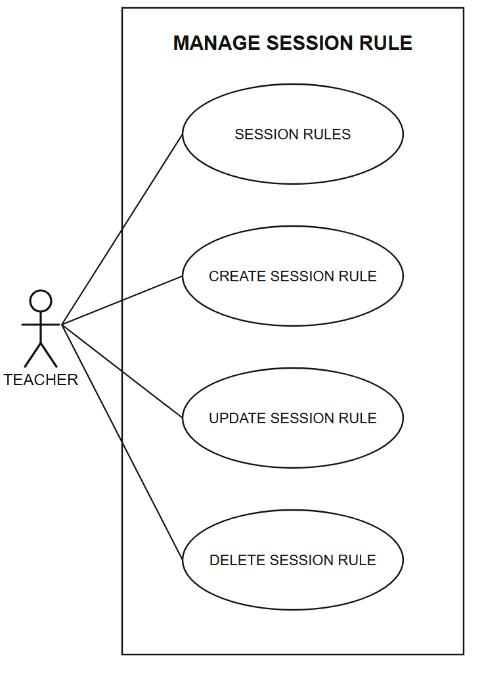

*Figure 3.28: System Use Case for manage session rule*

### T-137  ·  VIEW SESSION RULES

**Use Case Name:** VIEW SESSION RULES  
**Purpose:** List the session rules the signed-in user is allowed to see.  
**Actors:**

- Teacher (Primary Actor)

**Input Parameters:**

- None beyond the signed-in identity carried on the authentication cookie.

**Output Parameters:**

- The rendered page, or a JSON payload where the caller is the page’s own script.

**Pre-Condition:**

- The caller is signed in as an administrator or a teacher. A teacher reaches this action only because it carries `[TeacherSharedAction]`; the teacher account must also be active.

**Post-Condition:**

- The caller has the requested information. Nothing in the database has changed.

**Successful Scenario:**

1. The Teacher opens the page and CAMS confirms the role on the authentication cookie.
2. The server reads the records the caller is entitled to see.
3. The page renders with those records.

**Exception Scenario:**

- **Not signed in or wrong role** — the request is refused and the caller is sent to the access denied page.

**Additional Remarks:**

- Implemented by `AdminController.SessionRules` (GET).
- Appears in the *MANAGE SESSION RULE* module of the use case diagram.

### T-138  ·  CREATE SESSION RULE

**Use Case Name:** CREATE SESSION RULE  
**Purpose:** Record a new session rule in the system.  
**Actors:**

- Teacher (Primary Actor)

**Input Parameters:**

- `rule` : `SessionRule`

**Output Parameters:**

- A redirect back to the listing page, carrying a success or failure message for display.

**Pre-Condition:**

- The caller is signed in as an administrator or a teacher. A teacher reaches this action only because it carries `[TeacherSharedAction]`; the teacher account must also be active.

**Post-Condition:**

- The change is committed to the database and visible to the next read.
- The caller sees the outcome reported on the page they return to.

**Successful Scenario:**

1. The Teacher opens the page and CAMS confirms the role on the authentication cookie.
2. The Teacher fills the form and submits it.
3. The server validates the antiforgery token that accompanied the form.
4. The server validates the submitted values against the model rules.
5. The change is written to the database through `ApplicationDbContext`.
6. The server redirects back to the listing, where the result is shown.

**Exception Scenario:**

- **Not signed in or wrong role** — the request is refused and the caller is sent to the access denied page.
- **Missing or stale antiforgery token** — the submission is rejected and must be retried from a freshly loaded form.
- **Validation fails** — the form is redisplayed with the offending fields marked and nothing is written.

**Additional Remarks:**

- Implemented by `AdminController.CreateSessionRule` (POST).
- Appears in the *MANAGE SESSION RULE* module of the use case diagram.

### T-139  ·  UPDATE SESSION RULE

**Use Case Name:** UPDATE SESSION RULE  
**Purpose:** Amend the stored details of an existing session rule.  
**Actors:**

- Teacher (Primary Actor)

**Input Parameters:**

- `input` : `SessionRule`

**Output Parameters:**

- A redirect back to the listing page, carrying a success or failure message for display.

**Pre-Condition:**

- The caller is signed in as an administrator or a teacher. A teacher reaches this action only because it carries `[TeacherSharedAction]`; the teacher account must also be active.

**Post-Condition:**

- The change is committed to the database and visible to the next read.
- The caller sees the outcome reported on the page they return to.

**Successful Scenario:**

1. The Teacher opens the page and CAMS confirms the role on the authentication cookie.
2. The Teacher fills the form and submits it.
3. The server validates the antiforgery token that accompanied the form.
4. The server validates the submitted values against the model rules.
5. The change is written to the database through `ApplicationDbContext`.
6. The server redirects back to the listing, where the result is shown.

**Exception Scenario:**

- **Not signed in or wrong role** — the request is refused and the caller is sent to the access denied page.
- **Missing or stale antiforgery token** — the submission is rejected and must be retried from a freshly loaded form.
- **Validation fails** — the form is redisplayed with the offending fields marked and nothing is written.

**Additional Remarks:**

- Implemented by `AdminController.UpdateSessionRule` (POST).
- Appears in the *MANAGE SESSION RULE* module of the use case diagram.

### T-140  ·  DEACTIVATE SESSION RULE

**Use Case Name:** DEACTIVATE SESSION RULE  
**Purpose:** Take a session rule out of use while keeping it on file. The rule is marked inactive and loses any default flag, and sessions already recorded against it still resolve to a named rule; where the rule allowed remote control, open remote sessions under it are closed.  
**Actors:**

- Teacher (Primary Actor)

**Input Parameters:**

- `id` : `int`

**Output Parameters:**

- A redirect back to the listing page, carrying a success or failure message for display.

**Pre-Condition:**

- The caller is signed in as an administrator or a teacher. A teacher reaches this action only because it carries `[TeacherSharedAction]`; the teacher account must also be active.
- The record named by the identifier exists.

**Post-Condition:**

- The change is committed to the database and visible to the next read.
- The caller sees the outcome reported on the page they return to.

**Successful Scenario:**

1. The Teacher opens the page and CAMS confirms the role on the authentication cookie.
2. The Teacher fills the form and submits it.
3. The server validates the antiforgery token that accompanied the form.
4. The server validates the submitted values against the model rules.
5. The change is written to the database through `ApplicationDbContext`.
6. The server redirects back to the listing, where the result is shown.

**Exception Scenario:**

- **Not signed in or wrong role** — the request is refused and the caller is sent to the access denied page.
- **Missing or stale antiforgery token** — the submission is rejected and must be retried from a freshly loaded form.
- **Validation fails** — the form is redisplayed with the offending fields marked and nothing is written.
- **The identifier matches no record** — the action reports that the record was not found and makes no change.
- **The record is still referenced** — the deletion is refused rather than leaving dangling references.

**Additional Remarks:**

- Implemented by `AdminController.DeleteSessionRule` (POST).
- Appears in the *MANAGE SESSION RULE* module of the use case diagram.

## CONTROL LABORATORY SESSION  ·  `TeacherController`

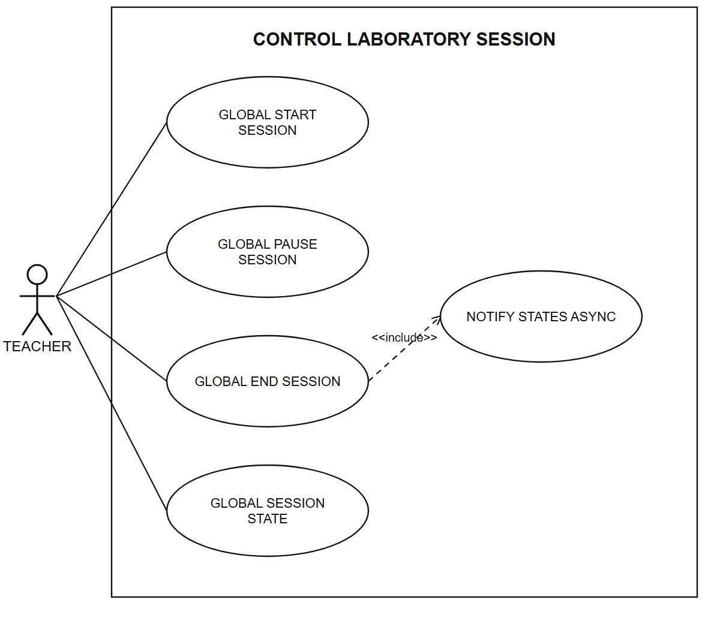

*Figure 3.29: System Use Case for control laboratory session*

### T-141  ·  RESUME LAB SESSIONS

**Use Case Name:** RESUME LAB SESSIONS  
**Purpose:** Start a laboratory-wide session so every connected workstation begins at the same moment.  
**Actors:**

- Teacher (Primary Actor)

**Input Parameters:**

- None beyond the signed-in identity carried on the authentication cookie.

**Output Parameters:**

- A redirect back to the listing page, carrying a success or failure message for display.

**Pre-Condition:**

- The caller is signed in as a teacher.

**Post-Condition:**

- The change is committed to the database and visible to the next read.
- The caller sees the outcome reported on the page they return to.

**Successful Scenario:**

1. The Teacher opens the page and CAMS confirms the role on the authentication cookie.
2. The Teacher fills the form and submits it.
3. The server validates the antiforgery token that accompanied the form.
4. The server validates the submitted values against the model rules.
5. The change is written to the database through `ApplicationDbContext`.
6. The server redirects back to the listing, where the result is shown.

**Exception Scenario:**

- **Not signed in or wrong role** — the request is refused and the caller is sent to the access denied page.
- **Missing or stale antiforgery token** — the submission is rejected and must be retried from a freshly loaded form.
- **Validation fails** — the form is redisplayed with the offending fields marked and nothing is written.

**Additional Remarks:**

- Implemented by `TeacherController.GlobalStartSession` (POST).
- Appears in the *CONTROL LABORATORY SESSION* module of the use case diagram.

### T-142  ·  PAUSE LAB SESSIONS

**Use Case Name:** PAUSE LAB SESSIONS  
**Purpose:** Pause the laboratory-wide session for the whole room.  
**Actors:**

- Teacher (Primary Actor)

**Input Parameters:**

- None beyond the signed-in identity carried on the authentication cookie.

**Output Parameters:**

- A redirect back to the listing page, carrying a success or failure message for display.

**Pre-Condition:**

- The caller is signed in as a teacher.

**Post-Condition:**

- The change is committed to the database and visible to the next read.
- The caller sees the outcome reported on the page they return to.

**Successful Scenario:**

1. The Teacher opens the page and CAMS confirms the role on the authentication cookie.
2. The Teacher fills the form and submits it.
3. The server validates the antiforgery token that accompanied the form.
4. The server validates the submitted values against the model rules.
5. The change is written to the database through `ApplicationDbContext`.
6. The server redirects back to the listing, where the result is shown.

**Exception Scenario:**

- **Not signed in or wrong role** — the request is refused and the caller is sent to the access denied page.
- **Missing or stale antiforgery token** — the submission is rejected and must be retried from a freshly loaded form.
- **Validation fails** — the form is redisplayed with the offending fields marked and nothing is written.

**Additional Remarks:**

- Implemented by `TeacherController.GlobalPauseSession` (POST).
- Appears in the *CONTROL LABORATORY SESSION* module of the use case diagram.

### T-143  ·  END LAB SESSIONS

**Use Case Name:** END LAB SESSIONS  
**Purpose:** End the laboratory-wide session for the whole room.  
**Actors:**

- Teacher (Primary Actor)

**Input Parameters:**

- None beyond the signed-in identity carried on the authentication cookie.

**Output Parameters:**

- A redirect back to the listing page, carrying a success or failure message for display.

**Pre-Condition:**

- The caller is signed in as a teacher.

**Post-Condition:**

- The change is committed to the database and visible to the next read.
- The caller sees the outcome reported on the page they return to.

**Successful Scenario:**

1. The Teacher opens the page and CAMS confirms the role on the authentication cookie.
2. The Teacher fills the form and submits it.
3. The server validates the antiforgery token that accompanied the form.
4. The server validates the submitted values against the model rules.
5. The change is written to the database through `ApplicationDbContext`.
6. The server redirects back to the listing, where the result is shown.

**Exception Scenario:**

- **Not signed in or wrong role** — the request is refused and the caller is sent to the access denied page.
- **Missing or stale antiforgery token** — the submission is rejected and must be retried from a freshly loaded form.
- **Validation fails** — the form is redisplayed with the offending fields marked and nothing is written.

**Additional Remarks:**

- Implemented by `TeacherController.GlobalEndSession` (POST).
- Appears in the *CONTROL LABORATORY SESSION* module of the use case diagram.

### T-144  ·  VIEW SESSION STATE

**Use Case Name:** VIEW SESSION STATE  
**Purpose:** Report the current laboratory-wide session state so the page can show the right timer and controls.  
**Actors:**

- Teacher (Primary Actor)

**Input Parameters:**

- None beyond the signed-in identity carried on the authentication cookie.

**Output Parameters:**

- The rendered page, or a JSON payload where the caller is the page’s own script.

**Pre-Condition:**

- The caller is signed in as a teacher.

**Post-Condition:**

- The caller has the requested information. Nothing in the database has changed.

**Successful Scenario:**

1. The Teacher opens the page and CAMS confirms the role on the authentication cookie.
2. The server reads the records the caller is entitled to see.
3. The page renders with those records.

**Exception Scenario:**

- **Not signed in or wrong role** — the request is refused and the caller is sent to the access denied page.

**Additional Remarks:**

- Implemented by `TeacherController.GlobalSessionState` (GET).
- Appears in the *CONTROL LABORATORY SESSION* module of the use case diagram.

## CONTROL STUDENT SESSION  ·  `TeacherController`

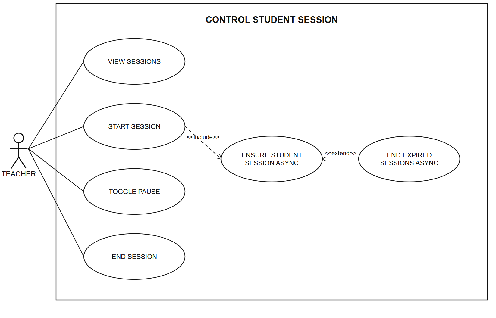

*Figure 3.30: System Use Case for control student session*

### T-145  ·  VIEW SESSIONS

**Use Case Name:** VIEW SESSIONS  
**Purpose:** List the lab sessions the teacher may act on.  
**Actors:**

- Teacher (Primary Actor)

**Input Parameters:**

- None beyond the signed-in identity carried on the authentication cookie.

**Output Parameters:**

- The rendered page, or a JSON payload where the caller is the page’s own script.

**Pre-Condition:**

- The caller is signed in as a teacher.

**Post-Condition:**

- The caller has the requested information. Nothing in the database has changed.

**Successful Scenario:**

1. The Teacher opens the page and CAMS confirms the role on the authentication cookie.
2. The server reads the records the caller is entitled to see.
3. The page renders with those records.

**Exception Scenario:**

- **Not signed in or wrong role** — the request is refused and the caller is sent to the access denied page.

**Additional Remarks:**

- Implemented by `TeacherController.Sessions` (GET).
- Appears in the *CONTROL STUDENT SESSION* module of the use case diagram.

### T-146  ·  START SESSION

**Use Case Name:** START SESSION  
**Purpose:** Open a lab session for one student at one workstation under a chosen session rule.  
**Actors:**

- Teacher (Primary Actor)

**Input Parameters:**

- `studentId` : `int`
- `computerId` : `int?`
- `sessionRuleId` : `int?`

**Output Parameters:**

- A redirect back to the listing page, carrying a success or failure message for display.

**Pre-Condition:**

- The caller is signed in as a teacher.
- The record named by the identifier exists.

**Post-Condition:**

- The change is committed to the database and visible to the next read.
- The caller sees the outcome reported on the page they return to.

**Successful Scenario:**

1. The Teacher opens the page and CAMS confirms the role on the authentication cookie.
2. The Teacher fills the form and submits it.
3. The server validates the antiforgery token that accompanied the form.
4. The server validates the submitted values against the model rules.
5. The change is written to the database through `ApplicationDbContext`.
6. The server redirects back to the listing, where the result is shown.

**Exception Scenario:**

- **Not signed in or wrong role** — the request is refused and the caller is sent to the access denied page.
- **Missing or stale antiforgery token** — the submission is rejected and must be retried from a freshly loaded form.
- **Validation fails** — the form is redisplayed with the offending fields marked and nothing is written.
- **The identifier matches no record** — the action reports that the record was not found and makes no change.

**Additional Remarks:**

- Implemented by `TeacherController.StartSession` (POST).
- Appears in the *CONTROL STUDENT SESSION* module of the use case diagram.

### T-147  ·  TOGGLE SESSION PAUSE

**Use Case Name:** TOGGLE SESSION PAUSE  
**Purpose:** Pause a running session, or resume a paused one, accumulating the paused time so it is not charged against the limit.  
**Actors:**

- Teacher (Primary Actor)

**Input Parameters:**

- `id` : `int`

**Output Parameters:**

- A redirect back to the listing page, carrying a success or failure message for display.

**Pre-Condition:**

- The caller is signed in as a teacher.
- The record named by the identifier exists.

**Post-Condition:**

- The change is committed to the database and visible to the next read.
- The caller sees the outcome reported on the page they return to.

**Successful Scenario:**

1. The Teacher opens the page and CAMS confirms the role on the authentication cookie.
2. The Teacher fills the form and submits it.
3. The server validates the antiforgery token that accompanied the form.
4. The server validates the submitted values against the model rules.
5. The change is written to the database through `ApplicationDbContext`.
6. The server redirects back to the listing, where the result is shown.

**Exception Scenario:**

- **Not signed in or wrong role** — the request is refused and the caller is sent to the access denied page.
- **Missing or stale antiforgery token** — the submission is rejected and must be retried from a freshly loaded form.
- **Validation fails** — the form is redisplayed with the offending fields marked and nothing is written.
- **The identifier matches no record** — the action reports that the record was not found and makes no change.

**Additional Remarks:**

- Implemented by `TeacherController.TogglePause` (POST).
- Appears in the *CONTROL STUDENT SESSION* module of the use case diagram.

### T-148  ·  END SESSION

**Use Case Name:** END SESSION  
**Purpose:** Close one student lab session and record its end time.  
**Actors:**

- Teacher (Primary Actor)

**Input Parameters:**

- `id` : `int`

**Output Parameters:**

- A redirect back to the listing page, carrying a success or failure message for display.

**Pre-Condition:**

- The caller is signed in as a teacher.
- The record named by the identifier exists.

**Post-Condition:**

- The change is committed to the database and visible to the next read.
- The caller sees the outcome reported on the page they return to.

**Successful Scenario:**

1. The Teacher opens the page and CAMS confirms the role on the authentication cookie.
2. The Teacher fills the form and submits it.
3. The server validates the antiforgery token that accompanied the form.
4. The server validates the submitted values against the model rules.
5. The change is written to the database through `ApplicationDbContext`.
6. The server redirects back to the listing, where the result is shown.

**Exception Scenario:**

- **Not signed in or wrong role** — the request is refused and the caller is sent to the access denied page.
- **Missing or stale antiforgery token** — the submission is rejected and must be retried from a freshly loaded form.
- **Validation fails** — the form is redisplayed with the offending fields marked and nothing is written.
- **The identifier matches no record** — the action reports that the record was not found and makes no change.

**Additional Remarks:**

- Implemented by `TeacherController.EndSession` (POST).
- Appears in the *CONTROL STUDENT SESSION* module of the use case diagram.

## MONITOR STUDENT SCREEN  ·  `TeacherController + Hub`

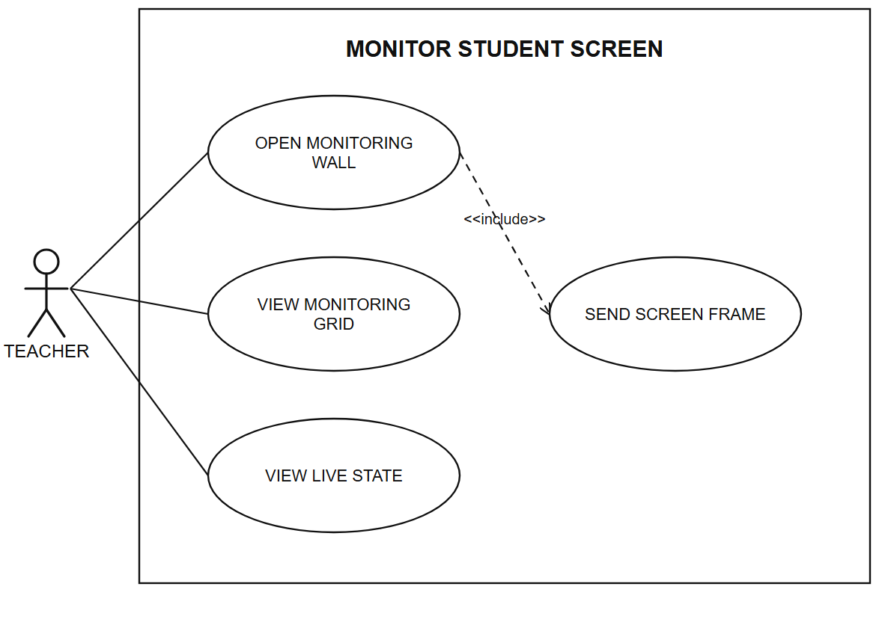

*Figure 3.31: System Use Case for monitor student screen*

### T-149  ·  OPEN MONITORING WALL

**Use Case Name:** OPEN MONITORING WALL  
**Purpose:** Open the live monitoring wall showing every connected student workstation.  
**Actors:**

- Teacher (Primary Actor)

**Input Parameters:**

- None beyond the signed-in identity carried on the authentication cookie.

**Output Parameters:**

- The rendered page, or a JSON payload where the caller is the page’s own script.

**Pre-Condition:**

- The caller is signed in as a teacher.

**Post-Condition:**

- The caller has the requested information. Nothing in the database has changed.

**Successful Scenario:**

1. The Teacher opens the page and CAMS confirms the role on the authentication cookie.
2. The server reads the records the caller is entitled to see.
3. The page renders with those records.

**Exception Scenario:**

- **Not signed in or wrong role** — the request is refused and the caller is sent to the access denied page.

**Additional Remarks:**

- Implemented by `TeacherController.Monitoring` (GET).
- Appears in the *MONITOR STUDENT SCREEN* module of the use case diagram.
- Pulls in **SEND SCREEN FRAME** (`<<include>>`).

### T-150  ·  VIEW MONITORING GRID

**Use Case Name:** VIEW MONITORING GRID  
**Purpose:** Serve the monitoring surface the live screen grid is built on.  
**Actors:**

- Teacher (Primary Actor)

**Input Parameters:**

- None beyond the signed-in identity carried on the authentication cookie.

**Output Parameters:**

- The rendered page, or a JSON payload where the caller is the page’s own script.

**Pre-Condition:**

- The caller is signed in as an administrator or a teacher. A teacher reaches this action only because it carries `[TeacherSharedAction]`; the teacher account must also be active.

**Post-Condition:**

- The caller has the requested information. Nothing in the database has changed.

**Successful Scenario:**

1. The Teacher opens the page and CAMS confirms the role on the authentication cookie.
2. The server reads the records the caller is entitled to see.
3. The page renders with those records.

**Exception Scenario:**

- **Not signed in or wrong role** — the request is refused and the caller is sent to the access denied page.

**Additional Remarks:**

- Implemented by `AdminController.Index` (GET).
- Appears in the *MONITOR STUDENT SCREEN* module of the use case diagram.

### T-151  ·  VIEW LIVE STATE

**Use Case Name:** VIEW LIVE STATE  
**Purpose:** Report the current state of every connected workstation so the monitoring page can refresh without reloading.  
**Actors:**

- Teacher (Primary Actor)

**Input Parameters:**

- None beyond the signed-in identity carried on the authentication cookie.

**Output Parameters:**

- The rendered page, or a JSON payload where the caller is the page’s own script.

**Pre-Condition:**

- The caller is signed in as a teacher.

**Post-Condition:**

- The caller has the requested information. Nothing in the database has changed.

**Successful Scenario:**

1. The Teacher opens the page and CAMS confirms the role on the authentication cookie.
2. The server reads the records the caller is entitled to see.
3. The page renders with those records.

**Exception Scenario:**

- **Not signed in or wrong role** — the request is refused and the caller is sent to the access denied page.

**Additional Remarks:**

- Implemented by `TeacherController.LiveState` (GET).
- Appears in the *MONITOR STUDENT SCREEN* module of the use case diagram.

### T-152  ·  SEND SCREEN FRAME

**Use Case Name:** SEND SCREEN FRAME  
**Purpose:** Send one captured frame of the workstation screen to the watching teacher.  
**Actors:**

- Teacher (Primary Actor)
- The CAMS client on the target workstation (Secondary Actor)

**Input Parameters:**

- `frame` : `ScreenFrameMessage`

**Output Parameters:**

- A SignalR message delivered to the target workstation or group; no HTTP response.

**Pre-Condition:**

- The caller is signed in.
- **OPEN MONITORING WALL** has reached the point where this is always performed.

**Post-Condition:**

- The workstation has acted on the command and the console shows its new state.

**Successful Scenario:**

1. The Teacher triggers the command from the monitoring console.
2. The browser invokes `SendScreenFrame` on the SignalR hub over the open connection.
3. The server checks the caller’s role and resolves the target connection.
4. The server relays the instruction to the workstation client.
5. The client carries it out and the console reflects the new state.

**Exception Scenario:**

- **Not signed in or wrong role** — the request is refused and the caller is sent to the access denied page.
- **The workstation is not connected** — the command cannot be delivered and the console reports the workstation as offline.

**Additional Remarks:**

- Implemented by `RemoteMonitoringHub.SendScreenFrame` (GET).
- Appears in the *MONITOR STUDENT SCREEN* module of the use case diagram.
- Drawn as `<<include>>` from **OPEN MONITORING WALL**.

## CONTROL STUDENT WORKSTATION  ·  `RemoteMonitoringHub`

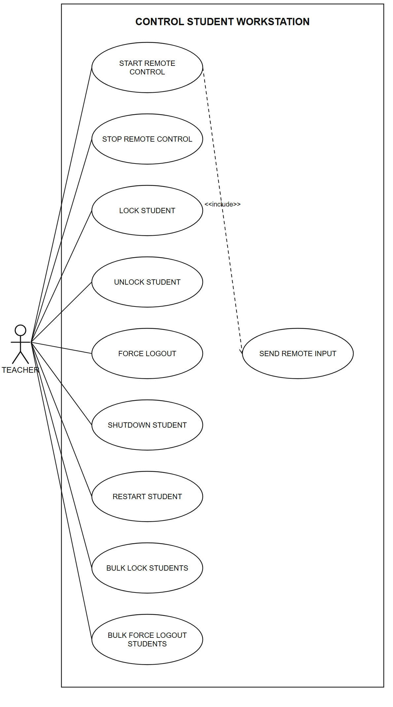

*Figure 3.32: System Use Case for control student workstation*

### T-153  ·  START REMOTE CONTROL

**Use Case Name:** START REMOTE CONTROL  
**Purpose:** Take keyboard and mouse control of a student workstation, with the client showing that remote control is active.  
**Actors:**

- Teacher (Primary Actor)
- The CAMS client on the target workstation (Secondary Actor)

**Input Parameters:**

- `targetConnectionId` : `string`

**Output Parameters:**

- A `RemoteCommandResult` stating whether the workstation accepted the command, returned to the caller over SignalR.

**Pre-Condition:**

- The caller is signed in.
- The record named by the identifier exists.

**Post-Condition:**

- The workstation has acted on the command and the console shows its new state.

**Successful Scenario:**

1. The Teacher triggers the command from the monitoring console.
2. The browser invokes `StartRemoteControl` on the SignalR hub over the open connection.
3. The server checks the caller’s role and resolves the target connection.
4. The server relays the instruction to the workstation client.
5. The client carries it out and the console reflects the new state.
6. The command is written to the remote command log.

**Exception Scenario:**

- **Not signed in or wrong role** — the request is refused and the caller is sent to the access denied page.
- **The identifier matches no record** — the action reports that the record was not found and makes no change.
- **The workstation is not connected** — the command cannot be delivered and the console reports the workstation as offline.

**Additional Remarks:**

- Implemented by `RemoteMonitoringHub.StartRemoteControl` (GET).
- Appears in the *CONTROL STUDENT WORKSTATION* module of the use case diagram.
- Pulls in **SEND REMOTE INPUT** (`<<include>>`).

### T-154  ·  STOP REMOTE CONTROL

**Use Case Name:** STOP REMOTE CONTROL  
**Purpose:** Hand control of the workstation back to the student.  
**Actors:**

- Teacher (Primary Actor)
- The CAMS client on the target workstation (Secondary Actor)

**Input Parameters:**

- `targetConnectionId` : `string`

**Output Parameters:**

- A `RemoteCommandResult` stating whether the workstation accepted the command, returned to the caller over SignalR.

**Pre-Condition:**

- The caller is signed in.
- The record named by the identifier exists.

**Post-Condition:**

- The workstation has acted on the command and the console shows its new state.

**Successful Scenario:**

1. The Teacher triggers the command from the monitoring console.
2. The browser invokes `StopRemoteControl` on the SignalR hub over the open connection.
3. The server checks the caller’s role and resolves the target connection.
4. The server relays the instruction to the workstation client.
5. The client carries it out and the console reflects the new state.
6. The command is written to the remote command log.

**Exception Scenario:**

- **Not signed in or wrong role** — the request is refused and the caller is sent to the access denied page.
- **The identifier matches no record** — the action reports that the record was not found and makes no change.
- **The workstation is not connected** — the command cannot be delivered and the console reports the workstation as offline.

**Additional Remarks:**

- Implemented by `RemoteMonitoringHub.StopRemoteControl` (GET).
- Appears in the *CONTROL STUDENT WORKSTATION* module of the use case diagram.

### T-155  ·  LOCK WORKSTATION

**Use Case Name:** LOCK WORKSTATION  
**Purpose:** Lock a student workstation so the student cannot use it until it is unlocked.  
**Actors:**

- Teacher (Primary Actor)
- The CAMS client on the target workstation (Secondary Actor)

**Input Parameters:**

- `targetConnectionId` : `string`

**Output Parameters:**

- A SignalR message delivered to the target workstation or group; no HTTP response.

**Pre-Condition:**

- The caller is signed in.
- The record named by the identifier exists.

**Post-Condition:**

- The workstation has acted on the command and the console shows its new state.

**Successful Scenario:**

1. The Teacher triggers the command from the monitoring console.
2. The browser invokes `LockStudent` on the SignalR hub over the open connection.
3. The server checks the caller’s role and resolves the target connection.
4. The server relays the instruction to the workstation client.
5. The client carries it out and the console reflects the new state.
6. The command is written to the remote command log.

**Exception Scenario:**

- **Not signed in or wrong role** — the request is refused and the caller is sent to the access denied page.
- **The identifier matches no record** — the action reports that the record was not found and makes no change.
- **The workstation is not connected** — the command cannot be delivered and the console reports the workstation as offline.

**Additional Remarks:**

- Implemented by `RemoteMonitoringHub.LockStudent` (GET).
- Appears in the *CONTROL STUDENT WORKSTATION* module of the use case diagram.

### T-156  ·  UNLOCK WORKSTATION

**Use Case Name:** UNLOCK WORKSTATION  
**Purpose:** Release the CAMS lock on a student workstation.  
**Actors:**

- Teacher (Primary Actor)
- The CAMS client on the target workstation (Secondary Actor)

**Input Parameters:**

- `targetConnectionId` : `string`

**Output Parameters:**

- A SignalR message delivered to the target workstation or group; no HTTP response.

**Pre-Condition:**

- The caller is signed in.
- The record named by the identifier exists.

**Post-Condition:**

- The workstation has acted on the command and the console shows its new state.

**Successful Scenario:**

1. The Teacher triggers the command from the monitoring console.
2. The browser invokes `UnlockStudent` on the SignalR hub over the open connection.
3. The server checks the caller’s role and resolves the target connection.
4. The server relays the instruction to the workstation client.
5. The client carries it out and the console reflects the new state.

**Exception Scenario:**

- **Not signed in or wrong role** — the request is refused and the caller is sent to the access denied page.
- **The identifier matches no record** — the action reports that the record was not found and makes no change.
- **The workstation is not connected** — the command cannot be delivered and the console reports the workstation as offline.

**Additional Remarks:**

- Implemented by `RemoteMonitoringHub.UnlockStudent` (GET).
- Appears in the *CONTROL STUDENT WORKSTATION* module of the use case diagram.

### T-157  ·  FORCE STUDENT LOGOUT

**Use Case Name:** FORCE STUDENT LOGOUT  
**Purpose:** Sign a student out of the workstation from the teacher console.  
**Actors:**

- Teacher (Primary Actor)
- The CAMS client on the target workstation (Secondary Actor)

**Input Parameters:**

- `targetConnectionId` : `string`

**Output Parameters:**

- A SignalR message delivered to the target workstation or group; no HTTP response.

**Pre-Condition:**

- The caller is signed in.
- The record named by the identifier exists.

**Post-Condition:**

- The workstation has acted on the command and the console shows its new state.

**Successful Scenario:**

1. The Teacher triggers the command from the monitoring console.
2. The browser invokes `ForceLogout` on the SignalR hub over the open connection.
3. The server checks the caller’s role and resolves the target connection.
4. The server relays the instruction to the workstation client.
5. The client carries it out and the console reflects the new state.
6. The command is written to the remote command log.

**Exception Scenario:**

- **Not signed in or wrong role** — the request is refused and the caller is sent to the access denied page.
- **The identifier matches no record** — the action reports that the record was not found and makes no change.
- **The workstation is not connected** — the command cannot be delivered and the console reports the workstation as offline.

**Additional Remarks:**

- Implemented by `RemoteMonitoringHub.ForceLogout` (GET).
- Appears in the *CONTROL STUDENT WORKSTATION* module of the use case diagram.

### T-158  ·  SHUT DOWN WORKSTATION

**Use Case Name:** SHUT DOWN WORKSTATION  
**Purpose:** Shut a student workstation down remotely.  
**Actors:**

- Teacher (Primary Actor)
- The CAMS client on the target workstation (Secondary Actor)

**Input Parameters:**

- `targetConnectionId` : `string`

**Output Parameters:**

- A SignalR message delivered to the target workstation or group; no HTTP response.

**Pre-Condition:**

- The caller is signed in.
- The record named by the identifier exists.

**Post-Condition:**

- The workstation has acted on the command and the console shows its new state.

**Successful Scenario:**

1. The Teacher triggers the command from the monitoring console.
2. The browser invokes `ShutdownStudent` on the SignalR hub over the open connection.
3. The server checks the caller’s role and resolves the target connection.
4. The server relays the instruction to the workstation client.
5. The client carries it out and the console reflects the new state.
6. The command is written to the remote command log.

**Exception Scenario:**

- **Not signed in or wrong role** — the request is refused and the caller is sent to the access denied page.
- **The identifier matches no record** — the action reports that the record was not found and makes no change.
- **The workstation is not connected** — the command cannot be delivered and the console reports the workstation as offline.

**Additional Remarks:**

- Implemented by `RemoteMonitoringHub.ShutdownStudent` (GET).
- Appears in the *CONTROL STUDENT WORKSTATION* module of the use case diagram.

### T-159  ·  RESTART WORKSTATION

**Use Case Name:** RESTART WORKSTATION  
**Purpose:** Restart a student workstation remotely.  
**Actors:**

- Teacher (Primary Actor)
- The CAMS client on the target workstation (Secondary Actor)

**Input Parameters:**

- `targetConnectionId` : `string`

**Output Parameters:**

- A SignalR message delivered to the target workstation or group; no HTTP response.

**Pre-Condition:**

- The caller is signed in.
- The record named by the identifier exists.

**Post-Condition:**

- The workstation has acted on the command and the console shows its new state.

**Successful Scenario:**

1. The Teacher triggers the command from the monitoring console.
2. The browser invokes `RestartStudent` on the SignalR hub over the open connection.
3. The server checks the caller’s role and resolves the target connection.
4. The server relays the instruction to the workstation client.
5. The client carries it out and the console reflects the new state.
6. The command is written to the remote command log.

**Exception Scenario:**

- **Not signed in or wrong role** — the request is refused and the caller is sent to the access denied page.
- **The identifier matches no record** — the action reports that the record was not found and makes no change.
- **The workstation is not connected** — the command cannot be delivered and the console reports the workstation as offline.

**Additional Remarks:**

- Implemented by `RemoteMonitoringHub.RestartStudent` (GET).
- Appears in the *CONTROL STUDENT WORKSTATION* module of the use case diagram.

### T-160  ·  LOCK ALL WORKSTATIONS

**Use Case Name:** LOCK ALL WORKSTATIONS  
**Purpose:** Lock several student workstations in one action.  
**Actors:**

- Teacher (Primary Actor)
- The CAMS client on the target workstation (Secondary Actor)

**Input Parameters:**

- `targetConnectionIds` : `List<string>`

**Output Parameters:**

- A SignalR message delivered to the target workstation or group; no HTTP response.

**Pre-Condition:**

- The caller is signed in.

**Post-Condition:**

- The workstation has acted on the command and the console shows its new state.

**Successful Scenario:**

1. The Teacher triggers the command from the monitoring console.
2. The browser invokes `BulkLockStudents` on the SignalR hub over the open connection.
3. The server checks the caller’s role and resolves the target connection.
4. The server relays the instruction to the workstation client.
5. The client carries it out and the console reflects the new state.
6. The command is written to the remote command log.

**Exception Scenario:**

- **Not signed in or wrong role** — the request is refused and the caller is sent to the access denied page.
- **The workstation is not connected** — the command cannot be delivered and the console reports the workstation as offline.

**Additional Remarks:**

- Implemented by `RemoteMonitoringHub.BulkLockStudents` (GET).
- Appears in the *CONTROL STUDENT WORKSTATION* module of the use case diagram.

### T-161  ·  LOG OUT ALL STUDENTS

**Use Case Name:** LOG OUT ALL STUDENTS  
**Purpose:** Sign several students out of their workstations in one action.  
**Actors:**

- Teacher (Primary Actor)
- The CAMS client on the target workstation (Secondary Actor)

**Input Parameters:**

- `targetConnectionIds` : `List<string>`

**Output Parameters:**

- A SignalR message delivered to the target workstation or group; no HTTP response.

**Pre-Condition:**

- The caller is signed in.

**Post-Condition:**

- The workstation has acted on the command and the console shows its new state.

**Successful Scenario:**

1. The Teacher triggers the command from the monitoring console.
2. The browser invokes `BulkForceLogoutStudents` on the SignalR hub over the open connection.
3. The server checks the caller’s role and resolves the target connection.
4. The server relays the instruction to the workstation client.
5. The client carries it out and the console reflects the new state.
6. The command is written to the remote command log.

**Exception Scenario:**

- **Not signed in or wrong role** — the request is refused and the caller is sent to the access denied page.
- **The workstation is not connected** — the command cannot be delivered and the console reports the workstation as offline.

**Additional Remarks:**

- Implemented by `RemoteMonitoringHub.BulkForceLogoutStudents` (GET).
- Appears in the *CONTROL STUDENT WORKSTATION* module of the use case diagram.

### T-162  ·  SEND REMOTE INPUT

**Use Case Name:** SEND REMOTE INPUT  
**Purpose:** Deliver one keyboard or mouse event to the workstation under remote control.  
**Actors:**

- Teacher (Primary Actor)
- The CAMS client on the target workstation (Secondary Actor)

**Input Parameters:**

- `targetConnectionId` : `string`
- `input` : `RemoteInputMessage`

**Output Parameters:**

- A `RemoteCommandResult` stating whether the workstation accepted the command, returned to the caller over SignalR.

**Pre-Condition:**

- The caller is signed in.
- The record named by the identifier exists.
- **START REMOTE CONTROL** has reached the point where this is always performed.

**Post-Condition:**

- The workstation has acted on the command and the console shows its new state.

**Successful Scenario:**

1. The Teacher triggers the command from the monitoring console.
2. The browser invokes `SendRemoteInput` on the SignalR hub over the open connection.
3. The server checks the caller’s role and resolves the target connection.
4. The server relays the instruction to the workstation client.
5. The client carries it out and the console reflects the new state.
6. The command is written to the remote command log.

**Exception Scenario:**

- **Not signed in or wrong role** — the request is refused and the caller is sent to the access denied page.
- **The identifier matches no record** — the action reports that the record was not found and makes no change.
- **The workstation is not connected** — the command cannot be delivered and the console reports the workstation as offline.

**Additional Remarks:**

- Implemented by `RemoteMonitoringHub.SendRemoteInput` (GET).
- Appears in the *CONTROL STUDENT WORKSTATION* module of the use case diagram.
- Drawn as `<<include>>` from **START REMOTE CONTROL**.

## SEND MESSAGE TO STUDENT  ·  `RemoteMonitoringHub`

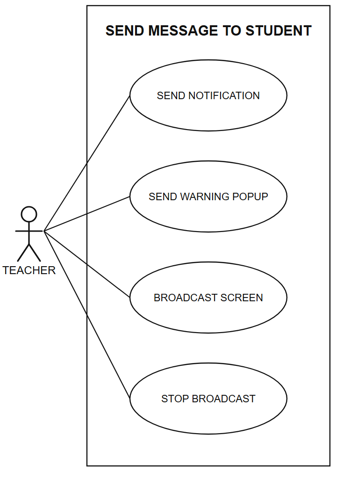

*Figure 3.33: System Use Case for send message to student*

### T-163  ·  SEND NOTIFICATION

**Use Case Name:** SEND NOTIFICATION  
**Purpose:** Send a message to connected students that appears on their workstation.  
**Actors:**

- Teacher (Primary Actor)
- The CAMS client on the target workstation (Secondary Actor)

**Input Parameters:**

- `notification` : `NotificationMessage`

**Output Parameters:**

- A SignalR message delivered to the target workstation or group; no HTTP response.

**Pre-Condition:**

- The caller is signed in.

**Post-Condition:**

- The workstation has acted on the command and the console shows its new state.

**Successful Scenario:**

1. The Teacher triggers the command from the monitoring console.
2. The browser invokes `SendNotification` on the SignalR hub over the open connection.
3. The server checks the caller’s role and resolves the target connection.
4. The server relays the instruction to the workstation client.
5. The client carries it out and the console reflects the new state.

**Exception Scenario:**

- **Not signed in or wrong role** — the request is refused and the caller is sent to the access denied page.
- **The workstation is not connected** — the command cannot be delivered and the console reports the workstation as offline.

**Additional Remarks:**

- Implemented by `RemoteMonitoringHub.SendNotification` (GET).
- Appears in the *SEND MESSAGE TO STUDENT* module of the use case diagram.

### T-164  ·  SEND WARNING POPUP

**Use Case Name:** SEND WARNING POPUP  
**Purpose:** Send a warning dialog to one student, shown on top of whatever they are doing.  
**Actors:**

- Teacher (Primary Actor)
- The CAMS client on the target workstation (Secondary Actor)

**Input Parameters:**

- `targetConnectionId` : `string`
- `warning` : `NotificationMessage`

**Output Parameters:**

- A SignalR message delivered to the target workstation or group; no HTTP response.

**Pre-Condition:**

- The caller is signed in.
- The record named by the identifier exists.

**Post-Condition:**

- The workstation has acted on the command and the console shows its new state.

**Successful Scenario:**

1. The Teacher triggers the command from the monitoring console.
2. The browser invokes `SendWarningPopup` on the SignalR hub over the open connection.
3. The server checks the caller’s role and resolves the target connection.
4. The server relays the instruction to the workstation client.
5. The client carries it out and the console reflects the new state.

**Exception Scenario:**

- **Not signed in or wrong role** — the request is refused and the caller is sent to the access denied page.
- **The identifier matches no record** — the action reports that the record was not found and makes no change.
- **The workstation is not connected** — the command cannot be delivered and the console reports the workstation as offline.

**Additional Remarks:**

- Implemented by `RemoteMonitoringHub.SendWarningPopup` (GET).
- Appears in the *SEND MESSAGE TO STUDENT* module of the use case diagram.

### T-165  ·  BROADCAST SCREEN

**Use Case Name:** BROADCAST SCREEN  
**Purpose:** Put the teacher screen on every connected student workstation.  
**Actors:**

- Teacher (Primary Actor)
- The CAMS client on the target workstation (Secondary Actor)

**Input Parameters:**

- `frameBase64` : `string`

**Output Parameters:**

- A SignalR message delivered to the target workstation or group; no HTTP response.

**Pre-Condition:**

- The caller is signed in.

**Post-Condition:**

- The workstation has acted on the command and the console shows its new state.

**Successful Scenario:**

1. The Teacher triggers the command from the monitoring console.
2. The browser invokes `BroadcastScreen` on the SignalR hub over the open connection.
3. The server checks the caller’s role and resolves the target connection.
4. The server relays the instruction to the workstation client.
5. The client carries it out and the console reflects the new state.

**Exception Scenario:**

- **Not signed in or wrong role** — the request is refused and the caller is sent to the access denied page.
- **The workstation is not connected** — the command cannot be delivered and the console reports the workstation as offline.

**Additional Remarks:**

- Implemented by `RemoteMonitoringHub.BroadcastScreen` (GET).
- Appears in the *SEND MESSAGE TO STUDENT* module of the use case diagram.

### T-166  ·  STOP BROADCAST

**Use Case Name:** STOP BROADCAST  
**Purpose:** Stop the teacher screen broadcast and return the workstations to the student view.  
**Actors:**

- Teacher (Primary Actor)
- The CAMS client on the target workstation (Secondary Actor)

**Input Parameters:**

- None beyond the signed-in identity carried on the authentication cookie.

**Output Parameters:**

- A SignalR message delivered to the target workstation or group; no HTTP response.

**Pre-Condition:**

- The caller is signed in.

**Post-Condition:**

- The workstation has acted on the command and the console shows its new state.

**Successful Scenario:**

1. The Teacher triggers the command from the monitoring console.
2. The browser invokes `StopBroadcast` on the SignalR hub over the open connection.
3. The server checks the caller’s role and resolves the target connection.
4. The server relays the instruction to the workstation client.
5. The client carries it out and the console reflects the new state.

**Exception Scenario:**

- **Not signed in or wrong role** — the request is refused and the caller is sent to the access denied page.
- **The workstation is not connected** — the command cannot be delivered and the console reports the workstation as offline.

**Additional Remarks:**

- Implemented by `RemoteMonitoringHub.StopBroadcast` (GET).
- Appears in the *SEND MESSAGE TO STUDENT* module of the use case diagram.

## MANAGE MONITORING ALERT  ·  `TeacherController`

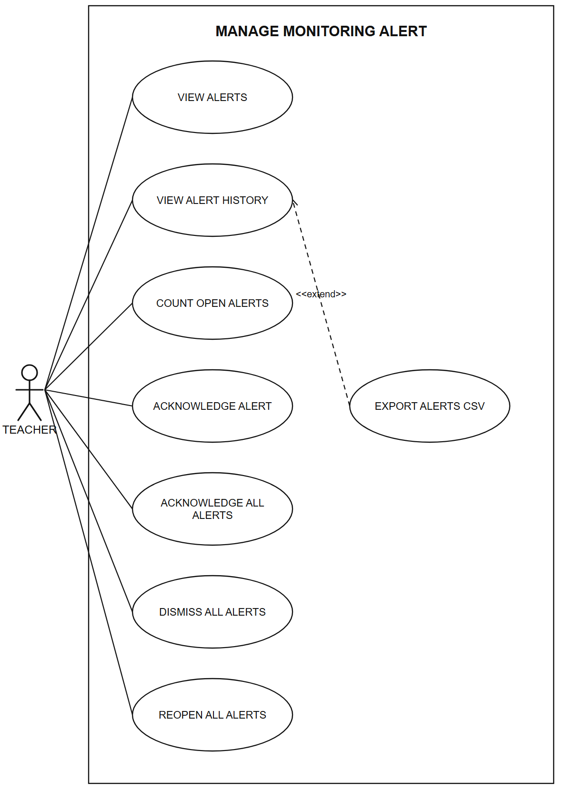

*Figure 3.34: System Use Case for manage monitoring alert*

### T-167  ·  VIEW ALERTS

**Use Case Name:** VIEW ALERTS  
**Purpose:** List the monitoring alerts raised for the classes the teacher is responsible for.  
**Actors:**

- Teacher (Primary Actor)

**Input Parameters:**

- `filter` : `AlertListFilter`

**Output Parameters:**

- The rendered page, or a JSON payload where the caller is the page’s own script.

**Pre-Condition:**

- The caller is signed in as a teacher.

**Post-Condition:**

- The caller has the requested information. Nothing in the database has changed.

**Successful Scenario:**

1. The Teacher opens the page and CAMS confirms the role on the authentication cookie.
2. The server reads the records the caller is entitled to see.
3. The page renders with those records.

**Exception Scenario:**

- **Not signed in or wrong role** — the request is refused and the caller is sent to the access denied page.

**Additional Remarks:**

- Implemented by `TeacherController.Alerts` (GET).
- Appears in the *MANAGE MONITORING ALERT* module of the use case diagram.

### T-168  ·  VIEW ALERT HISTORY

**Use Case Name:** VIEW ALERT HISTORY  
**Purpose:** Show alerts that have already been acted on, with who acted and when.  
**Actors:**

- Teacher (Primary Actor)

**Input Parameters:**

- `id` : `int`

**Output Parameters:**

- The rendered page, or a JSON payload where the caller is the page’s own script.

**Pre-Condition:**

- The caller is signed in as a teacher.
- The record named by the identifier exists.

**Post-Condition:**

- The caller has the requested information. Nothing in the database has changed.

**Successful Scenario:**

1. The Teacher opens the page and CAMS confirms the role on the authentication cookie.
2. The server reads the records the caller is entitled to see.
3. The page renders with those records.

**Exception Scenario:**

- **Not signed in or wrong role** — the request is refused and the caller is sent to the access denied page.
- **The identifier matches no record** — the action reports that the record was not found and makes no change.

**Additional Remarks:**

- Implemented by `TeacherController.AlertHistory` (GET).
- Appears in the *MANAGE MONITORING ALERT* module of the use case diagram.
- Pulls in **EXPORT ALERTS CSV** (`<<extend>>`).

### T-169  ·  COUNT OPEN ALERTS

**Use Case Name:** COUNT OPEN ALERTS  
**Purpose:** Report how many alerts are still open, for the badge on the navigation bar.  
**Actors:**

- Teacher (Primary Actor)

**Input Parameters:**

- None beyond the signed-in identity carried on the authentication cookie.

**Output Parameters:**

- The rendered page, or a JSON payload where the caller is the page’s own script.

**Pre-Condition:**

- The caller is signed in as a teacher.

**Post-Condition:**

- The caller has the requested information. Nothing in the database has changed.

**Successful Scenario:**

1. The Teacher opens the page and CAMS confirms the role on the authentication cookie.
2. The server reads the records the caller is entitled to see.
3. The page renders with those records.

**Exception Scenario:**

- **Not signed in or wrong role** — the request is refused and the caller is sent to the access denied page.

**Additional Remarks:**

- Implemented by `TeacherController.OpenAlertCount` (GET).
- Appears in the *MANAGE MONITORING ALERT* module of the use case diagram.

### T-170  ·  ACKNOWLEDGE ALERT

**Use Case Name:** ACKNOWLEDGE ALERT  
**Purpose:** Mark one alert as seen and being handled.  
**Actors:**

- Teacher (Primary Actor)

**Input Parameters:**

- `id` : `int`
- `acknowledged` : `bool`
- `filter` : `AlertListFilter`

**Output Parameters:**

- A redirect back to the listing page, carrying a success or failure message for display.

**Pre-Condition:**

- The caller is signed in as a teacher.
- The record named by the identifier exists.

**Post-Condition:**

- The change is committed to the database and visible to the next read.
- The caller sees the outcome reported on the page they return to.

**Successful Scenario:**

1. The Teacher opens the page and CAMS confirms the role on the authentication cookie.
2. The Teacher fills the form and submits it.
3. The server validates the antiforgery token that accompanied the form.
4. The server validates the submitted values against the model rules.
5. The change is written to the database through `ApplicationDbContext`.
6. The server redirects back to the listing, where the result is shown.

**Exception Scenario:**

- **Not signed in or wrong role** — the request is refused and the caller is sent to the access denied page.
- **Missing or stale antiforgery token** — the submission is rejected and must be retried from a freshly loaded form.
- **Validation fails** — the form is redisplayed with the offending fields marked and nothing is written.
- **The identifier matches no record** — the action reports that the record was not found and makes no change.

**Additional Remarks:**

- Implemented by `TeacherController.AcknowledgeAlert` (POST).
- Appears in the *MANAGE MONITORING ALERT* module of the use case diagram.

### T-171  ·  ACKNOWLEDGE ALL ALERTS

**Use Case Name:** ACKNOWLEDGE ALL ALERTS  
**Purpose:** Acknowledge several alerts in one action.  
**Actors:**

- Teacher (Primary Actor)

**Input Parameters:**

- `alertIds` : `List<int>?`
- `filter` : `AlertListFilter`

**Output Parameters:**

- A redirect back to the listing page, carrying a success or failure message for display.

**Pre-Condition:**

- The caller is signed in as a teacher.

**Post-Condition:**

- The change is committed to the database and visible to the next read.
- The caller sees the outcome reported on the page they return to.

**Successful Scenario:**

1. The Teacher opens the page and CAMS confirms the role on the authentication cookie.
2. The Teacher fills the form and submits it.
3. The server validates the antiforgery token that accompanied the form.
4. The server validates the submitted values against the model rules.
5. The change is written to the database through `ApplicationDbContext`.
6. The server redirects back to the listing, where the result is shown.

**Exception Scenario:**

- **Not signed in or wrong role** — the request is refused and the caller is sent to the access denied page.
- **Missing or stale antiforgery token** — the submission is rejected and must be retried from a freshly loaded form.
- **Validation fails** — the form is redisplayed with the offending fields marked and nothing is written.

**Additional Remarks:**

- Implemented by `TeacherController.BulkAcknowledgeAlerts` (POST).
- Appears in the *MANAGE MONITORING ALERT* module of the use case diagram.

### T-172  ·  DISMISS ALL ALERTS

**Use Case Name:** DISMISS ALL ALERTS  
**Purpose:** Dismiss several alerts in one action.  
**Actors:**

- Teacher (Primary Actor)

**Input Parameters:**

- `alertIds` : `List<int>?`
- `reason` : `string?`
- `filter` : `AlertListFilter`

**Output Parameters:**

- A redirect back to the listing page, carrying a success or failure message for display.

**Pre-Condition:**

- The caller is signed in as a teacher.

**Post-Condition:**

- The change is committed to the database and visible to the next read.
- The caller sees the outcome reported on the page they return to.

**Successful Scenario:**

1. The Teacher opens the page and CAMS confirms the role on the authentication cookie.
2. The Teacher fills the form and submits it.
3. The server validates the antiforgery token that accompanied the form.
4. The server validates the submitted values against the model rules.
5. The change is written to the database through `ApplicationDbContext`.
6. The server redirects back to the listing, where the result is shown.

**Exception Scenario:**

- **Not signed in or wrong role** — the request is refused and the caller is sent to the access denied page.
- **Missing or stale antiforgery token** — the submission is rejected and must be retried from a freshly loaded form.
- **Validation fails** — the form is redisplayed with the offending fields marked and nothing is written.

**Additional Remarks:**

- Implemented by `TeacherController.BulkDismissAlerts` (POST).
- Appears in the *MANAGE MONITORING ALERT* module of the use case diagram.

### T-173  ·  REOPEN ALL ALERTS

**Use Case Name:** REOPEN ALL ALERTS  
**Purpose:** Reopen several alerts that were closed too early.  
**Actors:**

- Teacher (Primary Actor)

**Input Parameters:**

- `alertIds` : `List<int>?`
- `filter` : `AlertListFilter`

**Output Parameters:**

- A redirect back to the listing page, carrying a success or failure message for display.

**Pre-Condition:**

- The caller is signed in as a teacher.

**Post-Condition:**

- The change is committed to the database and visible to the next read.
- The caller sees the outcome reported on the page they return to.

**Successful Scenario:**

1. The Teacher opens the page and CAMS confirms the role on the authentication cookie.
2. The Teacher fills the form and submits it.
3. The server validates the antiforgery token that accompanied the form.
4. The server validates the submitted values against the model rules.
5. The change is written to the database through `ApplicationDbContext`.
6. The server redirects back to the listing, where the result is shown.

**Exception Scenario:**

- **Not signed in or wrong role** — the request is refused and the caller is sent to the access denied page.
- **Missing or stale antiforgery token** — the submission is rejected and must be retried from a freshly loaded form.
- **Validation fails** — the form is redisplayed with the offending fields marked and nothing is written.

**Additional Remarks:**

- Implemented by `TeacherController.BulkReopenAlerts` (POST).
- Appears in the *MANAGE MONITORING ALERT* module of the use case diagram.

### T-174  ·  EXPORT ALERTS CSV

**Use Case Name:** EXPORT ALERTS CSV  
**Purpose:** Produce the alerts view as a CSV file the user can download.  
**Actors:**

- Teacher (Primary Actor)
- None; this behaviour runs inside **VIEW ALERT HISTORY** (Secondary Actor)

**Input Parameters:**

- `filter` : `AlertListFilter`

**Output Parameters:**

- The rendered page, or a JSON payload where the caller is the page’s own script.

**Pre-Condition:**

- The caller is signed in as a teacher.
- **VIEW ALERT HISTORY** has reached the point where this is optionally performed.

**Post-Condition:**

- The caller has the requested information. Nothing in the database has changed.

**Successful Scenario:**

1. The Teacher opens the page and CAMS confirms the role on the authentication cookie.
2. The server reads the records the caller is entitled to see.
3. The page renders with those records.

**Exception Scenario:**

- **Not signed in or wrong role** — the request is refused and the caller is sent to the access denied page.

**Additional Remarks:**

- Implemented by `TeacherController.ExportAlertsCsv` (GET).
- Appears in the *MANAGE MONITORING ALERT* module of the use case diagram.
- Drawn as `<<extend>>` to **VIEW ALERT HISTORY**.

## VIEW TEACHER RECORDS  ·  `TeacherController`

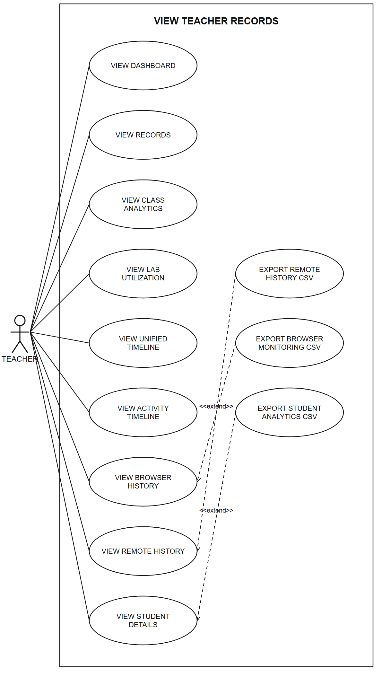

*Figure 3.35: System Use Case for view teacher records*

### T-175  ·  VIEW DASHBOARD

**Use Case Name:** VIEW DASHBOARD  
**Purpose:** Show the teacher landing page with the state of the laboratory at a glance.  
**Actors:**

- Teacher (Primary Actor)

**Input Parameters:**

- None beyond the signed-in identity carried on the authentication cookie.

**Output Parameters:**

- The rendered page, or a JSON payload where the caller is the page’s own script.

**Pre-Condition:**

- The caller is signed in as a teacher.

**Post-Condition:**

- The caller has the requested information. Nothing in the database has changed.

**Successful Scenario:**

1. The Teacher opens the page and CAMS confirms the role on the authentication cookie.
2. The server reads the records the caller is entitled to see.
3. The page renders with those records.

**Exception Scenario:**

- **Not signed in or wrong role** — the request is refused and the caller is sent to the access denied page.

**Additional Remarks:**

- Implemented by `TeacherController.Dashboard` (GET).
- Appears in the *VIEW TEACHER RECORDS* module of the use case diagram.

### T-176  ·  VIEW RECORDS

**Use Case Name:** VIEW RECORDS  
**Purpose:** Show captured application and website activity for the teacher’s students.  
**Actors:**

- Teacher (Primary Actor)

**Input Parameters:**

- None beyond the signed-in identity carried on the authentication cookie.

**Output Parameters:**

- The rendered page, or a JSON payload where the caller is the page’s own script.

**Pre-Condition:**

- The caller is signed in as a teacher.

**Post-Condition:**

- The caller has the requested information. Nothing in the database has changed.

**Successful Scenario:**

1. The Teacher opens the page and CAMS confirms the role on the authentication cookie.
2. The server reads the records the caller is entitled to see.
3. The page renders with those records.

**Exception Scenario:**

- **Not signed in or wrong role** — the request is refused and the caller is sent to the access denied page.

**Additional Remarks:**

- Implemented by `TeacherController.Records` (GET).
- Appears in the *VIEW TEACHER RECORDS* module of the use case diagram.
- Pulls in **EXPORT RECORDS CSV** (`<<extend>>`).

### T-177  ·  VIEW CLASS ANALYTICS

**Use Case Name:** VIEW CLASS ANALYTICS  
**Purpose:** Show usage patterns for a class rather than for one student.  
**Actors:**

- Teacher (Primary Actor)

**Input Parameters:**

- `id` : `int`
- `from` : `DateTime?` (optional)
- `to` : `DateTime?` (optional)
- `station` : `string?` (optional)

**Output Parameters:**

- The rendered page, or a JSON payload where the caller is the page’s own script.

**Pre-Condition:**

- The caller is signed in as a teacher.
- The record named by the identifier exists.

**Post-Condition:**

- The caller has the requested information. Nothing in the database has changed.

**Successful Scenario:**

1. The Teacher opens the page and CAMS confirms the role on the authentication cookie.
2. The server reads the records the caller is entitled to see.
3. The page renders with those records.

**Exception Scenario:**

- **Not signed in or wrong role** — the request is refused and the caller is sent to the access denied page.
- **The identifier matches no record** — the action reports that the record was not found and makes no change.

**Additional Remarks:**

- Implemented by `TeacherController.ClassAnalytics` (GET).
- Appears in the *VIEW TEACHER RECORDS* module of the use case diagram.

### T-178  ·  VIEW LAB UTILIZATION

**Use Case Name:** VIEW LAB UTILIZATION  
**Purpose:** Show how heavily the laboratory workstations are being used over time.  
**Actors:**

- Teacher (Primary Actor)

**Input Parameters:**

- `from` : `DateTime?` (optional)
- `to` : `DateTime?` (optional)
- `station` : `string?` (optional)
- `classId` : `int?` (optional)

**Output Parameters:**

- The rendered page, or a JSON payload where the caller is the page’s own script.

**Pre-Condition:**

- The caller is signed in as a teacher.
- The record named by the identifier exists.

**Post-Condition:**

- The caller has the requested information. Nothing in the database has changed.

**Successful Scenario:**

1. The Teacher opens the page and CAMS confirms the role on the authentication cookie.
2. The server reads the records the caller is entitled to see.
3. The page renders with those records.

**Exception Scenario:**

- **Not signed in or wrong role** — the request is refused and the caller is sent to the access denied page.
- **The identifier matches no record** — the action reports that the record was not found and makes no change.

**Additional Remarks:**

- Implemented by `TeacherController.LabUtilization` (GET).
- Appears in the *VIEW TEACHER RECORDS* module of the use case diagram.

### T-179  ·  VIEW UNIFIED TIMELINE

**Use Case Name:** VIEW UNIFIED TIMELINE  
**Purpose:** Show one student’s activity as a single timeline across applications, websites and idle periods.  
**Actors:**

- Teacher (Primary Actor)

**Input Parameters:**

- `from` : `DateTime?` (optional)
- `to` : `DateTime?` (optional)
- `studentId` : `int?` (optional)
- `classId` : `int?` (optional)
- `station` : `string?` (optional)
- `source` : `string?` (optional)
- `eventType` : `string?` (optional)
- `page` : `int` (optional)
- `pageSize` : `int` (optional)

**Output Parameters:**

- The rendered page, or a JSON payload where the caller is the page’s own script.

**Pre-Condition:**

- The caller is signed in as a teacher.
- The record named by the identifier exists.

**Post-Condition:**

- The caller has the requested information. Nothing in the database has changed.

**Successful Scenario:**

1. The Teacher opens the page and CAMS confirms the role on the authentication cookie.
2. The server reads the records the caller is entitled to see.
3. The page renders with those records.

**Exception Scenario:**

- **Not signed in or wrong role** — the request is refused and the caller is sent to the access denied page.
- **The identifier matches no record** — the action reports that the record was not found and makes no change.

**Additional Remarks:**

- Implemented by `TeacherController.UnifiedTimeline` (GET).
- Appears in the *VIEW TEACHER RECORDS* module of the use case diagram.

### T-180  ·  VIEW ACTIVITY TIMELINE

**Use Case Name:** VIEW ACTIVITY TIMELINE  
**Purpose:** Serve the timeline data the unified timeline view is drawn from.  
**Actors:**

- Teacher (Primary Actor)

**Input Parameters:**

- `id` : `int`
- `from` : `DateTime?` (optional)
- `to` : `DateTime?` (optional)
- `page` : `int` (optional)
- `pageSize` : `int` (optional)
- `eventType` : `string?` (optional)

**Output Parameters:**

- The rendered page, or a JSON payload where the caller is the page’s own script.

**Pre-Condition:**

- The caller is signed in as a teacher.
- The record named by the identifier exists.

**Post-Condition:**

- The caller has the requested information. Nothing in the database has changed.

**Successful Scenario:**

1. The Teacher opens the page and CAMS confirms the role on the authentication cookie.
2. The server reads the records the caller is entitled to see.
3. The page renders with those records.

**Exception Scenario:**

- **Not signed in or wrong role** — the request is refused and the caller is sent to the access denied page.
- **The identifier matches no record** — the action reports that the record was not found and makes no change.

**Additional Remarks:**

- Implemented by `TeacherController.ActivityTimeline` (GET).
- Appears in the *VIEW TEACHER RECORDS* module of the use case diagram.

### T-181  ·  VIEW BROWSER HISTORY

**Use Case Name:** VIEW BROWSER HISTORY  
**Purpose:** Show the record of browser activity captured from the workstations.  
**Actors:**

- Teacher (Primary Actor)

**Input Parameters:**

- `from` : `DateTime?` (optional)
- `to` : `DateTime?` (optional)
- `browser` : `string?` (optional)
- `mode` : `string?` (optional)
- `page` : `int` (optional)
- `pageSize` : `int` (optional)

**Output Parameters:**

- The rendered page, or a JSON payload where the caller is the page’s own script.

**Pre-Condition:**

- The caller is signed in as a teacher.

**Post-Condition:**

- The caller has the requested information. Nothing in the database has changed.

**Successful Scenario:**

1. The Teacher opens the page and CAMS confirms the role on the authentication cookie.
2. The server reads the records the caller is entitled to see.
3. The page renders with those records.

**Exception Scenario:**

- **Not signed in or wrong role** — the request is refused and the caller is sent to the access denied page.

**Additional Remarks:**

- Implemented by `TeacherController.BrowserMonitoringHistory` (GET).
- Appears in the *VIEW TEACHER RECORDS* module of the use case diagram.
- Pulls in **EXPORT BROWSER MONITORING CSV** (`<<extend>>`).

### T-182  ·  VIEW REMOTE HISTORY

**Use Case Name:** VIEW REMOTE HISTORY  
**Purpose:** Show which remote commands were issued, by whom, and against which workstation.  
**Actors:**

- Teacher (Primary Actor)

**Input Parameters:**

- `from` : `DateTime?` (optional)
- `to` : `DateTime?` (optional)
- `command` : `string?` (optional)
- `studentId` : `string?` (optional)
- `page` : `int` (optional)

**Output Parameters:**

- The rendered page, or a JSON payload where the caller is the page’s own script.

**Pre-Condition:**

- The caller is signed in as a teacher.
- The record named by the identifier exists.

**Post-Condition:**

- The caller has the requested information. Nothing in the database has changed.

**Successful Scenario:**

1. The Teacher opens the page and CAMS confirms the role on the authentication cookie.
2. The server reads the records the caller is entitled to see.
3. The page renders with those records.

**Exception Scenario:**

- **Not signed in or wrong role** — the request is refused and the caller is sent to the access denied page.
- **The identifier matches no record** — the action reports that the record was not found and makes no change.

**Additional Remarks:**

- Implemented by `TeacherController.RemoteHistory` (GET).
- Appears in the *VIEW TEACHER RECORDS* module of the use case diagram.
- Pulls in **EXPORT REMOTE HISTORY CSV** (`<<extend>>`).

### T-183  ·  VIEW STUDENT DETAILS

**Use Case Name:** VIEW STUDENT DETAILS  
**Purpose:** Show one student in full: account, class, sessions and captured activity.  
**Actors:**

- Teacher (Primary Actor)

**Input Parameters:**

- `id` : `int`
- `from` : `DateTime?` (optional)
- `to` : `DateTime?` (optional)

**Output Parameters:**

- The rendered page, or a JSON payload where the caller is the page’s own script.

**Pre-Condition:**

- The caller is signed in as a teacher.
- The record named by the identifier exists.

**Post-Condition:**

- The caller has the requested information. Nothing in the database has changed.

**Successful Scenario:**

1. The Teacher opens the page and CAMS confirms the role on the authentication cookie.
2. The server reads the records the caller is entitled to see.
3. The page renders with those records.

**Exception Scenario:**

- **Not signed in or wrong role** — the request is refused and the caller is sent to the access denied page.
- **The identifier matches no record** — the action reports that the record was not found and makes no change.

**Additional Remarks:**

- Implemented by `TeacherController.StudentDetails` (GET).
- Appears in the *VIEW TEACHER RECORDS* module of the use case diagram.
- Pulls in **EXPORT STUDENT ANALYTICS CSV** (`<<extend>>`).

### T-184  ·  EXPORT RECORDS CSV

**Use Case Name:** EXPORT RECORDS CSV  
**Purpose:** Produce the records view as a CSV file the user can download.  
**Actors:**

- Teacher (Primary Actor)
- None; this behaviour runs inside **VIEW RECORDS** (Secondary Actor)

**Input Parameters:**

- None beyond the signed-in identity carried on the authentication cookie.

**Output Parameters:**

- The rendered page, or a JSON payload where the caller is the page’s own script.

**Pre-Condition:**

- The caller is signed in as a teacher.
- **VIEW RECORDS** has reached the point where this is optionally performed.

**Post-Condition:**

- The caller has the requested information. Nothing in the database has changed.

**Successful Scenario:**

1. The Teacher opens the page and CAMS confirms the role on the authentication cookie.
2. The server reads the records the caller is entitled to see.
3. The page renders with those records.

**Exception Scenario:**

- **Not signed in or wrong role** — the request is refused and the caller is sent to the access denied page.

**Additional Remarks:**

- Implemented by `TeacherController.ExportRecordsCsv` (GET).
- Appears in the *VIEW TEACHER RECORDS* module of the use case diagram.
- Drawn as `<<extend>>` to **VIEW RECORDS**.

### T-185  ·  EXPORT REMOTE HISTORY CSV

**Use Case Name:** EXPORT REMOTE HISTORY CSV  
**Purpose:** Produce the remote history view as a CSV file the user can download.  
**Actors:**

- Teacher (Primary Actor)
- None; this behaviour runs inside **VIEW REMOTE HISTORY** (Secondary Actor)

**Input Parameters:**

- `from` : `DateTime?` (optional)
- `to` : `DateTime?` (optional)
- `command` : `string?` (optional)
- `studentId` : `string?` (optional)

**Output Parameters:**

- The rendered page, or a JSON payload where the caller is the page’s own script.

**Pre-Condition:**

- The caller is signed in as a teacher.
- The record named by the identifier exists.
- **VIEW REMOTE HISTORY** has reached the point where this is optionally performed.

**Post-Condition:**

- The caller has the requested information. Nothing in the database has changed.

**Successful Scenario:**

1. The Teacher opens the page and CAMS confirms the role on the authentication cookie.
2. The server reads the records the caller is entitled to see.
3. The page renders with those records.

**Exception Scenario:**

- **Not signed in or wrong role** — the request is refused and the caller is sent to the access denied page.
- **The identifier matches no record** — the action reports that the record was not found and makes no change.

**Additional Remarks:**

- Implemented by `TeacherController.ExportRemoteHistoryCsv` (GET).
- Appears in the *VIEW TEACHER RECORDS* module of the use case diagram.
- Drawn as `<<extend>>` to **VIEW REMOTE HISTORY**.

### T-186  ·  EXPORT BROWSER MONITORING CSV

**Use Case Name:** EXPORT BROWSER MONITORING CSV  
**Purpose:** Produce the browser monitoring view as a CSV file the user can download.  
**Actors:**

- Teacher (Primary Actor)
- None; this behaviour runs inside **VIEW BROWSER HISTORY** (Secondary Actor)

**Input Parameters:**

- `from` : `DateTime?` (optional)
- `to` : `DateTime?` (optional)
- `browser` : `string?` (optional)
- `mode` : `string?` (optional)

**Output Parameters:**

- The rendered page, or a JSON payload where the caller is the page’s own script.

**Pre-Condition:**

- The caller is signed in as a teacher.
- **VIEW BROWSER HISTORY** has reached the point where this is optionally performed.

**Post-Condition:**

- The caller has the requested information. Nothing in the database has changed.

**Successful Scenario:**

1. The Teacher opens the page and CAMS confirms the role on the authentication cookie.
2. The server reads the records the caller is entitled to see.
3. The page renders with those records.

**Exception Scenario:**

- **Not signed in or wrong role** — the request is refused and the caller is sent to the access denied page.

**Additional Remarks:**

- Implemented by `TeacherController.ExportBrowserMonitoringCsv` (GET).
- Appears in the *VIEW TEACHER RECORDS* module of the use case diagram.
- Drawn as `<<extend>>` to **VIEW BROWSER HISTORY**.

### T-187  ·  EXPORT STUDENT ANALYTICS CSV

**Use Case Name:** EXPORT STUDENT ANALYTICS CSV  
**Purpose:** Produce the student analytics view as a CSV file the user can download.  
**Actors:**

- Teacher (Primary Actor)
- None; this behaviour runs inside **VIEW STUDENT DETAILS** (Secondary Actor)

**Input Parameters:**

- `id` : `int`
- `from` : `DateTime?` (optional)
- `to` : `DateTime?` (optional)

**Output Parameters:**

- The rendered page, or a JSON payload where the caller is the page’s own script.

**Pre-Condition:**

- The caller is signed in as a teacher.
- The record named by the identifier exists.
- **VIEW STUDENT DETAILS** has reached the point where this is optionally performed.

**Post-Condition:**

- The caller has the requested information. Nothing in the database has changed.

**Successful Scenario:**

1. The Teacher opens the page and CAMS confirms the role on the authentication cookie.
2. The server reads the records the caller is entitled to see.
3. The page renders with those records.

**Exception Scenario:**

- **Not signed in or wrong role** — the request is refused and the caller is sent to the access denied page.
- **The identifier matches no record** — the action reports that the record was not found and makes no change.

**Additional Remarks:**

- Implemented by `TeacherController.ExportStudentAnalyticsCsv` (GET).
- Appears in the *VIEW TEACHER RECORDS* module of the use case diagram.
- Drawn as `<<extend>>` to **VIEW STUDENT DETAILS**.

# STUDENT

## PROCESS LOG IN  ·  `AccountController`

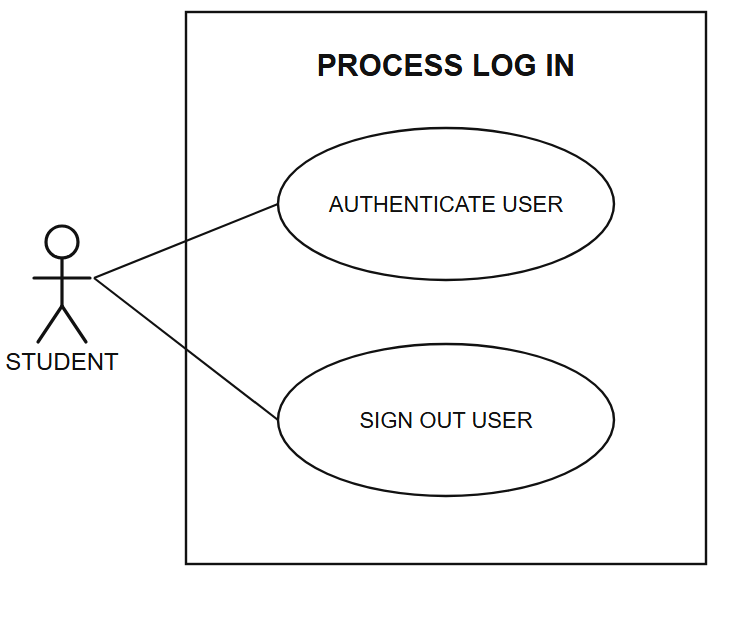

*Figure 3.36: System Use Case for process log in*

### S-188  ·  AUTHENTICATE USER

**Use Case Name:** AUTHENTICATE USER  
**Purpose:** Let a person sign in to the CAMS web portal with a username and password, and place them in the part of the system their role allows.  
**Actors:**

- Student (Primary Actor)

**Input Parameters:**

- `username` : `string`
- `password` : `string`

**Output Parameters:**

- An authentication cookie carrying the account role as a claim, and a redirect to the landing page for that role.

**Pre-Condition:**

- None. This is the sign-in endpoint and is reachable without an account session; the CAMS server must be running and reachable.

**Post-Condition:**

- The change is committed to the database and visible to the next read.
- The caller sees the outcome reported on the page they return to.

**Successful Scenario:**

1. The Student opens the CAMS sign-in page.
2. The Student enters a username and a password and submits the form.
3. The server validates the antiforgery token that accompanied the form.
4. The server checks the credentials against each account table in turn and finds the matching account.
5. The server confirms the account is active and not locked out.
6. The server issues an authentication cookie carrying the role as a claim.
7. The Student is redirected to the landing page for that role.

**Exception Scenario:**

- **The username matches no account** — the page reports that the sign-in failed, without saying which half was wrong.
- **The password does not match the stored hash** — the failed-attempt counter is raised and the same message is shown.
- **The account is locked out** — the sign-in is refused until the lockout expires, even with the right password.
- **The account is deactivated** — the sign-in is refused and the person is told to contact an administrator.

**Additional Remarks:**

- Implemented by `AccountController.Login` (POST).
- Appears in the *PROCESS LOG IN* module of the use case diagram.

### S-189  ·  SIGN OUT USER

**Use Case Name:** SIGN OUT USER  
**Purpose:** End the signed-in session and clear the authentication cookie, so the next visitor to the browser starts as an anonymous user.  
**Actors:**

- Student (Primary Actor)

**Input Parameters:**

- None beyond the signed-in identity carried on the authentication cookie.

**Output Parameters:**

- The authentication cookie is cleared and the browser is returned to the sign-in page.

**Pre-Condition:**

- The caller is signed in.

**Post-Condition:**

- The change is committed to the database and visible to the next read.
- The caller sees the outcome reported on the page they return to.

**Successful Scenario:**

1. The Student chooses to sign out.
2. The server closes any lab session the account still has open.
3. The server clears the authentication cookie.
4. The browser is returned to the sign-in page as an anonymous visitor.

**Exception Scenario:**

- **Not signed in or wrong role** — the request is refused and the caller is sent to the access denied page.
- **Validation fails** — the form is redisplayed with the offending fields marked and nothing is written.

**Additional Remarks:**

- Implemented by `AccountController.Logout` (POST).
- Appears in the *PROCESS LOG IN* module of the use case diagram.

## LOG IN AT WORKSTATION  ·  `ClientAuthController`

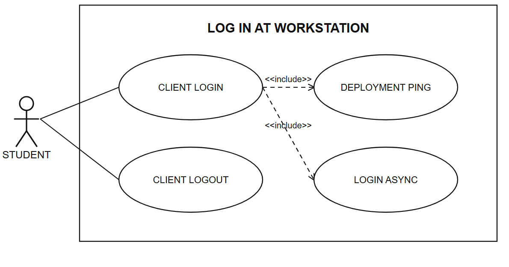

*Figure 3.37: System Use Case for log in at workstation*

### S-190  ·  AUTHENTICATE WORKSTATION

**Use Case Name:** AUTHENTICATE WORKSTATION  
**Purpose:** Let a student sign in from the CAMS client installed on a laboratory workstation, binding the sign-in to the machine the student is sitting at.  
**Actors:**

- Student (Primary Actor)

**Input Parameters:**

- `request` : `StudentClientLoginRequest`

**Output Parameters:**

- A `StudentClientLoginResponse` carrying the student identity, the workstation registration and the session state.

**Pre-Condition:**

- None. The client reaches this before any session exists. The workstation must have found the server and must trust the CAMS root certificate.

**Post-Condition:**

- The change is committed to the database and visible to the next read.
- The caller sees the outcome reported on the page they return to.

**Successful Scenario:**

1. The CAMS client finds the server on the laboratory network.
2. The student enters a username and a password in the client.
3. The client posts the credentials together with the name of the workstation.
4. The server verifies the credentials and confirms the account is a student that is active and not locked out.
5. The server registers the workstation against the student, reassigning it if it was held by someone else who is no longer using it.
6. The client receives the session details and the monitored session begins.

**Exception Scenario:**

- **No server was found on the network** — the client reports that it cannot reach CAMS and offers the endpoint to be entered by hand.
- **The workstation is already held by another active session** — the sign-in is refused rather than displacing the student using it.
- **The account is not a student** — the client refuses the sign-in; teacher and administrator accounts use the web portal.

**Additional Remarks:**

- Implemented by `ClientAuthController.Login` (POST).
- Appears in the *LOG IN AT WORKSTATION* module of the use case diagram.
- Pulls in **VERIFY ENDPOINT** (`<<include>>`).

### S-191  ·  DISCONNECT WORKSTATION

**Use Case Name:** DISCONNECT WORKSTATION  
**Purpose:** End the workstation session from the client, releasing the workstation so another student may sign in to it.  
**Actors:**

- Student (Primary Actor)

**Input Parameters:**

- None beyond the signed-in identity carried on the authentication cookie.

**Output Parameters:**

- Confirmation that the session was closed and the workstation released.

**Pre-Condition:**

- The caller is signed in as a student.

**Post-Condition:**

- The change is committed to the database and visible to the next read.
- The caller sees the outcome reported on the page they return to.

**Successful Scenario:**

1. The student signs out from the CAMS client.
2. The server ends the lab session and records its end time.
3. The workstation is released so another student may sign in at it.

**Exception Scenario:**

- **Not signed in or wrong role** — the request is refused and the caller is sent to the access denied page.
- **Validation fails** — the form is redisplayed with the offending fields marked and nothing is written.

**Additional Remarks:**

- Implemented by `ClientAuthController.Logout` (POST).
- Appears in the *LOG IN AT WORKSTATION* module of the use case diagram.

### S-192  ·  VERIFY ENDPOINT

**Use Case Name:** VERIFY ENDPOINT  
**Purpose:** Answer the discovery request a client broadcasts while looking for the CAMS server on the laboratory network.  
**Actors:**

- Student (Primary Actor)
- None; this behaviour runs inside **AUTHENTICATE WORKSTATION** (Secondary Actor)

**Input Parameters:**

- None beyond the signed-in identity carried on the authentication cookie.

**Output Parameters:**

- The server endpoint a client should connect to.

**Pre-Condition:**

- None. The endpoint answers an unauthenticated broadcast, so a client can find the server before it has credentials.
- **AUTHENTICATE WORKSTATION** has reached the point where this is always performed.

**Post-Condition:**

- The caller has the requested information. Nothing in the database has changed.

**Successful Scenario:**

1. A CAMS client broadcasts on the laboratory network looking for a server.
2. The server answers with the endpoint the client should use.
3. The client stores the endpoint and proceeds to sign in.

**Exception Scenario:**

- **The broadcast does not reach the server** — no answer is returned and the client falls back to a configured endpoint.

**Additional Remarks:**

- Implemented by `DeploymentPingController.Get` (GET).
- Appears in the *LOG IN AT WORKSTATION* module of the use case diagram.
- Drawn as `<<include>>` from **AUTHENTICATE WORKSTATION**.

## WORK AT MONITORED WORKSTATION  ·  `RemoteMonitoringHub`

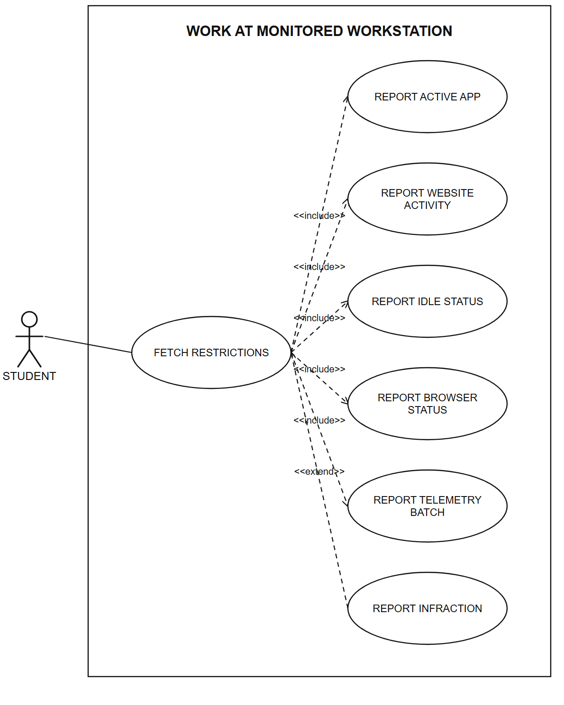

*Figure 3.38: System Use Case for work at monitored workstation*

### S-193  ·  FETCH RESTRICTIONS

**Use Case Name:** FETCH RESTRICTIONS  
**Purpose:** Give the client the restriction rules that apply to the student signed in at that workstation.  
**Actors:**

- Student (Primary Actor)
- The CAMS client on the target workstation (Secondary Actor)

**Input Parameters:**

- None beyond the signed-in identity carried on the authentication cookie.

**Output Parameters:**

- A SignalR message delivered to the target workstation or group; no HTTP response.

**Pre-Condition:**

- The caller is signed in.

**Post-Condition:**

- The workstation has acted on the command and the console shows its new state.

**Successful Scenario:**

1. The Student triggers the command from the monitoring console.
2. The browser invokes `FetchRestrictions` on the SignalR hub over the open connection.
3. The server checks the caller’s role and resolves the target connection.
4. The server relays the instruction to the workstation client.
5. The client carries it out and the console reflects the new state.

**Exception Scenario:**

- **Not signed in or wrong role** — the request is refused and the caller is sent to the access denied page.
- **The workstation is not connected** — the command cannot be delivered and the console reports the workstation as offline.

**Additional Remarks:**

- Implemented by `RemoteMonitoringHub.FetchRestrictions` (GET).
- Appears in the *WORK AT MONITORED WORKSTATION* module of the use case diagram.
- Pulls in **REPORT ACTIVE APP** (`<<include>>`), **REPORT WEBSITE ACTIVITY** (`<<include>>`), **REPORT IDLE STATUS** (`<<include>>`), **REPORT BROWSER STATUS** (`<<include>>`), **REPORT TELEMETRY BATCH** (`<<include>>`), **REPORT INFRACTION** (`<<extend>>`).

### S-194  ·  REPORT ACTIVE APP

**Use Case Name:** REPORT ACTIVE APP  
**Purpose:** Report which application is in the foreground on the workstation.  
**Actors:**

- Student (Primary Actor)
- The CAMS client on the target workstation (Secondary Actor)

**Input Parameters:**

- `app` : `ActiveAppMessage`

**Output Parameters:**

- A SignalR message delivered to the target workstation or group; no HTTP response.

**Pre-Condition:**

- The caller is signed in.
- **FETCH RESTRICTIONS** has reached the point where this is always performed.

**Post-Condition:**

- The workstation has acted on the command and the console shows its new state.

**Successful Scenario:**

1. The Student triggers the command from the monitoring console.
2. The browser invokes `ReportActiveApp` on the SignalR hub over the open connection.
3. The server checks the caller’s role and resolves the target connection.
4. The server relays the instruction to the workstation client.
5. The client carries it out and the console reflects the new state.

**Exception Scenario:**

- **Not signed in or wrong role** — the request is refused and the caller is sent to the access denied page.
- **The workstation is not connected** — the command cannot be delivered and the console reports the workstation as offline.

**Additional Remarks:**

- Implemented by `RemoteMonitoringHub.ReportActiveApp` (GET).
- Appears in the *WORK AT MONITORED WORKSTATION* module of the use case diagram.
- Drawn as `<<include>>` from **FETCH RESTRICTIONS**.

### S-195  ·  REPORT WEBSITE ACTIVITY

**Use Case Name:** REPORT WEBSITE ACTIVITY  
**Purpose:** Report the website the student is viewing in the browser.  
**Actors:**

- Student (Primary Actor)
- The CAMS client on the target workstation (Secondary Actor)

**Input Parameters:**

- `website` : `WebsiteActivityMessage`

**Output Parameters:**

- A SignalR message delivered to the target workstation or group; no HTTP response.

**Pre-Condition:**

- The caller is signed in.
- **FETCH RESTRICTIONS** has reached the point where this is always performed.

**Post-Condition:**

- The workstation has acted on the command and the console shows its new state.

**Successful Scenario:**

1. The Student triggers the command from the monitoring console.
2. The browser invokes `ReportWebsiteActivity` on the SignalR hub over the open connection.
3. The server checks the caller’s role and resolves the target connection.
4. The server relays the instruction to the workstation client.
5. The client carries it out and the console reflects the new state.

**Exception Scenario:**

- **Not signed in or wrong role** — the request is refused and the caller is sent to the access denied page.
- **The workstation is not connected** — the command cannot be delivered and the console reports the workstation as offline.

**Additional Remarks:**

- Implemented by `RemoteMonitoringHub.ReportWebsiteActivity` (GET).
- Appears in the *WORK AT MONITORED WORKSTATION* module of the use case diagram.
- Drawn as `<<include>>` from **FETCH RESTRICTIONS**.

### S-196  ·  REPORT IDLE STATUS

**Use Case Name:** REPORT IDLE STATUS  
**Purpose:** Report whether the workstation has gone idle.  
**Actors:**

- Student (Primary Actor)
- The CAMS client on the target workstation (Secondary Actor)

**Input Parameters:**

- `status` : `IdleStatusMessage`

**Output Parameters:**

- A SignalR message delivered to the target workstation or group; no HTTP response.

**Pre-Condition:**

- The caller is signed in.
- **FETCH RESTRICTIONS** has reached the point where this is always performed.

**Post-Condition:**

- The workstation has acted on the command and the console shows its new state.

**Successful Scenario:**

1. The Student triggers the command from the monitoring console.
2. The browser invokes `ReportIdleStatus` on the SignalR hub over the open connection.
3. The server checks the caller’s role and resolves the target connection.
4. The server relays the instruction to the workstation client.
5. The client carries it out and the console reflects the new state.

**Exception Scenario:**

- **Not signed in or wrong role** — the request is refused and the caller is sent to the access denied page.
- **The workstation is not connected** — the command cannot be delivered and the console reports the workstation as offline.

**Additional Remarks:**

- Implemented by `RemoteMonitoringHub.ReportIdleStatus` (GET).
- Appears in the *WORK AT MONITORED WORKSTATION* module of the use case diagram.
- Drawn as `<<include>>` from **FETCH RESTRICTIONS**.

### S-197  ·  REPORT BROWSER STATUS

**Use Case Name:** REPORT BROWSER STATUS  
**Purpose:** Report whether browser monitoring is working on the workstation.  
**Actors:**

- Student (Primary Actor)
- The CAMS client on the target workstation (Secondary Actor)

**Input Parameters:**

- `status` : `BrowserMonitoringStatusMessage`

**Output Parameters:**

- A SignalR message delivered to the target workstation or group; no HTTP response.

**Pre-Condition:**

- The caller is signed in.
- **FETCH RESTRICTIONS** has reached the point where this is always performed.

**Post-Condition:**

- The workstation has acted on the command and the console shows its new state.

**Successful Scenario:**

1. The Student triggers the command from the monitoring console.
2. The browser invokes `ReportBrowserMonitoringStatus` on the SignalR hub over the open connection.
3. The server checks the caller’s role and resolves the target connection.
4. The server relays the instruction to the workstation client.
5. The client carries it out and the console reflects the new state.

**Exception Scenario:**

- **Not signed in or wrong role** — the request is refused and the caller is sent to the access denied page.
- **The workstation is not connected** — the command cannot be delivered and the console reports the workstation as offline.

**Additional Remarks:**

- Implemented by `RemoteMonitoringHub.ReportBrowserMonitoringStatus` (GET).
- Appears in the *WORK AT MONITORED WORKSTATION* module of the use case diagram.
- Drawn as `<<include>>` from **FETCH RESTRICTIONS**.

### S-198  ·  REPORT TELEMETRY BATCH

**Use Case Name:** REPORT TELEMETRY BATCH  
**Purpose:** Send a batch of buffered telemetry, so a brief disconnection does not lose the record.  
**Actors:**

- Student (Primary Actor)
- The CAMS client on the target workstation (Secondary Actor)

**Input Parameters:**

- `batch` : `TelemetryBatchMessage`

**Output Parameters:**

- A SignalR message delivered to the target workstation or group; no HTTP response.

**Pre-Condition:**

- The caller is signed in.
- **FETCH RESTRICTIONS** has reached the point where this is always performed.

**Post-Condition:**

- The workstation has acted on the command and the console shows its new state.

**Successful Scenario:**

1. The Student triggers the command from the monitoring console.
2. The browser invokes `ReportTelemetryBatch` on the SignalR hub over the open connection.
3. The server checks the caller’s role and resolves the target connection.
4. The server relays the instruction to the workstation client.
5. The client carries it out and the console reflects the new state.

**Exception Scenario:**

- **Not signed in or wrong role** — the request is refused and the caller is sent to the access denied page.
- **The workstation is not connected** — the command cannot be delivered and the console reports the workstation as offline.

**Additional Remarks:**

- Implemented by `RemoteMonitoringHub.ReportTelemetryBatch` (GET).
- Appears in the *WORK AT MONITORED WORKSTATION* module of the use case diagram.
- Drawn as `<<include>>` from **FETCH RESTRICTIONS**.

### S-199  ·  REPORT INFRACTION

**Use Case Name:** REPORT INFRACTION  
**Purpose:** Report that the student tried to open something a restriction rule blocks.  
**Actors:**

- Student (Primary Actor)
- The CAMS client on the target workstation (Secondary Actor)

**Input Parameters:**

- `infraction` : `InfractionMessage`

**Output Parameters:**

- A SignalR message delivered to the target workstation or group; no HTTP response.

**Pre-Condition:**

- The caller is signed in.
- **FETCH RESTRICTIONS** has reached the point where this is optionally performed.

**Post-Condition:**

- The workstation has acted on the command and the console shows its new state.

**Successful Scenario:**

1. The Student triggers the command from the monitoring console.
2. The browser invokes `ReportInfraction` on the SignalR hub over the open connection.
3. The server checks the caller’s role and resolves the target connection.
4. The server relays the instruction to the workstation client.
5. The client carries it out and the console reflects the new state.

**Exception Scenario:**

- **Not signed in or wrong role** — the request is refused and the caller is sent to the access denied page.
- **The workstation is not connected** — the command cannot be delivered and the console reports the workstation as offline.

**Additional Remarks:**

- Implemented by `RemoteMonitoringHub.ReportInfraction` (GET).
- Appears in the *WORK AT MONITORED WORKSTATION* module of the use case diagram.
- Drawn as `<<extend>>` to **FETCH RESTRICTIONS**.

## VIEW STUDENT SESSION  ·  `StudentController`

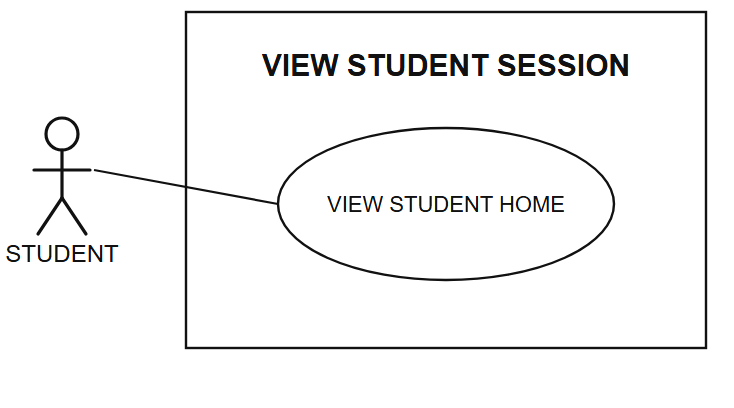

*Figure 3.39: System Use Case for view student session*

### S-200  ·  VIEW STUDENT HOME

**Use Case Name:** VIEW STUDENT HOME  
**Purpose:** Show the student portal home with the current session state and timer.  
**Actors:**

- Student (Primary Actor)

**Input Parameters:**

- None beyond the signed-in identity carried on the authentication cookie.

**Output Parameters:**

- The rendered page, or a JSON payload where the caller is the page’s own script.

**Pre-Condition:**

- The caller is signed in as a student.

**Post-Condition:**

- The caller has the requested information. Nothing in the database has changed.

**Successful Scenario:**

1. The Student opens the page and CAMS confirms the role on the authentication cookie.
2. The server reads the records the caller is entitled to see.
3. The page renders with those records.

**Exception Scenario:**

- **Not signed in or wrong role** — the request is refused and the caller is sent to the access denied page.

**Additional Remarks:**

- Implemented by `StudentController.Index` (GET).
- Appears in the *VIEW STUDENT SESSION* module of the use case diagram.

## MANAGE STUDENT ALERT  ·  `StudentController`

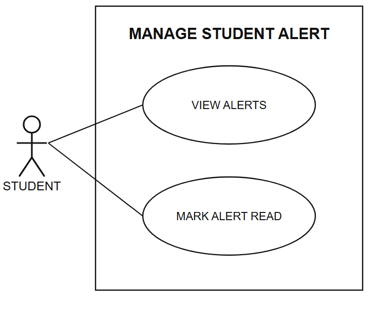

*Figure 3.40: System Use Case for manage student alert*

### S-201  ·  VIEW ALERTS

**Use Case Name:** VIEW ALERTS  
**Purpose:** List the monitoring alerts raised for the classes the teacher is responsible for.  
**Actors:**

- Student (Primary Actor)

**Input Parameters:**

- None beyond the signed-in identity carried on the authentication cookie.

**Output Parameters:**

- The rendered page, or a JSON payload where the caller is the page’s own script.

**Pre-Condition:**

- The caller is signed in as a student.

**Post-Condition:**

- The caller has the requested information. Nothing in the database has changed.

**Successful Scenario:**

1. The Student opens the page and CAMS confirms the role on the authentication cookie.
2. The server reads the records the caller is entitled to see.
3. The page renders with those records.

**Exception Scenario:**

- **Not signed in or wrong role** — the request is refused and the caller is sent to the access denied page.

**Additional Remarks:**

- Implemented by `StudentController.Alerts` (GET).
- Appears in the *MANAGE STUDENT ALERT* module of the use case diagram.

### S-202  ·  MARK ALERT READ

**Use Case Name:** MARK ALERT READ  
**Purpose:** Let a student mark one of their own alerts as read.  
**Actors:**

- Student (Primary Actor)

**Input Parameters:**

- `id` : `int`

**Output Parameters:**

- A redirect back to the listing page, carrying a success or failure message for display.

**Pre-Condition:**

- The caller is signed in as a student.
- The record named by the identifier exists.

**Post-Condition:**

- The change is committed to the database and visible to the next read.
- The caller sees the outcome reported on the page they return to.

**Successful Scenario:**

1. The Student opens the page and CAMS confirms the role on the authentication cookie.
2. The Student fills the form and submits it.
3. The server validates the antiforgery token that accompanied the form.
4. The server validates the submitted values against the model rules.
5. The change is written to the database through `ApplicationDbContext`.
6. The server redirects back to the listing, where the result is shown.

**Exception Scenario:**

- **Not signed in or wrong role** — the request is refused and the caller is sent to the access denied page.
- **Missing or stale antiforgery token** — the submission is rejected and must be retried from a freshly loaded form.
- **Validation fails** — the form is redisplayed with the offending fields marked and nothing is written.
- **The identifier matches no record** — the action reports that the record was not found and makes no change.

**Additional Remarks:**

- Implemented by `StudentController.MarkRead` (POST).
- Appears in the *MANAGE STUDENT ALERT* module of the use case diagram.

## MANAGE STUDENT ACCOUNT  ·  `StudentController`

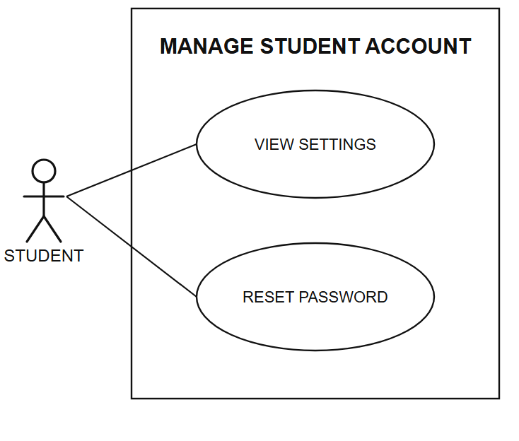

*Figure 3.41: System Use Case for manage student account*

### S-203  ·  VIEW SETTINGS

**Use Case Name:** VIEW SETTINGS  
**Purpose:** Show the settings page for the signed-in user.  
**Actors:**

- Student (Primary Actor)

**Input Parameters:**

- None beyond the signed-in identity carried on the authentication cookie.

**Output Parameters:**

- The rendered page, or a JSON payload where the caller is the page’s own script.

**Pre-Condition:**

- The caller is signed in as a student.

**Post-Condition:**

- The caller has the requested information. Nothing in the database has changed.

**Successful Scenario:**

1. The Student opens the page and CAMS confirms the role on the authentication cookie.
2. The server reads the records the caller is entitled to see.
3. The page renders with those records.

**Exception Scenario:**

- **Not signed in or wrong role** — the request is refused and the caller is sent to the access denied page.

**Additional Remarks:**

- Implemented by `StudentController.Settings` (GET).
- Appears in the *MANAGE STUDENT ACCOUNT* module of the use case diagram.

### S-204  ·  RESET PASSWORD

**Use Case Name:** RESET PASSWORD  
**Purpose:** Let a student replace their own password from the student portal.  
**Actors:**

- Student (Primary Actor)

**Input Parameters:**

- `input` : `PasswordChangeInput`

**Output Parameters:**

- A redirect back to the listing page, carrying a success or failure message for display.

**Pre-Condition:**

- The caller is signed in as a student.

**Post-Condition:**

- The change is committed to the database and visible to the next read.
- The caller sees the outcome reported on the page they return to.

**Successful Scenario:**

1. The Student opens the page and CAMS confirms the role on the authentication cookie.
2. The Student fills the form and submits it.
3. The server validates the antiforgery token that accompanied the form.
4. The server validates the submitted values against the model rules.
5. The change is written to the database through `ApplicationDbContext`.
6. The server redirects back to the listing, where the result is shown.

**Exception Scenario:**

- **Not signed in or wrong role** — the request is refused and the caller is sent to the access denied page.
- **Missing or stale antiforgery token** — the submission is rejected and must be retried from a freshly loaded form.
- **Validation fails** — the form is redisplayed with the offending fields marked and nothing is written.

**Additional Remarks:**

- Implemented by `StudentController.ResetPassword` (POST).
- Appears in the *MANAGE STUDENT ACCOUNT* module of the use case diagram.
