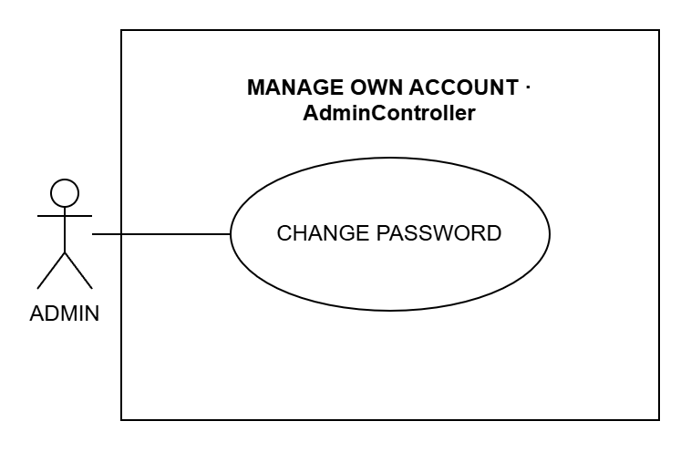

# CAMS Written Use Cases

A written specification for every use case in [`CAMS-Use-Case-Diagram.drawio`](CAMS-Use-Case-Diagram.drawio), set out in the ten fields the course handout uses: use case name, purpose, actors, input parameters, output parameters, pre-condition, post-condition, successful scenario, exception scenario and additional remarks.

**137 use cases** across 36 modules. Four rules decide what is a use case and what it is called:

- **A use case gets something done.** A page that only shows information is not a use case on its own. It stays only where an export extends it, the way VIEW REPORTS carries its four CSV exports.
- **Nothing is deleted.** Where a record used to have a DELETE use case it now has TOGGLE … STATUS: the record is deactivated or archived and can be brought back, so its history stays readable.
- **One goal, one use case.** Actions that reach the same goal are written once: enrolling one student, a group of students or a brand-new student is ENROLL STUDENTS.
- **The name says what the actor achieves**, verb first. The functions that carry it out are named under Additional Remarks, and the messages quoted in the exception scenarios are the ones CAMS shows.

| Actor | Use cases | Modules |
| --- | ---: | ---: |
| Admin | 61 | 16 |
| Teacher | 70 | 18 |
| Student | 6 | 2 |

---

## Contents

**ADMIN**  
- PROCESS LOG IN — A-001, A-002
- MANAGE OWN ACCOUNT — A-003
- MANAGE ADMIN ACCOUNT — A-004, A-005, A-006
- MANAGE TEACHER ACCOUNT — A-007, A-008, A-009, A-010
- MANAGE STUDENT ACCOUNT — A-011, A-012, A-013, A-014, A-015
- MANAGE COMPUTER PROFILE — A-016, A-017, A-018, A-019
- MANAGE CLASS — A-020, A-021, A-022, A-023
- MANAGE CLASS ROSTER — A-024, A-025
- MANAGE RESTRICTION RULE — A-026, A-027, A-028
- MANAGE BLACKLIST AND WHITELIST — A-029, A-030, A-031, A-032, A-033
- MANAGE CATEGORY — A-034, A-035, A-036, A-037, A-038, A-039
- MANAGE SESSION RULE — A-040, A-041, A-042
- CONTROL LABORATORY SESSION — A-043, A-044, A-045
- EXPORT REPORTS AND LOGS — A-046, A-047, A-048, A-049, A-050, A-051, A-052, A-053, A-054
- MANAGE DATABASE — A-055, A-056, A-057
- MANAGE DEPLOYMENT — A-058, A-059, A-060, A-061

**TEACHER**  
- PROCESS LOG IN — T-062, T-063
- MANAGE OWN ACCOUNT — T-064
- MANAGE PEER TEACHER ACCOUNT — T-065, T-066, T-067, T-068
- MANAGE STUDENT ACCOUNT — T-069, T-070, T-071, T-072, T-073
- MANAGE COMPUTER PROFILE — T-074, T-075, T-076, T-077
- MANAGE CLASS — T-078, T-079, T-080
- MANAGE CLASS ROSTER — T-081, T-082
- MANAGE RESTRICTION RULE — T-083, T-084, T-085
- MANAGE BLACKLIST AND WHITELIST — T-086, T-087, T-088, T-089, T-090
- MANAGE CATEGORY — T-091, T-092, T-093, T-094, T-095, T-096
- MANAGE SESSION RULE — T-097, T-098, T-099
- CONTROL LABORATORY SESSION — T-100, T-101, T-102, T-103
- CONTROL STUDENT SESSION — T-104, T-105
- MONITOR STUDENT SCREEN — T-106, T-107
- CONTROL STUDENT WORKSTATION — T-108, T-109, T-110, T-111, T-112, T-113, T-114, T-115, T-116, T-117
- SEND MESSAGE TO STUDENT — T-118, T-119, T-120
- MANAGE MONITORING ALERT — T-121, T-122, T-123, T-124, T-125
- EXPORT TEACHER RECORDS — T-126, T-127, T-128, T-129, T-130, T-131

**STUDENT**  
- LOG IN AT WORKSTATION — S-132, S-133, S-134, S-135, S-136
- MANAGE OWN ACCOUNT — S-137

---

# ADMIN

## PROCESS LOG IN  ·  `AccountController`

*Figure 3.1: System Use Case for process log in*

### A-001  ·  LOG IN USER

**Use Case Name:** LOG IN USER  
**Purpose:** Sign in to the CAMS web portal with a username and password and land on the administrator dashboard.  
**Actors:**

- Admin (Primary Actor)

**Input Parameters:**

- `username` : `string`
- `password` : `string`

**Output Parameters:**

- An authentication cookie that carries the account's role, and a redirect to the dashboard for that role.

**Pre-Condition:**

- The CAMS server is running and its sign-in page opens in the browser.
- The Admin has an account in CAMS.

**Post-Condition:**

- The Admin is signed in and sees the administrator dashboard.
- A failed attempt is counted against the account; a successful sign-in clears the count.

**Successful Scenario:**

1. The Admin opens the CAMS sign-in page.
2. The Admin enters a username and a password and chooses Sign in.
3. CAMS finds the account with that username and checks the password against the stored hash.
4. CAMS confirms that the account is active and not locked out.
5. CAMS issues the authentication cookie with the account's role.
6. The Admin is taken to the administrator dashboard.

**Exception Scenario:**

- **Wrong username or password** — the page reports that the sign-in failed without saying which part was wrong, and the failed attempt is counted.
- **Too many failed attempts** — the account is locked for a while and refused even with the right password, unless an administrator lifts the lockout first.
- **The account is deactivated** — the sign-in is refused.
- **A student account is used** — the portal refuses it and tells the student to sign in on the CAMS Student Client instead.
- **The form has expired** — the antiforgery check fails and nothing is saved; the page must be reloaded and the form sent again.

**Additional Remarks:**

- Implemented by `AccountController.Login` (POST).
- Appears in the *PROCESS LOG IN* module of the use case diagram.

### A-002  ·  SIGN OUT USER

**Use Case Name:** SIGN OUT USER  
**Purpose:** End the portal session so the next person at the browser starts signed out.  
**Actors:**

- Admin (Primary Actor)

**Input Parameters:**

- None; the signed-in account is read from the authentication cookie.

**Output Parameters:**

- The authentication cookie is cleared and the browser returns to the sign-in page.

**Pre-Condition:**

- The Admin is signed in to the CAMS web portal.

**Post-Condition:**

- The session and the authentication cookie are cleared; pages that need a sign-in are refused until the Admin signs in again.

**Successful Scenario:**

1. The Admin chooses Sign out from the portal menu.
2. CAMS clears the session and the authentication cookie.
3. The browser returns to the sign-in page.

**Exception Scenario:**

- **The session had already expired** — CAMS still clears the cookie and shows the sign-in page.

**Additional Remarks:**

- Implemented by `AccountController.Logout` (GET or POST).
- Appears in the *PROCESS LOG IN* module of the use case diagram.

## MANAGE OWN ACCOUNT  ·  `AdminController`

*Figure 3.2: System Use Case for manage own account*

### A-003  ·  CHANGE PASSWORD

**Use Case Name:** CHANGE PASSWORD  
**Purpose:** Replace the Admin's own password after proving the current one.  
**Actors:**

- Admin (Primary Actor)

**Input Parameters:**

- `CurrentPassword` : `string`
- `NewPassword` : `string`
- `ConfirmPassword` : `string`

**Output Parameters:**

- The Settings page with a confirmation message, or the form again with the problem marked.

**Pre-Condition:**

- The Admin is signed in to the CAMS web portal.

**Post-Condition:**

- The new password is stored as a hash and the old password no longer signs in.

**Successful Scenario:**

1. The Admin opens Settings and goes to Change password.
2. The Admin enters the current password and the new password twice, then submits the form.
3. CAMS checks that the new password has at least eight characters and that both copies match.
4. CAMS checks the current password against the stored hash.
5. CAMS stores the hash of the new password.
6. Settings shows "Your password was changed successfully."

**Exception Scenario:**

- **Not signed in, or the role is not allowed** — CAMS sends the user back to the sign-in page and nothing changes.
- **The current password is wrong** — the form reports "The current password is incorrect." and the password is not changed.
- **The new password is too short, or the two copies differ** — the form is shown again with the field marked and nothing is changed.
- **The form has expired** — the antiforgery check fails and nothing is saved; the page must be reloaded and the form sent again.

**Additional Remarks:**

- Implemented by `AdminController.ChangePassword` (POST).
- Appears in the *MANAGE OWN ACCOUNT* module of the use case diagram.

## MANAGE ADMIN ACCOUNT  ·  `AdminController`

*Figure 3.3: System Use Case for manage admin account*

### A-004  ·  CREATE ADMIN

**Use Case Name:** CREATE ADMIN  
**Purpose:** Add another administrator account, so more than one person can run CAMS.  
**Actors:**

- Admin (Primary Actor)

**Input Parameters:**

- `FullName` : `string`
- `Username` : `string`
- `PasswordHash` : `string`, the initial password, stored only as a hash

**Output Parameters:**

- The Admin Accounts page with the new administrator listed and a confirmation message.

**Pre-Condition:**

- The Admin is signed in to the CAMS web portal.

**Post-Condition:**

- The new administrator account is active and can sign in.
- CreateAdmin is recorded in the audit log.

**Successful Scenario:**

1. The Admin opens Admin Accounts and chooses to add an administrator.
2. The Admin enters the full name, a username and an initial password, then submits the form.
3. CAMS checks that a username and a password were given and that the username is not already in use.
4. CAMS saves the account with the password stored as a hash.
5. CAMS records CreateAdmin in the audit log.
6. Admin Accounts shows "Administrator '<username>' created successfully."

**Exception Scenario:**

- **Not signed in, or the role is not allowed** — CAMS sends the user back to the sign-in page and nothing changes.
- **The username or the password is missing** — CAMS reports "Username is required." or "A password is required for a new administrator." and creates nothing.
- **The username is taken** — CAMS reports that the username is already in use and creates nothing.
- **The form has expired** — the antiforgery check fails and nothing is saved; the page must be reloaded and the form sent again.

**Additional Remarks:**

- Implemented by `AdminController.CreateAdmin` (POST).
- Appears in the *MANAGE ADMIN ACCOUNT* module of the use case diagram.

### A-005  ·  UPDATE ADMIN

**Use Case Name:** UPDATE ADMIN  
**Purpose:** Correct an administrator's full name or username.  
**Actors:**

- Admin (Primary Actor)

**Input Parameters:**

- `Id` : `int`
- `FullName` : `string`
- `Username` : `string`

**Output Parameters:**

- The Admin Accounts page with the change shown and a confirmation message.

**Pre-Condition:**

- The Admin is signed in to the CAMS web portal.
- The administrator account exists.

**Post-Condition:**

- The new details are saved, and the next sign-in uses the new username.
- UpdateAdmin is recorded in the audit log.

**Successful Scenario:**

1. The Admin opens Admin Accounts and chooses Edit on the administrator.
2. The Admin changes the full name or the username and saves.
3. CAMS checks that no other account uses the username.
4. CAMS saves the change.
5. CAMS records UpdateAdmin in the audit log.
6. Admin Accounts shows "Administrator '<username>' updated successfully."

**Exception Scenario:**

- **Not signed in, or the role is not allowed** — CAMS sends the user back to the sign-in page and nothing changes.
- **The username is taken** — CAMS reports that the username is already in use and keeps the old details.
- **The form has expired** — the antiforgery check fails and nothing is saved; the page must be reloaded and the form sent again.

**Additional Remarks:**

- Implemented by `AdminController.UpdateAdmin` (POST).
- Appears in the *MANAGE ADMIN ACCOUNT* module of the use case diagram.

### A-006  ·  TOGGLE ADMIN STATUS

**Use Case Name:** TOGGLE ADMIN STATUS  
**Purpose:** Deactivate an administrator account so it can no longer sign in, or activate it again. The account and its audit history are kept.  
**Actors:**

- Admin (Primary Actor)

**Input Parameters:**

- `accountRole` : `AccountRole`, set to Admin
- `id` : `int`
- `isActive` : `bool`

**Output Parameters:**

- The Admin Accounts page showing the account as active or inactive, with a confirmation message.

**Pre-Condition:**

- The Admin is signed in to the CAMS web portal.
- The administrator account exists.

**Post-Condition:**

- The account is active or inactive; an inactive administrator is refused at sign-in.
- Nothing is deleted.
- ActivateAccount or DeactivateAccount is recorded in the audit log.

**Successful Scenario:**

1. The Admin opens Admin Accounts and finds the administrator.
2. The Admin chooses Deactivate (or Activate) and confirms.
3. CAMS checks that deactivating would not leave CAMS without an active administrator.
4. CAMS marks the account inactive (or active).
5. CAMS records the change in the audit log.
6. Admin Accounts shows "The admin account is now inactive." (or active).

**Exception Scenario:**

- **Not signed in, or the role is not allowed** — CAMS sends the user back to the sign-in page and nothing changes.
- **It is the last active administrator** — CAMS reports "The last active administrator cannot be deactivated." and nothing changes.
- **The account no longer exists** — CAMS answers Not Found and nothing changes.
- **The form has expired** — the antiforgery check fails and nothing is saved; the page must be reloaded and the form sent again.

**Additional Remarks:**

- Implemented by `AdminController.SetAccountActive` (POST).
- Appears in the *MANAGE ADMIN ACCOUNT* module of the use case diagram.

## MANAGE TEACHER ACCOUNT  ·  `AdminController`

*Figure 3.4: System Use Case for manage teacher account*

### A-007  ·  CREATE TEACHER

**Use Case Name:** CREATE TEACHER  
**Purpose:** Register a teacher account so the teacher can sign in to the portal and run laboratory sessions.  
**Actors:**

- Admin (Primary Actor)

**Input Parameters:**

- `FirstName` : `string`
- `LastName` : `string`
- `Email` : `string`
- `ContactNumber` : `string`
- `Username` : `string`
- `PasswordHash` : `string`, the initial password, stored only as a hash
- `Status` : `string` (optional)

**Output Parameters:**

- The Teachers page with the new teacher listed and a confirmation message.

**Pre-Condition:**

- The Admin is signed in to the CAMS web portal.

**Post-Condition:**

- The teacher account exists and can sign in.
- CreateTeacher is recorded in the audit log.

**Successful Scenario:**

1. The Admin opens Teachers and chooses to add a teacher.
2. The Admin enters the teacher's name, e-mail address, contact number, a username and an initial password, then submits the form.
3. CAMS checks that a username and a password were given and that the username is not already in use.
4. CAMS saves the account with the password stored as a hash.
5. CAMS records CreateTeacher in the audit log.
6. Teachers lists the new teacher with "Teacher '<name>' registered successfully!"

**Exception Scenario:**

- **Not signed in, or the role is not allowed** — CAMS sends the user back to the sign-in page and nothing changes.
- **The username or the password is missing** — CAMS reports "Username is required." or "A password is required for a new teacher." and creates nothing.
- **The username is taken** — CAMS reports that the username is already in use and creates nothing.

**Additional Remarks:**

- Implemented by `AdminController.CreateTeacher` (POST).
- Appears in the *MANAGE TEACHER ACCOUNT* module of the use case diagram.

### A-008  ·  UPDATE TEACHER

**Use Case Name:** UPDATE TEACHER  
**Purpose:** Correct a teacher's name, contact details or username.  
**Actors:**

- Admin (Primary Actor)

**Input Parameters:**

- `TeacherId` : `int`
- `FirstName` : `string`
- `LastName` : `string`
- `Email` : `string`
- `ContactNumber` : `string`
- `Username` : `string`

**Output Parameters:**

- The Teachers page with the change shown and a confirmation message.

**Pre-Condition:**

- The Admin is signed in to the CAMS web portal.
- The teacher account exists.

**Post-Condition:**

- The new details are saved, and the next sign-in uses the new username.
- UpdateTeacher is recorded in the audit log.

**Successful Scenario:**

1. The Admin opens Teachers and chooses Edit on the teacher.
2. The Admin changes the details and saves.
3. CAMS checks that no other account uses the username.
4. CAMS saves the change.
5. CAMS records UpdateTeacher in the audit log.
6. Teachers shows "Teacher '<name>' updated successfully!"

**Exception Scenario:**

- **Not signed in, or the role is not allowed** — CAMS sends the user back to the sign-in page and nothing changes.
- **The username is taken** — CAMS reports that the username is already in use and keeps the old details.

**Additional Remarks:**

- Implemented by `AdminController.UpdateTeacher` (POST).
- Appears in the *MANAGE TEACHER ACCOUNT* module of the use case diagram.

### A-009  ·  TOGGLE TEACHER STATUS

**Use Case Name:** TOGGLE TEACHER STATUS  
**Purpose:** Deactivate a teacher account so it can no longer sign in, or activate it again. The account and the records of its classes and sessions are kept.  
**Actors:**

- Admin (Primary Actor)

**Input Parameters:**

- `accountRole` : `AccountRole`, set to Teacher
- `id` : `int`
- `isActive` : `bool`

**Output Parameters:**

- The Teachers page showing the teacher as active or inactive, with a confirmation message.

**Pre-Condition:**

- The Admin is signed in to the CAMS web portal.
- The teacher account exists.

**Post-Condition:**

- The account is active or inactive; an inactive teacher is refused at sign-in.
- Nothing is deleted.
- ActivateAccount or DeactivateAccount is recorded in the audit log.

**Successful Scenario:**

1. The Admin opens Teachers and finds the teacher.
2. The Admin chooses Deactivate (or Activate) and confirms.
3. CAMS checks that the teacher has no active classes left.
4. CAMS marks the account inactive (or active).
5. CAMS records the change in the audit log.
6. Teachers shows "The teacher account is now inactive." (or active).

**Exception Scenario:**

- **Not signed in, or the role is not allowed** — CAMS sends the user back to the sign-in page and nothing changes.
- **The teacher still has active classes** — CAMS reports "Reassign or archive this teacher's active classes before deactivating the account." and nothing changes.
- **The account no longer exists** — CAMS answers Not Found and nothing changes.
- **The form has expired** — the antiforgery check fails and nothing is saved; the page must be reloaded and the form sent again.

**Additional Remarks:**

- Implemented by `AdminController.SetAccountActive` (POST).
- Appears in the *MANAGE TEACHER ACCOUNT* module of the use case diagram.

### A-010  ·  UNLOCK TEACHER ACCOUNT

**Use Case Name:** UNLOCK TEACHER ACCOUNT  
**Purpose:** Lift the lockout a teacher account gets after repeated wrong passwords, instead of waiting for it to run out.  
**Actors:**

- Admin (Primary Actor)

**Input Parameters:**

- `accountRole` : `AccountRole`, set to Teacher
- `id` : `int`

**Output Parameters:**

- The Teachers page with the lockout cleared and a confirmation message.

**Pre-Condition:**

- The Admin is signed in to the CAMS web portal.
- The teacher account exists and is locked out.

**Post-Condition:**

- The failed-attempt count and the lockout are cleared, so the teacher can sign in again.
- UnlockAccount is recorded in the audit log.

**Successful Scenario:**

1. The Admin opens Teachers, where the locked account is marked.
2. The Admin chooses Unlock on the account.
3. CAMS clears the failed-attempt count and the lockout time.
4. CAMS records UnlockAccount in the audit log.
5. Teachers shows "The teacher account was unlocked."

**Exception Scenario:**

- **Not signed in, or the role is not allowed** — CAMS sends the user back to the sign-in page and nothing changes.
- **The account no longer exists** — CAMS answers Not Found and nothing changes.
- **The form has expired** — the antiforgery check fails and nothing is saved; the page must be reloaded and the form sent again.

**Additional Remarks:**

- Implemented by `AdminController.UnlockAccount` (POST).
- Appears in the *MANAGE TEACHER ACCOUNT* module of the use case diagram.

## MANAGE STUDENT ACCOUNT  ·  `AdminController`

*Figure 3.5: System Use Case for manage student account*

### A-011  ·  CREATE STUDENT

**Use Case Name:** CREATE STUDENT  
**Purpose:** Register a student account so the pupil can sign in on a laboratory workstation.  
**Actors:**

- Admin (Primary Actor)

**Input Parameters:**

- `StudentNumber` : `string`
- `FirstName` : `string`
- `LastName` : `string`
- `FullName` : `string` (optional)
- `Username` : `string`
- `PasswordHash` : `string`, the initial password, stored only as a hash

**Output Parameters:**

- The Students page with the new student listed and a confirmation message.

**Pre-Condition:**

- The Admin is signed in to the CAMS web portal.

**Post-Condition:**

- The student account is active and can sign in on the CAMS Student Client.
- CreateStudent is recorded in the audit log.

**Successful Scenario:**

1. The Admin opens Students and chooses to add a student.
2. The Admin enters the student number, first and last name, a username and an initial password, then submits the form.
3. CAMS checks the entries and that neither the student number nor the username is already in use.
4. CAMS saves the account with the password stored as a hash.
5. CAMS records CreateStudent in the audit log.
6. Students lists the new student with a confirmation message.

**Exception Scenario:**

- **Not signed in, or the role is not allowed** — CAMS sends the user back to the sign-in page and nothing changes.
- **A required detail is missing** — the form is shown again with the missing field marked and nothing is saved.
- **The student number or username is already in use** — the student is not created and the page says why.

**Additional Remarks:**

- Implemented by `AdminController.CreateStudent` (POST).
- Appears in the *MANAGE STUDENT ACCOUNT* module of the use case diagram.

### A-012  ·  UPDATE STUDENT

**Use Case Name:** UPDATE STUDENT  
**Purpose:** Correct a student's number, name or username, and set the student's grade and section, class and adviser.  
**Actors:**

- Admin (Primary Actor)

**Input Parameters:**

- `Id` : `int`
- `StudentNumber` : `string`
- `FirstName` : `string`
- `LastName` : `string`
- `FullName` : `string` (optional)
- `Username` : `string`
- `GradeSection` : `string` (optional)
- `ClassId` : `int?` (optional)
- `AdviserId` : `int?` (optional)

**Output Parameters:**

- The Students page with the change shown and a confirmation message.

**Pre-Condition:**

- The Admin is signed in to the CAMS web portal.
- The student account exists.

**Post-Condition:**

- The new details are saved.
- UpdateStudent is recorded in the audit log.

**Successful Scenario:**

1. The Admin opens Students and chooses Edit on the student.
2. The Admin changes the details and saves.
3. CAMS checks that no other student uses the student number or the username.
4. CAMS saves the change.
5. CAMS records UpdateStudent in the audit log.
6. Students shows "Student '<name>' updated successfully!"

**Exception Scenario:**

- **Not signed in, or the role is not allowed** — CAMS sends the user back to the sign-in page and nothing changes.
- **The student number or username is already in use** — CAMS reports "The student number or username is already in use." and keeps the old details.

**Additional Remarks:**

- Implemented by `AdminController.UpdateStudent` (POST).
- Appears in the *MANAGE STUDENT ACCOUNT* module of the use case diagram.

### A-013  ·  TOGGLE STUDENT STATUS

**Use Case Name:** TOGGLE STUDENT STATUS  
**Purpose:** Deactivate a student account so it can no longer sign in at a workstation, or activate it again. The account and its session history are kept.  
**Actors:**

- Admin (Primary Actor)

**Input Parameters:**

- `accountRole` : `AccountRole`, set to Student
- `id` : `int`
- `isActive` : `bool`

**Output Parameters:**

- The Students page showing the student as active or inactive, with a confirmation message.

**Pre-Condition:**

- The Admin is signed in to the CAMS web portal.
- The student account exists.

**Post-Condition:**

- The account is active or inactive; an inactive student is refused at the workstation sign-in.
- Nothing is deleted.
- ActivateAccount or DeactivateAccount is recorded in the audit log.

**Successful Scenario:**

1. The Admin opens Students and finds the student.
2. The Admin chooses Deactivate (or Activate) and confirms.
3. CAMS marks the account inactive (or active).
4. CAMS records the change in the audit log.
5. Students shows "The student account is now inactive." (or active).

**Exception Scenario:**

- **Not signed in, or the role is not allowed** — CAMS sends the user back to the sign-in page and nothing changes.
- **The account no longer exists** — CAMS answers Not Found and nothing changes.
- **The form has expired** — the antiforgery check fails and nothing is saved; the page must be reloaded and the form sent again.

**Additional Remarks:**

- Implemented by `AdminController.SetAccountActive` (POST), `AdminController.DeleteStudent` (POST) and `AdminController.BulkDeleteStudents` (POST).
- The Remove button, `AdminController.DeleteStudent`, and `BulkDeleteStudents` for several students at once, archive the account the same way: the student leaves every class roster, any workstation reserved for them is freed, and nothing is deleted. Archived students are listed under the Removed filter, where they can be restored.
- Appears in the *MANAGE STUDENT ACCOUNT* module of the use case diagram.

### A-014  ·  IMPORT STUDENT ROSTER

**Use Case Name:** IMPORT STUDENT ROSTER  
**Purpose:** Create many student accounts at once, from rows typed into the form or from a CSV class list uploaded on a class page.  
**Actors:**

- Admin (Primary Actor)

**Input Parameters:**

- `classId` : `int` (optional)
- `bulkFirstNames` : `List<string>?`
- `bulkLastNames` : `List<string>?`
- `bulkUserNames` : `List<string>?`
- `bulkPasswords` : `List<string>?`
- `file` : `IFormFile?`, when a CSV file is uploaded instead

**Output Parameters:**

- The Students page (or the class page) with the new students and a confirmation message.

**Pre-Condition:**

- The Admin is signed in to the CAMS web portal.

**Post-Condition:**

- Every row has become an active student account, enrolled in the class when the import was started from a class page.
- BulkCreateStudents or BulkAddStudents is recorded in the audit log.

**Successful Scenario:**

1. The Admin opens Students, or the page of a class the students should join.
2. The Admin types the students' names, usernames and passwords into the rows of the form, or chooses a CSV class list to upload.
3. The Admin submits the roster.
4. CAMS checks every row (**VALIDATE ROSTER ROWS**).
5. CAMS creates the accounts, and enrolls them in the class when the import came from a class page.
6. CAMS records the import in the audit log.
7. The page shows "Successfully created <n> student profile(s)." or, on a class page, "Successfully added <n> student(s) to the class."

**Exception Scenario:**

- **Not signed in, or the role is not allowed** — CAMS sends the user back to the sign-in page and nothing changes.
- **Some rows are invalid** — no account is created; for a CSV file CAMS returns Student-Import-Errors.csv, which lists each bad row and the reason.
- **The roster is empty** — CAMS reports "Add at least one student before saving the bulk roster." and nothing changes.
- **The class cannot take students** — CAMS reports "Only an active class with an assigned teacher can receive students."
- **The form has expired** — the antiforgery check fails and nothing is saved; the page must be reloaded and the form sent again.

**Additional Remarks:**

- Implemented by `AdminController.BulkCreateStudents` (POST), `AdminController.BulkAddStudents` (POST) and `AdminController.BulkPreviewCsv` (POST).
- `BulkPreviewCsv` is named for a preview, but it validates the uploaded file and then creates the accounts; nothing is shown in between.
- Appears in the *MANAGE STUDENT ACCOUNT* module of the use case diagram.
- Always includes **VALIDATE ROSTER ROWS** (`<<include>>`).

### A-015  ·  VALIDATE ROSTER ROWS

**Use Case Name:** VALIDATE ROSTER ROWS  
**Purpose:** Check every row of a roster before any account is created, so one bad row cannot leave half a class imported.  
**Actors:**

- Admin (Primary Actor), through **IMPORT STUDENT ROSTER**

**Input Parameters:**

- The rows of the roster: first name, last name, username and password for each student, typed or read from the CSV file.

**Output Parameters:**

- The rows accepted for saving, or the list of rows that failed and why.

**Pre-Condition:**

- **IMPORT STUDENT ROSTER** has received the roster.

**Post-Condition:**

- Either every row is ready to save, or nothing is saved and each problem is reported.

**Successful Scenario:**

1. **IMPORT STUDENT ROSTER** hands over the rows it received.
2. CAMS checks that each student has a first name and a last name.
3. CAMS checks that each password has at least eight characters.
4. CAMS checks that no student number or username repeats, in the file or among existing accounts.
5. Control returns to **IMPORT STUDENT ROSTER** with the rows that passed.

**Exception Scenario:**

- **A row fails a check** — **IMPORT STUDENT ROSTER** saves nothing and reports the row, for example "Each student needs a first name and last name." or "Each student password must be at least 8 characters."
- **Two rows use the same credentials** — CAMS reports "The roster could not be saved. Check for duplicate student credentials and try again."

**Additional Remarks:**

- Implemented by `ClassManagementService.ValidateBulkStudentsAsync` for an uploaded file and `ClassManagementService.BulkCreateStudentsAsync` or `BulkCreateStudentsInClassAsync` for typed rows.
- Appears in the *MANAGE STUDENT ACCOUNT* module of the use case diagram.
- Included by **IMPORT STUDENT ROSTER** (`<<include>>`); it does not run on its own.

## MANAGE COMPUTER PROFILE  ·  `AdminController`

*Figure 3.6: System Use Case for manage computer profile*

### A-016  ·  REGISTER COMPUTER

**Use Case Name:** REGISTER COMPUTER  
**Purpose:** Add a laboratory workstation to CAMS under its station name, so it can be reserved, monitored and signed in to.  
**Actors:**

- Admin (Primary Actor)

**Input Parameters:**

- `LaboratoryStation` : `string`
- `Status` : `string` (optional)
- `AssignedTo` : `int?` (optional)

**Output Parameters:**

- The Computers page with the new workstation listed and a confirmation message.

**Pre-Condition:**

- The Admin is signed in to the CAMS web portal.

**Post-Condition:**

- The workstation profile exists under its station name.
- CreateComputer is recorded in the audit log.

**Successful Scenario:**

1. The Admin opens Computers and chooses to add a workstation.
2. The Admin enters the station name, and optionally a status and a student to reserve it for, then saves.
3. CAMS checks that a station name was given and that no other workstation has it.
4. CAMS saves the workstation profile.
5. CAMS records CreateComputer in the audit log.
6. Computers shows "Workstation '<name>' added!"

**Exception Scenario:**

- **Not signed in, or the role is not allowed** — CAMS sends the user back to the sign-in page and nothing changes.
- **The station name is missing** — CAMS reports "Laboratory station name is required." and saves nothing.
- **The station name is taken** — CAMS reports "A workstation with that station name already exists." and saves nothing.

**Additional Remarks:**

- Implemented by `AdminController.CreateComputer` (POST).
- Appears in the *MANAGE COMPUTER PROFILE* module of the use case diagram.

### A-017  ·  UPDATE COMPUTER

**Use Case Name:** UPDATE COMPUTER  
**Purpose:** Rename a workstation or change its status, for example to mark it under maintenance.  
**Actors:**

- Admin (Primary Actor)

**Input Parameters:**

- `ComputerId` : `int`
- `LaboratoryStation` : `string`
- `Status` : `string`
- `AssignedTo` : `int?` (optional)

**Output Parameters:**

- The Computers page with the change shown and a confirmation message.

**Pre-Condition:**

- The Admin is signed in to the CAMS web portal.
- The workstation profile exists.

**Post-Condition:**

- The new name or status is saved and the status change is kept in the workstation's history.
- UpdateComputer is recorded in the audit log.

**Successful Scenario:**

1. The Admin opens Computers and chooses Edit on the workstation.
2. The Admin changes the station name or the status and saves.
3. CAMS checks that no other workstation has the station name.
4. CAMS saves the change.
5. CAMS records UpdateComputer in the audit log.
6. Computers shows "Workstation '<name>' updated successfully!"

**Exception Scenario:**

- **Not signed in, or the role is not allowed** — CAMS sends the user back to the sign-in page and nothing changes.
- **The station name is taken** — CAMS reports "A workstation with that station name already exists." and keeps the old details.

**Additional Remarks:**

- Implemented by `AdminController.UpdateComputer` (POST).
- Appears in the *MANAGE COMPUTER PROFILE* module of the use case diagram.

### A-018  ·  TOGGLE COMPUTER STATUS

**Use Case Name:** TOGGLE COMPUTER STATUS  
**Purpose:** Archive a workstation that has left the laboratory, or bring an archived one back into service. Its past sessions and status history stay on record.  
**Actors:**

- Admin (Primary Actor)

**Input Parameters:**

- `id` : `int`, to archive
- `ComputerId` : `int` and `Status` : `string`, to bring it back

**Output Parameters:**

- The Computers page showing the workstation as archived or back in service, with a confirmation message.

**Pre-Condition:**

- The Admin is signed in to the CAMS web portal.
- The workstation profile exists.

**Post-Condition:**

- An archived workstation leaves the active lists, loses any student reservation and cannot be reserved again until it is brought back.
- Nothing is deleted.
- ArchiveComputer (or UpdateComputer) is recorded in the audit log.

**Successful Scenario:**

1. The Admin opens Computers and chooses Archive on the workstation.
2. CAMS checks that no lab session is running on it.
3. CAMS marks the workstation archived and clears its student reservation.
4. CAMS records ArchiveComputer in the audit log.
5. Computers shows "Workstation '<name>' archived. Historical records were retained."
6. To bring it back, the Admin edits the archived workstation and sets its status to Available.

**Exception Scenario:**

- **Not signed in, or the role is not allowed** — CAMS sends the user back to the sign-in page and nothing changes.
- **A lab session is running on it** — CAMS reports "End the active lab session before archiving this workstation." and nothing changes.

**Additional Remarks:**

- Implemented by `AdminController.DeleteComputer` (POST) and `AdminController.UpdateComputer` (POST).
- `DeleteComputer` archives the workstation rather than deleting it.
- Appears in the *MANAGE COMPUTER PROFILE* module of the use case diagram.

### A-019  ·  ASSIGN STUDENT WORKSTATION

**Use Case Name:** ASSIGN STUDENT WORKSTATION  
**Purpose:** Reserve a workstation for a particular student, or clear the reservation, so the student is expected at that station.  
**Actors:**

- Admin (Primary Actor)

**Input Parameters:**

- `studentId` : `int`
- `computerId` : `int?`, empty to clear the reservation

**Output Parameters:**

- The Students page with the reservation shown and a confirmation message.

**Pre-Condition:**

- The Admin is signed in to the CAMS web portal.
- The student and the workstation exist.

**Post-Condition:**

- The workstation is reserved for the student, or the reservation is cleared.
- AssignComputer is recorded in the audit log.

**Successful Scenario:**

1. The Admin opens Students and chooses a workstation for the student.
2. CAMS checks that the workstation is not archived, not reserved for another student and not in use.
3. CAMS saves the reservation, or clears it when no workstation was chosen.
4. CAMS records AssignComputer in the audit log.
5. Students shows "Workstation assignment updated successfully!"

**Exception Scenario:**

- **Not signed in, or the role is not allowed** — CAMS sends the user back to the sign-in page and nothing changes.
- **The workstation is archived** — CAMS reports "Archived workstations cannot be assigned."
- **The workstation is reserved or in use** — CAMS reports "That workstation is already assigned to another student." or "That workstation is currently in use."
- **The student or workstation no longer exists** — CAMS answers Not Found and nothing changes.

**Additional Remarks:**

- Implemented by `AdminController.AssignComputer` (POST).
- Appears in the *MANAGE COMPUTER PROFILE* module of the use case diagram.

## MANAGE CLASS  ·  `AdminController`

*Figure 3.7: System Use Case for manage class*

### A-020  ·  CREATE CLASS

**Use Case Name:** CREATE CLASS  
**Purpose:** Create a class, so students can be enrolled in it and a teacher put in charge.  
**Actors:**

- Admin (Primary Actor)

**Input Parameters:**

- `ClassName` : `string`
- `GradeLevel` : `string`
- `Section` : `string`
- `Subject` : `string` (optional)
- `Schedule` : `string` (optional)
- `AcademicYear` : `string`
- `TeacherId` : `int?` (optional)

**Output Parameters:**

- The Classes page with the new class listed and a confirmation message.

**Pre-Condition:**

- The Admin is signed in to the CAMS web portal.

**Post-Condition:**

- The class exists and can receive students.
- ClassCreated is recorded in the audit log.

**Successful Scenario:**

1. The Admin opens Classes and chooses to add a class.
2. The Admin enters the class name, grade level, section, subject, schedule and academic year, and may choose its teacher, then saves.
3. CAMS checks that a class name was given and that no active class has the same name in the same academic year.
4. CAMS saves the class.
5. CAMS records ClassCreated in the audit log.
6. Classes lists the new class with a confirmation message.

**Exception Scenario:**

- **Not signed in, or the role is not allowed** — CAMS sends the user back to the sign-in page and nothing changes.
- **The class name is missing** — CAMS reports "Class name is required." and saves nothing.
- **The class already exists** — CAMS reports "An active class with the same name and academic year already exists."
- **The chosen teacher is inactive** — CAMS reports "The selected teacher is inactive. Choose an active teacher or leave it unassigned."
- **The form has expired** — the antiforgery check fails and nothing is saved; the page must be reloaded and the form sent again.

**Additional Remarks:**

- Implemented by `AdminController.CreateClass` (POST).
- Appears in the *MANAGE CLASS* module of the use case diagram.

### A-021  ·  UPDATE CLASS

**Use Case Name:** UPDATE CLASS  
**Purpose:** Change a class's name, grade level, section, subject, schedule or academic year.  
**Actors:**

- Admin (Primary Actor)

**Input Parameters:**

- `ClassId` : `int`
- `ClassName` : `string`
- `GradeLevel` : `string`
- `Section` : `string`
- `Subject` : `string` (optional)
- `Schedule` : `string` (optional)
- `AcademicYear` : `string`

**Output Parameters:**

- The Classes page with the change shown and a confirmation message.

**Pre-Condition:**

- The Admin is signed in to the CAMS web portal.
- The class exists.

**Post-Condition:**

- The new details are saved.
- ClassUpdated is recorded in the audit log.

**Successful Scenario:**

1. The Admin opens Classes and chooses Edit on the class.
2. The Admin changes the details and saves.
3. CAMS checks that no other active class has the same name in the same academic year.
4. CAMS saves the change.
5. CAMS records ClassUpdated in the audit log.
6. Classes shows the updated class.

**Exception Scenario:**

- **Not signed in, or the role is not allowed** — CAMS sends the user back to the sign-in page and nothing changes.
- **The class already exists** — CAMS reports "An active class with the same name and academic year already exists." and keeps the old details.
- **The class is not found or not the user's** — CAMS reports "The class was not found or you do not have access to it."
- **The form has expired** — the antiforgery check fails and nothing is saved; the page must be reloaded and the form sent again.

**Additional Remarks:**

- Implemented by `AdminController.UpdateClass` (POST).
- Appears in the *MANAGE CLASS* module of the use case diagram.

### A-022  ·  TOGGLE CLASS STATUS

**Use Case Name:** TOGGLE CLASS STATUS  
**Purpose:** Archive a class at the end of its term so it leaves the active lists, or restore it. Its roster and records are kept.  
**Actors:**

- Admin (Primary Actor)

**Input Parameters:**

- `id` : `int`

**Output Parameters:**

- The Classes page showing the class as archived or active, with a confirmation message.

**Pre-Condition:**

- The Admin is signed in to the CAMS web portal.
- The class exists.

**Post-Condition:**

- An archived class leaves the active class lists and cannot receive students; a restored class is active again.
- Nothing is deleted.
- ClassArchived or ClassRestored is recorded in the audit log.

**Successful Scenario:**

1. The Admin opens Classes and chooses Archive (or Restore) on the class.
2. The Admin confirms.
3. CAMS switches the class between archived and active; a class being restored must have an active teacher.
4. CAMS records ClassArchived or ClassRestored in the audit log.
5. Classes shows "Class '<name>' archived successfully." (or restored).

**Exception Scenario:**

- **Not signed in, or the role is not allowed** — CAMS sends the user back to the sign-in page and nothing changes.
- **The class has no active teacher** — restoring it is refused with "Assign an active teacher before restoring this class."
- **The class is not found or not the user's** — CAMS reports "The class was not found." and nothing changes.
- **The form has expired** — the antiforgery check fails and nothing is saved; the page must be reloaded and the form sent again.

**Additional Remarks:**

- Implemented by `AdminController.ArchiveClass` (POST).
- Appears in the *MANAGE CLASS* module of the use case diagram.

### A-023  ·  ASSIGN CLASS TEACHER

**Use Case Name:** ASSIGN CLASS TEACHER  
**Purpose:** Put a teacher in charge of a class, change the teacher, or leave the class without one.  
**Actors:**

- Admin (Primary Actor)

**Input Parameters:**

- `classId` : `int`
- `teacherId` : `int?`, empty to leave the class unassigned

**Output Parameters:**

- The class page with the teacher shown and a confirmation message.

**Pre-Condition:**

- The Admin is signed in to the CAMS web portal.
- The class exists.

**Post-Condition:**

- The class has the chosen teacher in charge, and the class appears on that teacher's My Class List.
- AssignTeacher is recorded in the audit log.

**Successful Scenario:**

1. The Admin opens the class and chooses a teacher for it.
2. The Admin saves.
3. CAMS checks that the class exists and that the chosen teacher is active.
4. CAMS puts the teacher in charge of the class.
5. CAMS records AssignTeacher in the audit log.
6. The class page shows the new teacher.

**Exception Scenario:**

- **Not signed in, or the role is not allowed** — CAMS sends the user back to the sign-in page and nothing changes.
- **The teacher is inactive** — CAMS reports "Select an active teacher before assigning the class." and nothing changes.
- **The class is not found** — CAMS reports "The class was not found."
- **The form has expired** — the antiforgery check fails and nothing is saved; the page must be reloaded and the form sent again.

**Additional Remarks:**

- Implemented by `AdminController.AssignTeacher` (POST).
- Appears in the *MANAGE CLASS* module of the use case diagram.

## MANAGE CLASS ROSTER  ·  `AdminController`

*Figure 3.8: System Use Case for manage class roster*

### A-024  ·  ENROLL STUDENTS

**Use Case Name:** ENROLL STUDENTS  
**Purpose:** Put students into a class: pick existing students one at a time or several together, or add a new student straight into the class.  
**Actors:**

- Admin (Primary Actor)

**Input Parameters:**

- `classId` : `int`
- `studentId` : `int`
- `studentIds` : `List<int>?`, for several at once
- `moveStudent` : `bool` (optional), to move a student who is in another class
- `firstName` : `string`, `lastName` : `string`, `username` : `string?` and `password` : `string?`, for a new student

**Output Parameters:**

- The class page with the students on its roster and a confirmation message.

**Pre-Condition:**

- The Admin is signed in to the CAMS web portal.
- The class is active and has an assigned teacher.

**Post-Condition:**

- The students are on the class roster.
- EnrollStudent, EnrollStudents or AddStudentToClass is recorded in the audit log.

**Successful Scenario:**

1. The Admin opens the class.
2. The Admin chooses one or more students to enroll, or enters a new student's name.
3. If a student already belongs to another class, the Admin confirms the move.
4. CAMS checks that the class can receive students and that each student is available.
5. CAMS adds the students to the roster, creating the new student's account first when one was entered.
6. CAMS records the enrollment in the audit log.
7. The class page shows "Enrolled <n> student(s) successfully."

**Exception Scenario:**

- **Not signed in, or the role is not allowed** — CAMS sends the user back to the sign-in page and nothing changes.
- **No student was chosen** — CAMS reports "Select at least one student to enroll."
- **The class cannot take students** — CAMS reports "Only an active class with an assigned teacher can receive students."
- **The student is in another class** — CAMS reports "This student already belongs to another class. Confirm the move before continuing."
- **The student's account was removed** — CAMS reports "That student was removed. An administrator can restore the account from the Students page."
- **The form has expired** — the antiforgery check fails and nothing is saved; the page must be reloaded and the form sent again.

**Additional Remarks:**

- Implemented by `AdminController.EnrollStudent` (POST), `AdminController.EnrollStudents` (POST), `AdminController.AddStudentToClass` (POST) and `AdminController.AssignStudentToClass` (POST).
- From the Students page the same goal is reached one student at a time through `AssignStudentToClass`.
- Appears in the *MANAGE CLASS ROSTER* module of the use case diagram.

### A-025  ·  REMOVE STUDENT FROM CLASS

**Use Case Name:** REMOVE STUDENT FROM CLASS  
**Purpose:** Take a student off a class roster without touching the student's account.  
**Actors:**

- Admin (Primary Actor)

**Input Parameters:**

- `classId` : `int`
- `studentId` : `int`

**Output Parameters:**

- The class page without the student and a confirmation message.

**Pre-Condition:**

- The Admin is signed in to the CAMS web portal.
- The student is on the class roster.

**Post-Condition:**

- The student is off the roster; the account, its sessions and its records are unchanged.
- RemoveStudent is recorded in the audit log.

**Successful Scenario:**

1. The Admin opens the class and chooses Remove on the student.
2. The Admin confirms.
3. CAMS takes the student off the roster.
4. CAMS records RemoveStudent in the audit log.
5. The class page no longer lists the student.

**Exception Scenario:**

- **Not signed in, or the role is not allowed** — CAMS sends the user back to the sign-in page and nothing changes.
- **The class or student is not found** — CAMS reports "The class was not found or you do not have access to it." or "The student was not found." and nothing changes.
- **The form has expired** — the antiforgery check fails and nothing is saved; the page must be reloaded and the form sent again.

**Additional Remarks:**

- Implemented by `AdminController.RemoveStudent` (POST) and `AdminController.BulkRemoveStudents` (POST).
- `BulkRemoveStudents` takes several selected students off the roster at once.
- Appears in the *MANAGE CLASS ROSTER* module of the use case diagram.

## MANAGE RESTRICTION RULE  ·  `AdminController`

*Figure 3.9: System Use Case for manage restriction rule*

### A-026  ·  CREATE RESTRICTION

**Use Case Name:** CREATE RESTRICTION  
**Purpose:** Add a rule that blocks or allows a website during lab sessions. Rules about applications are only monitored; CAMS never closes an application.  
**Actors:**

- Admin (Primary Actor)

**Input Parameters:**

- `RuleType` : `string`
- `Target` : `string`
- `Mode` : `string`
- `Description` : `string` (optional)
- `IsGlobal` : `bool` (optional)
- `IsActive` : `bool` (optional)

**Output Parameters:**

- The Restriction Rules page with the new rule listed and a confirmation message.

**Pre-Condition:**

- The Admin is signed in to the CAMS web portal.

**Post-Condition:**

- The rule is saved and, while active and global, reaches every student's workstation.
- CreateRestriction is recorded in the audit log.

**Successful Scenario:**

1. The Admin opens Restriction Rules and chooses to add a rule.
2. The Admin chooses the rule type and the mode (block or allow), enters the target website or application, and may add a description and make the rule global.
3. CAMS checks that the type and the mode are valid and that a target was given.
4. CAMS saves the rule.
5. CAMS records CreateRestriction in the audit log.
6. Restriction Rules shows "Restriction rule on '<target>' saved!"

**Exception Scenario:**

- **Not signed in, or the role is not allowed** — CAMS sends the user back to the sign-in page and nothing changes.
- **The rule is incomplete** — CAMS reports "Choose a valid rule type and mode, and provide a target." and saves nothing.

**Additional Remarks:**

- Implemented by `AdminController.CreateRestriction` (POST).
- Appears in the *MANAGE RESTRICTION RULE* module of the use case diagram.

### A-027  ·  UPDATE RESTRICTION

**Use Case Name:** UPDATE RESTRICTION  
**Purpose:** Change a restriction rule's target, mode, type or description.  
**Actors:**

- Admin (Primary Actor)

**Input Parameters:**

- `RestrictionRuleId` : `int`
- `RuleType` : `string`
- `Target` : `string`
- `Mode` : `string`
- `Description` : `string` (optional)
- `IsGlobal` : `bool` (optional)

**Output Parameters:**

- The Restriction Rules page with the change shown.

**Pre-Condition:**

- The Admin is signed in to the CAMS web portal.
- The rule exists.

**Post-Condition:**

- The changed rule applies to lab sessions from then on.
- UpdateRestriction is recorded in the audit log.

**Successful Scenario:**

1. The Admin opens Restriction Rules and chooses Edit on the rule.
2. The Admin changes the rule and saves.
3. CAMS checks the values and saves the change.
4. CAMS records UpdateRestriction in the audit log.
5. Restriction Rules shows the updated rule.

**Exception Scenario:**

- **Not signed in, or the role is not allowed** — CAMS sends the user back to the sign-in page and nothing changes.
- **The rule is missing or the values are invalid** — nothing is saved and the page is shown again.

**Additional Remarks:**

- Implemented by `AdminController.UpdateRestriction` (POST).
- Appears in the *MANAGE RESTRICTION RULE* module of the use case diagram.

### A-028  ·  TOGGLE RESTRICTION STATUS

**Use Case Name:** TOGGLE RESTRICTION STATUS  
**Purpose:** Switch a restriction rule off so it stops being enforced, or back on, without losing the rule.  
**Actors:**

- Admin (Primary Actor)

**Input Parameters:**

- `RestrictionRuleId` : `int`
- `IsActive` : `bool`

**Output Parameters:**

- The Restriction Rules page showing the rule as active or inactive.

**Pre-Condition:**

- The Admin is signed in to the CAMS web portal.
- The rule exists.

**Post-Condition:**

- An inactive rule is ignored when CAMS decides whether a website is allowed; an active one applies again.
- Nothing is deleted.
- UpdateRestriction is recorded in the audit log.

**Successful Scenario:**

1. The Admin opens Restriction Rules and edits the rule.
2. The Admin switches Active off (or on) and saves.
3. CAMS saves the rule's active flag.
4. CAMS records UpdateRestriction in the audit log.
5. Restriction Rules shows the rule's new status, and the website policy follows it from the next check.

**Exception Scenario:**

- **Not signed in, or the role is not allowed** — CAMS sends the user back to the sign-in page and nothing changes.
- **The rule no longer exists** — nothing is saved and the page is shown again.

**Additional Remarks:**

- Implemented by `AdminController.UpdateRestriction` (POST).
- Only active rules are applied: `CategoryPolicyEngine` skips any rule whose `IsActive` is false.
- Appears in the *MANAGE RESTRICTION RULE* module of the use case diagram.

## MANAGE BLACKLIST AND WHITELIST  ·  `AdminController`

*Figure 3.10: System Use Case for manage blacklist and whitelist*

### A-029  ·  ADD BLACKLIST ENTRY

**Use Case Name:** ADD BLACKLIST ENTRY  
**Purpose:** Block a website, domain, application or process in every lab session by adding it to the blacklist.  
**Actors:**

- Admin (Primary Actor)

**Input Parameters:**

- `TargetType` : `string`
- `Value` : `string`
- `Reason` : `string` (optional)
- `IsActive` : `bool` (optional)

**Output Parameters:**

- The Blacklist page with the new entry and a confirmation message.

**Pre-Condition:**

- The Admin is signed in to the CAMS web portal.

**Post-Condition:**

- The entry is saved and, while active, reaches every workstation as a block rule: websites and domains are blocked, while applications and processes are only monitored, because CAMS never closes an application.
- CreateBlacklist is recorded in the audit log.

**Successful Scenario:**

1. The Admin opens Blacklist and chooses to add an entry.
2. The Admin chooses the target type (website, domain, application or process), enters the value and may give a reason, then saves.
3. CAMS checks that the type is valid and that a value was given.
4. CAMS saves the entry.
5. CAMS records CreateBlacklist in the audit log.
6. Blacklist shows "Blacklist entry '<value>' created!"

**Exception Scenario:**

- **Not signed in, or the role is not allowed** — CAMS sends the user back to the sign-in page and nothing changes.
- **The entry is incomplete** — CAMS reports "Choose a valid target type and provide a value." and saves nothing.

**Additional Remarks:**

- Implemented by `AdminController.CreateBlacklist` (POST).
- Appears in the *MANAGE BLACKLIST AND WHITELIST* module of the use case diagram.

### A-030  ·  UPDATE BLACKLIST ENTRY

**Use Case Name:** UPDATE BLACKLIST ENTRY  
**Purpose:** Change a blacklist entry's type, value or reason.  
**Actors:**

- Admin (Primary Actor)

**Input Parameters:**

- `BlacklistItemId` : `int`
- `TargetType` : `string`
- `Value` : `string`
- `Reason` : `string` (optional)

**Output Parameters:**

- The Blacklist page with the change shown.

**Pre-Condition:**

- The Admin is signed in to the CAMS web portal.
- The entry exists.

**Post-Condition:**

- The changed entry applies from the next policy check.
- UpdateBlacklist is recorded in the audit log.

**Successful Scenario:**

1. The Admin opens Blacklist and chooses Edit on the entry.
2. The Admin changes the entry and saves.
3. CAMS checks the type and the value and saves the change.
4. CAMS records UpdateBlacklist in the audit log.
5. Blacklist shows the updated entry.

**Exception Scenario:**

- **Not signed in, or the role is not allowed** — CAMS sends the user back to the sign-in page and nothing changes.
- **The entry is missing or the values are invalid** — nothing is saved and the page is shown again.

**Additional Remarks:**

- Implemented by `AdminController.UpdateBlacklist` (POST).
- Appears in the *MANAGE BLACKLIST AND WHITELIST* module of the use case diagram.

### A-031  ·  TOGGLE BLACKLIST ENTRY STATUS

**Use Case Name:** TOGGLE BLACKLIST ENTRY STATUS  
**Purpose:** Suspend a blacklist entry so the target is no longer blocked, or turn it back on, keeping the entry for later.  
**Actors:**

- Admin (Primary Actor)

**Input Parameters:**

- `BlacklistItemId` : `int`
- `IsActive` : `bool`

**Output Parameters:**

- The Blacklist page showing the entry as active or inactive.

**Pre-Condition:**

- The Admin is signed in to the CAMS web portal.
- The entry exists.

**Post-Condition:**

- An inactive entry is ignored by the website policy; an active one blocks again.
- Nothing is deleted.
- UpdateBlacklist is recorded in the audit log.

**Successful Scenario:**

1. The Admin opens Blacklist and edits the entry.
2. The Admin switches Active off (or on) and saves.
3. CAMS saves the entry's active flag.
4. CAMS records UpdateBlacklist in the audit log.
5. Blacklist shows the entry's new status.

**Exception Scenario:**

- **Not signed in, or the role is not allowed** — CAMS sends the user back to the sign-in page and nothing changes.
- **The entry no longer exists** — nothing is saved and the page is shown again.

**Additional Remarks:**

- Implemented by `AdminController.UpdateBlacklist` (POST).
- Only active entries are applied: `CategoryPolicyEngine` and the hub skip any entry whose `IsActive` is false.
- Appears in the *MANAGE BLACKLIST AND WHITELIST* module of the use case diagram.

### A-032  ·  ADD WHITELIST ENTRY

**Use Case Name:** ADD WHITELIST ENTRY  
**Purpose:** Add a website to the whitelist. Once any website is whitelisted, students may open only whitelisted websites, and blacklist entries still block inside the whitelist.  
**Actors:**

- Admin (Primary Actor)

**Input Parameters:**

- `RuleType` : `string`
- `Target` : `string`
- `Description` : `string` (optional)
- `IsGlobal` : `bool` (optional)
- `IsActive` : `bool` (optional)

**Output Parameters:**

- The Whitelist page with the new entry and a confirmation message.

**Pre-Condition:**

- The Admin is signed in to the CAMS web portal.

**Post-Condition:**

- The website is saved as an allow rule and, while active, stays reachable in lab sessions.
- CreateRestriction is recorded in the audit log.

**Successful Scenario:**

1. The Admin opens Whitelist and chooses to add a website.
2. The Admin enters the website and may add a description, then saves.
3. CAMS saves the entry as a restriction rule in allow mode.
4. CAMS records CreateRestriction in the audit log.
5. Whitelist lists the website with a confirmation message.

**Exception Scenario:**

- **Not signed in, or the role is not allowed** — CAMS sends the user back to the sign-in page and nothing changes.
- **The entry is incomplete** — CAMS reports "Choose a valid rule type and mode, and provide a target." and saves nothing.

**Additional Remarks:**

- Implemented by `AdminController.CreateWhitelist` (POST).
- A whitelist entry is a restriction rule saved in allow mode; `CreateWhitelist` hands it to `CreateRestriction`.
- Appears in the *MANAGE BLACKLIST AND WHITELIST* module of the use case diagram.

### A-033  ·  UPDATE WHITELIST ENTRY

**Use Case Name:** UPDATE WHITELIST ENTRY  
**Purpose:** Change a whitelisted website or its description.  
**Actors:**

- Admin (Primary Actor)

**Input Parameters:**

- `RestrictionRuleId` : `int`
- `RuleType` : `string`
- `Target` : `string`
- `Description` : `string` (optional)
- `IsGlobal` : `bool` (optional)

**Output Parameters:**

- The Whitelist page with the change shown.

**Pre-Condition:**

- The Admin is signed in to the CAMS web portal.
- The entry exists.

**Post-Condition:**

- The changed entry applies from the next policy check.
- UpdateRestriction is recorded in the audit log.

**Successful Scenario:**

1. The Admin opens Whitelist and chooses Edit on the website.
2. The Admin changes it and saves.
3. CAMS saves the change, keeping the rule in allow mode.
4. CAMS records UpdateRestriction in the audit log.
5. Whitelist shows the updated entry.

**Exception Scenario:**

- **Not signed in, or the role is not allowed** — CAMS sends the user back to the sign-in page and nothing changes.
- **The entry is missing or the values are invalid** — nothing is saved and the page is shown again.

**Additional Remarks:**

- Implemented by `AdminController.UpdateWhitelist` (POST).
- Appears in the *MANAGE BLACKLIST AND WHITELIST* module of the use case diagram.

## MANAGE CATEGORY  ·  `AdminController`

*Figure 3.11: System Use Case for manage category*

### A-034  ·  CREATE APPLICATION CATEGORY

**Use Case Name:** CREATE APPLICATION CATEGORY  
**Purpose:** Group applications under one name and pattern (for example every game, matched by program name), so one decision to block or allow covers them all.  
**Actors:**

- Admin (Primary Actor)

**Input Parameters:**

- `Name` : `string`
- `Pattern` : `string`
- `Mode` : `string`
- `Description` : `string` (optional)
- `IsActive` : `bool` (optional)

**Output Parameters:**

- The Restriction Rules page with the new category listed.

**Pre-Condition:**

- The Admin is signed in to the CAMS web portal.

**Post-Condition:**

- The category is saved and, while active, decides whether matching applications are allowed.
- CreateApplicationCategory is recorded in the audit log.

**Successful Scenario:**

1. The Admin opens Restriction Rules and goes to the application categories.
2. The Admin enters a name, the program name pattern, the mode (block or allow) and a description, then saves.
3. CAMS checks that the name and the pattern were given and that the mode is valid.
4. CAMS saves the category.
5. CAMS records CreateApplicationCategory in the audit log.
6. Restriction Rules lists the new category.

**Exception Scenario:**

- **Not signed in, or the role is not allowed** — CAMS sends the user back to the sign-in page and nothing changes.
- **The name or pattern is missing, or the mode is invalid** — nothing is saved and the page is shown again.

**Additional Remarks:**

- Implemented by `AdminController.CreateApplicationCategory` (POST).
- Appears in the *MANAGE CATEGORY* module of the use case diagram.

### A-035  ·  UPDATE APPLICATION CATEGORY

**Use Case Name:** UPDATE APPLICATION CATEGORY  
**Purpose:** Change a application category's name, pattern, mode or description.  
**Actors:**

- Admin (Primary Actor)

**Input Parameters:**

- `ApplicationCategoryId` : `int`
- `Name` : `string`
- `Pattern` : `string`
- `Mode` : `string`
- `Description` : `string` (optional)

**Output Parameters:**

- The Restriction Rules page with the change shown.

**Pre-Condition:**

- The Admin is signed in to the CAMS web portal.
- The category exists.

**Post-Condition:**

- The changed category applies from the next policy check.
- UpdateApplicationCategory is recorded in the audit log.

**Successful Scenario:**

1. The Admin opens Restriction Rules and chooses Edit on the category.
2. The Admin changes it and saves.
3. CAMS checks the values and saves the change.
4. CAMS records UpdateApplicationCategory in the audit log.
5. Restriction Rules shows the updated category.

**Exception Scenario:**

- **Not signed in, or the role is not allowed** — CAMS sends the user back to the sign-in page and nothing changes.
- **The name or pattern is missing, or the mode is invalid** — nothing is saved and the page is shown again.

**Additional Remarks:**

- Implemented by `AdminController.UpdateApplicationCategory` (POST).
- Appears in the *MANAGE CATEGORY* module of the use case diagram.

### A-036  ·  TOGGLE APPLICATION CATEGORY STATUS

**Use Case Name:** TOGGLE APPLICATION CATEGORY STATUS  
**Purpose:** Switch a application category off so its pattern stops deciding anything, or back on, without losing it.  
**Actors:**

- Admin (Primary Actor)

**Input Parameters:**

- `ApplicationCategoryId` : `int`
- `IsActive` : `bool`

**Output Parameters:**

- The Restriction Rules page showing the category as active or inactive.

**Pre-Condition:**

- The Admin is signed in to the CAMS web portal.
- The category exists.

**Post-Condition:**

- An inactive category is ignored by the policy engine; an active one applies again.
- Nothing is deleted.
- UpdateApplicationCategory is recorded in the audit log.

**Successful Scenario:**

1. The Admin opens Restriction Rules and edits the category.
2. The Admin switches Active off (or on) and saves.
3. CAMS saves the category's active flag.
4. CAMS records UpdateApplicationCategory in the audit log.
5. Restriction Rules shows the category's new status.

**Exception Scenario:**

- **Not signed in, or the role is not allowed** — CAMS sends the user back to the sign-in page and nothing changes.
- **The category no longer exists** — nothing is saved and the page is shown again.

**Additional Remarks:**

- Implemented by `AdminController.UpdateApplicationCategory` (POST).
- `CategoryPolicyEngine` matches only categories whose `IsActive` is true.
- Appears in the *MANAGE CATEGORY* module of the use case diagram.

### A-037  ·  CREATE WEBSITE CATEGORY

**Use Case Name:** CREATE WEBSITE CATEGORY  
**Purpose:** Group websites under one name and pattern (for example every social media site, matched by domain), so one decision to block or allow covers them all.  
**Actors:**

- Admin (Primary Actor)

**Input Parameters:**

- `Name` : `string`
- `DomainPattern` : `string`
- `Mode` : `string`
- `Description` : `string` (optional)
- `IsActive` : `bool` (optional)

**Output Parameters:**

- The Restriction Rules page with the new category listed.

**Pre-Condition:**

- The Admin is signed in to the CAMS web portal.

**Post-Condition:**

- The category is saved and, while active, decides whether matching websites are allowed.
- CreateWebsiteCategory is recorded in the audit log.

**Successful Scenario:**

1. The Admin opens Restriction Rules and goes to the website categories.
2. The Admin enters a name, the domain pattern, the mode (block or allow) and a description, then saves.
3. CAMS checks that the name and the pattern were given and that the mode is valid.
4. CAMS saves the category.
5. CAMS records CreateWebsiteCategory in the audit log.
6. Restriction Rules lists the new category.

**Exception Scenario:**

- **Not signed in, or the role is not allowed** — CAMS sends the user back to the sign-in page and nothing changes.
- **The name or pattern is missing, or the mode is invalid** — nothing is saved and the page is shown again.

**Additional Remarks:**

- Implemented by `AdminController.CreateWebsiteCategory` (POST).
- Appears in the *MANAGE CATEGORY* module of the use case diagram.

### A-038  ·  UPDATE WEBSITE CATEGORY

**Use Case Name:** UPDATE WEBSITE CATEGORY  
**Purpose:** Change a website category's name, pattern, mode or description.  
**Actors:**

- Admin (Primary Actor)

**Input Parameters:**

- `WebsiteCategoryId` : `int`
- `Name` : `string`
- `DomainPattern` : `string`
- `Mode` : `string`
- `Description` : `string` (optional)

**Output Parameters:**

- The Restriction Rules page with the change shown.

**Pre-Condition:**

- The Admin is signed in to the CAMS web portal.
- The category exists.

**Post-Condition:**

- The changed category applies from the next policy check.
- UpdateWebsiteCategory is recorded in the audit log.

**Successful Scenario:**

1. The Admin opens Restriction Rules and chooses Edit on the category.
2. The Admin changes it and saves.
3. CAMS checks the values and saves the change.
4. CAMS records UpdateWebsiteCategory in the audit log.
5. Restriction Rules shows the updated category.

**Exception Scenario:**

- **Not signed in, or the role is not allowed** — CAMS sends the user back to the sign-in page and nothing changes.
- **The name or pattern is missing, or the mode is invalid** — nothing is saved and the page is shown again.

**Additional Remarks:**

- Implemented by `AdminController.UpdateWebsiteCategory` (POST).
- Appears in the *MANAGE CATEGORY* module of the use case diagram.

### A-039  ·  TOGGLE WEBSITE CATEGORY STATUS

**Use Case Name:** TOGGLE WEBSITE CATEGORY STATUS  
**Purpose:** Switch a website category off so its pattern stops deciding anything, or back on, without losing it.  
**Actors:**

- Admin (Primary Actor)

**Input Parameters:**

- `WebsiteCategoryId` : `int`
- `IsActive` : `bool`

**Output Parameters:**

- The Restriction Rules page showing the category as active or inactive.

**Pre-Condition:**

- The Admin is signed in to the CAMS web portal.
- The category exists.

**Post-Condition:**

- An inactive category is ignored by the policy engine; an active one applies again.
- Nothing is deleted.
- UpdateWebsiteCategory is recorded in the audit log.

**Successful Scenario:**

1. The Admin opens Restriction Rules and edits the category.
2. The Admin switches Active off (or on) and saves.
3. CAMS saves the category's active flag.
4. CAMS records UpdateWebsiteCategory in the audit log.
5. Restriction Rules shows the category's new status.

**Exception Scenario:**

- **Not signed in, or the role is not allowed** — CAMS sends the user back to the sign-in page and nothing changes.
- **The category no longer exists** — nothing is saved and the page is shown again.

**Additional Remarks:**

- Implemented by `AdminController.UpdateWebsiteCategory` (POST).
- `CategoryPolicyEngine` matches only categories whose `IsActive` is true.
- Appears in the *MANAGE CATEGORY* module of the use case diagram.

## MANAGE SESSION RULE  ·  `AdminController`

*Figure 3.12: System Use Case for manage session rule*

### A-040  ·  CREATE SESSION RULE

**Use Case Name:** CREATE SESSION RULE  
**Purpose:** Define how a lab session runs: its time limit, whether it may be paused, whether remote control is allowed, and whether it is the default.  
**Actors:**

- Admin (Primary Actor)

**Input Parameters:**

- `Name` : `string`
- `MaxDurationMinutes` : `int?`, the time limit
- `AllowPause` : `bool`
- `AllowRemoteControl` : `bool`
- `IsDefault` : `bool`
- `IsActive` : `bool` (optional)

**Output Parameters:**

- The Session Rules page with the new rule listed and a confirmation message.

**Pre-Condition:**

- The Admin is signed in to the CAMS web portal.

**Post-Condition:**

- The rule can be chosen when a lab session starts; a default rule is used when none is chosen.
- CreateSessionRule is recorded in the audit log.

**Successful Scenario:**

1. The Admin opens Session Rules and chooses to add a rule.
2. The Admin enters a name and a time limit, chooses whether pausing and remote control are allowed and whether the rule is the default, then saves.
3. CAMS checks that a name was given.
4. CAMS saves the rule; a new default replaces the previous one.
5. CAMS records CreateSessionRule in the audit log.
6. Session Rules shows "Session rule '<name>' created!"

**Exception Scenario:**

- **Not signed in, or the role is not allowed** — CAMS sends the user back to the sign-in page and nothing changes.
- **The name is missing** — CAMS reports "Session rule name is required." and saves nothing.

**Additional Remarks:**

- Implemented by `AdminController.CreateSessionRule` (POST).
- Appears in the *MANAGE SESSION RULE* module of the use case diagram.

### A-041  ·  UPDATE SESSION RULE

**Use Case Name:** UPDATE SESSION RULE  
**Purpose:** Change a session rule's name, time limit or permissions.  
**Actors:**

- Admin (Primary Actor)

**Input Parameters:**

- `SessionRuleId` : `int`
- `Name` : `string`
- `MaxDurationMinutes` : `int?`, the time limit
- `AllowPause` : `bool`
- `AllowRemoteControl` : `bool`
- `IsDefault` : `bool`

**Output Parameters:**

- The Session Rules page with the change shown.

**Pre-Condition:**

- The Admin is signed in to the CAMS web portal.
- The rule exists.

**Post-Condition:**

- Sessions that start from then on follow the changed rule.
- UpdateSessionRule is recorded in the audit log.

**Successful Scenario:**

1. The Admin opens Session Rules and chooses Edit on the rule.
2. The Admin changes the settings and saves.
3. CAMS saves the change.
4. CAMS records UpdateSessionRule in the audit log.
5. Session Rules shows the updated rule.

**Exception Scenario:**

- **Not signed in, or the role is not allowed** — CAMS sends the user back to the sign-in page and nothing changes.
- **The rule no longer exists** — nothing is saved and the page is shown again.

**Additional Remarks:**

- Implemented by `AdminController.UpdateSessionRule` (POST).
- Appears in the *MANAGE SESSION RULE* module of the use case diagram.

### A-042  ·  TOGGLE SESSION RULE STATUS

**Use Case Name:** TOGGLE SESSION RULE STATUS  
**Purpose:** Retire a session rule so new sessions can no longer use it, or bring it back. Sessions already run under it keep their record.  
**Actors:**

- Admin (Primary Actor)

**Input Parameters:**

- `id` : `int`, to deactivate
- `SessionRuleId` : `int` and `IsActive` : `bool`, to activate again

**Output Parameters:**

- The Session Rules page showing the rule as active or inactive, with a confirmation message.

**Pre-Condition:**

- The Admin is signed in to the CAMS web portal.
- The rule exists.

**Post-Condition:**

- An inactive rule is never picked for a new session and loses any default flag; an active one can be chosen again.
- Nothing is deleted.
- DeactivateSessionRule (or UpdateSessionRule) is recorded in the audit log.

**Successful Scenario:**

1. The Admin opens Session Rules and chooses Deactivate on the rule.
2. The Admin confirms.
3. CAMS marks the rule inactive and removes its default flag.
4. CAMS records DeactivateSessionRule in the audit log.
5. Session Rules shows "Session rule deactivated. Historical sessions were retained."
6. To bring it back, the Admin edits the rule and switches Active on.

**Exception Scenario:**

- **Not signed in, or the role is not allowed** — CAMS sends the user back to the sign-in page and nothing changes.
- **The rule no longer exists** — nothing changes and the page is shown again.

**Additional Remarks:**

- Implemented by `AdminController.DeleteSessionRule` (POST) and `AdminController.UpdateSessionRule` (POST).
- `DeleteSessionRule` deactivates the rule rather than deleting it.
- Appears in the *MANAGE SESSION RULE* module of the use case diagram.

## CONTROL LABORATORY SESSION  ·  `AdminController`

*Figure 3.13: System Use Case for control laboratory session*

### A-043  ·  PAUSE ALL SESSIONS

**Use Case Name:** PAUSE ALL SESSIONS  
**Purpose:** Pause every running lab session at once, for example to get the room's attention. The timers stop and every connected student PC shows a full-screen pause screen.  
**Actors:**

- Admin (Primary Actor)

**Input Parameters:**

- None; the action applies to every lab session in the room.

**Output Parameters:**

- The dashboard with the number of sessions changed.

**Pre-Condition:**

- The Admin is signed in to the CAMS web portal.

**Post-Condition:**

- Every running session is paused, and the paused time is not counted against its time limit.
- GlobalPauseSession is recorded in the audit log.

**Successful Scenario:**

1. The Admin opens the dashboard and chooses Pause all.
2. The Admin confirms.
3. CAMS pauses every running lab session.
4. CAMS tells every connected workstation to show the pause screen.
5. CAMS records GlobalPauseSession in the audit log.
6. The dashboard shows "Paused <n> lab session(s). Connected student PCs now show the full-screen pause screen."

**Exception Scenario:**

- **Not signed in, or the role is not allowed** — CAMS sends the user back to the sign-in page and nothing changes.
- **No session is in that state** — nothing changes and the dashboard reports 0 sessions.
- **The form has expired** — the antiforgery check fails and nothing is saved; the page must be reloaded and the form sent again.

**Additional Remarks:**

- Implemented by `AdminController.PauseAllSessions` (POST).
- Appears in the *CONTROL LABORATORY SESSION* module of the use case diagram.

### A-044  ·  RESUME ALL SESSIONS

**Use Case Name:** RESUME ALL SESSIONS  
**Purpose:** Resume every paused lab session at once, so students can use their PCs again.  
**Actors:**

- Admin (Primary Actor)

**Input Parameters:**

- None; the action applies to every lab session in the room.

**Output Parameters:**

- The dashboard with the number of sessions changed.

**Pre-Condition:**

- The Admin is signed in to the CAMS web portal.

**Post-Condition:**

- Every paused session is running again and the pause screens are gone.
- GlobalResumeSession is recorded in the audit log.

**Successful Scenario:**

1. The Admin opens the dashboard and chooses Resume all.
2. The Admin confirms.
3. CAMS resumes every paused lab session.
4. CAMS tells every connected workstation to clear the pause screen.
5. CAMS records GlobalResumeSession in the audit log.
6. The dashboard shows "Resumed <n> lab session(s). Student PCs can be used again."

**Exception Scenario:**

- **Not signed in, or the role is not allowed** — CAMS sends the user back to the sign-in page and nothing changes.
- **No session is in that state** — nothing changes and the dashboard reports 0 sessions.
- **The form has expired** — the antiforgery check fails and nothing is saved; the page must be reloaded and the form sent again.

**Additional Remarks:**

- Implemented by `AdminController.ResumeAllSessions` (POST).
- Appears in the *CONTROL LABORATORY SESSION* module of the use case diagram.

### A-045  ·  END ALL SESSIONS

**Use Case Name:** END ALL SESSIONS  
**Purpose:** End every lab session at once, at the close of the period; connected student PCs are told to restart so the next class starts clean.  
**Actors:**

- Admin (Primary Actor)

**Input Parameters:**

- None; the action applies to every lab session in the room.

**Output Parameters:**

- The dashboard with the number of sessions changed.

**Pre-Condition:**

- The Admin is signed in to the CAMS web portal.

**Post-Condition:**

- Every session is ended with its end time recorded, and connected student PCs have been sent a restart command.
- GlobalEndSession is recorded in the audit log.

**Successful Scenario:**

1. The Admin opens the dashboard and chooses End all.
2. The Admin confirms.
3. CAMS ends every lab session and records its end time.
4. CAMS sends a restart command to every connected workstation.
5. CAMS records GlobalEndSession in the audit log.
6. The dashboard shows "Ended <n> lab session(s). Restart commands were sent to connected student PCs."

**Exception Scenario:**

- **Not signed in, or the role is not allowed** — CAMS sends the user back to the sign-in page and nothing changes.
- **No session is in that state** — nothing changes and the dashboard reports 0 sessions.
- **The form has expired** — the antiforgery check fails and nothing is saved; the page must be reloaded and the form sent again.

**Additional Remarks:**

- Implemented by `AdminController.EndAllSessions` (POST).
- Appears in the *CONTROL LABORATORY SESSION* module of the use case diagram.

## EXPORT REPORTS AND LOGS  ·  `AdminController`

*Figure 3.14: System Use Case for export reports and logs*

### A-046  ·  VIEW REPORTS

**Use Case Name:** VIEW REPORTS  
**Purpose:** Look over how the laboratory was used: sessions, attendance, application use and remote commands, for a date range, a class or a station.  
**Actors:**

- Admin (Primary Actor)

**Input Parameters:**

- `from` : `DateTime?`
- `to` : `DateTime?`
- `classId` : `int?` (optional)
- `station` : `string?` (optional)
- `page` : `int` (optional)
- `pageSize` : `int` (optional)

**Output Parameters:**

- The Reports page.

**Pre-Condition:**

- The Admin is signed in to the CAMS web portal.

**Post-Condition:**

- Nothing in CAMS is changed.

**Successful Scenario:**

1. The Admin opens Reports.
2. The Admin chooses a date range and may narrow it to one class or one station.
3. CAMS gathers the sessions, attendance, usage and remote commands in that range.
4. Reports shows them a page at a time.
5. From here the Admin may download any of them as a CSV file.

**Exception Scenario:**

- **Not signed in, or the role is not allowed** — CAMS sends the user back to the sign-in page and nothing changes.
- **Nothing matches the filter** — the page shows an empty list.

**Additional Remarks:**

- Implemented by `AdminController.Reports` (GET).
- Appears in the *EXPORT REPORTS AND LOGS* module of the use case diagram.
- Can be extended by **EXPORT REPORTS CSV**, **EXPORT ATTENDANCE CSV**, **EXPORT USAGE CSV** and **EXPORT REMOTE COMMANDS CSV** (`<<extend>>`).

### A-047  ·  VIEW AUDIT LOGS

**Use Case Name:** VIEW AUDIT LOGS  
**Purpose:** See who changed what in CAMS and when: the 500 most recent entries of the audit log.  
**Actors:**

- Admin (Primary Actor)

**Input Parameters:**

- None; the page lists the most recent entries.

**Output Parameters:**

- The Audit Trail page.

**Pre-Condition:**

- The Admin is signed in to the CAMS web portal.

**Post-Condition:**

- Nothing in CAMS is changed.

**Successful Scenario:**

1. The Admin opens Audit Trail.
2. CAMS reads the 500 most recent audit entries.
3. Audit Trail lists each entry: when, who, the action and its details.
4. From here the Admin may download the audit log as a CSV file.

**Exception Scenario:**

- **Not signed in, or the role is not allowed** — CAMS sends the user back to the sign-in page and nothing changes.
- **The log is empty** — the page shows an empty list.

**Additional Remarks:**

- Implemented by `AdminController.AuditLogs` (GET).
- Appears in the *EXPORT REPORTS AND LOGS* module of the use case diagram.
- Can be extended by **EXPORT AUDIT CSV** (`<<extend>>`).

### A-048  ·  VIEW SYSTEM LOGS

**Use Case Name:** VIEW SYSTEM LOGS  
**Purpose:** Check the server's own log, the 500 most recent errors, warnings and service messages, when something goes wrong.  
**Actors:**

- Admin (Primary Actor)

**Input Parameters:**

- None; the page lists the most recent entries.

**Output Parameters:**

- The System Logs page.

**Pre-Condition:**

- The Admin is signed in to the CAMS web portal.

**Post-Condition:**

- Nothing in CAMS is changed.

**Successful Scenario:**

1. The Admin opens System Logs.
2. CAMS reads the 500 most recent system log entries.
3. System Logs lists each entry with its time, level and message.
4. From here the Admin may download the log as a CSV file.

**Exception Scenario:**

- **Not signed in, or the role is not allowed** — CAMS sends the user back to the sign-in page and nothing changes.
- **The log is empty** — the page shows an empty list.

**Additional Remarks:**

- Implemented by `AdminController.SystemLogs` (GET).
- Appears in the *EXPORT REPORTS AND LOGS* module of the use case diagram.
- Can be extended by **EXPORT SYSTEM LOGS CSV** (`<<extend>>`).

### A-049  ·  EXPORT REPORTS CSV

**Use Case Name:** EXPORT REPORTS CSV  
**Purpose:** Download the sessions in the chosen range as a CSV file.  
**Actors:**

- Admin (Primary Actor)

**Input Parameters:**

- `from` : `DateTime?` (optional)
- `to` : `DateTime?` (optional)
- `classId` : `int?` (optional)
- `station` : `string?` (optional)

**Output Parameters:**

- A CSV file, UsageReport.csv, downloaded by the browser.

**Pre-Condition:**

- The Admin is signed in to the CAMS web portal.
- The Admin is on Reports, the page of **VIEW REPORTS**.

**Post-Condition:**

- The browser has the file; nothing in CAMS is changed.

**Successful Scenario:**

1. While on Reports (**VIEW REPORTS**), the Admin chooses Session CSV.
2. CAMS builds the file from the same filter: student, class, teacher, station, start and end time, duration, attendance and status for each session, up to 2,000 sessions.
3. The browser downloads UsageReport.csv.
4. The Admin is still on Reports.

**Exception Scenario:**

- **Not signed in, or the role is not allowed** — CAMS sends the user back to the sign-in page and nothing changes.
- **Nothing matches** — the file holds only the column headings.

**Additional Remarks:**

- Implemented by `AdminController.ExportReportsCsv` (GET).
- Appears in the *EXPORT REPORTS AND LOGS* module of the use case diagram.
- Extends **VIEW REPORTS** (`<<extend>>`): optional, and only while that use case is under way.

### A-050  ·  EXPORT ATTENDANCE CSV

**Use Case Name:** EXPORT ATTENDANCE CSV  
**Purpose:** Download who attended the laboratory in the chosen range as a CSV file.  
**Actors:**

- Admin (Primary Actor)

**Input Parameters:**

- `from` : `DateTime?` (optional)
- `to` : `DateTime?` (optional)
- `classId` : `int?` (optional)

**Output Parameters:**

- A CSV file, Attendance.csv, downloaded by the browser.

**Pre-Condition:**

- The Admin is signed in to the CAMS web portal.
- The Admin is on Reports, the page of **VIEW REPORTS**.

**Post-Condition:**

- The browser has the file; nothing in CAMS is changed.

**Successful Scenario:**

1. While on Reports (**VIEW REPORTS**), the Admin chooses Attendance CSV.
2. CAMS builds the file from the same filter: student number, name, class, station and date for each attendance, up to 5,000 rows.
3. The browser downloads Attendance.csv.
4. The Admin is still on Reports.

**Exception Scenario:**

- **Not signed in, or the role is not allowed** — CAMS sends the user back to the sign-in page and nothing changes.
- **Nothing matches** — the file holds only the column headings.

**Additional Remarks:**

- Implemented by `AdminController.ExportAttendanceCsv` (GET).
- Appears in the *EXPORT REPORTS AND LOGS* module of the use case diagram.
- Extends **VIEW REPORTS** (`<<extend>>`): optional, and only while that use case is under way.

### A-051  ·  EXPORT USAGE CSV

**Use Case Name:** EXPORT USAGE CSV  
**Purpose:** Download the applications students used in the chosen range as a CSV file.  
**Actors:**

- Admin (Primary Actor)

**Input Parameters:**

- `from` : `DateTime?` (optional)
- `to` : `DateTime?` (optional)

**Output Parameters:**

- A CSV file, UsageLog.csv, downloaded by the browser.

**Pre-Condition:**

- The Admin is signed in to the CAMS web portal.
- The Admin is on Reports, the page of **VIEW REPORTS**.

**Post-Condition:**

- The browser has the file; nothing in CAMS is changed.

**Successful Scenario:**

1. While on Reports (**VIEW REPORTS**), the Admin chooses Usage CSV.
2. CAMS builds the file from the same filter: time, student, PC and application for each usage record, up to 1,000 rows.
3. The browser downloads UsageLog.csv.
4. The Admin is still on Reports.

**Exception Scenario:**

- **Not signed in, or the role is not allowed** — CAMS sends the user back to the sign-in page and nothing changes.
- **Nothing matches** — the file holds only the column headings.

**Additional Remarks:**

- Implemented by `AdminController.ExportUsageCsv` (GET).
- Appears in the *EXPORT REPORTS AND LOGS* module of the use case diagram.
- Extends **VIEW REPORTS** (`<<extend>>`): optional, and only while that use case is under way.

### A-052  ·  EXPORT REMOTE COMMANDS CSV

**Use Case Name:** EXPORT REMOTE COMMANDS CSV  
**Purpose:** Download the remote commands teachers sent to workstations in the chosen range as a CSV file.  
**Actors:**

- Admin (Primary Actor)

**Input Parameters:**

- `from` : `DateTime?` (optional)
- `to` : `DateTime?` (optional)
- `teacherId` : `int?` (optional)

**Output Parameters:**

- A CSV file, RemoteCommands.csv, downloaded by the browser.

**Pre-Condition:**

- The Admin is signed in to the CAMS web portal.
- The Admin is on Reports, the page of **VIEW REPORTS**.

**Post-Condition:**

- The browser has the file; nothing in CAMS is changed.

**Successful Scenario:**

1. While on Reports (**VIEW REPORTS**), the Admin chooses the remote commands export.
2. CAMS builds the file from the same filter: time, teacher, command, details and remote session for each command, up to 5,000 rows.
3. The browser downloads RemoteCommands.csv.
4. The Admin is still on Reports.

**Exception Scenario:**

- **Not signed in, or the role is not allowed** — CAMS sends the user back to the sign-in page and nothing changes.
- **Nothing matches** — the file holds only the column headings.

**Additional Remarks:**

- Implemented by `AdminController.ExportRemoteCommandsCsv` (GET).
- Appears in the *EXPORT REPORTS AND LOGS* module of the use case diagram.
- Extends **VIEW REPORTS** (`<<extend>>`): optional, and only while that use case is under way.

### A-053  ·  EXPORT AUDIT CSV

**Use Case Name:** EXPORT AUDIT CSV  
**Purpose:** Download the audit log as a CSV file, for keeping or for checking outside CAMS.  
**Actors:**

- Admin (Primary Actor)

**Input Parameters:**

- None.

**Output Parameters:**

- A CSV file, AuditLog.csv, downloaded by the browser.

**Pre-Condition:**

- The Admin is signed in to the CAMS web portal.
- The Admin is on Audit Trail, the page of **VIEW AUDIT LOGS**.

**Post-Condition:**

- The browser has the file; nothing in CAMS is changed.

**Successful Scenario:**

1. While on Audit Trail (**VIEW AUDIT LOGS**), the Admin chooses Export Audit CSV.
2. CAMS builds the file: time, user type, user, action, details and IP address for the 2,000 most recent entries.
3. The browser downloads AuditLog.csv.
4. The Admin is still on Audit Trail.

**Exception Scenario:**

- **Not signed in, or the role is not allowed** — CAMS sends the user back to the sign-in page and nothing changes.
- **Nothing matches** — the file holds only the column headings.

**Additional Remarks:**

- Implemented by `AdminController.ExportAuditCsv` (GET).
- Appears in the *EXPORT REPORTS AND LOGS* module of the use case diagram.
- Extends **VIEW AUDIT LOGS** (`<<extend>>`): optional, and only while that use case is under way.

### A-054  ·  EXPORT SYSTEM LOGS CSV

**Use Case Name:** EXPORT SYSTEM LOGS CSV  
**Purpose:** Download the server's system log as a CSV file, for example to hand to whoever maintains CAMS.  
**Actors:**

- Admin (Primary Actor)

**Input Parameters:**

- None.

**Output Parameters:**

- A CSV file, SystemLogs.csv, downloaded by the browser.

**Pre-Condition:**

- The Admin is signed in to the CAMS web portal.
- The Admin is on System Logs, the page of **VIEW SYSTEM LOGS**.

**Post-Condition:**

- The browser has the file; nothing in CAMS is changed.

**Successful Scenario:**

1. While on System Logs (**VIEW SYSTEM LOGS**), the Admin chooses Export CSV.
2. CAMS builds the file: time, level, message and stack trace for every entry.
3. The browser downloads SystemLogs.csv.
4. The Admin is still on System Logs.

**Exception Scenario:**

- **Not signed in, or the role is not allowed** — CAMS sends the user back to the sign-in page and nothing changes.
- **Nothing matches** — the file holds only the column headings.

**Additional Remarks:**

- Implemented by `AdminController.ExportSystemLogsCsv` (GET).
- Appears in the *EXPORT REPORTS AND LOGS* module of the use case diagram.
- Extends **VIEW SYSTEM LOGS** (`<<extend>>`): optional, and only while that use case is under way.

## MANAGE DATABASE  ·  `AdminDatabaseController`

*Figure 3.15: System Use Case for manage database*

### A-055  ·  CREATE BACKUP

**Use Case Name:** CREATE BACKUP  
**Purpose:** Make a checked copy of the CAMS database, with an optional label, that can be restored later.  
**Actors:**

- Admin (Primary Actor)

**Input Parameters:**

- `label` : `string?` (optional)

**Output Parameters:**

- The Database page listing the new backup, with a confirmation message.

**Pre-Condition:**

- The Admin is signed in to the CAMS web portal.

**Post-Condition:**

- A validated backup file is stored on the server.
- DatabaseBackupRequested and DatabaseBackupCreated are recorded in the audit log.

**Successful Scenario:**

1. The Admin opens Database.
2. The Admin may type a label, then chooses Create backup.
3. CAMS records the request in the audit log.
4. CAMS writes a copy of the live database to the backup folder.
5. CAMS checks the copy's integrity and CAMS schema.
6. CAMS records DatabaseBackupCreated in the audit log.
7. Database shows "Backup '<file>' was created and validated."

**Exception Scenario:**

- **Not signed in, or the role is not allowed** — CAMS sends the user back to the sign-in page and nothing changes.
- **The label is too long** — CAMS reports "The backup label is too long." and makes no backup.
- **The backup fails** — CAMS reports "The backup could not be created. The live database was not changed." and records DatabaseBackupFailed.

**Additional Remarks:**

- Implemented by `AdminDatabaseController.CreateBackup` (POST).
- Appears in the *MANAGE DATABASE* module of the use case diagram.

### A-056  ·  VALIDATE BACKUP

**Use Case Name:** VALIDATE BACKUP  
**Purpose:** Check that a stored backup is an intact CAMS database before anyone relies on it.  
**Actors:**

- Admin (Primary Actor)

**Input Parameters:**

- `backupFileName` : `string`

**Output Parameters:**

- The Database page reporting whether the backup passed.

**Pre-Condition:**

- The Admin is signed in to the CAMS web portal.
- The backup is in the CAMS backup list.

**Post-Condition:**

- The Admin knows whether the backup is safe to restore; nothing is changed.

**Successful Scenario:**

1. The Admin opens Database and chooses Validate on a backup (or **STAGE DATABASE RESTORE** reaches its check).
2. CAMS runs the SQLite integrity check on the file.
3. CAMS checks that the file has the CAMS schema.
4. Database shows "Backup '<file>' passed integrity validation."

**Exception Scenario:**

- **Not signed in, or the role is not allowed** — CAMS sends the user back to the sign-in page and nothing changes.
- **No backup from the list was chosen** — CAMS reports "Select a backup from the CAMS backup list."
- **The backup is damaged or not a CAMS database** — CAMS reports "Backup '<file>' failed integrity or CAMS schema validation."

**Additional Remarks:**

- Implemented by `AdminDatabaseController.ValidateBackup` (POST).
- The same check (`SqliteMaintenanceFiles.ValidateDatabase`) runs inside every restore.
- Appears in the *MANAGE DATABASE* module of the use case diagram.
- Included by **STAGE DATABASE RESTORE** (`<<include>>`), and also started on its own.

### A-057  ·  STAGE DATABASE RESTORE

**Use Case Name:** STAGE DATABASE RESTORE  
**Purpose:** Put a backup in place to replace the live database at the next server restart, keeping a safety copy of the current one.  
**Actors:**

- Admin (Primary Actor)

**Input Parameters:**

- `backupFileName` : `string`
- `confirmation` : `string?`, which must be the word RESTORE

**Output Parameters:**

- The Database page saying the backup is staged and the server must be restarted.

**Pre-Condition:**

- The Admin is signed in to the CAMS web portal.
- The backup is in the CAMS backup list.

**Post-Condition:**

- The backup is staged and is applied when the CAMS server next starts.
- A safety backup of the live database exists.
- DatabaseRestoreRequested and DatabaseRestoreStaged are recorded in the audit log.

**Successful Scenario:**

1. The Admin opens Database and chooses Restore on a backup.
2. The Admin types RESTORE to confirm.
3. CAMS records the request in the audit log.
4. CAMS validates the chosen backup (**VALIDATE BACKUP**).
5. CAMS takes a safety backup of the live database and validates it too.
6. CAMS stages the chosen backup for the next start.
7. Database shows "Backup '<file>' is staged. Restart the CAMS server to apply it."

**Exception Scenario:**

- **Not signed in, or the role is not allowed** — CAMS sends the user back to the sign-in page and nothing changes.
- **RESTORE was not typed exactly** — CAMS reports "Type RESTORE exactly to stage a database restore." and stages nothing.
- **The backup fails validation** — CAMS reports "The restore was not staged. The selected backup may be invalid; the live database was not changed."

**Additional Remarks:**

- Implemented by `AdminDatabaseController.StageRestore` (POST).
- Appears in the *MANAGE DATABASE* module of the use case diagram.
- Always includes **VALIDATE BACKUP** (`<<include>>`).

## MANAGE DEPLOYMENT  ·  `AdminDeploymentController`

*Figure 3.16: System Use Case for manage deployment*

### A-058  ·  DOWNLOAD INSTALLER

**Use Case Name:** DOWNLOAD INSTALLER  
**Purpose:** Download the CAMS Student Client installer to set up a laboratory workstation.  
**Actors:**

- Admin (Primary Actor)

**Input Parameters:**

- None.

**Output Parameters:**

- The installer, downloaded by the browser.

**Pre-Condition:**

- The Admin is signed in to the CAMS web portal.

**Post-Condition:**

- The Admin has the client installer; nothing in CAMS is changed.

**Successful Scenario:**

1. The Admin opens Deployment.
2. The Admin chooses to download the client installer.
3. CAMS checks the release files against their manifest.
4. CAMS sends the file from the current release.
5. The browser saves it.

**Exception Scenario:**

- **Not signed in, or the role is not allowed** — CAMS sends the user back to the sign-in page and nothing changes.
- **The file is not in the release** — CAMS answers Not Found.
- **The release files fail their integrity check** — CAMS refuses with "Deployment assets failed integrity validation."

**Additional Remarks:**

- Implemented by `AdminDeploymentController.Installer` (GET).
- Appears in the *MANAGE DEPLOYMENT* module of the use case diagram.

### A-059  ·  DOWNLOAD MANIFEST

**Use Case Name:** DOWNLOAD MANIFEST  
**Purpose:** Download the release manifest, which lists each release file with its hash, to check a copy has not been altered.  
**Actors:**

- Admin (Primary Actor)

**Input Parameters:**

- None.

**Output Parameters:**

- The manifest, downloaded by the browser.

**Pre-Condition:**

- The Admin is signed in to the CAMS web portal.

**Post-Condition:**

- The Admin has the release manifest; nothing in CAMS is changed.

**Successful Scenario:**

1. The Admin opens Deployment.
2. The Admin chooses to download the release manifest.
3. CAMS checks the release files against their manifest.
4. CAMS sends the file from the current release.
5. The browser saves it.

**Exception Scenario:**

- **Not signed in, or the role is not allowed** — CAMS sends the user back to the sign-in page and nothing changes.
- **The file is not in the release** — CAMS answers Not Found.
- **The release files fail their integrity check** — CAMS refuses with "Deployment assets failed integrity validation."

**Additional Remarks:**

- Implemented by `AdminDeploymentController.Manifest` (GET).
- Appears in the *MANAGE DEPLOYMENT* module of the use case diagram.

### A-060  ·  DOWNLOAD ROOT CERTIFICATE

**Use Case Name:** DOWNLOAD ROOT CERTIFICATE  
**Purpose:** Download the CAMS root certificate that each workstation must trust to reach the server over HTTPS.  
**Actors:**

- Admin (Primary Actor)

**Input Parameters:**

- None.

**Output Parameters:**

- The certificate file, downloaded by the browser.

**Pre-Condition:**

- The Admin is signed in to the CAMS web portal.

**Post-Condition:**

- The Admin has the root certificate; nothing in CAMS is changed.

**Successful Scenario:**

1. The Admin opens Deployment.
2. The Admin chooses to download the root certificate.
3. CAMS checks the release files against their manifest.
4. CAMS sends the file from the current release.
5. The browser saves it.

**Exception Scenario:**

- **Not signed in, or the role is not allowed** — CAMS sends the user back to the sign-in page and nothing changes.
- **The file is not in the release** — CAMS answers Not Found.
- **The release files fail their integrity check** — CAMS refuses with "Deployment assets failed integrity validation."

**Additional Remarks:**

- Implemented by `AdminDeploymentController.RootCertificate` (GET).
- Appears in the *MANAGE DEPLOYMENT* module of the use case diagram.

### A-061  ·  BUILD WORKSTATION BUNDLE

**Use Case Name:** BUILD WORKSTATION BUNDLE  
**Purpose:** Build one zip file that sets up a workstation offline: the installer with its checksum, the manifest, the root certificate, and an install script already pointed at the server.  
**Actors:**

- Admin (Primary Actor)

**Input Parameters:**

- `endpoint` : `string`, the server address the workstation should use

**Output Parameters:**

- CAMS-Client-<version>-Deployment.zip, downloaded by the browser.

**Pre-Condition:**

- The Admin is signed in to the CAMS web portal.

**Post-Condition:**

- The Admin has a bundle to carry to the workstation; nothing in CAMS is changed.

**Successful Scenario:**

1. The Admin opens Deployment and goes to the offline bundle.
2. The Admin enters the server address the workstation should use and chooses Build.
3. CAMS checks the release files against their manifest and checks that the address is a valid endpoint of this server.
4. CAMS packs the installer, its checksum, the manifest, the root certificate, a README and an install script set to the address into one zip file.
5. The browser downloads the bundle.

**Exception Scenario:**

- **Not signed in, or the role is not allowed** — CAMS sends the user back to the sign-in page and nothing changes.
- **The address is not valid for this server** — CAMS builds nothing and Deployment shows the reason.
- **The release files fail their integrity check** — CAMS builds nothing and Deployment shows the failed check, for example "Installer SHA256 does not match the deployment manifest."
- **The form has expired** — the antiforgery check fails and nothing is saved; the page must be reloaded and the form sent again.

**Additional Remarks:**

- Implemented by `AdminDeploymentController.Bundle` (POST).
- Appears in the *MANAGE DEPLOYMENT* module of the use case diagram.

# TEACHER

## PROCESS LOG IN  ·  `AccountController`

*Figure 3.17: System Use Case for process log in*

### T-062  ·  LOG IN USER

**Use Case Name:** LOG IN USER  
**Purpose:** Sign in to the CAMS web portal with a username and password and land on the teacher dashboard.  
**Actors:**

- Teacher (Primary Actor)

**Input Parameters:**

- `username` : `string`
- `password` : `string`

**Output Parameters:**

- An authentication cookie that carries the account's role, and a redirect to the dashboard for that role.

**Pre-Condition:**

- The CAMS server is running and its sign-in page opens in the browser.
- The Teacher has an account in CAMS.

**Post-Condition:**

- The Teacher is signed in and sees the teacher dashboard.
- A failed attempt is counted against the account; a successful sign-in clears the count.

**Successful Scenario:**

1. The Teacher opens the CAMS sign-in page.
2. The Teacher enters a username and a password and chooses Sign in.
3. CAMS finds the account with that username and checks the password against the stored hash.
4. CAMS confirms that the account is active and not locked out.
5. CAMS issues the authentication cookie with the account's role.
6. The Teacher is taken to the teacher dashboard.

**Exception Scenario:**

- **Wrong username or password** — the page reports that the sign-in failed without saying which part was wrong, and the failed attempt is counted.
- **Too many failed attempts** — the account is locked for a while and refused even with the right password, unless an administrator lifts the lockout first.
- **The account is deactivated** — the sign-in is refused.
- **A student account is used** — the portal refuses it and tells the student to sign in on the CAMS Student Client instead.
- **The form has expired** — the antiforgery check fails and nothing is saved; the page must be reloaded and the form sent again.

**Additional Remarks:**

- Implemented by `AccountController.Login` (POST).
- Appears in the *PROCESS LOG IN* module of the use case diagram.

### T-063  ·  SIGN OUT USER

**Use Case Name:** SIGN OUT USER  
**Purpose:** End the portal session so the next person at the browser starts signed out.  
**Actors:**

- Teacher (Primary Actor)

**Input Parameters:**

- None; the signed-in account is read from the authentication cookie.

**Output Parameters:**

- The authentication cookie is cleared and the browser returns to the sign-in page.

**Pre-Condition:**

- The Teacher is signed in to the CAMS web portal.

**Post-Condition:**

- The session and the authentication cookie are cleared; pages that need a sign-in are refused until the Teacher signs in again.

**Successful Scenario:**

1. The Teacher chooses Sign out from the portal menu.
2. CAMS clears the session and the authentication cookie.
3. The browser returns to the sign-in page.

**Exception Scenario:**

- **The session had already expired** — CAMS still clears the cookie and shows the sign-in page.

**Additional Remarks:**

- Implemented by `AccountController.Logout` (GET or POST).
- Appears in the *PROCESS LOG IN* module of the use case diagram.

## MANAGE OWN ACCOUNT  ·  `TeacherController`

*Figure 3.18: System Use Case for manage own account*

### T-064  ·  CHANGE PASSWORD

**Use Case Name:** CHANGE PASSWORD  
**Purpose:** Replace the Teacher's own password after proving the current one.  
**Actors:**

- Teacher (Primary Actor)

**Input Parameters:**

- `CurrentPassword` : `string`
- `NewPassword` : `string`
- `ConfirmPassword` : `string`

**Output Parameters:**

- The Settings page with a confirmation message, or the form again with the problem marked.

**Pre-Condition:**

- The Teacher is signed in to the CAMS web portal with an active teacher account.

**Post-Condition:**

- The new password is stored as a hash and the old password no longer signs in.

**Successful Scenario:**

1. The Teacher opens Settings and goes to Change password.
2. The Teacher enters the current password and the new password twice, then submits the form.
3. CAMS checks that the new password has at least eight characters and that both copies match.
4. CAMS checks the current password against the stored hash.
5. CAMS stores the hash of the new password.
6. Settings shows "Your password was changed successfully."

**Exception Scenario:**

- **Not signed in, or the role is not allowed** — CAMS sends the user back to the sign-in page and nothing changes.
- **The current password is wrong** — the form reports "The current password is incorrect." and the password is not changed.
- **The new password is too short, or the two copies differ** — the form is shown again with the field marked and nothing is changed.
- **The form has expired** — the antiforgery check fails and nothing is saved; the page must be reloaded and the form sent again.

**Additional Remarks:**

- Implemented by `TeacherController.ChangePassword` (POST).
- Appears in the *MANAGE OWN ACCOUNT* module of the use case diagram.

## MANAGE PEER TEACHER ACCOUNT  ·  `AdminController`

*Figure 3.19: System Use Case for manage peer teacher account*

### T-065  ·  CREATE TEACHER

**Use Case Name:** CREATE TEACHER  
**Purpose:** Register a teacher account so the teacher can sign in to the portal and run laboratory sessions.  
**Actors:**

- Teacher (Primary Actor)

**Input Parameters:**

- `FirstName` : `string`
- `LastName` : `string`
- `Email` : `string`
- `ContactNumber` : `string`
- `Username` : `string`
- `PasswordHash` : `string`, the initial password, stored only as a hash
- `Status` : `string` (optional)

**Output Parameters:**

- The Teachers page with the new teacher listed and a confirmation message.

**Pre-Condition:**

- The Teacher is signed in to the CAMS web portal with an active teacher account.

**Post-Condition:**

- The teacher account exists and can sign in.
- CreateTeacher is recorded in the audit log.

**Successful Scenario:**

1. The Teacher opens Teachers and chooses to add a teacher.
2. The Teacher enters the teacher's name, e-mail address, contact number, a username and an initial password, then submits the form.
3. CAMS checks that a username and a password were given and that the username is not already in use.
4. CAMS saves the account with the password stored as a hash.
5. CAMS records CreateTeacher in the audit log.
6. Teachers lists the new teacher with "Teacher '<name>' registered successfully!"

**Exception Scenario:**

- **Not signed in, or the role is not allowed** — CAMS sends the user back to the sign-in page and nothing changes.
- **The username or the password is missing** — CAMS reports "Username is required." or "A password is required for a new teacher." and creates nothing.
- **The username is taken** — CAMS reports that the username is already in use and creates nothing.

**Additional Remarks:**

- Implemented by `AdminController.CreateTeacher` (POST).
- The action carries `[TeacherSharedAction]`, so a teacher reaches the same action on the shared administration page.
- Appears in the *MANAGE PEER TEACHER ACCOUNT* module of the use case diagram.

### T-066  ·  UPDATE TEACHER

**Use Case Name:** UPDATE TEACHER  
**Purpose:** Correct a teacher's name, contact details or username.  
**Actors:**

- Teacher (Primary Actor)

**Input Parameters:**

- `TeacherId` : `int`
- `FirstName` : `string`
- `LastName` : `string`
- `Email` : `string`
- `ContactNumber` : `string`
- `Username` : `string`

**Output Parameters:**

- The Teachers page with the change shown and a confirmation message.

**Pre-Condition:**

- The Teacher is signed in to the CAMS web portal with an active teacher account.
- The teacher account exists.

**Post-Condition:**

- The new details are saved, and the next sign-in uses the new username.
- UpdateTeacher is recorded in the audit log.

**Successful Scenario:**

1. The Teacher opens Teachers and chooses Edit on the teacher.
2. The Teacher changes the details and saves.
3. CAMS checks that no other account uses the username.
4. CAMS saves the change.
5. CAMS records UpdateTeacher in the audit log.
6. Teachers shows "Teacher '<name>' updated successfully!"

**Exception Scenario:**

- **Not signed in, or the role is not allowed** — CAMS sends the user back to the sign-in page and nothing changes.
- **The username is taken** — CAMS reports that the username is already in use and keeps the old details.
- **The teacher opens their own account here** — CAMS reports "You cannot edit your own teacher account from global teacher management." A teacher changes their own password under MANAGE OWN ACCOUNT.

**Additional Remarks:**

- Implemented by `AdminController.UpdateTeacher` (POST).
- The action carries `[TeacherSharedAction]`, so a teacher reaches the same action on the shared administration page.
- Appears in the *MANAGE PEER TEACHER ACCOUNT* module of the use case diagram.

### T-067  ·  TOGGLE TEACHER STATUS

**Use Case Name:** TOGGLE TEACHER STATUS  
**Purpose:** Deactivate a teacher account so it can no longer sign in, or activate it again. The account and the records of its classes and sessions are kept.  
**Actors:**

- Teacher (Primary Actor)

**Input Parameters:**

- `accountRole` : `AccountRole`, set to Teacher
- `id` : `int`
- `isActive` : `bool`

**Output Parameters:**

- The Teachers page showing the teacher as active or inactive, with a confirmation message.

**Pre-Condition:**

- The Teacher is signed in to the CAMS web portal with an active teacher account.
- The teacher account exists.

**Post-Condition:**

- The account is active or inactive; an inactive teacher is refused at sign-in.
- Nothing is deleted.
- ActivateAccount or DeactivateAccount is recorded in the audit log.

**Successful Scenario:**

1. The Teacher opens Teachers and finds the teacher.
2. The Teacher chooses Deactivate (or Activate) and confirms.
3. CAMS checks that the teacher has no active classes left, that it is not the Teacher's own account, and that at least one other teacher stays active.
4. CAMS marks the account inactive (or active).
5. CAMS records the change in the audit log.
6. Teachers shows "The teacher account is now inactive." (or active).

**Exception Scenario:**

- **Not signed in, or the role is not allowed** — CAMS sends the user back to the sign-in page and nothing changes.
- **The teacher still has active classes** — CAMS reports "Reassign or archive this teacher's active classes before deactivating the account." and nothing changes.
- **It is the Teacher's own account** — CAMS reports "You cannot deactivate your own teacher account from global teacher management."
- **It is the last active teacher** — CAMS reports "The last active teacher cannot be deactivated."
- **The account no longer exists** — CAMS answers Not Found and nothing changes.
- **The form has expired** — the antiforgery check fails and nothing is saved; the page must be reloaded and the form sent again.

**Additional Remarks:**

- Implemented by `AdminController.SetAccountActive` (POST).
- The action carries `[TeacherSharedAction]`, so a teacher reaches the same action on the shared administration page.
- Appears in the *MANAGE PEER TEACHER ACCOUNT* module of the use case diagram.

### T-068  ·  UNLOCK TEACHER ACCOUNT

**Use Case Name:** UNLOCK TEACHER ACCOUNT  
**Purpose:** Lift the lockout a teacher account gets after repeated wrong passwords, instead of waiting for it to run out.  
**Actors:**

- Teacher (Primary Actor)

**Input Parameters:**

- `accountRole` : `AccountRole`, set to Teacher
- `id` : `int`

**Output Parameters:**

- The Teachers page with the lockout cleared and a confirmation message.

**Pre-Condition:**

- The Teacher is signed in to the CAMS web portal with an active teacher account.
- The teacher account exists and is locked out.

**Post-Condition:**

- The failed-attempt count and the lockout are cleared, so the teacher can sign in again.
- UnlockAccount is recorded in the audit log.

**Successful Scenario:**

1. The Teacher opens Teachers, where the locked account is marked.
2. The Teacher chooses Unlock on the account.
3. CAMS clears the failed-attempt count and the lockout time.
4. CAMS records UnlockAccount in the audit log.
5. Teachers shows "The teacher account was unlocked."

**Exception Scenario:**

- **Not signed in, or the role is not allowed** — CAMS sends the user back to the sign-in page and nothing changes.
- **It is the Teacher's own account** — CAMS reports "You cannot unlock your own teacher account from global teacher management."
- **The account no longer exists** — CAMS answers Not Found and nothing changes.
- **The form has expired** — the antiforgery check fails and nothing is saved; the page must be reloaded and the form sent again.

**Additional Remarks:**

- Implemented by `AdminController.UnlockAccount` (POST).
- The action carries `[TeacherSharedAction]`, so a teacher reaches the same action on the shared administration page.
- Appears in the *MANAGE PEER TEACHER ACCOUNT* module of the use case diagram.

## MANAGE STUDENT ACCOUNT  ·  `TeacherController`

*Figure 3.20: System Use Case for manage student account*

### T-069  ·  CREATE STUDENT

**Use Case Name:** CREATE STUDENT  
**Purpose:** Register a student account so the pupil can sign in on a laboratory workstation.  
**Actors:**

- Teacher (Primary Actor)

**Input Parameters:**

- `StudentNumber` : `string`
- `FirstName` : `string`
- `LastName` : `string`
- `FullName` : `string` (optional)
- `Username` : `string`
- `PasswordHash` : `string`, the initial password, stored only as a hash

**Output Parameters:**

- The My Students page with the new student listed and a confirmation message.

**Pre-Condition:**

- The Teacher is signed in to the CAMS web portal with an active teacher account.

**Post-Condition:**

- The student account is active and can sign in on the CAMS Student Client.
- CreateStudent is recorded in the audit log.

**Successful Scenario:**

1. The Teacher opens My Students and chooses to add a student.
2. The Teacher enters the student number, first and last name, a username and an initial password, then submits the form.
3. CAMS checks the entries and that neither the student number nor the username is already in use.
4. CAMS saves the account with the password stored as a hash.
5. CAMS records CreateStudent in the audit log.
6. My Students lists the new student with a confirmation message.

**Exception Scenario:**

- **Not signed in, or the role is not allowed** — CAMS sends the user back to the sign-in page and nothing changes.
- **A required detail is missing** — the form is shown again with the missing field marked and nothing is saved.
- **The student number or username is already in use** — the student is not created and the page says why.
- **The form has expired** — the antiforgery check fails and nothing is saved; the page must be reloaded and the form sent again.

**Additional Remarks:**

- Implemented by `TeacherController.CreateStudent` (POST).
- Appears in the *MANAGE STUDENT ACCOUNT* module of the use case diagram.

### T-070  ·  UPDATE STUDENT

**Use Case Name:** UPDATE STUDENT  
**Purpose:** Correct a student's number, name or username.  
**Actors:**

- Teacher (Primary Actor)

**Input Parameters:**

- `Id` : `int`
- `StudentNumber` : `string`
- `FirstName` : `string`
- `LastName` : `string`
- `FullName` : `string` (optional)
- `Username` : `string`

**Output Parameters:**

- The My Students page with the change shown and a confirmation message.

**Pre-Condition:**

- The Teacher is signed in to the CAMS web portal with an active teacher account.
- The student account exists.

**Post-Condition:**

- The new details are saved.
- UpdateStudent is recorded in the audit log.

**Successful Scenario:**

1. The Teacher opens My Students and chooses Edit on the student.
2. The Teacher changes the details and saves.
3. CAMS checks that no other student uses the student number or the username.
4. CAMS saves the change.
5. CAMS records UpdateStudent in the audit log.
6. My Students shows "Student '<name>' updated successfully!"

**Exception Scenario:**

- **Not signed in, or the role is not allowed** — CAMS sends the user back to the sign-in page and nothing changes.
- **The student number or username is already in use** — CAMS reports "The student number or username is already in use." and keeps the old details.
- **The student no longer exists** — CAMS answers Not Found and nothing changes.
- **The form has expired** — the antiforgery check fails and nothing is saved; the page must be reloaded and the form sent again.

**Additional Remarks:**

- Implemented by `TeacherController.UpdateStudent` (POST).
- Appears in the *MANAGE STUDENT ACCOUNT* module of the use case diagram.

### T-071  ·  TOGGLE STUDENT STATUS

**Use Case Name:** TOGGLE STUDENT STATUS  
**Purpose:** Deactivate a student account so it can no longer sign in at a workstation, or activate it again. The account and its session history are kept.  
**Actors:**

- Teacher (Primary Actor)

**Input Parameters:**

- `accountRole` : `AccountRole`, set to Student
- `id` : `int`
- `isActive` : `bool`

**Output Parameters:**

- The Students page showing the student as active or inactive, with a confirmation message.

**Pre-Condition:**

- The Teacher is signed in to the CAMS web portal with an active teacher account.
- The student account exists.

**Post-Condition:**

- The account is active or inactive; an inactive student is refused at the workstation sign-in.
- Nothing is deleted.
- ActivateAccount or DeactivateAccount is recorded in the audit log.

**Successful Scenario:**

1. The Teacher opens Students and finds the student.
2. The Teacher chooses Deactivate (or Activate) and confirms.
3. CAMS marks the account inactive (or active).
4. CAMS records the change in the audit log.
5. Students shows "The student account is now inactive." (or active).

**Exception Scenario:**

- **Not signed in, or the role is not allowed** — CAMS sends the user back to the sign-in page and nothing changes.
- **The account no longer exists** — CAMS answers Not Found and nothing changes.
- **The form has expired** — the antiforgery check fails and nothing is saved; the page must be reloaded and the form sent again.

**Additional Remarks:**

- Implemented by `AdminController.SetAccountActive` (POST), `TeacherController.DeleteStudent` (POST) and `TeacherController.BulkDeleteStudents` (POST).
- The action carries `[TeacherSharedAction]`, so a teacher reaches the same action on the shared administration page.
- On My Students the same goal is the Remove button, `TeacherController.DeleteStudent`, or `BulkDeleteStudents` for several students at once. Both archive the account: the student leaves every class roster, any workstation reserved for them is freed, and nothing is deleted. An administrator can make an archived account active again from the Students page.
- Appears in the *MANAGE STUDENT ACCOUNT* module of the use case diagram.

### T-072  ·  IMPORT CLASS ROSTER

**Use Case Name:** IMPORT CLASS ROSTER  
**Purpose:** Create many student accounts at once and put them straight into one of the Teacher's classes, from rows typed on the class page or from a CSV class list.  
**Actors:**

- Teacher (Primary Actor)

**Input Parameters:**

- `classId` : `int`
- `bulkFirstNames` : `List<string>?`
- `bulkLastNames` : `List<string>?`
- `bulkUserNames` : `List<string>?`
- `bulkPasswords` : `List<string>?`
- `file` : `IFormFile?`, when a CSV file is uploaded instead

**Output Parameters:**

- The class page with the new students on its roster and a confirmation message.

**Pre-Condition:**

- The Teacher is signed in to the CAMS web portal with an active teacher account.
- The class is active, has an assigned teacher and is one of the Teacher's.

**Post-Condition:**

- Every row has become an active student account enrolled in the class.
- BulkAddStudents is recorded in the audit log.

**Successful Scenario:**

1. The Teacher opens one of their classes on My Class List.
2. The Teacher types the students' names, usernames and passwords into the rows of the form, or chooses a CSV class list to upload.
3. The Teacher submits the roster.
4. CAMS checks every row (**VALIDATE ROSTER ROWS**).
5. CAMS creates the accounts and enrolls them in the class in one transaction.
6. CAMS records the import in the audit log.
7. The class page shows "Successfully added <n> student(s) to the class."

**Exception Scenario:**

- **Not signed in, or the role is not allowed** — CAMS sends the user back to the sign-in page and nothing changes.
- **Some rows are invalid** — no account is created; for a CSV file CAMS returns Student-Import-Errors.csv, which lists each bad row and the reason.
- **The roster is empty** — CAMS reports "Add at least one student before saving the bulk roster." and nothing changes.
- **The class cannot take students** — CAMS reports "Only an active class with an assigned teacher can receive students."
- **The form has expired** — the antiforgery check fails and nothing is saved; the page must be reloaded and the form sent again.

**Additional Remarks:**

- Implemented by `TeacherController.BulkAddStudents` (POST) and `TeacherController.BulkPreviewCsv` (POST).
- `BulkPreviewCsv` is named for a preview, but it validates the uploaded file and then creates the accounts; nothing is shown in between.
- Appears in the *MANAGE STUDENT ACCOUNT* module of the use case diagram.
- Always includes **VALIDATE ROSTER ROWS** (`<<include>>`).

### T-073  ·  VALIDATE ROSTER ROWS

**Use Case Name:** VALIDATE ROSTER ROWS  
**Purpose:** Check every row of a roster before any account is created, so one bad row cannot leave half a class imported.  
**Actors:**

- Teacher (Primary Actor), through **IMPORT CLASS ROSTER**

**Input Parameters:**

- The rows of the roster: first name, last name, username and password for each student, typed or read from the CSV file.

**Output Parameters:**

- The rows accepted for saving, or the list of rows that failed and why.

**Pre-Condition:**

- **IMPORT CLASS ROSTER** has received the roster.

**Post-Condition:**

- Either every row is ready to save, or nothing is saved and each problem is reported.

**Successful Scenario:**

1. **IMPORT CLASS ROSTER** hands over the rows it received.
2. CAMS checks that each student has a first name and a last name.
3. CAMS checks that each password has at least eight characters.
4. CAMS checks that no student number or username repeats, in the file or among existing accounts.
5. Control returns to **IMPORT CLASS ROSTER** with the rows that passed.

**Exception Scenario:**

- **A row fails a check** — **IMPORT CLASS ROSTER** saves nothing and reports the row, for example "Each student needs a first name and last name." or "Each student password must be at least 8 characters."
- **Two rows use the same credentials** — CAMS reports "The roster could not be saved. Check for duplicate student credentials and try again."

**Additional Remarks:**

- Implemented by `ClassManagementService.ValidateBulkStudentsAsync` for an uploaded file and `ClassManagementService.BulkCreateStudentsAsync` or `BulkCreateStudentsInClassAsync` for typed rows.
- Appears in the *MANAGE STUDENT ACCOUNT* module of the use case diagram.
- Included by **IMPORT CLASS ROSTER** (`<<include>>`); it does not run on its own.

## MANAGE COMPUTER PROFILE  ·  `AdminController`

*Figure 3.21: System Use Case for manage computer profile*

### T-074  ·  REGISTER COMPUTER

**Use Case Name:** REGISTER COMPUTER  
**Purpose:** Add a laboratory workstation to CAMS under its station name, so it can be reserved, monitored and signed in to.  
**Actors:**

- Teacher (Primary Actor)

**Input Parameters:**

- `LaboratoryStation` : `string`
- `Status` : `string` (optional)
- `AssignedTo` : `int?` (optional)

**Output Parameters:**

- The Computers page with the new workstation listed and a confirmation message.

**Pre-Condition:**

- The Teacher is signed in to the CAMS web portal with an active teacher account.

**Post-Condition:**

- The workstation profile exists under its station name.
- CreateComputer is recorded in the audit log.

**Successful Scenario:**

1. The Teacher opens Computers and chooses to add a workstation.
2. The Teacher enters the station name, and optionally a status and a student to reserve it for, then saves.
3. CAMS checks that a station name was given and that no other workstation has it.
4. CAMS saves the workstation profile.
5. CAMS records CreateComputer in the audit log.
6. Computers shows "Workstation '<name>' added!"

**Exception Scenario:**

- **Not signed in, or the role is not allowed** — CAMS sends the user back to the sign-in page and nothing changes.
- **The station name is missing** — CAMS reports "Laboratory station name is required." and saves nothing.
- **The station name is taken** — CAMS reports "A workstation with that station name already exists." and saves nothing.

**Additional Remarks:**

- Implemented by `AdminController.CreateComputer` (POST).
- The action carries `[TeacherSharedAction]`, so a teacher reaches the same action on the shared administration page.
- Appears in the *MANAGE COMPUTER PROFILE* module of the use case diagram.

### T-075  ·  UPDATE COMPUTER

**Use Case Name:** UPDATE COMPUTER  
**Purpose:** Rename a workstation or change its status, for example to mark it under maintenance.  
**Actors:**

- Teacher (Primary Actor)

**Input Parameters:**

- `ComputerId` : `int`
- `LaboratoryStation` : `string`
- `Status` : `string`
- `AssignedTo` : `int?` (optional)

**Output Parameters:**

- The Computers page with the change shown and a confirmation message.

**Pre-Condition:**

- The Teacher is signed in to the CAMS web portal with an active teacher account.
- The workstation profile exists.

**Post-Condition:**

- The new name or status is saved and the status change is kept in the workstation's history.
- UpdateComputer is recorded in the audit log.

**Successful Scenario:**

1. The Teacher opens Computers (or Workstations) and chooses Edit on the workstation.
2. The Teacher changes the station name or the status and saves.
3. CAMS checks that no other workstation has the station name.
4. CAMS saves the change.
5. CAMS records UpdateComputer in the audit log.
6. Computers shows "Workstation '<name>' updated successfully!"

**Exception Scenario:**

- **Not signed in, or the role is not allowed** — CAMS sends the user back to the sign-in page and nothing changes.
- **The station name is taken** — CAMS reports "A workstation with that station name already exists." and keeps the old details.
- **The form has expired** — the antiforgery check fails and nothing is saved; the page must be reloaded and the form sent again.

**Additional Remarks:**

- Implemented by `AdminController.UpdateComputer` (POST) and `TeacherController.UpdateComputer` (POST).
- The action carries `[TeacherSharedAction]`, so a teacher reaches the same action on the shared administration page.
- The Teacher's own Workstations page saves through `TeacherController.UpdateComputer`.
- Appears in the *MANAGE COMPUTER PROFILE* module of the use case diagram.

### T-076  ·  TOGGLE COMPUTER STATUS

**Use Case Name:** TOGGLE COMPUTER STATUS  
**Purpose:** Archive a workstation that has left the laboratory, or bring an archived one back into service. Its past sessions and status history stay on record.  
**Actors:**

- Teacher (Primary Actor)

**Input Parameters:**

- `id` : `int`, to archive
- `ComputerId` : `int` and `Status` : `string`, to bring it back

**Output Parameters:**

- The Computers page showing the workstation as archived or back in service, with a confirmation message.

**Pre-Condition:**

- The Teacher is signed in to the CAMS web portal with an active teacher account.
- The workstation profile exists.

**Post-Condition:**

- An archived workstation leaves the active lists, loses any student reservation and cannot be reserved again until it is brought back.
- Nothing is deleted.
- ArchiveComputer (or UpdateComputer) is recorded in the audit log.

**Successful Scenario:**

1. The Teacher opens Computers and chooses Archive on the workstation.
2. CAMS checks that no lab session is running on it.
3. CAMS marks the workstation archived and clears its student reservation.
4. CAMS records ArchiveComputer in the audit log.
5. Computers shows "Workstation '<name>' archived. Historical records were retained."
6. To bring it back, the Teacher edits the archived workstation and sets its status to Available.

**Exception Scenario:**

- **Not signed in, or the role is not allowed** — CAMS sends the user back to the sign-in page and nothing changes.
- **A lab session is running on it** — CAMS reports "End the active lab session before archiving this workstation." and nothing changes.

**Additional Remarks:**

- Implemented by `AdminController.DeleteComputer` (POST) and `AdminController.UpdateComputer` (POST).
- The action carries `[TeacherSharedAction]`, so a teacher reaches the same action on the shared administration page.
- `DeleteComputer` archives the workstation rather than deleting it.
- Appears in the *MANAGE COMPUTER PROFILE* module of the use case diagram.

### T-077  ·  ASSIGN STUDENT WORKSTATION

**Use Case Name:** ASSIGN STUDENT WORKSTATION  
**Purpose:** Reserve a workstation for a particular student, or clear the reservation, so the student is expected at that station.  
**Actors:**

- Teacher (Primary Actor)

**Input Parameters:**

- `studentId` : `int`
- `computerId` : `int?`, empty to clear the reservation

**Output Parameters:**

- The Students page with the reservation shown and a confirmation message.

**Pre-Condition:**

- The Teacher is signed in to the CAMS web portal with an active teacher account.
- The student and the workstation exist.

**Post-Condition:**

- The workstation is reserved for the student, or the reservation is cleared.
- AssignComputer is recorded in the audit log.

**Successful Scenario:**

1. The Teacher opens Students and chooses a workstation for the student.
2. CAMS checks that the workstation is not archived, not reserved for another student and not in use.
3. CAMS saves the reservation, or clears it when no workstation was chosen.
4. CAMS records AssignComputer in the audit log.
5. Students shows "Workstation assignment updated successfully!"

**Exception Scenario:**

- **Not signed in, or the role is not allowed** — CAMS sends the user back to the sign-in page and nothing changes.
- **The workstation is archived** — CAMS reports "Archived workstations cannot be assigned."
- **The workstation is reserved or in use** — CAMS reports "That workstation is already assigned to another student." or "That workstation is currently in use."
- **The student or workstation no longer exists** — CAMS answers Not Found and nothing changes.

**Additional Remarks:**

- Implemented by `AdminController.AssignComputer` (POST).
- The action carries `[TeacherSharedAction]`, so a teacher reaches the same action on the shared administration page.
- Appears in the *MANAGE COMPUTER PROFILE* module of the use case diagram.

## MANAGE CLASS  ·  `TeacherController`

*Figure 3.22: System Use Case for manage class*

### T-078  ·  CREATE CLASS

**Use Case Name:** CREATE CLASS  
**Purpose:** Create a class for the Teacher to teach in the laboratory, so students can be enrolled in it.  
**Actors:**

- Teacher (Primary Actor)

**Input Parameters:**

- `ClassName` : `string`
- `GradeLevel` : `string`
- `Section` : `string`
- `Subject` : `string` (optional)
- `Schedule` : `string` (optional)
- `AcademicYear` : `string`

**Output Parameters:**

- The My Class List page with the new class listed and a confirmation message.

**Pre-Condition:**

- The Teacher is signed in to the CAMS web portal with an active teacher account.

**Post-Condition:**

- The class exists and can receive students.
- ClassCreated is recorded in the audit log.

**Successful Scenario:**

1. The Teacher opens My Class List and chooses to add a class.
2. The Teacher enters the class name, grade level, section, subject, schedule and academic year, then saves.
3. CAMS checks that a class name was given and that no active class has the same name in the same academic year.
4. CAMS saves the class with the Teacher in charge of it.
5. CAMS records ClassCreated in the audit log.
6. My Class List lists the new class with a confirmation message.

**Exception Scenario:**

- **Not signed in, or the role is not allowed** — CAMS sends the user back to the sign-in page and nothing changes.
- **The class name is missing** — CAMS reports "Class name is required." and saves nothing.
- **The class already exists** — CAMS reports "An active class with the same name and academic year already exists."
- **The form has expired** — the antiforgery check fails and nothing is saved; the page must be reloaded and the form sent again.

**Additional Remarks:**

- Implemented by `TeacherController.CreateClass` (POST).
- Appears in the *MANAGE CLASS* module of the use case diagram.

### T-079  ·  UPDATE CLASS

**Use Case Name:** UPDATE CLASS  
**Purpose:** Change a class's name, grade level, section, subject, schedule or academic year.  
**Actors:**

- Teacher (Primary Actor)

**Input Parameters:**

- `ClassId` : `int`
- `ClassName` : `string`
- `GradeLevel` : `string`
- `Section` : `string`
- `Subject` : `string` (optional)
- `Schedule` : `string` (optional)
- `AcademicYear` : `string`

**Output Parameters:**

- The My Class List page with the change shown and a confirmation message.

**Pre-Condition:**

- The Teacher is signed in to the CAMS web portal with an active teacher account.
- The class exists and is one of the Teacher's.

**Post-Condition:**

- The new details are saved.
- ClassUpdated is recorded in the audit log.

**Successful Scenario:**

1. The Teacher opens My Class List and chooses Edit on the class.
2. The Teacher changes the details and saves.
3. CAMS checks that no other active class has the same name in the same academic year.
4. CAMS saves the change.
5. CAMS records ClassUpdated in the audit log.
6. My Class List shows the updated class.

**Exception Scenario:**

- **Not signed in, or the role is not allowed** — CAMS sends the user back to the sign-in page and nothing changes.
- **The class already exists** — CAMS reports "An active class with the same name and academic year already exists." and keeps the old details.
- **The class is not found or not the user's** — CAMS reports "The class was not found or you do not have access to it."
- **The form has expired** — the antiforgery check fails and nothing is saved; the page must be reloaded and the form sent again.

**Additional Remarks:**

- Implemented by `TeacherController.UpdateClass` (POST).
- Appears in the *MANAGE CLASS* module of the use case diagram.

### T-080  ·  TOGGLE CLASS STATUS

**Use Case Name:** TOGGLE CLASS STATUS  
**Purpose:** Archive a class at the end of its term so it leaves the active lists, or restore it. Its roster and records are kept.  
**Actors:**

- Teacher (Primary Actor)

**Input Parameters:**

- `id` : `int`

**Output Parameters:**

- The My Class List page showing the class as archived or active, with a confirmation message.

**Pre-Condition:**

- The Teacher is signed in to the CAMS web portal with an active teacher account.
- The class exists and is one of the Teacher's.

**Post-Condition:**

- An archived class leaves the active class lists and cannot receive students; a restored class is active again.
- Nothing is deleted.
- ClassArchived or ClassRestored is recorded in the audit log.

**Successful Scenario:**

1. The Teacher opens My Class List and chooses Archive (or Restore) on the class.
2. The Teacher confirms.
3. CAMS switches the class between archived and active; a class being restored must have an active teacher.
4. CAMS records ClassArchived or ClassRestored in the audit log.
5. My Class List shows "Class '<name>' archived successfully." (or restored).

**Exception Scenario:**

- **Not signed in, or the role is not allowed** — CAMS sends the user back to the sign-in page and nothing changes.
- **The class has no active teacher** — restoring it is refused with "Assign an active teacher before restoring this class."
- **The class is not found or not the user's** — CAMS reports "The class was not found or is not assigned to you." and nothing changes.
- **The form has expired** — the antiforgery check fails and nothing is saved; the page must be reloaded and the form sent again.

**Additional Remarks:**

- Implemented by `TeacherController.ArchiveClass` (POST).
- Appears in the *MANAGE CLASS* module of the use case diagram.

## MANAGE CLASS ROSTER  ·  `TeacherController`

*Figure 3.23: System Use Case for manage class roster*

### T-081  ·  ENROLL STUDENTS

**Use Case Name:** ENROLL STUDENTS  
**Purpose:** Put students into a class: pick existing students one at a time or several together, or add a new student straight into the class.  
**Actors:**

- Teacher (Primary Actor)

**Input Parameters:**

- `classId` : `int`
- `studentId` : `int`
- `studentIds` : `List<int>?`, for several at once
- `moveStudent` : `bool` (optional), to move a student who is in another class
- `firstName` : `string`, `lastName` : `string`, `username` : `string?` and `password` : `string?`, for a new student

**Output Parameters:**

- The class page with the students on its roster and a confirmation message.

**Pre-Condition:**

- The Teacher is signed in to the CAMS web portal with an active teacher account.
- The class is active, has an assigned teacher and is one of the Teacher's.

**Post-Condition:**

- The students are on the class roster.
- EnrollStudent, EnrollStudents or AddStudentToClass is recorded in the audit log.

**Successful Scenario:**

1. The Teacher opens the class from My Class List.
2. The Teacher chooses one or more students to enroll, or enters a new student's name.
3. If a student already belongs to another class, the Teacher confirms the move.
4. CAMS checks that the class can receive students and that each student is available.
5. CAMS adds the students to the roster, creating the new student's account first when one was entered.
6. CAMS records the enrollment in the audit log.
7. The class page shows "Enrolled <n> student(s) successfully."

**Exception Scenario:**

- **Not signed in, or the role is not allowed** — CAMS sends the user back to the sign-in page and nothing changes.
- **No student was chosen** — CAMS reports "Select at least one student to enroll."
- **The class cannot take students** — CAMS reports "Only an active class with an assigned teacher can receive students."
- **The student is in another class** — CAMS reports "This student already belongs to another class. Confirm the move before continuing."
- **The student's account was removed** — CAMS reports "That student was removed. An administrator can restore the account from the Students page."
- **The student is in another teacher's class** — CAMS reports "You can only move students from one of your own active classes."
- **The form has expired** — the antiforgery check fails and nothing is saved; the page must be reloaded and the form sent again.

**Additional Remarks:**

- Implemented by `TeacherController.EnrollStudent` (POST), `TeacherController.EnrollStudents` (POST) and `TeacherController.AddStudentToClass` (POST).
- Appears in the *MANAGE CLASS ROSTER* module of the use case diagram.

### T-082  ·  REMOVE STUDENT FROM CLASS

**Use Case Name:** REMOVE STUDENT FROM CLASS  
**Purpose:** Take a student off a class roster without touching the student's account.  
**Actors:**

- Teacher (Primary Actor)

**Input Parameters:**

- `classId` : `int`
- `studentId` : `int`

**Output Parameters:**

- The class page without the student and a confirmation message.

**Pre-Condition:**

- The Teacher is signed in to the CAMS web portal with an active teacher account.
- The student is on the class roster.

**Post-Condition:**

- The student is off the roster; the account, its sessions and its records are unchanged.
- RemoveStudent is recorded in the audit log.

**Successful Scenario:**

1. The Teacher opens the class and chooses Remove on the student.
2. The Teacher confirms.
3. CAMS takes the student off the roster.
4. CAMS records RemoveStudent in the audit log.
5. The class page no longer lists the student.

**Exception Scenario:**

- **Not signed in, or the role is not allowed** — CAMS sends the user back to the sign-in page and nothing changes.
- **The class or student is not found** — CAMS reports "The class was not found or you do not have access to it." or "The student was not found." and nothing changes.
- **The form has expired** — the antiforgery check fails and nothing is saved; the page must be reloaded and the form sent again.

**Additional Remarks:**

- Implemented by `TeacherController.RemoveStudent` (POST) and `TeacherController.BulkRemoveStudents` (POST).
- `BulkRemoveStudents` takes several selected students off the roster at once.
- Appears in the *MANAGE CLASS ROSTER* module of the use case diagram.

## MANAGE RESTRICTION RULE  ·  `TeacherController`

*Figure 3.24: System Use Case for manage restriction rule*

### T-083  ·  CREATE RESTRICTION

**Use Case Name:** CREATE RESTRICTION  
**Purpose:** Add a rule that blocks or allows a website during lab sessions. Rules about applications are only monitored; CAMS never closes an application.  
**Actors:**

- Teacher (Primary Actor)

**Input Parameters:**

- `RuleType` : `string`
- `Target` : `string`
- `Mode` : `string`
- `Description` : `string` (optional)
- `IsGlobal` : `bool` (optional)
- `IsActive` : `bool` (optional)

**Output Parameters:**

- The Class Restrictions page with the new rule listed and a confirmation message.

**Pre-Condition:**

- The Teacher is signed in to the CAMS web portal with an active teacher account.

**Post-Condition:**

- The rule is saved under the Teacher's name and, while active, reaches every student in the lab session the Teacher runs.
- CreateRestriction is recorded in the audit log.

**Successful Scenario:**

1. The Teacher opens Class Restrictions and chooses to add a rule.
2. The Teacher chooses the rule type and the mode (block or allow), enters the target website or application, and may add a description.
3. CAMS checks that the type and the mode are valid and that a target was given.
4. CAMS saves the rule.
5. CAMS records CreateRestriction in the audit log.
6. Class Restrictions shows "Restriction rule on '<target>' saved!"

**Exception Scenario:**

- **Not signed in, or the role is not allowed** — CAMS sends the user back to the sign-in page and nothing changes.
- **The rule is incomplete** — CAMS reports "Choose a valid rule type and mode, and provide a target." and saves nothing.
- **The form has expired** — the antiforgery check fails and nothing is saved; the page must be reloaded and the form sent again.

**Additional Remarks:**

- Implemented by `TeacherController.CreateRestriction` (POST).
- Appears in the *MANAGE RESTRICTION RULE* module of the use case diagram.

### T-084  ·  UPDATE RESTRICTION

**Use Case Name:** UPDATE RESTRICTION  
**Purpose:** Change a restriction rule's target, mode, type or description.  
**Actors:**

- Teacher (Primary Actor)

**Input Parameters:**

- `RestrictionRuleId` : `int`
- `RuleType` : `string`
- `Target` : `string`
- `Mode` : `string`
- `Description` : `string` (optional)
- `IsGlobal` : `bool` (optional)

**Output Parameters:**

- The Class Restrictions page with the change shown.

**Pre-Condition:**

- The Teacher is signed in to the CAMS web portal with an active teacher account.
- The rule exists.

**Post-Condition:**

- The changed rule applies to lab sessions from then on.
- UpdateRestriction is recorded in the audit log.

**Successful Scenario:**

1. The Teacher opens Class Restrictions and chooses Edit on the rule.
2. The Teacher changes the rule and saves.
3. CAMS checks the values and saves the change.
4. CAMS records UpdateRestriction in the audit log.
5. Class Restrictions shows the updated rule.

**Exception Scenario:**

- **Not signed in, or the role is not allowed** — CAMS sends the user back to the sign-in page and nothing changes.
- **The rule is missing or the values are invalid** — nothing is saved and the page is shown again.
- **The form has expired** — the antiforgery check fails and nothing is saved; the page must be reloaded and the form sent again.

**Additional Remarks:**

- Implemented by `TeacherController.UpdateRestriction` (POST).
- Appears in the *MANAGE RESTRICTION RULE* module of the use case diagram.

### T-085  ·  TOGGLE RESTRICTION STATUS

**Use Case Name:** TOGGLE RESTRICTION STATUS  
**Purpose:** Switch a restriction rule off so it stops being enforced, or back on, without losing the rule.  
**Actors:**

- Teacher (Primary Actor)

**Input Parameters:**

- `RestrictionRuleId` : `int`
- `IsActive` : `bool`

**Output Parameters:**

- The Class Restrictions page showing the rule as active or inactive.

**Pre-Condition:**

- The Teacher is signed in to the CAMS web portal with an active teacher account.
- The rule exists.

**Post-Condition:**

- An inactive rule is ignored when CAMS decides whether a website is allowed; an active one applies again.
- Nothing is deleted.
- UpdateRestriction is recorded in the audit log.

**Successful Scenario:**

1. The Teacher opens Class Restrictions and edits the rule.
2. The Teacher switches Active off (or on) and saves.
3. CAMS saves the rule's active flag.
4. CAMS records UpdateRestriction in the audit log.
5. Class Restrictions shows the rule's new status, and the website policy follows it from the next check.

**Exception Scenario:**

- **Not signed in, or the role is not allowed** — CAMS sends the user back to the sign-in page and nothing changes.
- **The rule no longer exists** — nothing is saved and the page is shown again.
- **The form has expired** — the antiforgery check fails and nothing is saved; the page must be reloaded and the form sent again.

**Additional Remarks:**

- Implemented by `TeacherController.UpdateRestriction` (POST).
- Only active rules are applied: `CategoryPolicyEngine` skips any rule whose `IsActive` is false.
- Appears in the *MANAGE RESTRICTION RULE* module of the use case diagram.

## MANAGE BLACKLIST AND WHITELIST  ·  `AdminController`

*Figure 3.25: System Use Case for manage blacklist and whitelist*

### T-086  ·  ADD BLACKLIST ENTRY

**Use Case Name:** ADD BLACKLIST ENTRY  
**Purpose:** Block a website, domain, application or process in every lab session by adding it to the blacklist.  
**Actors:**

- Teacher (Primary Actor)

**Input Parameters:**

- `TargetType` : `string`
- `Value` : `string`
- `Reason` : `string` (optional)
- `IsActive` : `bool` (optional)

**Output Parameters:**

- The Blacklist page with the new entry and a confirmation message.

**Pre-Condition:**

- The Teacher is signed in to the CAMS web portal with an active teacher account.

**Post-Condition:**

- The entry is saved and, while active, reaches every workstation as a block rule: websites and domains are blocked, while applications and processes are only monitored, because CAMS never closes an application.
- CreateBlacklist is recorded in the audit log.

**Successful Scenario:**

1. The Teacher opens Blacklist and chooses to add an entry.
2. The Teacher chooses the target type (website, domain, application or process), enters the value and may give a reason, then saves.
3. CAMS checks that the type is valid and that a value was given.
4. CAMS saves the entry.
5. CAMS records CreateBlacklist in the audit log.
6. Blacklist shows "Blacklist entry '<value>' created!"

**Exception Scenario:**

- **Not signed in, or the role is not allowed** — CAMS sends the user back to the sign-in page and nothing changes.
- **The entry is incomplete** — CAMS reports "Choose a valid target type and provide a value." and saves nothing.

**Additional Remarks:**

- Implemented by `AdminController.CreateBlacklist` (POST).
- The action carries `[TeacherSharedAction]`, so a teacher reaches the same action on the shared administration page.
- Appears in the *MANAGE BLACKLIST AND WHITELIST* module of the use case diagram.

### T-087  ·  UPDATE BLACKLIST ENTRY

**Use Case Name:** UPDATE BLACKLIST ENTRY  
**Purpose:** Change a blacklist entry's type, value or reason.  
**Actors:**

- Teacher (Primary Actor)

**Input Parameters:**

- `BlacklistItemId` : `int`
- `TargetType` : `string`
- `Value` : `string`
- `Reason` : `string` (optional)

**Output Parameters:**

- The Blacklist page with the change shown.

**Pre-Condition:**

- The Teacher is signed in to the CAMS web portal with an active teacher account.
- The entry exists.

**Post-Condition:**

- The changed entry applies from the next policy check.
- UpdateBlacklist is recorded in the audit log.

**Successful Scenario:**

1. The Teacher opens Blacklist and chooses Edit on the entry.
2. The Teacher changes the entry and saves.
3. CAMS checks the type and the value and saves the change.
4. CAMS records UpdateBlacklist in the audit log.
5. Blacklist shows the updated entry.

**Exception Scenario:**

- **Not signed in, or the role is not allowed** — CAMS sends the user back to the sign-in page and nothing changes.
- **The entry is missing or the values are invalid** — nothing is saved and the page is shown again.

**Additional Remarks:**

- Implemented by `AdminController.UpdateBlacklist` (POST).
- The action carries `[TeacherSharedAction]`, so a teacher reaches the same action on the shared administration page.
- Appears in the *MANAGE BLACKLIST AND WHITELIST* module of the use case diagram.

### T-088  ·  TOGGLE BLACKLIST ENTRY STATUS

**Use Case Name:** TOGGLE BLACKLIST ENTRY STATUS  
**Purpose:** Suspend a blacklist entry so the target is no longer blocked, or turn it back on, keeping the entry for later.  
**Actors:**

- Teacher (Primary Actor)

**Input Parameters:**

- `BlacklistItemId` : `int`
- `IsActive` : `bool`

**Output Parameters:**

- The Blacklist page showing the entry as active or inactive.

**Pre-Condition:**

- The Teacher is signed in to the CAMS web portal with an active teacher account.
- The entry exists.

**Post-Condition:**

- An inactive entry is ignored by the website policy; an active one blocks again.
- Nothing is deleted.
- UpdateBlacklist is recorded in the audit log.

**Successful Scenario:**

1. The Teacher opens Blacklist and edits the entry.
2. The Teacher switches Active off (or on) and saves.
3. CAMS saves the entry's active flag.
4. CAMS records UpdateBlacklist in the audit log.
5. Blacklist shows the entry's new status.

**Exception Scenario:**

- **Not signed in, or the role is not allowed** — CAMS sends the user back to the sign-in page and nothing changes.
- **The entry no longer exists** — nothing is saved and the page is shown again.

**Additional Remarks:**

- Implemented by `AdminController.UpdateBlacklist` (POST).
- The action carries `[TeacherSharedAction]`, so a teacher reaches the same action on the shared administration page.
- Only active entries are applied: `CategoryPolicyEngine` and the hub skip any entry whose `IsActive` is false.
- Appears in the *MANAGE BLACKLIST AND WHITELIST* module of the use case diagram.

### T-089  ·  ADD WHITELIST ENTRY

**Use Case Name:** ADD WHITELIST ENTRY  
**Purpose:** Add a website to the whitelist. Once any website is whitelisted, students may open only whitelisted websites, and blacklist entries still block inside the whitelist.  
**Actors:**

- Teacher (Primary Actor)

**Input Parameters:**

- `RuleType` : `string`
- `Target` : `string`
- `Description` : `string` (optional)
- `IsGlobal` : `bool` (optional)
- `IsActive` : `bool` (optional)

**Output Parameters:**

- The Whitelist page with the new entry and a confirmation message.

**Pre-Condition:**

- The Teacher is signed in to the CAMS web portal with an active teacher account.

**Post-Condition:**

- The website is saved as an allow rule and, while active, stays reachable in lab sessions.
- CreateRestriction is recorded in the audit log.

**Successful Scenario:**

1. The Teacher opens Whitelist and chooses to add a website.
2. The Teacher enters the website and may add a description, then saves.
3. CAMS saves the entry as a restriction rule in allow mode.
4. CAMS records CreateRestriction in the audit log.
5. Whitelist lists the website with a confirmation message.

**Exception Scenario:**

- **Not signed in, or the role is not allowed** — CAMS sends the user back to the sign-in page and nothing changes.
- **The entry is incomplete** — CAMS reports "Choose a valid rule type and mode, and provide a target." and saves nothing.

**Additional Remarks:**

- Implemented by `AdminController.CreateWhitelist` (POST).
- The action carries `[TeacherSharedAction]`, so a teacher reaches the same action on the shared administration page.
- A whitelist entry is a restriction rule saved in allow mode; `CreateWhitelist` hands it to `CreateRestriction`.
- Appears in the *MANAGE BLACKLIST AND WHITELIST* module of the use case diagram.

### T-090  ·  UPDATE WHITELIST ENTRY

**Use Case Name:** UPDATE WHITELIST ENTRY  
**Purpose:** Change a whitelisted website or its description.  
**Actors:**

- Teacher (Primary Actor)

**Input Parameters:**

- `RestrictionRuleId` : `int`
- `RuleType` : `string`
- `Target` : `string`
- `Description` : `string` (optional)
- `IsGlobal` : `bool` (optional)

**Output Parameters:**

- The Whitelist page with the change shown.

**Pre-Condition:**

- The Teacher is signed in to the CAMS web portal with an active teacher account.
- The entry exists.

**Post-Condition:**

- The changed entry applies from the next policy check.
- UpdateRestriction is recorded in the audit log.

**Successful Scenario:**

1. The Teacher opens Whitelist and chooses Edit on the website.
2. The Teacher changes it and saves.
3. CAMS saves the change, keeping the rule in allow mode.
4. CAMS records UpdateRestriction in the audit log.
5. Whitelist shows the updated entry.

**Exception Scenario:**

- **Not signed in, or the role is not allowed** — CAMS sends the user back to the sign-in page and nothing changes.
- **The entry is missing or the values are invalid** — nothing is saved and the page is shown again.

**Additional Remarks:**

- Implemented by `AdminController.UpdateWhitelist` (POST).
- The action carries `[TeacherSharedAction]`, so a teacher reaches the same action on the shared administration page.
- Appears in the *MANAGE BLACKLIST AND WHITELIST* module of the use case diagram.

## MANAGE CATEGORY  ·  `AdminController`

*Figure 3.26: System Use Case for manage category*

### T-091  ·  CREATE APPLICATION CATEGORY

**Use Case Name:** CREATE APPLICATION CATEGORY  
**Purpose:** Group applications under one name and pattern (for example every game, matched by program name), so one decision to block or allow covers them all.  
**Actors:**

- Teacher (Primary Actor)

**Input Parameters:**

- `Name` : `string`
- `Pattern` : `string`
- `Mode` : `string`
- `Description` : `string` (optional)
- `IsActive` : `bool` (optional)

**Output Parameters:**

- The Class Restrictions page with the new category listed.

**Pre-Condition:**

- The Teacher is signed in to the CAMS web portal with an active teacher account.

**Post-Condition:**

- The category is saved and, while active, decides whether matching applications are allowed.
- CreateApplicationCategory is recorded in the audit log.

**Successful Scenario:**

1. The Teacher opens Class Restrictions and goes to the application categories.
2. The Teacher enters a name, the program name pattern, the mode (block or allow) and a description, then saves.
3. CAMS checks that the name and the pattern were given and that the mode is valid.
4. CAMS saves the category.
5. CAMS records CreateApplicationCategory in the audit log.
6. Class Restrictions lists the new category.

**Exception Scenario:**

- **Not signed in, or the role is not allowed** — CAMS sends the user back to the sign-in page and nothing changes.
- **The name or pattern is missing, or the mode is invalid** — nothing is saved and the page is shown again.

**Additional Remarks:**

- Implemented by `AdminController.CreateApplicationCategory` (POST).
- The action carries `[TeacherSharedAction]`, so a teacher reaches the same action on the shared administration page.
- Appears in the *MANAGE CATEGORY* module of the use case diagram.

### T-092  ·  UPDATE APPLICATION CATEGORY

**Use Case Name:** UPDATE APPLICATION CATEGORY  
**Purpose:** Change a application category's name, pattern, mode or description.  
**Actors:**

- Teacher (Primary Actor)

**Input Parameters:**

- `ApplicationCategoryId` : `int`
- `Name` : `string`
- `Pattern` : `string`
- `Mode` : `string`
- `Description` : `string` (optional)

**Output Parameters:**

- The Class Restrictions page with the change shown.

**Pre-Condition:**

- The Teacher is signed in to the CAMS web portal with an active teacher account.
- The category exists.

**Post-Condition:**

- The changed category applies from the next policy check.
- UpdateApplicationCategory is recorded in the audit log.

**Successful Scenario:**

1. The Teacher opens Class Restrictions and chooses Edit on the category.
2. The Teacher changes it and saves.
3. CAMS checks the values and saves the change.
4. CAMS records UpdateApplicationCategory in the audit log.
5. Class Restrictions shows the updated category.

**Exception Scenario:**

- **Not signed in, or the role is not allowed** — CAMS sends the user back to the sign-in page and nothing changes.
- **The name or pattern is missing, or the mode is invalid** — nothing is saved and the page is shown again.

**Additional Remarks:**

- Implemented by `AdminController.UpdateApplicationCategory` (POST).
- The action carries `[TeacherSharedAction]`, so a teacher reaches the same action on the shared administration page.
- Appears in the *MANAGE CATEGORY* module of the use case diagram.

### T-093  ·  TOGGLE APPLICATION CATEGORY STATUS

**Use Case Name:** TOGGLE APPLICATION CATEGORY STATUS  
**Purpose:** Switch a application category off so its pattern stops deciding anything, or back on, without losing it.  
**Actors:**

- Teacher (Primary Actor)

**Input Parameters:**

- `ApplicationCategoryId` : `int`
- `IsActive` : `bool`

**Output Parameters:**

- The Class Restrictions page showing the category as active or inactive.

**Pre-Condition:**

- The Teacher is signed in to the CAMS web portal with an active teacher account.
- The category exists.

**Post-Condition:**

- An inactive category is ignored by the policy engine; an active one applies again.
- Nothing is deleted.
- UpdateApplicationCategory is recorded in the audit log.

**Successful Scenario:**

1. The Teacher opens Class Restrictions and edits the category.
2. The Teacher switches Active off (or on) and saves.
3. CAMS saves the category's active flag.
4. CAMS records UpdateApplicationCategory in the audit log.
5. Class Restrictions shows the category's new status.

**Exception Scenario:**

- **Not signed in, or the role is not allowed** — CAMS sends the user back to the sign-in page and nothing changes.
- **The category no longer exists** — nothing is saved and the page is shown again.

**Additional Remarks:**

- Implemented by `AdminController.UpdateApplicationCategory` (POST).
- The action carries `[TeacherSharedAction]`, so a teacher reaches the same action on the shared administration page.
- `CategoryPolicyEngine` matches only categories whose `IsActive` is true.
- Appears in the *MANAGE CATEGORY* module of the use case diagram.

### T-094  ·  CREATE WEBSITE CATEGORY

**Use Case Name:** CREATE WEBSITE CATEGORY  
**Purpose:** Group websites under one name and pattern (for example every social media site, matched by domain), so one decision to block or allow covers them all.  
**Actors:**

- Teacher (Primary Actor)

**Input Parameters:**

- `Name` : `string`
- `DomainPattern` : `string`
- `Mode` : `string`
- `Description` : `string` (optional)
- `IsActive` : `bool` (optional)

**Output Parameters:**

- The Class Restrictions page with the new category listed.

**Pre-Condition:**

- The Teacher is signed in to the CAMS web portal with an active teacher account.

**Post-Condition:**

- The category is saved and, while active, decides whether matching websites are allowed.
- CreateWebsiteCategory is recorded in the audit log.

**Successful Scenario:**

1. The Teacher opens Class Restrictions and goes to the website categories.
2. The Teacher enters a name, the domain pattern, the mode (block or allow) and a description, then saves.
3. CAMS checks that the name and the pattern were given and that the mode is valid.
4. CAMS saves the category.
5. CAMS records CreateWebsiteCategory in the audit log.
6. Class Restrictions lists the new category.

**Exception Scenario:**

- **Not signed in, or the role is not allowed** — CAMS sends the user back to the sign-in page and nothing changes.
- **The name or pattern is missing, or the mode is invalid** — nothing is saved and the page is shown again.

**Additional Remarks:**

- Implemented by `AdminController.CreateWebsiteCategory` (POST).
- The action carries `[TeacherSharedAction]`, so a teacher reaches the same action on the shared administration page.
- Appears in the *MANAGE CATEGORY* module of the use case diagram.

### T-095  ·  UPDATE WEBSITE CATEGORY

**Use Case Name:** UPDATE WEBSITE CATEGORY  
**Purpose:** Change a website category's name, pattern, mode or description.  
**Actors:**

- Teacher (Primary Actor)

**Input Parameters:**

- `WebsiteCategoryId` : `int`
- `Name` : `string`
- `DomainPattern` : `string`
- `Mode` : `string`
- `Description` : `string` (optional)

**Output Parameters:**

- The Class Restrictions page with the change shown.

**Pre-Condition:**

- The Teacher is signed in to the CAMS web portal with an active teacher account.
- The category exists.

**Post-Condition:**

- The changed category applies from the next policy check.
- UpdateWebsiteCategory is recorded in the audit log.

**Successful Scenario:**

1. The Teacher opens Class Restrictions and chooses Edit on the category.
2. The Teacher changes it and saves.
3. CAMS checks the values and saves the change.
4. CAMS records UpdateWebsiteCategory in the audit log.
5. Class Restrictions shows the updated category.

**Exception Scenario:**

- **Not signed in, or the role is not allowed** — CAMS sends the user back to the sign-in page and nothing changes.
- **The name or pattern is missing, or the mode is invalid** — nothing is saved and the page is shown again.

**Additional Remarks:**

- Implemented by `AdminController.UpdateWebsiteCategory` (POST).
- The action carries `[TeacherSharedAction]`, so a teacher reaches the same action on the shared administration page.
- Appears in the *MANAGE CATEGORY* module of the use case diagram.

### T-096  ·  TOGGLE WEBSITE CATEGORY STATUS

**Use Case Name:** TOGGLE WEBSITE CATEGORY STATUS  
**Purpose:** Switch a website category off so its pattern stops deciding anything, or back on, without losing it.  
**Actors:**

- Teacher (Primary Actor)

**Input Parameters:**

- `WebsiteCategoryId` : `int`
- `IsActive` : `bool`

**Output Parameters:**

- The Class Restrictions page showing the category as active or inactive.

**Pre-Condition:**

- The Teacher is signed in to the CAMS web portal with an active teacher account.
- The category exists.

**Post-Condition:**

- An inactive category is ignored by the policy engine; an active one applies again.
- Nothing is deleted.
- UpdateWebsiteCategory is recorded in the audit log.

**Successful Scenario:**

1. The Teacher opens Class Restrictions and edits the category.
2. The Teacher switches Active off (or on) and saves.
3. CAMS saves the category's active flag.
4. CAMS records UpdateWebsiteCategory in the audit log.
5. Class Restrictions shows the category's new status.

**Exception Scenario:**

- **Not signed in, or the role is not allowed** — CAMS sends the user back to the sign-in page and nothing changes.
- **The category no longer exists** — nothing is saved and the page is shown again.

**Additional Remarks:**

- Implemented by `AdminController.UpdateWebsiteCategory` (POST).
- The action carries `[TeacherSharedAction]`, so a teacher reaches the same action on the shared administration page.
- `CategoryPolicyEngine` matches only categories whose `IsActive` is true.
- Appears in the *MANAGE CATEGORY* module of the use case diagram.

## MANAGE SESSION RULE  ·  `AdminController`

*Figure 3.27: System Use Case for manage session rule*

### T-097  ·  CREATE SESSION RULE

**Use Case Name:** CREATE SESSION RULE  
**Purpose:** Define how a lab session runs: its time limit, whether it may be paused, whether remote control is allowed, and whether it is the default.  
**Actors:**

- Teacher (Primary Actor)

**Input Parameters:**

- `Name` : `string`
- `MaxDurationMinutes` : `int?`, the time limit
- `AllowPause` : `bool`
- `AllowRemoteControl` : `bool`
- `IsDefault` : `bool`
- `IsActive` : `bool` (optional)

**Output Parameters:**

- The Session Rules page with the new rule listed and a confirmation message.

**Pre-Condition:**

- The Teacher is signed in to the CAMS web portal with an active teacher account.

**Post-Condition:**

- The rule can be chosen when a lab session starts; a default rule is used when none is chosen.
- CreateSessionRule is recorded in the audit log.

**Successful Scenario:**

1. The Teacher opens Session Rules and chooses to add a rule.
2. The Teacher enters a name and a time limit, chooses whether pausing and remote control are allowed and whether the rule is the default, then saves.
3. CAMS checks that a name was given.
4. CAMS saves the rule; a new default replaces the previous one.
5. CAMS records CreateSessionRule in the audit log.
6. Session Rules shows "Session rule '<name>' created!"

**Exception Scenario:**

- **Not signed in, or the role is not allowed** — CAMS sends the user back to the sign-in page and nothing changes.
- **The name is missing** — CAMS reports "Session rule name is required." and saves nothing.

**Additional Remarks:**

- Implemented by `AdminController.CreateSessionRule` (POST).
- The action carries `[TeacherSharedAction]`, so a teacher reaches the same action on the shared administration page.
- Appears in the *MANAGE SESSION RULE* module of the use case diagram.

### T-098  ·  UPDATE SESSION RULE

**Use Case Name:** UPDATE SESSION RULE  
**Purpose:** Change a session rule's name, time limit or permissions.  
**Actors:**

- Teacher (Primary Actor)

**Input Parameters:**

- `SessionRuleId` : `int`
- `Name` : `string`
- `MaxDurationMinutes` : `int?`, the time limit
- `AllowPause` : `bool`
- `AllowRemoteControl` : `bool`
- `IsDefault` : `bool`

**Output Parameters:**

- The Session Rules page with the change shown.

**Pre-Condition:**

- The Teacher is signed in to the CAMS web portal with an active teacher account.
- The rule exists.

**Post-Condition:**

- Sessions that start from then on follow the changed rule.
- UpdateSessionRule is recorded in the audit log.

**Successful Scenario:**

1. The Teacher opens Session Rules and chooses Edit on the rule.
2. The Teacher changes the settings and saves.
3. CAMS saves the change.
4. CAMS records UpdateSessionRule in the audit log.
5. Session Rules shows the updated rule.

**Exception Scenario:**

- **Not signed in, or the role is not allowed** — CAMS sends the user back to the sign-in page and nothing changes.
- **The rule no longer exists** — nothing is saved and the page is shown again.

**Additional Remarks:**

- Implemented by `AdminController.UpdateSessionRule` (POST).
- The action carries `[TeacherSharedAction]`, so a teacher reaches the same action on the shared administration page.
- Appears in the *MANAGE SESSION RULE* module of the use case diagram.

### T-099  ·  TOGGLE SESSION RULE STATUS

**Use Case Name:** TOGGLE SESSION RULE STATUS  
**Purpose:** Retire a session rule so new sessions can no longer use it, or bring it back. Sessions already run under it keep their record.  
**Actors:**

- Teacher (Primary Actor)

**Input Parameters:**

- `id` : `int`, to deactivate
- `SessionRuleId` : `int` and `IsActive` : `bool`, to activate again

**Output Parameters:**

- The Session Rules page showing the rule as active or inactive, with a confirmation message.

**Pre-Condition:**

- The Teacher is signed in to the CAMS web portal with an active teacher account.
- The rule exists.

**Post-Condition:**

- An inactive rule is never picked for a new session and loses any default flag; an active one can be chosen again.
- Nothing is deleted.
- DeactivateSessionRule (or UpdateSessionRule) is recorded in the audit log.

**Successful Scenario:**

1. The Teacher opens Session Rules and chooses Deactivate on the rule.
2. The Teacher confirms.
3. CAMS marks the rule inactive and removes its default flag.
4. CAMS records DeactivateSessionRule in the audit log.
5. Session Rules shows "Session rule deactivated. Historical sessions were retained."
6. To bring it back, the Teacher edits the rule and switches Active on.

**Exception Scenario:**

- **Not signed in, or the role is not allowed** — CAMS sends the user back to the sign-in page and nothing changes.
- **The rule no longer exists** — nothing changes and the page is shown again.

**Additional Remarks:**

- Implemented by `AdminController.DeleteSessionRule` (POST) and `AdminController.UpdateSessionRule` (POST).
- The action carries `[TeacherSharedAction]`, so a teacher reaches the same action on the shared administration page.
- `DeleteSessionRule` deactivates the rule rather than deleting it.
- Appears in the *MANAGE SESSION RULE* module of the use case diagram.

## CONTROL LABORATORY SESSION  ·  `TeacherController`

*Figure 3.28: System Use Case for control laboratory session*

### T-100  ·  START LAB SESSION

**Use Case Name:** START LAB SESSION  
**Purpose:** Open the laboratory for the class: start the lab session under a session rule, so every student joins it on signing in at any workstation.  
**Actors:**

- Teacher (Primary Actor)

**Input Parameters:**

- `sessionRuleId` : `int?` (optional); the default rule when none is chosen

**Output Parameters:**

- The Sessions page with a confirmation message.

**Pre-Condition:**

- The Teacher is signed in to the CAMS web portal with an active teacher account.

**Post-Condition:**

- The lab is open: students can sign in, and each gets a session under the rule.
- Students already signed in are restarted under the rule.
- StartSession is recorded in the audit log.

**Successful Scenario:**

1. The Teacher opens Sessions and chooses Start lab session.
2. The Teacher picks a session rule, or leaves the default.
3. CAMS checks that the rule is active.
4. CAMS starts the lab session for all students on all computers.
5. CAMS records StartSession in the audit log.
6. Sessions shows "Lab session started under <rule>. Students join it as they sign in on any computer."

**Exception Scenario:**

- **Not signed in, or the role is not allowed** — CAMS sends the user back to the sign-in page and nothing changes.
- **The chosen rule is inactive or gone** — CAMS reports "The selected session rule is unavailable." and starts nothing.
- **The form has expired** — the antiforgery check fails and nothing is saved; the page must be reloaded and the form sent again.

**Additional Remarks:**

- Implemented by `TeacherController.StartSession` (POST).
- Appears in the *CONTROL LABORATORY SESSION* module of the use case diagram.

### T-101  ·  PAUSE LAB SESSION

**Use Case Name:** PAUSE LAB SESSION  
**Purpose:** Pause every student's session in the lab at once; the timers stop and connected PCs show a full-screen pause screen.  
**Actors:**

- Teacher (Primary Actor)

**Input Parameters:**

- None; the action applies to every running session.

**Output Parameters:**

- The Sessions page with the number of sessions paused.

**Pre-Condition:**

- The Teacher is signed in to the CAMS web portal with an active teacher account.
- The lab session is running.

**Post-Condition:**

- Every running session is paused and its paused time is not counted against the limit.
- GlobalPauseSession is recorded in the audit log.

**Successful Scenario:**

1. The Teacher opens Sessions and chooses Pause.
2. CAMS pauses every running session.
3. CAMS tells every connected workstation to show the pause screen.
4. CAMS records GlobalPauseSession in the audit log.
5. Sessions shows "Paused <n> session(s). Connected student PCs now show the full-screen pause screen."

**Exception Scenario:**

- **Not signed in, or the role is not allowed** — CAMS sends the user back to the sign-in page and nothing changes.
- **No session is running** — nothing changes and Sessions reports 0 sessions.
- **The form has expired** — the antiforgery check fails and nothing is saved; the page must be reloaded and the form sent again.

**Additional Remarks:**

- Implemented by `TeacherController.GlobalPauseSession` (POST).
- Appears in the *CONTROL LABORATORY SESSION* module of the use case diagram.

### T-102  ·  RESUME LAB SESSION

**Use Case Name:** RESUME LAB SESSION  
**Purpose:** Resume every paused session in the lab, so students can use their PCs again.  
**Actors:**

- Teacher (Primary Actor)

**Input Parameters:**

- None; the action applies to every paused session.

**Output Parameters:**

- The Sessions page with the number of sessions resumed.

**Pre-Condition:**

- The Teacher is signed in to the CAMS web portal with an active teacher account.
- The lab session is paused.

**Post-Condition:**

- Every paused session is running again and the pause screens are gone.
- GlobalStartSession is recorded in the audit log.

**Successful Scenario:**

1. The Teacher opens Sessions and chooses Resume.
2. CAMS resumes every paused session.
3. CAMS tells every connected workstation to clear the pause screen.
4. CAMS records GlobalStartSession in the audit log.
5. Sessions shows "Resumed <n> session(s). Student PCs can be used again."

**Exception Scenario:**

- **Not signed in, or the role is not allowed** — CAMS sends the user back to the sign-in page and nothing changes.
- **No session is paused** — nothing changes and Sessions reports 0 sessions.
- **The form has expired** — the antiforgery check fails and nothing is saved; the page must be reloaded and the form sent again.

**Additional Remarks:**

- Implemented by `TeacherController.GlobalStartSession` (POST).
- Appears in the *CONTROL LABORATORY SESSION* module of the use case diagram.

### T-103  ·  END LAB SESSION

**Use Case Name:** END LAB SESSION  
**Purpose:** End the lab session for everyone at the close of the period; connected PCs are sent a restart command.  
**Actors:**

- Teacher (Primary Actor)

**Input Parameters:**

- None; the action applies to every session in the lab.

**Output Parameters:**

- The Sessions page with the number of sessions ended.

**Pre-Condition:**

- The Teacher is signed in to the CAMS web portal with an active teacher account.
- The lab session is running or paused.

**Post-Condition:**

- Every session is ended with its end time recorded.
- Connected student PCs have been sent a restart command.
- GlobalEndSession is recorded in the audit log.

**Successful Scenario:**

1. The Teacher opens Sessions and chooses End.
2. The Teacher confirms.
3. CAMS ends every session and records its end time.
4. CAMS sends a restart command to every connected workstation.
5. CAMS records GlobalEndSession in the audit log.
6. Sessions shows "Ended <n> session(s). Restart commands were sent to connected student PCs."

**Exception Scenario:**

- **Not signed in, or the role is not allowed** — CAMS sends the user back to the sign-in page and nothing changes.
- **No session is open** — nothing changes and Sessions reports 0 sessions.
- **The form has expired** — the antiforgery check fails and nothing is saved; the page must be reloaded and the form sent again.

**Additional Remarks:**

- Implemented by `TeacherController.GlobalEndSession` (POST).
- Appears in the *CONTROL LABORATORY SESSION* module of the use case diagram.

## CONTROL STUDENT SESSION  ·  `TeacherController`

*Figure 3.29: System Use Case for control student session*

### T-104  ·  PAUSE OR RESUME STUDENT SESSION

**Use Case Name:** PAUSE OR RESUME STUDENT SESSION  
**Purpose:** Pause one student's session, or resume it, without touching the rest of the class. Paused time is not counted against the time limit.  
**Actors:**

- Teacher (Primary Actor)

**Input Parameters:**

- `id` : `int`

**Output Parameters:**

- The Sessions page with the session's new status.

**Pre-Condition:**

- The Teacher is signed in to the CAMS web portal with an active teacher account.
- The student's session is running or paused.

**Post-Condition:**

- The session is paused or running again, and its paused time is added up.
- TogglePause is recorded in the audit log.

**Successful Scenario:**

1. The Teacher opens Sessions and finds the student's session.
2. The Teacher chooses Pause (or Resume).
3. CAMS checks that the session rule allows pausing.
4. CAMS switches the session between running and paused and adds up the paused time.
5. CAMS records TogglePause in the audit log.
6. Sessions shows "Session status toggled to <status>."

**Exception Scenario:**

- **Not signed in, or the role is not allowed** — CAMS sends the user back to the sign-in page and nothing changes.
- **The session rule does not allow pausing** — CAMS reports "The session rule does not allow pausing." and nothing changes.
- **The session has already ended** — nothing changes.
- **The form has expired** — the antiforgery check fails and nothing is saved; the page must be reloaded and the form sent again.

**Additional Remarks:**

- Implemented by `TeacherController.TogglePause` (POST).
- Appears in the *CONTROL STUDENT SESSION* module of the use case diagram.

### T-105  ·  END STUDENT SESSION

**Use Case Name:** END STUDENT SESSION  
**Purpose:** End one student's session and record its end time; the student's PC is sent a restart command.  
**Actors:**

- Teacher (Primary Actor)

**Input Parameters:**

- `id` : `int`

**Output Parameters:**

- The Sessions page with the session ended.

**Pre-Condition:**

- The Teacher is signed in to the CAMS web portal with an active teacher account.
- The student's session is open.

**Post-Condition:**

- The session is ended with its end time recorded, and the student's connected PC has been sent a restart command.
- EndSession is recorded in the audit log.

**Successful Scenario:**

1. The Teacher opens Sessions and chooses End on the student's session.
2. The Teacher confirms.
3. CAMS ends the session and records its end time.
4. CAMS sends a restart command to the student's connected PC.
5. CAMS records EndSession in the audit log.
6. Sessions shows "Session ended. A restart command was sent to the student's connected PC."

**Exception Scenario:**

- **Not signed in, or the role is not allowed** — CAMS sends the user back to the sign-in page and nothing changes.
- **The session has already ended** — nothing changes.
- **The form has expired** — the antiforgery check fails and nothing is saved; the page must be reloaded and the form sent again.

**Additional Remarks:**

- Implemented by `TeacherController.EndSession` (POST).
- Appears in the *CONTROL STUDENT SESSION* module of the use case diagram.

## MONITOR STUDENT SCREEN  ·  `TeacherController + Hub`

*Figure 3.30: System Use Case for monitor student screen*

### T-106  ·  OPEN MONITORING WALL

**Use Case Name:** OPEN MONITORING WALL  
**Purpose:** Watch every signed-in student's screen live on one page, the monitoring wall.  
**Actors:**

- Teacher (Primary Actor)

**Input Parameters:**

- None; the wall shows every student signed in at a workstation.

**Output Parameters:**

- The Live Monitoring page with one live tile per connected workstation.

**Pre-Condition:**

- The Teacher is signed in to the CAMS web portal with an active teacher account.

**Post-Condition:**

- Nothing in CAMS is changed; the tiles keep updating while the page is open.

**Successful Scenario:**

1. The Teacher opens Live Monitoring.
2. The page connects to the CAMS hub and joins the teachers' group.
3. Each signed-in workstation streams its screen (**STREAM STUDENT SCREEN**).
4. The wall shows one tile per workstation with the student's name and the live screen.
5. The Teacher may open a workstation's live view to act on it (CONTROL STUDENT WORKSTATION).

**Exception Scenario:**

- **Not signed in, or the role is not allowed** — CAMS sends the user back to the sign-in page and nothing changes.
- **No student is signed in** — the wall is empty until someone signs in.
- **A workstation drops its connection** — its tile is removed until it reconnects.

**Additional Remarks:**

- Implemented by `TeacherController.Monitoring` (GET).
- Appears in the *MONITOR STUDENT SCREEN* module of the use case diagram.
- Always includes **STREAM STUDENT SCREEN** (`<<include>>`).

### T-107  ·  STREAM STUDENT SCREEN

**Use Case Name:** STREAM STUDENT SCREEN  
**Purpose:** Carry each captured frame of a student's screen to the teachers watching the wall.  
**Actors:**

- Teacher (Primary Actor), through **OPEN MONITORING WALL**
- The CAMS client on the student's workstation (Secondary Actor)

**Input Parameters:**

- `frame` : `ScreenFrameMessage`, one captured screen image

**Output Parameters:**

- The frame, delivered to every watching teacher over SignalR.

**Pre-Condition:**

- A student is signed in at the workstation.
- **OPEN MONITORING WALL** is open.

**Post-Condition:**

- The workstation's tile shows its latest screen; nothing is stored.

**Successful Scenario:**

1. The CAMS client captures the workstation's screen.
2. The client sends the frame to the hub (`SendScreenFrame`).
3. The server checks that the sender is a registered student client and that the frame is within the size limit.
4. The server stamps the frame with the student and station and passes it to the teachers' group.
5. The wall replaces the workstation's tile with the new frame, and the client captures the next one.

**Exception Scenario:**

- **The frame is empty or too large** — the hub refuses it with "The screen frame is empty or exceeds the maximum size." and the tile keeps the previous frame.
- **The sender is not a signed-in student client** — the hub refuses it with "Only student clients can report workstation state."

**Additional Remarks:**

- Implemented by `RemoteMonitoringHub.SendScreenFrame` (SignalR hub method).
- Appears in the *MONITOR STUDENT SCREEN* module of the use case diagram.
- Included by **OPEN MONITORING WALL** (`<<include>>`); it does not run on its own.

## CONTROL STUDENT WORKSTATION  ·  `RemoteMonitoringHub`

*Figure 3.31: System Use Case for control student workstation*

### T-108  ·  START REMOTE CONTROL

**Use Case Name:** START REMOTE CONTROL  
**Purpose:** Take over a student workstation's keyboard and mouse to help the student, with the client showing that remote control is on.  
**Actors:**

- Teacher (Primary Actor)
- The CAMS client on the target workstation (Secondary Actor)

**Input Parameters:**

- `targetConnectionId` : `string`

**Output Parameters:**

- A `RemoteCommandResult`: "Remote support started." with the remote session number.

**Pre-Condition:**

- The Teacher is signed in to the CAMS web portal with an active teacher account.
- The student is signed in at the workstation, with a running or paused lab session whose rule allows remote control.

**Post-Condition:**

- A remote control session is open and recorded; the student's screen shows that the teacher is in control.
- RemoteControlStarted is recorded in the audit log and the remote command log.

**Successful Scenario:**

1. The Teacher opens the workstation's live view from the monitoring wall and chooses Start Remote Support.
2. The page calls `StartRemoteControl` on the CAMS hub.
3. The server checks that the caller is an active teacher and that the workstation has a lab session whose rule allows remote control.
4. The server opens a remote control session and records RemoteControlStarted.
5. The CAMS client shows that remote control is on, and the button now reads Stop Remote Support.
6. The Teacher's keyboard and mouse now reach the workstation (**SEND REMOTE INPUT**).

**Exception Scenario:**

- **The caller is not an active teacher** — the hub refuses the call with "Only teachers can perform this action." or "The teacher account is inactive." and nothing is sent.
- **The workstation is not connected** — the hub refuses the command with "The target workstation is not connected as a student." and nothing is sent.
- **The workstation has no lab session** — the hub reports "The workstation has no active lab session."
- **The session rule forbids remote control** — the hub reports "Remote control is disabled by the active session rule."
- **The session's time is up** — the session is ended and the hub reports "The lab session has expired."

**Additional Remarks:**

- Implemented by `RemoteMonitoringHub.StartRemoteControl` (SignalR hub method).
- Appears in the *CONTROL STUDENT WORKSTATION* module of the use case diagram.
- Always includes **SEND REMOTE INPUT** (`<<include>>`).

### T-109  ·  STOP REMOTE CONTROL

**Use Case Name:** STOP REMOTE CONTROL  
**Purpose:** Hand the workstation back to the student and close the remote control session.  
**Actors:**

- Teacher (Primary Actor)
- The CAMS client on the target workstation (Secondary Actor)

**Input Parameters:**

- `targetConnectionId` : `string`

**Output Parameters:**

- A `RemoteCommandResult`: "Remote support stopped."

**Pre-Condition:**

- The Teacher is signed in to the CAMS web portal with an active teacher account.
- The Teacher has remote control of the workstation.

**Post-Condition:**

- The remote control session is closed with its end time.
- RemoteControlStopped is recorded in the audit log and the remote command log.

**Successful Scenario:**

1. The Teacher opens the workstation's live view from the monitoring wall and chooses Stop Remote Support.
2. The page calls `StopRemoteControl` on the CAMS hub.
3. The server checks that the caller is an active teacher and finds the workstation's connection.
4. The server records the command in the audit log and the remote command log.
5. The server sends the command, and the CAMS client removes the remote control notice and gives the student back the keyboard and mouse.

**Exception Scenario:**

- **The caller is not an active teacher** — the hub refuses the call with "Only teachers can perform this action." or "The teacher account is inactive." and nothing is sent.
- **The workstation is not connected** — the hub refuses the command with "The target workstation is not connected as a student." and nothing is sent.
- **No remote control session is open** — the hub answers "No active remote-support session." and nothing changes.

**Additional Remarks:**

- Implemented by `RemoteMonitoringHub.StopRemoteControl` (SignalR hub method).
- Appears in the *CONTROL STUDENT WORKSTATION* module of the use case diagram.

### T-110  ·  LOCK WORKSTATION

**Use Case Name:** LOCK WORKSTATION  
**Purpose:** Lock a student's workstation so it cannot be used until the Teacher unlocks it.  
**Actors:**

- Teacher (Primary Actor)
- The CAMS client on the target workstation (Secondary Actor)

**Input Parameters:**

- `targetConnectionId` : `string`

**Output Parameters:**

- A SignalR message to the workstation; the wall shows the result in Recent commands.

**Pre-Condition:**

- The Teacher is signed in to the CAMS web portal with an active teacher account.
- The student is signed in at the workstation and it appears on the monitoring wall.

**Post-Condition:**

- The workstation shows the CAMS lock screen.
- LockStudent is recorded in the audit log and the remote command log.

**Successful Scenario:**

1. The Teacher opens the workstation's live view from the monitoring wall and chooses Lock.
2. The page calls `LockStudent` on the CAMS hub.
3. The server checks that the caller is an active teacher and finds the workstation's connection.
4. The server records the command in the audit log and the remote command log.
5. The server sends the command, and the CAMS client covers the screen with the lock screen.

**Exception Scenario:**

- **The caller is not an active teacher** — the hub refuses the call with "Only teachers can perform this action." or "The teacher account is inactive." and nothing is sent.
- **The workstation is not connected** — the hub refuses the command with "The target workstation is not connected as a student." and nothing is sent.

**Additional Remarks:**

- Implemented by `RemoteMonitoringHub.LockStudent` (SignalR hub method).
- Appears in the *CONTROL STUDENT WORKSTATION* module of the use case diagram.

### T-111  ·  UNLOCK WORKSTATION

**Use Case Name:** UNLOCK WORKSTATION  
**Purpose:** Remove the CAMS lock from a student's workstation.  
**Actors:**

- Teacher (Primary Actor)
- The CAMS client on the target workstation (Secondary Actor)

**Input Parameters:**

- `targetConnectionId` : `string`

**Output Parameters:**

- A SignalR message to the workstation; the wall shows the result in Recent commands.

**Pre-Condition:**

- The Teacher is signed in to the CAMS web portal with an active teacher account.
- The workstation is locked by CAMS.

**Post-Condition:**

- The lock screen is gone and the student can work again.
- UnlockStudent is recorded in the audit log and the remote command log.

**Successful Scenario:**

1. The Teacher opens the workstation's live view from the monitoring wall and chooses Unlock.
2. The page calls `UnlockStudent` on the CAMS hub.
3. The server checks that the caller is an active teacher and finds the workstation's connection.
4. The server records the command in the audit log and the remote command log.
5. The server sends the command, and the CAMS client removes the lock screen.

**Exception Scenario:**

- **The caller is not an active teacher** — the hub refuses the call with "Only teachers can perform this action." or "The teacher account is inactive." and nothing is sent.
- **The workstation is not connected** — the hub refuses the command with "The target workstation is not connected as a student." and nothing is sent.

**Additional Remarks:**

- Implemented by `RemoteMonitoringHub.UnlockStudent` (SignalR hub method).
- Appears in the *CONTROL STUDENT WORKSTATION* module of the use case diagram.

### T-112  ·  FORCE STUDENT LOGOUT

**Use Case Name:** FORCE STUDENT LOGOUT  
**Purpose:** Sign a student out of the workstation from the monitoring wall, ending the student's session there.  
**Actors:**

- Teacher (Primary Actor)
- The CAMS client on the target workstation (Secondary Actor)

**Input Parameters:**

- `targetConnectionId` : `string`

**Output Parameters:**

- A SignalR message to the workstation; the wall shows the result in Recent commands.

**Pre-Condition:**

- The Teacher is signed in to the CAMS web portal with an active teacher account.
- The student is signed in at the workstation and it appears on the monitoring wall.

**Post-Condition:**

- The student's session on the workstation is ended and the client is back at its sign-in screen.
- ForceLogout is recorded in the audit log and the remote command log.

**Successful Scenario:**

1. The Teacher opens the workstation's live view from the monitoring wall and chooses Log out.
2. The Teacher confirms: the computer returns to the CAMS sign-in screen.
3. The page calls `ForceLogout` on the CAMS hub.
4. The server checks that the caller is an active teacher and finds the workstation's connection.
5. The server records the command, then ends the student's session on that workstation.
6. The CAMS client signs the student out, and the workstation leaves the monitoring wall.

**Exception Scenario:**

- **The caller is not an active teacher** — the hub refuses the call with "Only teachers can perform this action." or "The teacher account is inactive." and nothing is sent.
- **The workstation is not connected** — the hub refuses the command with "The target workstation is not connected as a student." and nothing is sent.

**Additional Remarks:**

- Implemented by `RemoteMonitoringHub.ForceLogout` (SignalR hub method).
- Appears in the *CONTROL STUDENT WORKSTATION* module of the use case diagram.

### T-113  ·  SHUT DOWN WORKSTATION

**Use Case Name:** SHUT DOWN WORKSTATION  
**Purpose:** Turn a student's workstation off remotely, for example at the end of the day.  
**Actors:**

- Teacher (Primary Actor)
- The CAMS client on the target workstation (Secondary Actor)

**Input Parameters:**

- `targetConnectionId` : `string`

**Output Parameters:**

- A SignalR message to the workstation; the wall shows the result in Recent commands.

**Pre-Condition:**

- The Teacher is signed in to the CAMS web portal with an active teacher account.
- The student is signed in at the workstation and it appears on the monitoring wall.

**Post-Condition:**

- The workstation shuts down and stays off until someone turns it on.
- ShutdownStudent is recorded in the audit log and the remote command log.

**Successful Scenario:**

1. The Teacher opens the workstation's live view from the monitoring wall and chooses Shutdown.
2. The Teacher confirms the warning: the computer shuts down in 15 seconds and unsaved work is lost.
3. The page calls `ShutdownStudent` on the CAMS hub.
4. The server checks that the caller is an active teacher and finds the workstation's connection.
5. The server records the command in the audit log and the remote command log.
6. The server sends the command, and the CAMS client shuts Windows down after 15 seconds.

**Exception Scenario:**

- **The caller is not an active teacher** — the hub refuses the call with "Only teachers can perform this action." or "The teacher account is inactive." and nothing is sent.
- **The workstation is not connected** — the hub refuses the command with "The target workstation is not connected as a student." and nothing is sent.

**Additional Remarks:**

- Implemented by `RemoteMonitoringHub.ShutdownStudent` (SignalR hub method).
- Appears in the *CONTROL STUDENT WORKSTATION* module of the use case diagram.

### T-114  ·  RESTART WORKSTATION

**Use Case Name:** RESTART WORKSTATION  
**Purpose:** Restart a student's workstation remotely, for example when it stops responding.  
**Actors:**

- Teacher (Primary Actor)
- The CAMS client on the target workstation (Secondary Actor)

**Input Parameters:**

- `targetConnectionId` : `string`

**Output Parameters:**

- A SignalR message to the workstation; the wall shows the result in Recent commands.

**Pre-Condition:**

- The Teacher is signed in to the CAMS web portal with an active teacher account.
- The student is signed in at the workstation and it appears on the monitoring wall.

**Post-Condition:**

- The workstation restarts.
- RestartStudent is recorded in the audit log and the remote command log.

**Successful Scenario:**

1. The Teacher opens the workstation's live view from the monitoring wall and chooses Restart.
2. The Teacher confirms the warning: the computer restarts in 10 seconds, open applications close and unsaved work is lost.
3. The page calls `RestartStudent` on the CAMS hub.
4. The server checks that the caller is an active teacher and finds the workstation's connection.
5. The server records the command in the audit log and the remote command log.
6. The server sends the command, and the CAMS client restarts Windows after 10 seconds.

**Exception Scenario:**

- **The caller is not an active teacher** — the hub refuses the call with "Only teachers can perform this action." or "The teacher account is inactive." and nothing is sent.
- **The workstation is not connected** — the hub refuses the command with "The target workstation is not connected as a student." and nothing is sent.

**Additional Remarks:**

- Implemented by `RemoteMonitoringHub.RestartStudent` (SignalR hub method).
- Appears in the *CONTROL STUDENT WORKSTATION* module of the use case diagram.

### T-115  ·  LOCK ALL WORKSTATIONS

**Use Case Name:** LOCK ALL WORKSTATIONS  
**Purpose:** Lock every workstation on the monitoring wall in one action, for example to get the whole room's attention.  
**Actors:**

- Teacher (Primary Actor)
- The CAMS client on the target workstation (Secondary Actor)

**Input Parameters:**

- `targetConnectionIds` : `List<string>`, the workstations the wall is showing, up to 100

**Output Parameters:**

- A SignalR message to the workstation; the wall shows the result in Recent commands.

**Pre-Condition:**

- The Teacher is signed in to the CAMS web portal with an active teacher account.
- The students are signed in and appear on the monitoring wall.

**Post-Condition:**

- Every workstation the wall was showing has the lock screen.
- LockStudent is recorded for each workstation in the audit log and the remote command log.

**Successful Scenario:**

1. The Teacher chooses Lock visible on the monitoring wall, after any search or filter.
2. The page calls `BulkLockStudents` on the CAMS hub with every workstation it is showing.
3. The server checks that the caller is an active teacher and that the list has at most 100 workstations.
4. The server locks each workstation in turn, recording each command.
5. Each CAMS client covers its screen with the lock screen.

**Exception Scenario:**

- **The caller is not an active teacher** — the hub refuses the call with "Only teachers can perform this action." or "The teacher account is inactive." and nothing is sent.
- **More than 100 workstations are shown** — the hub refuses with "The bulk command contains too many workstations." and locks none.

**Additional Remarks:**

- Implemented by `RemoteMonitoringHub.BulkLockStudents` (SignalR hub method).
- Appears in the *CONTROL STUDENT WORKSTATION* module of the use case diagram.

### T-116  ·  LOG OUT ALL STUDENTS

**Use Case Name:** LOG OUT ALL STUDENTS  
**Purpose:** Sign every student on the monitoring wall out of their workstation in one action, at the end of a period.  
**Actors:**

- Teacher (Primary Actor)
- The CAMS client on the target workstation (Secondary Actor)

**Input Parameters:**

- `targetConnectionIds` : `List<string>`, the workstations the wall is showing, up to 100

**Output Parameters:**

- A SignalR message to the workstation; the wall shows the result in Recent commands.

**Pre-Condition:**

- The Teacher is signed in to the CAMS web portal with an active teacher account.
- The students are signed in and appear on the monitoring wall.

**Post-Condition:**

- Each student shown is signed out and their session on that workstation is ended.
- ForceLogout is recorded for each workstation in the audit log and the remote command log.

**Successful Scenario:**

1. The Teacher chooses Log out visible on the monitoring wall, after any search or filter.
2. The page calls `BulkForceLogoutStudents` on the CAMS hub with every workstation it is showing.
3. The server checks that the caller is an active teacher and that the list has at most 100 workstations.
4. The server signs out each student in turn, ending their sessions and recording each command.
5. Each CAMS client returns to its sign-in screen and leaves the monitoring wall.

**Exception Scenario:**

- **The caller is not an active teacher** — the hub refuses the call with "Only teachers can perform this action." or "The teacher account is inactive." and nothing is sent.
- **More than 100 workstations are shown** — the hub refuses with "The bulk command contains too many workstations." and signs out no one.

**Additional Remarks:**

- Implemented by `RemoteMonitoringHub.BulkForceLogoutStudents` (SignalR hub method).
- Appears in the *CONTROL STUDENT WORKSTATION* module of the use case diagram.

### T-117  ·  SEND REMOTE INPUT

**Use Case Name:** SEND REMOTE INPUT  
**Purpose:** Pass each keyboard or mouse event from the Teacher to the workstation under remote control.  
**Actors:**

- Teacher (Primary Actor), through **START REMOTE CONTROL**
- The CAMS client on the target workstation (Secondary Actor)

**Input Parameters:**

- `targetConnectionId` : `string`
- `input` : `RemoteInputMessage`, one key or mouse event with its position

**Output Parameters:**

- A `RemoteCommandResult`: "Remote input delivered."

**Pre-Condition:**

- **START REMOTE CONTROL** has opened a remote control session with this workstation.

**Post-Condition:**

- The workstation has carried out the key press or mouse action.

**Successful Scenario:**

1. While **START REMOTE CONTROL** is on, the Teacher presses a key, or moves or clicks the mouse, on the workstation's screen in the live view.
2. The page calls `SendRemoteInput` on the CAMS hub with the event.
3. The server checks that a remote control session is open and that the session's time has not run out.
4. The server checks the event and passes it to the CAMS client.
5. The client carries out the event on the workstation.

**Exception Scenario:**

- **The workstation is not connected** — the hub refuses the command with "The target workstation is not connected as a student." and nothing is sent.
- **No remote control session is open** — the hub refuses with "Start an authorized remote-support session first."
- **The event is malformed** — the hub refuses it with "Invalid remote input."

**Additional Remarks:**

- Implemented by `RemoteMonitoringHub.SendRemoteInput` (SignalR hub method).
- Appears in the *CONTROL STUDENT WORKSTATION* module of the use case diagram.
- Included by **START REMOTE CONTROL** (`<<include>>`); it does not run on its own.

## SEND MESSAGE TO STUDENT  ·  `RemoteMonitoringHub`

*Figure 3.32: System Use Case for send message to student*

### T-118  ·  SEND WARNING POPUP

**Use Case Name:** SEND WARNING POPUP  
**Purpose:** Put a warning on top of whatever a student is doing, for example after an off-task website, or warn every student at once.  
**Actors:**

- Teacher (Primary Actor)
- The CAMS client on the target workstation (Secondary Actor)

**Input Parameters:**

- `targetConnectionId` : `string`, or empty to warn every connected student
- `warning` : `NotificationMessage`: a title of up to 120 characters and a message of up to 1,000

**Output Parameters:**

- The warning, shown on the workstation above every other window.

**Pre-Condition:**

- The Teacher is signed in to the CAMS web portal with an active teacher account.
- The student is signed in at the workstation (for Warn all, at least one student is).

**Post-Condition:**

- The warning is kept in each student's notifications and shown on their workstation.

**Successful Scenario:**

1. The Teacher chooses Send Warning in a workstation's live view, or Warn all on the monitoring wall.
2. The Teacher writes a title and a message and sends the warning.
3. The page calls `SendWarningPopup` on the CAMS hub.
4. The server checks that the caller is an active teacher and that the warning has a title and a message within the limits.
5. The server stores the warning in the students' notifications.
6. Each CAMS client shows the warning above every other window.

**Exception Scenario:**

- **The caller is not an active teacher** — the hub refuses the call with "Only teachers can perform this action." or "The teacher account is inactive." and nothing is sent.
- **The workstation is not connected** — the hub refuses the command with "The target workstation is not connected as a student." and nothing is sent.
- **The warning is empty or too long** — the hub refuses with "The warning message is invalid." and sends nothing.

**Additional Remarks:**

- Implemented by `RemoteMonitoringHub.SendWarningPopup` (SignalR hub method).
- Appears in the *SEND MESSAGE TO STUDENT* module of the use case diagram.

### T-119  ·  BROADCAST TEACHER SCREEN

**Use Case Name:** BROADCAST TEACHER SCREEN  
**Purpose:** Show the Teacher's screen on every connected student workstation, for a demonstration.  
**Actors:**

- Teacher (Primary Actor)
- The CAMS client on the target workstation (Secondary Actor)

**Input Parameters:**

- `frameBase64` : `string`, each captured frame of the Teacher's screen

**Output Parameters:**

- The Teacher's screen, shown on every connected workstation.

**Pre-Condition:**

- The Teacher is signed in to the CAMS web portal with an active teacher account.
- At least one student is signed in at a workstation.

**Post-Condition:**

- Connected workstations show the Teacher's screen until the broadcast stops.

**Successful Scenario:**

1. The Teacher chooses Broadcast screen on the monitoring wall and picks the screen to share.
2. The page captures the Teacher's screen and calls `BroadcastScreen` on the CAMS hub for each frame.
3. The server checks that the caller is an active teacher and that the frame is within the size limit.
4. The server passes the frame to every connected student workstation.
5. Each CAMS client shows the Teacher's screen, and the button now reads Stop Broadcast.

**Exception Scenario:**

- **The caller is not an active teacher** — the hub refuses the call with "Only teachers can perform this action." or "The teacher account is inactive." and nothing is sent.
- **The frame is empty or too large** — the hub refuses it with "The screen frame is empty or exceeds the maximum size."

**Additional Remarks:**

- Implemented by `RemoteMonitoringHub.BroadcastScreen` (SignalR hub method).
- Appears in the *SEND MESSAGE TO STUDENT* module of the use case diagram.

### T-120  ·  STOP SCREEN BROADCAST

**Use Case Name:** STOP SCREEN BROADCAST  
**Purpose:** End the screen broadcast and give the students their own screens back.  
**Actors:**

- Teacher (Primary Actor)
- The CAMS client on the target workstation (Secondary Actor)

**Input Parameters:**

- None.

**Output Parameters:**

- A message to every connected workstation that the broadcast has stopped.

**Pre-Condition:**

- The Teacher is signed in to the CAMS web portal with an active teacher account.
- The Teacher is broadcasting (**BROADCAST TEACHER SCREEN**).

**Post-Condition:**

- Every workstation is back to the student's own screen.

**Successful Scenario:**

1. The Teacher chooses Stop Broadcast on the monitoring wall.
2. The page calls `StopBroadcast` on the CAMS hub.
3. The server checks that the caller is an active teacher.
4. The server tells every connected student workstation that the broadcast has stopped.
5. Each CAMS client closes the broadcast view.

**Exception Scenario:**

- **The caller is not an active teacher** — the hub refuses the call with "Only teachers can perform this action." or "The teacher account is inactive." and nothing is sent.

**Additional Remarks:**

- Implemented by `RemoteMonitoringHub.StopBroadcast` (SignalR hub method).
- Appears in the *SEND MESSAGE TO STUDENT* module of the use case diagram.

## MANAGE MONITORING ALERT  ·  `TeacherController`

*Figure 3.33: System Use Case for manage monitoring alert*

### T-121  ·  ACKNOWLEDGE ALERTS

**Use Case Name:** ACKNOWLEDGE ALERTS  
**Purpose:** Mark monitoring alerts as seen, one at a time or all selected together, so the open count shows only what still needs attention. One alert can also be marked unseen again.  
**Actors:**

- Teacher (Primary Actor)

**Input Parameters:**

- `id` : `int` and `acknowledged` : `bool`, for one alert
- `alertIds` : `List<int>?`, for several
- `filter` : `AlertListFilter`, to return to the same list

**Output Parameters:**

- The Alerts page, filtered as before, with the alerts' new status.

**Pre-Condition:**

- The Teacher is signed in to the CAMS web portal with an active teacher account.
- The alerts belong to the Teacher's students.

**Post-Condition:**

- The alerts are acknowledged (or, for one alert, open again) and the open-alert badge is updated.

**Successful Scenario:**

1. The Teacher opens Alerts.
2. The Teacher chooses Acknowledge on one alert, or selects several and chooses Acknowledge selected.
3. CAMS marks the alerts acknowledged, with who acknowledged them and when.
4. Alerts reloads with the same filter and the updated count.

**Exception Scenario:**

- **Not signed in, or the role is not allowed** — CAMS sends the user back to the sign-in page and nothing changes.
- **An alert is not found or not the Teacher's** — CAMS answers Not Found and nothing changes.
- **The form has expired** — the antiforgery check fails and nothing is saved; the page must be reloaded and the form sent again.

**Additional Remarks:**

- Implemented by `TeacherController.AcknowledgeAlert` (POST) and `TeacherController.BulkAcknowledgeAlerts` (POST).
- Appears in the *MANAGE MONITORING ALERT* module of the use case diagram.

### T-122  ·  DISMISS ALERTS

**Use Case Name:** DISMISS ALERTS  
**Purpose:** Close the selected alerts as needing no action, with an optional reason.  
**Actors:**

- Teacher (Primary Actor)

**Input Parameters:**

- `alertIds` : `List<int>?`
- `reason` : `string?` (optional)
- `filter` : `AlertListFilter`

**Output Parameters:**

- The Alerts page, filtered as before, with the alerts dismissed.

**Pre-Condition:**

- The Teacher is signed in to the CAMS web portal with an active teacher account.
- The alerts belong to the Teacher's students.

**Post-Condition:**

- The alerts are dismissed with the reason, and leave the open list.

**Successful Scenario:**

1. The Teacher opens Alerts and selects the alerts.
2. The Teacher chooses Dismiss and may give a reason.
3. CAMS marks the alerts dismissed, with the reason, who and when.
4. Alerts reloads with the same filter.

**Exception Scenario:**

- **Not signed in, or the role is not allowed** — CAMS sends the user back to the sign-in page and nothing changes.
- **No alert is selected** — nothing changes.
- **The form has expired** — the antiforgery check fails and nothing is saved; the page must be reloaded and the form sent again.

**Additional Remarks:**

- Implemented by `TeacherController.BulkDismissAlerts` (POST).
- Appears in the *MANAGE MONITORING ALERT* module of the use case diagram.

### T-123  ·  REOPEN ALERTS

**Use Case Name:** REOPEN ALERTS  
**Purpose:** Put acknowledged or dismissed alerts back on the open list when they need another look.  
**Actors:**

- Teacher (Primary Actor)

**Input Parameters:**

- `alertIds` : `List<int>?`
- `filter` : `AlertListFilter`

**Output Parameters:**

- The Alerts page, filtered as before, with the alerts open again.

**Pre-Condition:**

- The Teacher is signed in to the CAMS web portal with an active teacher account.
- The alerts were acknowledged or dismissed.

**Post-Condition:**

- The alerts are open again and count toward the open-alert badge.

**Successful Scenario:**

1. The Teacher opens Alerts, shows acknowledged and dismissed alerts, and selects the ones to reopen.
2. The Teacher chooses Reopen.
3. CAMS marks the alerts open again.
4. Alerts reloads with the same filter.

**Exception Scenario:**

- **Not signed in, or the role is not allowed** — CAMS sends the user back to the sign-in page and nothing changes.
- **No alert is selected** — nothing changes.
- **The form has expired** — the antiforgery check fails and nothing is saved; the page must be reloaded and the form sent again.

**Additional Remarks:**

- Implemented by `TeacherController.BulkReopenAlerts` (POST).
- Appears in the *MANAGE MONITORING ALERT* module of the use case diagram.

### T-124  ·  VIEW ALERTS

**Use Case Name:** VIEW ALERTS  
**Purpose:** List the monitoring alerts raised for the Teacher's students, such as blocked websites, filtered by date, severity, student, station or status.  
**Actors:**

- Teacher (Primary Actor)

**Input Parameters:**

- `filter` : `AlertListFilter`: date range, severity, student, station, status, and whether to include acknowledged alerts

**Output Parameters:**

- The Alerts page.

**Pre-Condition:**

- The Teacher is signed in to the CAMS web portal with an active teacher account.

**Post-Condition:**

- Nothing in CAMS is changed.

**Successful Scenario:**

1. The Teacher opens Alerts (the badge in the menu shows how many are open).
2. The Teacher may set the filter.
3. CAMS reads the alerts that match, for the Teacher's students.
4. Alerts lists them with when they were first and last seen, how often, and their status.
5. From here the Teacher may download the list as a CSV file.

**Exception Scenario:**

- **Not signed in, or the role is not allowed** — CAMS sends the user back to the sign-in page and nothing changes.
- **The filter is invalid** — CAMS answers Bad Request.
- **Nothing matches the filter** — the page shows an empty list.

**Additional Remarks:**

- Implemented by `TeacherController.Alerts` (GET).
- Appears in the *MANAGE MONITORING ALERT* module of the use case diagram.
- Can be extended by **EXPORT ALERTS CSV** (`<<extend>>`).

### T-125  ·  EXPORT ALERTS CSV

**Use Case Name:** EXPORT ALERTS CSV  
**Purpose:** Download the alerts that match the current filter as a CSV file.  
**Actors:**

- Teacher (Primary Actor)

**Input Parameters:**

- `filter` : `AlertListFilter`

**Output Parameters:**

- A CSV file, Alerts.csv, downloaded by the browser.

**Pre-Condition:**

- The Teacher is signed in to the CAMS web portal with an active teacher account.
- The Teacher is on Alerts, the page of **VIEW ALERTS**.

**Post-Condition:**

- The browser has the file; nothing in CAMS is changed.

**Successful Scenario:**

1. While on Alerts (**VIEW ALERTS**), the Teacher chooses Export CSV.
2. CAMS builds the file from the same filter: first and last seen, student, station, severity, title, message, occurrences and status for each alert.
3. The browser downloads Alerts.csv.
4. The Teacher is still on Alerts.

**Exception Scenario:**

- **Not signed in, or the role is not allowed** — CAMS sends the user back to the sign-in page and nothing changes.
- **Nothing matches** — the file holds only the column headings.
- **The filter is invalid** — CAMS answers Bad Request and no file is made.

**Additional Remarks:**

- Implemented by `TeacherController.ExportAlertsCsv` (GET).
- Appears in the *MANAGE MONITORING ALERT* module of the use case diagram.
- Extends **VIEW ALERTS** (`<<extend>>`): optional, and only while that use case is under way.

## EXPORT TEACHER RECORDS  ·  `TeacherController`

*Figure 3.34: System Use Case for export teacher records*

### T-126  ·  VIEW REMOTE HISTORY

**Use Case Name:** VIEW REMOTE HISTORY  
**Purpose:** See which remote commands were sent to which workstations, and when, filtered by date, command or student.  
**Actors:**

- Teacher (Primary Actor)

**Input Parameters:**

- `from` : `DateTime?` (optional)
- `to` : `DateTime?` (optional)
- `command` : `string?` (optional)
- `studentId` : `string?` (optional)
- `page` : `int` (optional)

**Output Parameters:**

- The Remote History page.

**Pre-Condition:**

- The Teacher is signed in to the CAMS web portal with an active teacher account.

**Post-Condition:**

- Nothing in CAMS is changed.

**Successful Scenario:**

1. The Teacher opens Remote History.
2. The Teacher may filter by date, command or student.
3. CAMS reads the matching commands from the remote command log.
4. Remote History lists them a page at a time.
5. From here the Teacher may download the list as a CSV file.

**Exception Scenario:**

- **Not signed in, or the role is not allowed** — CAMS sends the user back to the sign-in page and nothing changes.
- **Nothing matches the filter** — the page shows an empty list.

**Additional Remarks:**

- Implemented by `TeacherController.RemoteHistory` (GET).
- Appears in the *EXPORT TEACHER RECORDS* module of the use case diagram.
- Can be extended by **EXPORT REMOTE HISTORY CSV** (`<<extend>>`).

### T-127  ·  VIEW BROWSER HISTORY

**Use Case Name:** VIEW BROWSER HISTORY  
**Purpose:** See the websites students opened during lab sessions, as the CAMS client reported them.  
**Actors:**

- Teacher (Primary Actor)

**Input Parameters:**

- `from` : `DateTime?` (optional)
- `to` : `DateTime?` (optional)
- `browser` : `string?` (optional)
- `mode` : `string?` (optional)

**Output Parameters:**

- The Browser History page.

**Pre-Condition:**

- The Teacher is signed in to the CAMS web portal with an active teacher account.

**Post-Condition:**

- Nothing in CAMS is changed.

**Successful Scenario:**

1. The Teacher opens Browser History.
2. The Teacher may filter by date, browser or mode.
3. CAMS reads the matching browser records.
4. Browser History lists them.
5. From here the Teacher may download the list as a CSV file.

**Exception Scenario:**

- **Not signed in, or the role is not allowed** — CAMS sends the user back to the sign-in page and nothing changes.
- **The filter is invalid** — CAMS answers Bad Request.
- **Nothing matches the filter** — the page shows an empty list.

**Additional Remarks:**

- Implemented by `TeacherController.BrowserMonitoringHistory` (GET).
- Appears in the *EXPORT TEACHER RECORDS* module of the use case diagram.
- Can be extended by **EXPORT BROWSER MONITORING CSV** (`<<extend>>`).

### T-128  ·  VIEW STUDENT DETAILS

**Use Case Name:** VIEW STUDENT DETAILS  
**Purpose:** See one student in full for a date range: account, class, sessions and the activity CAMS captured.  
**Actors:**

- Teacher (Primary Actor)

**Input Parameters:**

- `id` : `int`
- `from` : `DateTime?` (optional)
- `to` : `DateTime?` (optional)

**Output Parameters:**

- The the student's analytics page page.

**Pre-Condition:**

- The Teacher is signed in to the CAMS web portal with an active teacher account.
- The student is one of the Teacher's.

**Post-Condition:**

- Nothing in CAMS is changed.

**Successful Scenario:**

1. The Teacher opens My Students and chooses the student's analytics.
2. The Teacher may set a date range.
3. CAMS gathers the student's sessions and captured activity for that range.
4. The page shows them.
5. From here the Teacher may download them as a CSV file.

**Exception Scenario:**

- **Not signed in, or the role is not allowed** — CAMS sends the user back to the sign-in page and nothing changes.
- **The student is not found or not the Teacher's** — CAMS returns to My Students.

**Additional Remarks:**

- Implemented by `TeacherController.StudentDetails` (GET).
- Appears in the *EXPORT TEACHER RECORDS* module of the use case diagram.
- Can be extended by **EXPORT STUDENT ANALYTICS CSV** (`<<extend>>`).

### T-129  ·  EXPORT REMOTE HISTORY CSV

**Use Case Name:** EXPORT REMOTE HISTORY CSV  
**Purpose:** Download the remote commands that match the current filter as a CSV file.  
**Actors:**

- Teacher (Primary Actor)

**Input Parameters:**

- `from` : `DateTime?` (optional)
- `to` : `DateTime?` (optional)
- `command` : `string?` (optional)
- `studentId` : `string?` (optional)

**Output Parameters:**

- A CSV file, Remote-History.csv, downloaded by the browser.

**Pre-Condition:**

- The Teacher is signed in to the CAMS web portal with an active teacher account.
- The Teacher is on Remote History, the page of **VIEW REMOTE HISTORY**.

**Post-Condition:**

- The browser has the file; nothing in CAMS is changed.

**Successful Scenario:**

1. While on Remote History (**VIEW REMOTE HISTORY**), the Teacher chooses CSV.
2. CAMS builds the file from the same filter: time, student, command, details and remote session for each command.
3. The browser downloads Remote-History.csv.
4. The Teacher is still on Remote History.

**Exception Scenario:**

- **Not signed in, or the role is not allowed** — CAMS sends the user back to the sign-in page and nothing changes.
- **Nothing matches** — the file holds only the column headings.

**Additional Remarks:**

- Implemented by `TeacherController.ExportRemoteHistoryCsv` (GET).
- Appears in the *EXPORT TEACHER RECORDS* module of the use case diagram.
- Extends **VIEW REMOTE HISTORY** (`<<extend>>`): optional, and only while that use case is under way.

### T-130  ·  EXPORT BROWSER MONITORING CSV

**Use Case Name:** EXPORT BROWSER MONITORING CSV  
**Purpose:** Download the browser records that match the current filter as a CSV file.  
**Actors:**

- Teacher (Primary Actor)

**Input Parameters:**

- `from` : `DateTime?` (optional)
- `to` : `DateTime?` (optional)
- `browser` : `string?` (optional)
- `mode` : `string?` (optional)

**Output Parameters:**

- A CSV file, Browser-Monitoring.csv, downloaded by the browser.

**Pre-Condition:**

- The Teacher is signed in to the CAMS web portal with an active teacher account.
- The Teacher is on Browser History, the page of **VIEW BROWSER HISTORY**.

**Post-Condition:**

- The browser has the file; nothing in CAMS is changed.

**Successful Scenario:**

1. While on Browser History (**VIEW BROWSER HISTORY**), the Teacher chooses Export CSV.
2. CAMS builds the file from the same filter: time, student, station, browser, mode and detail for each record.
3. The browser downloads Browser-Monitoring.csv.
4. The Teacher is still on Browser History.

**Exception Scenario:**

- **Not signed in, or the role is not allowed** — CAMS sends the user back to the sign-in page and nothing changes.
- **Nothing matches** — the file holds only the column headings.
- **The filter is invalid** — CAMS answers Bad Request and no file is made.

**Additional Remarks:**

- Implemented by `TeacherController.ExportBrowserMonitoringCsv` (GET).
- Appears in the *EXPORT TEACHER RECORDS* module of the use case diagram.
- Extends **VIEW BROWSER HISTORY** (`<<extend>>`): optional, and only while that use case is under way.

### T-131  ·  EXPORT STUDENT ANALYTICS CSV

**Use Case Name:** EXPORT STUDENT ANALYTICS CSV  
**Purpose:** Download one student's analytics for the chosen date range as a CSV file.  
**Actors:**

- Teacher (Primary Actor)

**Input Parameters:**

- `id` : `int`
- `from` : `DateTime?` (optional)
- `to` : `DateTime?` (optional)

**Output Parameters:**

- A CSV file, a CSV of the student's analytics, downloaded by the browser.

**Pre-Condition:**

- The Teacher is signed in to the CAMS web portal with an active teacher account.
- The Teacher is on the student's analytics page, the page of **VIEW STUDENT DETAILS**.

**Post-Condition:**

- The browser has the file; nothing in CAMS is changed.

**Successful Scenario:**

1. While on the student's analytics page (**VIEW STUDENT DETAILS**), the Teacher chooses Export CSV.
2. CAMS builds the file from the same filter: the student's sessions and captured activity for the range.
3. The browser downloads a CSV of the student's analytics.
4. The Teacher is still on the student's analytics page.

**Exception Scenario:**

- **Not signed in, or the role is not allowed** — CAMS sends the user back to the sign-in page and nothing changes.
- **Nothing matches** — the file holds only the column headings.
- **The student is not found or not the Teacher's** — CAMS answers Not Found and no file is made.

**Additional Remarks:**

- Implemented by `TeacherController.ExportStudentAnalyticsCsv` (GET).
- Appears in the *EXPORT TEACHER RECORDS* module of the use case diagram.
- Extends **VIEW STUDENT DETAILS** (`<<extend>>`): optional, and only while that use case is under way.

# STUDENT

## LOG IN AT WORKSTATION  ·  `ClientAuthController + MainForm`

*Figure 3.35: System Use Case for log in at workstation*

### S-132  ·  LOG IN TO WORKSTATION

**Use Case Name:** LOG IN TO WORKSTATION  
**Purpose:** Sign in on the CAMS Student Client at a laboratory workstation, which starts the student's monitored session on that PC.  
**Actors:**

- Student (Primary Actor)

**Input Parameters:**

- `request` : `StudentClientLoginRequest`: username, password and the workstation's name

**Output Parameters:**

- A `StudentClientLoginResponse` with the student number and name, and a sign-in cookie for the client.

**Pre-Condition:**

- The CAMS Student Client is installed on the workstation, which trusts the CAMS root certificate.
- The Teacher has started the lab session.
- The student's account is active and not locked out.

**Post-Condition:**

- The student is signed in and has a session on this workstation.
- The client streams the screen to the monitoring wall and applies the session's website rules.

**Successful Scenario:**

1. The student opens the CAMS client on the workstation.
2. The client works out which server to use (**FIND LAB SERVER**).
3. The student enters a username and a password and chooses Sign in.
4. The client sends them to the server with the workstation's name.
5. The server checks that the lab is open, that the account is an active student account that is not locked out, and that the password matches.
6. The server registers the workstation to the student and signs the client in.
7. The client connects to the hub, which starts or resumes the student's session, and the session screen appears.

**Exception Scenario:**

- **No lab session is running** — the server refuses with "No lab session is running. Wait for your teacher to start it."
- **Wrong username or password, or the workstation is taken** — the server answers "Invalid student credentials or unavailable workstation." and the attempt is counted.
- **Too many attempts from the workstation** — the server answers "Too many login attempts. Try again later." for a minute.
- **A field is empty or too long** — the server answers "Username, password, and workstation name are required."
- **The server cannot be reached** — the client offers **SET SERVER ADDRESS**.

**Additional Remarks:**

- Implemented by `ClientAuthController.Login` (POST) and `MainForm` sign-in (CAMS client).
- Appears in the *LOG IN AT WORKSTATION* module of the use case diagram.
- Always includes **FIND LAB SERVER** (`<<include>>`).
- Can be extended by **SET SERVER ADDRESS** (`<<extend>>`).

### S-133  ·  FIND LAB SERVER

**Use Case Name:** FIND LAB SERVER  
**Purpose:** Work out which CAMS server the client should use: the address saved on the workstation, or else the address the server broadcasts on the laboratory network.  
**Actors:**

- Student (Primary Actor), through **LOG IN TO WORKSTATION**
- The CAMS server (Secondary Actor), which broadcasts its address

**Input Parameters:**

- None; the client reads its saved settings and listens on UDP port 5001.

**Output Parameters:**

- The server address the client signs in to.

**Pre-Condition:**

- **LOG IN TO WORKSTATION** has started.

**Post-Condition:**

- The client has a server address; nothing is saved on the server.

**Successful Scenario:**

1. **LOG IN TO WORKSTATION** needs the server address.
2. The client uses the address saved on the workstation, unless it points at the workstation itself.
3. Otherwise the client listens for the CAMS server's broadcast on the laboratory network, UDP port 5001, trying up to five times.
4. The client takes the address from the first broadcast it hears.
5. Control returns to **LOG IN TO WORKSTATION** with the address.

**Exception Scenario:**

- **No broadcast is heard** — the client falls back to the saved or default address, and if that cannot be reached **SET SERVER ADDRESS** lets someone type it in.

**Additional Remarks:**

- Implemented by `MainForm.GetServerUrlAsync` and `ServerDiscoveryClient.DiscoverAsync` (CAMS client) and `ServerDiscoveryService` (CAMS server), which broadcasts the address.
- Appears in the *LOG IN AT WORKSTATION* module of the use case diagram.
- Included by **LOG IN TO WORKSTATION** (`<<include>>`); it does not run on its own.

### S-134  ·  SET SERVER ADDRESS

**Use Case Name:** SET SERVER ADDRESS  
**Purpose:** Type the server address by hand when the client cannot find the server on its own.  
**Actors:**

- Student (Primary Actor), usually with the Teacher's help

**Input Parameters:**

- The server address, for example `https://192.168.1.100:5000/remoteMonitoringHub`.

**Output Parameters:**

- The address saved in the client's settings, and a new sign-in attempt.

**Pre-Condition:**

- **LOG IN TO WORKSTATION** could not reach a server (the extension point).

**Post-Condition:**

- The address is saved on the workstation and used from then on.

**Successful Scenario:**

1. **LOG IN TO WORKSTATION** reports that the server cannot be reached.
2. The student opens Server address and types the address the Teacher gives.
3. The student chooses Save and retry.
4. The client checks that the address is valid and saves it.
5. The client retries **LOG IN TO WORKSTATION** with the new address.

**Exception Scenario:**

- **The address is not valid** — the client says "That address is not valid" and keeps the old one.
- **The address cannot be saved** — the client says "The address could not be saved" with the reason.

**Additional Remarks:**

- Implemented by `MainForm.ShowServerUrlDialog` (CAMS client).
- Appears in the *LOG IN AT WORKSTATION* module of the use case diagram.
- Extends **LOG IN TO WORKSTATION** (`<<extend>>`): optional, and only while that use case is under way.

### S-135  ·  LOG OUT OF WORKSTATION

**Use Case Name:** LOG OUT OF WORKSTATION  
**Purpose:** Sign out of the workstation, ending the student's session and freeing the PC for the next student.  
**Actors:**

- Student (Primary Actor)

**Input Parameters:**

- None; the signed-in student and workstation are read from the client's sign-in cookie.

**Output Parameters:**

- The client returns to its sign-in screen.

**Pre-Condition:**

- The student is signed in at the workstation.

**Post-Condition:**

- The student's session on this workstation is ended with its end time recorded.
- The client's sign-in is cleared.

**Successful Scenario:**

1. The student chooses Sign out in the CAMS client (or **EXIT CLIENT AGENT** signs out first).
2. The client tells the server.
3. The server ends the student's session on this workstation and records the end time.
4. The server clears the client's sign-in.
5. The client returns to the sign-in screen.

**Exception Scenario:**

- **The server cannot be reached** — the sign-out cannot be recorded; the Teacher can end the session with END STUDENT SESSION.

**Additional Remarks:**

- Implemented by `ClientAuthController.Logout` (POST).
- Appears in the *LOG IN AT WORKSTATION* module of the use case diagram.
- Included by **EXIT CLIENT AGENT** (`<<include>>`), and also started on its own.

### S-136  ·  EXIT CLIENT AGENT

**Use Case Name:** EXIT CLIENT AGENT  
**Purpose:** Close the CAMS client from the notification area. The student is signed out first, so the workstation is not left showing someone who has gone.  
**Actors:**

- Student (Primary Actor)

**Input Parameters:**

- None.

**Output Parameters:**

- The client closes.

**Pre-Condition:**

- The student is signed in and the CAMS client is in the notification area.

**Post-Condition:**

- The student is signed out (**LOG OUT OF WORKSTATION**) and the client has closed.

**Successful Scenario:**

1. The student right-clicks the CAMS icon in the notification area and chooses Exit.
2. The client signs the student out (**LOG OUT OF WORKSTATION**).
3. The client disconnects from the hub.
4. The client closes.

**Exception Scenario:**

- **The sign-out fails** — the client still closes; the Teacher can end the session with END STUDENT SESSION.

**Additional Remarks:**

- Implemented by `MainForm.ExitFromTray` (CAMS client).
- Appears in the *LOG IN AT WORKSTATION* module of the use case diagram.
- Always includes **LOG OUT OF WORKSTATION** (`<<include>>`).

## MANAGE OWN ACCOUNT  ·  `ClientAuthController`

*Figure 3.36: System Use Case for manage own account*

### S-137  ·  CHANGE PASSWORD

**Use Case Name:** CHANGE PASSWORD  
**Purpose:** Let the student replace their own password from the CAMS client after proving the current one. The web portal does not admit students, so the client is the only place to do this.  
**Actors:**

- Student (Primary Actor)

**Input Parameters:**

- `request` : `StudentClientPasswordChangeRequest`: the current password and the new one

**Output Parameters:**

- A confirmation in the client, or the server's reason for refusing.

**Pre-Condition:**

- The student is signed in at the workstation.

**Post-Condition:**

- The new password is stored as a hash and the old one no longer signs in.

**Successful Scenario:**

1. The student chooses Change password in the CAMS client.
2. The student enters the current password and the new password twice.
3. The client checks that the new password has at least eight characters, differs from the current one and matches its confirmation.
4. The client sends the change to the server on the student's sign-in cookie.
5. The server checks the current password and stores the hash of the new one.
6. The client confirms the change.

**Exception Scenario:**

- **The current password is wrong** — the server answers "Your current password is incorrect."
- **The new password is too short or the same as the old one** — the server answers "Your new password must be at least 8 characters long." or "Your new password must be different from your current one."
- **Too many attempts** — the server answers "Too many attempts. Wait a minute, then try again."

**Additional Remarks:**

- Implemented by `ClientAuthController.ChangePassword` (POST).
- Appears in the *MANAGE OWN ACCOUNT* module of the use case diagram.
