# CAMS Written Use Cases

The written use cases for [`CAMS-Use-Case-Diagram.drawio`](CAMS-Use-Case-Diagram.drawio). Each one has ten parts: use case name, purpose, actors, input parameters, output parameters, pre-condition, post-condition, successful scenario, exception scenario and additional remarks.

**84 use cases** in 25 modules.

- The admin and the teacher share many use cases, so these are shown only once, under **PORTAL USER**. ADMIN and TEACHER both inherit them (generalization).
- DELETE is used only for restriction rules, the blacklist and the whitelist, because these are really deleted. Other records are turned on or off with TOGGLE … STATUS, so their records are kept.
- «include» means a use case always does the other use case. «extend» means the other use case is optional.

| Actor | Use cases | Modules |
| --- | ---: | ---: |
| Portal User (Admin and Teacher) | 41 | 12 |
| Admin only | 14 | 4 |
| Teacher only | 23 | 6 |
| Student | 6 | 3 |

---

## Contents

**PORTAL USER**  
- PROCESS LOG IN — P-001
- PROCESS SIGN OUT — P-002
- MANAGE OWN ACCOUNT — P-003
- MANAGE TEACHER ACCOUNT — P-004, P-005, P-006, P-007
- MANAGE STUDENT ACCOUNT — P-008, P-009, P-010, P-011, P-012
- MANAGE COMPUTER PROFILE — P-013, P-014, P-015, P-016
- MANAGE CLASS — P-017, P-018, P-019, P-020, P-021, P-022
- MANAGE RESTRICTION RULE — P-023, P-024, P-025
- MANAGE BLACKLIST AND WHITELIST — P-026, P-027, P-028, P-029, P-030, P-031
- MANAGE CATEGORY — P-032, P-033, P-034
- MANAGE SESSION RULE — P-035, P-036, P-037
- CONTROL LABORATORY SESSION — P-038, P-039, P-040, P-041

**ADMIN**  
- MANAGE ADMIN ACCOUNT — A-042, A-043, A-044
- EXPORT REPORTS AND LOGS — A-045, A-046, A-047, A-048, A-049, A-050
- MANAGE DATABASE — A-051, A-052, A-053
- MANAGE DEPLOYMENT — A-054, A-055

**TEACHER**  
- CONTROL STUDENT SESSION — T-056, T-057
- MONITOR STUDENT SCREEN — T-058, T-059
- CONTROL STUDENT WORKSTATION — T-060, T-061, T-062, T-063, T-064, T-065, T-066, T-067
- SEND MESSAGE TO STUDENT — T-068, T-069
- MANAGE MONITORING ALERT — T-070, T-071, T-072
- EXPORT TEACHER RECORDS — T-073, T-074, T-075, T-076, T-077, T-078

**STUDENT**  
- LOG IN AT WORKSTATION — S-079, S-080, S-081
- LOG OUT AT WORKSTATION — S-082, S-083
- MANAGE OWN ACCOUNT — S-084

---

# PORTAL USER

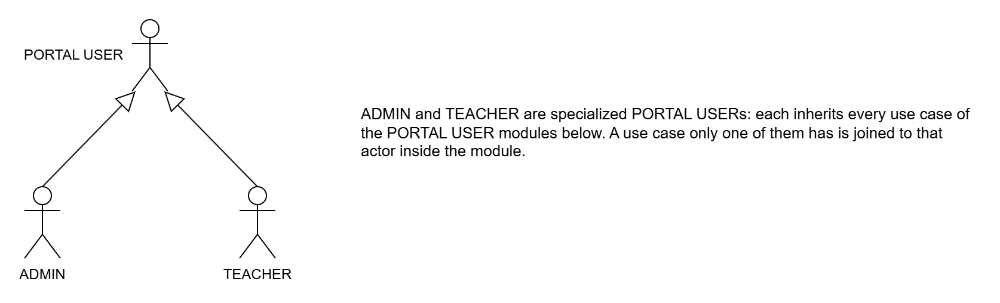

*Figure 3.1: Actor Generalization of Portal User*

PORTAL USER means anyone who logs in to the CAMS website. ADMIN and TEACHER are both portal users, so they share every use case in the PORTAL USER modules. The line with a hollow triangle points to PORTAL USER.

Two use cases belong to only one of them: ASSIGN CLASS TEACHER (Admin) and START LAB SESSION (Teacher).

## PROCESS LOG IN  ·  `AccountController`

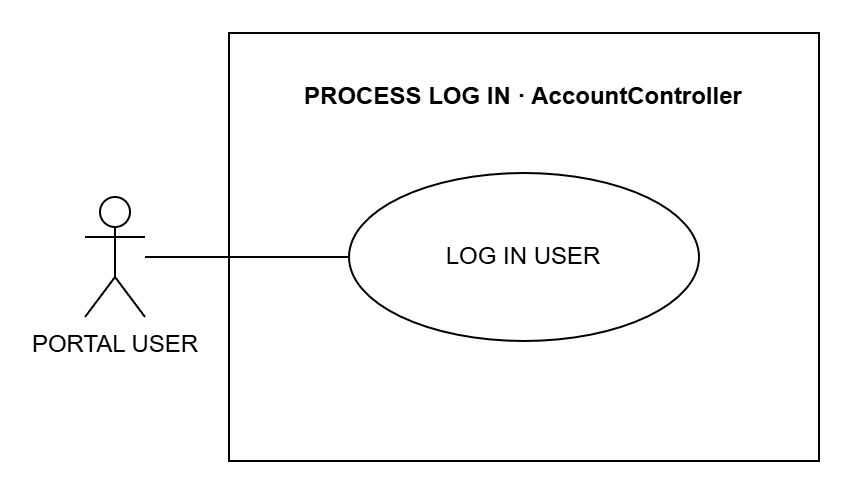

*Figure 3.2: System Use Case for process log in*

### P-001  ·  LOG IN USER

**Use Case Name:** LOG IN USER  
**Purpose:** Let the admin or teacher log in to the CAMS website.  
**Actors:** Portal User (Admin or Teacher)  
**Input Parameters:** Username and password  
**Output Parameters:** The dashboard for the user's role  
**Pre-Condition:** The user has an account in CAMS.  
**Post-Condition:** The user is logged in.

**Successful Scenario:**

1. The user opens the CAMS login page.
2. The user enters the username and password and clicks Sign in.
3. The system checks the username and password.
4. The system opens the Admin or Teacher dashboard.

**Exception Scenario:**

- If the username or password is wrong, the system shows an error.
- If the account is locked or turned off, the system does not let the user in.
- If a student tries to log in here, the system tells them to use the student app.

**Additional Remarks:** After too many wrong tries, the account is locked for a while.

## PROCESS SIGN OUT  ·  `AccountController`

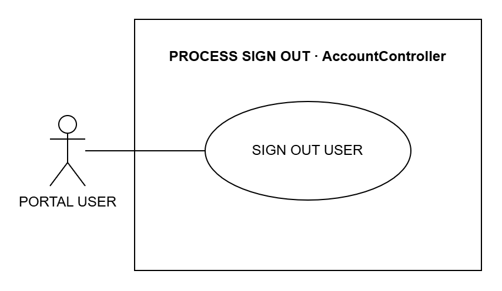

*Figure 3.3: System Use Case for process sign out*

### P-002  ·  SIGN OUT USER

**Use Case Name:** SIGN OUT USER  
**Purpose:** Let the user sign out of the CAMS website when they are done.  
**Actors:** Portal User (Admin or Teacher)  
**Input Parameters:** None  
**Output Parameters:** The login page  
**Pre-Condition:** The user is logged in.  
**Post-Condition:** The user is signed out.

**Successful Scenario:**

1. The user clicks Sign out.
2. The system ends the user's session.
3. The system shows the login page.

**Exception Scenario:**

- If the session has already ended, the system just shows the login page.

**Additional Remarks:** The next person using the browser must log in again.

## MANAGE OWN ACCOUNT  ·  `AdminController + TeacherController`

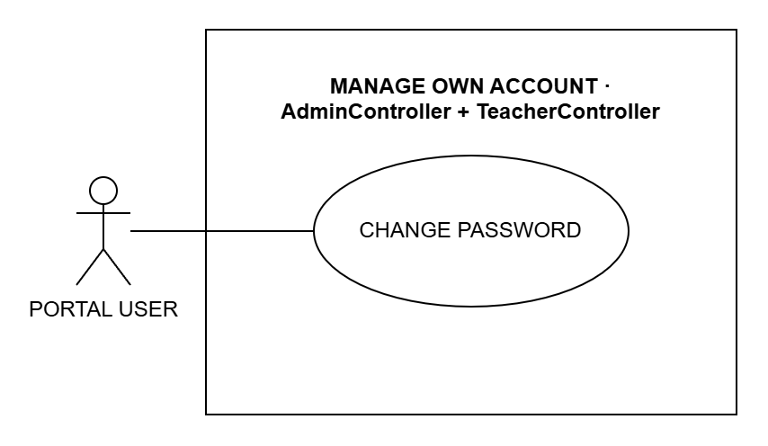

*Figure 3.4: System Use Case for manage own account*

### P-003  ·  CHANGE PASSWORD

**Use Case Name:** CHANGE PASSWORD  
**Purpose:** Let the user change their own password.  
**Actors:** Portal User (Admin or Teacher)  
**Input Parameters:** Current password, new password and the new password again  
**Output Parameters:** A message that the password was changed  
**Pre-Condition:** The user is logged in.  
**Post-Condition:** The user must use the new password next time.

**Successful Scenario:**

1. The user opens the Settings page.
2. The user enters the current password and the new password twice.
3. The user clicks Change password.
4. The system checks the passwords and saves the new one.

**Exception Scenario:**

- If the current password is wrong, the system shows an error.
- If the new password has fewer than 8 characters or the two do not match, the system asks again.

**Additional Remarks:** The password is stored in a protected form.

## MANAGE TEACHER ACCOUNT  ·  `AdminController`

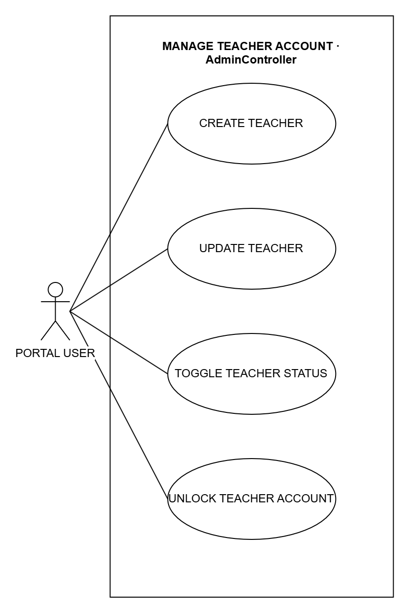

*Figure 3.5: System Use Case for manage teacher account*

### P-004  ·  CREATE TEACHER

**Use Case Name:** CREATE TEACHER  
**Purpose:** Add a new teacher account.  
**Actors:** Portal User (Admin or Teacher)  
**Input Parameters:** Name, email, contact number, username and password  
**Output Parameters:** The new teacher in the teacher list  
**Pre-Condition:** The user is logged in.  
**Post-Condition:** The new teacher can log in to CAMS.

**Successful Scenario:**

1. The user opens the Teachers page and clicks Add.
2. The user fills in the teacher details.
3. The user clicks Save.
4. The system checks the details and saves the teacher.

**Exception Scenario:**

- If the username or password is missing, the system shows an error.
- If the username is already used, the system does not save.

**Additional Remarks:** The change is saved in the audit trail.

### P-005  ·  UPDATE TEACHER

**Use Case Name:** UPDATE TEACHER  
**Purpose:** Change a teacher's details.  
**Actors:** Portal User (Admin or Teacher)  
**Input Parameters:** Name, email, contact number and username  
**Output Parameters:** The updated teacher details  
**Pre-Condition:** The user is logged in and the teacher exists.  
**Post-Condition:** The teacher's details are updated.

**Successful Scenario:**

1. The user opens the Teachers page and clicks Edit.
2. The user changes the teacher details.
3. The user clicks Save.
4. The system saves the changes.

**Exception Scenario:**

- If the username is already used, the system does not save.
- A teacher cannot edit their own account on this page.

**Additional Remarks:** The change is saved in the audit trail.

### P-006  ·  TOGGLE TEACHER STATUS

**Use Case Name:** TOGGLE TEACHER STATUS  
**Purpose:** Turn a teacher account on or off.  
**Actors:** Portal User (Admin or Teacher)  
**Input Parameters:** The teacher and the new status (active or inactive)  
**Output Parameters:** The teacher's new status  
**Pre-Condition:** The user is logged in and the teacher exists.  
**Post-Condition:** An inactive teacher cannot log in. The account is kept.

**Successful Scenario:**

1. The user opens the Teachers page.
2. The user clicks Deactivate or Activate on the teacher.
3. The user confirms.
4. The system saves the new status.

**Exception Scenario:**

- If the teacher still has active classes, the system does not allow it.
- A teacher cannot turn off their own account or the last active teacher.

**Additional Remarks:** Nothing is deleted, so the teacher's records are kept.

### P-007  ·  UNLOCK TEACHER ACCOUNT

**Use Case Name:** UNLOCK TEACHER ACCOUNT  
**Purpose:** Unlock a teacher account that was locked after too many wrong passwords.  
**Actors:** Portal User (Admin or Teacher)  
**Input Parameters:** The locked teacher account  
**Output Parameters:** A message that the account was unlocked  
**Pre-Condition:** The user is logged in and the teacher account is locked.  
**Post-Condition:** The teacher can log in again.

**Successful Scenario:**

1. The user opens the Teachers page.
2. The user clicks Unlock on the locked account.
3. The system removes the lock.

**Exception Scenario:**

- A teacher cannot unlock their own account.

**Additional Remarks:** Without this, the lock ends by itself after a while.

## MANAGE STUDENT ACCOUNT  ·  `AdminController + TeacherController`

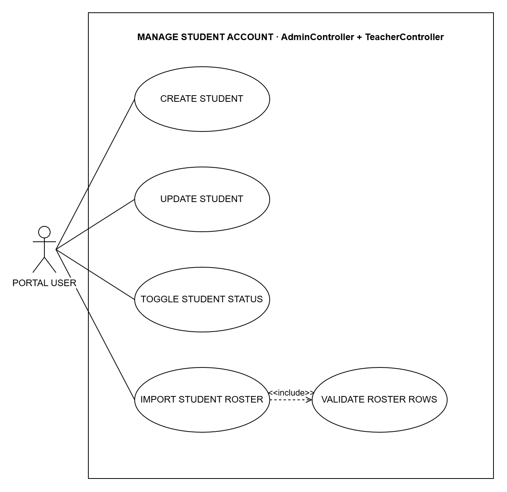

*Figure 3.6: System Use Case for manage student account*

### P-008  ·  CREATE STUDENT

**Use Case Name:** CREATE STUDENT  
**Purpose:** Add a new student account.  
**Actors:** Portal User (Admin or Teacher)  
**Input Parameters:** Student number, first name, last name, username and password  
**Output Parameters:** The new student in the student list  
**Pre-Condition:** The user is logged in.  
**Post-Condition:** The student can log in on a lab computer.

**Successful Scenario:**

1. The user opens the Students page and clicks Add.
2. The user fills in the student details.
3. The user clicks Save.
4. The system checks the details and saves the student.

**Exception Scenario:**

- If a required detail is missing, the system asks for it.
- If the student number or username is already used, the system does not save.

**Additional Remarks:** Teachers can also do this on the My Students page.

### P-009  ·  UPDATE STUDENT

**Use Case Name:** UPDATE STUDENT  
**Purpose:** Change a student's details.  
**Actors:** Portal User (Admin or Teacher)  
**Input Parameters:** Student number, name and username (the admin can also set the grade and section, class and adviser)  
**Output Parameters:** The updated student details  
**Pre-Condition:** The user is logged in and the student exists.  
**Post-Condition:** The student's details are updated.

**Successful Scenario:**

1. The user opens the Students page and clicks Edit.
2. The user changes the student details.
3. The user clicks Save.
4. The system saves the changes.

**Exception Scenario:**

- If the student number or username is already used, the system does not save.

**Additional Remarks:** The change is saved in the audit trail.

### P-010  ·  TOGGLE STUDENT STATUS

**Use Case Name:** TOGGLE STUDENT STATUS  
**Purpose:** Turn a student account on or off.  
**Actors:** Portal User (Admin or Teacher)  
**Input Parameters:** The student and the new status (active or inactive)  
**Output Parameters:** The student's new status  
**Pre-Condition:** The user is logged in and the student exists.  
**Post-Condition:** An inactive student cannot log in on a lab computer. The account is kept.

**Successful Scenario:**

1. The user opens the Students page.
2. The user clicks Deactivate or Activate on the student.
3. The user confirms.
4. The system saves the new status.

**Exception Scenario:**

- If the student no longer exists, nothing changes.

**Additional Remarks:** The Remove button only hides the student; the records are kept and can be restored.

### P-011  ·  IMPORT STUDENT ROSTER

**Use Case Name:** IMPORT STUDENT ROSTER  
**Purpose:** Add many students at once.  
**Actors:** Portal User (Admin or Teacher)  
**Input Parameters:** A list of students (names, usernames and passwords), typed in or uploaded as a CSV file  
**Output Parameters:** The new students in the student list or the class  
**Pre-Condition:** The user is logged in. A class that receives students must be active and have a teacher.  
**Post-Condition:** All the students are added, and put in the class if one was chosen.

**Successful Scenario:**

1. The user opens the Students page or a class page.
2. The user types the students or uploads a CSV file.
3. The user clicks Save.
4. The system checks every row (VALIDATE ROSTER ROWS).
5. The system adds the students.

**Exception Scenario:**

- If any row is wrong, no student is added and the system shows the errors.
- If the list is empty, the system asks for at least one student.

**Additional Remarks:** Always includes VALIDATE ROSTER ROWS.

### P-012  ·  VALIDATE ROSTER ROWS

**Use Case Name:** VALIDATE ROSTER ROWS  
**Purpose:** Check each student in the list before any account is made.  
**Actors:** Portal User (Admin or Teacher), through IMPORT STUDENT ROSTER  
**Input Parameters:** The rows of the student list  
**Output Parameters:** The rows that passed, or a list of errors  
**Pre-Condition:** IMPORT STUDENT ROSTER has received the list.  
**Post-Condition:** Only a fully correct list is saved.

**Successful Scenario:**

1. The system checks that each student has a first and last name.
2. The system checks that each password has at least 8 characters.
3. The system checks that no username is used twice.
4. The system gives the result back to IMPORT STUDENT ROSTER.

**Exception Scenario:**

- If a row fails, the whole list is stopped and the wrong rows are shown.

**Additional Remarks:** Included by IMPORT STUDENT ROSTER; it does not run by itself.

## MANAGE COMPUTER PROFILE  ·  `AdminController`

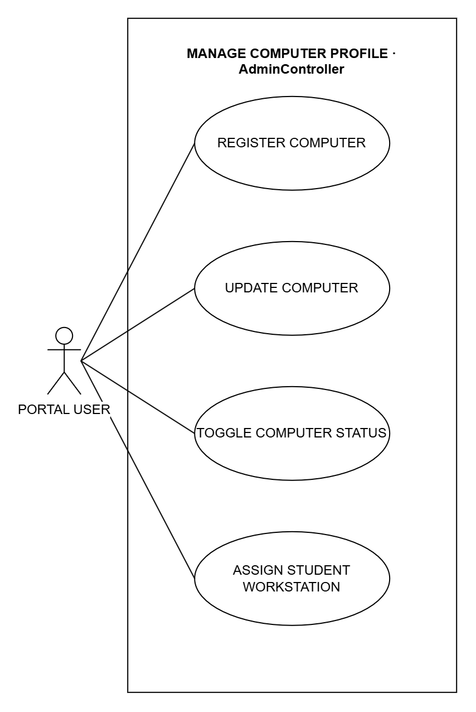

*Figure 3.7: System Use Case for manage computer profile*

### P-013  ·  REGISTER COMPUTER

**Use Case Name:** REGISTER COMPUTER  
**Purpose:** Add a lab computer to CAMS.  
**Actors:** Portal User (Admin or Teacher)  
**Input Parameters:** Station name, status and assigned student (both optional)  
**Output Parameters:** The new computer in the computer list  
**Pre-Condition:** The user is logged in.  
**Post-Condition:** The computer can be used and monitored in CAMS.

**Successful Scenario:**

1. The user opens the Computers page and clicks Add.
2. The user fills in the computer details.
3. The user clicks Save.
4. The system checks the details and saves the computer.

**Exception Scenario:**

- If the station name is missing or already used, the system does not save.

**Additional Remarks:** The change is saved in the audit trail.

### P-014  ·  UPDATE COMPUTER

**Use Case Name:** UPDATE COMPUTER  
**Purpose:** Change a computer's name or status, for example to "under maintenance".  
**Actors:** Portal User (Admin or Teacher)  
**Input Parameters:** Station name and status  
**Output Parameters:** The updated computer details  
**Pre-Condition:** The user is logged in and the computer exists.  
**Post-Condition:** The computer's details are updated.

**Successful Scenario:**

1. The user opens the Computers page and clicks Edit.
2. The user changes the computer details.
3. The user clicks Save.
4. The system saves the changes.

**Exception Scenario:**

- If the station name is already used, the system does not save.

**Additional Remarks:** Status changes are kept in the computer's history.

### P-015  ·  TOGGLE COMPUTER STATUS

**Use Case Name:** TOGGLE COMPUTER STATUS  
**Purpose:** Archive a computer that is no longer used, or bring it back.  
**Actors:** Portal User (Admin or Teacher)  
**Input Parameters:** The computer  
**Output Parameters:** The computer's new status  
**Pre-Condition:** The user is logged in and the computer exists.  
**Post-Condition:** An archived computer is hidden from the active list. Its history is kept.

**Successful Scenario:**

1. The user opens the Computers page.
2. The user clicks Archive on the computer.
3. The system archives the computer.
4. To bring it back, the user edits it and sets the status to Available.

**Exception Scenario:**

- If a lab session is running on the computer, the system does not archive it.

**Additional Remarks:** Nothing is deleted.

### P-016  ·  ASSIGN STUDENT WORKSTATION

**Use Case Name:** ASSIGN STUDENT WORKSTATION  
**Purpose:** Reserve a lab computer for a student.  
**Actors:** Portal User (Admin or Teacher)  
**Input Parameters:** The student and the computer (or none to clear it)  
**Output Parameters:** The student's reserved computer  
**Pre-Condition:** The user is logged in. The student and the computer exist.  
**Post-Condition:** The computer is reserved for the student.

**Successful Scenario:**

1. The user opens the Students page.
2. The user picks a computer for the student.
3. The user clicks Save.
4. The system saves the reservation.

**Exception Scenario:**

- If the computer is archived, already reserved or in use, the system does not save.

**Additional Remarks:** Choosing no computer clears the reservation.

## MANAGE CLASS  ·  `AdminController + TeacherController`

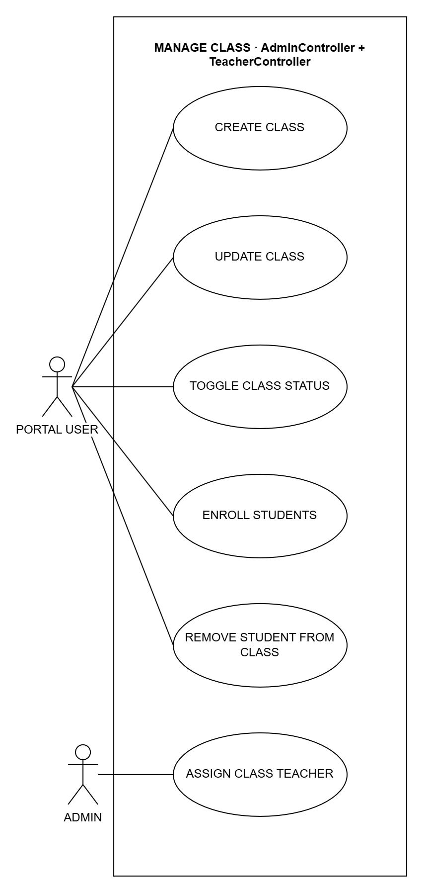

*Figure 3.8: System Use Case for manage class*

### P-017  ·  CREATE CLASS

**Use Case Name:** CREATE CLASS  
**Purpose:** Add a new class.  
**Actors:** Portal User (Admin or Teacher)  
**Input Parameters:** Class name, grade level, section, subject, schedule and school year (the admin can also pick the teacher)  
**Output Parameters:** The new class in the class list  
**Pre-Condition:** The user is logged in.  
**Post-Condition:** The class is ready for students.

**Successful Scenario:**

1. The user opens the Classes page and clicks Add.
2. The user fills in the class details.
3. The user clicks Save.
4. The system checks the details and saves the class.

**Exception Scenario:**

- If the class name is missing, the system asks for it.
- If the same class already exists for that school year, the system does not save.

**Additional Remarks:** A class made by a teacher belongs to that teacher.

### P-018  ·  UPDATE CLASS

**Use Case Name:** UPDATE CLASS  
**Purpose:** Change a class's details.  
**Actors:** Portal User (Admin or Teacher)  
**Input Parameters:** Class name, grade level, section, subject, schedule and school year  
**Output Parameters:** The updated class details  
**Pre-Condition:** The user is logged in and the class exists.  
**Post-Condition:** The class details are updated.

**Successful Scenario:**

1. The user opens the Classes page and clicks Edit.
2. The user changes the class details.
3. The user clicks Save.
4. The system saves the changes.

**Exception Scenario:**

- If the same class already exists for that school year, the system does not save.
- A teacher can only edit their own classes.

**Additional Remarks:** The change is saved in the audit trail.

### P-019  ·  TOGGLE CLASS STATUS

**Use Case Name:** TOGGLE CLASS STATUS  
**Purpose:** Archive a class at the end of the term, or restore it.  
**Actors:** Portal User (Admin or Teacher)  
**Input Parameters:** The class  
**Output Parameters:** The class's new status  
**Pre-Condition:** The user is logged in and the class exists.  
**Post-Condition:** An archived class is hidden from the active list. Its records are kept.

**Successful Scenario:**

1. The user opens the Classes page.
2. The user clicks Archive or Restore on the class.
3. The user confirms.
4. The system saves the new status.

**Exception Scenario:**

- A class can only be restored if it has an active teacher.

**Additional Remarks:** Nothing is deleted.

### P-020  ·  ENROLL STUDENTS

**Use Case Name:** ENROLL STUDENTS  
**Purpose:** Put students into a class.  
**Actors:** Portal User (Admin or Teacher)  
**Input Parameters:** The class and the students (or a new student's name)  
**Output Parameters:** The updated list of students in the class  
**Pre-Condition:** The user is logged in. The class is active and has a teacher.  
**Post-Condition:** The students are in the class.

**Successful Scenario:**

1. The user opens the class page.
2. The user picks one or more students, or types a new student.
3. The user clicks Enroll.
4. The system adds the students to the class.

**Exception Scenario:**

- If no student is picked, the system asks for one.
- If a student is already in another class, the system asks the user to confirm the move.

**Additional Remarks:** A teacher can only move students out of their own classes.

### P-021  ·  REMOVE STUDENT FROM CLASS

**Use Case Name:** REMOVE STUDENT FROM CLASS  
**Purpose:** Take students out of a class.  
**Actors:** Portal User (Admin or Teacher)  
**Input Parameters:** The class and the students  
**Output Parameters:** The updated list of students in the class  
**Pre-Condition:** The user is logged in and the students are in the class.  
**Post-Condition:** The students are no longer in the class. Their accounts are kept.

**Successful Scenario:**

1. The user opens the class page.
2. The user clicks Remove on a student, or selects several students.
3. The user confirms.
4. The system takes them out of the class.

**Exception Scenario:**

- If the class or student is not found, nothing changes.

**Additional Remarks:** Only the class list changes, not the student account.

### P-022  ·  ASSIGN CLASS TEACHER

**Use Case Name:** ASSIGN CLASS TEACHER  
**Purpose:** Choose the teacher in charge of a class.  
**Actors:** Admin  
**Input Parameters:** The class and the teacher  
**Output Parameters:** The class with its new teacher  
**Pre-Condition:** The admin is logged in and the class exists.  
**Post-Condition:** The teacher is in charge of the class.

**Successful Scenario:**

1. The admin opens the class page.
2. The admin picks a teacher.
3. The admin clicks Save.
4. The system saves the teacher for the class.

**Exception Scenario:**

- If the teacher is inactive, the system does not save.

**Additional Remarks:** Only the admin can do this.

## MANAGE RESTRICTION RULE  ·  `AdminController + TeacherController`

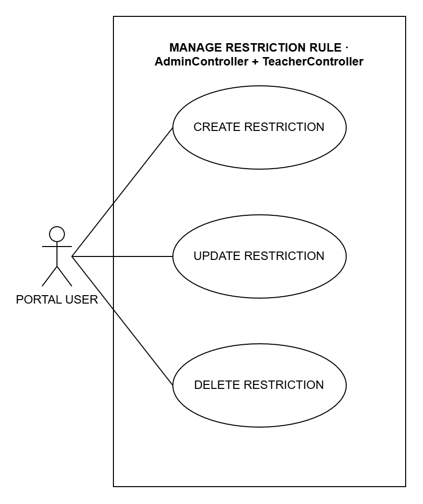

*Figure 3.9: System Use Case for manage restriction rule*

### P-023  ·  CREATE RESTRICTION

**Use Case Name:** CREATE RESTRICTION  
**Purpose:** Add a rule that blocks or allows a website during lab sessions.  
**Actors:** Portal User (Admin or Teacher)  
**Input Parameters:** Rule type, target (website or app), block or allow, and description  
**Output Parameters:** The new rule in the rule list  
**Pre-Condition:** The user is logged in.  
**Post-Condition:** Student computers follow the new rule.

**Successful Scenario:**

1. The user opens the Restriction Rules page and clicks Add.
2. The user fills in the rule details.
3. The user clicks Save.
4. The system checks the details and saves the rule.

**Exception Scenario:**

- If the type, mode or target is missing, the system does not save.

**Additional Remarks:** Websites are blocked; apps are only watched, never closed.

### P-024  ·  UPDATE RESTRICTION

**Use Case Name:** UPDATE RESTRICTION  
**Purpose:** Change a rule, or turn it on or off.  
**Actors:** Portal User (Admin or Teacher)  
**Input Parameters:** Rule type, target, block or allow, description and active  
**Output Parameters:** The updated rule  
**Pre-Condition:** The user is logged in and the rule exists.  
**Post-Condition:** Student computers follow the changed rule.

**Successful Scenario:**

1. The user opens the Restriction Rules page and clicks Edit.
2. The user changes the rule details.
3. The user clicks Save.
4. The system saves the changes.

**Exception Scenario:**

- If the details are wrong, the system does not save.

**Additional Remarks:** A rule that is turned off is ignored.

### P-025  ·  DELETE RESTRICTION

**Use Case Name:** DELETE RESTRICTION  
**Purpose:** Delete a rule so it is no longer used.  
**Actors:** Portal User (Admin or Teacher)  
**Input Parameters:** The rule  
**Output Parameters:** The rule list without the deleted rule  
**Pre-Condition:** The user is logged in and the rule exists.  
**Post-Condition:** The rule is deleted and no longer applied.

**Successful Scenario:**

1. The user opens the Restriction Rules page.
2. The user clicks Delete on the rule.
3. The user confirms.
4. The system deletes the rule.

**Exception Scenario:**

- If the rule is already gone, nothing changes.
- A teacher can only delete their own rules.

**Additional Remarks:** This cannot be undone.

## MANAGE BLACKLIST AND WHITELIST  ·  `AdminController`

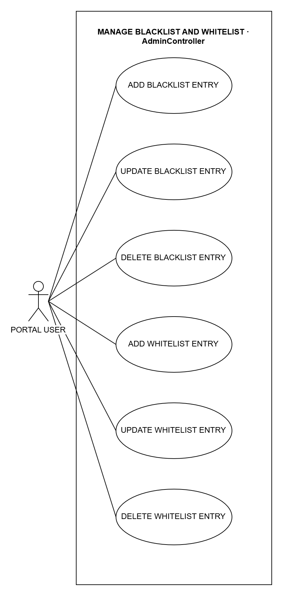

*Figure 3.10: System Use Case for manage blacklist and whitelist*

### P-026  ·  ADD BLACKLIST ENTRY

**Use Case Name:** ADD BLACKLIST ENTRY  
**Purpose:** Block a website or app for all students.  
**Actors:** Portal User (Admin or Teacher)  
**Input Parameters:** Type (website, domain, app or process), value and reason  
**Output Parameters:** The new entry in the blacklist  
**Pre-Condition:** The user is logged in.  
**Post-Condition:** Student computers block the website.

**Successful Scenario:**

1. The user opens the Blacklist page and clicks Add.
2. The user fills in the entry details.
3. The user clicks Save.
4. The system checks the details and saves the entry.

**Exception Scenario:**

- If the type or value is missing, the system does not save.

**Additional Remarks:** Apps on the blacklist are only watched, not closed.

### P-027  ·  UPDATE BLACKLIST ENTRY

**Use Case Name:** UPDATE BLACKLIST ENTRY  
**Purpose:** Change a blacklist entry, or turn it on or off.  
**Actors:** Portal User (Admin or Teacher)  
**Input Parameters:** Type, value, reason and active  
**Output Parameters:** The updated entry  
**Pre-Condition:** The user is logged in and the entry exists.  
**Post-Condition:** Student computers follow the change.

**Successful Scenario:**

1. The user opens the Blacklist page and clicks Edit.
2. The user changes the entry details.
3. The user clicks Save.
4. The system saves the changes.

**Exception Scenario:**

- If the details are wrong, the system does not save.

**Additional Remarks:** An entry that is turned off is ignored.

### P-028  ·  DELETE BLACKLIST ENTRY

**Use Case Name:** DELETE BLACKLIST ENTRY  
**Purpose:** Remove a website or app from the blacklist.  
**Actors:** Portal User (Admin or Teacher)  
**Input Parameters:** The entry  
**Output Parameters:** The blacklist without the entry  
**Pre-Condition:** The user is logged in and the entry exists.  
**Post-Condition:** Student computers stop blocking it.

**Successful Scenario:**

1. The user opens the Blacklist page.
2. The user clicks Delete on the entry.
3. The user confirms.
4. The system deletes the entry.

**Exception Scenario:**

- If the entry is already gone, nothing changes.

**Additional Remarks:** This cannot be undone.

### P-029  ·  ADD WHITELIST ENTRY

**Use Case Name:** ADD WHITELIST ENTRY  
**Purpose:** Add a website to the whitelist.  
**Actors:** Portal User (Admin or Teacher)  
**Input Parameters:** Website and description  
**Output Parameters:** The new entry in the whitelist  
**Pre-Condition:** The user is logged in.  
**Post-Condition:** While the whitelist is used, students can open only the websites on it.

**Successful Scenario:**

1. The user opens the Whitelist page and clicks Add.
2. The user fills in the entry details.
3. The user clicks Save.
4. The system checks the details and saves the entry.

**Exception Scenario:**

- If the website is missing, the system does not save.

**Additional Remarks:** Blacklisted websites stay blocked even if they are on the whitelist.

### P-030  ·  UPDATE WHITELIST ENTRY

**Use Case Name:** UPDATE WHITELIST ENTRY  
**Purpose:** Change a whitelist entry, or turn it on or off.  
**Actors:** Portal User (Admin or Teacher)  
**Input Parameters:** Website, description and active  
**Output Parameters:** The updated entry  
**Pre-Condition:** The user is logged in and the entry exists.  
**Post-Condition:** Student computers follow the change.

**Successful Scenario:**

1. The user opens the Whitelist page and clicks Edit.
2. The user changes the entry details.
3. The user clicks Save.
4. The system saves the changes.

**Exception Scenario:**

- If the details are wrong, the system does not save.

**Additional Remarks:** An entry that is turned off is ignored.

### P-031  ·  DELETE WHITELIST ENTRY

**Use Case Name:** DELETE WHITELIST ENTRY  
**Purpose:** Remove a website from the whitelist.  
**Actors:** Portal User (Admin or Teacher)  
**Input Parameters:** The entry  
**Output Parameters:** The whitelist without the entry  
**Pre-Condition:** The user is logged in and the entry exists.  
**Post-Condition:** The website is no longer on the whitelist.

**Successful Scenario:**

1. The user opens the Whitelist page.
2. The user clicks Delete on the entry.
3. The user confirms.
4. The system deletes the entry.

**Exception Scenario:**

- If the entry is already gone, nothing changes.

**Additional Remarks:** This affects every student computer and cannot be undone.

## MANAGE CATEGORY  ·  `AdminController`

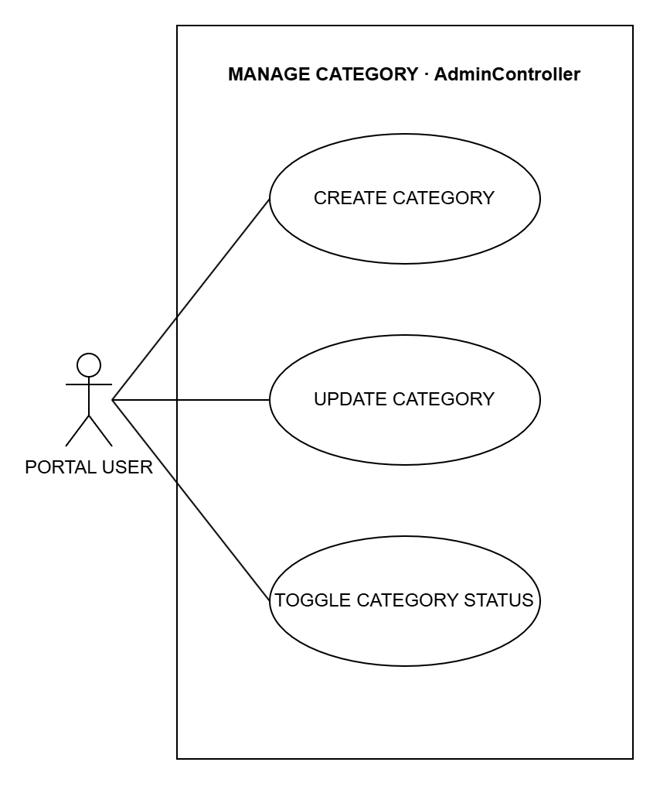

*Figure 3.11: System Use Case for manage category*

### P-032  ·  CREATE CATEGORY

**Use Case Name:** CREATE CATEGORY  
**Purpose:** Group apps or websites so one rule covers them all, for example all games.  
**Actors:** Portal User (Admin or Teacher)  
**Input Parameters:** Name, pattern (app name or website address), block or allow, and description  
**Output Parameters:** The new category  
**Pre-Condition:** The user is logged in.  
**Post-Condition:** Matching apps or websites follow the category.

**Successful Scenario:**

1. The user opens the Restriction Rules page and clicks Add Category.
2. The user fills in the category details.
3. The user clicks Save.
4. The system checks the details and saves the category.

**Exception Scenario:**

- If the name or pattern is missing, the system does not save.

**Additional Remarks:** There are app categories and website categories.

### P-033  ·  UPDATE CATEGORY

**Use Case Name:** UPDATE CATEGORY  
**Purpose:** Change a category.  
**Actors:** Portal User (Admin or Teacher)  
**Input Parameters:** Name, pattern, block or allow, and description  
**Output Parameters:** The updated category  
**Pre-Condition:** The user is logged in and the category exists.  
**Post-Condition:** Matching apps or websites follow the change.

**Successful Scenario:**

1. The user opens the Restriction Rules page and clicks Edit.
2. The user changes the category details.
3. The user clicks Save.
4. The system saves the changes.

**Exception Scenario:**

- If the name or pattern is missing, the system does not save.

**Additional Remarks:** The change is saved in the audit trail.

### P-034  ·  TOGGLE CATEGORY STATUS

**Use Case Name:** TOGGLE CATEGORY STATUS  
**Purpose:** Turn a category on or off.  
**Actors:** Portal User (Admin or Teacher)  
**Input Parameters:** The category and the new status  
**Output Parameters:** The category's new status  
**Pre-Condition:** The user is logged in and the category exists.  
**Post-Condition:** A category that is off is ignored. It is kept.

**Successful Scenario:**

1. The user opens the Restriction Rules page and clicks Edit on the category.
2. The user turns Active on or off.
3. The user clicks Save.
4. The system saves the new status.

**Exception Scenario:**

- If the category is gone, nothing changes.

**Additional Remarks:** Nothing is deleted.

## MANAGE SESSION RULE  ·  `AdminController`

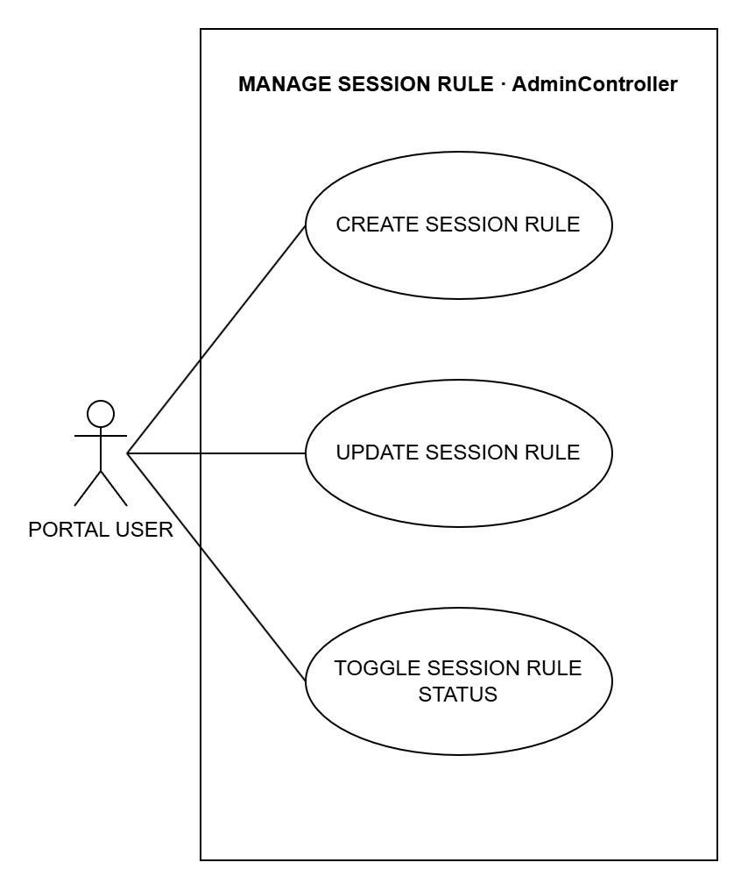

*Figure 3.12: System Use Case for manage session rule*

### P-035  ·  CREATE SESSION RULE

**Use Case Name:** CREATE SESSION RULE  
**Purpose:** Set how a lab session works: time limit, pausing and remote control.  
**Actors:** Portal User (Admin or Teacher)  
**Input Parameters:** Name, time limit, allow pause, allow remote control and default  
**Output Parameters:** The new session rule  
**Pre-Condition:** The user is logged in.  
**Post-Condition:** The rule can be used for lab sessions.

**Successful Scenario:**

1. The user opens the Session Rules page and clicks Add.
2. The user fills in the session rule details.
3. The user clicks Save.
4. The system checks the details and saves the session rule.

**Exception Scenario:**

- If the name is missing, the system does not save.

**Additional Remarks:** A new default rule replaces the old default.

### P-036  ·  UPDATE SESSION RULE

**Use Case Name:** UPDATE SESSION RULE  
**Purpose:** Change a session rule.  
**Actors:** Portal User (Admin or Teacher)  
**Input Parameters:** Name, time limit, allow pause, allow remote control and default  
**Output Parameters:** The updated session rule  
**Pre-Condition:** The user is logged in and the rule exists.  
**Post-Condition:** New lab sessions follow the changed rule.

**Successful Scenario:**

1. The user opens the Session Rules page and clicks Edit.
2. The user changes the session rule details.
3. The user clicks Save.
4. The system saves the changes.

**Exception Scenario:**

- If the rule is gone, nothing changes.

**Additional Remarks:** The change is saved in the audit trail.

### P-037  ·  TOGGLE SESSION RULE STATUS

**Use Case Name:** TOGGLE SESSION RULE STATUS  
**Purpose:** Turn a session rule on or off.  
**Actors:** Portal User (Admin or Teacher)  
**Input Parameters:** The session rule  
**Output Parameters:** The rule's new status  
**Pre-Condition:** The user is logged in and the rule exists.  
**Post-Condition:** A rule that is off cannot be used for new sessions. It is kept.

**Successful Scenario:**

1. The user opens the Session Rules page.
2. The user clicks Deactivate (or edits it and turns Active on) on the rule.
3. The user confirms.
4. The system saves the new status.

**Exception Scenario:**

- If the rule is gone, nothing changes.

**Additional Remarks:** Old sessions keep their rule.

## CONTROL LABORATORY SESSION  ·  `AdminController + TeacherController`

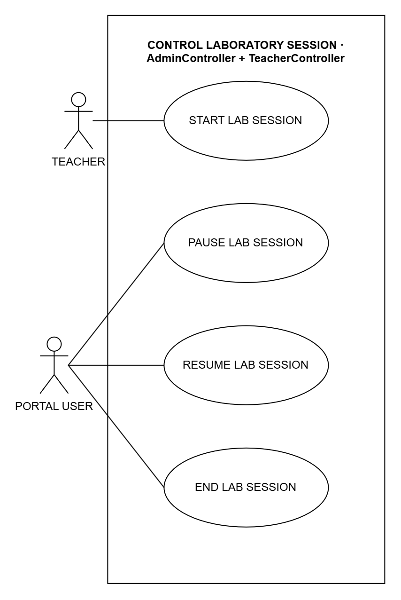

*Figure 3.13: System Use Case for control laboratory session*

### P-038  ·  START LAB SESSION

**Use Case Name:** START LAB SESSION  
**Purpose:** Open the lab so students can start working.  
**Actors:** Teacher  
**Input Parameters:** Session rule (optional)  
**Output Parameters:** A message that the lab session started  
**Pre-Condition:** The teacher is logged in.  
**Post-Condition:** Students can log in on any lab computer and join the session.

**Successful Scenario:**

1. The teacher opens the Sessions page.
2. The teacher clicks Start lab session.
3. The teacher picks a session rule or keeps the default.
4. The system starts the lab session.

**Exception Scenario:**

- If the chosen rule is turned off, the system does not start the session.

**Additional Remarks:** Only the teacher can start a lab session.

### P-039  ·  PAUSE LAB SESSION

**Use Case Name:** PAUSE LAB SESSION  
**Purpose:** Pause all student sessions at once.  
**Actors:** Portal User (Admin or Teacher)  
**Input Parameters:** None  
**Output Parameters:** The number of paused sessions  
**Pre-Condition:** The user is logged in and a lab session is running.  
**Post-Condition:** All student computers show a pause screen and the timer stops.

**Successful Scenario:**

1. The user clicks Pause (the admin on the dashboard, the teacher on the Sessions page).
2. The system pauses all running sessions.
3. The system shows the pause screen on all student computers.

**Exception Scenario:**

- If no session is running, nothing changes.

**Additional Remarks:** Paused time is not counted.

### P-040  ·  RESUME LAB SESSION

**Use Case Name:** RESUME LAB SESSION  
**Purpose:** Continue all paused sessions.  
**Actors:** Portal User (Admin or Teacher)  
**Input Parameters:** None  
**Output Parameters:** The number of resumed sessions  
**Pre-Condition:** The user is logged in and a lab session is paused.  
**Post-Condition:** Students can use their computers again.

**Successful Scenario:**

1. The user clicks Resume.
2. The system resumes all paused sessions.
3. The system removes the pause screen from the student computers.

**Exception Scenario:**

- If no session is paused, nothing changes.

**Additional Remarks:** The timer continues from where it stopped.

### P-041  ·  END LAB SESSION

**Use Case Name:** END LAB SESSION  
**Purpose:** End all student sessions at the end of the class.  
**Actors:** Portal User (Admin or Teacher)  
**Input Parameters:** None  
**Output Parameters:** The number of ended sessions  
**Pre-Condition:** The user is logged in and a lab session is open.  
**Post-Condition:** All sessions are ended and the student computers restart.

**Successful Scenario:**

1. The user clicks End.
2. The user confirms.
3. The system ends all sessions and saves the end time.
4. The system tells the student computers to restart.

**Exception Scenario:**

- If no session is open, nothing changes.

**Additional Remarks:** The session records are kept.

# ADMIN

## MANAGE ADMIN ACCOUNT  ·  `AdminController`

*Figure 3.14: System Use Case for manage admin account*

### A-042  ·  CREATE ADMIN

**Use Case Name:** CREATE ADMIN  
**Purpose:** Add another admin account.  
**Actors:** Admin  
**Input Parameters:** Full name, username and password  
**Output Parameters:** The new admin in the admin list  
**Pre-Condition:** The admin is logged in.  
**Post-Condition:** The new admin can log in.

**Successful Scenario:**

1. The admin opens the Admin Accounts page and clicks Add.
2. The admin fills in the admin details.
3. The admin clicks Save.
4. The system checks the details and saves the admin.

**Exception Scenario:**

- If the username or password is missing, or the username is already used, the system does not save.

**Additional Remarks:** The change is saved in the audit trail.

### A-043  ·  UPDATE ADMIN

**Use Case Name:** UPDATE ADMIN  
**Purpose:** Change an admin's name or username.  
**Actors:** Admin  
**Input Parameters:** Full name and username  
**Output Parameters:** The updated admin details  
**Pre-Condition:** The admin is logged in and the account exists.  
**Post-Condition:** The admin's details are updated.

**Successful Scenario:**

1. The admin opens the Admin Accounts page and clicks Edit.
2. The admin changes the admin details.
3. The admin clicks Save.
4. The system saves the changes.

**Exception Scenario:**

- If the username is already used, the system does not save.

**Additional Remarks:** The change is saved in the audit trail.

### A-044  ·  TOGGLE ADMIN STATUS

**Use Case Name:** TOGGLE ADMIN STATUS  
**Purpose:** Turn an admin account on or off.  
**Actors:** Admin  
**Input Parameters:** The admin and the new status (active or inactive)  
**Output Parameters:** The admin's new status  
**Pre-Condition:** The admin is logged in and the account exists.  
**Post-Condition:** An inactive admin cannot log in. The account is kept.

**Successful Scenario:**

1. The admin opens the Admin Accounts page.
2. The admin clicks Deactivate or Activate on the admin.
3. The admin confirms.
4. The system saves the new status.

**Exception Scenario:**

- The last active admin cannot be turned off.

**Additional Remarks:** Nothing is deleted.

## EXPORT REPORTS AND LOGS  ·  `AdminController`

*Figure 3.15: System Use Case for export reports and logs*

### A-045  ·  VIEW REPORTS

**Use Case Name:** VIEW REPORTS  
**Purpose:** See reports on lab use: sessions, attendance, app use and remote commands.  
**Actors:** Admin  
**Input Parameters:** Date range, and class or computer (optional)  
**Output Parameters:** The Reports page  
**Pre-Condition:** The admin is logged in.  
**Post-Condition:** Nothing is changed.

**Successful Scenario:**

1. The admin opens the Reports page.
2. The admin sets the filters (optional).
3. The system shows the reports.

**Exception Scenario:**

- If nothing matches, the list is empty.

**Additional Remarks:** Can be extended by EXPORT REPORTS CSV.

### A-046  ·  VIEW AUDIT LOGS

**Use Case Name:** VIEW AUDIT LOGS  
**Purpose:** See who changed what in CAMS and when.  
**Actors:** Admin  
**Input Parameters:** None  
**Output Parameters:** The Audit Trail page  
**Pre-Condition:** The admin is logged in.  
**Post-Condition:** Nothing is changed.

**Successful Scenario:**

1. The admin opens the Audit Trail page.
2. The system shows the latest 500 records.

**Exception Scenario:**

- If nothing matches, the list is empty.

**Additional Remarks:** Can be extended by EXPORT AUDIT CSV.

### A-047  ·  VIEW SYSTEM LOGS

**Use Case Name:** VIEW SYSTEM LOGS  
**Purpose:** See the system's error and warning messages.  
**Actors:** Admin  
**Input Parameters:** None  
**Output Parameters:** The System Logs page  
**Pre-Condition:** The admin is logged in.  
**Post-Condition:** Nothing is changed.

**Successful Scenario:**

1. The admin opens the System Logs page.
2. The system shows the latest 500 messages.

**Exception Scenario:**

- If nothing matches, the list is empty.

**Additional Remarks:** Can be extended by EXPORT SYSTEM LOGS CSV.

### A-048  ·  EXPORT REPORTS CSV

**Use Case Name:** EXPORT REPORTS CSV  
**Purpose:** Download the reports as CSV files.  
**Actors:** Admin  
**Input Parameters:** The filters on the page  
**Output Parameters:** A CSV file of sessions, attendance, app use or remote commands  
**Pre-Condition:** The admin is on the Reports page.  
**Post-Condition:** The file is downloaded. Nothing is changed.

**Successful Scenario:**

1. The admin clicks Session CSV, Attendance CSV, Usage CSV or the remote commands export on the Reports page.
2. The system makes the CSV file.
3. The browser downloads the file.

**Exception Scenario:**

- If nothing matches, the file has only the column names.

**Additional Remarks:** Extends VIEW REPORTS (optional).

### A-049  ·  EXPORT AUDIT CSV

**Use Case Name:** EXPORT AUDIT CSV  
**Purpose:** Download the audit trail as a CSV file.  
**Actors:** Admin  
**Input Parameters:** None  
**Output Parameters:** A CSV file of the audit trail  
**Pre-Condition:** The admin is on the Audit Trail page.  
**Post-Condition:** The file is downloaded. Nothing is changed.

**Successful Scenario:**

1. The admin clicks Export Audit CSV on the Audit Trail page.
2. The system makes the CSV file.
3. The browser downloads the file.

**Exception Scenario:**

- If nothing matches, the file has only the column names.

**Additional Remarks:** Extends VIEW AUDIT LOGS (optional).

### A-050  ·  EXPORT SYSTEM LOGS CSV

**Use Case Name:** EXPORT SYSTEM LOGS CSV  
**Purpose:** Download the system logs as a CSV file.  
**Actors:** Admin  
**Input Parameters:** None  
**Output Parameters:** A CSV file of the system logs  
**Pre-Condition:** The admin is on the System Logs page.  
**Post-Condition:** The file is downloaded. Nothing is changed.

**Successful Scenario:**

1. The admin clicks Export CSV on the System Logs page.
2. The system makes the CSV file.
3. The browser downloads the file.

**Exception Scenario:**

- If nothing matches, the file has only the column names.

**Additional Remarks:** Extends VIEW SYSTEM LOGS (optional).

## MANAGE DATABASE  ·  `AdminDatabaseController`

*Figure 3.16: System Use Case for manage database*

### A-051  ·  CREATE BACKUP

**Use Case Name:** CREATE BACKUP  
**Purpose:** Make a copy of the CAMS database.  
**Actors:** Admin  
**Input Parameters:** Label (optional)  
**Output Parameters:** The new backup in the backup list  
**Pre-Condition:** The admin is logged in.  
**Post-Condition:** A checked copy of the database is saved.

**Successful Scenario:**

1. The admin opens the Database page.
2. The admin types a label (optional) and clicks Create backup.
3. The system copies the database.
4. The system checks the copy and shows it in the list.

**Exception Scenario:**

- If the backup fails, the system shows an error and the database is not changed.

**Additional Remarks:** The backup can be restored later.

### A-052  ·  VALIDATE BACKUP

**Use Case Name:** VALIDATE BACKUP  
**Purpose:** Check that a backup is not damaged.  
**Actors:** Admin  
**Input Parameters:** The backup file  
**Output Parameters:** A message saying whether the backup passed  
**Pre-Condition:** The admin is logged in and the backup is in the list.  
**Post-Condition:** The admin knows whether the backup is safe to use.

**Successful Scenario:**

1. The admin opens the Database page.
2. The admin clicks Validate on a backup.
3. The system checks the file and shows the result.

**Exception Scenario:**

- If the backup is damaged, the system says it failed.

**Additional Remarks:** Also included by STAGE DATABASE RESTORE.

### A-053  ·  STAGE DATABASE RESTORE

**Use Case Name:** STAGE DATABASE RESTORE  
**Purpose:** Set a backup to replace the current database when the server restarts.  
**Actors:** Admin  
**Input Parameters:** The backup file, and the word RESTORE to confirm  
**Output Parameters:** A message to restart the server  
**Pre-Condition:** The admin is logged in and the backup is in the list.  
**Post-Condition:** The backup is used after the server restarts. A safety copy is made first.

**Successful Scenario:**

1. The admin clicks Restore on a backup.
2. The admin types RESTORE to confirm.
3. The system checks the backup (VALIDATE BACKUP).
4. The system makes a safety copy and prepares the restore.

**Exception Scenario:**

- If RESTORE is not typed, or the backup is damaged, nothing is changed.

**Additional Remarks:** Always includes VALIDATE BACKUP.

## MANAGE DEPLOYMENT  ·  `AdminDeploymentController`

*Figure 3.17: System Use Case for manage deployment*

### A-054  ·  DOWNLOAD DEPLOYMENT FILES

**Use Case Name:** DOWNLOAD DEPLOYMENT FILES  
**Purpose:** Download the files needed to install CAMS on a lab computer.  
**Actors:** Admin  
**Input Parameters:** The file to download (installer, manifest or certificate)  
**Output Parameters:** The downloaded file  
**Pre-Condition:** The admin is logged in.  
**Post-Condition:** The admin has the file.

**Successful Scenario:**

1. The admin opens the Deployment page.
2. The admin clicks the installer, the manifest or the certificate.
3. The system sends the file.

**Exception Scenario:**

- If the file is missing or damaged, the download fails.

**Additional Remarks:** The certificate lets lab computers connect to the server safely.

### A-055  ·  BUILD WORKSTATION BUNDLE

**Use Case Name:** BUILD WORKSTATION BUNDLE  
**Purpose:** Make one zip file for installing CAMS on a lab computer.  
**Actors:** Admin  
**Input Parameters:** The server address  
**Output Parameters:** A zip file  
**Pre-Condition:** The admin is logged in.  
**Post-Condition:** The admin has the setup file.

**Successful Scenario:**

1. The admin opens the Deployment page.
2. The admin enters the server address and clicks Build.
3. The system makes the zip file.
4. The browser downloads it.

**Exception Scenario:**

- If the address is wrong, the system shows an error.

**Additional Remarks:** The zip has the installer, the certificate and an install script.

# TEACHER

## CONTROL STUDENT SESSION  ·  `TeacherController`

*Figure 3.18: System Use Case for control student session*

### T-056  ·  PAUSE OR RESUME STUDENT SESSION

**Use Case Name:** PAUSE OR RESUME STUDENT SESSION  
**Purpose:** Pause or continue one student's session.  
**Actors:** Teacher  
**Input Parameters:** The student's session  
**Output Parameters:** The session's new status  
**Pre-Condition:** The teacher is logged in and the session is running or paused.  
**Post-Condition:** The session is paused or running again.

**Successful Scenario:**

1. The teacher opens the Sessions page.
2. The teacher clicks Pause or Resume on the student's session.
3. The system changes the session.

**Exception Scenario:**

- If the session rule does not allow pausing, the system does not pause.

**Additional Remarks:** Paused time is not counted.

### T-057  ·  END STUDENT SESSION

**Use Case Name:** END STUDENT SESSION  
**Purpose:** End one student's session.  
**Actors:** Teacher  
**Input Parameters:** The student's session  
**Output Parameters:** The ended session  
**Pre-Condition:** The teacher is logged in and the session is open.  
**Post-Condition:** The session ends and the student's computer restarts.

**Successful Scenario:**

1. The teacher opens the Sessions page.
2. The teacher clicks End on the student's session.
3. The teacher confirms.
4. The system ends the session and saves the end time.

**Exception Scenario:**

- If the session has already ended, nothing changes.

**Additional Remarks:** The session record is kept.

## MONITOR STUDENT SCREEN  ·  `TeacherController + Hub`

*Figure 3.19: System Use Case for monitor student screen*

### T-058  ·  OPEN MONITORING WALL

**Use Case Name:** OPEN MONITORING WALL  
**Purpose:** Watch all student screens live on one page.  
**Actors:** Teacher  
**Input Parameters:** None  
**Output Parameters:** The Live Monitoring page with every student's screen  
**Pre-Condition:** The teacher is logged in.  
**Post-Condition:** Nothing is changed.

**Successful Scenario:**

1. The teacher opens the Live Monitoring page.
2. The student computers send their screens (STREAM STUDENT SCREEN).
3. The system shows each screen on the page.

**Exception Scenario:**

- If no student is logged in, the page is empty.

**Additional Remarks:** Always includes STREAM STUDENT SCREEN.

### T-059  ·  STREAM STUDENT SCREEN

**Use Case Name:** STREAM STUDENT SCREEN  
**Purpose:** Send a student's screen to the teacher's monitoring page.  
**Actors:** Teacher, through OPEN MONITORING WALL; the student's computer (secondary actor)  
**Input Parameters:** A picture of the student's screen  
**Output Parameters:** The live screen on the monitoring page  
**Pre-Condition:** A student is logged in and the monitoring page is open.  
**Post-Condition:** The teacher sees the latest screen. Nothing is saved.

**Successful Scenario:**

1. The student app takes a picture of the screen.
2. The app sends the picture to the system.
3. The system shows it on the teacher's page.

**Exception Scenario:**

- If the picture is empty or too large, the system skips it.

**Additional Remarks:** Included by OPEN MONITORING WALL.

## CONTROL STUDENT WORKSTATION  ·  `RemoteMonitoringHub`

*Figure 3.20: System Use Case for control student workstation*

### T-060  ·  START REMOTE CONTROL

**Use Case Name:** START REMOTE CONTROL  
**Purpose:** Control a student's computer to help the student.  
**Actors:** Teacher; the student's computer (secondary actor)  
**Input Parameters:** The student's computer  
**Output Parameters:** A message that remote control started  
**Pre-Condition:** The student is in a lab session that allows remote control.  
**Post-Condition:** The teacher controls the mouse and keyboard, and the student sees a notice.

**Successful Scenario:**

1. The teacher opens the student's screen and clicks Start Remote Support.
2. The system checks the session rule.
3. The system starts remote control.
4. The teacher's mouse and keyboard now work on the student's computer (SEND REMOTE INPUT).

**Exception Scenario:**

- If the session rule does not allow it, or the session has ended, the system refuses.

**Additional Remarks:** Always includes SEND REMOTE INPUT.

### T-061  ·  STOP REMOTE CONTROL

**Use Case Name:** STOP REMOTE CONTROL  
**Purpose:** Give control back to the student.  
**Actors:** Teacher; the student's computer (secondary actor)  
**Input Parameters:** The student's computer  
**Output Parameters:** A message that remote control stopped  
**Pre-Condition:** The teacher is controlling the computer.  
**Post-Condition:** The student has control again.

**Successful Scenario:**

1. The teacher clicks Stop Remote Support.
2. The system ends remote control.
3. The notice on the student's screen goes away.

**Exception Scenario:**

- If remote control was not on, nothing changes.

**Additional Remarks:** The command is saved in the remote history.

### T-062  ·  LOCK WORKSTATION

**Use Case Name:** LOCK WORKSTATION  
**Purpose:** Lock a student's computer, or all the computers on the page.  
**Actors:** Teacher; the student's computer (secondary actor)  
**Input Parameters:** One computer, or all the computers shown  
**Output Parameters:** The command result on the monitoring page  
**Pre-Condition:** The students are logged in.  
**Post-Condition:** The locked computers show a lock screen.

**Successful Scenario:**

1. The teacher clicks Lock on one computer, or Lock visible for all of them.
2. The system sends the lock command.
3. The computers show the lock screen.

**Exception Scenario:**

- If the computer is not connected, the command is not sent.
- More than 100 computers at once is not allowed.

**Additional Remarks:** The command is saved in the remote history.

### T-063  ·  UNLOCK WORKSTATION

**Use Case Name:** UNLOCK WORKSTATION  
**Purpose:** Unlock a student's computer.  
**Actors:** Teacher; the student's computer (secondary actor)  
**Input Parameters:** The student's computer  
**Output Parameters:** The command result on the monitoring page  
**Pre-Condition:** The computer is locked.  
**Post-Condition:** The student can use the computer again.

**Successful Scenario:**

1. The teacher opens the student's screen and clicks Unlock.
2. The system sends the command to the student's computer.
3. The student's computer does the command.

**Exception Scenario:**

- If the computer is not connected, the command is not sent.

**Additional Remarks:** The command is saved in the remote history.

### T-064  ·  FORCE STUDENT LOGOUT

**Use Case Name:** FORCE STUDENT LOGOUT  
**Purpose:** Log a student out, or all the students on the page.  
**Actors:** Teacher; the student's computer (secondary actor)  
**Input Parameters:** One computer, or all the computers shown  
**Output Parameters:** The command result on the monitoring page  
**Pre-Condition:** The students are logged in.  
**Post-Condition:** The students are logged out and their sessions end.

**Successful Scenario:**

1. The teacher clicks Log out on one computer, or Log out visible for all of them, and confirms.
2. The system ends the students' sessions.
3. The computers go back to the login screen.

**Exception Scenario:**

- If the computer is not connected, the command is not sent.
- More than 100 computers at once is not allowed.

**Additional Remarks:** The command is saved in the remote history.

### T-065  ·  RESTART WORKSTATION

**Use Case Name:** RESTART WORKSTATION  
**Purpose:** Restart a student's computer.  
**Actors:** Teacher; the student's computer (secondary actor)  
**Input Parameters:** The student's computer  
**Output Parameters:** The command result on the monitoring page  
**Pre-Condition:** The computer is connected.  
**Post-Condition:** The computer restarts after 10 seconds.

**Successful Scenario:**

1. The teacher opens the student's screen and clicks Restart.
2. The teacher confirms.
3. The system sends the command to the student's computer.
4. The student's computer does the command.

**Exception Scenario:**

- If the computer is not connected, the command is not sent.

**Additional Remarks:** Unsaved work on the computer is lost.

### T-066  ·  SHUT DOWN WORKSTATION

**Use Case Name:** SHUT DOWN WORKSTATION  
**Purpose:** Turn off a student's computer.  
**Actors:** Teacher; the student's computer (secondary actor)  
**Input Parameters:** The student's computer  
**Output Parameters:** The command result on the monitoring page  
**Pre-Condition:** The computer is connected.  
**Post-Condition:** The computer turns off after 15 seconds.

**Successful Scenario:**

1. The teacher opens the student's screen and clicks Shutdown.
2. The teacher confirms.
3. The system sends the command to the student's computer.
4. The student's computer does the command.

**Exception Scenario:**

- If the computer is not connected, the command is not sent.

**Additional Remarks:** Unsaved work on the computer is lost.

### T-067  ·  SEND REMOTE INPUT

**Use Case Name:** SEND REMOTE INPUT  
**Purpose:** Send the teacher's mouse and keyboard actions to the student's computer.  
**Actors:** Teacher, through START REMOTE CONTROL; the student's computer (secondary actor)  
**Input Parameters:** A mouse click or key press  
**Output Parameters:** The action done on the student's computer  
**Pre-Condition:** Remote control is on.  
**Post-Condition:** The student's computer does the action.

**Successful Scenario:**

1. The teacher clicks or types on the student's screen.
2. The system sends it to the student's computer.
3. The computer does the action.

**Exception Scenario:**

- If remote control is off, the system refuses.

**Additional Remarks:** Included by START REMOTE CONTROL.

## SEND MESSAGE TO STUDENT  ·  `RemoteMonitoringHub`

*Figure 3.21: System Use Case for send message to student*

### T-068  ·  SEND WARNING POPUP

**Use Case Name:** SEND WARNING POPUP  
**Purpose:** Show a warning message on a student's screen, or on all screens.  
**Actors:** Teacher; the student's computer (secondary actor)  
**Input Parameters:** Title and message, and one student or all  
**Output Parameters:** A warning on the student's screen  
**Pre-Condition:** The student is logged in.  
**Post-Condition:** The student sees the warning until they close it.

**Successful Scenario:**

1. The teacher clicks Send Warning on one student, or Warn all.
2. The teacher types the title and message.
3. The system shows the warning on the student computers.

**Exception Scenario:**

- If the title or message is empty or too long, the system does not send it.

**Additional Remarks:** The warning is also saved in the student's notifications.

### T-069  ·  BROADCAST TEACHER SCREEN

**Use Case Name:** BROADCAST TEACHER SCREEN  
**Purpose:** Show the teacher's screen on all student computers.  
**Actors:** Teacher; the student's computer (secondary actor)  
**Input Parameters:** The teacher's screen  
**Output Parameters:** The teacher's screen on every student computer  
**Pre-Condition:** Students are logged in.  
**Post-Condition:** Students see the teacher's screen until it is stopped.

**Successful Scenario:**

1. The teacher clicks Broadcast screen and picks the screen to share.
2. The system shows it on all student computers.
3. The teacher clicks Stop Broadcast to end it.

**Exception Scenario:**

- If a screen picture is too large, it is not sent.

**Additional Remarks:** Useful for showing a lesson to the whole class.

## MANAGE MONITORING ALERT  ·  `TeacherController`

*Figure 3.22: System Use Case for manage monitoring alert*

### T-070  ·  UPDATE ALERT STATUS

**Use Case Name:** UPDATE ALERT STATUS  
**Purpose:** Mark alerts as seen, dismissed or open again.  
**Actors:** Teacher  
**Input Parameters:** The alerts and the new status (with a reason when dismissing)  
**Output Parameters:** The alerts with their new status  
**Pre-Condition:** The teacher is logged in.  
**Post-Condition:** The open alert count is updated.

**Successful Scenario:**

1. The teacher opens the Alerts page.
2. The teacher selects the alerts.
3. The teacher clicks Acknowledge, Dismiss or Reopen.
4. The system saves the new status.

**Exception Scenario:**

- If no alert is selected, nothing changes.

**Additional Remarks:** The system saves who changed the alert and when.

### T-071  ·  VIEW ALERTS

**Use Case Name:** VIEW ALERTS  
**Purpose:** See the alerts for the teacher's students, like blocked websites.  
**Actors:** Teacher  
**Input Parameters:** Date, student and status (optional)  
**Output Parameters:** The Alerts page  
**Pre-Condition:** The teacher is logged in.  
**Post-Condition:** Nothing is changed.

**Successful Scenario:**

1. The teacher opens the Alerts page.
2. The teacher sets the filters (optional).
3. The system shows the alerts.

**Exception Scenario:**

- If nothing matches, the list is empty.

**Additional Remarks:** Can be extended by EXPORT ALERTS CSV.

### T-072  ·  EXPORT ALERTS CSV

**Use Case Name:** EXPORT ALERTS CSV  
**Purpose:** Download the alerts as a CSV file.  
**Actors:** Teacher  
**Input Parameters:** The filters on the page  
**Output Parameters:** A CSV file of the alerts  
**Pre-Condition:** The teacher is on the Alerts page.  
**Post-Condition:** The file is downloaded. Nothing is changed.

**Successful Scenario:**

1. The teacher clicks Export CSV on the Alerts page.
2. The system makes the CSV file.
3. The browser downloads the file.

**Exception Scenario:**

- If nothing matches, the file has only the column names.

**Additional Remarks:** Extends VIEW ALERTS (optional).

## EXPORT TEACHER RECORDS  ·  `TeacherController`

*Figure 3.23: System Use Case for export teacher records*

### T-073  ·  VIEW REMOTE HISTORY

**Use Case Name:** VIEW REMOTE HISTORY  
**Purpose:** See the remote commands sent to student computers.  
**Actors:** Teacher  
**Input Parameters:** Date, command and student (optional)  
**Output Parameters:** The Remote History page  
**Pre-Condition:** The teacher is logged in.  
**Post-Condition:** Nothing is changed.

**Successful Scenario:**

1. The teacher opens the Remote History page.
2. The teacher sets the filters (optional).
3. The system shows the commands.

**Exception Scenario:**

- If nothing matches, the list is empty.

**Additional Remarks:** Can be extended by EXPORT REMOTE HISTORY CSV.

### T-074  ·  VIEW BROWSER HISTORY

**Use Case Name:** VIEW BROWSER HISTORY  
**Purpose:** See the websites students opened during lab sessions.  
**Actors:** Teacher  
**Input Parameters:** Date and browser (optional)  
**Output Parameters:** The Browser History page  
**Pre-Condition:** The teacher is logged in.  
**Post-Condition:** Nothing is changed.

**Successful Scenario:**

1. The teacher opens the Browser History page.
2. The teacher sets the filters (optional).
3. The system shows the websites.

**Exception Scenario:**

- If nothing matches, the list is empty.

**Additional Remarks:** Can be extended by EXPORT BROWSER MONITORING CSV.

### T-075  ·  VIEW STUDENT DETAILS

**Use Case Name:** VIEW STUDENT DETAILS  
**Purpose:** See one student's sessions and activity.  
**Actors:** Teacher  
**Input Parameters:** The student and a date range  
**Output Parameters:** The student details page  
**Pre-Condition:** The teacher is logged in.  
**Post-Condition:** Nothing is changed.

**Successful Scenario:**

1. The teacher opens the student details page.
2. The teacher sets the filters (optional).
3. The system shows the student's sessions and activity.

**Exception Scenario:**

- If nothing matches, the list is empty.

**Additional Remarks:** Can be extended by EXPORT STUDENT ANALYTICS CSV.

### T-076  ·  EXPORT REMOTE HISTORY CSV

**Use Case Name:** EXPORT REMOTE HISTORY CSV  
**Purpose:** Download the remote history as a CSV file.  
**Actors:** Teacher  
**Input Parameters:** The filters on the page  
**Output Parameters:** A CSV file of the remote commands  
**Pre-Condition:** The teacher is on the Remote History page.  
**Post-Condition:** The file is downloaded. Nothing is changed.

**Successful Scenario:**

1. The teacher clicks CSV on the Remote History page.
2. The system makes the CSV file.
3. The browser downloads the file.

**Exception Scenario:**

- If nothing matches, the file has only the column names.

**Additional Remarks:** Extends VIEW REMOTE HISTORY (optional).

### T-077  ·  EXPORT BROWSER MONITORING CSV

**Use Case Name:** EXPORT BROWSER MONITORING CSV  
**Purpose:** Download the browser history as a CSV file.  
**Actors:** Teacher  
**Input Parameters:** The filters on the page  
**Output Parameters:** A CSV file of the websites opened  
**Pre-Condition:** The teacher is on the Browser History page.  
**Post-Condition:** The file is downloaded. Nothing is changed.

**Successful Scenario:**

1. The teacher clicks Export CSV on the Browser History page.
2. The system makes the CSV file.
3. The browser downloads the file.

**Exception Scenario:**

- If nothing matches, the file has only the column names.

**Additional Remarks:** Extends VIEW BROWSER HISTORY (optional).

### T-078  ·  EXPORT STUDENT ANALYTICS CSV

**Use Case Name:** EXPORT STUDENT ANALYTICS CSV  
**Purpose:** Download one student's activity as a CSV file.  
**Actors:** Teacher  
**Input Parameters:** The student and the date range on the page  
**Output Parameters:** A CSV file of the student's sessions and activity  
**Pre-Condition:** The teacher is on the student details page.  
**Post-Condition:** The file is downloaded. Nothing is changed.

**Successful Scenario:**

1. The teacher clicks Export CSV on the student details page.
2. The system makes the CSV file.
3. The browser downloads the file.

**Exception Scenario:**

- If nothing matches, the file has only the column names.

**Additional Remarks:** Extends VIEW STUDENT DETAILS (optional).

# STUDENT

## LOG IN AT WORKSTATION  ·  `ClientAuthController + MainForm`

*Figure 3.24: System Use Case for log in at workstation*

### S-079  ·  LOG IN TO WORKSTATION

**Use Case Name:** LOG IN TO WORKSTATION  
**Purpose:** Let the student log in on a lab computer to start a session.  
**Actors:** Student  
**Input Parameters:** Username and password  
**Output Parameters:** The session screen in the student app  
**Pre-Condition:** The teacher has started the lab session and the student app is installed.  
**Post-Condition:** The student is in the lab session and the screen is monitored.

**Successful Scenario:**

1. The student opens the CAMS student app.
2. The app finds the server (FIND LAB SERVER).
3. The student enters the username and password and clicks Sign in.
4. The system checks the account and starts the session.

**Exception Scenario:**

- If no lab session is running, the student is told to wait for the teacher.
- If the username or password is wrong, the system shows an error.
- If the server cannot be found, the student can type the address (SET SERVER ADDRESS).

**Additional Remarks:** Always includes FIND LAB SERVER.

### S-080  ·  FIND LAB SERVER

**Use Case Name:** FIND LAB SERVER  
**Purpose:** Find the CAMS server on the school network.  
**Actors:** Student, through LOG IN TO WORKSTATION; the CAMS server (secondary actor)  
**Input Parameters:** None  
**Output Parameters:** The server address  
**Pre-Condition:** The student is logging in.  
**Post-Condition:** The app knows where the server is.

**Successful Scenario:**

1. The app uses the saved server address.
2. If there is none, the app listens for the server on the network.
3. The app uses the first server it finds.

**Exception Scenario:**

- If no server is found, the student can type the address.

**Additional Remarks:** Included by LOG IN TO WORKSTATION.

### S-081  ·  SET SERVER ADDRESS

**Use Case Name:** SET SERVER ADDRESS  
**Purpose:** Type the server address when the app cannot find the server.  
**Actors:** Student (with the teacher's help)  
**Input Parameters:** The server address  
**Output Parameters:** The saved address  
**Pre-Condition:** The app could not find the server.  
**Post-Condition:** The app uses this address from now on.

**Successful Scenario:**

1. The student opens Server address.
2. The student types the address given by the teacher.
3. The student clicks Save and retry.
4. The app saves the address and tries to log in again.

**Exception Scenario:**

- If the address is not valid, the app shows an error.

**Additional Remarks:** Extends LOG IN TO WORKSTATION (optional).

## LOG OUT AT WORKSTATION  ·  `ClientAuthController + MainForm`

*Figure 3.25: System Use Case for log out at workstation*

### S-082  ·  LOG OUT OF WORKSTATION

**Use Case Name:** LOG OUT OF WORKSTATION  
**Purpose:** Let the student log out and free the computer.  
**Actors:** Student  
**Input Parameters:** None  
**Output Parameters:** The login screen  
**Pre-Condition:** The student is logged in.  
**Post-Condition:** The session ends and the computer is free.

**Successful Scenario:**

1. The student clicks Sign out.
2. The system ends the session.
3. The app shows the login screen.

**Exception Scenario:**

- If the server cannot be reached, the teacher can end the session instead.

**Additional Remarks:** Also included by EXIT CLIENT AGENT.

### S-083  ·  EXIT CLIENT AGENT

**Use Case Name:** EXIT CLIENT AGENT  
**Purpose:** Close the student app.  
**Actors:** Student  
**Input Parameters:** None  
**Output Parameters:** The app closes  
**Pre-Condition:** The student is logged in.  
**Post-Condition:** The student is logged out and the app is closed.

**Successful Scenario:**

1. The student right-clicks the CAMS icon and clicks Exit.
2. The app logs the student out (LOG OUT OF WORKSTATION).
3. The app closes.

**Exception Scenario:**

- If logging out fails, the app still closes.

**Additional Remarks:** Always includes LOG OUT OF WORKSTATION.

## MANAGE OWN ACCOUNT  ·  `ClientAuthController`

*Figure 3.26: System Use Case for manage own account*

### S-084  ·  CHANGE PASSWORD

**Use Case Name:** CHANGE PASSWORD  
**Purpose:** Let the student change their own password in the app.  
**Actors:** Student  
**Input Parameters:** Current password and new password  
**Output Parameters:** A message that the password was changed  
**Pre-Condition:** The student is logged in.  
**Post-Condition:** The student must use the new password next time.

**Successful Scenario:**

1. The student clicks Change password.
2. The student enters the current password and the new password twice.
3. The system checks the passwords and saves the new one.

**Exception Scenario:**

- If the current password is wrong, the system shows an error.
- If the new password has fewer than 8 characters or is the same as the old one, the system asks again.
- After too many tries, the student must wait a minute.

**Additional Remarks:** Students can change their password only in the app.
