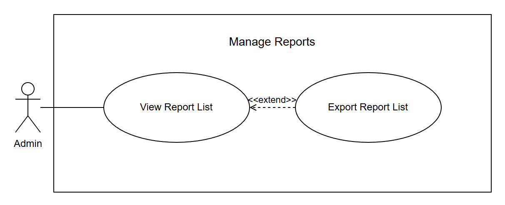
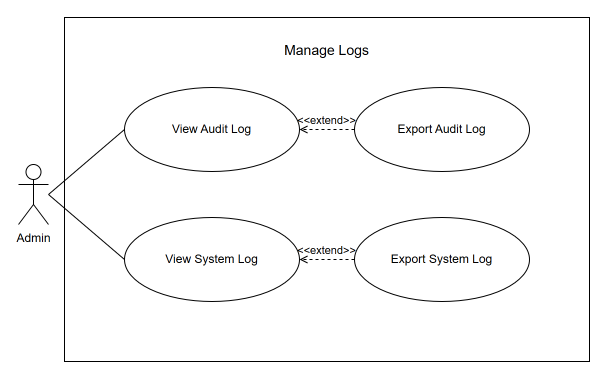
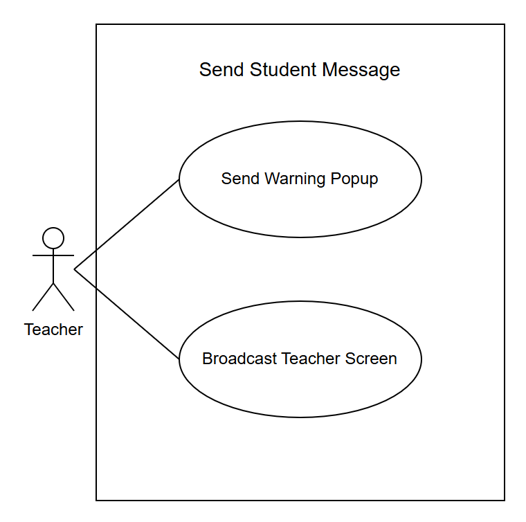
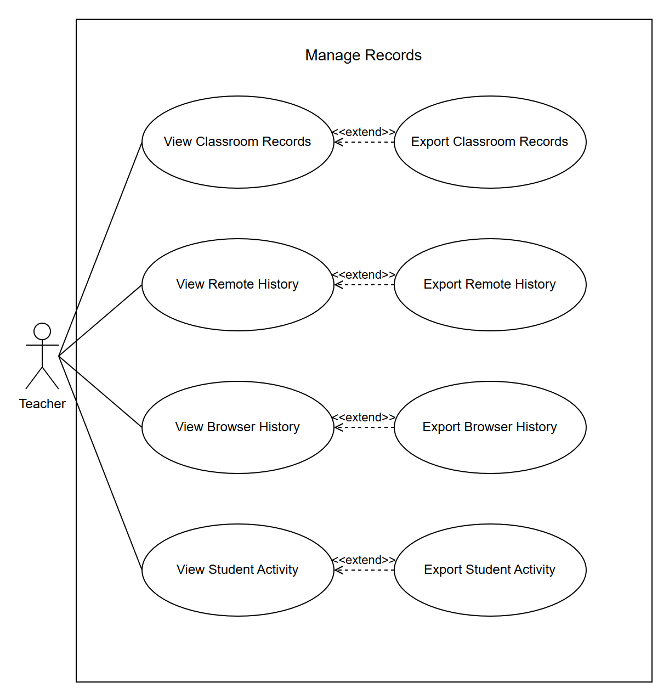

# CAMS Written Use Cases

The system use cases in [`CAMS-Use-Case-Diagram.drawio`](CAMS-Use-Case-Diagram.drawio): **26 system use cases** holding 91 use cases, with **48 written use cases**, one for every base use case.

- Each system use case is shown first as a diagram, and its written use cases follow: one for every base use case, which is a use case an actor starts. A written use case has ten parts: use case name, purpose, actors, input parameters, output parameters, pre-condition, post-condition, successful scenario, exception scenario and additional remarks.
- The admin and the teacher share many use cases, so these are shown only once, under **ADMIN / TEACHER**, with one actor named Admin / Teacher.
- A page with a list is shown as a View use case. Editing, deleting or exporting on that list extends it, so it is written inside the View use case. Creating a new record is a base use case of its own.
- DELETE is used only for restriction rules, the blacklist, the whitelist and the categories, because these are really deleted. Other records are not deleted, so their records are kept.
- «include» means a use case always does the other use case. «extend» means the other use case is optional.

| Actor | System use cases | Use cases in the diagrams | Written use cases |
| --- | ---: | ---: | ---: |
| Admin / Teacher (shared) | 12 | 47 | 25 |
| Admin only | 5 | 16 | 9 |
| Teacher only | 6 | 22 | 10 |
| Student | 3 | 6 | 4 |

---

## Contents

**ADMIN / TEACHER**  
- Process Log In — Log In User
- Manage Own Account — View Account Settings
- Manage Teacher Account — Create Teacher, View Teacher List
- Manage Student Account — Create Student, Import Student Roster, View Student List
- Manage Computer Profile — Register Computer, View Computer List
- Manage Class — Create Class, View Class List, View Class Student
- Manage Restriction Rule — Create Restriction, View Restriction Rule
- Manage Blacklist — Add Blacklist Entry, View Blacklist Entry
- Manage Whitelist — Add Whitelist Entry, View Whitelist Entry
- Manage Category — Create Category, View Category List
- Manage Session Rule — Create Session Rule, View Session Rule
- Control Laboratory Session — Pause Lab Session, Resume Lab Session, End Lab Session

**ADMIN**  
- Manage Admin Account — Create Admin, View Admin List
- Manage Reports — View Report List
- Manage Logs — View Audit Log, View System Log
- Manage Database — Create Backup, View Backup List
- Manage Deployment — Download Deployment Files, Build Workstation Bundle

**TEACHER**  
- Control Student Session — View Session List
- Monitor Student Screen — Open Monitoring Wall
- Control Student Workstation — View Student Live Frame
- Send Student Message — Send Warning Popup, Broadcast Teacher Screen
- Manage Monitoring Alert — View Alert List
- Manage Records — View Classroom Records, View Remote History, View Browser History, View Student Activity

**STUDENT**  
- Log In at Workstation — Log In Workstation
- Log Out at Workstation — Log Out Workstation, Exit Client Agent
- Change Password at Workstation — Change Password

---

# ADMIN / TEACHER

The admin and the teacher can both do the use cases in these system use cases, so each diagram shows one actor named Admin / Teacher.

A use case only one of them has is in that actor's own section: Start Lab Session is under TEACHER (Control Student Session).

## Process Log In

*Figure 3.3: System Use Case for Process Log In*

**Written Use Case:** Process Log In  
**Use Case Name:** Log In User  
**Purpose:** To allow the Admin and Teacher to log in to CAMS using their username and password.  
**Actors:** Admin, Teacher

**Input Parameters:**

- Username
- Password

**Output Parameters:**

- Dashboard (Admin) or My Classroom (Teacher)
- Login error message

**Pre-Condition:**

- The user must have an active account in the system.

**Post-Condition:**

- The Admin is directed to the Dashboard, and the Teacher to My Classroom.

**Successful Scenario:**

1. The user navigates to the login page.
2. The user enters their username and password.
3. The user clicks the “Log in” button.
4. The system validates the entered username and password.
5. The system checks the role of the account.
6. The user is logged in and the system displays the Dashboard for an Admin, or My Classroom for a Teacher.

**Exception Scenario:**

- If the user enters an incorrect username or password:
    - The system displays an error message.
    - The user is allowed to enter their username and password again.
- If the user enters a wrong password 5 times:
    - The system locks the account for 15 minutes.
    - After 15 minutes, the user is allowed to log in again.
- If the account is inactive:
    - The system does not allow the user to log in.
- If a student tries to log in on the website:
    - The system tells the student to use the CAMS student app on the lab computer.

**Additional Remarks:**

- Both the Admin and the Teacher can use this function.
- Students log in only on the CAMS student app, not on the website.

## Manage Own Account

*Figure 3.4: System Use Case for Manage Own Account*

**Written Use Case:** Manage Own Account  
**Use Case Name:** View Account Settings  
**Purpose:** To allow the Admin and Teacher to view their own account, and to edit their details or change their password.  
**Actors:** Admin, Teacher

**Input Parameters:**

- Name
- Username
- Email and contact number (Teacher only)
- Current password
- New password
- Confirm new password

**Output Parameters:**

- Account Settings page
- Success or error message

**Pre-Condition:**

- The user must be logged in to the system.

**Post-Condition:**

- The user's own account details are displayed in the system.
- If the user edits the details or changes the password, the change is saved.

**Successful Scenario:**

1. The user clicks their name at the top of the page.
2. The system displays the Account Settings page with the user's own details.
3. To edit the details, the user changes them and clicks the “Save Changes” button.
4. To change the password, the user enters the current password, enters the new password two times and clicks the “Change Password” button.
5. The system validates the entries and saves the change.
6. The system displays a success message.

**Exception Scenario:**

- If the name or username is empty, or the username is already used:
    - The system displays an error message.
    - The details are not saved.
- If the current password is incorrect:
    - The system displays an error message.
    - The password is not changed.
- If the new password has fewer than 8 characters, or the two new passwords do not match:
    - The system displays an error message.
    - The user is asked to enter the new password again.

**Additional Remarks:**

- Both the Admin and the Teacher can use this function.
- Editing the details and changing the password are optional.
- The page can also be opened from “Account Settings” in the menu.

## Manage Teacher Account

*Figure 3.5: System Use Case for Manage Teacher Account*

**Written Use Case:** Manage Teacher Account  
**Use Case Name:** Create Teacher  
**Purpose:** To allow the Admin and Teacher to add a teacher account in CAMS.  
**Actors:** Admin, Teacher

**Input Parameters:**

- Name
- Email
- Contact number
- Username
- Password

**Output Parameters:**

- Updated teacher list
- Success or error message

**Pre-Condition:**

- The user must be logged in to the system.

**Post-Condition:**

- A new teacher account is added to the system.
- The change is saved in the audit trail.

**Successful Scenario:**

1. The user navigates to the Teachers page.
2. The user clicks the “Add Teacher” button.
3. The user enters the teacher information.
4. The user clicks the “Save Account” button.
5. The system validates the information and saves the teacher account.
6. The system displays the updated teacher list.

**Exception Scenario:**

- If the username or password is missing, or the username is already used:
    - The system displays an error message.
    - The teacher account is not saved.

**Additional Remarks:**

- Both the Admin and the Teacher can use this function.
- The new teacher can log in to CAMS with the username and password.

**Written Use Case:** Manage Teacher Account  
**Use Case Name:** View Teacher List  
**Purpose:** To allow the Admin and Teacher to view the teacher accounts in CAMS, and to edit an account or change its status on the list.  
**Actors:** Admin, Teacher

**Input Parameters:**

- Selected teacher account
- Updated teacher information

**Output Parameters:**

- Teacher list
- Success or error message

**Pre-Condition:**

- The user must be logged in to the system.

**Post-Condition:**

- The teacher list is displayed in the system.
- If the user edits a teacher or changes the status, the change is saved.

**Successful Scenario:**

1. The user navigates to the Teachers page.
2. The system displays the list of teacher accounts.
3. To edit a teacher, the user clicks Edit on the teacher.
4. The user updates the teacher information and clicks the “Save Changes” button.
5. To change the status of a teacher, the user clicks Deactivate or Activate on the teacher and confirms.
6. The system saves the change and displays the updated teacher list.

**Exception Scenario:**

- If the username is already used:
    - The system displays an error message.
    - The changes are not saved.
- If the teacher still has an active class:
    - The system does not deactivate the account.
- If a teacher tries to edit or deactivate their own account on this page:
    - The system does not allow the action.

**Additional Remarks:**

- Both the Admin and the Teacher can use this function.
- Editing a teacher and changing the status are optional.
- An inactive teacher cannot log in. The records of the teacher are kept.

## Manage Student Account

*Figure 3.6: System Use Case for Manage Student Account*

**Written Use Case:** Manage Student Account  
**Use Case Name:** Create Student  
**Purpose:** To allow the Admin and Teacher to add a student account in CAMS.  
**Actors:** Admin, Teacher

**Input Parameters:**

- First name
- Last name
- Student ID or LRN
- Username
- Password
- Class (optional)

**Output Parameters:**

- Updated student list
- Success or error message

**Pre-Condition:**

- The user must be logged in to the system.

**Post-Condition:**

- A new student account is added to the system.
- The new student can log in on a lab computer.

**Successful Scenario:**

1. The user navigates to the Students page.
2. The user clicks the “Add Student” button.
3. The user enters the student information.
4. The user clicks the “Add Student” button on the form.
5. The system validates the information and saves the student account.
6. The system displays the updated student list.

**Exception Scenario:**

- If a required detail is missing, or the student ID or username is already used:
    - The system displays an error message.
    - The student account is not saved.

**Additional Remarks:**

- Both the Admin and the Teacher can use this function.
- The password must have at least 8 characters.

**Written Use Case:** Manage Student Account  
**Use Case Name:** Import Student Roster  
**Purpose:** To allow the Admin and Teacher to add many student accounts at once from a CSV file.  
**Actors:** Admin, Teacher

**Input Parameters:**

- Selected class
- CSV file of the students (student number, first name, last name, full name, username and password)

**Output Parameters:**

- Updated list of students in the class
- CSV file of the wrong rows, if the import fails
- Success or error message

**Pre-Condition:**

- The user must be logged in to the system.
- The class that receives the students must be active and have a teacher.

**Post-Condition:**

- All the students in the CSV file are added to the system and enrolled in the class.
- The new students can log in on a lab computer.

**Successful Scenario:**

1. The user navigates to the Classes page.
2. The user clicks “View Class” on a class.
3. The user clicks the “Import” button.
4. The user selects the CSV file of the students.
5. The user clicks the “Preview CSV” button.
6. The system checks every row of the file.
7. The system adds the students to the class and displays the updated list of students.

**Exception Scenario:**

- If any row is wrong (no name, a password shorter than 8 characters, or a student number or username used twice):
    - No student is added.
    - The system gives a CSV file that lists the wrong rows.
- If the class is not active or has no teacher:
    - The system does not add the students.

**Additional Remarks:**

- Both the Admin and the Teacher can use this function.
- Many students can also be typed in rows with “Bulk Import” on the Students page.

**Written Use Case:** Manage Student Account  
**Use Case Name:** View Student List  
**Purpose:** To allow the Admin and Teacher to view the student accounts in CAMS, and to edit a student, change the status, or assign a class or a computer on the list.  
**Actors:** Admin, Teacher

**Input Parameters:**

- Selected student account
- Updated student information
- Selected class
- Selected computer

**Output Parameters:**

- Student list
- Success or error message

**Pre-Condition:**

- The user must be logged in to the system.

**Post-Condition:**

- The student list is displayed in the system.
- If the user edits a student, changes the status, or assigns a class or a computer, the change is saved.

**Successful Scenario:**

1. The user navigates to the Students page.
2. The system displays the list of student accounts.
3. To edit a student, the user clicks Edit on the student.
4. The user updates the student information and clicks the “Save Changes” button.
5. To change the status of a student, the user clicks Deactivate or Activate on the student and confirms.
6. To assign a class, the user selects a class in the student's row.
7. To assign a computer, the user selects a computer in the student's row.
8. The system saves the change and displays the updated student list.

**Exception Scenario:**

- If the student ID or username is already used:
    - The system displays an error message.
    - The changes are not saved.
- If the student is already in another class:
    - The system asks the user to confirm the move.
- If the class is not active or has no teacher:
    - The system does not assign the class to the student.
- If the computer is archived, already assigned or in use:
    - The system does not assign the computer to the student.

**Additional Remarks:**

- Both the Admin and the Teacher can use this function.
- Editing a student, changing the status, and assigning a class or a computer are optional.
- An inactive student cannot log in on a lab computer.
- Choosing no class or no computer clears the one the student had.

## Manage Computer Profile

*Figure 3.7: System Use Case for Manage Computer Profile*

**Written Use Case:** Manage Computer Profile  
**Use Case Name:** Register Computer  
**Purpose:** To allow the Admin and Teacher to register a lab computer in CAMS.  
**Actors:** Admin, Teacher

**Input Parameters:**

- Station name
- Status
- Assigned student (optional)

**Output Parameters:**

- Updated computer list
- Success or error message

**Pre-Condition:**

- The user must be logged in to the system.

**Post-Condition:**

- A new computer is added to the system.
- The computer can be assigned to a student.

**Successful Scenario:**

1. The user navigates to the Computers page.
2. The user clicks the “Add Computer” button.
3. The user enters the station name, selects the status and may select the assigned student.
4. The user clicks the “Save Station” button.
5. The system validates the information and saves the computer.
6. The system displays the updated computer list.

**Exception Scenario:**

- If the station name is missing or already used:
    - The system displays an error message.
    - The computer is not saved.

**Additional Remarks:**

- Both the Admin and the Teacher can use this function.
- Each lab computer is registered once, using its station name.

**Written Use Case:** Manage Computer Profile  
**Use Case Name:** View Computer List  
**Purpose:** To allow the Admin and Teacher to view the lab computers in CAMS, and to edit a computer on the list.  
**Actors:** Admin, Teacher

**Input Parameters:**

- Selected computer
- Station name
- Status
- Assigned student (optional)

**Output Parameters:**

- Computer list
- Success or error message

**Pre-Condition:**

- The user must be logged in to the system.

**Post-Condition:**

- The computer list is displayed in the system.
- If the user edits a computer, the change is saved.

**Successful Scenario:**

1. The user navigates to the Computers page.
2. The system displays the list of lab computers.
3. To edit a computer, the user clicks Edit on the computer.
4. The user changes the station name, the status or the assigned student and clicks the “Save Changes” button.
5. The system saves the changes and displays the updated computer list.

**Exception Scenario:**

- If the station name is already used:
    - The system displays an error message.
    - The changes are not saved.

**Additional Remarks:**

- Both the Admin and the Teacher can use this function.
- Editing a computer is optional.
- Status changes are kept in the computer's history.

## Manage Class

*Figure 3.8: System Use Case for Manage Class*

**Written Use Case:** Manage Class  
**Use Case Name:** Create Class  
**Purpose:** To allow the Admin and Teacher to create a class in CAMS.  
**Actors:** Admin, Teacher

**Input Parameters:**

- Class name
- Grade level
- Section
- Subject
- Schedule
- School year
- Teacher of the class (optional)

**Output Parameters:**

- Updated class list
- Success or error message

**Pre-Condition:**

- The user must be logged in to the system.

**Post-Condition:**

- A new class is added to the system.
- Students can be enrolled in the class.

**Successful Scenario:**

1. The user navigates to the Classes page.
2. The user clicks the “Create Class” button.
3. The user enters the class information.
4. The user clicks the “Create class” button on the form.
5. The system validates the information and saves the class.
6. The system displays the updated class list.

**Exception Scenario:**

- If the class name is missing, or the same class already exists for that school year:
    - The system displays an error message.
    - The class is not saved.

**Additional Remarks:**

- Both the Admin and the Teacher can use this function.
- The teacher of the class can be chosen on the form, or assigned later on the class page.
- A Teacher can also create a class on the My Class List page. That class belongs to the Teacher.

**Written Use Case:** Manage Class  
**Use Case Name:** View Class List  
**Purpose:** To allow the Admin and Teacher to view the classes in CAMS, and to edit a class on the list.  
**Actors:** Admin, Teacher

**Input Parameters:**

- Selected class
- Updated class information

**Output Parameters:**

- Class list
- Success or error message

**Pre-Condition:**

- The user must be logged in to the system.

**Post-Condition:**

- The class list is displayed in the system.
- If the user edits a class, the updated information is saved.

**Successful Scenario:**

1. The user navigates to the Classes page.
2. The system displays the list of classes.
3. To edit a class, the user clicks Edit on the class.
4. The user updates the class information and clicks the “Save Changes” button.
5. The system saves the changes and displays the updated class list.

**Exception Scenario:**

- If the same class already exists for that school year:
    - The system displays an error message.
    - The changes are not saved.

**Additional Remarks:**

- Both the Admin and the Teacher can use this function.
- Editing a class is optional.
- On the My Class List page, a Teacher sees and edits only their own classes.

**Written Use Case:** Manage Class  
**Use Case Name:** View Class Student  
**Purpose:** To allow the Admin and Teacher to view the students of a class, and to enroll students, remove a student or assign the teacher of the class.  
**Actors:** Admin, Teacher

**Input Parameters:**

- Selected class
- Selected students
- Selected teacher

**Output Parameters:**

- List of students in the class
- Success or error message

**Pre-Condition:**

- The user must be logged in to the system.
- To enroll students, the class must be active and have a teacher.

**Post-Condition:**

- The students of the class are displayed in the system.
- If the user enrolls or removes students, or assigns the teacher, the change is saved.

**Successful Scenario:**

1. The user navigates to the Classes page.
2. The user clicks “View Class” on a class.
3. The system displays the list of students in the class.
4. To enroll students, the user clicks “Enroll”, selects the students and clicks “Enroll selected”.
5. To remove a student, the user clicks “Remove” on the student and confirms.
6. To assign the teacher of the class, the user clicks “Manage teacher”, selects a teacher and clicks “Save assignment”.
7. The system saves the change and displays the updated class page.

**Exception Scenario:**

- If no student is selected:
    - The system asks the user to select at least one student.
- If a student is already in another class:
    - The system asks the user to confirm the move.
- If the class is not active or has no teacher:
    - The system does not enroll the students.
- If no active teacher is selected:
    - The system displays an error message.
    - The teacher of the class is not changed.

**Additional Remarks:**

- Both the Admin and the Teacher can use this function.
- Enrolling students, removing a student and assigning the teacher are optional.
- Removing a student from a class keeps the student account.
- The class appears on the class list of its teacher.

## Manage Restriction Rule

*Figure 3.9: System Use Case for Manage Restriction Rule*

**Written Use Case:** Manage Restriction Rule  
**Use Case Name:** Create Restriction  
**Purpose:** To allow the Admin and Teacher to add a rule that blocks or allows a website during lab sessions.  
**Actors:** Admin, Teacher

**Input Parameters:**

- Rule type
- Target website or app
- Block or allow
- Description

**Output Parameters:**

- Updated rule list
- Success or error message

**Pre-Condition:**

- The user must be logged in to the system.

**Post-Condition:**

- A new rule is added to the system.
- Student computers follow the new rule.

**Successful Scenario:**

1. The user navigates to the Restriction Rules page.
2. The user clicks the “Add Restriction Rule” button.
3. The user enters the rule information.
4. The user clicks the “Save Security Rule” button.
5. The system validates the information and saves the rule.
6. The system displays the updated rule list.

**Exception Scenario:**

- If the rule type, block or allow, or the target is missing:
    - The system displays an error message.
    - The rule is not saved.
- If a website address is entered as an app rule:
    - The system asks the user to choose Website as the rule type.
    - The rule is not saved.

**Additional Remarks:**

- Both the Admin and the Teacher can use this function.
- Only websites are blocked. A rule for an app is saved but is not enforced.
- A Teacher can also add a rule of their own on the Class Restrictions page.

**Written Use Case:** Manage Restriction Rule  
**Use Case Name:** View Restriction Rule  
**Purpose:** To allow the Admin and Teacher to view the restriction rules in CAMS, and to edit or delete a rule on the list.  
**Actors:** Admin, Teacher

**Input Parameters:**

- Selected rule
- Updated rule information

**Output Parameters:**

- Rule list
- Success or error message

**Pre-Condition:**

- The user must be logged in to the system.

**Post-Condition:**

- The rule list is displayed in the system.
- If the user edits or deletes a rule, student computers follow the change.

**Successful Scenario:**

1. The user navigates to the Restriction Rules page.
2. The system displays the list of rules.
3. To edit a rule, the user clicks Edit, changes the rule or turns it on or off, and clicks “Save”.
4. To delete a rule, the user clicks Delete on the rule.
5. The system asks the user to confirm the deletion.
6. The user confirms the deletion.
7. The system saves or deletes the rule and displays the updated rule list.

**Exception Scenario:**

- If the target is missing:
    - The system does not save the changes.
- If the rule is already gone:
    - Nothing changes.

**Additional Remarks:**

- Both the Admin and the Teacher can use this function.
- Editing and deleting a rule are optional.
- A deleted rule cannot be brought back. A rule that is turned off is kept but ignored.
- On the Class Restrictions page, a Teacher can edit or delete only their own rules.

## Manage Blacklist

*Figure 3.10: System Use Case for Manage Blacklist*

**Written Use Case:** Manage Blacklist  
**Use Case Name:** Add Blacklist Entry  
**Purpose:** To allow the Admin and Teacher to add a website or app that students must not use to the blacklist.  
**Actors:** Admin, Teacher

**Input Parameters:**

- Entry type (website, domain, app or process)
- Value
- Reason

**Output Parameters:**

- Updated blacklist
- Success or error message

**Pre-Condition:**

- The user must be logged in to the system.

**Post-Condition:**

- A new entry is added to the blacklist.
- Student computers block the website on the blacklist.

**Successful Scenario:**

1. The user navigates to the Blacklist page.
2. The user clicks the “Add Blacklist Item” button.
3. The user selects the entry type and enters the value.
4. The user clicks the “Blacklist Target” button.
5. The system validates the information and saves the entry.
6. The system displays the updated blacklist.

**Exception Scenario:**

- If the entry type or the value is missing:
    - The system displays an error message.
    - The entry is not saved.

**Additional Remarks:**

- Both the Admin and the Teacher can use this function.
- A website on the blacklist stays blocked even if it is on the whitelist.
- Only websites and domains are blocked. An app entry is kept on the list but is not blocked.

**Written Use Case:** Manage Blacklist  
**Use Case Name:** View Blacklist Entry  
**Purpose:** To allow the Admin and Teacher to view the blacklist, and to edit or delete an entry on the list.  
**Actors:** Admin, Teacher

**Input Parameters:**

- Selected entry
- Updated entry information

**Output Parameters:**

- Blacklist
- Success or error message

**Pre-Condition:**

- The user must be logged in to the system.

**Post-Condition:**

- The blacklist is displayed in the system.
- If the user edits or deletes an entry, student computers follow the change.

**Successful Scenario:**

1. The user navigates to the Blacklist page.
2. The system displays the list of entries.
3. To edit an entry, the user clicks Edit, changes the entry or turns it on or off, and clicks “Save”.
4. To delete an entry, the user clicks Delete on the entry.
5. The system asks the user to confirm the deletion.
6. The user confirms the deletion.
7. The system saves or deletes the entry and displays the updated blacklist.

**Exception Scenario:**

- If the value is missing:
    - The changes are not saved.
- If the entry is already gone:
    - Nothing changes.

**Additional Remarks:**

- Both the Admin and the Teacher can use this function.
- Editing and deleting an entry are optional.
- A deleted entry cannot be brought back.

## Manage Whitelist

*Figure 3.11: System Use Case for Manage Whitelist*

**Written Use Case:** Manage Whitelist  
**Use Case Name:** Add Whitelist Entry  
**Purpose:** To allow the Admin and Teacher to add a website to the whitelist, so students can open it during lab sessions.  
**Actors:** Admin, Teacher

**Input Parameters:**

- Entry type (website or app)
- Target website
- Description

**Output Parameters:**

- Updated whitelist
- Success or error message

**Pre-Condition:**

- The user must be logged in to the system.

**Post-Condition:**

- A new website is added to the whitelist.
- Students can open only the websites on the whitelist.

**Successful Scenario:**

1. The user navigates to the Whitelist page.
2. The user clicks the “Add whitelist rule” button.
3. The user selects the entry type and enters the website.
4. The user clicks the “Add rule” button.
5. The system validates the information and saves the entry.
6. The system displays the updated whitelist.

**Exception Scenario:**

- If the website is missing:
    - The system displays an error message.
    - The entry is not saved.

**Additional Remarks:**

- Both the Admin and the Teacher can use this function.
- A website on the blacklist stays blocked even if it is on the whitelist.
- Only websites are enforced. An app entry is kept on the list but is not enforced.

**Written Use Case:** Manage Whitelist  
**Use Case Name:** View Whitelist Entry  
**Purpose:** To allow the Admin and Teacher to view the whitelist, and to edit or delete an entry on the list.  
**Actors:** Admin, Teacher

**Input Parameters:**

- Selected entry
- Updated entry information

**Output Parameters:**

- Whitelist
- Success or error message

**Pre-Condition:**

- The user must be logged in to the system.

**Post-Condition:**

- The whitelist is displayed in the system.
- If the user edits or deletes an entry, student computers follow the change.

**Successful Scenario:**

1. The user navigates to the Whitelist page.
2. The system displays the list of entries.
3. To edit an entry, the user clicks Edit, changes the entry and clicks “Save changes”.
4. To delete an entry, the user clicks Delete on the entry.
5. The system asks the user to confirm the deletion.
6. The user confirms the deletion.
7. The system saves or deletes the entry and displays the updated whitelist.

**Exception Scenario:**

- If the website is missing:
    - The changes are not saved.
- If the entry is already gone:
    - Nothing changes.

**Additional Remarks:**

- Both the Admin and the Teacher can use this function.
- Editing and deleting an entry are optional.
- When the whitelist is empty, it does not limit the websites students can open.
- An entry that is turned off leaves the whitelist. It is kept on the Restriction Rules page.

## Manage Category

*Figure 3.12: System Use Case for Manage Category*

**Written Use Case:** Manage Category  
**Use Case Name:** Create Category  
**Purpose:** To allow the Admin and Teacher to group apps or websites, for example all games, so one rule covers them all.  
**Actors:** Admin, Teacher

**Input Parameters:**

- Category name
- Pattern (app name or website address)
- Block or allow
- Description

**Output Parameters:**

- Updated category list
- Success or error message

**Pre-Condition:**

- The user must be logged in to the system.

**Post-Condition:**

- A new category is added to the system.
- Websites that match an active category follow it.

**Successful Scenario:**

1. The user navigates to the Restriction Rules page.
2. The user clicks the “Add Category” button.
3. The user enters the category information.
4. The user clicks the “Save” button.
5. The system validates the information and saves the category.
6. The system displays the updated category list.

**Exception Scenario:**

- If the name or the pattern is missing:
    - The category is not saved.
    - The system displays the Restriction Rules page again.

**Additional Remarks:**

- Both the Admin and the Teacher can use this function.
- There are app categories and website categories. Only the website categories are enforced.

**Written Use Case:** Manage Category  
**Use Case Name:** View Category List  
**Purpose:** To allow the Admin and Teacher to view the categories in CAMS, and to edit or delete a category on the list.  
**Actors:** Admin, Teacher

**Input Parameters:**

- Selected category
- Updated category information

**Output Parameters:**

- Category list
- Success or error message

**Pre-Condition:**

- The user must be logged in to the system.

**Post-Condition:**

- The category list is displayed in the system.
- If the user edits or deletes a category, student computers follow the change.

**Successful Scenario:**

1. The user navigates to the Restriction Rules page.
2. The system displays the list of app categories and the list of website categories.
3. To edit a category, the user clicks Edit on the category.
4. The user changes the category, or turns it on or off, and clicks the “Save” button.
5. To delete a category, the user clicks Delete on the category.
6. The system asks the user to confirm the deletion.
7. The user confirms the deletion.
8. The system saves or deletes the category and displays the updated category list.

**Exception Scenario:**

- If the name or the pattern is missing:
    - The changes are not saved.
- If the category is already gone:
    - Nothing changes.

**Additional Remarks:**

- Both the Admin and the Teacher can use this function.
- Editing and deleting a category are optional.
- A deleted category cannot be brought back. A category that is turned off is kept but ignored.

## Manage Session Rule

*Figure 3.13: System Use Case for Manage Session Rule*

**Written Use Case:** Manage Session Rule  
**Use Case Name:** Create Session Rule  
**Purpose:** To allow the Admin and Teacher to add a rule that sets how lab sessions work, such as the time limit, pausing and remote control.  
**Actors:** Admin, Teacher

**Input Parameters:**

- Rule name
- Time limit
- Allow pause
- Allow remote control
- Default rule

**Output Parameters:**

- Updated session rule list
- Success or error message

**Pre-Condition:**

- The user must be logged in to the system.

**Post-Condition:**

- A new session rule is added to the system.
- The rule can be chosen when a lab session starts.

**Successful Scenario:**

1. The user navigates to the Session Rules page.
2. The user clicks the “Add Session Rule” button.
3. The user enters the rule information.
4. The user clicks the “Save Rule” button.
5. The system validates the information and saves the rule.
6. The system displays the updated session rule list.

**Exception Scenario:**

- If the rule name is missing:
    - The system displays an error message.
    - The rule is not saved.

**Additional Remarks:**

- Both the Admin and the Teacher can use this function.
- A new default rule replaces the old default.

**Written Use Case:** Manage Session Rule  
**Use Case Name:** View Session Rule  
**Purpose:** To allow the Admin and Teacher to view the session rules in CAMS, and to edit a rule on the list.  
**Actors:** Admin, Teacher

**Input Parameters:**

- Selected session rule
- Updated rule information

**Output Parameters:**

- Session rule list
- Success or error message

**Pre-Condition:**

- The user must be logged in to the system.

**Post-Condition:**

- The session rule list is displayed in the system.
- If the user edits a rule, new lab sessions follow the change.

**Successful Scenario:**

1. The user navigates to the Session Rules page.
2. The system displays the list of session rules.
3. To edit a rule, the user clicks Edit on the rule.
4. The user changes the rule information and clicks the “Save Changes” button.
5. The system saves the changes and displays the updated session rule list.

**Exception Scenario:**

- If the rule is already gone:
    - The changes are not saved.
    - The system displays the session rule list again.

**Additional Remarks:**

- Both the Admin and the Teacher can use this function.
- Editing a rule is optional.
- Old sessions keep their rule.

## Control Laboratory Session

*Figure 3.14: System Use Case for Control Laboratory Session*

**Written Use Case:** Control Laboratory Session  
**Use Case Name:** Pause Lab Session  
**Purpose:** To allow the Admin and Teacher to pause all the student sessions in the lab at once.  
**Actors:** Admin, Teacher

**Input Parameters:**

- None

**Output Parameters:**

- Number of sessions paused

**Pre-Condition:**

- The user must be logged in to the system.
- A lab session must be running.

**Post-Condition:**

- All the running sessions are paused.
- The change is saved in the audit trail.

**Successful Scenario:**

1. The user navigates to the Dashboard.
2. The user clicks the “Pause all” button.
3. The user confirms the action.
4. The system pauses every running session.
5. The student computers display a pause screen and the timers stop.
6. The system displays how many sessions were paused.

**Exception Scenario:**

- If no session is running:
    - Nothing changes.
    - The system displays 0 sessions.

**Additional Remarks:**

- Both the Admin and the Teacher can use this function.
- Paused time is not counted in the time limit.
- A Teacher can also do this on the Sessions page, with the “Pause all sessions” button.

**Written Use Case:** Control Laboratory Session  
**Use Case Name:** Resume Lab Session  
**Purpose:** To allow the Admin and Teacher to resume all the paused student sessions in the lab at once.  
**Actors:** Admin, Teacher

**Input Parameters:**

- None

**Output Parameters:**

- Number of sessions resumed

**Pre-Condition:**

- The user must be logged in to the system.
- A lab session must be paused.

**Post-Condition:**

- All the paused sessions are running again.
- The change is saved in the audit trail.

**Successful Scenario:**

1. The user navigates to the Dashboard.
2. The user clicks the “Resume paused” button.
3. The user confirms the action.
4. The system resumes every paused session.
5. The pause screens close and the timers continue.
6. The system displays how many sessions were resumed.

**Exception Scenario:**

- If no session is paused:
    - Nothing changes.
    - The system displays 0 sessions.

**Additional Remarks:**

- Both the Admin and the Teacher can use this function.
- After the lab is resumed, the students can use their computers again.
- A Teacher can also do this on the Sessions page, with the “Resume all sessions” button.

**Written Use Case:** Control Laboratory Session  
**Use Case Name:** End Lab Session  
**Purpose:** To allow the Admin and Teacher to end all the student sessions in the lab at once.  
**Actors:** Admin, Teacher

**Input Parameters:**

- None

**Output Parameters:**

- Number of sessions ended

**Pre-Condition:**

- The user must be logged in to the system.
- A lab session must be open.

**Post-Condition:**

- All the sessions are ended and their end time is saved.
- The student computers restart.
- The change is saved in the audit trail.

**Successful Scenario:**

1. The user navigates to the Dashboard.
2. The user clicks the “End & restart PCs” button.
3. The user confirms the action.
4. The system ends every session and saves the end time.
5. The student computers restart.
6. The system displays how many sessions were ended.

**Exception Scenario:**

- If no session is open:
    - Nothing changes.
    - The system displays 0 sessions.

**Additional Remarks:**

- Both the Admin and the Teacher can use this function.
- An ended session cannot be resumed.
- A Teacher can also do this on the Sessions page.
- Only the Teacher can start a lab session.

# ADMIN

## Manage Admin Account

*Figure 3.15: System Use Case for Manage Admin Account*

**Written Use Case:** Manage Admin Account  
**Use Case Name:** Create Admin  
**Purpose:** To allow the Admin to add an admin account in CAMS.  
**Actors:** Admin

**Input Parameters:**

- Full name
- Username
- Password

**Output Parameters:**

- Updated admin list
- Success or error message

**Pre-Condition:**

- The Admin must be logged in to the system.

**Post-Condition:**

- A new admin account is added to the system.
- The change is saved in the audit trail.

**Successful Scenario:**

1. The Admin navigates to the Admin Accounts page.
2. The Admin clicks the “Add Administrator” button.
3. The Admin enters the admin information.
4. The Admin clicks the “Save Administrator” button.
5. The system validates the information and saves the admin account.
6. The system displays the updated admin list.

**Exception Scenario:**

- If the username or password is missing, or the username is already used:
    - The system displays an error message.
    - The admin account is not saved.

**Additional Remarks:**

- Only the Admin can manage admin accounts.

**Written Use Case:** Manage Admin Account  
**Use Case Name:** View Admin List  
**Purpose:** To allow the Admin to view the admin accounts in CAMS, and to edit an account or change its status on the list.  
**Actors:** Admin

**Input Parameters:**

- Selected admin account
- Updated name or username

**Output Parameters:**

- Admin list
- Success or error message

**Pre-Condition:**

- The Admin must be logged in to the system.

**Post-Condition:**

- The admin list is displayed in the system.
- If the Admin edits an account or changes the status, the change is saved.

**Successful Scenario:**

1. The Admin navigates to the Admin Accounts page.
2. The system displays the list of admin accounts.
3. To edit an admin, the Admin clicks Edit on the account.
4. The Admin changes the name or username and clicks the “Save Changes” button.
5. To change the status of an admin, the Admin clicks Deactivate or Activate on the account and confirms.
6. The system saves the change and displays the updated admin list.

**Exception Scenario:**

- If the username is already used:
    - The system displays an error message.
    - The changes are not saved.
- If the account is the last active admin:
    - The system does not deactivate the account.

**Additional Remarks:**

- Editing an admin and changing the status are optional.
- An inactive admin cannot log in.
- Only the Admin can manage admin accounts.

## Manage Reports

*Figure 3.16: System Use Case for Manage Reports*

**Written Use Case:** Manage Reports  
**Use Case Name:** View Report List  
**Purpose:** To allow the Admin to view the lab reports, and to download them as CSV files.  
**Actors:** Admin

**Input Parameters:**

- Date range
- Class or computer (optional)

**Output Parameters:**

- Reports page
- CSV file

**Pre-Condition:**

- The Admin must be logged in to the system.

**Post-Condition:**

- The reports are displayed in the system.
- If the Admin exports a report, the CSV file is downloaded. Nothing is changed.

**Successful Scenario:**

1. The Admin navigates to the Reports page.
2. The Admin sets the date range, may select a class or a computer, and clicks the “Filter Analytics” button.
3. The system displays the lab sessions, the most visited websites and the computers used.
4. To download a report, the Admin clicks “Session CSV”, “Usage CSV”, “Attendance CSV” or “Remote CSV”.
5. The system creates the CSV file and the browser downloads it.

**Exception Scenario:**

- If nothing matches the filters:
    - The system displays an empty list.
    - The CSV file contains only the column names.

**Additional Remarks:**

- Downloading a report is optional.
- The usage report lists the websites the students opened.

## Manage Logs

*Figure 3.17: System Use Case for Manage Logs*

**Written Use Case:** Manage Logs  
**Use Case Name:** View Audit Log  
**Purpose:** To allow the Admin to view the audit trail, which shows who changed what in CAMS, and to download it as a CSV file.  
**Actors:** Admin

**Input Parameters:**

- None

**Output Parameters:**

- Audit Trail page
- CSV file

**Pre-Condition:**

- The Admin must be logged in to the system.

**Post-Condition:**

- The audit records are displayed in the system.
- If the Admin exports the audit trail, the CSV file is downloaded. Nothing is changed.

**Successful Scenario:**

1. The Admin navigates to the Audit Trail page.
2. The system displays the latest 500 audit records.
3. To download the records, the Admin clicks the “Export Audit CSV” button.
4. The system creates the CSV file and the browser downloads it.

**Exception Scenario:**

- If there are no audit records yet:
    - The system displays an empty list.

**Additional Remarks:**

- Downloading the audit trail is optional.
- Each record shows the time, the user and the action.

**Written Use Case:** Manage Logs  
**Use Case Name:** View System Log  
**Purpose:** To allow the Admin to view the system logs, which show the errors and warnings of the server, and to download them as a CSV file.  
**Actors:** Admin

**Input Parameters:**

- None

**Output Parameters:**

- System Logs page
- CSV file

**Pre-Condition:**

- The Admin must be logged in to the system.

**Post-Condition:**

- The system logs are displayed in the system.
- If the Admin exports the logs, the CSV file is downloaded. Nothing is changed.

**Successful Scenario:**

1. The Admin navigates to the System Logs page.
2. The system displays the latest 500 log records.
3. To download the records, the Admin clicks the “Export CSV” button.
4. The system creates the CSV file and the browser downloads it.

**Exception Scenario:**

- If there are no log records yet:
    - The system displays an empty list.

**Additional Remarks:**

- Downloading the system logs is optional.
- Each record shows the time, the level and the message.

## Manage Database

*Figure 3.18: System Use Case for Manage Database*

**Written Use Case:** Manage Database  
**Use Case Name:** Create Backup  
**Purpose:** To allow the Admin to back up the CAMS database.  
**Actors:** Admin

**Input Parameters:**

- Backup label (optional)

**Output Parameters:**

- Updated backup list
- Success or error message

**Pre-Condition:**

- The Admin must be logged in to the system.

**Post-Condition:**

- A new backup is saved on the server.
- The change is saved in the audit trail.

**Successful Scenario:**

1. The Admin navigates to the Database page.
2. The Admin may type a label for the backup.
3. The Admin clicks the “Create and validate backup” button.
4. The system copies the database and checks the copy.
5. The system displays the new backup in the backup list.

**Exception Scenario:**

- If making the backup fails:
    - The system displays an error message.
    - The database is not changed.

**Additional Remarks:**

- CAMS can still be used while the backup is being made.

**Written Use Case:** Manage Database  
**Use Case Name:** View Backup List  
**Purpose:** To allow the Admin to view the backups of the CAMS database, and to restore the database from a backup on the list.  
**Actors:** Admin

**Input Parameters:**

- Selected backup
- The word RESTORE, to confirm a restore

**Output Parameters:**

- Backup list
- Message to restart the server

**Pre-Condition:**

- The Admin must be logged in to the system.
- To restore a backup, the backup must be on the list.

**Post-Condition:**

- The backup list is displayed in the system.
- If the Admin restores a backup, it replaces the database when the server restarts.

**Successful Scenario:**

1. The Admin navigates to the Database page.
2. The system displays the list of backups.
3. To restore a backup, the Admin selects the backup and types RESTORE to confirm.
4. The Admin clicks the “Validate and stage restore” button.
5. The system checks the backup and makes a safety copy of the current database.
6. The system displays a message to restart the server.

**Exception Scenario:**

- If the backup is damaged, or RESTORE is not typed:
    - The system does not restore the backup.
    - The database is not changed.

**Additional Remarks:**

- Restoring a backup is optional.
- The system always checks a backup before restoring it.
- A backup can also be checked alone, with the “Validate” button on the backup.
- The restore takes effect only after the server restarts.

## Manage Deployment

*Figure 3.19: System Use Case for Manage Deployment*

**Written Use Case:** Manage Deployment  
**Use Case Name:** Download Deployment Files  
**Purpose:** To allow the Admin to download the files needed to install the CAMS student app on a lab computer.  
**Actors:** Admin

**Input Parameters:**

- Selected file (installer, manifest or certificate)

**Output Parameters:**

- Downloaded file

**Pre-Condition:**

- The Admin must be logged in to the system.

**Post-Condition:**

- The Admin has the file. Nothing in CAMS is changed.

**Successful Scenario:**

1. The Admin navigates to the Deployment page.
2. The Admin clicks “Installer”, “Manifest” or “Public root CER”.
3. The system checks the file.
4. The browser downloads the file.

**Exception Scenario:**

- If the file is missing or damaged:
    - The system does not send the file.
    - The system displays an error message.

**Additional Remarks:**

- The certificate lets the lab computers connect to the server safely.

**Written Use Case:** Manage Deployment  
**Use Case Name:** Build Workstation Bundle  
**Purpose:** To allow the Admin to build one zip file that installs the CAMS student app on a lab computer.  
**Actors:** Admin

**Input Parameters:**

- Server address

**Output Parameters:**

- Workstation bundle (zip file)

**Pre-Condition:**

- The Admin must be logged in to the system.

**Post-Condition:**

- The Admin has the bundle. Nothing in CAMS is changed.

**Successful Scenario:**

1. The Admin navigates to the Deployment page.
2. The Admin selects the server address the lab computers will use.
3. The Admin clicks the “Create bundle” button.
4. The system checks the files and builds the bundle.
5. The browser downloads the bundle.

**Exception Scenario:**

- If the server address is not valid:
    - The system does not build the bundle.
    - The system displays an error message.

**Additional Remarks:**

- The bundle contains the installer, the certificate and an install script.

# TEACHER

## Control Student Session

*Figure 3.20: System Use Case for Control Student Session*

**Written Use Case:** Control Student Session  
**Use Case Name:** View Session List  
**Purpose:** To allow the Teacher to view the student sessions, to start the lab session, and to pause, resume or end one student's session.  
**Actors:** Teacher

**Input Parameters:**

- Session rule (optional)
- Selected student session

**Output Parameters:**

- Session list
- Updated session status

**Pre-Condition:**

- The Teacher must be logged in to the system.
- To pause, resume or end a student's session, the session must be open.

**Post-Condition:**

- The session list is displayed in the system.
- If the Teacher starts the lab session, students can log in on any lab computer.
- If the Teacher pauses, resumes or ends a session, the new status is saved.

**Successful Scenario:**

1. The Teacher navigates to the Sessions page.
2. The system displays the list of student sessions.
3. To start the lab session, the Teacher clicks “Start New Session”, selects a session rule or keeps the default, and clicks “Start for everyone”.
4. To pause a student's session, the Teacher clicks “Pause” on the session.
5. To resume a paused session, the Teacher clicks “Resume” on the session.
6. To end a student's session, the Teacher clicks “End & restart” on the session and confirms.
7. The system saves the change and displays the updated session list.

**Exception Scenario:**

- If the chosen session rule is turned off:
    - The system does not start the lab session.
- If the session rule does not allow pausing:
    - The system does not pause the session.
- If the session has already ended:
    - Nothing changes.

**Additional Remarks:**

- Starting, pausing, resuming and ending are optional; the Teacher can just view the list.
- Only the Teacher can start a lab session.
- When a session ends, the student's computer restarts.

## Monitor Student Screen

*Figure 3.21: System Use Case for Monitor Student Screen*

**Written Use Case:** Monitor Student Screen  
**Use Case Name:** Open Monitoring Wall  
**Purpose:** To allow the Teacher to watch all the student screens live on one page.  
**Actors:** Teacher

**Input Parameters:**

- None

**Output Parameters:**

- Live screen of every logged-in student

**Pre-Condition:**

- The Teacher must be logged in to the system.
- Students must be logged in on the lab computers.

**Post-Condition:**

- The Teacher sees the latest screens. Nothing is saved.

**Successful Scenario:**

1. The Teacher navigates to the Live Monitoring page.
2. Each student computer sends its screen to the system.
3. The system displays each screen on the page and keeps it updated.

**Exception Scenario:**

- If no student is logged in:
    - The system displays no screens.
- If a screen picture is empty or too large:
    - The system skips that picture.

**Additional Remarks:**

- The student computers keep sending their screens while the page is open.

## Control Student Workstation

*Figure 3.22: System Use Case for Control Student Workstation*

**Written Use Case:** Control Student Workstation  
**Use Case Name:** View Student Live Frame  
**Purpose:** To allow the Teacher to view one student's live screen, and to control the student's computer from it.  
**Actors:** Teacher

**Input Parameters:**

- Selected student screen
- Command (lock, unlock, log out, restart, shut down or remote support)

**Output Parameters:**

- Student's live screen
- Command result

**Pre-Condition:**

- The Teacher must be logged in to the system.
- The student's computer must be connected.

**Post-Condition:**

- The Teacher sees the student's live screen.
- If the Teacher sends a command, the computer carries it out and the command is saved in the remote history.

**Successful Scenario:**

1. The Teacher navigates to the Live Monitoring page.
2. The Teacher clicks a student's screen.
3. The system displays the student's live screen.
4. To control the computer, the Teacher clicks “Lock”, “Unlock”, “Log out”, “Restart”, “Shutdown” or “Start Remote Support”.
5. The system sends the command to the student's computer.
6. The computer carries out the command, and the system displays the result.

**Exception Scenario:**

- If the computer is not connected:
    - The system does not send the command.
- If the session rule does not allow remote support:
    - The system does not start remote support.

**Additional Remarks:**

- Sending a command is optional; the Teacher can just watch the screen.
- During remote support, the Teacher's mouse and keyboard work on the student's computer.

## Send Student Message

*Figure 3.23: System Use Case for Send Student Message*

**Written Use Case:** Send Student Message  
**Use Case Name:** Send Warning Popup  
**Purpose:** To allow the Teacher to send a warning to one student or to all the students.  
**Actors:** Teacher

**Input Parameters:**

- Warning title
- Warning message
- Selected student, or all

**Output Parameters:**

- Warning on the student screens

**Pre-Condition:**

- The Teacher must be logged in to the system.
- Students must be logged in on the lab computers.

**Post-Condition:**

- The students see the warning on their screens.
- The warning is saved in the student's notifications.

**Successful Scenario:**

1. The Teacher navigates to the Live Monitoring page.
2. The Teacher clicks “Send Warning” on a student, or “Warn all”.
3. The Teacher types the title and the message.
4. The Teacher clicks the “Send Warning” button.
5. The system sends the warning to the student computers.
6. The student computers display the warning on top of the screen.

**Exception Scenario:**

- If the title or the message is empty or too long:
    - The system does not send the warning.

**Additional Remarks:**

- The title can have up to 120 characters and the message up to 1,000 characters.

**Written Use Case:** Send Student Message  
**Use Case Name:** Broadcast Teacher Screen  
**Purpose:** To allow the Teacher to show the Teacher's screen on all the student computers.  
**Actors:** Teacher

**Input Parameters:**

- Screen to share

**Output Parameters:**

- Teacher's screen on every student computer

**Pre-Condition:**

- The Teacher must be logged in to the system.
- Students must be logged in on the lab computers.

**Post-Condition:**

- The students see the Teacher's screen until the broadcast stops.

**Successful Scenario:**

1. The Teacher navigates to the Live Monitoring page.
2. The Teacher clicks the “Broadcast screen” button.
3. The Teacher selects the screen to share.
4. The system sends the Teacher's screen to the student computers.
5. The student computers display the Teacher's screen.
6. To stop sharing, the Teacher clicks the “Stop Broadcast” button.

**Exception Scenario:**

- If a screen picture is too large:
    - The system does not send that picture.

**Additional Remarks:**

- A broadcast is useful for showing a lesson to the whole class.

## Manage Monitoring Alert

*Figure 3.24: System Use Case for Manage Monitoring Alert*

**Written Use Case:** Manage Monitoring Alert  
**Use Case Name:** View Alert List  
**Purpose:** To allow the Teacher to view the alerts about their students, such as blocked websites, and to change their status or download them.  
**Actors:** Teacher

**Input Parameters:**

- Date, student and status filters (optional)
- Selected alerts
- Reason, when dismissing

**Output Parameters:**

- Alert list
- CSV file

**Pre-Condition:**

- The Teacher must be logged in to the system.

**Post-Condition:**

- The alert list is displayed in the system.
- If the Teacher changes the status of alerts, the new status is saved.
- If the Teacher exports the alerts, the CSV file is downloaded.

**Successful Scenario:**

1. The Teacher navigates to the Alerts page.
2. The Teacher may set the filters.
3. The system displays the list of alerts, grouped by student.
4. To change the status of alerts, the Teacher ticks a student or an alert and clicks “Acknowledge”, “Dismiss” or “Reopen”.
5. To download the alerts, the Teacher clicks the “Export CSV” button.
6. The system saves the new status, or creates the CSV file and the browser downloads it.

**Exception Scenario:**

- If no alert is ticked:
    - The system asks the Teacher to select an alert first.
    - Nothing changes.
- If nothing matches the filters:
    - The system displays an empty list.
    - The CSV file contains only the column names.

**Additional Remarks:**

- Changing the status and downloading the alerts are optional.
- One alert can also be acknowledged or dismissed with the buttons on its row.
- The system saves who changed an alert and when.

## Manage Records

*Figure 3.25: System Use Case for Manage Records*

**Written Use Case:** Manage Records  
**Use Case Name:** View Classroom Records  
**Purpose:** To allow the Teacher to view the lab session records and the websites the students opened, and to download them as CSV files.  
**Actors:** Teacher

**Input Parameters:**

- None

**Output Parameters:**

- Records page
- CSV file

**Pre-Condition:**

- The Teacher must be logged in to the system.

**Post-Condition:**

- The records are displayed in the system.
- If the Teacher exports the records, the CSV file is downloaded. Nothing is changed.

**Successful Scenario:**

1. The Teacher navigates to the Records page.
2. The system displays the websites the students opened and the lab session records.
3. To download the session records, the Teacher clicks the “Session CSV” button.
4. To download the website activity, the Teacher clicks the “Website CSV” button.
5. The system creates the CSV file and the browser downloads it.

**Exception Scenario:**

- If nothing is recorded yet:
    - The system displays empty lists.
    - The CSV file contains only the column names.

**Additional Remarks:**

- Downloading a file is optional.
- Only websites are recorded as usage, not the apps the students open.

**Written Use Case:** Manage Records  
**Use Case Name:** View Remote History  
**Purpose:** To allow the Teacher to view the remote commands sent to the student computers, and to download them as a CSV file.  
**Actors:** Teacher

**Input Parameters:**

- Date, command or student filters (optional)

**Output Parameters:**

- Remote History page
- CSV file

**Pre-Condition:**

- The Teacher must be logged in to the system.

**Post-Condition:**

- The remote commands are displayed in the system.
- If the Teacher exports the list, the CSV file is downloaded. Nothing is changed.

**Successful Scenario:**

1. The Teacher navigates to the Remote History page.
2. The Teacher may set the filters.
3. The system displays the list of remote commands.
4. To download the list, the Teacher clicks the “CSV” button.
5. The system creates the CSV file and the browser downloads it.

**Exception Scenario:**

- If nothing matches the filters:
    - The system displays an empty list.
    - The CSV file contains only the column names.

**Additional Remarks:**

- Downloading the list is optional.
- Each record shows the time, the student and the command.

**Written Use Case:** Manage Records  
**Use Case Name:** View Browser History  
**Purpose:** To allow the Teacher to view the browser monitoring records of the students, and to download them as a CSV file.  
**Actors:** Teacher

**Input Parameters:**

- Date, browser or mode filters (optional)

**Output Parameters:**

- Browser History page
- CSV file

**Pre-Condition:**

- The Teacher must be logged in to the system.

**Post-Condition:**

- The browser records are displayed in the system.
- If the Teacher exports the list, the CSV file is downloaded. Nothing is changed.

**Successful Scenario:**

1. The Teacher navigates to the Browser History page.
2. The Teacher may set the filters.
3. The system displays the list of browser records.
4. To download the list, the Teacher clicks the “Export CSV” button.
5. The system creates the CSV file and the browser downloads it.

**Exception Scenario:**

- If nothing matches the filters:
    - The system displays an empty list.
    - The CSV file contains only the column names.

**Additional Remarks:**

- Downloading the list is optional.
- Each record shows the time, the student, the computer and the browser.
- The system does not save page content or passwords.

**Written Use Case:** Manage Records  
**Use Case Name:** View Student Activity  
**Purpose:** To allow the Teacher to view the activity of one student for the day, and to download it as a CSV file.  
**Actors:** Teacher

**Input Parameters:**

- Selected student

**Output Parameters:**

- Student Activity page
- CSV file

**Pre-Condition:**

- The Teacher must be logged in to the system.
- The student must be one of the Teacher's students.

**Post-Condition:**

- The student's activity is displayed in the system.
- If the Teacher exports the activity, the CSV file is downloaded. Nothing is changed.

**Successful Scenario:**

1. The Teacher navigates to the My Students page.
2. The Teacher clicks “Student analytics” on a student.
3. The system displays the student's activity for the day: the active and idle time, the websites, the activity timeline and the alerts.
4. To download the activity, the Teacher clicks the “Export CSV” button.
5. The system creates the CSV file and the browser downloads it.

**Exception Scenario:**

- If the student is not one of the Teacher's students:
    - The system does not display the activity.
- If nothing is recorded for the day:
    - The system displays an empty timeline.

**Additional Remarks:**

- Downloading the activity is optional.
- The page shows the activity of the current day.

# STUDENT

## Log In at Workstation

*Figure 3.26: System Use Case for Log In at Workstation*

**Written Use Case:** Log In at Workstation  
**Use Case Name:** Log In Workstation  
**Purpose:** To allow the Student to log in on a lab computer and join the lab session.  
**Actors:** Student

**Input Parameters:**

- Username
- Password
- Server address (only when the app cannot find the server)

**Output Parameters:**

- Session screen in the CAMS student app
- Login error message

**Pre-Condition:**

- The Teacher must have started the lab session.
- The CAMS student app must be installed on the lab computer.

**Post-Condition:**

- The Student is in the lab session, and the screen is monitored.

**Successful Scenario:**

1. The Student opens the CAMS student app.
2. The app finds the CAMS server on the school network.
3. The Student enters their username and password.
4. The Student clicks the “Login” button.
5. The system validates the account.
6. The system starts the Student's session and the app displays the session screen.

**Exception Scenario:**

- If the app cannot find the server:
    - The Student types the server address given by the Teacher.
    - The Student clicks the “Save and retry” button.
- If the username or password is incorrect:
    - The app displays an error message.
    - The Student is allowed to try again.
- If no lab session is running:
    - The app tells the Student to wait for the Teacher.
- If the Student enters a wrong password 5 times:
    - The system locks the account for 15 minutes.

**Additional Remarks:**

- The app always looks for the CAMS server before the Student logs in.
- Typing the server address is needed only when the app cannot find the server.

## Log Out at Workstation

*Figure 3.27: System Use Case for Log Out at Workstation*

**Written Use Case:** Log Out at Workstation  
**Use Case Name:** Log Out Workstation  
**Purpose:** To allow the Student to log out of the lab computer.  
**Actors:** Student

**Input Parameters:**

- None

**Output Parameters:**

- Login screen

**Pre-Condition:**

- The Student must be logged in on the lab computer.

**Post-Condition:**

- The Student's session ends and its end time is saved.
- The computer is free for the next student.

**Successful Scenario:**

1. The Student clicks the “Log out” button in the CAMS student app.
2. The system ends the Student's session.
3. The app displays the login screen.

**Exception Scenario:**

- If the server cannot be reached:
    - The log out is not saved.
    - The Teacher can end the session instead.

**Additional Remarks:**

- The Student should log out before leaving the lab computer.

**Written Use Case:** Log Out at Workstation  
**Use Case Name:** Exit Client Agent  
**Purpose:** To allow the Student to close the CAMS student app.  
**Actors:** Student

**Input Parameters:**

- None

**Output Parameters:**

- The app closes

**Pre-Condition:**

- The CAMS student app must be open on the lab computer.

**Post-Condition:**

- The Student is logged out and the app is closed.

**Successful Scenario:**

1. The Student right-clicks the CAMS icon near the clock.
2. The Student clicks “Exit”.
3. The app logs the Student out.
4. The app closes.

**Exception Scenario:**

- If the server cannot be reached:
    - The app still closes.
    - The Teacher can end the session instead.

**Additional Remarks:**

- Closing the app always logs the Student out first.

## Change Password at Workstation

*Figure 3.28: System Use Case for Change Password at Workstation*

**Written Use Case:** Change Password at Workstation  
**Use Case Name:** Change Password  
**Purpose:** To allow the Student to change their own password in the CAMS student app.  
**Actors:** Student

**Input Parameters:**

- Current password
- New password
- Confirm new password

**Output Parameters:**

- Success or error message

**Pre-Condition:**

- The Student must be logged in on a lab computer.

**Post-Condition:**

- The new password is saved.
- The Student must use the new password at the next login.

**Successful Scenario:**

1. The Student clicks the “Change password” button in the app.
2. The Student enters the current password.
3. The Student enters the new password and enters it again to confirm.
4. The system validates the passwords.
5. The system saves the new password and displays a success message.

**Exception Scenario:**

- If the current password is incorrect:
    - The system displays an error message.
- If the new password has fewer than 8 characters, or is the same as the old one:
    - The system displays an error message.
    - The Student is asked to enter it again.
- If the Student enters a wrong current password 5 times:
    - The Student must wait a minute before trying again.

**Additional Remarks:**

- Students change their password only in the app, not on the website.
