# CAMS Written Use Cases

The system use cases in [`CAMS-Use-Case-Diagram.drawio`](CAMS-Use-Case-Diagram.drawio): **26 system use cases**, with 84 use cases in their diagrams.

- Each system use case is shown first as a diagram, and its written use case follows. The written use case has ten parts: use case name, purpose, actors, input parameters, output parameters, pre-condition, post-condition, successful scenario, exception scenario and additional remarks.
- The admin and the teacher share many use cases, so these are shown only once, under **ADMIN AND TEACHER**. The use cases are joined to Admin, and Teacher points to Admin with a hollow triangle (generalization), so the teacher inherits them.
- DELETE is used only for restriction rules, the blacklist and the whitelist, because these are really deleted. Other records are turned on or off with Toggle … Status, so their records are kept.
- «include» means a use case always does the other use case. «extend» means the other use case is optional.

| Actor | System use cases | Use cases in the diagrams |
| --- | ---: | ---: |
| Admin and Teacher (shared) | 12 | 39 |
| Admin only | 5 | 15 |
| Teacher only | 6 | 24 |
| Student | 3 | 6 |

---

## Contents

**ADMIN AND TEACHER**  
- Process Log In — Log In User
- Process Sign Out — Sign Out User
- Manage Own Account — Change Password
- Manage Teacher Account — Create Teacher, Update Teacher, Toggle Teacher Status, Unlock Teacher Account
- Manage Student Account — Create Student, Update Student, Toggle Student Status, Import Student Roster, Validate Roster Rows
- Manage Computer Profile — Register Computer, Update Computer, Toggle Computer Status, Assign Student Workstation
- Manage Class — Create Class, Update Class, Toggle Class Status, Enroll Students, Remove Student from Class
- Manage Restriction Rule — Create Restriction, Update Restriction, Delete Restriction
- Manage Blacklist and Whitelist — Add Blacklist Entry, Update Blacklist Entry, Delete Blacklist Entry, Add Whitelist Entry, Update Whitelist Entry, Delete Whitelist Entry
- Manage Category — Create Category, Update Category, Toggle Category Status
- Manage Session Rule — Create Session Rule, Update Session Rule, Toggle Session Rule Status
- Control Laboratory Session — Pause Lab Session, Resume Lab Session, End Lab Session

**ADMIN**  
- Manage Admin Account — Create Admin, Update Admin, Toggle Admin Status
- Manage Class Teacher — Assign Class Teacher
- Export Reports and Logs — View Reports, View Audit Logs, View System Logs, Export Reports CSV, Export Audit CSV, Export System Logs CSV
- Manage Database — Create Backup, Validate Backup, Stage Database Restore
- Manage Deployment — Download Deployment Files, Build Workstation Bundle

**TEACHER**  
- Control Student Session — Start Lab Session, Pause or Resume Student Session, End Student Session
- Monitor Student Screen — Open Monitoring Wall, Stream Student Screen
- Control Student Workstation — Start Remote Control, Stop Remote Control, Lock Workstation, Unlock Workstation, Force Student Logout, Restart Workstation, Shut Down Workstation, Send Remote Input
- Send Message to Student — Send Warning Popup, Broadcast Teacher Screen
- Manage Monitoring Alert — Update Alert Status, View Alerts, Export Alerts CSV
- Export Teacher Records — View Remote History, View Browser History, View Student Details, Export Remote History CSV, Export Browser Monitoring CSV, Export Student Analytics CSV

**STUDENT**  
- Log In at Workstation — Log In to Workstation, Find Lab Server, Set Server Address
- Log Out at Workstation — Log Out of Workstation, Exit Client Agent
- Change Password at Workstation — Change Password

---

# ADMIN AND TEACHER

The admin and the teacher can both do the use cases in these system use cases. The use cases are joined to Admin, and the line with a hollow triangle from Teacher to Admin is a generalization: the teacher inherits the admin's use cases here.

A use case only one of them has is in that actor's own section: Assign Class Teacher is under ADMIN (Manage Class Teacher), and Start Lab Session is under TEACHER (Control Student Session).

## Process Log In

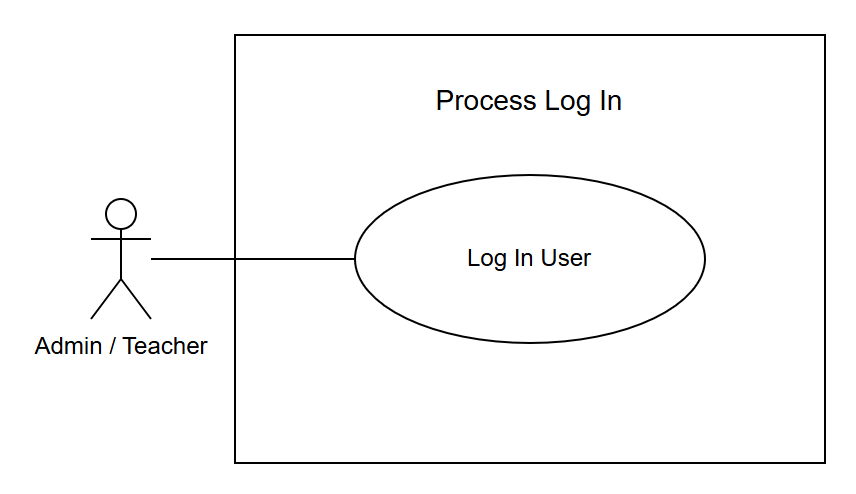

*Figure 3.1: System Use Case for Process Log In*

**Written Use Case:** Process Log In  
**Use Case Name:** Log In User  
**Purpose:** To allow the Admin and Teacher to log in to CAMS using their username and password.  
**Actors:** Admin, Teacher

**Input Parameters:**

- Username
- Password

**Output Parameters:**

- User dashboard
- Login error message

**Pre-Condition:**

- The user must have an active account in the system.

**Post-Condition:**

- The user is directed to the Admin or Teacher dashboard based on their role.
- If the user enters a wrong password 5 times, the account is locked for 15 minutes.

**Successful Scenario:**

1. The user navigates to the login page.
2. The user enters their username and password.
3. The user clicks the "Sign in" button.
4. The system validates the entered username and password.
5. The system checks the role of the account.
6. The user is logged in and directed to the Admin or Teacher dashboard.

**Exception Scenario:**

- If the user enters an incorrect username or password:
    - The system displays an error message.
    - The user is allowed to enter their username and password again.
- If the user enters a wrong password 5 times:
    - The system locks the account for 15 minutes.
    - After 15 minutes, the user is allowed to log in again.
- If the account is inactive:
    - The system does not allow the user to log in.
- If a student tries to log in on the website:
    - The system tells the student to use the CAMS student app on the lab computer.

**Additional Remarks:**

- The Teacher inherits this use case from the Admin (generalization).
- A locked teacher account can also be unlocked early on the Teachers page (Manage Teacher Account).

## Process Sign Out

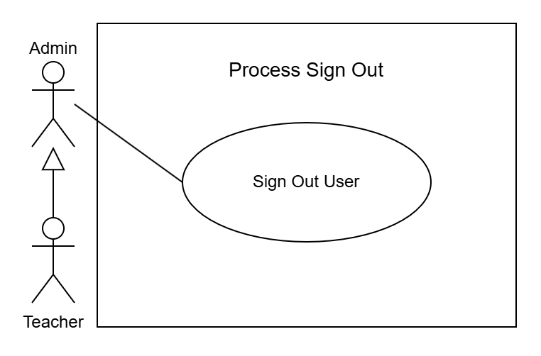

*Figure 3.2: System Use Case for Process Sign Out*

**Written Use Case:** Process Sign Out  
**Use Case Name:** Sign Out User  
**Purpose:** To allow the Admin and Teacher to sign out of CAMS when they are done.  
**Actors:** Admin, Teacher

**Input Parameters:**

- None

**Output Parameters:**

- Login page

**Pre-Condition:**

- The user must be logged in to the system.

**Post-Condition:**

- The user is signed out of the system.
- The next person using the browser must log in again.

**Successful Scenario:**

1. The user clicks the "Sign out" button.
2. The system ends the user's session.
3. The system displays the login page.

**Exception Scenario:**

- If the session has already ended:
    - The system displays the login page.

**Additional Remarks:**

- The Teacher inherits this use case from the Admin (generalization).
- Signing out is separate from logging in (Process Log In).

## Manage Own Account

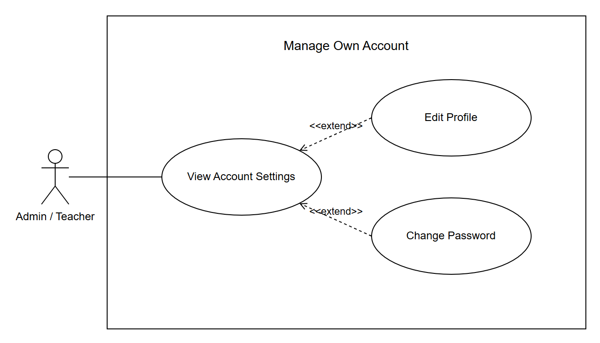

*Figure 3.3: System Use Case for Manage Own Account*

**Written Use Case:** Manage Own Account  
**Use Case Name:** Change Password  
**Purpose:** To allow the Admin and Teacher to change their own password.  
**Actors:** Admin, Teacher

**Input Parameters:**

- Current password
- New password
- Confirm new password

**Output Parameters:**

- Success or error message

**Pre-Condition:**

- The user must be logged in to the system.

**Post-Condition:**

- The new password is saved.
- The user must use the new password at the next login.

**Successful Scenario:**

1. The user navigates to the Settings page.
2. The user enters the current password.
3. The user enters the new password and enters it again to confirm.
4. The user clicks the "Change password" button.
5. The system validates the passwords.
6. The system saves the new password and displays a success message.

**Exception Scenario:**

- If the current password is incorrect:
    - The system displays an error message.
    - The password is not changed.
- If the new password has fewer than 8 characters, or the two new passwords do not match:
    - The system displays an error message.
    - The user is asked to enter the new password again.

**Additional Remarks:**

- The Teacher inherits this use case from the Admin (generalization).
- The password is saved in a protected form, not as plain text.

## Manage Teacher Account

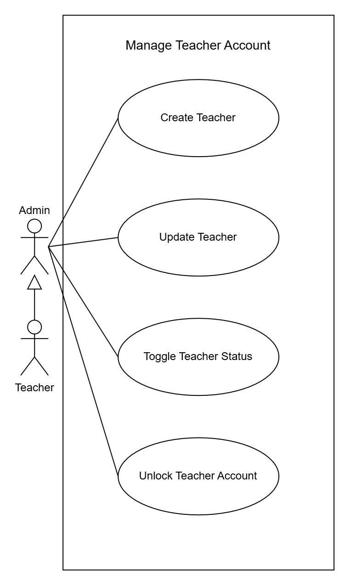

*Figure 3.4: System Use Case for Manage Teacher Account*

**Written Use Case:** Manage Teacher Account  
**Use Case Name:** Create Teacher, Update Teacher, Toggle Teacher Status, Unlock Teacher Account  
**Purpose:** To allow the Admin and Teacher to manage teacher accounts in CAMS by adding, editing, activating or deactivating, and unlocking accounts.  
**Actors:** Admin, Teacher

**Input Parameters:**

- Name
- Email
- Contact number
- Username
- Password
- Selected teacher account

**Output Parameters:**

- Teacher list
- Updated teacher information
- Success or error message

**Pre-Condition:**

- The user must be logged in to the system.
- To edit, deactivate or unlock an account, the teacher account must exist.

**Post-Condition:**

- A teacher account is added, updated, activated or deactivated, or unlocked based on the action performed.
- The change is saved in the audit trail.
- The updated teacher list is displayed in the system.

**Successful Scenario:**

1. The user navigates to the Teachers page.
2. The system displays the list of teacher accounts.
3. To add a teacher, the user clicks Add.
4. The user enters the teacher information and clicks Save.
5. To edit a teacher, the user clicks Edit, updates the information and clicks Save.
6. To deactivate or activate a teacher, the user clicks Deactivate or Activate and confirms.
7. To unlock a locked account, the user clicks Unlock.
8. The system validates the information and saves the changes.
9. The system displays the updated teacher list.

**Exception Scenario:**

- If the username or password is missing, or the username is already used:
    - The system displays an error message.
    - The teacher account is not saved.
- If the teacher still has active classes, or is the last active teacher:
    - The system does not deactivate the account.
- If a teacher tries to edit, deactivate or unlock their own account on this page:
    - The system does not allow the action.

**Additional Remarks:**

- The Teacher inherits this use case from the Admin (generalization).
- An inactive teacher cannot log in, but the account and its records are kept. Nothing is deleted.
- A locked account also unlocks by itself after 15 minutes.

## Manage Student Account

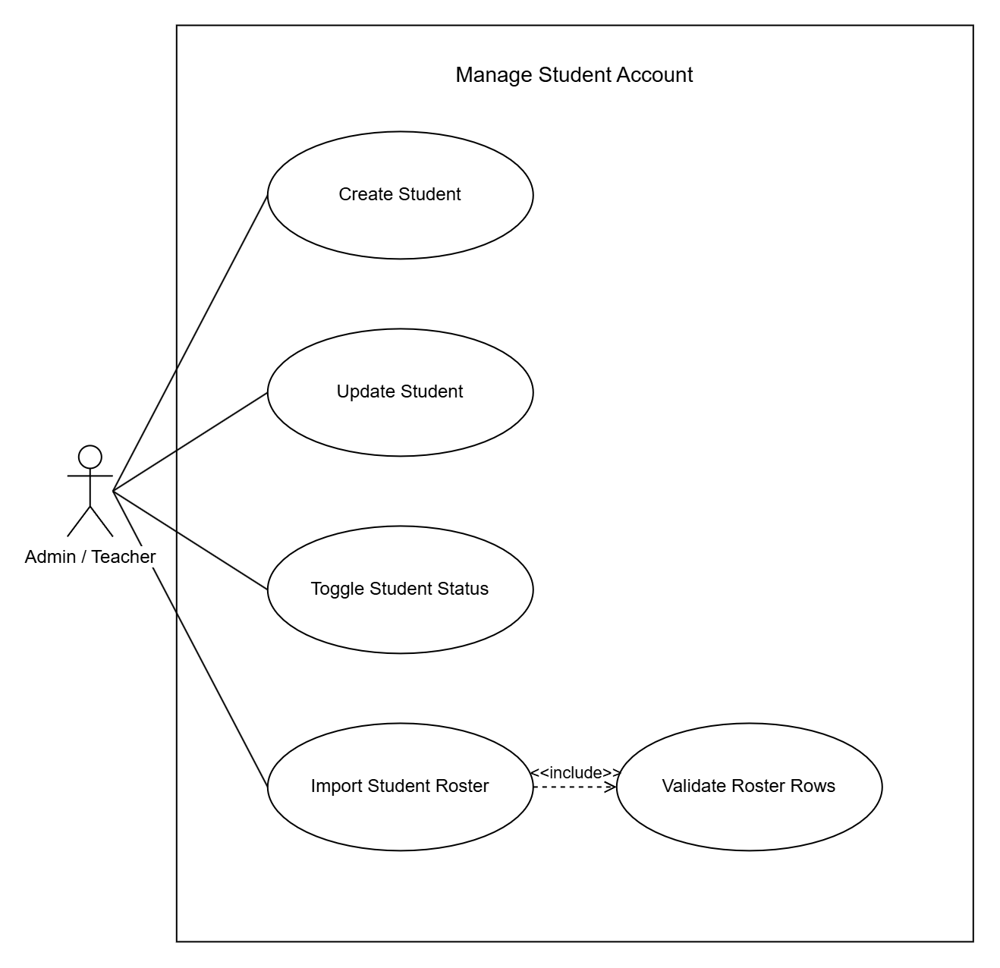

*Figure 3.5: System Use Case for Manage Student Account*

**Written Use Case:** Manage Student Account  
**Use Case Name:** Create Student, Update Student, Toggle Student Status, Import Student Roster  
**Purpose:** To allow the Admin and Teacher to manage student accounts in CAMS by adding, editing, activating or deactivating, and importing many students at once.  
**Actors:** Admin, Teacher

**Input Parameters:**

- Student number
- First name
- Last name
- Username
- Password
- Selected student account
- Student list typed in or uploaded as a CSV file

**Output Parameters:**

- Student list
- Updated student information
- List of wrong rows, if an import fails
- Success or error message

**Pre-Condition:**

- The user must be logged in to the system.
- A class that receives imported students must be active and have a teacher.

**Post-Condition:**

- A student account is added, updated, activated or deactivated, or imported based on the action performed.
- Active students can log in on a lab computer.
- The updated student list is displayed in the system.

**Successful Scenario:**

1. The user navigates to the Students page.
2. The system displays the list of student accounts.
3. To add a student, the user clicks Add, enters the student information and clicks Save.
4. To edit a student, the user clicks Edit, updates the information and clicks Save.
5. To deactivate or activate a student, the user clicks Deactivate or Activate and confirms.
6. To import many students, the user types the students or uploads a CSV file and clicks Save.
7. For an import, the system first checks every row (Validate Roster Rows).
8. The system saves the students and displays the updated student list.

**Exception Scenario:**

- If a required detail is missing, or the student number or username is already used:
    - The system displays an error message.
    - The student account is not saved.
- If any row of the import is wrong (no name, a password shorter than 8 characters, or a username used twice):
    - No student is added.
    - The system displays the wrong rows.
- If the import list is empty:
    - The system asks for at least one student.

**Additional Remarks:**

- The Teacher inherits this use case from the Admin (generalization).
- Import Student Roster always includes Validate Roster Rows.
- The Remove button only hides a student. The records are kept and can be restored.

## Manage Computer Profile

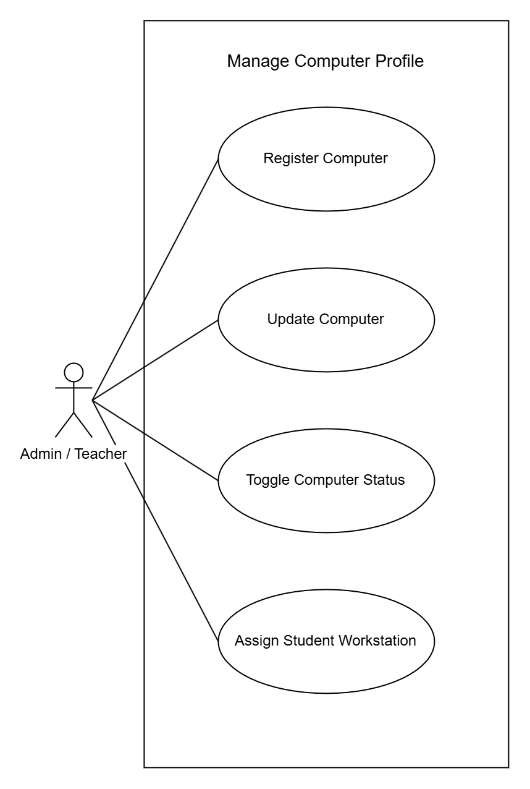

*Figure 3.6: System Use Case for Manage Computer Profile*

**Written Use Case:** Manage Computer Profile  
**Use Case Name:** Register Computer, Update Computer, Toggle Computer Status, Assign Student Workstation  
**Purpose:** To allow the Admin and Teacher to manage the lab computers in CAMS by registering, editing, archiving or restoring computers, and reserving a computer for a student.  
**Actors:** Admin, Teacher

**Input Parameters:**

- Station name
- Status
- Selected computer
- Selected student

**Output Parameters:**

- Computer list
- Updated computer information
- Success or error message

**Pre-Condition:**

- The user must be logged in to the system.
- To edit, archive or reserve a computer, the computer must exist.

**Post-Condition:**

- A computer is added, updated, archived or restored, or reserved for a student based on the action performed.
- Status changes are kept in the computer's history.
- The updated computer list is displayed in the system.

**Successful Scenario:**

1. The user navigates to the Computers page.
2. The system displays the list of lab computers.
3. To register a computer, the user clicks Add, enters the computer information and clicks Save.
4. To edit a computer, the user clicks Edit, changes the name or status and clicks Save.
5. To archive a computer, the user clicks Archive. To restore it, the user edits it and sets the status to Available.
6. To reserve a computer for a student, the user opens the Students page, selects a computer for the student and clicks Save.
7. The system validates the information and saves the changes.
8. The system displays the updated list.

**Exception Scenario:**

- If the station name is missing or already used:
    - The system displays an error message.
    - The computer is not saved.
- If a lab session is running on the computer:
    - The system does not archive the computer.
- If the computer is archived, already reserved or in use:
    - The system does not reserve the computer for the student.

**Additional Remarks:**

- The Teacher inherits this use case from the Admin (generalization).
- An archived computer is hidden from the active list. Nothing is deleted.
- Choosing no computer clears a student's reservation.

## Manage Class

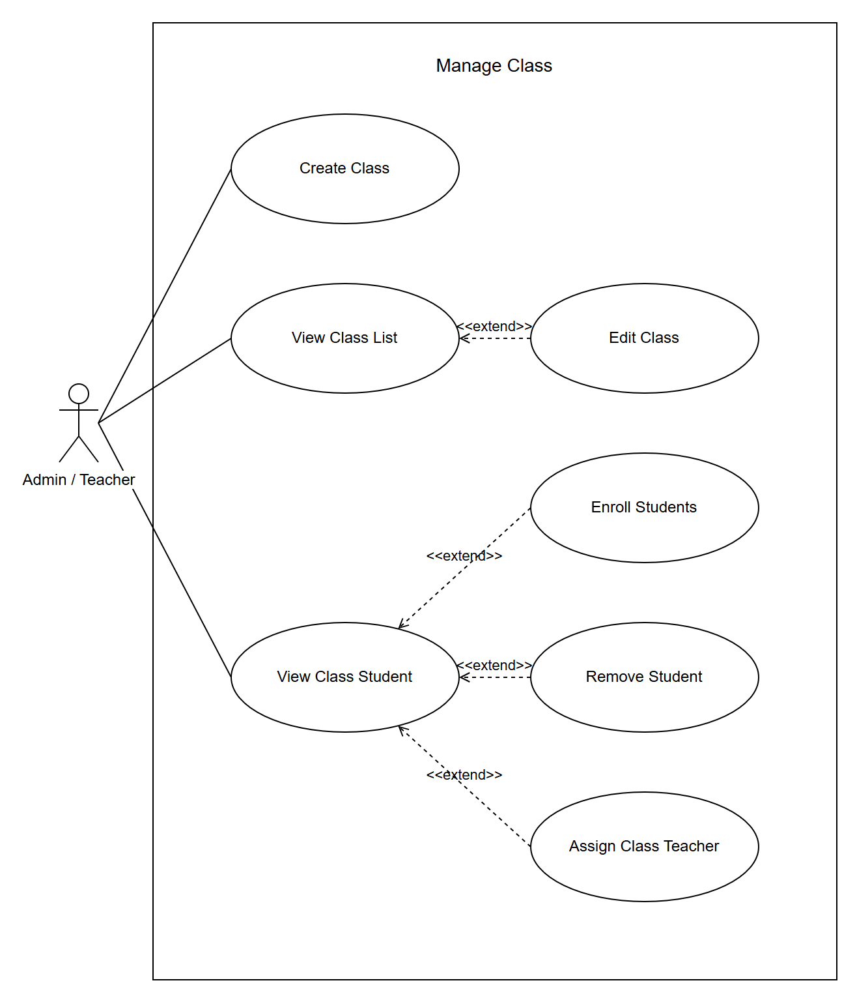

*Figure 3.7: System Use Case for Manage Class*

**Written Use Case:** Manage Class  
**Use Case Name:** Create Class, Update Class, Toggle Class Status, Enroll Students, Remove Student from Class  
**Purpose:** To allow the Admin and Teacher to manage classes in CAMS by creating, editing, archiving or restoring classes, and by enrolling or removing students.  
**Actors:** Admin, Teacher

**Input Parameters:**

- Class name
- Grade level
- Section
- Subject
- Schedule
- School year
- Selected students

**Output Parameters:**

- Class list
- Updated class information
- Updated list of students in the class
- Success or error message

**Pre-Condition:**

- The user must be logged in to the system.
- To enroll students, the class must be active and have a teacher.

**Post-Condition:**

- A class is added, updated, archived or restored based on the action performed.
- The chosen students are enrolled in or removed from the class.
- The updated class is displayed in the system.

**Successful Scenario:**

1. The user navigates to the Classes page.
2. The system displays the list of classes.
3. To create a class, the user clicks Add, enters the class information and clicks Save.
4. To edit a class, the user clicks Edit, updates the information and clicks Save.
5. To archive or restore a class, the user clicks Archive or Restore and confirms.
6. To enroll students, the user opens the class, selects the students (or types a new student) and clicks Enroll.
7. To remove students, the user opens the class, clicks Remove on the students and confirms.
8. The system validates the information and saves the changes.
9. The system displays the updated class.

**Exception Scenario:**

- If the class name is missing, or the same class already exists for that school year:
    - The system displays an error message.
    - The class is not saved.
- If a teacher tries to change a class that is not theirs:
    - The system does not allow the action.
- If a student is already in another class:
    - The system asks the user to confirm the move.
- If a class to be restored has no active teacher:
    - The system does not restore the class.

**Additional Remarks:**

- The Teacher inherits this use case from the Admin (generalization).
- A class made by a teacher belongs to that teacher.
- Choosing the teacher of a class is for the Admin only (Manage Class Teacher).
- Archiving a class or removing a student keeps all records. Nothing is deleted.

## Manage Restriction Rule

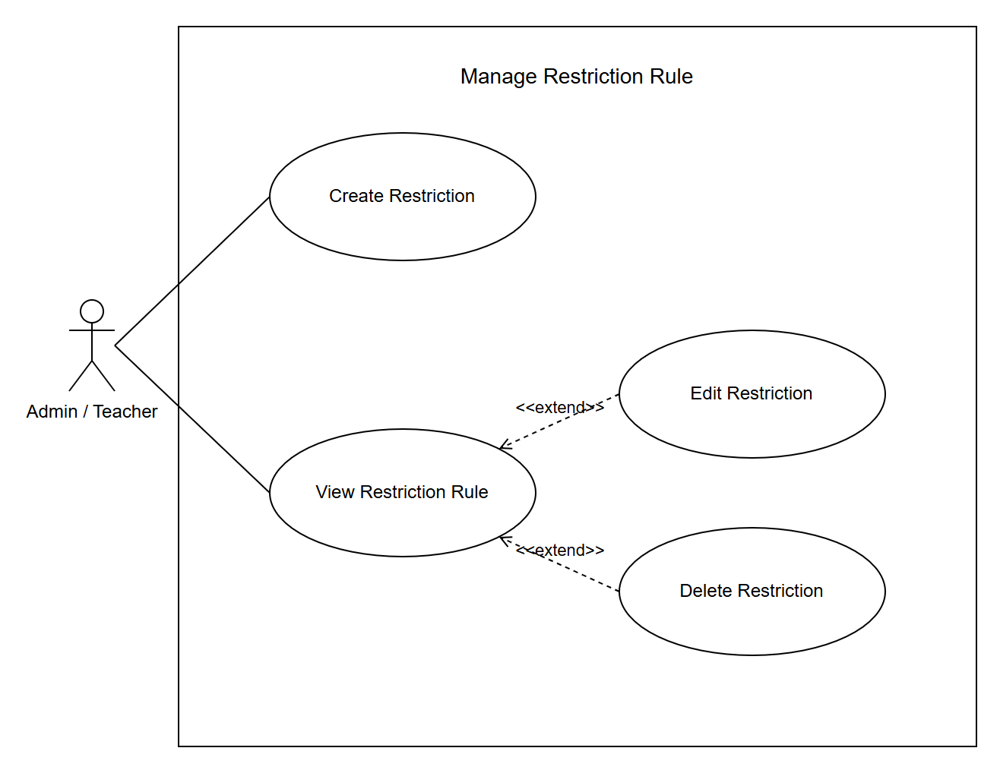

*Figure 3.8: System Use Case for Manage Restriction Rule*

**Written Use Case:** Manage Restriction Rule  
**Use Case Name:** Create Restriction, Update Restriction, Delete Restriction  
**Purpose:** To allow the Admin and Teacher to manage the rules that block or allow websites during lab sessions by adding, editing and deleting rules.  
**Actors:** Admin, Teacher

**Input Parameters:**

- Rule type
- Target website or app
- Block or allow
- Description
- Active
- Selected rule

**Output Parameters:**

- Rule list
- Success or error message

**Pre-Condition:**

- The user must be logged in to the system.
- To edit or delete a rule, the rule must exist.

**Post-Condition:**

- A rule is added, updated or deleted based on the action performed.
- Student computers follow the new or changed rules.
- The updated rule list is displayed in the system.

**Successful Scenario:**

1. The user navigates to the Restriction Rules page.
2. The system displays the list of rules.
3. To add a rule, the user clicks Add, enters the rule information and clicks Save.
4. To edit a rule, the user clicks Edit, changes the rule or turns it on or off, and clicks Save.
5. To delete a rule, the user clicks Delete.
6. The system asks the user to confirm the deletion.
7. The user confirms the deletion.
8. The system saves or deletes the rule and displays the updated rule list.

**Exception Scenario:**

- If the rule type, block or allow, or the target is missing:
    - The system displays an error message.
    - The rule is not saved.
- If a teacher tries to change or delete a rule that is not theirs:
    - The system does not allow the action.
- If the rule is already gone:
    - Nothing changes.

**Additional Remarks:**

- The Teacher inherits this use case from the Admin (generalization).
- Websites are blocked. Apps are only watched, never closed.
- A deleted rule cannot be brought back. A rule that is turned off is kept but ignored.

## Manage Blacklist and Whitelist

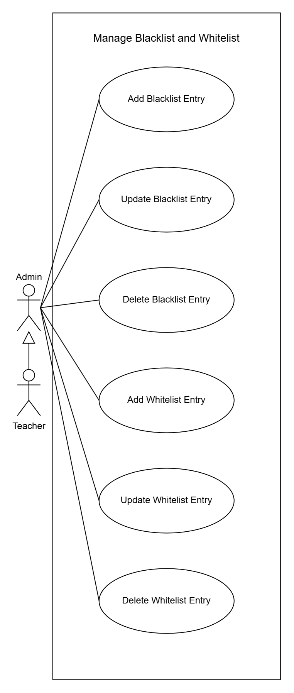

*Figure 3.9: System Use Case for Manage Blacklist and Whitelist*

**Written Use Case:** Manage Blacklist and Whitelist  
**Use Case Name:** Add Blacklist Entry, Update Blacklist Entry, Delete Blacklist Entry, Add Whitelist Entry, Update Whitelist Entry, Delete Whitelist Entry  
**Purpose:** To allow the Admin and Teacher to manage the blacklist of blocked websites and apps and the whitelist of allowed websites by adding, editing and deleting entries.  
**Actors:** Admin, Teacher

**Input Parameters:**

- Entry type (website, domain, app or process)
- Value
- Reason
- Website
- Description
- Active
- Selected entry

**Output Parameters:**

- Blacklist or whitelist
- Success or error message

**Pre-Condition:**

- The user must be logged in to the system.
- To edit or delete an entry, the entry must exist.

**Post-Condition:**

- An entry is added, updated or deleted based on the action performed.
- Student computers block what is on the blacklist and follow the whitelist.
- The updated list is displayed in the system.

**Successful Scenario:**

1. The user navigates to the Blacklist page or the Whitelist page.
2. The system displays the list of entries.
3. To add an entry, the user clicks Add, enters the entry information and clicks Save.
4. To edit an entry, the user clicks Edit, changes the entry or turns it on or off, and clicks Save.
5. To delete an entry, the user clicks Delete.
6. The system asks the user to confirm the deletion.
7. The user confirms the deletion.
8. The system saves or deletes the entry and displays the updated list.

**Exception Scenario:**

- If the type, the value or the website is missing:
    - The system displays an error message.
    - The entry is not saved.
- If the entry is already gone:
    - Nothing changes.

**Additional Remarks:**

- The Teacher inherits this use case from the Admin (generalization).
- A blacklisted website stays blocked even if it is on the whitelist.
- Apps on the blacklist are only watched, not closed.
- A deleted entry cannot be brought back.

## Manage Category

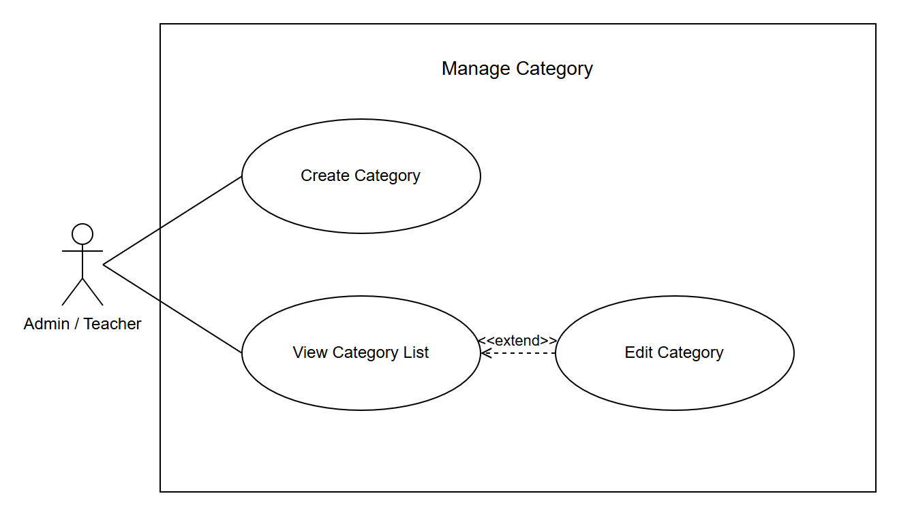

*Figure 3.10: System Use Case for Manage Category*

**Written Use Case:** Manage Category  
**Use Case Name:** Create Category, Update Category, Toggle Category Status  
**Purpose:** To allow the Admin and Teacher to group apps or websites, for example all games, so one rule covers them all.  
**Actors:** Admin, Teacher

**Input Parameters:**

- Category name
- Pattern (app name or website address)
- Block or allow
- Description
- Active
- Selected category

**Output Parameters:**

- Category list
- Success or error message

**Pre-Condition:**

- The user must be logged in to the system.
- To edit or turn off a category, the category must exist.

**Post-Condition:**

- A category is added, updated, or turned on or off based on the action performed.
- Apps or websites that match an active category follow it.
- The updated category list is displayed in the system.

**Successful Scenario:**

1. The user navigates to the Restriction Rules page.
2. The system displays the list of categories.
3. To add a category, the user clicks Add Category, enters the category information and clicks Save.
4. To edit a category, the user clicks Edit, changes the information and clicks Save.
5. To turn a category on or off, the user clicks Edit, turns Active on or off and clicks Save.
6. The system validates the information and saves the category.
7. The system displays the updated categories.

**Exception Scenario:**

- If the name or the pattern is missing:
    - The system displays an error message.
    - The category is not saved.
- If the category is already gone:
    - Nothing changes.

**Additional Remarks:**

- The Teacher inherits this use case from the Admin (generalization).
- There are app categories and website categories.
- A category is turned off, not deleted.

## Manage Session Rule

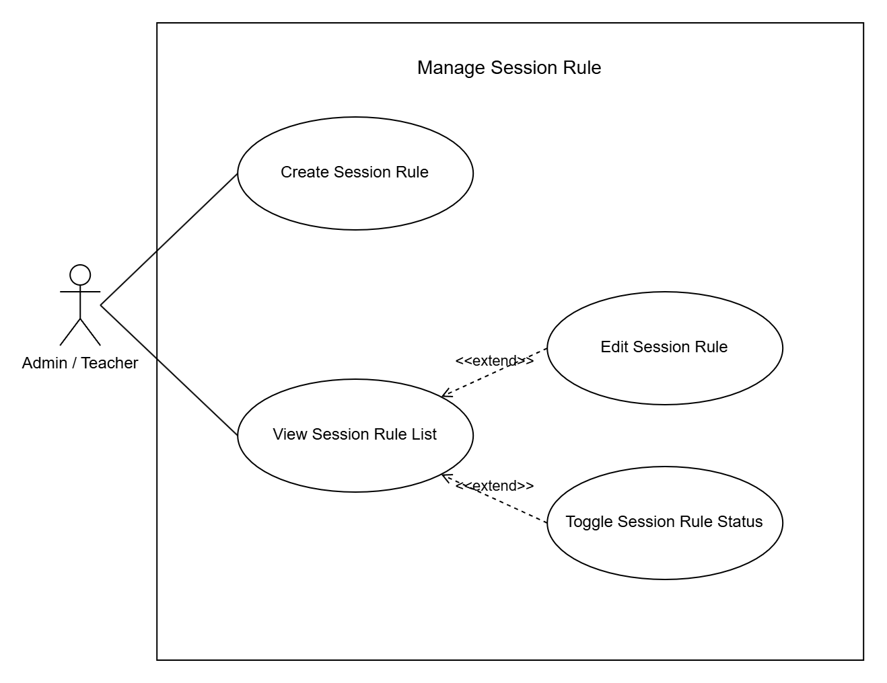

*Figure 3.11: System Use Case for Manage Session Rule*

**Written Use Case:** Manage Session Rule  
**Use Case Name:** Create Session Rule, Update Session Rule, Toggle Session Rule Status  
**Purpose:** To allow the Admin and Teacher to set how lab sessions work, such as the time limit, pausing and remote control.  
**Actors:** Admin, Teacher

**Input Parameters:**

- Rule name
- Time limit
- Allow pause
- Allow remote control
- Default rule
- Selected session rule

**Output Parameters:**

- Session rule list
- Success or error message

**Pre-Condition:**

- The user must be logged in to the system.
- To edit or turn off a rule, the rule must exist.

**Post-Condition:**

- A session rule is added, updated, or turned on or off based on the action performed.
- New lab sessions follow the active rules.
- The updated session rule list is displayed in the system.

**Successful Scenario:**

1. The user navigates to the Session Rules page.
2. The system displays the list of session rules.
3. To add a rule, the user clicks Add, enters the rule information and clicks Save.
4. To edit a rule, the user clicks Edit, changes the information and clicks Save.
5. To turn a rule off, the user clicks Deactivate and confirms. To turn it on again, the user edits the rule and turns Active on.
6. The system validates the information and saves the rule.
7. The system displays the updated rule list.

**Exception Scenario:**

- If the name is missing:
    - The system displays an error message.
    - The rule is not saved.
- If the rule is already gone:
    - Nothing changes.

**Additional Remarks:**

- The Teacher inherits this use case from the Admin (generalization).
- A new default rule replaces the old default.
- Old sessions keep their rule. Nothing is deleted.

## Control Laboratory Session

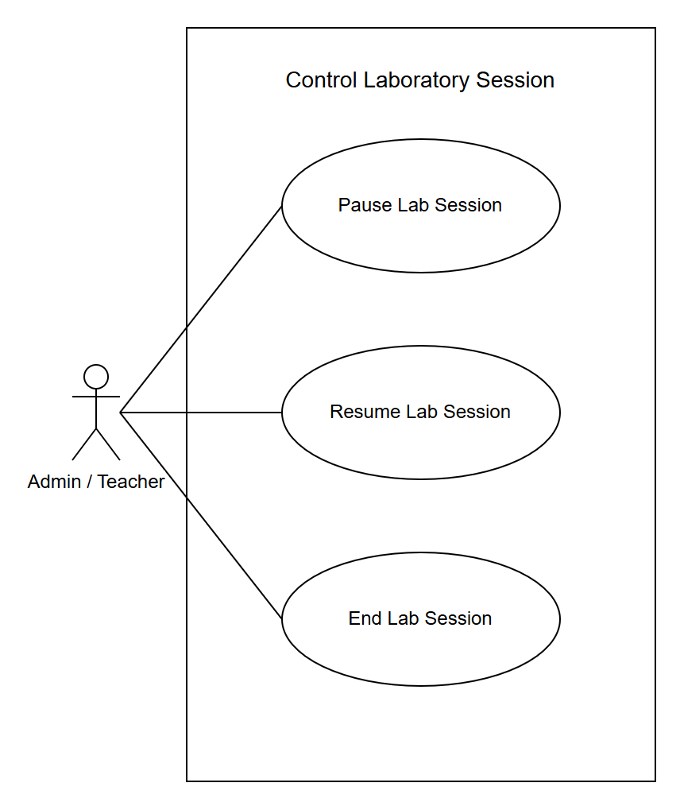

*Figure 3.12: System Use Case for Control Laboratory Session*

**Written Use Case:** Control Laboratory Session  
**Use Case Name:** Pause Lab Session, Resume Lab Session, End Lab Session  
**Purpose:** To allow the Admin and Teacher to pause, resume or end all the student sessions in the lab at once.  
**Actors:** Admin, Teacher

**Input Parameters:**

- Pause, Resume or End command

**Output Parameters:**

- Number of sessions paused, resumed or ended

**Pre-Condition:**

- The user must be logged in to the system.
- A lab session must be running (to pause or end it) or paused (to resume it).

**Post-Condition:**

- All the sessions are paused, resumed or ended based on the action performed.
- The change is saved in the audit trail.

**Successful Scenario:**

1. The user navigates to the dashboard (Admin) or the Sessions page (Teacher).
2. To pause the lab, the user clicks Pause. The student computers display a pause screen and the timers stop.
3. To resume the lab, the user clicks Resume. The pause screens close and the timers continue.
4. To end the lab, the user clicks End and confirms. The sessions end and the student computers restart.
5. The system applies the change to every session in the lab.
6. The system displays how many sessions were changed.

**Exception Scenario:**

- If no session is running, paused or open:
    - Nothing changes.
    - The system displays 0 sessions.

**Additional Remarks:**

- The Teacher inherits this use case from the Admin (generalization).
- Only the Teacher can start a lab session (Control Student Session).
- Paused time is not counted, and the session records are kept.

# ADMIN

## Manage Admin Account

*Figure 3.13: System Use Case for Manage Admin Account*

**Written Use Case:** Manage Admin Account  
**Use Case Name:** Create Admin, Update Admin, Toggle Admin Status  
**Purpose:** To allow the Admin to manage admin accounts in CAMS by adding, editing, and activating or deactivating accounts.  
**Actors:** Admin

**Input Parameters:**

- Full name
- Username
- Password
- Selected admin account

**Output Parameters:**

- Admin list
- Success or error message

**Pre-Condition:**

- The Admin must be logged in to the system.

**Post-Condition:**

- An admin account is added, updated, or activated or deactivated based on the action performed.
- The change is saved in the audit trail.
- The updated admin list is displayed in the system.

**Successful Scenario:**

1. The Admin navigates to the Admin Accounts page.
2. The system displays the list of admin accounts.
3. To add an admin, the Admin clicks Add, enters the admin information and clicks Save.
4. To edit an admin, the Admin clicks Edit, changes the name or username and clicks Save.
5. To deactivate or activate an admin, the Admin clicks Deactivate or Activate and confirms.
6. The system validates the information and saves the changes.
7. The system displays the updated admin list.

**Exception Scenario:**

- If the username or password is missing, or the username is already used:
    - The system displays an error message.
    - The admin account is not saved.
- If the Admin tries to deactivate the last active admin:
    - The system does not allow the action.

**Additional Remarks:**

- Only the Admin can manage admin accounts.
- An inactive admin cannot log in, but the account is kept. Nothing is deleted.

## Manage Class Teacher

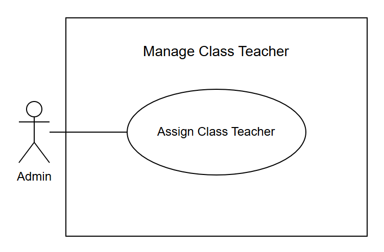

*Figure 3.14: System Use Case for Manage Class Teacher*

**Written Use Case:** Manage Class Teacher  
**Use Case Name:** Assign Class Teacher  
**Purpose:** To allow the Admin to choose the teacher in charge of a class, change the teacher, or leave the class without one.  
**Actors:** Admin

**Input Parameters:**

- Selected class
- Selected teacher, or none

**Output Parameters:**

- Class page showing its teacher
- Success or error message

**Pre-Condition:**

- The Admin must be logged in to the system.
- The class must exist.

**Post-Condition:**

- The chosen teacher is in charge of the class.
- The class appears on that teacher's class list.
- The change is saved in the audit trail.

**Successful Scenario:**

1. The Admin navigates to the Classes page and opens the class.
2. The Admin selects a teacher for the class, or none.
3. The Admin clicks Save.
4. The system checks that the teacher is active.
5. The system saves the teacher for the class and displays the class page.

**Exception Scenario:**

- If the chosen teacher is inactive:
    - The system displays an error message.
    - The Admin is asked to select an active teacher.
- If the class is not found:
    - The system displays an error message.
    - Nothing changes.

**Additional Remarks:**

- Only the Admin can assign the teacher of a class. A teacher who tries is told that only administrators can assign or reassign teachers.

## Export Reports and Logs

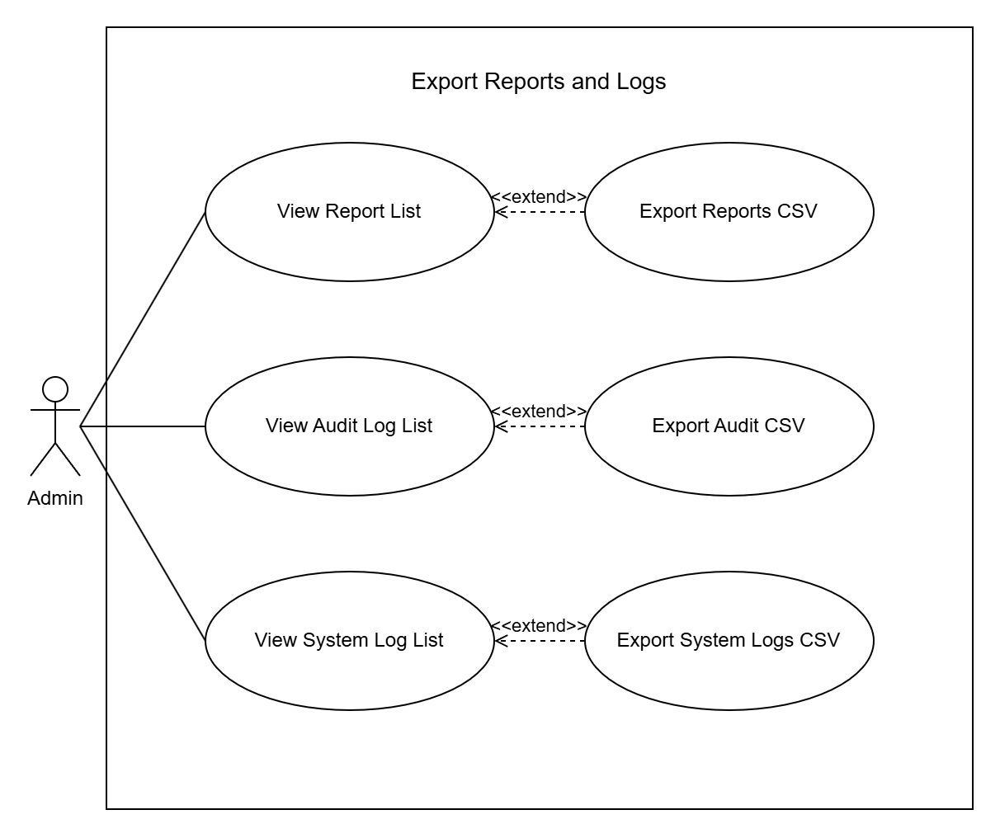

*Figure 3.15: System Use Case for Export Reports and Logs*

**Written Use Case:** Export Reports and Logs  
**Use Case Name:** View Reports, View Audit Logs, View System Logs  
**Purpose:** To allow the Admin to view the lab reports, the audit trail and the system logs, and to download them as CSV files.  
**Actors:** Admin

**Input Parameters:**

- Date range
- Class or computer (optional)

**Output Parameters:**

- Reports, Audit Trail or System Logs page
- CSV file

**Pre-Condition:**

- The Admin must be logged in to the system.

**Post-Condition:**

- The records are displayed in the system.
- The CSV file is downloaded when the Admin exports. Nothing is changed.

**Successful Scenario:**

1. The Admin navigates to the Reports page, the Audit Trail page or the System Logs page.
2. The Admin may set the filters.
3. The system displays the records.
4. To download a file, the Admin clicks the export button on the page (Export Reports CSV, Export Audit CSV or Export System Logs CSV).
5. The system creates the CSV file and the browser downloads it.

**Exception Scenario:**

- If nothing matches the filters:
    - The system displays an empty list.
    - The CSV file contains only the column names.

**Additional Remarks:**

- Each export extends its page: it is optional and happens only while the page is open.
- The Audit Trail and System Logs pages display the latest 500 records.

## Manage Database

*Figure 3.16: System Use Case for Manage Database*

**Written Use Case:** Manage Database  
**Use Case Name:** Create Backup, Validate Backup, Stage Database Restore  
**Purpose:** To allow the Admin to back up the CAMS database, check a backup, and restore the database from a backup.  
**Actors:** Admin

**Input Parameters:**

- Backup label (optional)
- Selected backup
- The word RESTORE, to confirm a restore

**Output Parameters:**

- Backup list
- Backup check result
- Message to restart the server

**Pre-Condition:**

- The Admin must be logged in to the system.
- To check or restore a backup, the backup must be in the list.

**Post-Condition:**

- A checked backup is saved, or the chosen backup will replace the database when the server restarts.

**Successful Scenario:**

1. The Admin navigates to the Database page.
2. The system displays the list of backups.
3. To create a backup, the Admin types a label (optional) and clicks Create backup.
4. To check a backup, the Admin clicks Validate on the backup.
5. To restore a backup, the Admin clicks Restore on the backup and types RESTORE to confirm.
6. For a restore, the system first checks the backup (Validate Backup) and makes a safety copy of the current database.
7. The system completes the action and displays the result.

**Exception Scenario:**

- If making the backup fails:
    - The system displays an error message.
    - The database is not changed.
- If the backup is damaged, or RESTORE is not typed:
    - The system does not restore the backup.
    - Nothing is changed.

**Additional Remarks:**

- Stage Database Restore always includes Validate Backup.
- The restore takes effect only after the server restarts.

## Manage Deployment

*Figure 3.17: System Use Case for Manage Deployment*

**Written Use Case:** Manage Deployment  
**Use Case Name:** Download Deployment Files, Build Workstation Bundle  
**Purpose:** To allow the Admin to get the files needed to install the CAMS student app on the lab computers.  
**Actors:** Admin

**Input Parameters:**

- Selected file (installer, manifest or certificate)
- Server address

**Output Parameters:**

- Downloaded file
- Workstation bundle (zip file)

**Pre-Condition:**

- The Admin must be logged in to the system.

**Post-Condition:**

- The Admin has the setup files. Nothing in CAMS is changed.

**Successful Scenario:**

1. The Admin navigates to the Deployment page.
2. To download a file, the Admin clicks the installer, the manifest or the certificate.
3. To build a workstation bundle, the Admin enters the server address and clicks Build.
4. The system prepares the file.
5. The browser downloads the file.

**Exception Scenario:**

- If a file is missing or damaged:
    - The download fails.
    - The system displays an error message.
- If the server address is wrong:
    - The system does not build the bundle.
    - The system displays an error message.

**Additional Remarks:**

- The bundle contains the installer, the certificate and an install script.
- The certificate lets the lab computers connect to the server safely.

# TEACHER

## Control Student Session

*Figure 3.18: System Use Case for Control Student Session*

**Written Use Case:** Control Student Session  
**Use Case Name:** Start Lab Session, Pause or Resume Student Session, End Student Session  
**Purpose:** To allow the Teacher to start the lab session, and to pause, resume or end one student's session.  
**Actors:** Teacher

**Input Parameters:**

- Session rule (optional)
- Selected student session

**Output Parameters:**

- Lab session started message
- Updated session status

**Pre-Condition:**

- The Teacher must be logged in to the system.
- To pause, resume or end a student's session, the session must be open.

**Post-Condition:**

- Students can log in on any lab computer and join the lab session.
- The selected session is paused, resumed or ended based on the action performed.

**Successful Scenario:**

1. The Teacher navigates to the Sessions page.
2. To start the lab session, the Teacher clicks Start lab session and selects a session rule, or keeps the default.
3. To pause or resume a student's session, the Teacher clicks Pause or Resume on the session.
4. To end a student's session, the Teacher clicks End on the session and confirms.
5. The system saves the change.
6. When a session ends, the system saves the end time and restarts the student's computer.

**Exception Scenario:**

- If the chosen session rule is turned off:
    - The system does not start the lab session.
- If the session rule does not allow pausing:
    - The system does not pause the session.
- If the session has already ended:
    - Nothing changes.

**Additional Remarks:**

- Only the Teacher can start a lab session. The Admin can only pause, resume or end all sessions (Control Laboratory Session).
- Paused time is not counted, and the session records are kept.

## Monitor Student Screen

*Figure 3.19: System Use Case for Monitor Student Screen*

**Written Use Case:** Monitor Student Screen  
**Use Case Name:** Open Monitoring Wall  
**Purpose:** To allow the Teacher to watch all the student screens live on one page.  
**Actors:** Teacher

**Input Parameters:**

- None

**Output Parameters:**

- Live screen of every logged-in student

**Pre-Condition:**

- The Teacher must be logged in to the system.
- Students must be logged in on the lab computers.

**Post-Condition:**

- The Teacher sees the latest screens. Nothing is saved.

**Successful Scenario:**

1. The Teacher navigates to the Live Monitoring page.
2. Each student computer sends its screen to the system (Stream Student Screen).
3. The system displays each screen on the page and keeps it updated.

**Exception Scenario:**

- If no student is logged in:
    - The system displays no screens.
- If a screen picture is empty or too large:
    - The system skips that picture.

**Additional Remarks:**

- Open Monitoring Wall always includes Stream Student Screen.
- From a screen on this page, the Teacher can control that computer (Control Student Workstation).

## Control Student Workstation

*Figure 3.20: System Use Case for Control Student Workstation*

**Written Use Case:** Control Student Workstation  
**Use Case Name:** Start Remote Control, Stop Remote Control, Lock Workstation, Unlock Workstation, Force Student Logout, Restart Workstation, Shut Down Workstation  
**Purpose:** To allow the Teacher to take control of a student's computer, lock or unlock it, log the student out, or restart or shut down the computer.  
**Actors:** Teacher

**Input Parameters:**

- Selected computer, or all the computers shown
- Mouse clicks and key presses during remote control

**Output Parameters:**

- Command result on the monitoring page

**Pre-Condition:**

- The Teacher must be logged in to the system.
- The computer must be connected.
- For remote control, the session rule must allow it.

**Post-Condition:**

- The student's computer carries out the command.
- The command is saved in the remote history.

**Successful Scenario:**

1. The Teacher navigates to the Live Monitoring page and selects a computer, or all the computers shown.
2. To control a computer, the Teacher clicks Start Remote Support. The Teacher's mouse and keyboard now work on the student's computer (Send Remote Input).
3. To give control back, the Teacher clicks Stop Remote Support.
4. To lock or unlock a computer, the Teacher clicks Lock (or Lock visible for all the computers) or Unlock.
5. To log a student out, the Teacher clicks Log out (or Log out visible for all) and confirms.
6. To restart or shut down a computer, the Teacher clicks Restart or Shutdown and confirms.
7. The system sends the command to the student's computer.
8. The computer carries out the command, and the system displays the result.

**Exception Scenario:**

- If the computer is not connected:
    - The system does not send the command.
- If more than 100 computers are selected at once:
    - The system does not send the command.
- If the session rule does not allow remote control, or the session has ended:
    - The system does not start remote control.

**Additional Remarks:**

- Start Remote Control always includes Send Remote Input.
- The student sees a notice while the Teacher is in control.
- A restart happens after 10 seconds and a shutdown after 15 seconds. Unsaved work is lost.

## Send Message to Student

*Figure 3.21: System Use Case for Send Message to Student*

**Written Use Case:** Send Message to Student  
**Use Case Name:** Send Warning Popup, Broadcast Teacher Screen  
**Purpose:** To allow the Teacher to send a warning to students, or show the Teacher's screen on all the student computers.  
**Actors:** Teacher

**Input Parameters:**

- Warning title
- Warning message
- Selected student, or all
- Screen to share

**Output Parameters:**

- Warning on the student screens
- Teacher's screen on every student computer

**Pre-Condition:**

- The Teacher must be logged in to the system.
- Students must be logged in on the lab computers.

**Post-Condition:**

- The students see the warning until they close it, or see the Teacher's screen until the broadcast stops.

**Successful Scenario:**

1. The Teacher navigates to the Live Monitoring page.
2. To send a warning, the Teacher clicks Send Warning on a student (or Warn all), types the title and message, and sends it.
3. To share the screen, the Teacher clicks Broadcast screen and selects the screen to share.
4. The system sends the warning or the screen to the student computers.
5. The student computers display the warning or the Teacher's screen.
6. To stop sharing, the Teacher clicks Stop Broadcast.

**Exception Scenario:**

- If the title or message is empty or too long:
    - The system does not send the warning.
- If a screen picture is too large:
    - The system does not send that picture.

**Additional Remarks:**

- A warning is also saved in the student's notifications.
- A broadcast is useful for showing a lesson to the whole class.

## Manage Monitoring Alert

*Figure 3.22: System Use Case for Manage Monitoring Alert*

**Written Use Case:** Manage Monitoring Alert  
**Use Case Name:** Update Alert Status, View Alerts  
**Purpose:** To allow the Teacher to view the alerts about their students, such as blocked websites, mark them as seen, dismissed or open again, and download them.  
**Actors:** Teacher

**Input Parameters:**

- Date, student and status filters (optional)
- Selected alerts
- New status
- Reason, when dismissing

**Output Parameters:**

- Alerts page with each alert's status
- CSV file

**Pre-Condition:**

- The Teacher must be logged in to the system.

**Post-Condition:**

- The alert status and the open-alert count are updated, or the CSV file is downloaded.

**Successful Scenario:**

1. The Teacher navigates to the Alerts page.
2. The Teacher may set the filters.
3. The system displays the alerts.
4. To update alerts, the Teacher selects the alerts and clicks Acknowledge, Dismiss or Reopen.
5. To download the alerts, the Teacher clicks Export CSV (Export Alerts CSV).
6. The system saves the new status, or creates the CSV file and the browser downloads it.

**Exception Scenario:**

- If no alert is selected:
    - Nothing changes.
- If nothing matches the filters:
    - The system displays an empty list.
    - The CSV file contains only the column names.

**Additional Remarks:**

- Export Alerts CSV extends View Alerts: it is optional.
- The system saves who changed an alert and when.

## Export Teacher Records

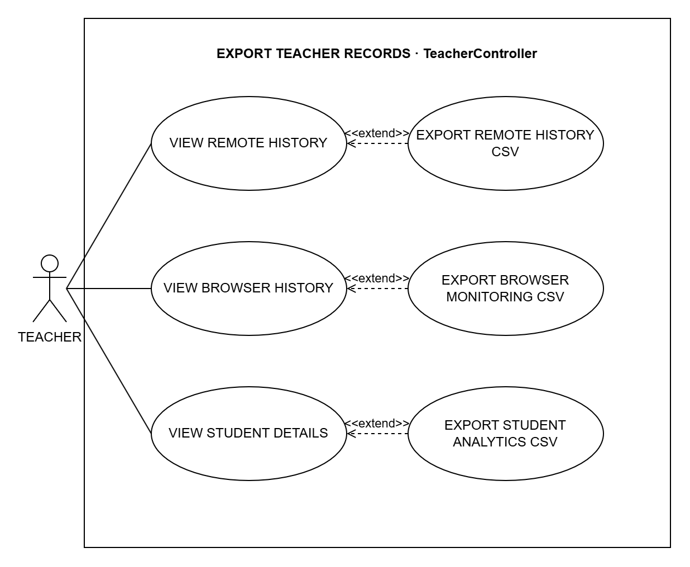

*Figure 3.23: System Use Case for Export Teacher Records*

**Written Use Case:** Export Teacher Records  
**Use Case Name:** View Remote History, View Browser History, View Student Details  
**Purpose:** To allow the Teacher to view the remote commands sent, the websites the students opened, and one student's activity, and to download them as CSV files.  
**Actors:** Teacher

**Input Parameters:**

- Date, command, student or browser filters (optional)
- Selected student

**Output Parameters:**

- Remote History, Browser History or student details page
- CSV file

**Pre-Condition:**

- The Teacher must be logged in to the system.

**Post-Condition:**

- The records are displayed in the system.
- The CSV file is downloaded when the Teacher exports. Nothing is changed.

**Successful Scenario:**

1. The Teacher navigates to the Remote History page, the Browser History page or a student's details page.
2. The Teacher may set the filters.
3. The system displays the records.
4. To download a file, the Teacher clicks the export button on the page (Export Remote History CSV, Export Browser Monitoring CSV or Export Student Analytics CSV).
5. The system creates the CSV file and the browser downloads it.

**Exception Scenario:**

- If nothing matches the filters:
    - The system displays an empty list.
    - The CSV file contains only the column names.

**Additional Remarks:**

- Each export extends its page: it is optional and happens only while the page is open.

# STUDENT

## Log In at Workstation

*Figure 3.24: System Use Case for Log In at Workstation*

**Written Use Case:** Log In at Workstation  
**Use Case Name:** Log In to Workstation  
**Purpose:** To allow the Student to log in on a lab computer and join the lab session.  
**Actors:** Student

**Input Parameters:**

- Username
- Password
- Server address (only when the app cannot find the server)

**Output Parameters:**

- Session screen in the CAMS student app
- Login error message

**Pre-Condition:**

- The Teacher must have started the lab session.
- The CAMS student app must be installed on the lab computer.

**Post-Condition:**

- The Student is in the lab session, and the screen is monitored.

**Successful Scenario:**

1. The Student opens the CAMS student app.
2. The app finds the CAMS server on the school network (Find Lab Server).
3. The Student enters their username and password.
4. The Student clicks the "Sign in" button.
5. The system validates the account.
6. The system starts the Student's session and the app displays the session screen.

**Exception Scenario:**

- If the app cannot find the server:
    - The Student types the address given by the Teacher.
    - The Student clicks Save and retry (Set Server Address).
- If the username or password is incorrect:
    - The app displays an error message.
    - The Student is allowed to try again.
- If no lab session is running:
    - The app tells the Student to wait for the Teacher.
- If the Student enters a wrong password 5 times:
    - The system locks the account for 15 minutes.

**Additional Remarks:**

- Log In to Workstation always includes Find Lab Server.
- Set Server Address extends Log In to Workstation: it is optional.

## Log Out at Workstation

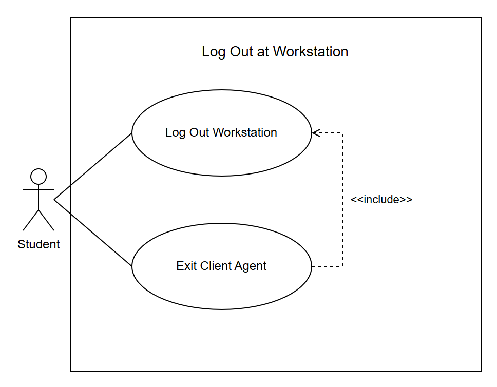

*Figure 3.25: System Use Case for Log Out at Workstation*

**Written Use Case:** Log Out at Workstation  
**Use Case Name:** Log Out of Workstation, Exit Client Agent  
**Purpose:** To allow the Student to log out of the lab computer, or close the CAMS student app.  
**Actors:** Student

**Input Parameters:**

- None

**Output Parameters:**

- Login screen, or the app closes

**Pre-Condition:**

- The Student must be logged in on the lab computer.

**Post-Condition:**

- The Student's session ends and the computer is free for the next student.

**Successful Scenario:**

1. To log out, the Student clicks Sign out in the app.
2. To close the app, the Student right-clicks the CAMS icon and clicks Exit.
3. The system ends the Student's session.
4. The app displays the login screen, or closes if the Student chose Exit.

**Exception Scenario:**

- If the server cannot be reached:
    - The app still closes.
    - The Teacher can end the session instead.

**Additional Remarks:**

- Exit Client Agent always includes Log Out of Workstation.

## Change Password at Workstation

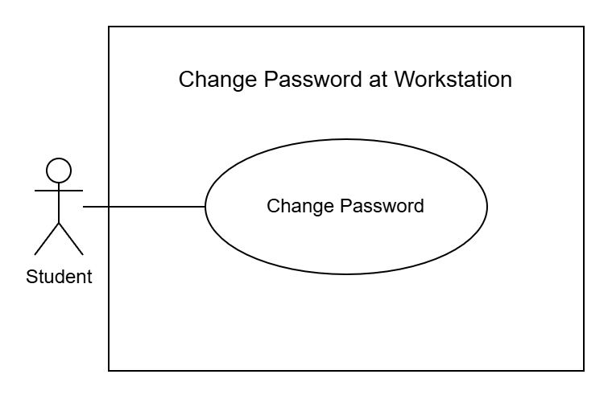

*Figure 3.26: System Use Case for Change Password at Workstation*

**Written Use Case:** Change Password at Workstation  
**Use Case Name:** Change Password  
**Purpose:** To allow the Student to change their own password in the CAMS student app.  
**Actors:** Student

**Input Parameters:**

- Current password
- New password
- Confirm new password

**Output Parameters:**

- Success or error message

**Pre-Condition:**

- The Student must be logged in on a lab computer.

**Post-Condition:**

- The new password is saved.
- The Student must use the new password at the next login.

**Successful Scenario:**

1. The Student clicks Change password in the app.
2. The Student enters the current password.
3. The Student enters the new password and enters it again to confirm.
4. The system validates the passwords.
5. The system saves the new password and displays a success message.

**Exception Scenario:**

- If the current password is incorrect:
    - The system displays an error message.
- If the new password has fewer than 8 characters, or is the same as the old one:
    - The system displays an error message.
    - The Student is asked to enter it again.
- If the Student enters a wrong current password 5 times:
    - The Student must wait a minute before trying again.

**Additional Remarks:**

- Students change their password only in the app, not on the website.
