# CAMS Written Use Cases

A written specification for every use case in [`CAMS-Use-Case-Diagram.drawio`](CAMS-Use-Case-Diagram.drawio), set out in the ten fields the course handout uses: use case name, purpose, actors, input parameters, output parameters, pre-condition, post-condition, successful scenario, exception scenario and additional remarks.

**182 use cases** across 27 modules. Only what a person does with the system is written up: a behaviour the system performs on its own - a page polling for fresh data, the client agent reporting a screen frame or discovering the server - is part of the use case a person starts, not a use case of its own. Nothing is deleted: where a record can be taken out of use, the use case is TOGGLE ... STATUS, which keeps the record and its history and can be switched back. Each name is strict verb-noun and maps to the function that implements it; the inputs, HTTP verb and authorisation rule in each specification are read out of that function rather than written from memory, so a specification cannot claim a parameter the action does not take.

| Actor | Use cases | Modules |
| --- | ---: | ---: |
| Admin | 82 | 17 |
| Teacher | 93 | 18 |
| Student | 7 | 3 |

---

## Contents

**ADMIN**  
- PROCESS LOG IN — A-001, A-002
- VIEW ADMIN HOME — A-003, A-004, A-005, A-006
- MANAGE ADMIN ACCOUNT — A-007, A-008, A-009
- MANAGE TEACHER ACCOUNT — A-010, A-011, A-012, A-013, A-014
- MANAGE STUDENT ACCOUNT — A-015, A-016, A-017, A-018, A-019, A-020
- MANAGE COMPUTER PROFILE — A-021, A-022, A-023, A-024, A-025, A-026
- MANAGE CLASS — A-027, A-028, A-029, A-030, A-031
- MANAGE CLASS ROSTER — A-032, A-033, A-034, A-035, A-036, A-037
- MANAGE RESTRICTION RULE — A-038, A-039, A-040, A-041
- MANAGE BLACKLIST AND WHITELIST — A-042, A-043, A-044, A-045, A-046, A-047, A-048, A-049
- MANAGE CATEGORY — A-050, A-051, A-052, A-053, A-054, A-055
- MANAGE SESSION RULE — A-056, A-057, A-058, A-059
- MANAGE ROLE AND PERMISSION — A-060, A-061
- CONTROL LABORATORY SESSION — A-062, A-063, A-064
- VIEW REPORTS AND LOGS — A-065, A-066, A-067, A-068, A-069, A-070, A-071, A-072, A-073
- MANAGE DATABASE — A-074, A-075, A-076, A-077
- MANAGE DEPLOYMENT — A-078, A-079, A-080, A-081, A-082

**TEACHER**  
- PROCESS LOG IN — T-083, T-084
- MANAGE OWN ACCOUNT — T-085, T-086
- MANAGE PEER TEACHER ACCOUNT — T-087, T-088, T-089, T-090, T-091
- MANAGE STUDENT ACCOUNT — T-092, T-093, T-094, T-095, T-096, T-097
- MANAGE COMPUTER PROFILE — T-098, T-099, T-100, T-101, T-102, T-103
- MANAGE CLASS — T-104, T-105, T-106, T-107, T-108
- MANAGE CLASS ROSTER — T-109, T-110, T-111, T-112, T-113
- MANAGE RESTRICTION RULE — T-114, T-115, T-116, T-117
- MANAGE BLACKLIST AND WHITELIST — T-118, T-119, T-120, T-121, T-122, T-123, T-124, T-125
- MANAGE CATEGORY — T-126, T-127, T-128, T-129, T-130, T-131
- MANAGE SESSION RULE — T-132, T-133, T-134, T-135
- CONTROL LABORATORY SESSION — T-136, T-137, T-138
- CONTROL STUDENT SESSION — T-139, T-140, T-141, T-142
- MONITOR STUDENT SCREEN — T-143
- CONTROL STUDENT WORKSTATION — T-144, T-145, T-146, T-147, T-148, T-149, T-150, T-151, T-152, T-153
- SEND MESSAGE TO STUDENT — T-154, T-155, T-156, T-157
- MANAGE MONITORING ALERT — T-158, T-159, T-160, T-161, T-162, T-163, T-164
- VIEW TEACHER RECORDS — T-165, T-166, T-167, T-168, T-169, T-170, T-171, T-172, T-173, T-174, T-175

**STUDENT**  
- LOG IN AT WORKSTATION — S-176, S-177, S-178
- MANAGE OWN ACCOUNT — S-179
- USE THE CLIENT AGENT — S-180, S-181, S-182

---

# ADMIN

## PROCESS LOG IN  ·  `AccountController`

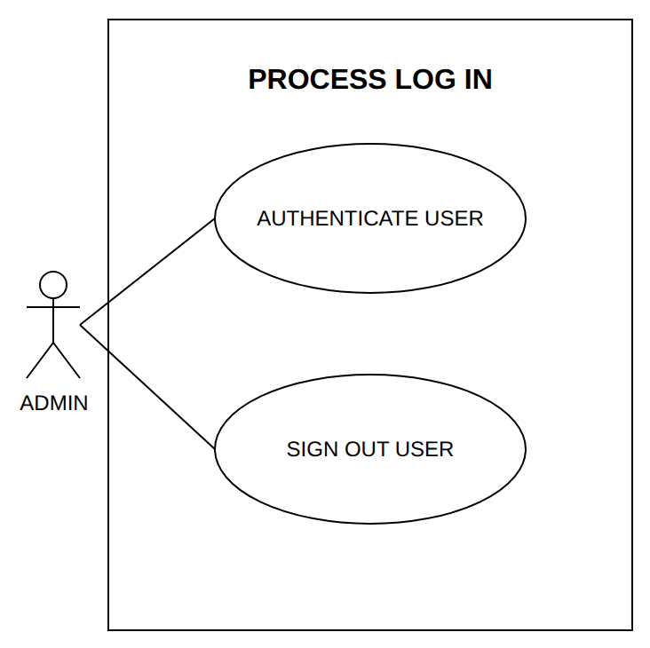

*Figure 3.1: System Use Case for process log in*

### A-001  ·  AUTHENTICATE USER

**Use Case Name:** AUTHENTICATE USER  
**Purpose:** Let a person sign in to the CAMS web portal with a username and password, and place them in the part of the system their role allows.  
**Actors:**

- Admin (Primary Actor)

**Input Parameters:**

- `username` : `string`
- `password` : `string`

**Output Parameters:**

- An authentication cookie carrying the account role as a claim, and a redirect to the landing page for that role.

**Pre-Condition:**

- None. This is the sign-in endpoint and is reachable without an account session; the CAMS server must be running and reachable.

**Post-Condition:**

- The change is committed to the database and visible to the next read.
- The caller sees the outcome reported on the page they return to.

**Successful Scenario:**

1. The Admin opens the CAMS sign-in page.
2. The Admin enters a username and a password and submits the form.
3. The server validates the antiforgery token that accompanied the form.
4. The server checks the credentials against each account table in turn and finds the matching account.
5. The server confirms the account is active and not locked out.
6. The server issues an authentication cookie carrying the role as a claim.
7. The Admin is redirected to the landing page for that role.

**Exception Scenario:**

- **The username matches no account** — the page reports that the sign-in failed, without saying which half was wrong.
- **The password does not match the stored hash** — the failed-attempt counter is raised and the same message is shown.
- **The account is locked out** — the sign-in is refused until the lockout expires, even with the right password.
- **The account is deactivated** — the sign-in is refused and the person is told to contact an administrator.

**Additional Remarks:**

- Implemented by `AccountController.Login` (POST).
- Appears in the *PROCESS LOG IN* module of the use case diagram.

### A-002  ·  SIGN OUT USER

**Use Case Name:** SIGN OUT USER  
**Purpose:** End the signed-in session and clear the authentication cookie, so the next visitor to the browser starts as an anonymous user.  
**Actors:**

- Admin (Primary Actor)

**Input Parameters:**

- None beyond the signed-in identity carried on the authentication cookie.

**Output Parameters:**

- The authentication cookie is cleared and the browser is returned to the sign-in page.

**Pre-Condition:**

- The caller is signed in.

**Post-Condition:**

- The change is committed to the database and visible to the next read.
- The caller sees the outcome reported on the page they return to.

**Successful Scenario:**

1. The Admin chooses to sign out.
2. The server closes any lab session the account still has open.
3. The server clears the authentication cookie.
4. The browser is returned to the sign-in page as an anonymous visitor.

**Exception Scenario:**

- **Not signed in or wrong role** — the request is refused and the caller is sent to the access denied page.
- **Validation fails** — the form is redisplayed with the offending fields marked and nothing is written.

**Additional Remarks:**

- Implemented by `AccountController.Logout` (POST).
- Appears in the *PROCESS LOG IN* module of the use case diagram.

## VIEW ADMIN HOME  ·  `AdminController`

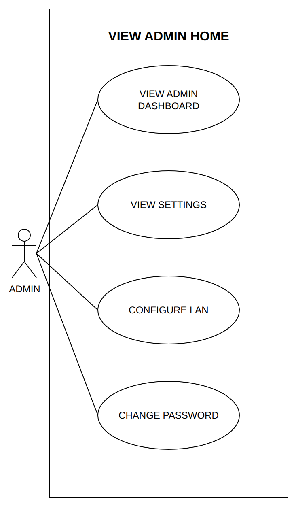

*Figure 3.2: System Use Case for view admin home*

### A-003  ·  VIEW ADMIN DASHBOARD

**Use Case Name:** VIEW ADMIN DASHBOARD  
**Purpose:** Show the administrator landing page, summarising the state of the laboratory.  
**Actors:**

- Admin (Primary Actor)

**Input Parameters:**

- None beyond the signed-in identity carried on the authentication cookie.

**Output Parameters:**

- The rendered page, or a JSON payload where the caller is the page’s own script.

**Pre-Condition:**

- The caller is signed in as an administrator or a teacher. A teacher reaches this action only because it carries `[TeacherSharedAction]`; the teacher account must also be active.

**Post-Condition:**

- The caller has the requested information. Nothing in the database has changed.

**Successful Scenario:**

1. The Admin opens the page and CAMS confirms the role on the authentication cookie.
2. The server reads the records the caller is entitled to see.
3. The page renders with those records.

**Exception Scenario:**

- **Not signed in or wrong role** — the request is refused and the caller is sent to the access denied page.

**Additional Remarks:**

- Implemented by `AdminController.Index` (GET).
- Appears in the *VIEW ADMIN HOME* module of the use case diagram.

### A-004  ·  VIEW SETTINGS

**Use Case Name:** VIEW SETTINGS  
**Purpose:** Show the settings page for the signed-in user.  
**Actors:**

- Admin (Primary Actor)

**Input Parameters:**

- None beyond the signed-in identity carried on the authentication cookie.

**Output Parameters:**

- The rendered page, or a JSON payload where the caller is the page’s own script.

**Pre-Condition:**

- The caller is signed in as an administrator or a teacher.

**Post-Condition:**

- The caller has the requested information. Nothing in the database has changed.

**Successful Scenario:**

1. The Admin opens the page and CAMS confirms the role on the authentication cookie.
2. The server reads the records the caller is entitled to see.
3. The page renders with those records.

**Exception Scenario:**

- **Not signed in or wrong role** — the request is refused and the caller is sent to the access denied page.

**Additional Remarks:**

- Implemented by `AdminController.Settings` (GET).
- Appears in the *VIEW ADMIN HOME* module of the use case diagram.

### A-005  ·  CONFIGURE LAN

**Use Case Name:** CONFIGURE LAN  
**Purpose:** Show the network configuration the server detected, as a read-only diagnostic.  
**Actors:**

- Admin (Primary Actor)

**Input Parameters:**

- None beyond the signed-in identity carried on the authentication cookie.

**Output Parameters:**

- The rendered page, or a JSON payload where the caller is the page’s own script.

**Pre-Condition:**

- The caller is signed in as an administrator or a teacher.

**Post-Condition:**

- The caller has the requested information. Nothing in the database has changed.

**Successful Scenario:**

1. The Admin opens the page and CAMS confirms the role on the authentication cookie.
2. The server reads the records the caller is entitled to see.
3. The page renders with those records.

**Exception Scenario:**

- **Not signed in or wrong role** — the request is refused and the caller is sent to the access denied page.

**Additional Remarks:**

- Implemented by `AdminController.LanConfig` (GET).
- Appears in the *VIEW ADMIN HOME* module of the use case diagram.

### A-006  ·  CHANGE PASSWORD

**Use Case Name:** CHANGE PASSWORD  
**Purpose:** Let the signed-in user replace their own password after proving they know the current one.  
**Actors:**

- Admin (Primary Actor)

**Input Parameters:**

- `input` : `PasswordChangeInput`

**Output Parameters:**

- A redirect back to the listing page, carrying a success or failure message for display.

**Pre-Condition:**

- The caller is signed in as an administrator or a teacher.

**Post-Condition:**

- The change is committed to the database and visible to the next read.
- The caller sees the outcome reported on the page they return to.

**Successful Scenario:**

1. The Admin opens the page and CAMS confirms the role on the authentication cookie.
2. The Admin fills the form and submits it.
3. The server validates the antiforgery token that accompanied the form.
4. The server validates the submitted values against the model rules.
5. The change is written to the database through `ApplicationDbContext`.
6. The server redirects back to the listing, where the result is shown.

**Exception Scenario:**

- **Not signed in or wrong role** — the request is refused and the caller is sent to the access denied page.
- **Missing or stale antiforgery token** — the submission is rejected and must be retried from a freshly loaded form.
- **Validation fails** — the form is redisplayed with the offending fields marked and nothing is written.

**Additional Remarks:**

- Implemented by `AdminController.ChangePassword` (POST).
- Appears in the *VIEW ADMIN HOME* module of the use case diagram.

## MANAGE ADMIN ACCOUNT  ·  `AdminController`

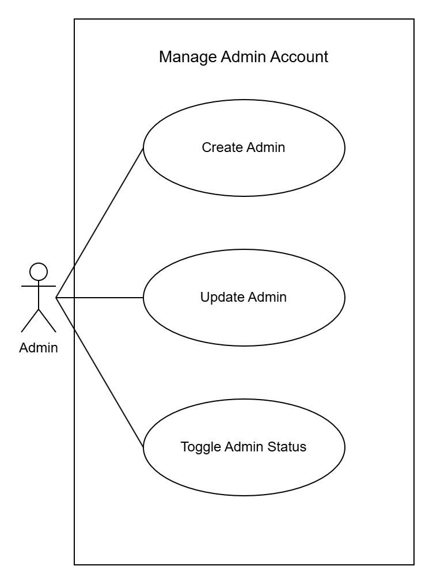

*Figure 3.3: System Use Case for manage admin account*

### A-007  ·  CREATE ADMIN

**Use Case Name:** CREATE ADMIN  
**Purpose:** Record a new administrator account in the system.  
**Actors:**

- Admin (Primary Actor)

**Input Parameters:**

- `admin` : `Admin`

**Output Parameters:**

- A redirect back to the listing page, carrying a success or failure message for display.

**Pre-Condition:**

- The caller is signed in as an administrator or a teacher.

**Post-Condition:**

- The change is committed to the database and visible to the next read.
- The caller sees the outcome reported on the page they return to.

**Successful Scenario:**

1. The Admin opens the page and CAMS confirms the role on the authentication cookie.
2. The Admin fills the form and submits it.
3. The server validates the antiforgery token that accompanied the form.
4. The server validates the submitted values against the model rules.
5. The change is written to the database through `ApplicationDbContext`.
6. The server redirects back to the listing, where the result is shown.

**Exception Scenario:**

- **Not signed in or wrong role** — the request is refused and the caller is sent to the access denied page.
- **Missing or stale antiforgery token** — the submission is rejected and must be retried from a freshly loaded form.
- **Validation fails** — the form is redisplayed with the offending fields marked and nothing is written.

**Additional Remarks:**

- Implemented by `AdminController.CreateAdmin` (POST).
- Appears in the *MANAGE ADMIN ACCOUNT* module of the use case diagram.

### A-008  ·  UPDATE ADMIN

**Use Case Name:** UPDATE ADMIN  
**Purpose:** Amend the stored details of an existing administrator account.  
**Actors:**

- Admin (Primary Actor)

**Input Parameters:**

- `admin` : `Admin`
- `newPassword` : `string?`

**Output Parameters:**

- A redirect back to the listing page, carrying a success or failure message for display.

**Pre-Condition:**

- The caller is signed in as an administrator or a teacher.

**Post-Condition:**

- The change is committed to the database and visible to the next read.
- The caller sees the outcome reported on the page they return to.

**Successful Scenario:**

1. The Admin opens the page and CAMS confirms the role on the authentication cookie.
2. The Admin fills the form and submits it.
3. The server validates the antiforgery token that accompanied the form.
4. The server validates the submitted values against the model rules.
5. The change is written to the database through `ApplicationDbContext`.
6. The server redirects back to the listing, where the result is shown.

**Exception Scenario:**

- **Not signed in or wrong role** — the request is refused and the caller is sent to the access denied page.
- **Missing or stale antiforgery token** — the submission is rejected and must be retried from a freshly loaded form.
- **Validation fails** — the form is redisplayed with the offending fields marked and nothing is written.

**Additional Remarks:**

- Implemented by `AdminController.UpdateAdmin` (POST).
- Appears in the *MANAGE ADMIN ACCOUNT* module of the use case diagram.

### A-009  ·  TOGGLE ADMIN STATUS

**Use Case Name:** TOGGLE ADMIN STATUS  
**Purpose:** Activate or deactivate an administrator account instead of deleting it, so the person can no longer sign in while every record they made is kept.  
**Actors:**

- Admin (Primary Actor)

**Input Parameters:**

- `accountRole` : `AccountRole` (Admin)
- `id` : `int`
- `isActive` : `bool`

**Output Parameters:**

- A redirect back to the listing page, carrying a success or failure message for display.

**Pre-Condition:**

- The caller is signed in as an administrator. A teacher who names an administrator account is refused.
- The administrator account named by the identifier exists.

**Post-Condition:**

- The new status is committed; a deactivated administrator cannot sign in until reactivated.
- The record stays in the database with its history; only its status changes, so it can be switched back at any time.

**Successful Scenario:**

1. The Admin opens the Settings page and CAMS confirms the role on the authentication cookie.
2. The Admin chooses Activate or Deactivate beside an administrator account and confirms the prompt.
3. The server validates the antiforgery token that accompanied the form.
4. The server sets the account's `IsActive` flag, saves it and writes an audit entry.
5. The server redirects back to the Settings page, where the new status is shown.

**Exception Scenario:**

- **Not signed in or wrong role** — the request is refused and the caller is sent to the access denied page.
- **Missing or stale antiforgery token** — the submission is rejected and must be retried from a freshly loaded form.
- **The identifier matches no record** — the action reports that the record was not found and makes no change.
- **The last active administrator** — deactivation is refused so CAMS is never left without an administrator.

**Additional Remarks:**

- Implemented by `AdminController.SetAccountActive` (POST).
- Replaces the delete use case: CAMS keeps the record and changes its status, so history is never lost.
- Appears in the *MANAGE ADMIN ACCOUNT* module of the use case diagram.

## MANAGE TEACHER ACCOUNT  ·  `AdminController`

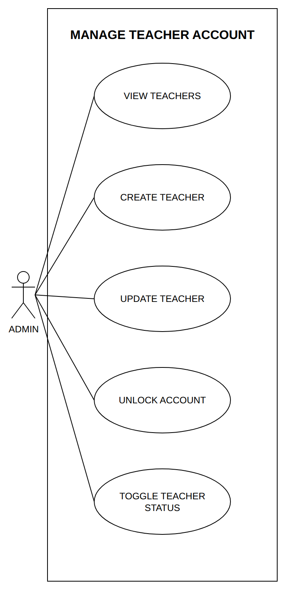

*Figure 3.4: System Use Case for manage teacher account*

### A-010  ·  VIEW TEACHERS

**Use Case Name:** VIEW TEACHERS  
**Purpose:** List the teachers the signed-in user is allowed to see.  
**Actors:**

- Admin (Primary Actor)

**Input Parameters:**

- None beyond the signed-in identity carried on the authentication cookie.

**Output Parameters:**

- The rendered page, or a JSON payload where the caller is the page’s own script.

**Pre-Condition:**

- The caller is signed in as an administrator or a teacher. A teacher reaches this action only because it carries `[TeacherSharedAction]`; the teacher account must also be active.

**Post-Condition:**

- The caller has the requested information. Nothing in the database has changed.

**Successful Scenario:**

1. The Admin opens the page and CAMS confirms the role on the authentication cookie.
2. The server reads the records the caller is entitled to see.
3. The page renders with those records.

**Exception Scenario:**

- **Not signed in or wrong role** — the request is refused and the caller is sent to the access denied page.

**Additional Remarks:**

- Implemented by `AdminController.Teachers` (GET).
- Appears in the *MANAGE TEACHER ACCOUNT* module of the use case diagram.

### A-011  ·  CREATE TEACHER

**Use Case Name:** CREATE TEACHER  
**Purpose:** Record a new teacher account in the system.  
**Actors:**

- Admin (Primary Actor)

**Input Parameters:**

- `teacher` : `Teacher`

**Output Parameters:**

- A redirect back to the listing page, carrying a success or failure message for display.

**Pre-Condition:**

- The caller is signed in as an administrator or a teacher. A teacher reaches this action only because it carries `[TeacherSharedAction]`; the teacher account must also be active.

**Post-Condition:**

- The change is committed to the database and visible to the next read.
- The caller sees the outcome reported on the page they return to.

**Successful Scenario:**

1. The Admin opens the page and CAMS confirms the role on the authentication cookie.
2. The Admin fills the form and submits it.
3. The server validates the antiforgery token that accompanied the form.
4. The server validates the submitted values against the model rules.
5. The change is written to the database through `ApplicationDbContext`.
6. The server redirects back to the listing, where the result is shown.

**Exception Scenario:**

- **Not signed in or wrong role** — the request is refused and the caller is sent to the access denied page.
- **Missing or stale antiforgery token** — the submission is rejected and must be retried from a freshly loaded form.
- **Validation fails** — the form is redisplayed with the offending fields marked and nothing is written.

**Additional Remarks:**

- Implemented by `AdminController.CreateTeacher` (POST).
- Appears in the *MANAGE TEACHER ACCOUNT* module of the use case diagram.

### A-012  ·  UPDATE TEACHER

**Use Case Name:** UPDATE TEACHER  
**Purpose:** Amend the stored details of an existing teacher account.  
**Actors:**

- Admin (Primary Actor)

**Input Parameters:**

- `teacher` : `Teacher`
- `newPassword` : `string?`

**Output Parameters:**

- A redirect back to the listing page, carrying a success or failure message for display.

**Pre-Condition:**

- The caller is signed in as an administrator or a teacher. A teacher reaches this action only because it carries `[TeacherSharedAction]`; the teacher account must also be active.

**Post-Condition:**

- The change is committed to the database and visible to the next read.
- The caller sees the outcome reported on the page they return to.

**Successful Scenario:**

1. The Admin opens the page and CAMS confirms the role on the authentication cookie.
2. The Admin fills the form and submits it.
3. The server validates the antiforgery token that accompanied the form.
4. The server validates the submitted values against the model rules.
5. The change is written to the database through `ApplicationDbContext`.
6. The server redirects back to the listing, where the result is shown.

**Exception Scenario:**

- **Not signed in or wrong role** — the request is refused and the caller is sent to the access denied page.
- **Missing or stale antiforgery token** — the submission is rejected and must be retried from a freshly loaded form.
- **Validation fails** — the form is redisplayed with the offending fields marked and nothing is written.

**Additional Remarks:**

- Implemented by `AdminController.UpdateTeacher` (POST).
- Appears in the *MANAGE TEACHER ACCOUNT* module of the use case diagram.

### A-013  ·  UNLOCK ACCOUNT

**Use Case Name:** UNLOCK ACCOUNT  
**Purpose:** Clear the lockout on an account that has been locked by repeated failed sign-in attempts.  
**Actors:**

- Admin (Primary Actor)

**Input Parameters:**

- `accountRole` : `AccountRole`
- `id` : `int`

**Output Parameters:**

- A redirect back to the listing page, carrying a success or failure message for display.

**Pre-Condition:**

- The caller is signed in as an administrator or a teacher. A teacher reaches this action only because it carries `[TeacherSharedAction]`; the teacher account must also be active.
- The record named by the identifier exists.

**Post-Condition:**

- The change is committed to the database and visible to the next read.
- The caller sees the outcome reported on the page they return to.

**Successful Scenario:**

1. The Admin opens the page and CAMS confirms the role on the authentication cookie.
2. The Admin fills the form and submits it.
3. The server validates the antiforgery token that accompanied the form.
4. The server validates the submitted values against the model rules.
5. The change is written to the database through `ApplicationDbContext`.
6. The server redirects back to the listing, where the result is shown.

**Exception Scenario:**

- **Not signed in or wrong role** — the request is refused and the caller is sent to the access denied page.
- **Missing or stale antiforgery token** — the submission is rejected and must be retried from a freshly loaded form.
- **Validation fails** — the form is redisplayed with the offending fields marked and nothing is written.
- **The identifier matches no record** — the action reports that the record was not found and makes no change.

**Additional Remarks:**

- Implemented by `AdminController.UnlockAccount` (POST).
- Appears in the *MANAGE TEACHER ACCOUNT* module of the use case diagram.

### A-014  ·  TOGGLE TEACHER STATUS

**Use Case Name:** TOGGLE TEACHER STATUS  
**Purpose:** Activate or deactivate a teacher account instead of deleting it, so the teacher can no longer sign in while their classes, sessions and records are kept.  
**Actors:**

- Admin (Primary Actor)

**Input Parameters:**

- `accountRole` : `AccountRole` (Teacher)
- `id` : `int`
- `isActive` : `bool`

**Output Parameters:**

- A redirect back to the listing page, carrying a success or failure message for display.

**Pre-Condition:**

- The caller is signed in as an administrator or a teacher. A teacher reaches this action only because it carries `[TeacherSharedAction]`; the teacher account must also be active.
- The record named by the identifier exists.

**Post-Condition:**

- The new status is committed; an inactive teacher cannot sign in until reactivated.
- The record stays in the database with its history; only its status changes, so it can be switched back at any time.

**Successful Scenario:**

1. The Admin opens the Teachers page and CAMS confirms the role on the authentication cookie.
2. The Admin chooses Activate or Deactivate beside a teacher account and confirms the prompt.
3. The server validates the antiforgery token that accompanied the form.
4. The server sets the account's `Status` to Active or Inactive, saves it and writes an audit entry.
5. The server redirects back to the Teachers page, where the new status is shown.

**Exception Scenario:**

- **Not signed in or wrong role** — the request is refused and the caller is sent to the access denied page.
- **Missing or stale antiforgery token** — the submission is rejected and must be retried from a freshly loaded form.
- **The identifier matches no record** — the action reports that the record was not found and makes no change.
- **The teacher still has active classes** — deactivation is refused until those classes are reassigned or archived.
- **A teacher deactivating their own account, or the last active teacher** — the change is refused and the reason is shown.

**Additional Remarks:**

- Implemented by `AdminController.SetAccountActive` (POST).
- Replaces the delete use case: CAMS keeps the record and changes its status, so history is never lost.
- Appears in the *MANAGE TEACHER ACCOUNT* module of the use case diagram.

## MANAGE STUDENT ACCOUNT  ·  `AdminController`

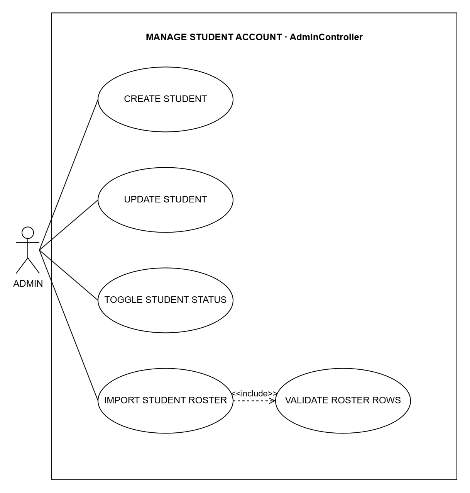

*Figure 3.5: System Use Case for manage student account*

### A-015  ·  VIEW STUDENTS

**Use Case Name:** VIEW STUDENTS  
**Purpose:** List the students the signed-in user is allowed to see.  
**Actors:**

- Admin (Primary Actor)

**Input Parameters:**

- None beyond the signed-in identity carried on the authentication cookie.

**Output Parameters:**

- The rendered page, or a JSON payload where the caller is the page’s own script.

**Pre-Condition:**

- The caller is signed in as an administrator or a teacher. A teacher reaches this action only because it carries `[TeacherSharedAction]`; the teacher account must also be active.

**Post-Condition:**

- The caller has the requested information. Nothing in the database has changed.

**Successful Scenario:**

1. The Admin opens the page and CAMS confirms the role on the authentication cookie.
2. The server reads the records the caller is entitled to see.
3. The page renders with those records.

**Exception Scenario:**

- **Not signed in or wrong role** — the request is refused and the caller is sent to the access denied page.

**Additional Remarks:**

- Implemented by `AdminController.Students` (GET).
- Appears in the *MANAGE STUDENT ACCOUNT* module of the use case diagram.

### A-016  ·  CREATE STUDENT

**Use Case Name:** CREATE STUDENT  
**Purpose:** Record a new student account in the system.  
**Actors:**

- Admin (Primary Actor)

**Input Parameters:**

- `student` : `Student`

**Output Parameters:**

- A redirect back to the listing page, carrying a success or failure message for display.

**Pre-Condition:**

- The caller is signed in as an administrator or a teacher. A teacher reaches this action only because it carries `[TeacherSharedAction]`; the teacher account must also be active.

**Post-Condition:**

- The change is committed to the database and visible to the next read.
- The caller sees the outcome reported on the page they return to.

**Successful Scenario:**

1. The Admin opens the page and CAMS confirms the role on the authentication cookie.
2. The Admin fills the form and submits it.
3. The server validates the antiforgery token that accompanied the form.
4. The server validates the submitted values against the model rules.
5. The change is written to the database through `ApplicationDbContext`.
6. The server redirects back to the listing, where the result is shown.

**Exception Scenario:**

- **Not signed in or wrong role** — the request is refused and the caller is sent to the access denied page.
- **Missing or stale antiforgery token** — the submission is rejected and must be retried from a freshly loaded form.
- **Validation fails** — the form is redisplayed with the offending fields marked and nothing is written.

**Additional Remarks:**

- Implemented by `AdminController.CreateStudent` (POST).
- Appears in the *MANAGE STUDENT ACCOUNT* module of the use case diagram.

### A-017  ·  UPDATE STUDENT

**Use Case Name:** UPDATE STUDENT  
**Purpose:** Amend the stored details of an existing student account.  
**Actors:**

- Admin (Primary Actor)

**Input Parameters:**

- `student` : `Student`
- `newPassword` : `string?`

**Output Parameters:**

- A redirect back to the listing page, carrying a success or failure message for display.

**Pre-Condition:**

- The caller is signed in as an administrator or a teacher. A teacher reaches this action only because it carries `[TeacherSharedAction]`; the teacher account must also be active.

**Post-Condition:**

- The change is committed to the database and visible to the next read.
- The caller sees the outcome reported on the page they return to.

**Successful Scenario:**

1. The Admin opens the page and CAMS confirms the role on the authentication cookie.
2. The Admin fills the form and submits it.
3. The server validates the antiforgery token that accompanied the form.
4. The server validates the submitted values against the model rules.
5. The change is written to the database through `ApplicationDbContext`.
6. The server redirects back to the listing, where the result is shown.

**Exception Scenario:**

- **Not signed in or wrong role** — the request is refused and the caller is sent to the access denied page.
- **Missing or stale antiforgery token** — the submission is rejected and must be retried from a freshly loaded form.
- **Validation fails** — the form is redisplayed with the offending fields marked and nothing is written.

**Additional Remarks:**

- Implemented by `AdminController.UpdateStudent` (POST).
- Appears in the *MANAGE STUDENT ACCOUNT* module of the use case diagram.

### A-018  ·  TOGGLE STUDENT STATUS

**Use Case Name:** TOGGLE STUDENT STATUS  
**Purpose:** Activate or deactivate a student account instead of deleting it, so the student cannot sign in at a workstation while their attendance and activity history are kept.  
**Actors:**

- Admin (Primary Actor)

**Input Parameters:**

- `accountRole` : `AccountRole` (Student)
- `id` : `int`
- `isActive` : `bool`

**Output Parameters:**

- A redirect back to the listing page, carrying a success or failure message for display.

**Pre-Condition:**

- The caller is signed in as an administrator or a teacher. A teacher reaches this action only because it carries `[TeacherSharedAction]`; the teacher account must also be active.
- The record named by the identifier exists.

**Post-Condition:**

- The new status is committed; an inactive student cannot sign in at a workstation until reactivated.
- The record stays in the database with its history; only its status changes, so it can be switched back at any time.

**Successful Scenario:**

1. The Admin opens the Students page and CAMS confirms the role on the authentication cookie.
2. The Admin chooses Activate or Deactivate beside a student and confirms the prompt.
3. The server validates the antiforgery token that accompanied the form.
4. The server sets the account's `Status` to Active or Inactive, saves it and writes an audit entry.
5. The server redirects back to the Students page, where the new status is shown.

**Exception Scenario:**

- **Not signed in or wrong role** — the request is refused and the caller is sent to the access denied page.
- **Missing or stale antiforgery token** — the submission is rejected and must be retried from a freshly loaded form.
- **The identifier matches no record** — the action reports that the record was not found and makes no change.

**Additional Remarks:**

- Implemented by `AdminController.SetAccountActive` (POST).
- Replaces the delete use case: CAMS keeps the record and changes its status, so history is never lost.
- Appears in the *MANAGE STUDENT ACCOUNT* module of the use case diagram.

### A-019  ·  IMPORT STUDENT ROSTER

**Use Case Name:** IMPORT STUDENT ROSTER  
**Purpose:** Create many student accounts in one operation from pasted or uploaded CSV rows.  
**Actors:**

- Admin (Primary Actor)

**Input Parameters:**

- `bulkFirstNames` : `List<string>?`
- `bulkLastNames` : `List<string>?`
- `bulkUserNames` : `List<string>?`
- `bulkPasswords` : `List<string>?`

**Output Parameters:**

- A redirect back to the listing page, carrying a success or failure message for display.

**Pre-Condition:**

- The caller is signed in as an administrator or a teacher. A teacher reaches this action only because it carries `[TeacherSharedAction]`; the teacher account must also be active.

**Post-Condition:**

- The change is committed to the database and visible to the next read.
- The caller sees the outcome reported on the page they return to.

**Successful Scenario:**

1. The Admin opens the page and CAMS confirms the role on the authentication cookie.
2. The Admin fills the form and submits it.
3. The server validates the antiforgery token that accompanied the form.
4. The server validates the submitted values against the model rules.
5. The change is written to the database through `ApplicationDbContext`.
6. The server redirects back to the listing, where the result is shown.

**Exception Scenario:**

- **Not signed in or wrong role** — the request is refused and the caller is sent to the access denied page.
- **Missing or stale antiforgery token** — the submission is rejected and must be retried from a freshly loaded form.
- **Validation fails** — the form is redisplayed with the offending fields marked and nothing is written.

**Additional Remarks:**

- Implemented by `AdminController.BulkCreateStudents` (POST).
- Appears in the *MANAGE STUDENT ACCOUNT* module of the use case diagram.
- Pulls in **PREVIEW ROSTER FILE** (`<<include>>`).

### A-020  ·  PREVIEW ROSTER FILE

**Use Case Name:** PREVIEW ROSTER FILE  
**Purpose:** Parse the submitted CSV and show what would be created, so mistakes are caught before any account exists.  
**Actors:**

- Admin (Primary Actor)
- None; this behaviour runs inside **IMPORT STUDENT ROSTER** (Secondary Actor)

**Input Parameters:**

- `classId` : `int`
- `file` : `IFormFile?`

**Output Parameters:**

- A redirect back to the listing page, carrying a success or failure message for display.

**Pre-Condition:**

- The caller is signed in as an administrator or a teacher. A teacher reaches this action only because it carries `[TeacherSharedAction]`; the teacher account must also be active.
- The record named by the identifier exists.
- **IMPORT STUDENT ROSTER** has reached the point where this is always performed.

**Post-Condition:**

- The change is committed to the database and visible to the next read.
- The caller sees the outcome reported on the page they return to.

**Successful Scenario:**

1. The Admin opens the page and CAMS confirms the role on the authentication cookie.
2. The Admin fills the form and submits it.
3. The server validates the antiforgery token that accompanied the form.
4. The server validates the submitted values against the model rules.
5. The change is written to the database through `ApplicationDbContext`.
6. The server redirects back to the listing, where the result is shown.

**Exception Scenario:**

- **Not signed in or wrong role** — the request is refused and the caller is sent to the access denied page.
- **Missing or stale antiforgery token** — the submission is rejected and must be retried from a freshly loaded form.
- **Validation fails** — the form is redisplayed with the offending fields marked and nothing is written.
- **The identifier matches no record** — the action reports that the record was not found and makes no change.

**Additional Remarks:**

- Implemented by `AdminController.BulkPreviewCsv` (POST).
- Appears in the *MANAGE STUDENT ACCOUNT* module of the use case diagram.
- Drawn as `<<include>>` from **IMPORT STUDENT ROSTER**.

## MANAGE COMPUTER PROFILE  ·  `AdminController`

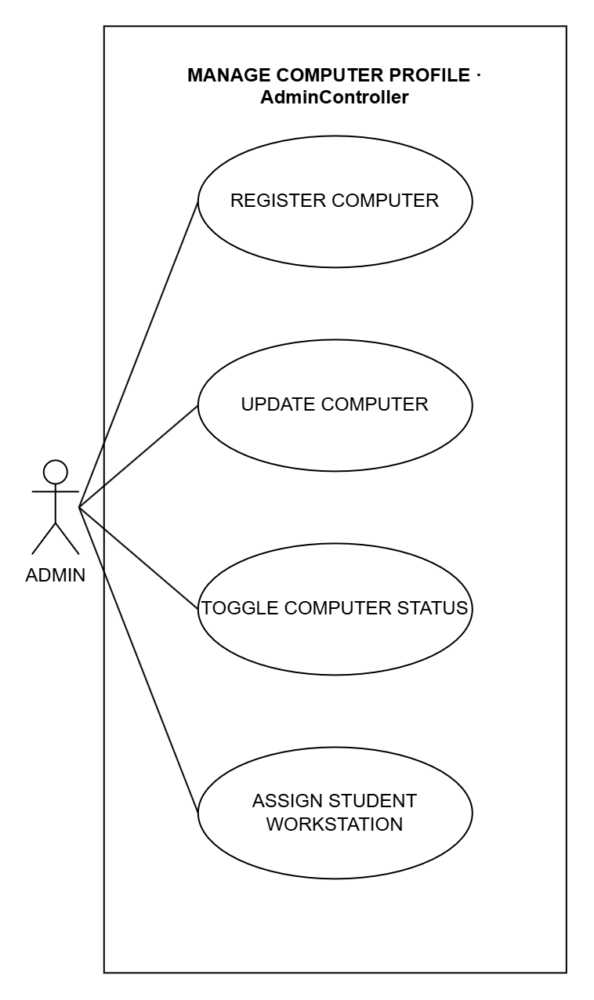

*Figure 3.6: System Use Case for manage computer profile*

### A-021  ·  VIEW COMPUTERS

**Use Case Name:** VIEW COMPUTERS  
**Purpose:** List the computers the signed-in user is allowed to see.  
**Actors:**

- Admin (Primary Actor)

**Input Parameters:**

- None beyond the signed-in identity carried on the authentication cookie.

**Output Parameters:**

- The rendered page, or a JSON payload where the caller is the page’s own script.

**Pre-Condition:**

- The caller is signed in as an administrator or a teacher. A teacher reaches this action only because it carries `[TeacherSharedAction]`; the teacher account must also be active.

**Post-Condition:**

- The caller has the requested information. Nothing in the database has changed.

**Successful Scenario:**

1. The Admin opens the page and CAMS confirms the role on the authentication cookie.
2. The server reads the records the caller is entitled to see.
3. The page renders with those records.

**Exception Scenario:**

- **Not signed in or wrong role** — the request is refused and the caller is sent to the access denied page.

**Additional Remarks:**

- Implemented by `AdminController.Computers` (GET).
- Appears in the *MANAGE COMPUTER PROFILE* module of the use case diagram.

### A-022  ·  REGISTER COMPUTER

**Use Case Name:** REGISTER COMPUTER  
**Purpose:** Record a new workstation profile in the system.  
**Actors:**

- Admin (Primary Actor)

**Input Parameters:**

- `computer` : `Computer`

**Output Parameters:**

- A redirect back to the listing page, carrying a success or failure message for display.

**Pre-Condition:**

- The caller is signed in as an administrator or a teacher. A teacher reaches this action only because it carries `[TeacherSharedAction]`; the teacher account must also be active.

**Post-Condition:**

- The change is committed to the database and visible to the next read.
- The caller sees the outcome reported on the page they return to.

**Successful Scenario:**

1. The Admin opens the page and CAMS confirms the role on the authentication cookie.
2. The Admin fills the form and submits it.
3. The server validates the antiforgery token that accompanied the form.
4. The server validates the submitted values against the model rules.
5. The change is written to the database through `ApplicationDbContext`.
6. The server redirects back to the listing, where the result is shown.

**Exception Scenario:**

- **Not signed in or wrong role** — the request is refused and the caller is sent to the access denied page.
- **Missing or stale antiforgery token** — the submission is rejected and must be retried from a freshly loaded form.
- **Validation fails** — the form is redisplayed with the offending fields marked and nothing is written.

**Additional Remarks:**

- Implemented by `AdminController.CreateComputer` (POST).
- Appears in the *MANAGE COMPUTER PROFILE* module of the use case diagram.

### A-023  ·  UPDATE COMPUTER

**Use Case Name:** UPDATE COMPUTER  
**Purpose:** Amend the stored details of an existing workstation profile.  
**Actors:**

- Admin (Primary Actor)

**Input Parameters:**

- `computer` : `Computer`

**Output Parameters:**

- A redirect back to the listing page, carrying a success or failure message for display.

**Pre-Condition:**

- The caller is signed in as an administrator or a teacher. A teacher reaches this action only because it carries `[TeacherSharedAction]`; the teacher account must also be active.

**Post-Condition:**

- The change is committed to the database and visible to the next read.
- The caller sees the outcome reported on the page they return to.

**Successful Scenario:**

1. The Admin opens the page and CAMS confirms the role on the authentication cookie.
2. The Admin fills the form and submits it.
3. The server validates the antiforgery token that accompanied the form.
4. The server validates the submitted values against the model rules.
5. The change is written to the database through `ApplicationDbContext`.
6. The server redirects back to the listing, where the result is shown.

**Exception Scenario:**

- **Not signed in or wrong role** — the request is refused and the caller is sent to the access denied page.
- **Missing or stale antiforgery token** — the submission is rejected and must be retried from a freshly loaded form.
- **Validation fails** — the form is redisplayed with the offending fields marked and nothing is written.

**Additional Remarks:**

- Implemented by `AdminController.UpdateComputer` (POST).
- Appears in the *MANAGE COMPUTER PROFILE* module of the use case diagram.

### A-024  ·  TOGGLE COMPUTER STATUS

**Use Case Name:** TOGGLE COMPUTER STATUS  
**Purpose:** Change a workstation's status - Available, In Use or Maintenance - or archive it, instead of deleting it, so past lab sessions and status history still resolve to a named station.  
**Actors:**

- Admin (Primary Actor)

**Input Parameters:**

- `computer` : `Computer` (`ComputerId`, `Status`)

**Output Parameters:**

- A redirect back to the listing page, carrying a success or failure message for display.

**Pre-Condition:**

- The caller is signed in as an administrator or a teacher. A teacher reaches this action only because it carries `[TeacherSharedAction]`; the teacher account must also be active.
- The record named by the identifier exists.

**Post-Condition:**

- The new status is committed to the database and takes effect on the next read.
- The record stays in the database with its history; only its status changes, so it can be switched back at any time.

**Successful Scenario:**

1. The Admin opens the Computers page and CAMS confirms the role on the authentication cookie.
2. The Admin opens the workstation's edit form, chooses the new status (or chooses Archive) and saves.
3. The server writes the new status, adds an entry to the workstation's status history and writes an audit entry.
4. The server redirects back to the Computers page, where the new status is shown.

**Exception Scenario:**

- **Not signed in or wrong role** — the request is refused and the caller is sent to the access denied page.
- **The identifier matches no record** — the action reports that the record was not found and makes no change.
- **A lab session is running on the workstation** — archiving is refused until that session is ended.
- **Another workstation already has that station name** — the change is refused and nothing is written.

**Additional Remarks:**

- Implemented by `AdminController.UpdateComputer` (POST) for the status, and `AdminController.DeleteComputer` (POST), which archives rather than deletes.
- Replaces the delete use case: CAMS keeps the record and changes its status, so history is never lost.
- Appears in the *MANAGE COMPUTER PROFILE* module of the use case diagram.

### A-025  ·  MAP STUDENT WORKSTATION

**Use Case Name:** MAP STUDENT WORKSTATION  
**Purpose:** Map a workstation to a student so the workstation is recognised when that student signs in at it. An archived station cannot be mapped.  
**Actors:**

- Admin (Primary Actor)

**Input Parameters:**

- `studentId` : `int`
- `computerId` : `int?`

**Output Parameters:**

- A redirect back to the listing page, carrying a success or failure message for display.

**Pre-Condition:**

- The caller is signed in as an administrator or a teacher. A teacher reaches this action only because it carries `[TeacherSharedAction]`; the teacher account must also be active.
- The record named by the identifier exists.

**Post-Condition:**

- The change is committed to the database and visible to the next read.
- The caller sees the outcome reported on the page they return to.

**Successful Scenario:**

1. The Admin opens the page and CAMS confirms the role on the authentication cookie.
2. The Admin fills the form and submits it.
3. The server validates the antiforgery token that accompanied the form.
4. The server validates the submitted values against the model rules.
5. The change is written to the database through `ApplicationDbContext`.
6. The server redirects back to the listing, where the result is shown.

**Exception Scenario:**

- **Not signed in or wrong role** — the request is refused and the caller is sent to the access denied page.
- **Missing or stale antiforgery token** — the submission is rejected and must be retried from a freshly loaded form.
- **Validation fails** — the form is redisplayed with the offending fields marked and nothing is written.
- **The identifier matches no record** — the action reports that the record was not found and makes no change.

**Additional Remarks:**

- Implemented by `AdminController.AssignComputer` (POST).
- Appears in the *MANAGE COMPUTER PROFILE* module of the use case diagram.

### A-026  ·  VIEW COMPUTER HISTORY

**Use Case Name:** VIEW COMPUTER HISTORY  
**Purpose:** Show the recorded status changes for a workstation, and who made each one.  
**Actors:**

- Admin (Primary Actor)

**Input Parameters:**

- `id` : `int`

**Output Parameters:**

- The rendered page, or a JSON payload where the caller is the page’s own script.

**Pre-Condition:**

- The caller is signed in as an administrator or a teacher. A teacher reaches this action only because it carries `[TeacherSharedAction]`; the teacher account must also be active.
- The record named by the identifier exists.

**Post-Condition:**

- The caller has the requested information. Nothing in the database has changed.

**Successful Scenario:**

1. The Admin opens the page and CAMS confirms the role on the authentication cookie.
2. The server reads the records the caller is entitled to see.
3. The page renders with those records.

**Exception Scenario:**

- **Not signed in or wrong role** — the request is refused and the caller is sent to the access denied page.
- **The identifier matches no record** — the action reports that the record was not found and makes no change.

**Additional Remarks:**

- Implemented by `AdminController.ComputerHistory` (GET).
- Appears in the *MANAGE COMPUTER PROFILE* module of the use case diagram.

## MANAGE CLASS  ·  `AdminController`

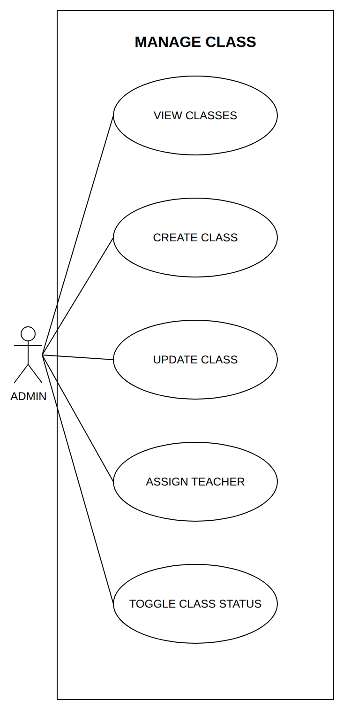

*Figure 3.7: System Use Case for manage class*

### A-027  ·  VIEW CLASSES

**Use Case Name:** VIEW CLASSES  
**Purpose:** List the classes the signed-in user is allowed to see.  
**Actors:**

- Admin (Primary Actor)

**Input Parameters:**

- None beyond the signed-in identity carried on the authentication cookie.

**Output Parameters:**

- The rendered page, or a JSON payload where the caller is the page’s own script.

**Pre-Condition:**

- The caller is signed in as an administrator or a teacher. A teacher reaches this action only because it carries `[TeacherSharedAction]`; the teacher account must also be active.

**Post-Condition:**

- The caller has the requested information. Nothing in the database has changed.

**Successful Scenario:**

1. The Admin opens the page and CAMS confirms the role on the authentication cookie.
2. The server reads the records the caller is entitled to see.
3. The page renders with those records.

**Exception Scenario:**

- **Not signed in or wrong role** — the request is refused and the caller is sent to the access denied page.

**Additional Remarks:**

- Implemented by `AdminController.Classes` (GET).
- Appears in the *MANAGE CLASS* module of the use case diagram.

### A-028  ·  CREATE CLASS

**Use Case Name:** CREATE CLASS  
**Purpose:** Record a new class in the system.  
**Actors:**

- Admin (Primary Actor)

**Input Parameters:**

- `cls` : `Class`

**Output Parameters:**

- A redirect back to the listing page, carrying a success or failure message for display.

**Pre-Condition:**

- The caller is signed in as an administrator or a teacher. A teacher reaches this action only because it carries `[TeacherSharedAction]`; the teacher account must also be active.

**Post-Condition:**

- The change is committed to the database and visible to the next read.
- The caller sees the outcome reported on the page they return to.

**Successful Scenario:**

1. The Admin opens the page and CAMS confirms the role on the authentication cookie.
2. The Admin fills the form and submits it.
3. The server validates the antiforgery token that accompanied the form.
4. The server validates the submitted values against the model rules.
5. The change is written to the database through `ApplicationDbContext`.
6. The server redirects back to the listing, where the result is shown.

**Exception Scenario:**

- **Not signed in or wrong role** — the request is refused and the caller is sent to the access denied page.
- **Missing or stale antiforgery token** — the submission is rejected and must be retried from a freshly loaded form.
- **Validation fails** — the form is redisplayed with the offending fields marked and nothing is written.

**Additional Remarks:**

- Implemented by `AdminController.CreateClass` (POST).
- Appears in the *MANAGE CLASS* module of the use case diagram.

### A-029  ·  UPDATE CLASS

**Use Case Name:** UPDATE CLASS  
**Purpose:** Amend the stored details of an existing class.  
**Actors:**

- Admin (Primary Actor)

**Input Parameters:**

- `cls` : `Class`

**Output Parameters:**

- A redirect back to the listing page, carrying a success or failure message for display.

**Pre-Condition:**

- The caller is signed in as an administrator or a teacher. A teacher reaches this action only because it carries `[TeacherSharedAction]`; the teacher account must also be active.

**Post-Condition:**

- The change is committed to the database and visible to the next read.
- The caller sees the outcome reported on the page they return to.

**Successful Scenario:**

1. The Admin opens the page and CAMS confirms the role on the authentication cookie.
2. The Admin fills the form and submits it.
3. The server validates the antiforgery token that accompanied the form.
4. The server validates the submitted values against the model rules.
5. The change is written to the database through `ApplicationDbContext`.
6. The server redirects back to the listing, where the result is shown.

**Exception Scenario:**

- **Not signed in or wrong role** — the request is refused and the caller is sent to the access denied page.
- **Missing or stale antiforgery token** — the submission is rejected and must be retried from a freshly loaded form.
- **Validation fails** — the form is redisplayed with the offending fields marked and nothing is written.

**Additional Remarks:**

- Implemented by `AdminController.UpdateClass` (POST).
- Appears in the *MANAGE CLASS* module of the use case diagram.

### A-030  ·  ASSIGN TEACHER

**Use Case Name:** ASSIGN TEACHER  
**Purpose:** Put a teacher in charge of a class.  
**Actors:**

- Admin (Primary Actor)

**Input Parameters:**

- `classId` : `int`
- `teacherId` : `int?`

**Output Parameters:**

- A redirect back to the listing page, carrying a success or failure message for display.

**Pre-Condition:**

- The caller is signed in as an administrator or a teacher. A teacher reaches this action only because it carries `[TeacherSharedAction]`; the teacher account must also be active.
- The record named by the identifier exists.

**Post-Condition:**

- The change is committed to the database and visible to the next read.
- The caller sees the outcome reported on the page they return to.

**Successful Scenario:**

1. The Admin opens the page and CAMS confirms the role on the authentication cookie.
2. The Admin fills the form and submits it.
3. The server validates the antiforgery token that accompanied the form.
4. The server validates the submitted values against the model rules.
5. The change is written to the database through `ApplicationDbContext`.
6. The server redirects back to the listing, where the result is shown.

**Exception Scenario:**

- **Not signed in or wrong role** — the request is refused and the caller is sent to the access denied page.
- **Missing or stale antiforgery token** — the submission is rejected and must be retried from a freshly loaded form.
- **Validation fails** — the form is redisplayed with the offending fields marked and nothing is written.
- **The identifier matches no record** — the action reports that the record was not found and makes no change.

**Additional Remarks:**

- Implemented by `AdminController.AssignTeacher` (POST).
- Appears in the *MANAGE CLASS* module of the use case diagram.

### A-031  ·  TOGGLE CLASS STATUS

**Use Case Name:** TOGGLE CLASS STATUS  
**Purpose:** Archive an active class, or restore an archived one, instead of deleting it, so its roster, sessions and records are kept.  
**Actors:**

- Admin (Primary Actor)

**Input Parameters:**

- `id` : `int`

**Output Parameters:**

- A redirect back to the listing page, carrying a success or failure message for display.

**Pre-Condition:**

- The caller is signed in as an administrator or a teacher. A teacher reaches this action only because it carries `[TeacherSharedAction]`; the teacher account must also be active.
- The record named by the identifier exists.

**Post-Condition:**

- The new status is committed to the database and takes effect on the next read.
- The record stays in the database with its history; only its status changes, so it can be switched back at any time.

**Successful Scenario:**

1. The Admin opens the Classes page and CAMS confirms the role on the authentication cookie.
2. The Admin chooses Archive (or Restore) beside the class and confirms the prompt.
3. The server validates the antiforgery token that accompanied the form.
4. The server flips the class between active and archived, saves it and writes an audit entry.
5. The server redirects back to the Classes page, where the new status is shown.

**Exception Scenario:**

- **Not signed in or wrong role** — the request is refused and the caller is sent to the access denied page.
- **Missing or stale antiforgery token** — the submission is rejected and must be retried from a freshly loaded form.
- **The identifier matches no record** — the action reports that the record was not found and makes no change.

**Additional Remarks:**

- Implemented by `AdminController.ArchiveClass` (POST).
- Replaces the delete use case: CAMS keeps the record and changes its status, so history is never lost.
- Appears in the *MANAGE CLASS* module of the use case diagram.

## MANAGE CLASS ROSTER  ·  `AdminController`

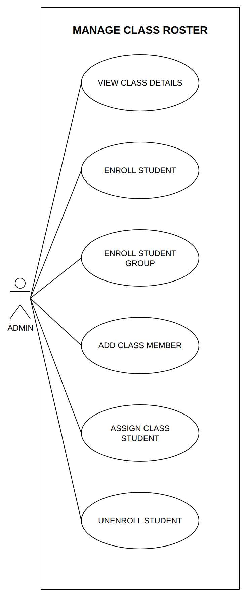

*Figure 3.8: System Use Case for manage class roster*

### A-032  ·  VIEW CLASS DETAILS

**Use Case Name:** VIEW CLASS DETAILS  
**Purpose:** Show one class with its roster and the students enrolled in it.  
**Actors:**

- Admin (Primary Actor)

**Input Parameters:**

- `id` : `int`

**Output Parameters:**

- The rendered page, or a JSON payload where the caller is the page’s own script.

**Pre-Condition:**

- The caller is signed in as an administrator or a teacher. A teacher reaches this action only because it carries `[TeacherSharedAction]`; the teacher account must also be active.
- The record named by the identifier exists.

**Post-Condition:**

- The caller has the requested information. Nothing in the database has changed.

**Successful Scenario:**

1. The Admin opens the page and CAMS confirms the role on the authentication cookie.
2. The server reads the records the caller is entitled to see.
3. The page renders with those records.

**Exception Scenario:**

- **Not signed in or wrong role** — the request is refused and the caller is sent to the access denied page.
- **The identifier matches no record** — the action reports that the record was not found and makes no change.

**Additional Remarks:**

- Implemented by `AdminController.ClassDetails` (GET).
- Appears in the *MANAGE CLASS ROSTER* module of the use case diagram.

### A-033  ·  ENROLL STUDENT

**Use Case Name:** ENROLL STUDENT  
**Purpose:** Add an existing student to a class roster.  
**Actors:**

- Admin (Primary Actor)

**Input Parameters:**

- `classId` : `int`
- `studentId` : `int`
- `moveStudent` : `bool` (optional)

**Output Parameters:**

- A redirect back to the listing page, carrying a success or failure message for display.

**Pre-Condition:**

- The caller is signed in as an administrator or a teacher. A teacher reaches this action only because it carries `[TeacherSharedAction]`; the teacher account must also be active.
- The record named by the identifier exists.

**Post-Condition:**

- The change is committed to the database and visible to the next read.
- The caller sees the outcome reported on the page they return to.

**Successful Scenario:**

1. The Admin opens the page and CAMS confirms the role on the authentication cookie.
2. The Admin fills the form and submits it.
3. The server validates the antiforgery token that accompanied the form.
4. The server validates the submitted values against the model rules.
5. The change is written to the database through `ApplicationDbContext`.
6. The server redirects back to the listing, where the result is shown.

**Exception Scenario:**

- **Not signed in or wrong role** — the request is refused and the caller is sent to the access denied page.
- **Missing or stale antiforgery token** — the submission is rejected and must be retried from a freshly loaded form.
- **Validation fails** — the form is redisplayed with the offending fields marked and nothing is written.
- **The identifier matches no record** — the action reports that the record was not found and makes no change.

**Additional Remarks:**

- Implemented by `AdminController.EnrollStudent` (POST).
- Appears in the *MANAGE CLASS ROSTER* module of the use case diagram.

### A-034  ·  ENROLL STUDENT GROUP

**Use Case Name:** ENROLL STUDENT GROUP  
**Purpose:** Add several existing students to a class roster in one operation.  
**Actors:**

- Admin (Primary Actor)

**Input Parameters:**

- `classId` : `int`
- `studentIds` : `List<int>?`
- `moveStudent` : `bool` (optional)

**Output Parameters:**

- A redirect back to the listing page, carrying a success or failure message for display.

**Pre-Condition:**

- The caller is signed in as an administrator or a teacher. A teacher reaches this action only because it carries `[TeacherSharedAction]`; the teacher account must also be active.
- The record named by the identifier exists.

**Post-Condition:**

- The change is committed to the database and visible to the next read.
- The caller sees the outcome reported on the page they return to.

**Successful Scenario:**

1. The Admin opens the page and CAMS confirms the role on the authentication cookie.
2. The Admin fills the form and submits it.
3. The server validates the antiforgery token that accompanied the form.
4. The server validates the submitted values against the model rules.
5. The change is written to the database through `ApplicationDbContext`.
6. The server redirects back to the listing, where the result is shown.

**Exception Scenario:**

- **Not signed in or wrong role** — the request is refused and the caller is sent to the access denied page.
- **Missing or stale antiforgery token** — the submission is rejected and must be retried from a freshly loaded form.
- **Validation fails** — the form is redisplayed with the offending fields marked and nothing is written.
- **The identifier matches no record** — the action reports that the record was not found and makes no change.

**Additional Remarks:**

- Implemented by `AdminController.EnrollStudents` (POST).
- Appears in the *MANAGE CLASS ROSTER* module of the use case diagram.

### A-035  ·  ADD CLASS MEMBER

**Use Case Name:** ADD CLASS MEMBER  
**Purpose:** Create a new student account and place it on a class roster in one step.  
**Actors:**

- Admin (Primary Actor)

**Input Parameters:**

- `classId` : `int`
- `firstName` : `string`
- `lastName` : `string`
- `username` : `string?`
- `password` : `string?`

**Output Parameters:**

- A redirect back to the listing page, carrying a success or failure message for display.

**Pre-Condition:**

- The caller is signed in as an administrator or a teacher. A teacher reaches this action only because it carries `[TeacherSharedAction]`; the teacher account must also be active.
- The record named by the identifier exists.

**Post-Condition:**

- The change is committed to the database and visible to the next read.
- The caller sees the outcome reported on the page they return to.

**Successful Scenario:**

1. The Admin opens the page and CAMS confirms the role on the authentication cookie.
2. The Admin fills the form and submits it.
3. The server validates the antiforgery token that accompanied the form.
4. The server validates the submitted values against the model rules.
5. The change is written to the database through `ApplicationDbContext`.
6. The server redirects back to the listing, where the result is shown.

**Exception Scenario:**

- **Not signed in or wrong role** — the request is refused and the caller is sent to the access denied page.
- **Missing or stale antiforgery token** — the submission is rejected and must be retried from a freshly loaded form.
- **Validation fails** — the form is redisplayed with the offending fields marked and nothing is written.
- **The identifier matches no record** — the action reports that the record was not found and makes no change.

**Additional Remarks:**

- Implemented by `AdminController.AddStudentToClass` (POST).
- Appears in the *MANAGE CLASS ROSTER* module of the use case diagram.

### A-036  ·  ASSIGN CLASS STUDENT

**Use Case Name:** ASSIGN CLASS STUDENT  
**Purpose:** Set the primary class a student belongs to.  
**Actors:**

- Admin (Primary Actor)

**Input Parameters:**

- `studentId` : `int`
- `classId` : `int?`
- `moveStudent` : `bool` (optional)

**Output Parameters:**

- A redirect back to the listing page, carrying a success or failure message for display.

**Pre-Condition:**

- The caller is signed in as an administrator or a teacher. A teacher reaches this action only because it carries `[TeacherSharedAction]`; the teacher account must also be active.
- The record named by the identifier exists.

**Post-Condition:**

- The change is committed to the database and visible to the next read.
- The caller sees the outcome reported on the page they return to.

**Successful Scenario:**

1. The Admin opens the page and CAMS confirms the role on the authentication cookie.
2. The Admin fills the form and submits it.
3. The server validates the antiforgery token that accompanied the form.
4. The server validates the submitted values against the model rules.
5. The change is written to the database through `ApplicationDbContext`.
6. The server redirects back to the listing, where the result is shown.

**Exception Scenario:**

- **Not signed in or wrong role** — the request is refused and the caller is sent to the access denied page.
- **Missing or stale antiforgery token** — the submission is rejected and must be retried from a freshly loaded form.
- **Validation fails** — the form is redisplayed with the offending fields marked and nothing is written.
- **The identifier matches no record** — the action reports that the record was not found and makes no change.

**Additional Remarks:**

- Implemented by `AdminController.AssignStudentToClass` (POST).
- Appears in the *MANAGE CLASS ROSTER* module of the use case diagram.

### A-037  ·  UNENROLL STUDENT

**Use Case Name:** UNENROLL STUDENT  
**Purpose:** Take a student off a class roster while leaving the student account intact.  
**Actors:**

- Admin (Primary Actor)

**Input Parameters:**

- `classId` : `int`
- `studentId` : `int`

**Output Parameters:**

- A redirect back to the listing page, carrying a success or failure message for display.

**Pre-Condition:**

- The caller is signed in as an administrator or a teacher. A teacher reaches this action only because it carries `[TeacherSharedAction]`; the teacher account must also be active.
- The record named by the identifier exists.

**Post-Condition:**

- The change is committed to the database and visible to the next read.
- The caller sees the outcome reported on the page they return to.

**Successful Scenario:**

1. The Admin opens the page and CAMS confirms the role on the authentication cookie.
2. The Admin fills the form and submits it.
3. The server validates the antiforgery token that accompanied the form.
4. The server validates the submitted values against the model rules.
5. The change is written to the database through `ApplicationDbContext`.
6. The server redirects back to the listing, where the result is shown.

**Exception Scenario:**

- **Not signed in or wrong role** — the request is refused and the caller is sent to the access denied page.
- **Missing or stale antiforgery token** — the submission is rejected and must be retried from a freshly loaded form.
- **Validation fails** — the form is redisplayed with the offending fields marked and nothing is written.
- **The identifier matches no record** — the action reports that the record was not found and makes no change.

**Additional Remarks:**

- Implemented by `AdminController.RemoveStudent` (POST).
- Appears in the *MANAGE CLASS ROSTER* module of the use case diagram.

## MANAGE RESTRICTION RULE  ·  `AdminController`

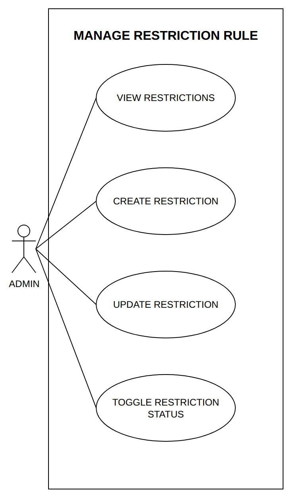

*Figure 3.9: System Use Case for manage restriction rule*

### A-038  ·  VIEW RESTRICTIONS

**Use Case Name:** VIEW RESTRICTIONS  
**Purpose:** List the restrictions the signed-in user is allowed to see.  
**Actors:**

- Admin (Primary Actor)

**Input Parameters:**

- None beyond the signed-in identity carried on the authentication cookie.

**Output Parameters:**

- The rendered page, or a JSON payload where the caller is the page’s own script.

**Pre-Condition:**

- The caller is signed in as an administrator or a teacher. A teacher reaches this action only because it carries `[TeacherSharedAction]`; the teacher account must also be active.

**Post-Condition:**

- The caller has the requested information. Nothing in the database has changed.

**Successful Scenario:**

1. The Admin opens the page and CAMS confirms the role on the authentication cookie.
2. The server reads the records the caller is entitled to see.
3. The page renders with those records.

**Exception Scenario:**

- **Not signed in or wrong role** — the request is refused and the caller is sent to the access denied page.

**Additional Remarks:**

- Implemented by `AdminController.Restrictions` (GET).
- Appears in the *MANAGE RESTRICTION RULE* module of the use case diagram.

### A-039  ·  CREATE RESTRICTION

**Use Case Name:** CREATE RESTRICTION  
**Purpose:** Record a new restriction rule in the system.  
**Actors:**

- Admin (Primary Actor)

**Input Parameters:**

- `rule` : `RestrictionRule`

**Output Parameters:**

- A redirect back to the listing page, carrying a success or failure message for display.

**Pre-Condition:**

- The caller is signed in as an administrator or a teacher. A teacher reaches this action only because it carries `[TeacherSharedAction]`; the teacher account must also be active.

**Post-Condition:**

- The change is committed to the database and visible to the next read.
- The caller sees the outcome reported on the page they return to.

**Successful Scenario:**

1. The Admin opens the page and CAMS confirms the role on the authentication cookie.
2. The Admin fills the form and submits it.
3. The server validates the antiforgery token that accompanied the form.
4. The server validates the submitted values against the model rules.
5. The change is written to the database through `ApplicationDbContext`.
6. The server redirects back to the listing, where the result is shown.

**Exception Scenario:**

- **Not signed in or wrong role** — the request is refused and the caller is sent to the access denied page.
- **Missing or stale antiforgery token** — the submission is rejected and must be retried from a freshly loaded form.
- **Validation fails** — the form is redisplayed with the offending fields marked and nothing is written.

**Additional Remarks:**

- Implemented by `AdminController.CreateRestriction` (POST).
- Appears in the *MANAGE RESTRICTION RULE* module of the use case diagram.

### A-040  ·  UPDATE RESTRICTION

**Use Case Name:** UPDATE RESTRICTION  
**Purpose:** Amend the stored details of an existing restriction rule.  
**Actors:**

- Admin (Primary Actor)

**Input Parameters:**

- `input` : `RestrictionRule`

**Output Parameters:**

- A redirect back to the listing page, carrying a success or failure message for display.

**Pre-Condition:**

- The caller is signed in as an administrator or a teacher. A teacher reaches this action only because it carries `[TeacherSharedAction]`; the teacher account must also be active.

**Post-Condition:**

- The change is committed to the database and visible to the next read.
- The caller sees the outcome reported on the page they return to.

**Successful Scenario:**

1. The Admin opens the page and CAMS confirms the role on the authentication cookie.
2. The Admin fills the form and submits it.
3. The server validates the antiforgery token that accompanied the form.
4. The server validates the submitted values against the model rules.
5. The change is written to the database through `ApplicationDbContext`.
6. The server redirects back to the listing, where the result is shown.

**Exception Scenario:**

- **Not signed in or wrong role** — the request is refused and the caller is sent to the access denied page.
- **Missing or stale antiforgery token** — the submission is rejected and must be retried from a freshly loaded form.
- **Validation fails** — the form is redisplayed with the offending fields marked and nothing is written.

**Additional Remarks:**

- Implemented by `AdminController.UpdateRestriction` (POST).
- Appears in the *MANAGE RESTRICTION RULE* module of the use case diagram.

### A-041  ·  TOGGLE RESTRICTION STATUS

**Use Case Name:** TOGGLE RESTRICTION STATUS  
**Purpose:** Switch a restriction rule between active and inactive instead of deleting it, so the client agents stop (or resume) enforcing it while the rule stays on file.  
**Actors:**

- Admin (Primary Actor)

**Input Parameters:**

- `input` : `RestrictionRule` (`RestrictionRuleId`, `IsActive`, and the rule's other fields)

**Output Parameters:**

- A redirect back to the listing page, carrying a success or failure message for display.

**Pre-Condition:**

- The caller is signed in as an administrator or a teacher. A teacher reaches this action only because it carries `[TeacherSharedAction]`; the teacher account must also be active.
- The record named by the identifier exists.

**Post-Condition:**

- The new status is committed to the database and takes effect on the next read.
- The record stays in the database with its history; only its status changes, so it can be switched back at any time.

**Successful Scenario:**

1. The Admin opens the Restrictions page and CAMS confirms the role on the authentication cookie.
2. The Admin opens the rule's edit form, ticks or clears Active and saves.
3. The server sets the rule's `IsActive` flag, saves it and writes an audit entry.
4. The server redirects back to the Restrictions page, where the new status is shown.

**Exception Scenario:**

- **Not signed in or wrong role** — the request is refused and the caller is sent to the access denied page.
- **The identifier matches no record** — the action reports that the record was not found and makes no change.
- **The rule's type, target or mode is not valid** — nothing is written and the listing is shown again.

**Additional Remarks:**

- Implemented by `AdminController.UpdateRestriction` (POST).
- Replaces the delete use case: CAMS keeps the record and changes its status, so history is never lost.
- Appears in the *MANAGE RESTRICTION RULE* module of the use case diagram.

## MANAGE BLACKLIST AND WHITELIST  ·  `AdminController`

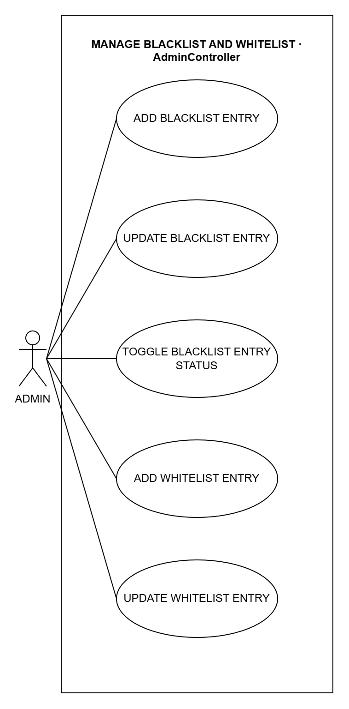

*Figure 3.10: System Use Case for manage blacklist and whitelist*

### A-042  ·  VIEW BLACKLISTS

**Use Case Name:** VIEW BLACKLISTS  
**Purpose:** List the blacklists the signed-in user is allowed to see.  
**Actors:**

- Admin (Primary Actor)

**Input Parameters:**

- None beyond the signed-in identity carried on the authentication cookie.

**Output Parameters:**

- The rendered page, or a JSON payload where the caller is the page’s own script.

**Pre-Condition:**

- The caller is signed in as an administrator or a teacher. A teacher reaches this action only because it carries `[TeacherSharedAction]`; the teacher account must also be active.

**Post-Condition:**

- The caller has the requested information. Nothing in the database has changed.

**Successful Scenario:**

1. The Admin opens the page and CAMS confirms the role on the authentication cookie.
2. The server reads the records the caller is entitled to see.
3. The page renders with those records.

**Exception Scenario:**

- **Not signed in or wrong role** — the request is refused and the caller is sent to the access denied page.

**Additional Remarks:**

- Implemented by `AdminController.Blacklists` (GET).
- Appears in the *MANAGE BLACKLIST AND WHITELIST* module of the use case diagram.

### A-043  ·  VIEW WHITELISTS

**Use Case Name:** VIEW WHITELISTS  
**Purpose:** List the whitelists the signed-in user is allowed to see.  
**Actors:**

- Admin (Primary Actor)

**Input Parameters:**

- None beyond the signed-in identity carried on the authentication cookie.

**Output Parameters:**

- The rendered page, or a JSON payload where the caller is the page’s own script.

**Pre-Condition:**

- The caller is signed in as an administrator or a teacher. A teacher reaches this action only because it carries `[TeacherSharedAction]`; the teacher account must also be active.

**Post-Condition:**

- The caller has the requested information. Nothing in the database has changed.

**Successful Scenario:**

1. The Admin opens the page and CAMS confirms the role on the authentication cookie.
2. The server reads the records the caller is entitled to see.
3. The page renders with those records.

**Exception Scenario:**

- **Not signed in or wrong role** — the request is refused and the caller is sent to the access denied page.

**Additional Remarks:**

- Implemented by `AdminController.Whitelists` (GET).
- Appears in the *MANAGE BLACKLIST AND WHITELIST* module of the use case diagram.

### A-044  ·  CREATE BLACKLIST

**Use Case Name:** CREATE BLACKLIST  
**Purpose:** Record a new blacklist entry in the system.  
**Actors:**

- Admin (Primary Actor)

**Input Parameters:**

- `RestrictionRuleId` — bound from the submitted form
- `RuleType` — bound from the submitted form
- `Target` — bound from the submitted form
- `Description` — bound from the submitted form
- `IsGlobal` — bound from the submitted form
- `IsActive` — bound from the submitted form
- `item` : `BlacklistItem`

**Output Parameters:**

- A redirect back to the listing page, carrying a success or failure message for display.

**Pre-Condition:**

- The caller is signed in as an administrator or a teacher. A teacher reaches this action only because it carries `[TeacherSharedAction]`; the teacher account must also be active.

**Post-Condition:**

- The change is committed to the database and visible to the next read.
- The caller sees the outcome reported on the page they return to.

**Successful Scenario:**

1. The Admin opens the page and CAMS confirms the role on the authentication cookie.
2. The Admin fills the form and submits it.
3. The server validates the antiforgery token that accompanied the form.
4. The server validates the submitted values against the model rules.
5. The change is written to the database through `ApplicationDbContext`.
6. The server redirects back to the listing, where the result is shown.

**Exception Scenario:**

- **Not signed in or wrong role** — the request is refused and the caller is sent to the access denied page.
- **Missing or stale antiforgery token** — the submission is rejected and must be retried from a freshly loaded form.
- **Validation fails** — the form is redisplayed with the offending fields marked and nothing is written.

**Additional Remarks:**

- Implemented by `AdminController.CreateBlacklist` (POST).
- Appears in the *MANAGE BLACKLIST AND WHITELIST* module of the use case diagram.

### A-045  ·  UPDATE BLACKLIST

**Use Case Name:** UPDATE BLACKLIST  
**Purpose:** Amend the stored details of an existing blacklist entry.  
**Actors:**

- Admin (Primary Actor)

**Input Parameters:**

- `input` : `BlacklistItem`

**Output Parameters:**

- A redirect back to the listing page, carrying a success or failure message for display.

**Pre-Condition:**

- The caller is signed in as an administrator or a teacher. A teacher reaches this action only because it carries `[TeacherSharedAction]`; the teacher account must also be active.

**Post-Condition:**

- The change is committed to the database and visible to the next read.
- The caller sees the outcome reported on the page they return to.

**Successful Scenario:**

1. The Admin opens the page and CAMS confirms the role on the authentication cookie.
2. The Admin fills the form and submits it.
3. The server validates the antiforgery token that accompanied the form.
4. The server validates the submitted values against the model rules.
5. The change is written to the database through `ApplicationDbContext`.
6. The server redirects back to the listing, where the result is shown.

**Exception Scenario:**

- **Not signed in or wrong role** — the request is refused and the caller is sent to the access denied page.
- **Missing or stale antiforgery token** — the submission is rejected and must be retried from a freshly loaded form.
- **Validation fails** — the form is redisplayed with the offending fields marked and nothing is written.

**Additional Remarks:**

- Implemented by `AdminController.UpdateBlacklist` (POST).
- Appears in the *MANAGE BLACKLIST AND WHITELIST* module of the use case diagram.

### A-046  ·  TOGGLE BLACKLIST STATUS

**Use Case Name:** TOGGLE BLACKLIST STATUS  
**Purpose:** Switch a blacklist entry between active and inactive instead of deleting it, so the application or website is unblocked (or blocked again) while the entry stays on file.  
**Actors:**

- Admin (Primary Actor)

**Input Parameters:**

- `input` : `BlacklistItem` (`BlacklistItemId`, `TargetType`, `Value`, `Reason`, `IsActive`)

**Output Parameters:**

- A redirect back to the listing page, carrying a success or failure message for display.

**Pre-Condition:**

- The caller is signed in as an administrator or a teacher. A teacher reaches this action only because it carries `[TeacherSharedAction]`; the teacher account must also be active.
- The record named by the identifier exists.

**Post-Condition:**

- The new status is committed to the database and takes effect on the next read.
- The record stays in the database with its history; only its status changes, so it can be switched back at any time.

**Successful Scenario:**

1. The Admin opens the Blacklists page and CAMS confirms the role on the authentication cookie.
2. The Admin opens the entry's edit form, ticks or clears Active and saves.
3. The server sets the entry's `IsActive` flag, saves it and writes an audit entry.
4. The server redirects back to the Blacklists page, where the new status is shown.

**Exception Scenario:**

- **Not signed in or wrong role** — the request is refused and the caller is sent to the access denied page.
- **The identifier matches no record** — the action reports that the record was not found and makes no change.

**Additional Remarks:**

- Implemented by `AdminController.UpdateBlacklist` (POST).
- Replaces the delete use case: CAMS keeps the record and changes its status, so history is never lost.
- Appears in the *MANAGE BLACKLIST AND WHITELIST* module of the use case diagram.

### A-047  ·  CREATE WHITELIST

**Use Case Name:** CREATE WHITELIST  
**Purpose:** Record a new whitelist entry in the system.  
**Actors:**

- Admin (Primary Actor)

**Input Parameters:**

- `rule` : `RestrictionRule`

**Output Parameters:**

- A redirect back to the listing page, carrying a success or failure message for display.

**Pre-Condition:**

- The caller is signed in as an administrator or a teacher. A teacher reaches this action only because it carries `[TeacherSharedAction]`; the teacher account must also be active.

**Post-Condition:**

- The change is committed to the database and visible to the next read.
- The caller sees the outcome reported on the page they return to.

**Successful Scenario:**

1. The Admin opens the page and CAMS confirms the role on the authentication cookie.
2. The Admin fills the form and submits it.
3. The server validates the antiforgery token that accompanied the form.
4. The server validates the submitted values against the model rules.
5. The change is written to the database through `ApplicationDbContext`.
6. The server redirects back to the listing, where the result is shown.

**Exception Scenario:**

- **Not signed in or wrong role** — the request is refused and the caller is sent to the access denied page.
- **Missing or stale antiforgery token** — the submission is rejected and must be retried from a freshly loaded form.
- **Validation fails** — the form is redisplayed with the offending fields marked and nothing is written.

**Additional Remarks:**

- Implemented by `AdminController.CreateWhitelist` (POST).
- Appears in the *MANAGE BLACKLIST AND WHITELIST* module of the use case diagram.

### A-048  ·  UPDATE WHITELIST

**Use Case Name:** UPDATE WHITELIST  
**Purpose:** Amend the stored details of an existing whitelist entry.  
**Actors:**

- Admin (Primary Actor)

**Input Parameters:**

- `RuleType` — bound from the submitted form
- `Target` — bound from the submitted form
- `Description` — bound from the submitted form
- `IsGlobal` — bound from the submitted form
- `IsActive` — bound from the submitted form
- `rule` : `RestrictionRule`

**Output Parameters:**

- A redirect back to the listing page, carrying a success or failure message for display.

**Pre-Condition:**

- The caller is signed in as an administrator or a teacher. A teacher reaches this action only because it carries `[TeacherSharedAction]`; the teacher account must also be active.

**Post-Condition:**

- The change is committed to the database and visible to the next read.
- The caller sees the outcome reported on the page they return to.

**Successful Scenario:**

1. The Admin opens the page and CAMS confirms the role on the authentication cookie.
2. The Admin fills the form and submits it.
3. The server validates the antiforgery token that accompanied the form.
4. The server validates the submitted values against the model rules.
5. The change is written to the database through `ApplicationDbContext`.
6. The server redirects back to the listing, where the result is shown.

**Exception Scenario:**

- **Not signed in or wrong role** — the request is refused and the caller is sent to the access denied page.
- **Missing or stale antiforgery token** — the submission is rejected and must be retried from a freshly loaded form.
- **Validation fails** — the form is redisplayed with the offending fields marked and nothing is written.

**Additional Remarks:**

- Implemented by `AdminController.UpdateWhitelist` (POST).
- Appears in the *MANAGE BLACKLIST AND WHITELIST* module of the use case diagram.

### A-049  ·  TOGGLE WHITELIST STATUS

**Use Case Name:** TOGGLE WHITELIST STATUS  
**Purpose:** Switch a whitelist rule between active and inactive instead of deleting it, so the website leaves (or rejoins) the allowed list while the rule stays on file.  
**Actors:**

- Admin (Primary Actor)

**Input Parameters:**

- `rule` : `RestrictionRule` (`RestrictionRuleId`, `RuleType`, `Target`, `Description`, `IsGlobal`, `IsActive`)

**Output Parameters:**

- A redirect back to the listing page, carrying a success or failure message for display.

**Pre-Condition:**

- The caller is signed in as an administrator or a teacher. A teacher reaches this action only because it carries `[TeacherSharedAction]`; the teacher account must also be active.
- The record named by the identifier exists.

**Post-Condition:**

- The new status is committed to the database and takes effect on the next read.
- The record stays in the database with its history; only its status changes, so it can be switched back at any time.

**Successful Scenario:**

1. The Admin opens the Whitelists page and CAMS confirms the role on the authentication cookie.
2. The Admin opens the rule's edit form, switches Rule is active on or off and saves.
3. The server sets the rule's `IsActive` flag, saves it and writes an audit entry.
4. The server redirects back to the Whitelists page, where the new status is shown.

**Exception Scenario:**

- **Not signed in or wrong role** — the request is refused and the caller is sent to the access denied page.
- **The identifier matches no record** — the action reports that the record was not found and makes no change.

**Additional Remarks:**

- Implemented by `AdminController.UpdateWhitelist` (POST).
- Replaces the delete use case: CAMS keeps the record and changes its status, so history is never lost.
- Appears in the *MANAGE BLACKLIST AND WHITELIST* module of the use case diagram.

## MANAGE CATEGORY  ·  `AdminController`

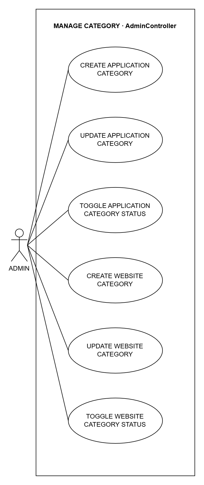

*Figure 3.11: System Use Case for manage category*

### A-050  ·  CREATE APPLICATION CATEGORY

**Use Case Name:** CREATE APPLICATION CATEGORY  
**Purpose:** Record a new application category in the system.  
**Actors:**

- Admin (Primary Actor)

**Input Parameters:**

- `category` : `ApplicationCategory`

**Output Parameters:**

- A redirect back to the listing page, carrying a success or failure message for display.

**Pre-Condition:**

- The caller is signed in as an administrator or a teacher. A teacher reaches this action only because it carries `[TeacherSharedAction]`; the teacher account must also be active.

**Post-Condition:**

- The change is committed to the database and visible to the next read.
- The caller sees the outcome reported on the page they return to.

**Successful Scenario:**

1. The Admin opens the page and CAMS confirms the role on the authentication cookie.
2. The Admin fills the form and submits it.
3. The server validates the antiforgery token that accompanied the form.
4. The server validates the submitted values against the model rules.
5. The change is written to the database through `ApplicationDbContext`.
6. The server redirects back to the listing, where the result is shown.

**Exception Scenario:**

- **Not signed in or wrong role** — the request is refused and the caller is sent to the access denied page.
- **Missing or stale antiforgery token** — the submission is rejected and must be retried from a freshly loaded form.
- **Validation fails** — the form is redisplayed with the offending fields marked and nothing is written.

**Additional Remarks:**

- Implemented by `AdminController.CreateApplicationCategory` (POST).
- Appears in the *MANAGE CATEGORY* module of the use case diagram.

### A-051  ·  UPDATE APPLICATION CATEGORY

**Use Case Name:** UPDATE APPLICATION CATEGORY  
**Purpose:** Amend the stored details of an existing application category.  
**Actors:**

- Admin (Primary Actor)

**Input Parameters:**

- `input` : `ApplicationCategory`

**Output Parameters:**

- A redirect back to the listing page, carrying a success or failure message for display.

**Pre-Condition:**

- The caller is signed in as an administrator or a teacher. A teacher reaches this action only because it carries `[TeacherSharedAction]`; the teacher account must also be active.

**Post-Condition:**

- The change is committed to the database and visible to the next read.
- The caller sees the outcome reported on the page they return to.

**Successful Scenario:**

1. The Admin opens the page and CAMS confirms the role on the authentication cookie.
2. The Admin fills the form and submits it.
3. The server validates the antiforgery token that accompanied the form.
4. The server validates the submitted values against the model rules.
5. The change is written to the database through `ApplicationDbContext`.
6. The server redirects back to the listing, where the result is shown.

**Exception Scenario:**

- **Not signed in or wrong role** — the request is refused and the caller is sent to the access denied page.
- **Missing or stale antiforgery token** — the submission is rejected and must be retried from a freshly loaded form.
- **Validation fails** — the form is redisplayed with the offending fields marked and nothing is written.

**Additional Remarks:**

- Implemented by `AdminController.UpdateApplicationCategory` (POST).
- Appears in the *MANAGE CATEGORY* module of the use case diagram.

### A-052  ·  TOGGLE APPLICATION CATEGORY STATUS

**Use Case Name:** TOGGLE APPLICATION CATEGORY STATUS  
**Purpose:** Switch an application category between active and inactive instead of deleting it, so its pattern stops (or resumes) matching while the category stays on file.  
**Actors:**

- Admin (Primary Actor)

**Input Parameters:**

- `input` : `ApplicationCategory` (`ApplicationCategoryId`, `IsActive`, and the category's other fields)

**Output Parameters:**

- A redirect back to the listing page, carrying a success or failure message for display.

**Pre-Condition:**

- The caller is signed in as an administrator or a teacher. A teacher reaches this action only because it carries `[TeacherSharedAction]`; the teacher account must also be active.
- The record named by the identifier exists.

**Post-Condition:**

- The new status is committed to the database and takes effect on the next read.
- The record stays in the database with its history; only its status changes, so it can be switched back at any time.

**Successful Scenario:**

1. The Admin opens the Restrictions page and CAMS confirms the role on the authentication cookie.
2. The Admin opens the application category's edit form, ticks or clears Active and saves.
3. The server sets the category's `IsActive` flag, saves it and writes an audit entry.
4. The server redirects back to the Restrictions page, where the new status is shown.

**Exception Scenario:**

- **Not signed in or wrong role** — the request is refused and the caller is sent to the access denied page.
- **The identifier matches no record** — the action reports that the record was not found and makes no change.

**Additional Remarks:**

- Implemented by `AdminController.UpdateApplicationCategory` (POST).
- Replaces the delete use case: CAMS keeps the record and changes its status, so history is never lost.
- Appears in the *MANAGE CATEGORY* module of the use case diagram.

### A-053  ·  CREATE WEBSITE CATEGORY

**Use Case Name:** CREATE WEBSITE CATEGORY  
**Purpose:** Record a new website category in the system.  
**Actors:**

- Admin (Primary Actor)

**Input Parameters:**

- `category` : `WebsiteCategory`

**Output Parameters:**

- A redirect back to the listing page, carrying a success or failure message for display.

**Pre-Condition:**

- The caller is signed in as an administrator or a teacher. A teacher reaches this action only because it carries `[TeacherSharedAction]`; the teacher account must also be active.

**Post-Condition:**

- The change is committed to the database and visible to the next read.
- The caller sees the outcome reported on the page they return to.

**Successful Scenario:**

1. The Admin opens the page and CAMS confirms the role on the authentication cookie.
2. The Admin fills the form and submits it.
3. The server validates the antiforgery token that accompanied the form.
4. The server validates the submitted values against the model rules.
5. The change is written to the database through `ApplicationDbContext`.
6. The server redirects back to the listing, where the result is shown.

**Exception Scenario:**

- **Not signed in or wrong role** — the request is refused and the caller is sent to the access denied page.
- **Missing or stale antiforgery token** — the submission is rejected and must be retried from a freshly loaded form.
- **Validation fails** — the form is redisplayed with the offending fields marked and nothing is written.

**Additional Remarks:**

- Implemented by `AdminController.CreateWebsiteCategory` (POST).
- Appears in the *MANAGE CATEGORY* module of the use case diagram.

### A-054  ·  UPDATE WEBSITE CATEGORY

**Use Case Name:** UPDATE WEBSITE CATEGORY  
**Purpose:** Amend the stored details of an existing website category.  
**Actors:**

- Admin (Primary Actor)

**Input Parameters:**

- `input` : `WebsiteCategory`

**Output Parameters:**

- A redirect back to the listing page, carrying a success or failure message for display.

**Pre-Condition:**

- The caller is signed in as an administrator or a teacher. A teacher reaches this action only because it carries `[TeacherSharedAction]`; the teacher account must also be active.

**Post-Condition:**

- The change is committed to the database and visible to the next read.
- The caller sees the outcome reported on the page they return to.

**Successful Scenario:**

1. The Admin opens the page and CAMS confirms the role on the authentication cookie.
2. The Admin fills the form and submits it.
3. The server validates the antiforgery token that accompanied the form.
4. The server validates the submitted values against the model rules.
5. The change is written to the database through `ApplicationDbContext`.
6. The server redirects back to the listing, where the result is shown.

**Exception Scenario:**

- **Not signed in or wrong role** — the request is refused and the caller is sent to the access denied page.
- **Missing or stale antiforgery token** — the submission is rejected and must be retried from a freshly loaded form.
- **Validation fails** — the form is redisplayed with the offending fields marked and nothing is written.

**Additional Remarks:**

- Implemented by `AdminController.UpdateWebsiteCategory` (POST).
- Appears in the *MANAGE CATEGORY* module of the use case diagram.

### A-055  ·  TOGGLE WEBSITE CATEGORY STATUS

**Use Case Name:** TOGGLE WEBSITE CATEGORY STATUS  
**Purpose:** Switch a website category between active and inactive instead of deleting it, so its domain pattern stops (or resumes) matching while the category stays on file.  
**Actors:**

- Admin (Primary Actor)

**Input Parameters:**

- `input` : `WebsiteCategory` (`WebsiteCategoryId`, `IsActive`, and the category's other fields)

**Output Parameters:**

- A redirect back to the listing page, carrying a success or failure message for display.

**Pre-Condition:**

- The caller is signed in as an administrator or a teacher. A teacher reaches this action only because it carries `[TeacherSharedAction]`; the teacher account must also be active.
- The record named by the identifier exists.

**Post-Condition:**

- The new status is committed to the database and takes effect on the next read.
- The record stays in the database with its history; only its status changes, so it can be switched back at any time.

**Successful Scenario:**

1. The Admin opens the Restrictions page and CAMS confirms the role on the authentication cookie.
2. The Admin opens the website category's edit form, ticks or clears Active and saves.
3. The server sets the category's `IsActive` flag, saves it and writes an audit entry.
4. The server redirects back to the Restrictions page, where the new status is shown.

**Exception Scenario:**

- **Not signed in or wrong role** — the request is refused and the caller is sent to the access denied page.
- **The identifier matches no record** — the action reports that the record was not found and makes no change.

**Additional Remarks:**

- Implemented by `AdminController.UpdateWebsiteCategory` (POST).
- Replaces the delete use case: CAMS keeps the record and changes its status, so history is never lost.
- Appears in the *MANAGE CATEGORY* module of the use case diagram.

## MANAGE SESSION RULE  ·  `AdminController`

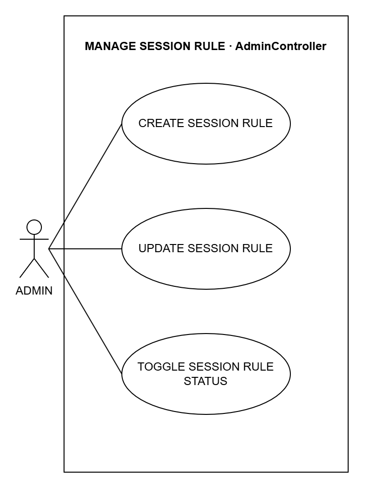

*Figure 3.12: System Use Case for manage session rule*

### A-056  ·  VIEW SESSION RULES

**Use Case Name:** VIEW SESSION RULES  
**Purpose:** List the session rules the signed-in user is allowed to see.  
**Actors:**

- Admin (Primary Actor)

**Input Parameters:**

- None beyond the signed-in identity carried on the authentication cookie.

**Output Parameters:**

- The rendered page, or a JSON payload where the caller is the page’s own script.

**Pre-Condition:**

- The caller is signed in as an administrator or a teacher. A teacher reaches this action only because it carries `[TeacherSharedAction]`; the teacher account must also be active.

**Post-Condition:**

- The caller has the requested information. Nothing in the database has changed.

**Successful Scenario:**

1. The Admin opens the page and CAMS confirms the role on the authentication cookie.
2. The server reads the records the caller is entitled to see.
3. The page renders with those records.

**Exception Scenario:**

- **Not signed in or wrong role** — the request is refused and the caller is sent to the access denied page.

**Additional Remarks:**

- Implemented by `AdminController.SessionRules` (GET).
- Appears in the *MANAGE SESSION RULE* module of the use case diagram.

### A-057  ·  CREATE SESSION RULE

**Use Case Name:** CREATE SESSION RULE  
**Purpose:** Record a new session rule in the system.  
**Actors:**

- Admin (Primary Actor)

**Input Parameters:**

- `rule` : `SessionRule`

**Output Parameters:**

- A redirect back to the listing page, carrying a success or failure message for display.

**Pre-Condition:**

- The caller is signed in as an administrator or a teacher. A teacher reaches this action only because it carries `[TeacherSharedAction]`; the teacher account must also be active.

**Post-Condition:**

- The change is committed to the database and visible to the next read.
- The caller sees the outcome reported on the page they return to.

**Successful Scenario:**

1. The Admin opens the page and CAMS confirms the role on the authentication cookie.
2. The Admin fills the form and submits it.
3. The server validates the antiforgery token that accompanied the form.
4. The server validates the submitted values against the model rules.
5. The change is written to the database through `ApplicationDbContext`.
6. The server redirects back to the listing, where the result is shown.

**Exception Scenario:**

- **Not signed in or wrong role** — the request is refused and the caller is sent to the access denied page.
- **Missing or stale antiforgery token** — the submission is rejected and must be retried from a freshly loaded form.
- **Validation fails** — the form is redisplayed with the offending fields marked and nothing is written.

**Additional Remarks:**

- Implemented by `AdminController.CreateSessionRule` (POST).
- Appears in the *MANAGE SESSION RULE* module of the use case diagram.

### A-058  ·  UPDATE SESSION RULE

**Use Case Name:** UPDATE SESSION RULE  
**Purpose:** Amend the stored details of an existing session rule.  
**Actors:**

- Admin (Primary Actor)

**Input Parameters:**

- `input` : `SessionRule`

**Output Parameters:**

- A redirect back to the listing page, carrying a success or failure message for display.

**Pre-Condition:**

- The caller is signed in as an administrator or a teacher. A teacher reaches this action only because it carries `[TeacherSharedAction]`; the teacher account must also be active.

**Post-Condition:**

- The change is committed to the database and visible to the next read.
- The caller sees the outcome reported on the page they return to.

**Successful Scenario:**

1. The Admin opens the page and CAMS confirms the role on the authentication cookie.
2. The Admin fills the form and submits it.
3. The server validates the antiforgery token that accompanied the form.
4. The server validates the submitted values against the model rules.
5. The change is written to the database through `ApplicationDbContext`.
6. The server redirects back to the listing, where the result is shown.

**Exception Scenario:**

- **Not signed in or wrong role** — the request is refused and the caller is sent to the access denied page.
- **Missing or stale antiforgery token** — the submission is rejected and must be retried from a freshly loaded form.
- **Validation fails** — the form is redisplayed with the offending fields marked and nothing is written.

**Additional Remarks:**

- Implemented by `AdminController.UpdateSessionRule` (POST).
- Appears in the *MANAGE SESSION RULE* module of the use case diagram.

### A-059  ·  TOGGLE SESSION RULE STATUS

**Use Case Name:** TOGGLE SESSION RULE STATUS  
**Purpose:** Switch a session rule between active and inactive instead of deleting it. An inactive rule loses any default flag and cannot govern new sessions, and sessions already recorded against it still resolve to a named rule.  
**Actors:**

- Admin (Primary Actor)

**Input Parameters:**

- `input` : `SessionRule` (`SessionRuleId`, `Name`, `MaxDurationMinutes`, `AllowPause`, `AllowRemoteControl`, `IsDefault`, `IsActive`)

**Output Parameters:**

- A redirect back to the listing page, carrying a success or failure message for display.

**Pre-Condition:**

- The caller is signed in as an administrator or a teacher. A teacher reaches this action only because it carries `[TeacherSharedAction]`; the teacher account must also be active.
- The record named by the identifier exists.

**Post-Condition:**

- The new status is committed to the database and takes effect on the next read.
- The record stays in the database with its history; only its status changes, so it can be switched back at any time.

**Successful Scenario:**

1. The Admin opens the Session Rules page and CAMS confirms the role on the authentication cookie.
2. The Admin opens the rule's edit form, ticks or clears Active and saves.
3. The server sets the rule's `IsActive` flag, clears the default flag when the rule is made inactive, closes any open remote control session that relied on it, and writes an audit entry.
4. The server redirects back to the Session Rules page, where the new status is shown.

**Exception Scenario:**

- **Not signed in or wrong role** — the request is refused and the caller is sent to the access denied page.
- **The identifier matches no record** — the action reports that the record was not found and makes no change.

**Additional Remarks:**

- Implemented by `AdminController.UpdateSessionRule` (POST).
- Replaces the delete use case: CAMS keeps the record and changes its status, so history is never lost.
- Appears in the *MANAGE SESSION RULE* module of the use case diagram.

## MANAGE ROLE AND PERMISSION  ·  `AdminController`

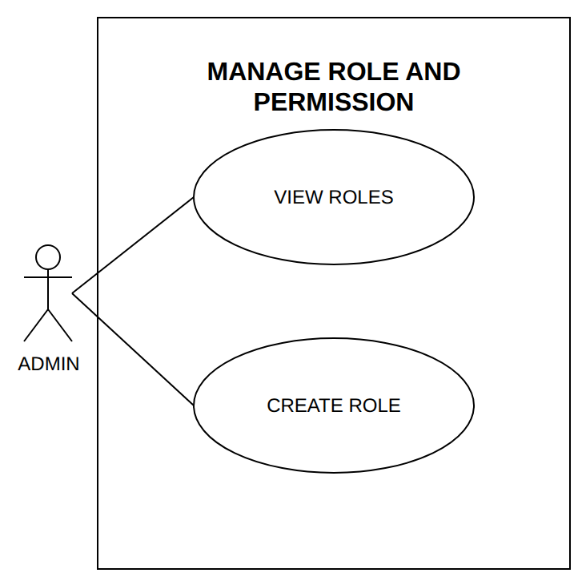

*Figure 3.13: System Use Case for manage role and permission*

### A-060  ·  VIEW ROLES

**Use Case Name:** VIEW ROLES  
**Purpose:** Show the seeded roles and the permissions attached to them.  
**Actors:**

- Admin (Primary Actor)

**Input Parameters:**

- None beyond the signed-in identity carried on the authentication cookie.

**Output Parameters:**

- The rendered page, or a JSON payload where the caller is the page’s own script.

**Pre-Condition:**

- The caller is signed in as an administrator or a teacher.

**Post-Condition:**

- The caller has the requested information. Nothing in the database has changed.

**Successful Scenario:**

1. The Admin opens the page and CAMS confirms the role on the authentication cookie.
2. The server reads the records the caller is entitled to see.
3. The page renders with those records.

**Exception Scenario:**

- **Not signed in or wrong role** — the request is refused and the caller is sent to the access denied page.

**Additional Remarks:**

- Implemented by `AdminController.Roles` (GET).
- Appears in the *MANAGE ROLE AND PERMISSION* module of the use case diagram.

### A-061  ·  CREATE ROLE

**Use Case Name:** CREATE ROLE  
**Purpose:** Add a role to the seeded reference data.  
**Actors:**

- Admin (Primary Actor)

**Input Parameters:**

- `role` : `Role`

**Output Parameters:**

- A redirect back to the listing page, carrying a success or failure message for display.

**Pre-Condition:**

- The caller is signed in as an administrator or a teacher.

**Post-Condition:**

- The change is committed to the database and visible to the next read.
- The caller sees the outcome reported on the page they return to.

**Successful Scenario:**

1. The Admin opens the page and CAMS confirms the role on the authentication cookie.
2. The Admin fills the form and submits it.
3. The server validates the antiforgery token that accompanied the form.
4. The server validates the submitted values against the model rules.
5. The change is written to the database through `ApplicationDbContext`.
6. The server redirects back to the listing, where the result is shown.

**Exception Scenario:**

- **Not signed in or wrong role** — the request is refused and the caller is sent to the access denied page.
- **Missing or stale antiforgery token** — the submission is rejected and must be retried from a freshly loaded form.
- **Validation fails** — the form is redisplayed with the offending fields marked and nothing is written.

**Additional Remarks:**

- Implemented by `AdminController.CreateRole` (POST).
- Appears in the *MANAGE ROLE AND PERMISSION* module of the use case diagram.

## CONTROL LABORATORY SESSION  ·  `AdminController`

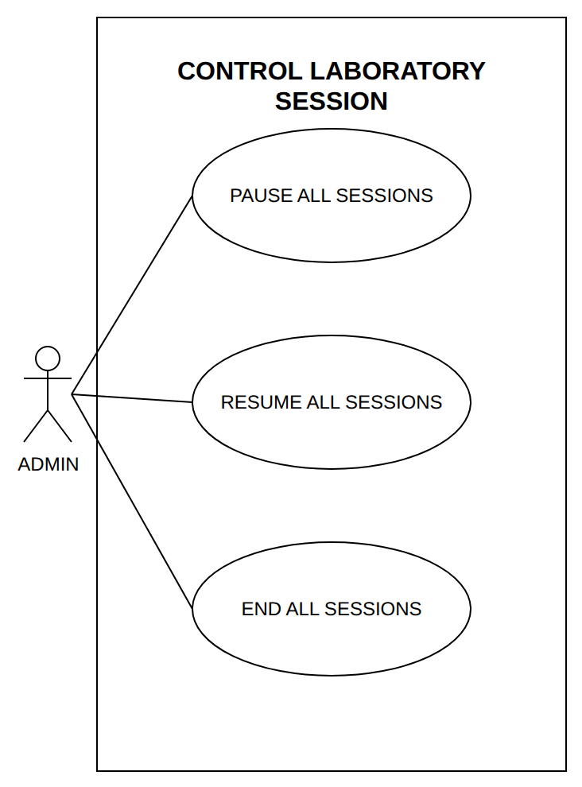

*Figure 3.14: System Use Case for control laboratory session*

### A-062  ·  PAUSE ALL SESSIONS

**Use Case Name:** PAUSE ALL SESSIONS  
**Purpose:** Pause every active laboratory session at once, freezing the timers across the room.  
**Actors:**

- Admin (Primary Actor)

**Input Parameters:**

- None beyond the signed-in identity carried on the authentication cookie.

**Output Parameters:**

- A redirect back to the listing page, carrying a success or failure message for display.

**Pre-Condition:**

- The caller is signed in as an administrator or a teacher. A teacher reaches this action only because it carries `[TeacherSharedAction]`; the teacher account must also be active.

**Post-Condition:**

- The change is committed to the database and visible to the next read.
- The caller sees the outcome reported on the page they return to.

**Successful Scenario:**

1. The Admin opens the page and CAMS confirms the role on the authentication cookie.
2. The Admin fills the form and submits it.
3. The server validates the antiforgery token that accompanied the form.
4. The server validates the submitted values against the model rules.
5. The change is written to the database through `ApplicationDbContext`.
6. The server redirects back to the listing, where the result is shown.

**Exception Scenario:**

- **Not signed in or wrong role** — the request is refused and the caller is sent to the access denied page.
- **Missing or stale antiforgery token** — the submission is rejected and must be retried from a freshly loaded form.
- **Validation fails** — the form is redisplayed with the offending fields marked and nothing is written.

**Additional Remarks:**

- Implemented by `AdminController.PauseAllSessions` (POST).
- Appears in the *CONTROL LABORATORY SESSION* module of the use case diagram.

### A-063  ·  RESUME ALL SESSIONS

**Use Case Name:** RESUME ALL SESSIONS  
**Purpose:** Resume every paused laboratory session at once.  
**Actors:**

- Admin (Primary Actor)

**Input Parameters:**

- None beyond the signed-in identity carried on the authentication cookie.

**Output Parameters:**

- A redirect back to the listing page, carrying a success or failure message for display.

**Pre-Condition:**

- The caller is signed in as an administrator or a teacher. A teacher reaches this action only because it carries `[TeacherSharedAction]`; the teacher account must also be active.

**Post-Condition:**

- The change is committed to the database and visible to the next read.
- The caller sees the outcome reported on the page they return to.

**Successful Scenario:**

1. The Admin opens the page and CAMS confirms the role on the authentication cookie.
2. The Admin fills the form and submits it.
3. The server validates the antiforgery token that accompanied the form.
4. The server validates the submitted values against the model rules.
5. The change is written to the database through `ApplicationDbContext`.
6. The server redirects back to the listing, where the result is shown.

**Exception Scenario:**

- **Not signed in or wrong role** — the request is refused and the caller is sent to the access denied page.
- **Missing or stale antiforgery token** — the submission is rejected and must be retried from a freshly loaded form.
- **Validation fails** — the form is redisplayed with the offending fields marked and nothing is written.

**Additional Remarks:**

- Implemented by `AdminController.ResumeAllSessions` (POST).
- Appears in the *CONTROL LABORATORY SESSION* module of the use case diagram.

### A-064  ·  END ALL SESSIONS

**Use Case Name:** END ALL SESSIONS  
**Purpose:** End every active laboratory session at once and tell the workstations.  
**Actors:**

- Admin (Primary Actor)

**Input Parameters:**

- None beyond the signed-in identity carried on the authentication cookie.

**Output Parameters:**

- A redirect back to the listing page, carrying a success or failure message for display.

**Pre-Condition:**

- The caller is signed in as an administrator or a teacher. A teacher reaches this action only because it carries `[TeacherSharedAction]`; the teacher account must also be active.

**Post-Condition:**

- The change is committed to the database and visible to the next read.
- The caller sees the outcome reported on the page they return to.

**Successful Scenario:**

1. The Admin opens the page and CAMS confirms the role on the authentication cookie.
2. The Admin fills the form and submits it.
3. The server validates the antiforgery token that accompanied the form.
4. The server validates the submitted values against the model rules.
5. The change is written to the database through `ApplicationDbContext`.
6. The server redirects back to the listing, where the result is shown.

**Exception Scenario:**

- **Not signed in or wrong role** — the request is refused and the caller is sent to the access denied page.
- **Missing or stale antiforgery token** — the submission is rejected and must be retried from a freshly loaded form.
- **Validation fails** — the form is redisplayed with the offending fields marked and nothing is written.

**Additional Remarks:**

- Implemented by `AdminController.EndAllSessions` (POST).
- Appears in the *CONTROL LABORATORY SESSION* module of the use case diagram.

## VIEW REPORTS AND LOGS  ·  `AdminController`

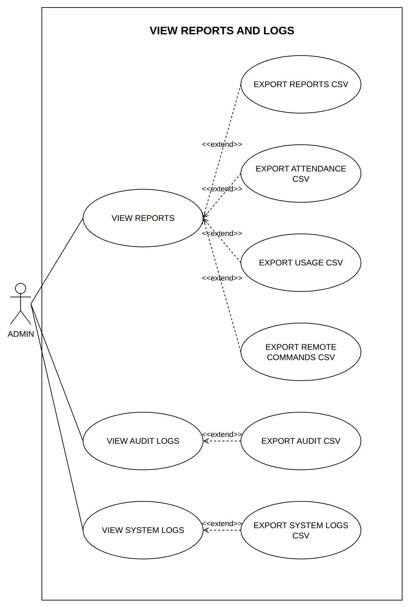

*Figure 3.15: System Use Case for view reports and logs*

### A-065  ·  VIEW REPORTS

**Use Case Name:** VIEW REPORTS  
**Purpose:** Show the laboratory reports an administrator uses for oversight.  
**Actors:**

- Admin (Primary Actor)

**Input Parameters:**

- `from` : `DateTime?`
- `to` : `DateTime?`
- `classId` : `int?` (optional)
- `station` : `string?` (optional)
- `page` : `int` (optional)
- `pageSize` : `int` (optional)

**Output Parameters:**

- The rendered page, or a JSON payload where the caller is the page’s own script.

**Pre-Condition:**

- The caller is signed in as an administrator or a teacher.
- The record named by the identifier exists.

**Post-Condition:**

- The caller has the requested information. Nothing in the database has changed.

**Successful Scenario:**

1. The Admin opens the page and CAMS confirms the role on the authentication cookie.
2. The server reads the records the caller is entitled to see.
3. The page renders with those records.

**Exception Scenario:**

- **Not signed in or wrong role** — the request is refused and the caller is sent to the access denied page.
- **The identifier matches no record** — the action reports that the record was not found and makes no change.

**Additional Remarks:**

- Implemented by `AdminController.Reports` (GET).
- Appears in the *VIEW REPORTS AND LOGS* module of the use case diagram.
- Pulls in **EXPORT REPORTS CSV** (`<<extend>>`), **EXPORT ATTENDANCE CSV** (`<<extend>>`), **EXPORT USAGE CSV** (`<<extend>>`), **EXPORT REMOTE COMMANDS CSV** (`<<extend>>`).

### A-066  ·  VIEW AUDIT LOGS

**Use Case Name:** VIEW AUDIT LOGS  
**Purpose:** Show the audit trail of administrative actions.  
**Actors:**

- Admin (Primary Actor)

**Input Parameters:**

- None beyond the signed-in identity carried on the authentication cookie.

**Output Parameters:**

- The rendered page, or a JSON payload where the caller is the page’s own script.

**Pre-Condition:**

- The caller is signed in as an administrator or a teacher.

**Post-Condition:**

- The caller has the requested information. Nothing in the database has changed.

**Successful Scenario:**

1. The Admin opens the page and CAMS confirms the role on the authentication cookie.
2. The server reads the records the caller is entitled to see.
3. The page renders with those records.

**Exception Scenario:**

- **Not signed in or wrong role** — the request is refused and the caller is sent to the access denied page.

**Additional Remarks:**

- Implemented by `AdminController.AuditLogs` (GET).
- Appears in the *VIEW REPORTS AND LOGS* module of the use case diagram.
- Pulls in **EXPORT AUDIT CSV** (`<<extend>>`).

### A-067  ·  VIEW SYSTEM LOGS

**Use Case Name:** VIEW SYSTEM LOGS  
**Purpose:** Show the technical log the server writes.  
**Actors:**

- Admin (Primary Actor)

**Input Parameters:**

- None beyond the signed-in identity carried on the authentication cookie.

**Output Parameters:**

- The rendered page, or a JSON payload where the caller is the page’s own script.

**Pre-Condition:**

- The caller is signed in as an administrator or a teacher.

**Post-Condition:**

- The caller has the requested information. Nothing in the database has changed.

**Successful Scenario:**

1. The Admin opens the page and CAMS confirms the role on the authentication cookie.
2. The server reads the records the caller is entitled to see.
3. The page renders with those records.

**Exception Scenario:**

- **Not signed in or wrong role** — the request is refused and the caller is sent to the access denied page.

**Additional Remarks:**

- Implemented by `AdminController.SystemLogs` (GET).
- Appears in the *VIEW REPORTS AND LOGS* module of the use case diagram.
- Pulls in **EXPORT SYSTEM LOGS CSV** (`<<extend>>`).

### A-068  ·  EXPORT REPORTS CSV

**Use Case Name:** EXPORT REPORTS CSV  
**Purpose:** Produce the reports view as a CSV file the user can download.  
**Actors:**

- Admin (Primary Actor)
- None; this behaviour runs inside **VIEW REPORTS** (Secondary Actor)

**Input Parameters:**

- `from` : `DateTime?` (optional)
- `to` : `DateTime?` (optional)
- `classId` : `int?` (optional)
- `station` : `string?` (optional)

**Output Parameters:**

- The rendered page, or a JSON payload where the caller is the page’s own script.

**Pre-Condition:**

- The caller is signed in as an administrator or a teacher.
- The record named by the identifier exists.
- **VIEW REPORTS** has reached the point where this is optionally performed.

**Post-Condition:**

- The caller has the requested information. Nothing in the database has changed.

**Successful Scenario:**

1. The Admin opens the page and CAMS confirms the role on the authentication cookie.
2. The server reads the records the caller is entitled to see.
3. The page renders with those records.

**Exception Scenario:**

- **Not signed in or wrong role** — the request is refused and the caller is sent to the access denied page.
- **The identifier matches no record** — the action reports that the record was not found and makes no change.

**Additional Remarks:**

- Implemented by `AdminController.ExportReportsCsv` (GET).
- Appears in the *VIEW REPORTS AND LOGS* module of the use case diagram.
- Drawn as `<<extend>>` to **VIEW REPORTS**.

### A-069  ·  EXPORT ATTENDANCE CSV

**Use Case Name:** EXPORT ATTENDANCE CSV  
**Purpose:** Produce the attendance view as a CSV file the user can download.  
**Actors:**

- Admin (Primary Actor)
- None; this behaviour runs inside **VIEW REPORTS** (Secondary Actor)

**Input Parameters:**

- `from` : `DateTime?` (optional)
- `to` : `DateTime?` (optional)
- `classId` : `int?` (optional)

**Output Parameters:**

- The rendered page, or a JSON payload where the caller is the page’s own script.

**Pre-Condition:**

- The caller is signed in as an administrator or a teacher.
- The record named by the identifier exists.
- **VIEW REPORTS** has reached the point where this is optionally performed.

**Post-Condition:**

- The caller has the requested information. Nothing in the database has changed.

**Successful Scenario:**

1. The Admin opens the page and CAMS confirms the role on the authentication cookie.
2. The server reads the records the caller is entitled to see.
3. The page renders with those records.

**Exception Scenario:**

- **Not signed in or wrong role** — the request is refused and the caller is sent to the access denied page.
- **The identifier matches no record** — the action reports that the record was not found and makes no change.

**Additional Remarks:**

- Implemented by `AdminController.ExportAttendanceCsv` (GET).
- Appears in the *VIEW REPORTS AND LOGS* module of the use case diagram.
- Drawn as `<<extend>>` to **VIEW REPORTS**.

### A-070  ·  EXPORT USAGE CSV

**Use Case Name:** EXPORT USAGE CSV  
**Purpose:** Produce the usage view as a CSV file the user can download.  
**Actors:**

- Admin (Primary Actor)
- None; this behaviour runs inside **VIEW REPORTS** (Secondary Actor)

**Input Parameters:**

- `from` : `DateTime?`
- `to` : `DateTime?`

**Output Parameters:**

- The rendered page, or a JSON payload where the caller is the page’s own script.

**Pre-Condition:**

- The caller is signed in as an administrator or a teacher.
- **VIEW REPORTS** has reached the point where this is optionally performed.

**Post-Condition:**

- The caller has the requested information. Nothing in the database has changed.

**Successful Scenario:**

1. The Admin opens the page and CAMS confirms the role on the authentication cookie.
2. The server reads the records the caller is entitled to see.
3. The page renders with those records.

**Exception Scenario:**

- **Not signed in or wrong role** — the request is refused and the caller is sent to the access denied page.

**Additional Remarks:**

- Implemented by `AdminController.ExportUsageCsv` (GET).
- Appears in the *VIEW REPORTS AND LOGS* module of the use case diagram.
- Drawn as `<<extend>>` to **VIEW REPORTS**.

### A-071  ·  EXPORT REMOTE COMMANDS CSV

**Use Case Name:** EXPORT REMOTE COMMANDS CSV  
**Purpose:** Produce the remote commands view as a CSV file the user can download.  
**Actors:**

- Admin (Primary Actor)
- None; this behaviour runs inside **VIEW REPORTS** (Secondary Actor)

**Input Parameters:**

- `from` : `DateTime?` (optional)
- `to` : `DateTime?` (optional)
- `teacherId` : `int?` (optional)

**Output Parameters:**

- The rendered page, or a JSON payload where the caller is the page’s own script.

**Pre-Condition:**

- The caller is signed in as an administrator or a teacher.
- The record named by the identifier exists.
- **VIEW REPORTS** has reached the point where this is optionally performed.

**Post-Condition:**

- The caller has the requested information. Nothing in the database has changed.

**Successful Scenario:**

1. The Admin opens the page and CAMS confirms the role on the authentication cookie.
2. The server reads the records the caller is entitled to see.
3. The page renders with those records.

**Exception Scenario:**

- **Not signed in or wrong role** — the request is refused and the caller is sent to the access denied page.
- **The identifier matches no record** — the action reports that the record was not found and makes no change.

**Additional Remarks:**

- Implemented by `AdminController.ExportRemoteCommandsCsv` (GET).
- Appears in the *VIEW REPORTS AND LOGS* module of the use case diagram.
- Drawn as `<<extend>>` to **VIEW REPORTS**.

### A-072  ·  EXPORT AUDIT CSV

**Use Case Name:** EXPORT AUDIT CSV  
**Purpose:** Produce the audit view as a CSV file the user can download.  
**Actors:**

- Admin (Primary Actor)
- None; this behaviour runs inside **VIEW AUDIT LOGS** (Secondary Actor)

**Input Parameters:**

- None beyond the signed-in identity carried on the authentication cookie.

**Output Parameters:**

- The rendered page, or a JSON payload where the caller is the page’s own script.

**Pre-Condition:**

- The caller is signed in as an administrator or a teacher.
- **VIEW AUDIT LOGS** has reached the point where this is optionally performed.

**Post-Condition:**

- The caller has the requested information. Nothing in the database has changed.

**Successful Scenario:**

1. The Admin opens the page and CAMS confirms the role on the authentication cookie.
2. The server reads the records the caller is entitled to see.
3. The page renders with those records.

**Exception Scenario:**

- **Not signed in or wrong role** — the request is refused and the caller is sent to the access denied page.

**Additional Remarks:**

- Implemented by `AdminController.ExportAuditCsv` (GET).
- Appears in the *VIEW REPORTS AND LOGS* module of the use case diagram.
- Drawn as `<<extend>>` to **VIEW AUDIT LOGS**.

### A-073  ·  EXPORT SYSTEM LOGS CSV

**Use Case Name:** EXPORT SYSTEM LOGS CSV  
**Purpose:** Produce the system logs view as a CSV file the user can download.  
**Actors:**

- Admin (Primary Actor)
- None; this behaviour runs inside **VIEW SYSTEM LOGS** (Secondary Actor)

**Input Parameters:**

- None beyond the signed-in identity carried on the authentication cookie.

**Output Parameters:**

- The rendered page, or a JSON payload where the caller is the page’s own script.

**Pre-Condition:**

- The caller is signed in as an administrator or a teacher.
- **VIEW SYSTEM LOGS** has reached the point where this is optionally performed.

**Post-Condition:**

- The caller has the requested information. Nothing in the database has changed.

**Successful Scenario:**

1. The Admin opens the page and CAMS confirms the role on the authentication cookie.
2. The server reads the records the caller is entitled to see.
3. The page renders with those records.

**Exception Scenario:**

- **Not signed in or wrong role** — the request is refused and the caller is sent to the access denied page.

**Additional Remarks:**

- Implemented by `AdminController.ExportSystemLogsCsv` (GET).
- Appears in the *VIEW REPORTS AND LOGS* module of the use case diagram.
- Drawn as `<<extend>>` to **VIEW SYSTEM LOGS**.

## MANAGE DATABASE  ·  `AdminDatabaseController`

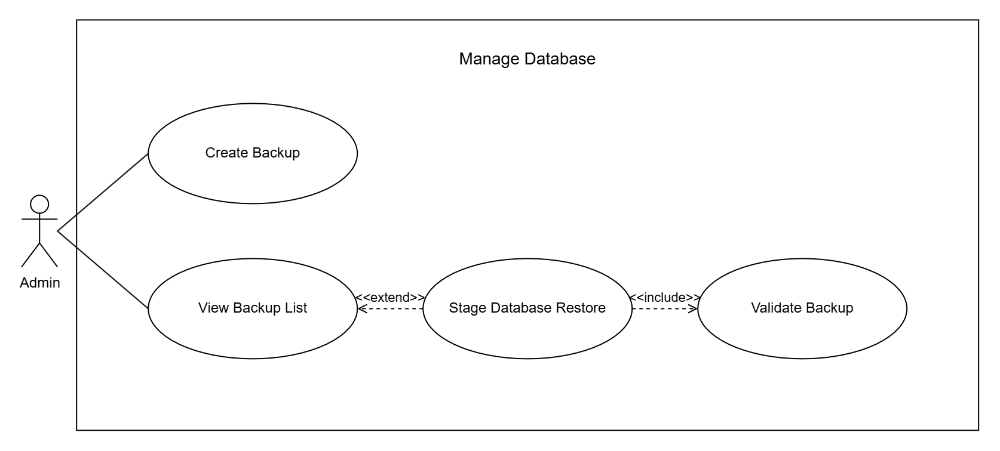

*Figure 3.16: System Use Case for manage database*

### A-074  ·  VIEW DATABASE TOOLS

**Use Case Name:** VIEW DATABASE TOOLS  
**Purpose:** Show database health: file size, integrity check, applied and pending migrations, and the backups on disk.  
**Actors:**

- Admin (Primary Actor)

**Input Parameters:**

- None beyond the signed-in identity carried on the authentication cookie.

**Output Parameters:**

- The rendered page, or a JSON payload where the caller is the page’s own script.

**Pre-Condition:**

- The caller is signed in as an administrator.

**Post-Condition:**

- The caller has the requested information. Nothing in the database has changed.

**Successful Scenario:**

1. The Admin opens the page and CAMS confirms the role on the authentication cookie.
2. The server reads the records the caller is entitled to see.
3. The page renders with those records.

**Exception Scenario:**

- **Not signed in or wrong role** — the request is refused and the caller is sent to the access denied page.

**Additional Remarks:**

- Implemented by `AdminDatabaseController.Index` (GET).
- Appears in the *MANAGE DATABASE* module of the use case diagram.

### A-075  ·  CREATE BACKUP

**Use Case Name:** CREATE BACKUP  
**Purpose:** Take a backup copy of the SQLite database file and store it on the server.  
**Actors:**

- Admin (Primary Actor)

**Input Parameters:**

- `label` : `string?`

**Output Parameters:**

- A redirect back to the listing page, carrying a success or failure message for display.

**Pre-Condition:**

- The caller is signed in as an administrator.

**Post-Condition:**

- The change is committed to the database and visible to the next read.
- The caller sees the outcome reported on the page they return to.

**Successful Scenario:**

1. The Admin opens the page and CAMS confirms the role on the authentication cookie.
2. The Admin fills the form and submits it.
3. The server validates the antiforgery token that accompanied the form.
4. The server validates the submitted values against the model rules.
5. The change is written to the database through `ApplicationDbContext`.
6. The server redirects back to the listing, where the result is shown.

**Exception Scenario:**

- **Not signed in or wrong role** — the request is refused and the caller is sent to the access denied page.
- **Missing or stale antiforgery token** — the submission is rejected and must be retried from a freshly loaded form.
- **Validation fails** — the form is redisplayed with the offending fields marked and nothing is written.

**Additional Remarks:**

- Implemented by `AdminDatabaseController.CreateBackup` (POST).
- Appears in the *MANAGE DATABASE* module of the use case diagram.

### A-076  ·  VALIDATE BACKUP

**Use Case Name:** VALIDATE BACKUP  
**Purpose:** Check that a backup file is a readable, intact database before anybody relies on it.  
**Actors:**

- Admin (Primary Actor)

**Input Parameters:**

- `backupFileName` : `string`

**Output Parameters:**

- A redirect back to the listing page, carrying a success or failure message for display.

**Pre-Condition:**

- The caller is signed in as an administrator.

**Post-Condition:**

- The change is committed to the database and visible to the next read.
- The caller sees the outcome reported on the page they return to.

**Successful Scenario:**

1. The Admin opens the page and CAMS confirms the role on the authentication cookie.
2. The Admin fills the form and submits it.
3. The server validates the antiforgery token that accompanied the form.
4. The server validates the submitted values against the model rules.
5. The change is written to the database through `ApplicationDbContext`.
6. The server redirects back to the listing, where the result is shown.

**Exception Scenario:**

- **Not signed in or wrong role** — the request is refused and the caller is sent to the access denied page.
- **Missing or stale antiforgery token** — the submission is rejected and must be retried from a freshly loaded form.
- **Validation fails** — the form is redisplayed with the offending fields marked and nothing is written.

**Additional Remarks:**

- Implemented by `AdminDatabaseController.ValidateBackup` (POST).
- Appears in the *MANAGE DATABASE* module of the use case diagram.

### A-077  ·  STAGE DATABASE RESTORE

**Use Case Name:** STAGE DATABASE RESTORE  
**Purpose:** Stage a backup so the server restores it on the next restart, rather than swapping the file underneath a running system.  
**Actors:**

- Admin (Primary Actor)

**Input Parameters:**

- `backupFileName` : `string`
- `confirmation` : `string?`

**Output Parameters:**

- A redirect back to the listing page, carrying a success or failure message for display.

**Pre-Condition:**

- The caller is signed in as an administrator.

**Post-Condition:**

- The change is committed to the database and visible to the next read.
- The caller sees the outcome reported on the page they return to.

**Successful Scenario:**

1. The Admin opens the page and CAMS confirms the role on the authentication cookie.
2. The Admin fills the form and submits it.
3. The server validates the antiforgery token that accompanied the form.
4. The server validates the submitted values against the model rules.
5. The change is written to the database through `ApplicationDbContext`.
6. The server redirects back to the listing, where the result is shown.

**Exception Scenario:**

- **Not signed in or wrong role** — the request is refused and the caller is sent to the access denied page.
- **Missing or stale antiforgery token** — the submission is rejected and must be retried from a freshly loaded form.
- **Validation fails** — the form is redisplayed with the offending fields marked and nothing is written.

**Additional Remarks:**

- Implemented by `AdminDatabaseController.StageRestore` (POST).
- Appears in the *MANAGE DATABASE* module of the use case diagram.

## MANAGE DEPLOYMENT  ·  `AdminDeploymentController`

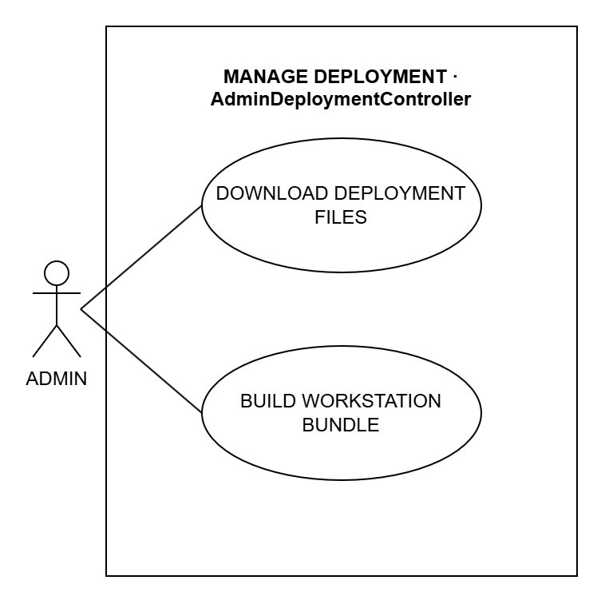

*Figure 3.17: System Use Case for manage deployment*

### A-078  ·  VIEW DEPLOYMENT HUB

**Use Case Name:** VIEW DEPLOYMENT HUB  
**Purpose:** Show the deployment hub: release version, installer and certificate state, and the endpoint clients should use.  
**Actors:**

- Admin (Primary Actor)

**Input Parameters:**

- None beyond the signed-in identity carried on the authentication cookie.

**Output Parameters:**

- The rendered page, or a JSON payload where the caller is the page’s own script.

**Pre-Condition:**

- The caller is signed in as an administrator.

**Post-Condition:**

- The caller has the requested information. Nothing in the database has changed.

**Successful Scenario:**

1. The Admin opens the page and CAMS confirms the role on the authentication cookie.
2. The server reads the records the caller is entitled to see.
3. The page renders with those records.

**Exception Scenario:**

- **Not signed in or wrong role** — the request is refused and the caller is sent to the access denied page.

**Additional Remarks:**

- Implemented by `AdminDeploymentController.Index` (GET).
- Appears in the *MANAGE DEPLOYMENT* module of the use case diagram.

### A-079  ·  DOWNLOAD INSTALLER

**Use Case Name:** DOWNLOAD INSTALLER  
**Purpose:** Download the client installer for deployment to a workstation.  
**Actors:**

- Admin (Primary Actor)

**Input Parameters:**

- None beyond the signed-in identity carried on the authentication cookie.

**Output Parameters:**

- The rendered page, or a JSON payload where the caller is the page’s own script.

**Pre-Condition:**

- The caller is signed in as an administrator.

**Post-Condition:**

- The caller has the requested information. Nothing in the database has changed.

**Successful Scenario:**

1. The Admin opens the page and CAMS confirms the role on the authentication cookie.
2. The server reads the records the caller is entitled to see.
3. The page renders with those records.

**Exception Scenario:**

- **Not signed in or wrong role** — the request is refused and the caller is sent to the access denied page.

**Additional Remarks:**

- Implemented by `AdminDeploymentController.Installer` (GET).
- Appears in the *MANAGE DEPLOYMENT* module of the use case diagram.

### A-080  ·  DOWNLOAD MANIFEST

**Use Case Name:** DOWNLOAD MANIFEST  
**Purpose:** Download the release manifest listing the files and their hashes.  
**Actors:**

- Admin (Primary Actor)

**Input Parameters:**

- None beyond the signed-in identity carried on the authentication cookie.

**Output Parameters:**

- The rendered page, or a JSON payload where the caller is the page’s own script.

**Pre-Condition:**

- The caller is signed in as an administrator.

**Post-Condition:**

- The caller has the requested information. Nothing in the database has changed.

**Successful Scenario:**

1. The Admin opens the page and CAMS confirms the role on the authentication cookie.
2. The server reads the records the caller is entitled to see.
3. The page renders with those records.

**Exception Scenario:**

- **Not signed in or wrong role** — the request is refused and the caller is sent to the access denied page.

**Additional Remarks:**

- Implemented by `AdminDeploymentController.Manifest` (GET).
- Appears in the *MANAGE DEPLOYMENT* module of the use case diagram.

### A-081  ·  DOWNLOAD ROOT CERTIFICATE

**Use Case Name:** DOWNLOAD ROOT CERTIFICATE  
**Purpose:** Download the root certificate a workstation must trust to reach the server over HTTPS.  
**Actors:**

- Admin (Primary Actor)

**Input Parameters:**

- None beyond the signed-in identity carried on the authentication cookie.

**Output Parameters:**

- The rendered page, or a JSON payload where the caller is the page’s own script.

**Pre-Condition:**

- The caller is signed in as an administrator.

**Post-Condition:**

- The caller has the requested information. Nothing in the database has changed.

**Successful Scenario:**

1. The Admin opens the page and CAMS confirms the role on the authentication cookie.
2. The server reads the records the caller is entitled to see.
3. The page renders with those records.

**Exception Scenario:**

- **Not signed in or wrong role** — the request is refused and the caller is sent to the access denied page.

**Additional Remarks:**

- Implemented by `AdminDeploymentController.RootCertificate` (GET).
- Appears in the *MANAGE DEPLOYMENT* module of the use case diagram.

### A-082  ·  CREATE BUNDLE

**Use Case Name:** CREATE BUNDLE  
**Purpose:** Build and download an offline client bundle for a workstation with no access to the server yet.  
**Actors:**

- Admin (Primary Actor)

**Input Parameters:**

- `endpoint` : `string`

**Output Parameters:**

- A redirect back to the listing page, carrying a success or failure message for display.

**Pre-Condition:**

- The caller is signed in as an administrator.

**Post-Condition:**

- The change is committed to the database and visible to the next read.
- The caller sees the outcome reported on the page they return to.

**Successful Scenario:**

1. The Admin opens the page and CAMS confirms the role on the authentication cookie.
2. The Admin fills the form and submits it.
3. The server validates the antiforgery token that accompanied the form.
4. The server validates the submitted values against the model rules.
5. The change is written to the database through `ApplicationDbContext`.
6. The server redirects back to the listing, where the result is shown.

**Exception Scenario:**

- **Not signed in or wrong role** — the request is refused and the caller is sent to the access denied page.
- **Missing or stale antiforgery token** — the submission is rejected and must be retried from a freshly loaded form.
- **Validation fails** — the form is redisplayed with the offending fields marked and nothing is written.

**Additional Remarks:**

- Implemented by `AdminDeploymentController.Bundle` (POST).
- Appears in the *MANAGE DEPLOYMENT* module of the use case diagram.

# TEACHER

## PROCESS LOG IN  ·  `AccountController`

*Figure 3.18: System Use Case for process log in*

### T-083  ·  AUTHENTICATE USER

**Use Case Name:** AUTHENTICATE USER  
**Purpose:** Let a person sign in to the CAMS web portal with a username and password, and place them in the part of the system their role allows.  
**Actors:**

- Teacher (Primary Actor)

**Input Parameters:**

- `username` : `string`
- `password` : `string`

**Output Parameters:**

- An authentication cookie carrying the account role as a claim, and a redirect to the landing page for that role.

**Pre-Condition:**

- None. This is the sign-in endpoint and is reachable without an account session; the CAMS server must be running and reachable.

**Post-Condition:**

- The change is committed to the database and visible to the next read.
- The caller sees the outcome reported on the page they return to.

**Successful Scenario:**

1. The Teacher opens the CAMS sign-in page.
2. The Teacher enters a username and a password and submits the form.
3. The server validates the antiforgery token that accompanied the form.
4. The server checks the credentials against each account table in turn and finds the matching account.
5. The server confirms the account is active and not locked out.
6. The server issues an authentication cookie carrying the role as a claim.
7. The Teacher is redirected to the landing page for that role.

**Exception Scenario:**

- **The username matches no account** — the page reports that the sign-in failed, without saying which half was wrong.
- **The password does not match the stored hash** — the failed-attempt counter is raised and the same message is shown.
- **The account is locked out** — the sign-in is refused until the lockout expires, even with the right password.
- **The account is deactivated** — the sign-in is refused and the person is told to contact an administrator.

**Additional Remarks:**

- Implemented by `AccountController.Login` (POST).
- Appears in the *PROCESS LOG IN* module of the use case diagram.

### T-084  ·  SIGN OUT USER

**Use Case Name:** SIGN OUT USER  
**Purpose:** End the signed-in session and clear the authentication cookie, so the next visitor to the browser starts as an anonymous user.  
**Actors:**

- Teacher (Primary Actor)

**Input Parameters:**

- None beyond the signed-in identity carried on the authentication cookie.

**Output Parameters:**

- The authentication cookie is cleared and the browser is returned to the sign-in page.

**Pre-Condition:**

- The caller is signed in.

**Post-Condition:**

- The change is committed to the database and visible to the next read.
- The caller sees the outcome reported on the page they return to.

**Successful Scenario:**

1. The Teacher chooses to sign out.
2. The server closes any lab session the account still has open.
3. The server clears the authentication cookie.
4. The browser is returned to the sign-in page as an anonymous visitor.

**Exception Scenario:**

- **Not signed in or wrong role** — the request is refused and the caller is sent to the access denied page.
- **Validation fails** — the form is redisplayed with the offending fields marked and nothing is written.

**Additional Remarks:**

- Implemented by `AccountController.Logout` (POST).
- Appears in the *PROCESS LOG IN* module of the use case diagram.

## MANAGE OWN ACCOUNT  ·  `TeacherController`

*Figure 3.19: System Use Case for manage own account*

### T-085  ·  VIEW SETTINGS

**Use Case Name:** VIEW SETTINGS  
**Purpose:** Show the settings page for the signed-in user.  
**Actors:**

- Teacher (Primary Actor)

**Input Parameters:**

- None beyond the signed-in identity carried on the authentication cookie.

**Output Parameters:**

- The rendered page, or a JSON payload where the caller is the page’s own script.

**Pre-Condition:**

- The caller is signed in as a teacher.

**Post-Condition:**

- The caller has the requested information. Nothing in the database has changed.

**Successful Scenario:**

1. The Teacher opens the page and CAMS confirms the role on the authentication cookie.
2. The server reads the records the caller is entitled to see.
3. The page renders with those records.

**Exception Scenario:**

- **Not signed in or wrong role** — the request is refused and the caller is sent to the access denied page.

**Additional Remarks:**

- Implemented by `TeacherController.Settings` (GET).
- Appears in the *MANAGE OWN ACCOUNT* module of the use case diagram.

### T-086  ·  CHANGE PASSWORD

**Use Case Name:** CHANGE PASSWORD  
**Purpose:** Let the signed-in user replace their own password after proving they know the current one.  
**Actors:**

- Teacher (Primary Actor)

**Input Parameters:**

- `input` : `PasswordChangeInput`

**Output Parameters:**

- A redirect back to the listing page, carrying a success or failure message for display.

**Pre-Condition:**

- The caller is signed in as a teacher.

**Post-Condition:**

- The change is committed to the database and visible to the next read.
- The caller sees the outcome reported on the page they return to.

**Successful Scenario:**

1. The Teacher opens the page and CAMS confirms the role on the authentication cookie.
2. The Teacher fills the form and submits it.
3. The server validates the antiforgery token that accompanied the form.
4. The server validates the submitted values against the model rules.
5. The change is written to the database through `ApplicationDbContext`.
6. The server redirects back to the listing, where the result is shown.

**Exception Scenario:**

- **Not signed in or wrong role** — the request is refused and the caller is sent to the access denied page.
- **Missing or stale antiforgery token** — the submission is rejected and must be retried from a freshly loaded form.
- **Validation fails** — the form is redisplayed with the offending fields marked and nothing is written.

**Additional Remarks:**

- Implemented by `TeacherController.ChangePassword` (POST).
- Appears in the *MANAGE OWN ACCOUNT* module of the use case diagram.

## MANAGE PEER TEACHER ACCOUNT  ·  `AdminController`

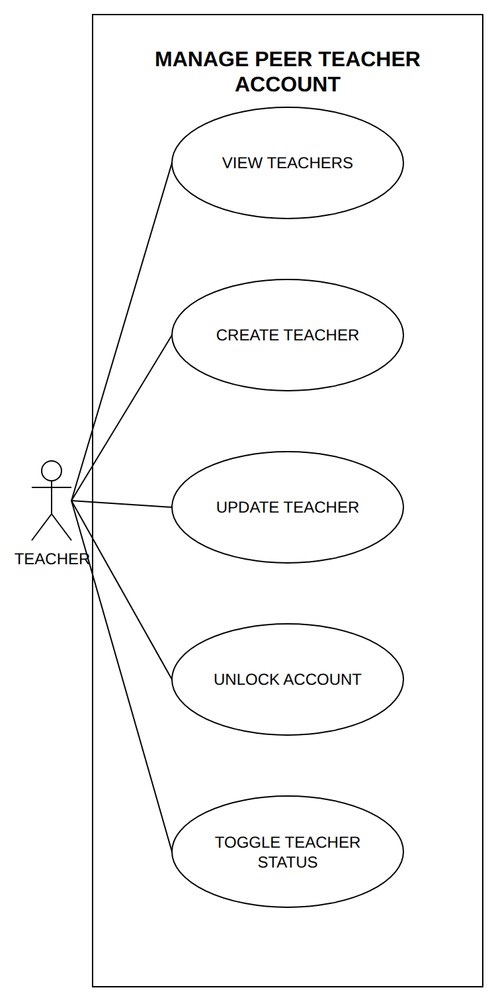

*Figure 3.20: System Use Case for manage peer teacher account*

### T-087  ·  VIEW TEACHERS

**Use Case Name:** VIEW TEACHERS  
**Purpose:** List the teachers the signed-in user is allowed to see.  
**Actors:**

- Teacher (Primary Actor)

**Input Parameters:**

- None beyond the signed-in identity carried on the authentication cookie.

**Output Parameters:**

- The rendered page, or a JSON payload where the caller is the page’s own script.

**Pre-Condition:**

- The caller is signed in as an administrator or a teacher. A teacher reaches this action only because it carries `[TeacherSharedAction]`; the teacher account must also be active.

**Post-Condition:**

- The caller has the requested information. Nothing in the database has changed.

**Successful Scenario:**

1. The Teacher opens the page and CAMS confirms the role on the authentication cookie.
2. The server reads the records the caller is entitled to see.
3. The page renders with those records.

**Exception Scenario:**

- **Not signed in or wrong role** — the request is refused and the caller is sent to the access denied page.

**Additional Remarks:**

- Implemented by `AdminController.Teachers` (GET).
- Appears in the *MANAGE PEER TEACHER ACCOUNT* module of the use case diagram.

### T-088  ·  CREATE TEACHER

**Use Case Name:** CREATE TEACHER  
**Purpose:** Record a new teacher account in the system.  
**Actors:**

- Teacher (Primary Actor)

**Input Parameters:**

- `teacher` : `Teacher`

**Output Parameters:**

- A redirect back to the listing page, carrying a success or failure message for display.

**Pre-Condition:**

- The caller is signed in as an administrator or a teacher. A teacher reaches this action only because it carries `[TeacherSharedAction]`; the teacher account must also be active.

**Post-Condition:**

- The change is committed to the database and visible to the next read.
- The caller sees the outcome reported on the page they return to.

**Successful Scenario:**

1. The Teacher opens the page and CAMS confirms the role on the authentication cookie.
2. The Teacher fills the form and submits it.
3. The server validates the antiforgery token that accompanied the form.
4. The server validates the submitted values against the model rules.
5. The change is written to the database through `ApplicationDbContext`.
6. The server redirects back to the listing, where the result is shown.

**Exception Scenario:**

- **Not signed in or wrong role** — the request is refused and the caller is sent to the access denied page.
- **Missing or stale antiforgery token** — the submission is rejected and must be retried from a freshly loaded form.
- **Validation fails** — the form is redisplayed with the offending fields marked and nothing is written.

**Additional Remarks:**

- Implemented by `AdminController.CreateTeacher` (POST).
- Appears in the *MANAGE PEER TEACHER ACCOUNT* module of the use case diagram.

### T-089  ·  UPDATE TEACHER

**Use Case Name:** UPDATE TEACHER  
**Purpose:** Amend the stored details of an existing teacher account.  
**Actors:**

- Teacher (Primary Actor)

**Input Parameters:**

- `teacher` : `Teacher`
- `newPassword` : `string?`

**Output Parameters:**

- A redirect back to the listing page, carrying a success or failure message for display.

**Pre-Condition:**

- The caller is signed in as an administrator or a teacher. A teacher reaches this action only because it carries `[TeacherSharedAction]`; the teacher account must also be active.

**Post-Condition:**

- The change is committed to the database and visible to the next read.
- The caller sees the outcome reported on the page they return to.

**Successful Scenario:**

1. The Teacher opens the page and CAMS confirms the role on the authentication cookie.
2. The Teacher fills the form and submits it.
3. The server validates the antiforgery token that accompanied the form.
4. The server validates the submitted values against the model rules.
5. The change is written to the database through `ApplicationDbContext`.
6. The server redirects back to the listing, where the result is shown.

**Exception Scenario:**

- **Not signed in or wrong role** — the request is refused and the caller is sent to the access denied page.
- **Missing or stale antiforgery token** — the submission is rejected and must be retried from a freshly loaded form.
- **Validation fails** — the form is redisplayed with the offending fields marked and nothing is written.

**Additional Remarks:**

- Implemented by `AdminController.UpdateTeacher` (POST).
- Appears in the *MANAGE PEER TEACHER ACCOUNT* module of the use case diagram.

### T-090  ·  UNLOCK ACCOUNT

**Use Case Name:** UNLOCK ACCOUNT  
**Purpose:** Clear the lockout on an account that has been locked by repeated failed sign-in attempts.  
**Actors:**

- Teacher (Primary Actor)

**Input Parameters:**

- `accountRole` : `AccountRole`
- `id` : `int`

**Output Parameters:**

- A redirect back to the listing page, carrying a success or failure message for display.

**Pre-Condition:**

- The caller is signed in as an administrator or a teacher. A teacher reaches this action only because it carries `[TeacherSharedAction]`; the teacher account must also be active.
- The record named by the identifier exists.

**Post-Condition:**

- The change is committed to the database and visible to the next read.
- The caller sees the outcome reported on the page they return to.

**Successful Scenario:**

1. The Teacher opens the page and CAMS confirms the role on the authentication cookie.
2. The Teacher fills the form and submits it.
3. The server validates the antiforgery token that accompanied the form.
4. The server validates the submitted values against the model rules.
5. The change is written to the database through `ApplicationDbContext`.
6. The server redirects back to the listing, where the result is shown.

**Exception Scenario:**

- **Not signed in or wrong role** — the request is refused and the caller is sent to the access denied page.
- **Missing or stale antiforgery token** — the submission is rejected and must be retried from a freshly loaded form.
- **Validation fails** — the form is redisplayed with the offending fields marked and nothing is written.
- **The identifier matches no record** — the action reports that the record was not found and makes no change.

**Additional Remarks:**

- Implemented by `AdminController.UnlockAccount` (POST).
- Appears in the *MANAGE PEER TEACHER ACCOUNT* module of the use case diagram.

### T-091  ·  TOGGLE TEACHER STATUS

**Use Case Name:** TOGGLE TEACHER STATUS  
**Purpose:** Activate or deactivate a teacher account instead of deleting it, so the teacher can no longer sign in while their classes, sessions and records are kept.  
**Actors:**

- Teacher (Primary Actor)

**Input Parameters:**

- `accountRole` : `AccountRole` (Teacher)
- `id` : `int`
- `isActive` : `bool`

**Output Parameters:**

- A redirect back to the listing page, carrying a success or failure message for display.

**Pre-Condition:**

- The caller is signed in as a teacher. The shared administration page admits a teacher because the action carries `[TeacherSharedAction]`.
- The record named by the identifier exists.

**Post-Condition:**

- The new status is committed; an inactive teacher cannot sign in until reactivated.
- The record stays in the database with its history; only its status changes, so it can be switched back at any time.

**Successful Scenario:**

1. The Teacher opens the Teachers page and CAMS confirms the role on the authentication cookie.
2. The Teacher chooses Activate or Deactivate beside a teacher account and confirms the prompt.
3. The server validates the antiforgery token that accompanied the form.
4. The server sets the account's `Status` to Active or Inactive, saves it and writes an audit entry.
5. The server redirects back to the Teachers page, where the new status is shown.

**Exception Scenario:**

- **Not signed in or wrong role** — the request is refused and the caller is sent to the access denied page.
- **Missing or stale antiforgery token** — the submission is rejected and must be retried from a freshly loaded form.
- **The identifier matches no record** — the action reports that the record was not found and makes no change.
- **The teacher still has active classes** — deactivation is refused until those classes are reassigned or archived.
- **A teacher deactivating their own account, or the last active teacher** — the change is refused and the reason is shown.

**Additional Remarks:**

- Implemented by `AdminController.SetAccountActive` (POST).
- Replaces the delete use case: CAMS keeps the record and changes its status, so history is never lost.
- Appears in the *MANAGE PEER TEACHER ACCOUNT* module of the use case diagram.

## MANAGE STUDENT ACCOUNT  ·  `TeacherController`

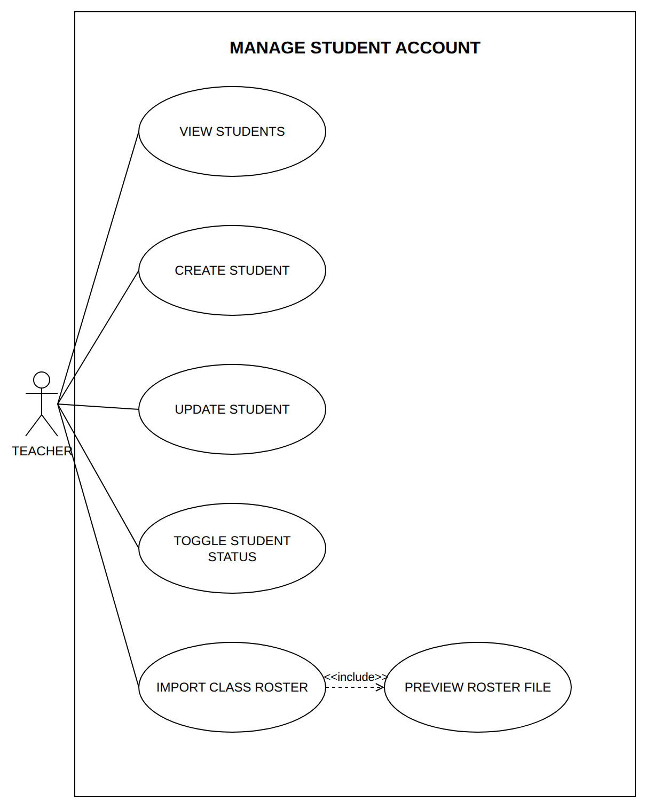

*Figure 3.21: System Use Case for manage student account*

### T-092  ·  VIEW STUDENTS

**Use Case Name:** VIEW STUDENTS  
**Purpose:** List the students the signed-in user is allowed to see.  
**Actors:**

- Teacher (Primary Actor)

**Input Parameters:**

- `search` : `string?` (optional)

**Output Parameters:**

- The rendered page, or a JSON payload where the caller is the page’s own script.

**Pre-Condition:**

- The caller is signed in as a teacher.

**Post-Condition:**

- The caller has the requested information. Nothing in the database has changed.

**Successful Scenario:**

1. The Teacher opens the page and CAMS confirms the role on the authentication cookie.
2. The server reads the records the caller is entitled to see.
3. The page renders with those records.

**Exception Scenario:**

- **Not signed in or wrong role** — the request is refused and the caller is sent to the access denied page.

**Additional Remarks:**

- Implemented by `TeacherController.Students` (GET).
- Appears in the *MANAGE STUDENT ACCOUNT* module of the use case diagram.

### T-093  ·  CREATE STUDENT

**Use Case Name:** CREATE STUDENT  
**Purpose:** Record a new student account in the system.  
**Actors:**

- Teacher (Primary Actor)

**Input Parameters:**

- `student` : `Student`
- `classId` : `int?` (optional)
- `search` : `string?` (optional)

**Output Parameters:**

- A redirect back to the listing page, carrying a success or failure message for display.

**Pre-Condition:**

- The caller is signed in as a teacher.
- The record named by the identifier exists.

**Post-Condition:**

- The change is committed to the database and visible to the next read.
- The caller sees the outcome reported on the page they return to.

**Successful Scenario:**

1. The Teacher opens the page and CAMS confirms the role on the authentication cookie.
2. The Teacher fills the form and submits it.
3. The server validates the antiforgery token that accompanied the form.
4. The server validates the submitted values against the model rules.
5. The change is written to the database through `ApplicationDbContext`.
6. The server redirects back to the listing, where the result is shown.

**Exception Scenario:**

- **Not signed in or wrong role** — the request is refused and the caller is sent to the access denied page.
- **Missing or stale antiforgery token** — the submission is rejected and must be retried from a freshly loaded form.
- **Validation fails** — the form is redisplayed with the offending fields marked and nothing is written.
- **The identifier matches no record** — the action reports that the record was not found and makes no change.

**Additional Remarks:**

- Implemented by `TeacherController.CreateStudent` (POST).
- Appears in the *MANAGE STUDENT ACCOUNT* module of the use case diagram.

### T-094  ·  UPDATE STUDENT

**Use Case Name:** UPDATE STUDENT  
**Purpose:** Amend the stored details of an existing student account.  
**Actors:**

- Teacher (Primary Actor)

**Input Parameters:**

- `student` : `Student`
- `newPassword` : `string?`
- `search` : `string?` (optional)

**Output Parameters:**

- A redirect back to the listing page, carrying a success or failure message for display.

**Pre-Condition:**

- The caller is signed in as a teacher.

**Post-Condition:**

- The change is committed to the database and visible to the next read.
- The caller sees the outcome reported on the page they return to.

**Successful Scenario:**

1. The Teacher opens the page and CAMS confirms the role on the authentication cookie.
2. The Teacher fills the form and submits it.
3. The server validates the antiforgery token that accompanied the form.
4. The server validates the submitted values against the model rules.
5. The change is written to the database through `ApplicationDbContext`.
6. The server redirects back to the listing, where the result is shown.

**Exception Scenario:**

- **Not signed in or wrong role** — the request is refused and the caller is sent to the access denied page.
- **Missing or stale antiforgery token** — the submission is rejected and must be retried from a freshly loaded form.
- **Validation fails** — the form is redisplayed with the offending fields marked and nothing is written.

**Additional Remarks:**

- Implemented by `TeacherController.UpdateStudent` (POST).
- Appears in the *MANAGE STUDENT ACCOUNT* module of the use case diagram.

### T-095  ·  TOGGLE STUDENT STATUS

**Use Case Name:** TOGGLE STUDENT STATUS  
**Purpose:** Activate or deactivate a student account instead of deleting it, so the student cannot sign in at a workstation while their attendance and activity history are kept.  
**Actors:**

- Teacher (Primary Actor)

**Input Parameters:**

- `accountRole` : `AccountRole` (Student)
- `id` : `int`
- `isActive` : `bool`

**Output Parameters:**

- A redirect back to the listing page, carrying a success or failure message for display.

**Pre-Condition:**

- The caller is signed in as a teacher. The shared administration page admits a teacher because the action carries `[TeacherSharedAction]`.
- The record named by the identifier exists.

**Post-Condition:**

- The new status is committed; an inactive student cannot sign in at a workstation until reactivated.
- The record stays in the database with its history; only its status changes, so it can be switched back at any time.

**Successful Scenario:**

1. The Teacher opens the Students page and CAMS confirms the role on the authentication cookie.
2. The Teacher chooses Activate or Deactivate beside a student and confirms the prompt.
3. The server validates the antiforgery token that accompanied the form.
4. The server sets the account's `Status` to Active or Inactive, saves it and writes an audit entry.
5. The server redirects back to the Students page, where the new status is shown.

**Exception Scenario:**

- **Not signed in or wrong role** — the request is refused and the caller is sent to the access denied page.
- **Missing or stale antiforgery token** — the submission is rejected and must be retried from a freshly loaded form.
- **The identifier matches no record** — the action reports that the record was not found and makes no change.

**Additional Remarks:**

- Implemented by `AdminController.SetAccountActive` (POST).
- Replaces the delete use case: CAMS keeps the record and changes its status, so history is never lost.
- Appears in the *MANAGE STUDENT ACCOUNT* module of the use case diagram.

### T-096  ·  IMPORT CLASS ROSTER

**Use Case Name:** IMPORT CLASS ROSTER  
**Purpose:** Create many student accounts at once and enrol them into a class in the same operation.  
**Actors:**

- Teacher (Primary Actor)

**Input Parameters:**

- `classId` : `int`
- `bulkFirstNames` : `List<string>?`
- `bulkLastNames` : `List<string>?`
- `bulkUserNames` : `List<string>?`
- `bulkPasswords` : `List<string>?`

**Output Parameters:**

- A redirect back to the listing page, carrying a success or failure message for display.

**Pre-Condition:**

- The caller is signed in as a teacher.
- The record named by the identifier exists.

**Post-Condition:**

- The change is committed to the database and visible to the next read.
- The caller sees the outcome reported on the page they return to.

**Successful Scenario:**

1. The Teacher opens the page and CAMS confirms the role on the authentication cookie.
2. The Teacher fills the form and submits it.
3. The server validates the antiforgery token that accompanied the form.
4. The server validates the submitted values against the model rules.
5. The change is written to the database through `ApplicationDbContext`.
6. The server redirects back to the listing, where the result is shown.

**Exception Scenario:**

- **Not signed in or wrong role** — the request is refused and the caller is sent to the access denied page.
- **Missing or stale antiforgery token** — the submission is rejected and must be retried from a freshly loaded form.
- **Validation fails** — the form is redisplayed with the offending fields marked and nothing is written.
- **The identifier matches no record** — the action reports that the record was not found and makes no change.

**Additional Remarks:**

- Implemented by `TeacherController.BulkAddStudents` (POST).
- Appears in the *MANAGE STUDENT ACCOUNT* module of the use case diagram.
- Pulls in **PREVIEW ROSTER FILE** (`<<include>>`).

### T-097  ·  PREVIEW ROSTER FILE

**Use Case Name:** PREVIEW ROSTER FILE  
**Purpose:** Parse the submitted CSV and show what would be created, so mistakes are caught before any account exists.  
**Actors:**

- Teacher (Primary Actor)
- None; this behaviour runs inside **IMPORT CLASS ROSTER** (Secondary Actor)

**Input Parameters:**

- `classId` : `int`
- `file` : `IFormFile?`

**Output Parameters:**

- A redirect back to the listing page, carrying a success or failure message for display.

**Pre-Condition:**

- The caller is signed in as a teacher.
- The record named by the identifier exists.
- **IMPORT CLASS ROSTER** has reached the point where this is always performed.

**Post-Condition:**

- The change is committed to the database and visible to the next read.
- The caller sees the outcome reported on the page they return to.

**Successful Scenario:**

1. The Teacher opens the page and CAMS confirms the role on the authentication cookie.
2. The Teacher fills the form and submits it.
3. The server validates the antiforgery token that accompanied the form.
4. The server validates the submitted values against the model rules.
5. The change is written to the database through `ApplicationDbContext`.
6. The server redirects back to the listing, where the result is shown.

**Exception Scenario:**

- **Not signed in or wrong role** — the request is refused and the caller is sent to the access denied page.
- **Missing or stale antiforgery token** — the submission is rejected and must be retried from a freshly loaded form.
- **Validation fails** — the form is redisplayed with the offending fields marked and nothing is written.
- **The identifier matches no record** — the action reports that the record was not found and makes no change.

**Additional Remarks:**

- Implemented by `TeacherController.BulkPreviewCsv` (POST).
- Appears in the *MANAGE STUDENT ACCOUNT* module of the use case diagram.
- Drawn as `<<include>>` from **IMPORT CLASS ROSTER**.

## MANAGE COMPUTER PROFILE  ·  `AdminController`

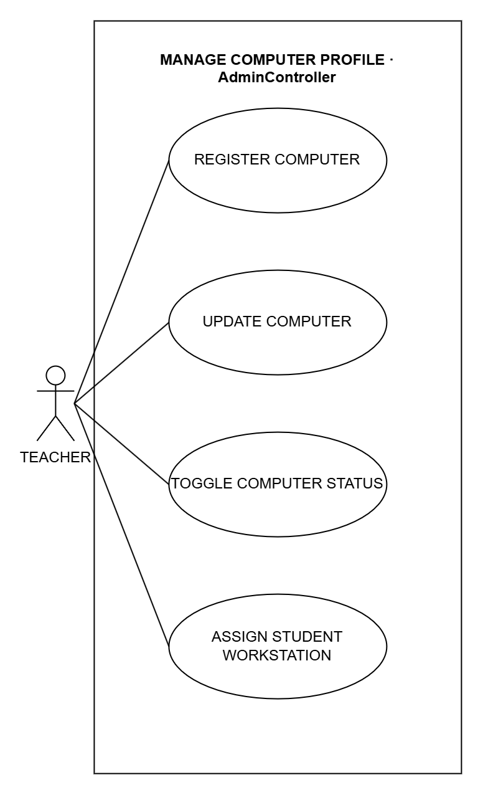

*Figure 3.22: System Use Case for manage computer profile*

### T-098  ·  VIEW COMPUTERS

**Use Case Name:** VIEW COMPUTERS  
**Purpose:** List the computers the signed-in user is allowed to see.  
**Actors:**

- Teacher (Primary Actor)

**Input Parameters:**

- None beyond the signed-in identity carried on the authentication cookie.

**Output Parameters:**

- The rendered page, or a JSON payload where the caller is the page’s own script.

**Pre-Condition:**

- The caller is signed in as an administrator or a teacher. A teacher reaches this action only because it carries `[TeacherSharedAction]`; the teacher account must also be active.

**Post-Condition:**

- The caller has the requested information. Nothing in the database has changed.

**Successful Scenario:**

1. The Teacher opens the page and CAMS confirms the role on the authentication cookie.
2. The server reads the records the caller is entitled to see.
3. The page renders with those records.

**Exception Scenario:**

- **Not signed in or wrong role** — the request is refused and the caller is sent to the access denied page.

**Additional Remarks:**

- Implemented by `AdminController.Computers` (GET).
- Appears in the *MANAGE COMPUTER PROFILE* module of the use case diagram.

### T-099  ·  REGISTER COMPUTER

**Use Case Name:** REGISTER COMPUTER  
**Purpose:** Record a new workstation profile in the system.  
**Actors:**

- Teacher (Primary Actor)

**Input Parameters:**

- `computer` : `Computer`

**Output Parameters:**

- A redirect back to the listing page, carrying a success or failure message for display.

**Pre-Condition:**

- The caller is signed in as an administrator or a teacher. A teacher reaches this action only because it carries `[TeacherSharedAction]`; the teacher account must also be active.

**Post-Condition:**

- The change is committed to the database and visible to the next read.
- The caller sees the outcome reported on the page they return to.

**Successful Scenario:**

1. The Teacher opens the page and CAMS confirms the role on the authentication cookie.
2. The Teacher fills the form and submits it.
3. The server validates the antiforgery token that accompanied the form.
4. The server validates the submitted values against the model rules.
5. The change is written to the database through `ApplicationDbContext`.
6. The server redirects back to the listing, where the result is shown.

**Exception Scenario:**

- **Not signed in or wrong role** — the request is refused and the caller is sent to the access denied page.
- **Missing or stale antiforgery token** — the submission is rejected and must be retried from a freshly loaded form.
- **Validation fails** — the form is redisplayed with the offending fields marked and nothing is written.

**Additional Remarks:**

- Implemented by `AdminController.CreateComputer` (POST).
- Appears in the *MANAGE COMPUTER PROFILE* module of the use case diagram.

### T-100  ·  UPDATE COMPUTER

**Use Case Name:** UPDATE COMPUTER  
**Purpose:** Amend the stored details of an existing workstation profile.  
**Actors:**

- Teacher (Primary Actor)

**Input Parameters:**

- `computer` : `Computer`

**Output Parameters:**

- A redirect back to the listing page, carrying a success or failure message for display.

**Pre-Condition:**

- The caller is signed in as an administrator or a teacher. A teacher reaches this action only because it carries `[TeacherSharedAction]`; the teacher account must also be active.

**Post-Condition:**

- The change is committed to the database and visible to the next read.
- The caller sees the outcome reported on the page they return to.

**Successful Scenario:**

1. The Teacher opens the page and CAMS confirms the role on the authentication cookie.
2. The Teacher fills the form and submits it.
3. The server validates the antiforgery token that accompanied the form.
4. The server validates the submitted values against the model rules.
5. The change is written to the database through `ApplicationDbContext`.
6. The server redirects back to the listing, where the result is shown.

**Exception Scenario:**

- **Not signed in or wrong role** — the request is refused and the caller is sent to the access denied page.
- **Missing or stale antiforgery token** — the submission is rejected and must be retried from a freshly loaded form.
- **Validation fails** — the form is redisplayed with the offending fields marked and nothing is written.

**Additional Remarks:**

- Implemented by `AdminController.UpdateComputer` (POST).
- Appears in the *MANAGE COMPUTER PROFILE* module of the use case diagram.

### T-101  ·  TOGGLE COMPUTER STATUS

**Use Case Name:** TOGGLE COMPUTER STATUS  
**Purpose:** Change a workstation's status - Available, In Use or Maintenance - or archive it, instead of deleting it, so past lab sessions and status history still resolve to a named station.  
**Actors:**

- Teacher (Primary Actor)

**Input Parameters:**

- `computer` : `Computer` (`ComputerId`, `Status`)

**Output Parameters:**

- A redirect back to the listing page, carrying a success or failure message for display.

**Pre-Condition:**

- The caller is signed in as a teacher. The shared administration page admits a teacher because the action carries `[TeacherSharedAction]`.
- The record named by the identifier exists.

**Post-Condition:**

- The new status is committed to the database and takes effect on the next read.
- The record stays in the database with its history; only its status changes, so it can be switched back at any time.

**Successful Scenario:**

1. The Teacher opens the Computers page and CAMS confirms the role on the authentication cookie.
2. The Teacher opens the workstation's edit form, chooses the new status (or chooses Archive) and saves.
3. The server writes the new status, adds an entry to the workstation's status history and writes an audit entry.
4. The server redirects back to the Computers page, where the new status is shown.

**Exception Scenario:**

- **Not signed in or wrong role** — the request is refused and the caller is sent to the access denied page.
- **The identifier matches no record** — the action reports that the record was not found and makes no change.
- **A lab session is running on the workstation** — archiving is refused until that session is ended.
- **Another workstation already has that station name** — the change is refused and nothing is written.

**Additional Remarks:**

- Implemented by `AdminController.UpdateComputer` (POST) for the status, and `AdminController.DeleteComputer` (POST), which archives rather than deletes.
- Replaces the delete use case: CAMS keeps the record and changes its status, so history is never lost.
- Appears in the *MANAGE COMPUTER PROFILE* module of the use case diagram.

### T-102  ·  MAP STUDENT WORKSTATION

**Use Case Name:** MAP STUDENT WORKSTATION  
**Purpose:** Map a workstation to a student so the workstation is recognised when that student signs in at it. An archived station cannot be mapped.  
**Actors:**

- Teacher (Primary Actor)

**Input Parameters:**

- `studentId` : `int`
- `computerId` : `int?`

**Output Parameters:**

- A redirect back to the listing page, carrying a success or failure message for display.

**Pre-Condition:**

- The caller is signed in as an administrator or a teacher. A teacher reaches this action only because it carries `[TeacherSharedAction]`; the teacher account must also be active.
- The record named by the identifier exists.

**Post-Condition:**

- The change is committed to the database and visible to the next read.
- The caller sees the outcome reported on the page they return to.

**Successful Scenario:**

1. The Teacher opens the page and CAMS confirms the role on the authentication cookie.
2. The Teacher fills the form and submits it.
3. The server validates the antiforgery token that accompanied the form.
4. The server validates the submitted values against the model rules.
5. The change is written to the database through `ApplicationDbContext`.
6. The server redirects back to the listing, where the result is shown.

**Exception Scenario:**

- **Not signed in or wrong role** — the request is refused and the caller is sent to the access denied page.
- **Missing or stale antiforgery token** — the submission is rejected and must be retried from a freshly loaded form.
- **Validation fails** — the form is redisplayed with the offending fields marked and nothing is written.
- **The identifier matches no record** — the action reports that the record was not found and makes no change.

**Additional Remarks:**

- Implemented by `AdminController.AssignComputer` (POST).
- Appears in the *MANAGE COMPUTER PROFILE* module of the use case diagram.

### T-103  ·  VIEW COMPUTER HISTORY

**Use Case Name:** VIEW COMPUTER HISTORY  
**Purpose:** Show the recorded status changes for a workstation, and who made each one.  
**Actors:**

- Teacher (Primary Actor)

**Input Parameters:**

- `id` : `int`

**Output Parameters:**

- The rendered page, or a JSON payload where the caller is the page’s own script.

**Pre-Condition:**

- The caller is signed in as an administrator or a teacher. A teacher reaches this action only because it carries `[TeacherSharedAction]`; the teacher account must also be active.
- The record named by the identifier exists.

**Post-Condition:**

- The caller has the requested information. Nothing in the database has changed.

**Successful Scenario:**

1. The Teacher opens the page and CAMS confirms the role on the authentication cookie.
2. The server reads the records the caller is entitled to see.
3. The page renders with those records.

**Exception Scenario:**

- **Not signed in or wrong role** — the request is refused and the caller is sent to the access denied page.
- **The identifier matches no record** — the action reports that the record was not found and makes no change.

**Additional Remarks:**

- Implemented by `AdminController.ComputerHistory` (GET).
- Appears in the *MANAGE COMPUTER PROFILE* module of the use case diagram.

## MANAGE CLASS  ·  `TeacherController`

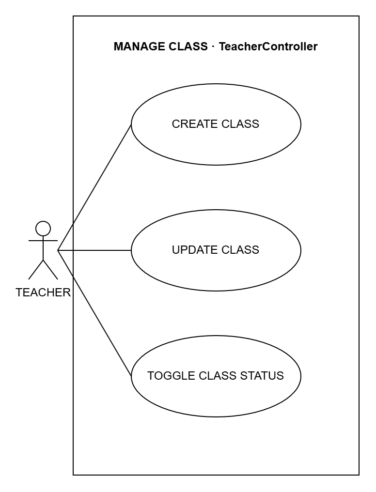

*Figure 3.23: System Use Case for manage class*

### T-104  ·  VIEW CLASSES

**Use Case Name:** VIEW CLASSES  
**Purpose:** List the classes the signed-in user is allowed to see.  
**Actors:**

- Teacher (Primary Actor)

**Input Parameters:**

- None beyond the signed-in identity carried on the authentication cookie.

**Output Parameters:**

- The rendered page, or a JSON payload where the caller is the page’s own script.

**Pre-Condition:**

- The caller is signed in as a teacher.

**Post-Condition:**

- The caller has the requested information. Nothing in the database has changed.

**Successful Scenario:**

1. The Teacher opens the page and CAMS confirms the role on the authentication cookie.
2. The server reads the records the caller is entitled to see.
3. The page renders with those records.

**Exception Scenario:**

- **Not signed in or wrong role** — the request is refused and the caller is sent to the access denied page.

**Additional Remarks:**

- Implemented by `TeacherController.Classes` (GET).
- Appears in the *MANAGE CLASS* module of the use case diagram.

### T-105  ·  CREATE CLASS

**Use Case Name:** CREATE CLASS  
**Purpose:** Record a new class in the system.  
**Actors:**

- Teacher (Primary Actor)

**Input Parameters:**

- `cls` : `Class`

**Output Parameters:**

- A redirect back to the listing page, carrying a success or failure message for display.

**Pre-Condition:**

- The caller is signed in as a teacher.

**Post-Condition:**

- The change is committed to the database and visible to the next read.
- The caller sees the outcome reported on the page they return to.

**Successful Scenario:**

1. The Teacher opens the page and CAMS confirms the role on the authentication cookie.
2. The Teacher fills the form and submits it.
3. The server validates the antiforgery token that accompanied the form.
4. The server validates the submitted values against the model rules.
5. The change is written to the database through `ApplicationDbContext`.
6. The server redirects back to the listing, where the result is shown.

**Exception Scenario:**

- **Not signed in or wrong role** — the request is refused and the caller is sent to the access denied page.
- **Missing or stale antiforgery token** — the submission is rejected and must be retried from a freshly loaded form.
- **Validation fails** — the form is redisplayed with the offending fields marked and nothing is written.

**Additional Remarks:**

- Implemented by `TeacherController.CreateClass` (POST).
- Appears in the *MANAGE CLASS* module of the use case diagram.

### T-106  ·  UPDATE CLASS

**Use Case Name:** UPDATE CLASS  
**Purpose:** Amend the stored details of an existing class.  
**Actors:**

- Teacher (Primary Actor)

**Input Parameters:**

- `cls` : `Class`

**Output Parameters:**

- A redirect back to the listing page, carrying a success or failure message for display.

**Pre-Condition:**

- The caller is signed in as a teacher.

**Post-Condition:**

- The change is committed to the database and visible to the next read.
- The caller sees the outcome reported on the page they return to.

**Successful Scenario:**

1. The Teacher opens the page and CAMS confirms the role on the authentication cookie.
2. The Teacher fills the form and submits it.
3. The server validates the antiforgery token that accompanied the form.
4. The server validates the submitted values against the model rules.
5. The change is written to the database through `ApplicationDbContext`.
6. The server redirects back to the listing, where the result is shown.

**Exception Scenario:**

- **Not signed in or wrong role** — the request is refused and the caller is sent to the access denied page.
- **Missing or stale antiforgery token** — the submission is rejected and must be retried from a freshly loaded form.
- **Validation fails** — the form is redisplayed with the offending fields marked and nothing is written.

**Additional Remarks:**

- Implemented by `TeacherController.UpdateClass` (POST).
- Appears in the *MANAGE CLASS* module of the use case diagram.

### T-107  ·  ASSIGN TEACHER

**Use Case Name:** ASSIGN TEACHER  
**Purpose:** Put a teacher in charge of a class.  
**Actors:**

- Teacher (Primary Actor)

**Input Parameters:**

- `classId` : `int`
- `teacherId` : `int?`

**Output Parameters:**

- A redirect back to the listing page, carrying a success or failure message for display.

**Pre-Condition:**

- The caller is signed in as a teacher.
- The record named by the identifier exists.

**Post-Condition:**

- The change is committed to the database and visible to the next read.
- The caller sees the outcome reported on the page they return to.

**Successful Scenario:**

1. The Teacher opens the page and CAMS confirms the role on the authentication cookie.
2. The Teacher fills the form and submits it.
3. The server validates the antiforgery token that accompanied the form.
4. The server validates the submitted values against the model rules.
5. The change is written to the database through `ApplicationDbContext`.
6. The server redirects back to the listing, where the result is shown.

**Exception Scenario:**

- **Not signed in or wrong role** — the request is refused and the caller is sent to the access denied page.
- **Missing or stale antiforgery token** — the submission is rejected and must be retried from a freshly loaded form.
- **Validation fails** — the form is redisplayed with the offending fields marked and nothing is written.
- **The identifier matches no record** — the action reports that the record was not found and makes no change.

**Additional Remarks:**

- Implemented by `TeacherController.AssignTeacher` (POST).
- Appears in the *MANAGE CLASS* module of the use case diagram.

### T-108  ·  TOGGLE CLASS STATUS

**Use Case Name:** TOGGLE CLASS STATUS  
**Purpose:** Archive an active class, or restore an archived one, instead of deleting it, so its roster, sessions and records are kept.  
**Actors:**

- Teacher (Primary Actor)

**Input Parameters:**

- `id` : `int`

**Output Parameters:**

- A redirect back to the listing page, carrying a success or failure message for display.

**Pre-Condition:**

- The caller is signed in as a teacher.
- The class exists and is assigned to the teacher.

**Post-Condition:**

- The new status is committed to the database and takes effect on the next read.
- The record stays in the database with its history; only its status changes, so it can be switched back at any time.

**Successful Scenario:**

1. The Teacher opens the Classes page and CAMS confirms the role on the authentication cookie.
2. The Teacher chooses Archive (or Restore) beside the class and confirms the prompt.
3. The server validates the antiforgery token that accompanied the form.
4. The server flips the class between active and archived, saves it and writes an audit entry.
5. The server redirects back to the Classes page, where the new status is shown.

**Exception Scenario:**

- **Not signed in or wrong role** — the request is refused and the caller is sent to the access denied page.
- **Missing or stale antiforgery token** — the submission is rejected and must be retried from a freshly loaded form.
- **The identifier matches no record** — the action reports that the record was not found and makes no change.
- **The class is not assigned to the teacher** — the change is refused and the listing reports it.

**Additional Remarks:**

- Implemented by `TeacherController.ArchiveClass` (POST).
- Replaces the delete use case: CAMS keeps the record and changes its status, so history is never lost.
- Appears in the *MANAGE CLASS* module of the use case diagram.

## MANAGE CLASS ROSTER  ·  `TeacherController`

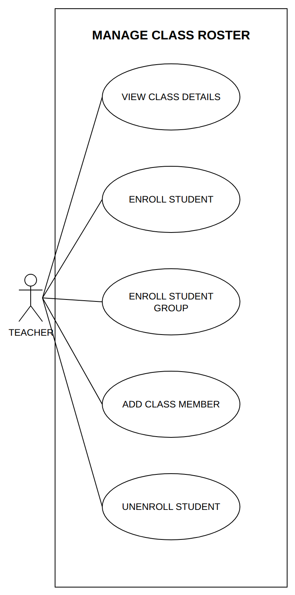

*Figure 3.24: System Use Case for manage class roster*

### T-109  ·  VIEW CLASS DETAILS

**Use Case Name:** VIEW CLASS DETAILS  
**Purpose:** Show one class with its roster and the students enrolled in it.  
**Actors:**

- Teacher (Primary Actor)

**Input Parameters:**

- `id` : `int`

**Output Parameters:**

- The rendered page, or a JSON payload where the caller is the page’s own script.

**Pre-Condition:**

- The caller is signed in as a teacher.
- The record named by the identifier exists.

**Post-Condition:**

- The caller has the requested information. Nothing in the database has changed.

**Successful Scenario:**

1. The Teacher opens the page and CAMS confirms the role on the authentication cookie.
2. The server reads the records the caller is entitled to see.
3. The page renders with those records.

**Exception Scenario:**

- **Not signed in or wrong role** — the request is refused and the caller is sent to the access denied page.
- **The identifier matches no record** — the action reports that the record was not found and makes no change.

**Additional Remarks:**

- Implemented by `TeacherController.ClassDetails` (GET).
- Appears in the *MANAGE CLASS ROSTER* module of the use case diagram.

### T-110  ·  ENROLL STUDENT

**Use Case Name:** ENROLL STUDENT  
**Purpose:** Add an existing student to a class roster.  
**Actors:**

- Teacher (Primary Actor)

**Input Parameters:**

- `classId` : `int`
- `studentId` : `int`
- `moveStudent` : `bool` (optional)

**Output Parameters:**

- A redirect back to the listing page, carrying a success or failure message for display.

**Pre-Condition:**

- The caller is signed in as a teacher.
- The record named by the identifier exists.

**Post-Condition:**

- The change is committed to the database and visible to the next read.
- The caller sees the outcome reported on the page they return to.

**Successful Scenario:**

1. The Teacher opens the page and CAMS confirms the role on the authentication cookie.
2. The Teacher fills the form and submits it.
3. The server validates the antiforgery token that accompanied the form.
4. The server validates the submitted values against the model rules.
5. The change is written to the database through `ApplicationDbContext`.
6. The server redirects back to the listing, where the result is shown.

**Exception Scenario:**

- **Not signed in or wrong role** — the request is refused and the caller is sent to the access denied page.
- **Missing or stale antiforgery token** — the submission is rejected and must be retried from a freshly loaded form.
- **Validation fails** — the form is redisplayed with the offending fields marked and nothing is written.
- **The identifier matches no record** — the action reports that the record was not found and makes no change.

**Additional Remarks:**

- Implemented by `TeacherController.EnrollStudent` (POST).
- Appears in the *MANAGE CLASS ROSTER* module of the use case diagram.

### T-111  ·  ENROLL STUDENT GROUP

**Use Case Name:** ENROLL STUDENT GROUP  
**Purpose:** Add several existing students to a class roster in one operation.  
**Actors:**

- Teacher (Primary Actor)

**Input Parameters:**

- `classId` : `int`
- `studentIds` : `List<int>?`
- `moveStudent` : `bool` (optional)

**Output Parameters:**

- A redirect back to the listing page, carrying a success or failure message for display.

**Pre-Condition:**

- The caller is signed in as a teacher.
- The record named by the identifier exists.

**Post-Condition:**

- The change is committed to the database and visible to the next read.
- The caller sees the outcome reported on the page they return to.

**Successful Scenario:**

1. The Teacher opens the page and CAMS confirms the role on the authentication cookie.
2. The Teacher fills the form and submits it.
3. The server validates the antiforgery token that accompanied the form.
4. The server validates the submitted values against the model rules.
5. The change is written to the database through `ApplicationDbContext`.
6. The server redirects back to the listing, where the result is shown.

**Exception Scenario:**

- **Not signed in or wrong role** — the request is refused and the caller is sent to the access denied page.
- **Missing or stale antiforgery token** — the submission is rejected and must be retried from a freshly loaded form.
- **Validation fails** — the form is redisplayed with the offending fields marked and nothing is written.
- **The identifier matches no record** — the action reports that the record was not found and makes no change.

**Additional Remarks:**

- Implemented by `TeacherController.EnrollStudents` (POST).
- Appears in the *MANAGE CLASS ROSTER* module of the use case diagram.

### T-112  ·  ADD CLASS MEMBER

**Use Case Name:** ADD CLASS MEMBER  
**Purpose:** Create a new student account and place it on a class roster in one step.  
**Actors:**

- Teacher (Primary Actor)

**Input Parameters:**

- `classId` : `int`
- `firstName` : `string`
- `lastName` : `string`
- `username` : `string?`
- `password` : `string?`

**Output Parameters:**

- A redirect back to the listing page, carrying a success or failure message for display.

**Pre-Condition:**

- The caller is signed in as a teacher.
- The record named by the identifier exists.

**Post-Condition:**

- The change is committed to the database and visible to the next read.
- The caller sees the outcome reported on the page they return to.

**Successful Scenario:**

1. The Teacher opens the page and CAMS confirms the role on the authentication cookie.
2. The Teacher fills the form and submits it.
3. The server validates the antiforgery token that accompanied the form.
4. The server validates the submitted values against the model rules.
5. The change is written to the database through `ApplicationDbContext`.
6. The server redirects back to the listing, where the result is shown.

**Exception Scenario:**

- **Not signed in or wrong role** — the request is refused and the caller is sent to the access denied page.
- **Missing or stale antiforgery token** — the submission is rejected and must be retried from a freshly loaded form.
- **Validation fails** — the form is redisplayed with the offending fields marked and nothing is written.
- **The identifier matches no record** — the action reports that the record was not found and makes no change.

**Additional Remarks:**

- Implemented by `TeacherController.AddStudentToClass` (POST).
- Appears in the *MANAGE CLASS ROSTER* module of the use case diagram.

### T-113  ·  UNENROLL STUDENT

**Use Case Name:** UNENROLL STUDENT  
**Purpose:** Take a student off a class roster while leaving the student account intact.  
**Actors:**

- Teacher (Primary Actor)

**Input Parameters:**

- `classId` : `int`
- `studentId` : `int`

**Output Parameters:**

- A redirect back to the listing page, carrying a success or failure message for display.

**Pre-Condition:**

- The caller is signed in as a teacher.
- The record named by the identifier exists.

**Post-Condition:**

- The change is committed to the database and visible to the next read.
- The caller sees the outcome reported on the page they return to.

**Successful Scenario:**

1. The Teacher opens the page and CAMS confirms the role on the authentication cookie.
2. The Teacher fills the form and submits it.
3. The server validates the antiforgery token that accompanied the form.
4. The server validates the submitted values against the model rules.
5. The change is written to the database through `ApplicationDbContext`.
6. The server redirects back to the listing, where the result is shown.

**Exception Scenario:**

- **Not signed in or wrong role** — the request is refused and the caller is sent to the access denied page.
- **Missing or stale antiforgery token** — the submission is rejected and must be retried from a freshly loaded form.
- **Validation fails** — the form is redisplayed with the offending fields marked and nothing is written.
- **The identifier matches no record** — the action reports that the record was not found and makes no change.

**Additional Remarks:**

- Implemented by `TeacherController.RemoveStudent` (POST).
- Appears in the *MANAGE CLASS ROSTER* module of the use case diagram.

## MANAGE RESTRICTION RULE  ·  `TeacherController`

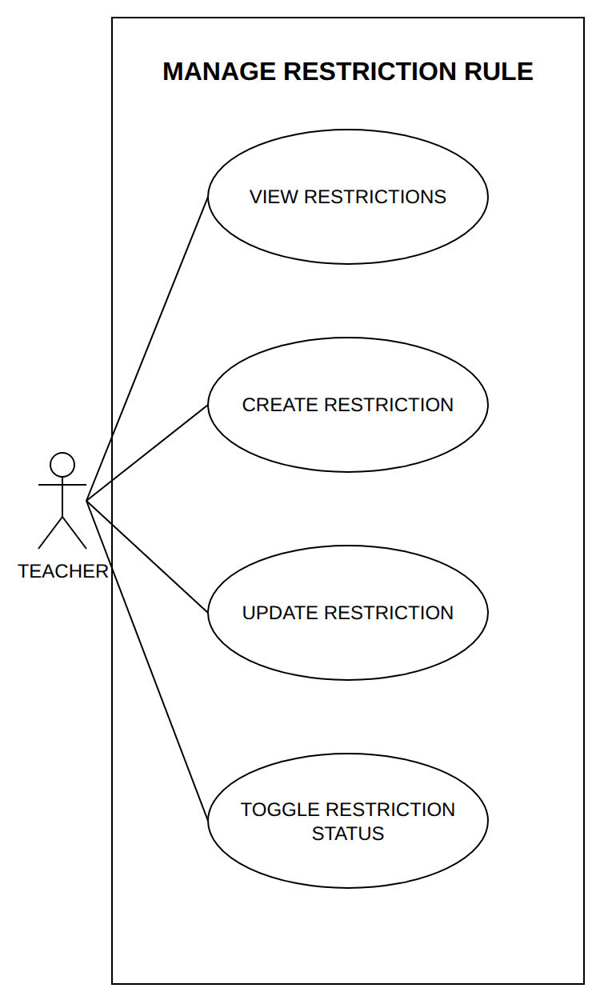

*Figure 3.25: System Use Case for manage restriction rule*

### T-114  ·  VIEW RESTRICTIONS

**Use Case Name:** VIEW RESTRICTIONS  
**Purpose:** List the restrictions the signed-in user is allowed to see.  
**Actors:**

- Teacher (Primary Actor)

**Input Parameters:**

- None beyond the signed-in identity carried on the authentication cookie.

**Output Parameters:**

- The rendered page, or a JSON payload where the caller is the page’s own script.

**Pre-Condition:**

- The caller is signed in as a teacher.

**Post-Condition:**

- The caller has the requested information. Nothing in the database has changed.

**Successful Scenario:**

1. The Teacher opens the page and CAMS confirms the role on the authentication cookie.
2. The server reads the records the caller is entitled to see.
3. The page renders with those records.

**Exception Scenario:**

- **Not signed in or wrong role** — the request is refused and the caller is sent to the access denied page.

**Additional Remarks:**

- Implemented by `TeacherController.Restrictions` (GET).
- Appears in the *MANAGE RESTRICTION RULE* module of the use case diagram.

### T-115  ·  CREATE RESTRICTION

**Use Case Name:** CREATE RESTRICTION  
**Purpose:** Record a new restriction rule in the system.  
**Actors:**

- Teacher (Primary Actor)

**Input Parameters:**

- `rule` : `RestrictionRule`

**Output Parameters:**

- A redirect back to the listing page, carrying a success or failure message for display.

**Pre-Condition:**

- The caller is signed in as a teacher.

**Post-Condition:**

- The change is committed to the database and visible to the next read.
- The caller sees the outcome reported on the page they return to.

**Successful Scenario:**

1. The Teacher opens the page and CAMS confirms the role on the authentication cookie.
2. The Teacher fills the form and submits it.
3. The server validates the antiforgery token that accompanied the form.
4. The server validates the submitted values against the model rules.
5. The change is written to the database through `ApplicationDbContext`.
6. The server redirects back to the listing, where the result is shown.

**Exception Scenario:**

- **Not signed in or wrong role** — the request is refused and the caller is sent to the access denied page.
- **Missing or stale antiforgery token** — the submission is rejected and must be retried from a freshly loaded form.
- **Validation fails** — the form is redisplayed with the offending fields marked and nothing is written.

**Additional Remarks:**

- Implemented by `TeacherController.CreateRestriction` (POST).
- Appears in the *MANAGE RESTRICTION RULE* module of the use case diagram.

### T-116  ·  UPDATE RESTRICTION

**Use Case Name:** UPDATE RESTRICTION  
**Purpose:** Amend the stored details of an existing restriction rule.  
**Actors:**

- Teacher (Primary Actor)

**Input Parameters:**

- `input` : `RestrictionRule`

**Output Parameters:**

- A redirect back to the listing page, carrying a success or failure message for display.

**Pre-Condition:**

- The caller is signed in as a teacher.

**Post-Condition:**

- The change is committed to the database and visible to the next read.
- The caller sees the outcome reported on the page they return to.

**Successful Scenario:**

1. The Teacher opens the page and CAMS confirms the role on the authentication cookie.
2. The Teacher fills the form and submits it.
3. The server validates the antiforgery token that accompanied the form.
4. The server validates the submitted values against the model rules.
5. The change is written to the database through `ApplicationDbContext`.
6. The server redirects back to the listing, where the result is shown.

**Exception Scenario:**

- **Not signed in or wrong role** — the request is refused and the caller is sent to the access denied page.
- **Missing or stale antiforgery token** — the submission is rejected and must be retried from a freshly loaded form.
- **Validation fails** — the form is redisplayed with the offending fields marked and nothing is written.

**Additional Remarks:**

- Implemented by `TeacherController.UpdateRestriction` (POST).
- Appears in the *MANAGE RESTRICTION RULE* module of the use case diagram.

### T-117  ·  TOGGLE RESTRICTION STATUS

**Use Case Name:** TOGGLE RESTRICTION STATUS  
**Purpose:** Switch a restriction rule between active and inactive instead of deleting it, so the client agents stop (or resume) enforcing it while the rule stays on file.  
**Actors:**

- Teacher (Primary Actor)

**Input Parameters:**

- `input` : `RestrictionRule` (`RestrictionRuleId`, `IsActive`, and the rule's other fields)

**Output Parameters:**

- A redirect back to the listing page, carrying a success or failure message for display.

**Pre-Condition:**

- The caller is signed in as a teacher.
- The rule exists and belongs to the teacher.

**Post-Condition:**

- The new status is committed to the database and takes effect on the next read.
- The record stays in the database with its history; only its status changes, so it can be switched back at any time.

**Successful Scenario:**

1. The Teacher opens the Restrictions page and CAMS confirms the role on the authentication cookie.
2. The Teacher opens the rule's edit form, ticks or clears Active and saves.
3. The server validates the antiforgery token that accompanied the form.
4. The server sets the rule's `IsActive` flag, saves it and writes an audit entry.
5. The server redirects back to the Restrictions page, where the new status is shown.

**Exception Scenario:**

- **Not signed in or wrong role** — the request is refused and the caller is sent to the access denied page.
- **Missing or stale antiforgery token** — the submission is rejected and must be retried from a freshly loaded form.
- **The identifier matches no record** — the action reports that the record was not found and makes no change.
- **The rule's type, target or mode is not valid** — nothing is written and the listing is shown again.

**Additional Remarks:**

- Implemented by `TeacherController.UpdateRestriction` (POST).
- Replaces the delete use case: CAMS keeps the record and changes its status, so history is never lost.
- Appears in the *MANAGE RESTRICTION RULE* module of the use case diagram.

## MANAGE BLACKLIST AND WHITELIST  ·  `AdminController`

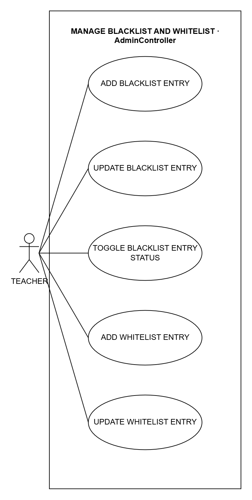

*Figure 3.26: System Use Case for manage blacklist and whitelist*

### T-118  ·  VIEW BLACKLISTS

**Use Case Name:** VIEW BLACKLISTS  
**Purpose:** List the blacklists the signed-in user is allowed to see.  
**Actors:**

- Teacher (Primary Actor)

**Input Parameters:**

- None beyond the signed-in identity carried on the authentication cookie.

**Output Parameters:**

- The rendered page, or a JSON payload where the caller is the page’s own script.

**Pre-Condition:**

- The caller is signed in as an administrator or a teacher. A teacher reaches this action only because it carries `[TeacherSharedAction]`; the teacher account must also be active.

**Post-Condition:**

- The caller has the requested information. Nothing in the database has changed.

**Successful Scenario:**

1. The Teacher opens the page and CAMS confirms the role on the authentication cookie.
2. The server reads the records the caller is entitled to see.
3. The page renders with those records.

**Exception Scenario:**

- **Not signed in or wrong role** — the request is refused and the caller is sent to the access denied page.

**Additional Remarks:**

- Implemented by `AdminController.Blacklists` (GET).
- Appears in the *MANAGE BLACKLIST AND WHITELIST* module of the use case diagram.

### T-119  ·  VIEW WHITELISTS

**Use Case Name:** VIEW WHITELISTS  
**Purpose:** List the whitelists the signed-in user is allowed to see.  
**Actors:**

- Teacher (Primary Actor)

**Input Parameters:**

- None beyond the signed-in identity carried on the authentication cookie.

**Output Parameters:**

- The rendered page, or a JSON payload where the caller is the page’s own script.

**Pre-Condition:**

- The caller is signed in as an administrator or a teacher. A teacher reaches this action only because it carries `[TeacherSharedAction]`; the teacher account must also be active.

**Post-Condition:**

- The caller has the requested information. Nothing in the database has changed.

**Successful Scenario:**

1. The Teacher opens the page and CAMS confirms the role on the authentication cookie.
2. The server reads the records the caller is entitled to see.
3. The page renders with those records.

**Exception Scenario:**

- **Not signed in or wrong role** — the request is refused and the caller is sent to the access denied page.

**Additional Remarks:**

- Implemented by `AdminController.Whitelists` (GET).
- Appears in the *MANAGE BLACKLIST AND WHITELIST* module of the use case diagram.

### T-120  ·  CREATE BLACKLIST

**Use Case Name:** CREATE BLACKLIST  
**Purpose:** Record a new blacklist entry in the system.  
**Actors:**

- Teacher (Primary Actor)

**Input Parameters:**

- `RestrictionRuleId` — bound from the submitted form
- `RuleType` — bound from the submitted form
- `Target` — bound from the submitted form
- `Description` — bound from the submitted form
- `IsGlobal` — bound from the submitted form
- `IsActive` — bound from the submitted form
- `item` : `BlacklistItem`

**Output Parameters:**

- A redirect back to the listing page, carrying a success or failure message for display.

**Pre-Condition:**

- The caller is signed in as an administrator or a teacher. A teacher reaches this action only because it carries `[TeacherSharedAction]`; the teacher account must also be active.

**Post-Condition:**

- The change is committed to the database and visible to the next read.
- The caller sees the outcome reported on the page they return to.

**Successful Scenario:**

1. The Teacher opens the page and CAMS confirms the role on the authentication cookie.
2. The Teacher fills the form and submits it.
3. The server validates the antiforgery token that accompanied the form.
4. The server validates the submitted values against the model rules.
5. The change is written to the database through `ApplicationDbContext`.
6. The server redirects back to the listing, where the result is shown.

**Exception Scenario:**

- **Not signed in or wrong role** — the request is refused and the caller is sent to the access denied page.
- **Missing or stale antiforgery token** — the submission is rejected and must be retried from a freshly loaded form.
- **Validation fails** — the form is redisplayed with the offending fields marked and nothing is written.

**Additional Remarks:**

- Implemented by `AdminController.CreateBlacklist` (POST).
- Appears in the *MANAGE BLACKLIST AND WHITELIST* module of the use case diagram.

### T-121  ·  UPDATE BLACKLIST

**Use Case Name:** UPDATE BLACKLIST  
**Purpose:** Amend the stored details of an existing blacklist entry.  
**Actors:**

- Teacher (Primary Actor)

**Input Parameters:**

- `input` : `BlacklistItem`

**Output Parameters:**

- A redirect back to the listing page, carrying a success or failure message for display.

**Pre-Condition:**

- The caller is signed in as an administrator or a teacher. A teacher reaches this action only because it carries `[TeacherSharedAction]`; the teacher account must also be active.

**Post-Condition:**

- The change is committed to the database and visible to the next read.
- The caller sees the outcome reported on the page they return to.

**Successful Scenario:**

1. The Teacher opens the page and CAMS confirms the role on the authentication cookie.
2. The Teacher fills the form and submits it.
3. The server validates the antiforgery token that accompanied the form.
4. The server validates the submitted values against the model rules.
5. The change is written to the database through `ApplicationDbContext`.
6. The server redirects back to the listing, where the result is shown.

**Exception Scenario:**

- **Not signed in or wrong role** — the request is refused and the caller is sent to the access denied page.
- **Missing or stale antiforgery token** — the submission is rejected and must be retried from a freshly loaded form.
- **Validation fails** — the form is redisplayed with the offending fields marked and nothing is written.

**Additional Remarks:**

- Implemented by `AdminController.UpdateBlacklist` (POST).
- Appears in the *MANAGE BLACKLIST AND WHITELIST* module of the use case diagram.

### T-122  ·  TOGGLE BLACKLIST STATUS

**Use Case Name:** TOGGLE BLACKLIST STATUS  
**Purpose:** Switch a blacklist entry between active and inactive instead of deleting it, so the application or website is unblocked (or blocked again) while the entry stays on file.  
**Actors:**

- Teacher (Primary Actor)

**Input Parameters:**

- `input` : `BlacklistItem` (`BlacklistItemId`, `TargetType`, `Value`, `Reason`, `IsActive`)

**Output Parameters:**

- A redirect back to the listing page, carrying a success or failure message for display.

**Pre-Condition:**

- The caller is signed in as a teacher. The shared administration page admits a teacher because the action carries `[TeacherSharedAction]`.
- The record named by the identifier exists.

**Post-Condition:**

- The new status is committed to the database and takes effect on the next read.
- The record stays in the database with its history; only its status changes, so it can be switched back at any time.

**Successful Scenario:**

1. The Teacher opens the Blacklists page and CAMS confirms the role on the authentication cookie.
2. The Teacher opens the entry's edit form, ticks or clears Active and saves.
3. The server sets the entry's `IsActive` flag, saves it and writes an audit entry.
4. The server redirects back to the Blacklists page, where the new status is shown.

**Exception Scenario:**

- **Not signed in or wrong role** — the request is refused and the caller is sent to the access denied page.
- **The identifier matches no record** — the action reports that the record was not found and makes no change.

**Additional Remarks:**

- Implemented by `AdminController.UpdateBlacklist` (POST).
- Replaces the delete use case: CAMS keeps the record and changes its status, so history is never lost.
- Appears in the *MANAGE BLACKLIST AND WHITELIST* module of the use case diagram.

### T-123  ·  CREATE WHITELIST

**Use Case Name:** CREATE WHITELIST  
**Purpose:** Record a new whitelist entry in the system.  
**Actors:**

- Teacher (Primary Actor)

**Input Parameters:**

- `rule` : `RestrictionRule`

**Output Parameters:**

- A redirect back to the listing page, carrying a success or failure message for display.

**Pre-Condition:**

- The caller is signed in as an administrator or a teacher. A teacher reaches this action only because it carries `[TeacherSharedAction]`; the teacher account must also be active.

**Post-Condition:**

- The change is committed to the database and visible to the next read.
- The caller sees the outcome reported on the page they return to.

**Successful Scenario:**

1. The Teacher opens the page and CAMS confirms the role on the authentication cookie.
2. The Teacher fills the form and submits it.
3. The server validates the antiforgery token that accompanied the form.
4. The server validates the submitted values against the model rules.
5. The change is written to the database through `ApplicationDbContext`.
6. The server redirects back to the listing, where the result is shown.

**Exception Scenario:**

- **Not signed in or wrong role** — the request is refused and the caller is sent to the access denied page.
- **Missing or stale antiforgery token** — the submission is rejected and must be retried from a freshly loaded form.
- **Validation fails** — the form is redisplayed with the offending fields marked and nothing is written.

**Additional Remarks:**

- Implemented by `AdminController.CreateWhitelist` (POST).
- Appears in the *MANAGE BLACKLIST AND WHITELIST* module of the use case diagram.

### T-124  ·  UPDATE WHITELIST

**Use Case Name:** UPDATE WHITELIST  
**Purpose:** Amend the stored details of an existing whitelist entry.  
**Actors:**

- Teacher (Primary Actor)

**Input Parameters:**

- `RuleType` — bound from the submitted form
- `Target` — bound from the submitted form
- `Description` — bound from the submitted form
- `IsGlobal` — bound from the submitted form
- `IsActive` — bound from the submitted form
- `rule` : `RestrictionRule`

**Output Parameters:**

- A redirect back to the listing page, carrying a success or failure message for display.

**Pre-Condition:**

- The caller is signed in as an administrator or a teacher. A teacher reaches this action only because it carries `[TeacherSharedAction]`; the teacher account must also be active.

**Post-Condition:**

- The change is committed to the database and visible to the next read.
- The caller sees the outcome reported on the page they return to.

**Successful Scenario:**

1. The Teacher opens the page and CAMS confirms the role on the authentication cookie.
2. The Teacher fills the form and submits it.
3. The server validates the antiforgery token that accompanied the form.
4. The server validates the submitted values against the model rules.
5. The change is written to the database through `ApplicationDbContext`.
6. The server redirects back to the listing, where the result is shown.

**Exception Scenario:**

- **Not signed in or wrong role** — the request is refused and the caller is sent to the access denied page.
- **Missing or stale antiforgery token** — the submission is rejected and must be retried from a freshly loaded form.
- **Validation fails** — the form is redisplayed with the offending fields marked and nothing is written.

**Additional Remarks:**

- Implemented by `AdminController.UpdateWhitelist` (POST).
- Appears in the *MANAGE BLACKLIST AND WHITELIST* module of the use case diagram.

### T-125  ·  TOGGLE WHITELIST STATUS

**Use Case Name:** TOGGLE WHITELIST STATUS  
**Purpose:** Switch a whitelist rule between active and inactive instead of deleting it, so the website leaves (or rejoins) the allowed list while the rule stays on file.  
**Actors:**

- Teacher (Primary Actor)

**Input Parameters:**

- `rule` : `RestrictionRule` (`RestrictionRuleId`, `RuleType`, `Target`, `Description`, `IsGlobal`, `IsActive`)

**Output Parameters:**

- A redirect back to the listing page, carrying a success or failure message for display.

**Pre-Condition:**

- The caller is signed in as a teacher. The shared administration page admits a teacher because the action carries `[TeacherSharedAction]`.
- The record named by the identifier exists.

**Post-Condition:**

- The new status is committed to the database and takes effect on the next read.
- The record stays in the database with its history; only its status changes, so it can be switched back at any time.

**Successful Scenario:**

1. The Teacher opens the Whitelists page and CAMS confirms the role on the authentication cookie.
2. The Teacher opens the rule's edit form, switches Rule is active on or off and saves.
3. The server sets the rule's `IsActive` flag, saves it and writes an audit entry.
4. The server redirects back to the Whitelists page, where the new status is shown.

**Exception Scenario:**

- **Not signed in or wrong role** — the request is refused and the caller is sent to the access denied page.
- **The identifier matches no record** — the action reports that the record was not found and makes no change.

**Additional Remarks:**

- Implemented by `AdminController.UpdateWhitelist` (POST).
- Replaces the delete use case: CAMS keeps the record and changes its status, so history is never lost.
- Appears in the *MANAGE BLACKLIST AND WHITELIST* module of the use case diagram.

## MANAGE CATEGORY  ·  `AdminController`

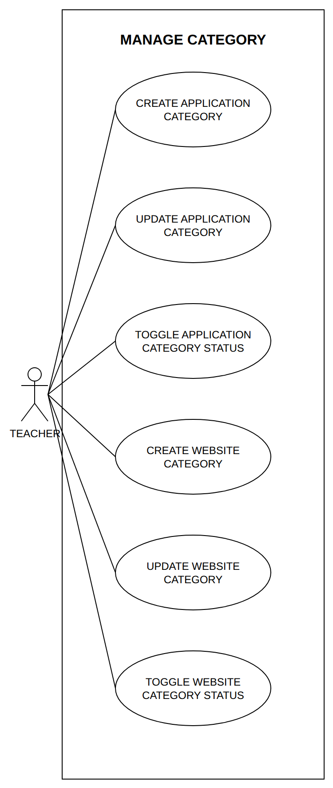

*Figure 3.27: System Use Case for manage category*

### T-126  ·  CREATE APPLICATION CATEGORY

**Use Case Name:** CREATE APPLICATION CATEGORY  
**Purpose:** Record a new application category in the system.  
**Actors:**

- Teacher (Primary Actor)

**Input Parameters:**

- `category` : `ApplicationCategory`

**Output Parameters:**

- A redirect back to the listing page, carrying a success or failure message for display.

**Pre-Condition:**

- The caller is signed in as an administrator or a teacher. A teacher reaches this action only because it carries `[TeacherSharedAction]`; the teacher account must also be active.

**Post-Condition:**

- The change is committed to the database and visible to the next read.
- The caller sees the outcome reported on the page they return to.

**Successful Scenario:**

1. The Teacher opens the page and CAMS confirms the role on the authentication cookie.
2. The Teacher fills the form and submits it.
3. The server validates the antiforgery token that accompanied the form.
4. The server validates the submitted values against the model rules.
5. The change is written to the database through `ApplicationDbContext`.
6. The server redirects back to the listing, where the result is shown.

**Exception Scenario:**

- **Not signed in or wrong role** — the request is refused and the caller is sent to the access denied page.
- **Missing or stale antiforgery token** — the submission is rejected and must be retried from a freshly loaded form.
- **Validation fails** — the form is redisplayed with the offending fields marked and nothing is written.

**Additional Remarks:**

- Implemented by `AdminController.CreateApplicationCategory` (POST).
- Appears in the *MANAGE CATEGORY* module of the use case diagram.

### T-127  ·  UPDATE APPLICATION CATEGORY

**Use Case Name:** UPDATE APPLICATION CATEGORY  
**Purpose:** Amend the stored details of an existing application category.  
**Actors:**

- Teacher (Primary Actor)

**Input Parameters:**

- `input` : `ApplicationCategory`

**Output Parameters:**

- A redirect back to the listing page, carrying a success or failure message for display.

**Pre-Condition:**

- The caller is signed in as an administrator or a teacher. A teacher reaches this action only because it carries `[TeacherSharedAction]`; the teacher account must also be active.

**Post-Condition:**

- The change is committed to the database and visible to the next read.
- The caller sees the outcome reported on the page they return to.

**Successful Scenario:**

1. The Teacher opens the page and CAMS confirms the role on the authentication cookie.
2. The Teacher fills the form and submits it.
3. The server validates the antiforgery token that accompanied the form.
4. The server validates the submitted values against the model rules.
5. The change is written to the database through `ApplicationDbContext`.
6. The server redirects back to the listing, where the result is shown.

**Exception Scenario:**

- **Not signed in or wrong role** — the request is refused and the caller is sent to the access denied page.
- **Missing or stale antiforgery token** — the submission is rejected and must be retried from a freshly loaded form.
- **Validation fails** — the form is redisplayed with the offending fields marked and nothing is written.

**Additional Remarks:**

- Implemented by `AdminController.UpdateApplicationCategory` (POST).
- Appears in the *MANAGE CATEGORY* module of the use case diagram.

### T-128  ·  TOGGLE APPLICATION CATEGORY STATUS

**Use Case Name:** TOGGLE APPLICATION CATEGORY STATUS  
**Purpose:** Switch an application category between active and inactive instead of deleting it, so its pattern stops (or resumes) matching while the category stays on file.  
**Actors:**

- Teacher (Primary Actor)

**Input Parameters:**

- `input` : `ApplicationCategory` (`ApplicationCategoryId`, `IsActive`, and the category's other fields)

**Output Parameters:**

- A redirect back to the listing page, carrying a success or failure message for display.

**Pre-Condition:**

- The caller is signed in as a teacher. The shared administration page admits a teacher because the action carries `[TeacherSharedAction]`.
- The record named by the identifier exists.

**Post-Condition:**

- The new status is committed to the database and takes effect on the next read.
- The record stays in the database with its history; only its status changes, so it can be switched back at any time.

**Successful Scenario:**

1. The Teacher opens the Restrictions page and CAMS confirms the role on the authentication cookie.
2. The Teacher opens the application category's edit form, ticks or clears Active and saves.
3. The server sets the category's `IsActive` flag, saves it and writes an audit entry.
4. The server redirects back to the Restrictions page, where the new status is shown.

**Exception Scenario:**

- **Not signed in or wrong role** — the request is refused and the caller is sent to the access denied page.
- **The identifier matches no record** — the action reports that the record was not found and makes no change.

**Additional Remarks:**

- Implemented by `AdminController.UpdateApplicationCategory` (POST).
- Replaces the delete use case: CAMS keeps the record and changes its status, so history is never lost.
- Appears in the *MANAGE CATEGORY* module of the use case diagram.

### T-129  ·  CREATE WEBSITE CATEGORY

**Use Case Name:** CREATE WEBSITE CATEGORY  
**Purpose:** Record a new website category in the system.  
**Actors:**

- Teacher (Primary Actor)

**Input Parameters:**

- `category` : `WebsiteCategory`

**Output Parameters:**

- A redirect back to the listing page, carrying a success or failure message for display.

**Pre-Condition:**

- The caller is signed in as an administrator or a teacher. A teacher reaches this action only because it carries `[TeacherSharedAction]`; the teacher account must also be active.

**Post-Condition:**

- The change is committed to the database and visible to the next read.
- The caller sees the outcome reported on the page they return to.

**Successful Scenario:**

1. The Teacher opens the page and CAMS confirms the role on the authentication cookie.
2. The Teacher fills the form and submits it.
3. The server validates the antiforgery token that accompanied the form.
4. The server validates the submitted values against the model rules.
5. The change is written to the database through `ApplicationDbContext`.
6. The server redirects back to the listing, where the result is shown.

**Exception Scenario:**

- **Not signed in or wrong role** — the request is refused and the caller is sent to the access denied page.
- **Missing or stale antiforgery token** — the submission is rejected and must be retried from a freshly loaded form.
- **Validation fails** — the form is redisplayed with the offending fields marked and nothing is written.

**Additional Remarks:**

- Implemented by `AdminController.CreateWebsiteCategory` (POST).
- Appears in the *MANAGE CATEGORY* module of the use case diagram.

### T-130  ·  UPDATE WEBSITE CATEGORY

**Use Case Name:** UPDATE WEBSITE CATEGORY  
**Purpose:** Amend the stored details of an existing website category.  
**Actors:**

- Teacher (Primary Actor)

**Input Parameters:**

- `input` : `WebsiteCategory`

**Output Parameters:**

- A redirect back to the listing page, carrying a success or failure message for display.

**Pre-Condition:**

- The caller is signed in as an administrator or a teacher. A teacher reaches this action only because it carries `[TeacherSharedAction]`; the teacher account must also be active.

**Post-Condition:**

- The change is committed to the database and visible to the next read.
- The caller sees the outcome reported on the page they return to.

**Successful Scenario:**

1. The Teacher opens the page and CAMS confirms the role on the authentication cookie.
2. The Teacher fills the form and submits it.
3. The server validates the antiforgery token that accompanied the form.
4. The server validates the submitted values against the model rules.
5. The change is written to the database through `ApplicationDbContext`.
6. The server redirects back to the listing, where the result is shown.

**Exception Scenario:**

- **Not signed in or wrong role** — the request is refused and the caller is sent to the access denied page.
- **Missing or stale antiforgery token** — the submission is rejected and must be retried from a freshly loaded form.
- **Validation fails** — the form is redisplayed with the offending fields marked and nothing is written.

**Additional Remarks:**

- Implemented by `AdminController.UpdateWebsiteCategory` (POST).
- Appears in the *MANAGE CATEGORY* module of the use case diagram.

### T-131  ·  TOGGLE WEBSITE CATEGORY STATUS

**Use Case Name:** TOGGLE WEBSITE CATEGORY STATUS  
**Purpose:** Switch a website category between active and inactive instead of deleting it, so its domain pattern stops (or resumes) matching while the category stays on file.  
**Actors:**

- Teacher (Primary Actor)

**Input Parameters:**

- `input` : `WebsiteCategory` (`WebsiteCategoryId`, `IsActive`, and the category's other fields)

**Output Parameters:**

- A redirect back to the listing page, carrying a success or failure message for display.

**Pre-Condition:**

- The caller is signed in as a teacher. The shared administration page admits a teacher because the action carries `[TeacherSharedAction]`.
- The record named by the identifier exists.

**Post-Condition:**

- The new status is committed to the database and takes effect on the next read.
- The record stays in the database with its history; only its status changes, so it can be switched back at any time.

**Successful Scenario:**

1. The Teacher opens the Restrictions page and CAMS confirms the role on the authentication cookie.
2. The Teacher opens the website category's edit form, ticks or clears Active and saves.
3. The server sets the category's `IsActive` flag, saves it and writes an audit entry.
4. The server redirects back to the Restrictions page, where the new status is shown.

**Exception Scenario:**

- **Not signed in or wrong role** — the request is refused and the caller is sent to the access denied page.
- **The identifier matches no record** — the action reports that the record was not found and makes no change.

**Additional Remarks:**

- Implemented by `AdminController.UpdateWebsiteCategory` (POST).
- Replaces the delete use case: CAMS keeps the record and changes its status, so history is never lost.
- Appears in the *MANAGE CATEGORY* module of the use case diagram.

## MANAGE SESSION RULE  ·  `AdminController`

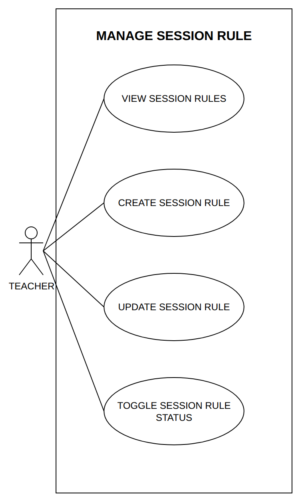

*Figure 3.28: System Use Case for manage session rule*

### T-132  ·  VIEW SESSION RULES

**Use Case Name:** VIEW SESSION RULES  
**Purpose:** List the session rules the signed-in user is allowed to see.  
**Actors:**

- Teacher (Primary Actor)

**Input Parameters:**

- None beyond the signed-in identity carried on the authentication cookie.

**Output Parameters:**

- The rendered page, or a JSON payload where the caller is the page’s own script.

**Pre-Condition:**

- The caller is signed in as an administrator or a teacher. A teacher reaches this action only because it carries `[TeacherSharedAction]`; the teacher account must also be active.

**Post-Condition:**

- The caller has the requested information. Nothing in the database has changed.

**Successful Scenario:**

1. The Teacher opens the page and CAMS confirms the role on the authentication cookie.
2. The server reads the records the caller is entitled to see.
3. The page renders with those records.

**Exception Scenario:**

- **Not signed in or wrong role** — the request is refused and the caller is sent to the access denied page.

**Additional Remarks:**

- Implemented by `AdminController.SessionRules` (GET).
- Appears in the *MANAGE SESSION RULE* module of the use case diagram.

### T-133  ·  CREATE SESSION RULE

**Use Case Name:** CREATE SESSION RULE  
**Purpose:** Record a new session rule in the system.  
**Actors:**

- Teacher (Primary Actor)

**Input Parameters:**

- `rule` : `SessionRule`

**Output Parameters:**

- A redirect back to the listing page, carrying a success or failure message for display.

**Pre-Condition:**

- The caller is signed in as an administrator or a teacher. A teacher reaches this action only because it carries `[TeacherSharedAction]`; the teacher account must also be active.

**Post-Condition:**

- The change is committed to the database and visible to the next read.
- The caller sees the outcome reported on the page they return to.

**Successful Scenario:**

1. The Teacher opens the page and CAMS confirms the role on the authentication cookie.
2. The Teacher fills the form and submits it.
3. The server validates the antiforgery token that accompanied the form.
4. The server validates the submitted values against the model rules.
5. The change is written to the database through `ApplicationDbContext`.
6. The server redirects back to the listing, where the result is shown.

**Exception Scenario:**

- **Not signed in or wrong role** — the request is refused and the caller is sent to the access denied page.
- **Missing or stale antiforgery token** — the submission is rejected and must be retried from a freshly loaded form.
- **Validation fails** — the form is redisplayed with the offending fields marked and nothing is written.

**Additional Remarks:**

- Implemented by `AdminController.CreateSessionRule` (POST).
- Appears in the *MANAGE SESSION RULE* module of the use case diagram.

### T-134  ·  UPDATE SESSION RULE

**Use Case Name:** UPDATE SESSION RULE  
**Purpose:** Amend the stored details of an existing session rule.  
**Actors:**

- Teacher (Primary Actor)

**Input Parameters:**

- `input` : `SessionRule`

**Output Parameters:**

- A redirect back to the listing page, carrying a success or failure message for display.

**Pre-Condition:**

- The caller is signed in as an administrator or a teacher. A teacher reaches this action only because it carries `[TeacherSharedAction]`; the teacher account must also be active.

**Post-Condition:**

- The change is committed to the database and visible to the next read.
- The caller sees the outcome reported on the page they return to.

**Successful Scenario:**

1. The Teacher opens the page and CAMS confirms the role on the authentication cookie.
2. The Teacher fills the form and submits it.
3. The server validates the antiforgery token that accompanied the form.
4. The server validates the submitted values against the model rules.
5. The change is written to the database through `ApplicationDbContext`.
6. The server redirects back to the listing, where the result is shown.

**Exception Scenario:**

- **Not signed in or wrong role** — the request is refused and the caller is sent to the access denied page.
- **Missing or stale antiforgery token** — the submission is rejected and must be retried from a freshly loaded form.
- **Validation fails** — the form is redisplayed with the offending fields marked and nothing is written.

**Additional Remarks:**

- Implemented by `AdminController.UpdateSessionRule` (POST).
- Appears in the *MANAGE SESSION RULE* module of the use case diagram.

### T-135  ·  TOGGLE SESSION RULE STATUS

**Use Case Name:** TOGGLE SESSION RULE STATUS  
**Purpose:** Switch a session rule between active and inactive instead of deleting it. An inactive rule loses any default flag and cannot govern new sessions, and sessions already recorded against it still resolve to a named rule.  
**Actors:**

- Teacher (Primary Actor)

**Input Parameters:**

- `input` : `SessionRule` (`SessionRuleId`, `Name`, `MaxDurationMinutes`, `AllowPause`, `AllowRemoteControl`, `IsDefault`, `IsActive`)

**Output Parameters:**

- A redirect back to the listing page, carrying a success or failure message for display.

**Pre-Condition:**

- The caller is signed in as a teacher. The shared administration page admits a teacher because the action carries `[TeacherSharedAction]`.
- The record named by the identifier exists.

**Post-Condition:**

- The new status is committed to the database and takes effect on the next read.
- The record stays in the database with its history; only its status changes, so it can be switched back at any time.

**Successful Scenario:**

1. The Teacher opens the Session Rules page and CAMS confirms the role on the authentication cookie.
2. The Teacher opens the rule's edit form, ticks or clears Active and saves.
3. The server sets the rule's `IsActive` flag, clears the default flag when the rule is made inactive, closes any open remote control session that relied on it, and writes an audit entry.
4. The server redirects back to the Session Rules page, where the new status is shown.

**Exception Scenario:**

- **Not signed in or wrong role** — the request is refused and the caller is sent to the access denied page.
- **The identifier matches no record** — the action reports that the record was not found and makes no change.

**Additional Remarks:**

- Implemented by `AdminController.UpdateSessionRule` (POST).
- Replaces the delete use case: CAMS keeps the record and changes its status, so history is never lost.
- Appears in the *MANAGE SESSION RULE* module of the use case diagram.

## CONTROL LABORATORY SESSION  ·  `TeacherController`

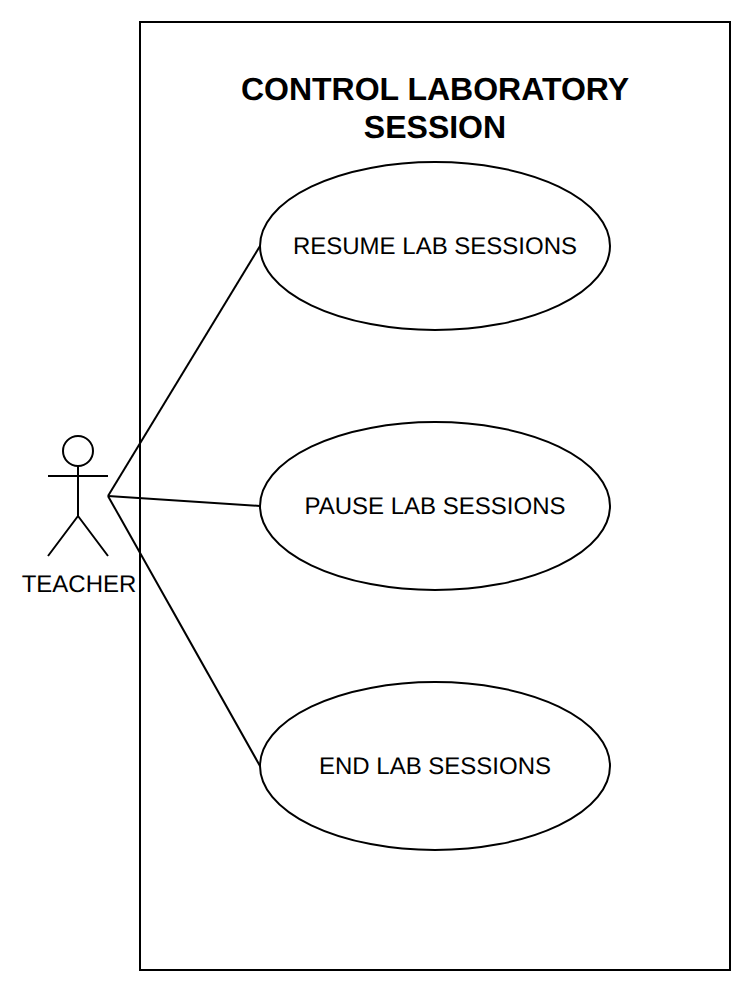

*Figure 3.29: System Use Case for control laboratory session*

### T-136  ·  RESUME LAB SESSIONS

**Use Case Name:** RESUME LAB SESSIONS  
**Purpose:** Start a laboratory-wide session so every connected workstation begins at the same moment.  
**Actors:**

- Teacher (Primary Actor)

**Input Parameters:**

- None beyond the signed-in identity carried on the authentication cookie.

**Output Parameters:**

- A redirect back to the listing page, carrying a success or failure message for display.

**Pre-Condition:**

- The caller is signed in as a teacher.

**Post-Condition:**

- The change is committed to the database and visible to the next read.
- The caller sees the outcome reported on the page they return to.

**Successful Scenario:**

1. The Teacher opens the page and CAMS confirms the role on the authentication cookie.
2. The Teacher fills the form and submits it.
3. The server validates the antiforgery token that accompanied the form.
4. The server validates the submitted values against the model rules.
5. The change is written to the database through `ApplicationDbContext`.
6. The server redirects back to the listing, where the result is shown.

**Exception Scenario:**

- **Not signed in or wrong role** — the request is refused and the caller is sent to the access denied page.
- **Missing or stale antiforgery token** — the submission is rejected and must be retried from a freshly loaded form.
- **Validation fails** — the form is redisplayed with the offending fields marked and nothing is written.

**Additional Remarks:**

- Implemented by `TeacherController.GlobalStartSession` (POST).
- Appears in the *CONTROL LABORATORY SESSION* module of the use case diagram.

### T-137  ·  PAUSE LAB SESSIONS

**Use Case Name:** PAUSE LAB SESSIONS  
**Purpose:** Pause the laboratory-wide session for the whole room.  
**Actors:**

- Teacher (Primary Actor)

**Input Parameters:**

- None beyond the signed-in identity carried on the authentication cookie.

**Output Parameters:**

- A redirect back to the listing page, carrying a success or failure message for display.

**Pre-Condition:**

- The caller is signed in as a teacher.

**Post-Condition:**

- The change is committed to the database and visible to the next read.
- The caller sees the outcome reported on the page they return to.

**Successful Scenario:**

1. The Teacher opens the page and CAMS confirms the role on the authentication cookie.
2. The Teacher fills the form and submits it.
3. The server validates the antiforgery token that accompanied the form.
4. The server validates the submitted values against the model rules.
5. The change is written to the database through `ApplicationDbContext`.
6. The server redirects back to the listing, where the result is shown.

**Exception Scenario:**

- **Not signed in or wrong role** — the request is refused and the caller is sent to the access denied page.
- **Missing or stale antiforgery token** — the submission is rejected and must be retried from a freshly loaded form.
- **Validation fails** — the form is redisplayed with the offending fields marked and nothing is written.

**Additional Remarks:**

- Implemented by `TeacherController.GlobalPauseSession` (POST).
- Appears in the *CONTROL LABORATORY SESSION* module of the use case diagram.

### T-138  ·  END LAB SESSIONS

**Use Case Name:** END LAB SESSIONS  
**Purpose:** End the laboratory-wide session for the whole room.  
**Actors:**

- Teacher (Primary Actor)

**Input Parameters:**

- None beyond the signed-in identity carried on the authentication cookie.

**Output Parameters:**

- A redirect back to the listing page, carrying a success or failure message for display.

**Pre-Condition:**

- The caller is signed in as a teacher.

**Post-Condition:**

- The change is committed to the database and visible to the next read.
- The caller sees the outcome reported on the page they return to.

**Successful Scenario:**

1. The Teacher opens the page and CAMS confirms the role on the authentication cookie.
2. The Teacher fills the form and submits it.
3. The server validates the antiforgery token that accompanied the form.
4. The server validates the submitted values against the model rules.
5. The change is written to the database through `ApplicationDbContext`.
6. The server redirects back to the listing, where the result is shown.

**Exception Scenario:**

- **Not signed in or wrong role** — the request is refused and the caller is sent to the access denied page.
- **Missing or stale antiforgery token** — the submission is rejected and must be retried from a freshly loaded form.
- **Validation fails** — the form is redisplayed with the offending fields marked and nothing is written.

**Additional Remarks:**

- Implemented by `TeacherController.GlobalEndSession` (POST).
- Appears in the *CONTROL LABORATORY SESSION* module of the use case diagram.

## CONTROL STUDENT SESSION  ·  `TeacherController`

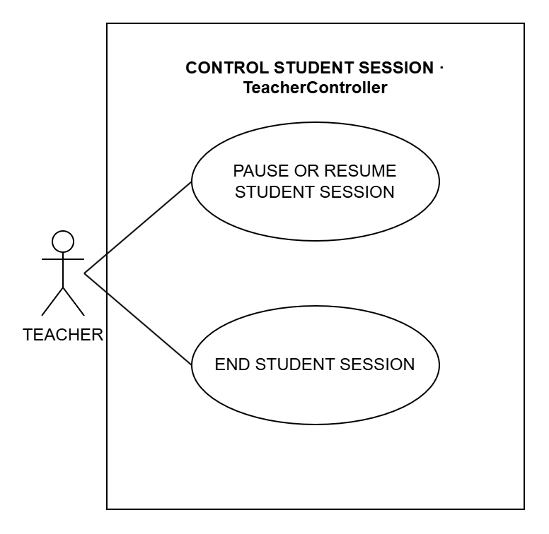

*Figure 3.30: System Use Case for control student session*

### T-139  ·  VIEW SESSIONS

**Use Case Name:** VIEW SESSIONS  
**Purpose:** List the lab sessions the teacher may act on.  
**Actors:**

- Teacher (Primary Actor)

**Input Parameters:**

- None beyond the signed-in identity carried on the authentication cookie.

**Output Parameters:**

- The rendered page, or a JSON payload where the caller is the page’s own script.

**Pre-Condition:**

- The caller is signed in as a teacher.

**Post-Condition:**

- The caller has the requested information. Nothing in the database has changed.

**Successful Scenario:**

1. The Teacher opens the page and CAMS confirms the role on the authentication cookie.
2. The server reads the records the caller is entitled to see.
3. The page renders with those records.

**Exception Scenario:**

- **Not signed in or wrong role** — the request is refused and the caller is sent to the access denied page.

**Additional Remarks:**

- Implemented by `TeacherController.Sessions` (GET).
- Appears in the *CONTROL STUDENT SESSION* module of the use case diagram.

### T-140  ·  START SESSION

**Use Case Name:** START SESSION  
**Purpose:** Open a lab session for one student at one workstation under a chosen session rule.  
**Actors:**

- Teacher (Primary Actor)

**Input Parameters:**

- `studentId` : `int`
- `computerId` : `int?`
- `sessionRuleId` : `int?`

**Output Parameters:**

- A redirect back to the listing page, carrying a success or failure message for display.

**Pre-Condition:**

- The caller is signed in as a teacher.
- The record named by the identifier exists.

**Post-Condition:**

- The change is committed to the database and visible to the next read.
- The caller sees the outcome reported on the page they return to.

**Successful Scenario:**

1. The Teacher opens the page and CAMS confirms the role on the authentication cookie.
2. The Teacher fills the form and submits it.
3. The server validates the antiforgery token that accompanied the form.
4. The server validates the submitted values against the model rules.
5. The change is written to the database through `ApplicationDbContext`.
6. The server redirects back to the listing, where the result is shown.

**Exception Scenario:**

- **Not signed in or wrong role** — the request is refused and the caller is sent to the access denied page.
- **Missing or stale antiforgery token** — the submission is rejected and must be retried from a freshly loaded form.
- **Validation fails** — the form is redisplayed with the offending fields marked and nothing is written.
- **The identifier matches no record** — the action reports that the record was not found and makes no change.

**Additional Remarks:**

- Implemented by `TeacherController.StartSession` (POST).
- Appears in the *CONTROL STUDENT SESSION* module of the use case diagram.

### T-141  ·  TOGGLE SESSION PAUSE

**Use Case Name:** TOGGLE SESSION PAUSE  
**Purpose:** Pause a running session, or resume a paused one, accumulating the paused time so it is not charged against the limit.  
**Actors:**

- Teacher (Primary Actor)

**Input Parameters:**

- `id` : `int`

**Output Parameters:**

- A redirect back to the listing page, carrying a success or failure message for display.

**Pre-Condition:**

- The caller is signed in as a teacher.
- The record named by the identifier exists.

**Post-Condition:**

- The change is committed to the database and visible to the next read.
- The caller sees the outcome reported on the page they return to.

**Successful Scenario:**

1. The Teacher opens the page and CAMS confirms the role on the authentication cookie.
2. The Teacher fills the form and submits it.
3. The server validates the antiforgery token that accompanied the form.
4. The server validates the submitted values against the model rules.
5. The change is written to the database through `ApplicationDbContext`.
6. The server redirects back to the listing, where the result is shown.

**Exception Scenario:**

- **Not signed in or wrong role** — the request is refused and the caller is sent to the access denied page.
- **Missing or stale antiforgery token** — the submission is rejected and must be retried from a freshly loaded form.
- **Validation fails** — the form is redisplayed with the offending fields marked and nothing is written.
- **The identifier matches no record** — the action reports that the record was not found and makes no change.

**Additional Remarks:**

- Implemented by `TeacherController.TogglePause` (POST).
- Appears in the *CONTROL STUDENT SESSION* module of the use case diagram.

### T-142  ·  END SESSION

**Use Case Name:** END SESSION  
**Purpose:** Close one student lab session and record its end time.  
**Actors:**

- Teacher (Primary Actor)

**Input Parameters:**

- `id` : `int`

**Output Parameters:**

- A redirect back to the listing page, carrying a success or failure message for display.

**Pre-Condition:**

- The caller is signed in as a teacher.
- The record named by the identifier exists.

**Post-Condition:**

- The change is committed to the database and visible to the next read.
- The caller sees the outcome reported on the page they return to.

**Successful Scenario:**

1. The Teacher opens the page and CAMS confirms the role on the authentication cookie.
2. The Teacher fills the form and submits it.
3. The server validates the antiforgery token that accompanied the form.
4. The server validates the submitted values against the model rules.
5. The change is written to the database through `ApplicationDbContext`.
6. The server redirects back to the listing, where the result is shown.

**Exception Scenario:**

- **Not signed in or wrong role** — the request is refused and the caller is sent to the access denied page.
- **Missing or stale antiforgery token** — the submission is rejected and must be retried from a freshly loaded form.
- **Validation fails** — the form is redisplayed with the offending fields marked and nothing is written.
- **The identifier matches no record** — the action reports that the record was not found and makes no change.

**Additional Remarks:**

- Implemented by `TeacherController.EndSession` (POST).
- Appears in the *CONTROL STUDENT SESSION* module of the use case diagram.

## MONITOR STUDENT SCREEN  ·  `TeacherController`

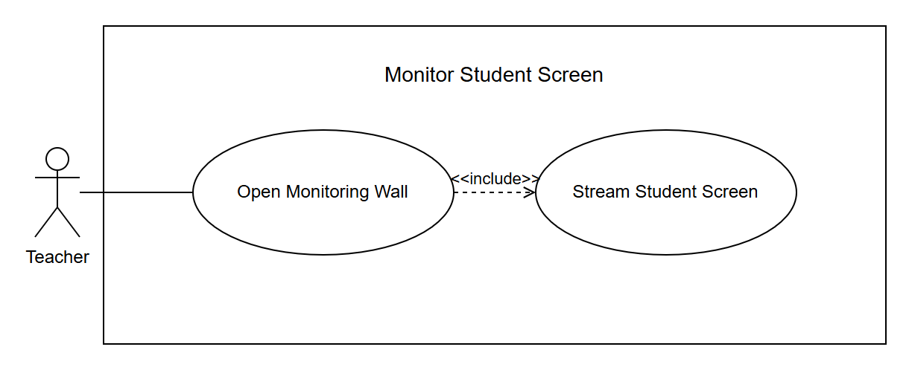

*Figure 3.31: System Use Case for monitor student screen*

### T-143  ·  OPEN MONITORING WALL

**Use Case Name:** OPEN MONITORING WALL  
**Purpose:** Open the live monitoring wall showing every connected student workstation.  
**Actors:**

- Teacher (Primary Actor)

**Input Parameters:**

- None beyond the signed-in identity carried on the authentication cookie.

**Output Parameters:**

- The rendered page, or a JSON payload where the caller is the page’s own script.

**Pre-Condition:**

- The caller is signed in as a teacher.

**Post-Condition:**

- The caller has the requested information. Nothing in the database has changed.

**Successful Scenario:**

1. The Teacher opens the page and CAMS confirms the role on the authentication cookie.
2. The server reads the records the caller is entitled to see.
3. The page renders with those records.

**Exception Scenario:**

- **Not signed in or wrong role** — the request is refused and the caller is sent to the access denied page.

**Additional Remarks:**

- Implemented by `TeacherController.Monitoring` (GET).
- Appears in the *MONITOR STUDENT SCREEN* module of the use case diagram.

## CONTROL STUDENT WORKSTATION  ·  `RemoteMonitoringHub`

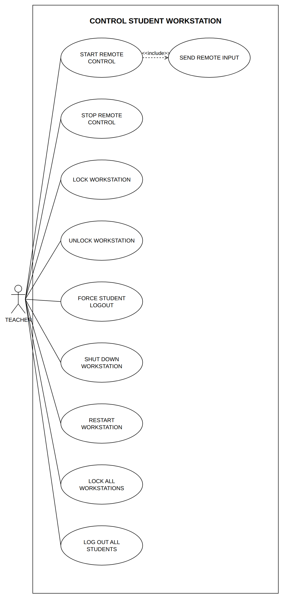

*Figure 3.32: System Use Case for control student workstation*

### T-144  ·  START REMOTE CONTROL

**Use Case Name:** START REMOTE CONTROL  
**Purpose:** Take keyboard and mouse control of a student workstation, with the client showing that remote control is active.  
**Actors:**

- Teacher (Primary Actor)
- The CAMS client on the target workstation (Secondary Actor)

**Input Parameters:**

- `targetConnectionId` : `string`

**Output Parameters:**

- A `RemoteCommandResult` stating whether the workstation accepted the command, returned to the caller over SignalR.

**Pre-Condition:**

- The caller is signed in.
- The record named by the identifier exists.

**Post-Condition:**

- The workstation has acted on the command and the console shows its new state.

**Successful Scenario:**

1. The Teacher triggers the command from the monitoring console.
2. The browser invokes `StartRemoteControl` on the SignalR hub over the open connection.
3. The server checks the caller’s role and resolves the target connection.
4. The server relays the instruction to the workstation client.
5. The client carries it out and the console reflects the new state.
6. The command is written to the remote command log.

**Exception Scenario:**

- **Not signed in or wrong role** — the request is refused and the caller is sent to the access denied page.
- **The identifier matches no record** — the action reports that the record was not found and makes no change.
- **The workstation is not connected** — the command cannot be delivered and the console reports the workstation as offline.

**Additional Remarks:**

- Implemented by `RemoteMonitoringHub.StartRemoteControl` (GET).
- Appears in the *CONTROL STUDENT WORKSTATION* module of the use case diagram.
- Pulls in **SEND REMOTE INPUT** (`<<include>>`).

### T-145  ·  STOP REMOTE CONTROL

**Use Case Name:** STOP REMOTE CONTROL  
**Purpose:** Hand control of the workstation back to the student.  
**Actors:**

- Teacher (Primary Actor)
- The CAMS client on the target workstation (Secondary Actor)

**Input Parameters:**

- `targetConnectionId` : `string`

**Output Parameters:**

- A `RemoteCommandResult` stating whether the workstation accepted the command, returned to the caller over SignalR.

**Pre-Condition:**

- The caller is signed in.
- The record named by the identifier exists.

**Post-Condition:**

- The workstation has acted on the command and the console shows its new state.

**Successful Scenario:**

1. The Teacher triggers the command from the monitoring console.
2. The browser invokes `StopRemoteControl` on the SignalR hub over the open connection.
3. The server checks the caller’s role and resolves the target connection.
4. The server relays the instruction to the workstation client.
5. The client carries it out and the console reflects the new state.
6. The command is written to the remote command log.

**Exception Scenario:**

- **Not signed in or wrong role** — the request is refused and the caller is sent to the access denied page.
- **The identifier matches no record** — the action reports that the record was not found and makes no change.
- **The workstation is not connected** — the command cannot be delivered and the console reports the workstation as offline.

**Additional Remarks:**

- Implemented by `RemoteMonitoringHub.StopRemoteControl` (GET).
- Appears in the *CONTROL STUDENT WORKSTATION* module of the use case diagram.

### T-146  ·  LOCK WORKSTATION

**Use Case Name:** LOCK WORKSTATION  
**Purpose:** Lock a student workstation so the student cannot use it until it is unlocked.  
**Actors:**

- Teacher (Primary Actor)
- The CAMS client on the target workstation (Secondary Actor)

**Input Parameters:**

- `targetConnectionId` : `string`

**Output Parameters:**

- A SignalR message delivered to the target workstation or group; no HTTP response.

**Pre-Condition:**

- The caller is signed in.
- The record named by the identifier exists.

**Post-Condition:**

- The workstation has acted on the command and the console shows its new state.

**Successful Scenario:**

1. The Teacher triggers the command from the monitoring console.
2. The browser invokes `LockStudent` on the SignalR hub over the open connection.
3. The server checks the caller’s role and resolves the target connection.
4. The server relays the instruction to the workstation client.
5. The client carries it out and the console reflects the new state.
6. The command is written to the remote command log.

**Exception Scenario:**

- **Not signed in or wrong role** — the request is refused and the caller is sent to the access denied page.
- **The identifier matches no record** — the action reports that the record was not found and makes no change.
- **The workstation is not connected** — the command cannot be delivered and the console reports the workstation as offline.

**Additional Remarks:**

- Implemented by `RemoteMonitoringHub.LockStudent` (GET).
- Appears in the *CONTROL STUDENT WORKSTATION* module of the use case diagram.

### T-147  ·  UNLOCK WORKSTATION

**Use Case Name:** UNLOCK WORKSTATION  
**Purpose:** Release the CAMS lock on a student workstation.  
**Actors:**

- Teacher (Primary Actor)
- The CAMS client on the target workstation (Secondary Actor)

**Input Parameters:**

- `targetConnectionId` : `string`

**Output Parameters:**

- A SignalR message delivered to the target workstation or group; no HTTP response.

**Pre-Condition:**

- The caller is signed in.
- The record named by the identifier exists.

**Post-Condition:**

- The workstation has acted on the command and the console shows its new state.

**Successful Scenario:**

1. The Teacher triggers the command from the monitoring console.
2. The browser invokes `UnlockStudent` on the SignalR hub over the open connection.
3. The server checks the caller’s role and resolves the target connection.
4. The server relays the instruction to the workstation client.
5. The client carries it out and the console reflects the new state.

**Exception Scenario:**

- **Not signed in or wrong role** — the request is refused and the caller is sent to the access denied page.
- **The identifier matches no record** — the action reports that the record was not found and makes no change.
- **The workstation is not connected** — the command cannot be delivered and the console reports the workstation as offline.

**Additional Remarks:**

- Implemented by `RemoteMonitoringHub.UnlockStudent` (GET).
- Appears in the *CONTROL STUDENT WORKSTATION* module of the use case diagram.

### T-148  ·  FORCE STUDENT LOGOUT

**Use Case Name:** FORCE STUDENT LOGOUT  
**Purpose:** Sign a student out of the workstation from the teacher console.  
**Actors:**

- Teacher (Primary Actor)
- The CAMS client on the target workstation (Secondary Actor)

**Input Parameters:**

- `targetConnectionId` : `string`

**Output Parameters:**

- A SignalR message delivered to the target workstation or group; no HTTP response.

**Pre-Condition:**

- The caller is signed in.
- The record named by the identifier exists.

**Post-Condition:**

- The workstation has acted on the command and the console shows its new state.

**Successful Scenario:**

1. The Teacher triggers the command from the monitoring console.
2. The browser invokes `ForceLogout` on the SignalR hub over the open connection.
3. The server checks the caller’s role and resolves the target connection.
4. The server relays the instruction to the workstation client.
5. The client carries it out and the console reflects the new state.
6. The command is written to the remote command log.

**Exception Scenario:**

- **Not signed in or wrong role** — the request is refused and the caller is sent to the access denied page.
- **The identifier matches no record** — the action reports that the record was not found and makes no change.
- **The workstation is not connected** — the command cannot be delivered and the console reports the workstation as offline.

**Additional Remarks:**

- Implemented by `RemoteMonitoringHub.ForceLogout` (GET).
- Appears in the *CONTROL STUDENT WORKSTATION* module of the use case diagram.

### T-149  ·  SHUT DOWN WORKSTATION

**Use Case Name:** SHUT DOWN WORKSTATION  
**Purpose:** Shut a student workstation down remotely.  
**Actors:**

- Teacher (Primary Actor)
- The CAMS client on the target workstation (Secondary Actor)

**Input Parameters:**

- `targetConnectionId` : `string`

**Output Parameters:**

- A SignalR message delivered to the target workstation or group; no HTTP response.

**Pre-Condition:**

- The caller is signed in.
- The record named by the identifier exists.

**Post-Condition:**

- The workstation has acted on the command and the console shows its new state.

**Successful Scenario:**

1. The Teacher triggers the command from the monitoring console.
2. The browser invokes `ShutdownStudent` on the SignalR hub over the open connection.
3. The server checks the caller’s role and resolves the target connection.
4. The server relays the instruction to the workstation client.
5. The client carries it out and the console reflects the new state.
6. The command is written to the remote command log.

**Exception Scenario:**

- **Not signed in or wrong role** — the request is refused and the caller is sent to the access denied page.
- **The identifier matches no record** — the action reports that the record was not found and makes no change.
- **The workstation is not connected** — the command cannot be delivered and the console reports the workstation as offline.

**Additional Remarks:**

- Implemented by `RemoteMonitoringHub.ShutdownStudent` (GET).
- Appears in the *CONTROL STUDENT WORKSTATION* module of the use case diagram.

### T-150  ·  RESTART WORKSTATION

**Use Case Name:** RESTART WORKSTATION  
**Purpose:** Restart a student workstation remotely.  
**Actors:**

- Teacher (Primary Actor)
- The CAMS client on the target workstation (Secondary Actor)

**Input Parameters:**

- `targetConnectionId` : `string`

**Output Parameters:**

- A SignalR message delivered to the target workstation or group; no HTTP response.

**Pre-Condition:**

- The caller is signed in.
- The record named by the identifier exists.

**Post-Condition:**

- The workstation has acted on the command and the console shows its new state.

**Successful Scenario:**

1. The Teacher triggers the command from the monitoring console.
2. The browser invokes `RestartStudent` on the SignalR hub over the open connection.
3. The server checks the caller’s role and resolves the target connection.
4. The server relays the instruction to the workstation client.
5. The client carries it out and the console reflects the new state.
6. The command is written to the remote command log.

**Exception Scenario:**

- **Not signed in or wrong role** — the request is refused and the caller is sent to the access denied page.
- **The identifier matches no record** — the action reports that the record was not found and makes no change.
- **The workstation is not connected** — the command cannot be delivered and the console reports the workstation as offline.

**Additional Remarks:**

- Implemented by `RemoteMonitoringHub.RestartStudent` (GET).
- Appears in the *CONTROL STUDENT WORKSTATION* module of the use case diagram.

### T-151  ·  LOCK ALL WORKSTATIONS

**Use Case Name:** LOCK ALL WORKSTATIONS  
**Purpose:** Lock several student workstations in one action.  
**Actors:**

- Teacher (Primary Actor)
- The CAMS client on the target workstation (Secondary Actor)

**Input Parameters:**

- `targetConnectionIds` : `List<string>`

**Output Parameters:**

- A SignalR message delivered to the target workstation or group; no HTTP response.

**Pre-Condition:**

- The caller is signed in.

**Post-Condition:**

- The workstation has acted on the command and the console shows its new state.

**Successful Scenario:**

1. The Teacher triggers the command from the monitoring console.
2. The browser invokes `BulkLockStudents` on the SignalR hub over the open connection.
3. The server checks the caller’s role and resolves the target connection.
4. The server relays the instruction to the workstation client.
5. The client carries it out and the console reflects the new state.
6. The command is written to the remote command log.

**Exception Scenario:**

- **Not signed in or wrong role** — the request is refused and the caller is sent to the access denied page.
- **The workstation is not connected** — the command cannot be delivered and the console reports the workstation as offline.

**Additional Remarks:**

- Implemented by `RemoteMonitoringHub.BulkLockStudents` (GET).
- Appears in the *CONTROL STUDENT WORKSTATION* module of the use case diagram.

### T-152  ·  LOG OUT ALL STUDENTS

**Use Case Name:** LOG OUT ALL STUDENTS  
**Purpose:** Sign several students out of their workstations in one action.  
**Actors:**

- Teacher (Primary Actor)
- The CAMS client on the target workstation (Secondary Actor)

**Input Parameters:**

- `targetConnectionIds` : `List<string>`

**Output Parameters:**

- A SignalR message delivered to the target workstation or group; no HTTP response.

**Pre-Condition:**

- The caller is signed in.

**Post-Condition:**

- The workstation has acted on the command and the console shows its new state.

**Successful Scenario:**

1. The Teacher triggers the command from the monitoring console.
2. The browser invokes `BulkForceLogoutStudents` on the SignalR hub over the open connection.
3. The server checks the caller’s role and resolves the target connection.
4. The server relays the instruction to the workstation client.
5. The client carries it out and the console reflects the new state.
6. The command is written to the remote command log.

**Exception Scenario:**

- **Not signed in or wrong role** — the request is refused and the caller is sent to the access denied page.
- **The workstation is not connected** — the command cannot be delivered and the console reports the workstation as offline.

**Additional Remarks:**

- Implemented by `RemoteMonitoringHub.BulkForceLogoutStudents` (GET).
- Appears in the *CONTROL STUDENT WORKSTATION* module of the use case diagram.

### T-153  ·  SEND REMOTE INPUT

**Use Case Name:** SEND REMOTE INPUT  
**Purpose:** Deliver one keyboard or mouse event to the workstation under remote control.  
**Actors:**

- Teacher (Primary Actor)
- The CAMS client on the target workstation (Secondary Actor)

**Input Parameters:**

- `targetConnectionId` : `string`
- `input` : `RemoteInputMessage`

**Output Parameters:**

- A `RemoteCommandResult` stating whether the workstation accepted the command, returned to the caller over SignalR.

**Pre-Condition:**

- The caller is signed in.
- The record named by the identifier exists.
- **START REMOTE CONTROL** has reached the point where this is always performed.

**Post-Condition:**

- The workstation has acted on the command and the console shows its new state.

**Successful Scenario:**

1. The Teacher triggers the command from the monitoring console.
2. The browser invokes `SendRemoteInput` on the SignalR hub over the open connection.
3. The server checks the caller’s role and resolves the target connection.
4. The server relays the instruction to the workstation client.
5. The client carries it out and the console reflects the new state.
6. The command is written to the remote command log.

**Exception Scenario:**

- **Not signed in or wrong role** — the request is refused and the caller is sent to the access denied page.
- **The identifier matches no record** — the action reports that the record was not found and makes no change.
- **The workstation is not connected** — the command cannot be delivered and the console reports the workstation as offline.

**Additional Remarks:**

- Implemented by `RemoteMonitoringHub.SendRemoteInput` (GET).
- Appears in the *CONTROL STUDENT WORKSTATION* module of the use case diagram.
- Drawn as `<<include>>` from **START REMOTE CONTROL**.

## SEND MESSAGE TO STUDENT  ·  `RemoteMonitoringHub`

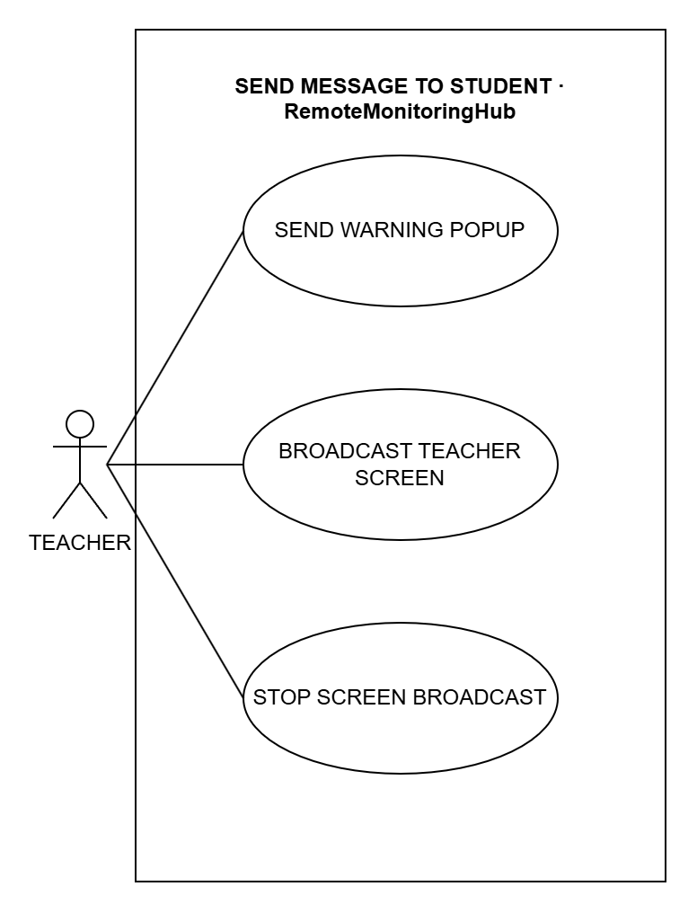

*Figure 3.33: System Use Case for send message to student*

### T-154  ·  SEND NOTIFICATION

**Use Case Name:** SEND NOTIFICATION  
**Purpose:** Send a message to connected students that appears on their workstation.  
**Actors:**

- Teacher (Primary Actor)
- The CAMS client on the target workstation (Secondary Actor)

**Input Parameters:**

- `notification` : `NotificationMessage`

**Output Parameters:**

- A SignalR message delivered to the target workstation or group; no HTTP response.

**Pre-Condition:**

- The caller is signed in.

**Post-Condition:**

- The workstation has acted on the command and the console shows its new state.

**Successful Scenario:**

1. The Teacher triggers the command from the monitoring console.
2. The browser invokes `SendNotification` on the SignalR hub over the open connection.
3. The server checks the caller’s role and resolves the target connection.
4. The server relays the instruction to the workstation client.
5. The client carries it out and the console reflects the new state.

**Exception Scenario:**

- **Not signed in or wrong role** — the request is refused and the caller is sent to the access denied page.
- **The workstation is not connected** — the command cannot be delivered and the console reports the workstation as offline.

**Additional Remarks:**

- Implemented by `RemoteMonitoringHub.SendNotification` (GET).
- Appears in the *SEND MESSAGE TO STUDENT* module of the use case diagram.

### T-155  ·  SEND WARNING POPUP

**Use Case Name:** SEND WARNING POPUP  
**Purpose:** Send a warning dialog to one student, shown on top of whatever they are doing.  
**Actors:**

- Teacher (Primary Actor)
- The CAMS client on the target workstation (Secondary Actor)

**Input Parameters:**

- `targetConnectionId` : `string`
- `warning` : `NotificationMessage`

**Output Parameters:**

- A SignalR message delivered to the target workstation or group; no HTTP response.

**Pre-Condition:**

- The caller is signed in.
- The record named by the identifier exists.

**Post-Condition:**

- The workstation has acted on the command and the console shows its new state.

**Successful Scenario:**

1. The Teacher triggers the command from the monitoring console.
2. The browser invokes `SendWarningPopup` on the SignalR hub over the open connection.
3. The server checks the caller’s role and resolves the target connection.
4. The server relays the instruction to the workstation client.
5. The client carries it out and the console reflects the new state.

**Exception Scenario:**

- **Not signed in or wrong role** — the request is refused and the caller is sent to the access denied page.
- **The identifier matches no record** — the action reports that the record was not found and makes no change.
- **The workstation is not connected** — the command cannot be delivered and the console reports the workstation as offline.

**Additional Remarks:**

- Implemented by `RemoteMonitoringHub.SendWarningPopup` (GET).
- Appears in the *SEND MESSAGE TO STUDENT* module of the use case diagram.

### T-156  ·  BROADCAST SCREEN

**Use Case Name:** BROADCAST SCREEN  
**Purpose:** Put the teacher screen on every connected student workstation.  
**Actors:**

- Teacher (Primary Actor)
- The CAMS client on the target workstation (Secondary Actor)

**Input Parameters:**

- `frameBase64` : `string`

**Output Parameters:**

- A SignalR message delivered to the target workstation or group; no HTTP response.

**Pre-Condition:**

- The caller is signed in.

**Post-Condition:**

- The workstation has acted on the command and the console shows its new state.

**Successful Scenario:**

1. The Teacher triggers the command from the monitoring console.
2. The browser invokes `BroadcastScreen` on the SignalR hub over the open connection.
3. The server checks the caller’s role and resolves the target connection.
4. The server relays the instruction to the workstation client.
5. The client carries it out and the console reflects the new state.

**Exception Scenario:**

- **Not signed in or wrong role** — the request is refused and the caller is sent to the access denied page.
- **The workstation is not connected** — the command cannot be delivered and the console reports the workstation as offline.

**Additional Remarks:**

- Implemented by `RemoteMonitoringHub.BroadcastScreen` (GET).
- Appears in the *SEND MESSAGE TO STUDENT* module of the use case diagram.

### T-157  ·  STOP BROADCAST

**Use Case Name:** STOP BROADCAST  
**Purpose:** Stop the teacher screen broadcast and return the workstations to the student view.  
**Actors:**

- Teacher (Primary Actor)
- The CAMS client on the target workstation (Secondary Actor)

**Input Parameters:**

- None beyond the signed-in identity carried on the authentication cookie.

**Output Parameters:**

- A SignalR message delivered to the target workstation or group; no HTTP response.

**Pre-Condition:**

- The caller is signed in.

**Post-Condition:**

- The workstation has acted on the command and the console shows its new state.

**Successful Scenario:**

1. The Teacher triggers the command from the monitoring console.
2. The browser invokes `StopBroadcast` on the SignalR hub over the open connection.
3. The server checks the caller’s role and resolves the target connection.
4. The server relays the instruction to the workstation client.
5. The client carries it out and the console reflects the new state.

**Exception Scenario:**

- **Not signed in or wrong role** — the request is refused and the caller is sent to the access denied page.
- **The workstation is not connected** — the command cannot be delivered and the console reports the workstation as offline.

**Additional Remarks:**

- Implemented by `RemoteMonitoringHub.StopBroadcast` (GET).
- Appears in the *SEND MESSAGE TO STUDENT* module of the use case diagram.

## MANAGE MONITORING ALERT  ·  `TeacherController`

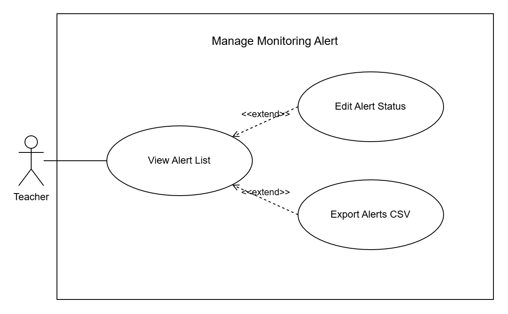

*Figure 3.34: System Use Case for manage monitoring alert*

### T-158  ·  VIEW ALERTS

**Use Case Name:** VIEW ALERTS  
**Purpose:** List the monitoring alerts raised for the classes the teacher is responsible for.  
**Actors:**

- Teacher (Primary Actor)

**Input Parameters:**

- `filter` : `AlertListFilter`

**Output Parameters:**

- The rendered page, or a JSON payload where the caller is the page’s own script.

**Pre-Condition:**

- The caller is signed in as a teacher.

**Post-Condition:**

- The caller has the requested information. Nothing in the database has changed.

**Successful Scenario:**

1. The Teacher opens the page and CAMS confirms the role on the authentication cookie.
2. The server reads the records the caller is entitled to see.
3. The page renders with those records.

**Exception Scenario:**

- **Not signed in or wrong role** — the request is refused and the caller is sent to the access denied page.

**Additional Remarks:**

- Implemented by `TeacherController.Alerts` (GET).
- Appears in the *MANAGE MONITORING ALERT* module of the use case diagram.

### T-159  ·  VIEW ALERT HISTORY

**Use Case Name:** VIEW ALERT HISTORY  
**Purpose:** Show alerts that have already been acted on, with who acted and when.  
**Actors:**

- Teacher (Primary Actor)

**Input Parameters:**

- `id` : `int`

**Output Parameters:**

- The rendered page, or a JSON payload where the caller is the page’s own script.

**Pre-Condition:**

- The caller is signed in as a teacher.
- The record named by the identifier exists.

**Post-Condition:**

- The caller has the requested information. Nothing in the database has changed.

**Successful Scenario:**

1. The Teacher opens the page and CAMS confirms the role on the authentication cookie.
2. The server reads the records the caller is entitled to see.
3. The page renders with those records.

**Exception Scenario:**

- **Not signed in or wrong role** — the request is refused and the caller is sent to the access denied page.
- **The identifier matches no record** — the action reports that the record was not found and makes no change.

**Additional Remarks:**

- Implemented by `TeacherController.AlertHistory` (GET).
- Appears in the *MANAGE MONITORING ALERT* module of the use case diagram.
- Pulls in **EXPORT ALERTS CSV** (`<<extend>>`).

### T-160  ·  ACKNOWLEDGE ALERT

**Use Case Name:** ACKNOWLEDGE ALERT  
**Purpose:** Mark one alert as seen and being handled.  
**Actors:**

- Teacher (Primary Actor)

**Input Parameters:**

- `id` : `int`
- `acknowledged` : `bool`
- `filter` : `AlertListFilter`

**Output Parameters:**

- A redirect back to the listing page, carrying a success or failure message for display.

**Pre-Condition:**

- The caller is signed in as a teacher.
- The record named by the identifier exists.

**Post-Condition:**

- The change is committed to the database and visible to the next read.
- The caller sees the outcome reported on the page they return to.

**Successful Scenario:**

1. The Teacher opens the page and CAMS confirms the role on the authentication cookie.
2. The Teacher fills the form and submits it.
3. The server validates the antiforgery token that accompanied the form.
4. The server validates the submitted values against the model rules.
5. The change is written to the database through `ApplicationDbContext`.
6. The server redirects back to the listing, where the result is shown.

**Exception Scenario:**

- **Not signed in or wrong role** — the request is refused and the caller is sent to the access denied page.
- **Missing or stale antiforgery token** — the submission is rejected and must be retried from a freshly loaded form.
- **Validation fails** — the form is redisplayed with the offending fields marked and nothing is written.
- **The identifier matches no record** — the action reports that the record was not found and makes no change.

**Additional Remarks:**

- Implemented by `TeacherController.AcknowledgeAlert` (POST).
- Appears in the *MANAGE MONITORING ALERT* module of the use case diagram.

### T-161  ·  ACKNOWLEDGE ALL ALERTS

**Use Case Name:** ACKNOWLEDGE ALL ALERTS  
**Purpose:** Acknowledge several alerts in one action.  
**Actors:**

- Teacher (Primary Actor)

**Input Parameters:**

- `alertIds` : `List<int>?`
- `filter` : `AlertListFilter`

**Output Parameters:**

- A redirect back to the listing page, carrying a success or failure message for display.

**Pre-Condition:**

- The caller is signed in as a teacher.

**Post-Condition:**

- The change is committed to the database and visible to the next read.
- The caller sees the outcome reported on the page they return to.

**Successful Scenario:**

1. The Teacher opens the page and CAMS confirms the role on the authentication cookie.
2. The Teacher fills the form and submits it.
3. The server validates the antiforgery token that accompanied the form.
4. The server validates the submitted values against the model rules.
5. The change is written to the database through `ApplicationDbContext`.
6. The server redirects back to the listing, where the result is shown.

**Exception Scenario:**

- **Not signed in or wrong role** — the request is refused and the caller is sent to the access denied page.
- **Missing or stale antiforgery token** — the submission is rejected and must be retried from a freshly loaded form.
- **Validation fails** — the form is redisplayed with the offending fields marked and nothing is written.

**Additional Remarks:**

- Implemented by `TeacherController.BulkAcknowledgeAlerts` (POST).
- Appears in the *MANAGE MONITORING ALERT* module of the use case diagram.

### T-162  ·  DISMISS ALL ALERTS

**Use Case Name:** DISMISS ALL ALERTS  
**Purpose:** Dismiss several alerts in one action.  
**Actors:**

- Teacher (Primary Actor)

**Input Parameters:**

- `alertIds` : `List<int>?`
- `reason` : `string?`
- `filter` : `AlertListFilter`

**Output Parameters:**

- A redirect back to the listing page, carrying a success or failure message for display.

**Pre-Condition:**

- The caller is signed in as a teacher.

**Post-Condition:**

- The change is committed to the database and visible to the next read.
- The caller sees the outcome reported on the page they return to.

**Successful Scenario:**

1. The Teacher opens the page and CAMS confirms the role on the authentication cookie.
2. The Teacher fills the form and submits it.
3. The server validates the antiforgery token that accompanied the form.
4. The server validates the submitted values against the model rules.
5. The change is written to the database through `ApplicationDbContext`.
6. The server redirects back to the listing, where the result is shown.

**Exception Scenario:**

- **Not signed in or wrong role** — the request is refused and the caller is sent to the access denied page.
- **Missing or stale antiforgery token** — the submission is rejected and must be retried from a freshly loaded form.
- **Validation fails** — the form is redisplayed with the offending fields marked and nothing is written.

**Additional Remarks:**

- Implemented by `TeacherController.BulkDismissAlerts` (POST).
- Appears in the *MANAGE MONITORING ALERT* module of the use case diagram.

### T-163  ·  REOPEN ALL ALERTS

**Use Case Name:** REOPEN ALL ALERTS  
**Purpose:** Reopen several alerts that were closed too early.  
**Actors:**

- Teacher (Primary Actor)

**Input Parameters:**

- `alertIds` : `List<int>?`
- `filter` : `AlertListFilter`

**Output Parameters:**

- A redirect back to the listing page, carrying a success or failure message for display.

**Pre-Condition:**

- The caller is signed in as a teacher.

**Post-Condition:**

- The change is committed to the database and visible to the next read.
- The caller sees the outcome reported on the page they return to.

**Successful Scenario:**

1. The Teacher opens the page and CAMS confirms the role on the authentication cookie.
2. The Teacher fills the form and submits it.
3. The server validates the antiforgery token that accompanied the form.
4. The server validates the submitted values against the model rules.
5. The change is written to the database through `ApplicationDbContext`.
6. The server redirects back to the listing, where the result is shown.

**Exception Scenario:**

- **Not signed in or wrong role** — the request is refused and the caller is sent to the access denied page.
- **Missing or stale antiforgery token** — the submission is rejected and must be retried from a freshly loaded form.
- **Validation fails** — the form is redisplayed with the offending fields marked and nothing is written.

**Additional Remarks:**

- Implemented by `TeacherController.BulkReopenAlerts` (POST).
- Appears in the *MANAGE MONITORING ALERT* module of the use case diagram.

### T-164  ·  EXPORT ALERTS CSV

**Use Case Name:** EXPORT ALERTS CSV  
**Purpose:** Produce the alerts view as a CSV file the user can download.  
**Actors:**

- Teacher (Primary Actor)
- None; this behaviour runs inside **VIEW ALERT HISTORY** (Secondary Actor)

**Input Parameters:**

- `filter` : `AlertListFilter`

**Output Parameters:**

- The rendered page, or a JSON payload where the caller is the page’s own script.

**Pre-Condition:**

- The caller is signed in as a teacher.
- **VIEW ALERT HISTORY** has reached the point where this is optionally performed.

**Post-Condition:**

- The caller has the requested information. Nothing in the database has changed.

**Successful Scenario:**

1. The Teacher opens the page and CAMS confirms the role on the authentication cookie.
2. The server reads the records the caller is entitled to see.
3. The page renders with those records.

**Exception Scenario:**

- **Not signed in or wrong role** — the request is refused and the caller is sent to the access denied page.

**Additional Remarks:**

- Implemented by `TeacherController.ExportAlertsCsv` (GET).
- Appears in the *MANAGE MONITORING ALERT* module of the use case diagram.
- Drawn as `<<extend>>` to **VIEW ALERT HISTORY**.

## VIEW TEACHER RECORDS  ·  `TeacherController`

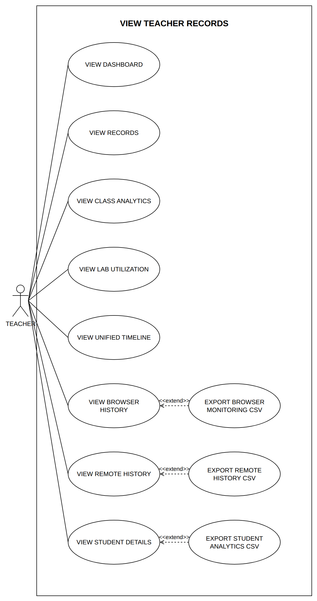

*Figure 3.35: System Use Case for view teacher records*

### T-165  ·  VIEW DASHBOARD

**Use Case Name:** VIEW DASHBOARD  
**Purpose:** Show the teacher landing page with the state of the laboratory at a glance.  
**Actors:**

- Teacher (Primary Actor)

**Input Parameters:**

- None beyond the signed-in identity carried on the authentication cookie.

**Output Parameters:**

- The rendered page, or a JSON payload where the caller is the page’s own script.

**Pre-Condition:**

- The caller is signed in as a teacher.

**Post-Condition:**

- The caller has the requested information. Nothing in the database has changed.

**Successful Scenario:**

1. The Teacher opens the page and CAMS confirms the role on the authentication cookie.
2. The server reads the records the caller is entitled to see.
3. The page renders with those records.

**Exception Scenario:**

- **Not signed in or wrong role** — the request is refused and the caller is sent to the access denied page.

**Additional Remarks:**

- Implemented by `TeacherController.Dashboard` (GET).
- Appears in the *VIEW TEACHER RECORDS* module of the use case diagram.

### T-166  ·  VIEW RECORDS

**Use Case Name:** VIEW RECORDS  
**Purpose:** Show captured application and website activity for the teacher’s students.  
**Actors:**

- Teacher (Primary Actor)

**Input Parameters:**

- None beyond the signed-in identity carried on the authentication cookie.

**Output Parameters:**

- The rendered page, or a JSON payload where the caller is the page’s own script.

**Pre-Condition:**

- The caller is signed in as a teacher.

**Post-Condition:**

- The caller has the requested information. Nothing in the database has changed.

**Successful Scenario:**

1. The Teacher opens the page and CAMS confirms the role on the authentication cookie.
2. The server reads the records the caller is entitled to see.
3. The page renders with those records.

**Exception Scenario:**

- **Not signed in or wrong role** — the request is refused and the caller is sent to the access denied page.

**Additional Remarks:**

- Implemented by `TeacherController.Records` (GET).
- Appears in the *VIEW TEACHER RECORDS* module of the use case diagram.

### T-167  ·  VIEW CLASS ANALYTICS

**Use Case Name:** VIEW CLASS ANALYTICS  
**Purpose:** Show usage patterns for a class rather than for one student.  
**Actors:**

- Teacher (Primary Actor)

**Input Parameters:**

- `id` : `int`
- `from` : `DateTime?` (optional)
- `to` : `DateTime?` (optional)
- `station` : `string?` (optional)

**Output Parameters:**

- The rendered page, or a JSON payload where the caller is the page’s own script.

**Pre-Condition:**

- The caller is signed in as a teacher.
- The record named by the identifier exists.

**Post-Condition:**

- The caller has the requested information. Nothing in the database has changed.

**Successful Scenario:**

1. The Teacher opens the page and CAMS confirms the role on the authentication cookie.
2. The server reads the records the caller is entitled to see.
3. The page renders with those records.

**Exception Scenario:**

- **Not signed in or wrong role** — the request is refused and the caller is sent to the access denied page.
- **The identifier matches no record** — the action reports that the record was not found and makes no change.

**Additional Remarks:**

- Implemented by `TeacherController.ClassAnalytics` (GET).
- Appears in the *VIEW TEACHER RECORDS* module of the use case diagram.

### T-168  ·  VIEW LAB UTILIZATION

**Use Case Name:** VIEW LAB UTILIZATION  
**Purpose:** Show how heavily the laboratory workstations are being used over time.  
**Actors:**

- Teacher (Primary Actor)

**Input Parameters:**

- `from` : `DateTime?` (optional)
- `to` : `DateTime?` (optional)
- `station` : `string?` (optional)
- `classId` : `int?` (optional)

**Output Parameters:**

- The rendered page, or a JSON payload where the caller is the page’s own script.

**Pre-Condition:**

- The caller is signed in as a teacher.
- The record named by the identifier exists.

**Post-Condition:**

- The caller has the requested information. Nothing in the database has changed.

**Successful Scenario:**

1. The Teacher opens the page and CAMS confirms the role on the authentication cookie.
2. The server reads the records the caller is entitled to see.
3. The page renders with those records.

**Exception Scenario:**

- **Not signed in or wrong role** — the request is refused and the caller is sent to the access denied page.
- **The identifier matches no record** — the action reports that the record was not found and makes no change.

**Additional Remarks:**

- Implemented by `TeacherController.LabUtilization` (GET).
- Appears in the *VIEW TEACHER RECORDS* module of the use case diagram.

### T-169  ·  VIEW UNIFIED TIMELINE

**Use Case Name:** VIEW UNIFIED TIMELINE  
**Purpose:** Show one student’s activity as a single timeline across applications, websites and idle periods.  
**Actors:**

- Teacher (Primary Actor)

**Input Parameters:**

- `from` : `DateTime?` (optional)
- `to` : `DateTime?` (optional)
- `studentId` : `int?` (optional)
- `classId` : `int?` (optional)
- `station` : `string?` (optional)
- `source` : `string?` (optional)
- `eventType` : `string?` (optional)
- `page` : `int` (optional)
- `pageSize` : `int` (optional)

**Output Parameters:**

- The rendered page, or a JSON payload where the caller is the page’s own script.

**Pre-Condition:**

- The caller is signed in as a teacher.
- The record named by the identifier exists.

**Post-Condition:**

- The caller has the requested information. Nothing in the database has changed.

**Successful Scenario:**

1. The Teacher opens the page and CAMS confirms the role on the authentication cookie.
2. The server reads the records the caller is entitled to see.
3. The page renders with those records.

**Exception Scenario:**

- **Not signed in or wrong role** — the request is refused and the caller is sent to the access denied page.
- **The identifier matches no record** — the action reports that the record was not found and makes no change.

**Additional Remarks:**

- Implemented by `TeacherController.UnifiedTimeline` (GET).
- Appears in the *VIEW TEACHER RECORDS* module of the use case diagram.

### T-170  ·  VIEW BROWSER HISTORY

**Use Case Name:** VIEW BROWSER HISTORY  
**Purpose:** Show the record of browser activity captured from the workstations.  
**Actors:**

- Teacher (Primary Actor)

**Input Parameters:**

- `from` : `DateTime?` (optional)
- `to` : `DateTime?` (optional)
- `browser` : `string?` (optional)
- `mode` : `string?` (optional)
- `page` : `int` (optional)
- `pageSize` : `int` (optional)

**Output Parameters:**

- The rendered page, or a JSON payload where the caller is the page’s own script.

**Pre-Condition:**

- The caller is signed in as a teacher.

**Post-Condition:**

- The caller has the requested information. Nothing in the database has changed.

**Successful Scenario:**

1. The Teacher opens the page and CAMS confirms the role on the authentication cookie.
2. The server reads the records the caller is entitled to see.
3. The page renders with those records.

**Exception Scenario:**

- **Not signed in or wrong role** — the request is refused and the caller is sent to the access denied page.

**Additional Remarks:**

- Implemented by `TeacherController.BrowserMonitoringHistory` (GET).
- Appears in the *VIEW TEACHER RECORDS* module of the use case diagram.
- Pulls in **EXPORT BROWSER MONITORING CSV** (`<<extend>>`).

### T-171  ·  VIEW REMOTE HISTORY

**Use Case Name:** VIEW REMOTE HISTORY  
**Purpose:** Show which remote commands were issued, by whom, and against which workstation.  
**Actors:**

- Teacher (Primary Actor)

**Input Parameters:**

- `from` : `DateTime?` (optional)
- `to` : `DateTime?` (optional)
- `command` : `string?` (optional)
- `studentId` : `string?` (optional)
- `page` : `int` (optional)

**Output Parameters:**

- The rendered page, or a JSON payload where the caller is the page’s own script.

**Pre-Condition:**

- The caller is signed in as a teacher.
- The record named by the identifier exists.

**Post-Condition:**

- The caller has the requested information. Nothing in the database has changed.

**Successful Scenario:**

1. The Teacher opens the page and CAMS confirms the role on the authentication cookie.
2. The server reads the records the caller is entitled to see.
3. The page renders with those records.

**Exception Scenario:**

- **Not signed in or wrong role** — the request is refused and the caller is sent to the access denied page.
- **The identifier matches no record** — the action reports that the record was not found and makes no change.

**Additional Remarks:**

- Implemented by `TeacherController.RemoteHistory` (GET).
- Appears in the *VIEW TEACHER RECORDS* module of the use case diagram.
- Pulls in **EXPORT REMOTE HISTORY CSV** (`<<extend>>`).

### T-172  ·  VIEW STUDENT DETAILS

**Use Case Name:** VIEW STUDENT DETAILS  
**Purpose:** Show one student in full: account, class, sessions and captured activity.  
**Actors:**

- Teacher (Primary Actor)

**Input Parameters:**

- `id` : `int`
- `from` : `DateTime?` (optional)
- `to` : `DateTime?` (optional)

**Output Parameters:**

- The rendered page, or a JSON payload where the caller is the page’s own script.

**Pre-Condition:**

- The caller is signed in as a teacher.
- The record named by the identifier exists.

**Post-Condition:**

- The caller has the requested information. Nothing in the database has changed.

**Successful Scenario:**

1. The Teacher opens the page and CAMS confirms the role on the authentication cookie.
2. The server reads the records the caller is entitled to see.
3. The page renders with those records.

**Exception Scenario:**

- **Not signed in or wrong role** — the request is refused and the caller is sent to the access denied page.
- **The identifier matches no record** — the action reports that the record was not found and makes no change.

**Additional Remarks:**

- Implemented by `TeacherController.StudentDetails` (GET).
- Appears in the *VIEW TEACHER RECORDS* module of the use case diagram.
- Pulls in **EXPORT STUDENT ANALYTICS CSV** (`<<extend>>`).

### T-173  ·  EXPORT REMOTE HISTORY CSV

**Use Case Name:** EXPORT REMOTE HISTORY CSV  
**Purpose:** Produce the remote history view as a CSV file the user can download.  
**Actors:**

- Teacher (Primary Actor)
- None; this behaviour runs inside **VIEW REMOTE HISTORY** (Secondary Actor)

**Input Parameters:**

- `from` : `DateTime?` (optional)
- `to` : `DateTime?` (optional)
- `command` : `string?` (optional)
- `studentId` : `string?` (optional)

**Output Parameters:**

- The rendered page, or a JSON payload where the caller is the page’s own script.

**Pre-Condition:**

- The caller is signed in as a teacher.
- The record named by the identifier exists.
- **VIEW REMOTE HISTORY** has reached the point where this is optionally performed.

**Post-Condition:**

- The caller has the requested information. Nothing in the database has changed.

**Successful Scenario:**

1. The Teacher opens the page and CAMS confirms the role on the authentication cookie.
2. The server reads the records the caller is entitled to see.
3. The page renders with those records.

**Exception Scenario:**

- **Not signed in or wrong role** — the request is refused and the caller is sent to the access denied page.
- **The identifier matches no record** — the action reports that the record was not found and makes no change.

**Additional Remarks:**

- Implemented by `TeacherController.ExportRemoteHistoryCsv` (GET).
- Appears in the *VIEW TEACHER RECORDS* module of the use case diagram.
- Drawn as `<<extend>>` to **VIEW REMOTE HISTORY**.

### T-174  ·  EXPORT BROWSER MONITORING CSV

**Use Case Name:** EXPORT BROWSER MONITORING CSV  
**Purpose:** Produce the browser monitoring view as a CSV file the user can download.  
**Actors:**

- Teacher (Primary Actor)
- None; this behaviour runs inside **VIEW BROWSER HISTORY** (Secondary Actor)

**Input Parameters:**

- `from` : `DateTime?` (optional)
- `to` : `DateTime?` (optional)
- `browser` : `string?` (optional)
- `mode` : `string?` (optional)

**Output Parameters:**

- The rendered page, or a JSON payload where the caller is the page’s own script.

**Pre-Condition:**

- The caller is signed in as a teacher.
- **VIEW BROWSER HISTORY** has reached the point where this is optionally performed.

**Post-Condition:**

- The caller has the requested information. Nothing in the database has changed.

**Successful Scenario:**

1. The Teacher opens the page and CAMS confirms the role on the authentication cookie.
2. The server reads the records the caller is entitled to see.
3. The page renders with those records.

**Exception Scenario:**

- **Not signed in or wrong role** — the request is refused and the caller is sent to the access denied page.

**Additional Remarks:**

- Implemented by `TeacherController.ExportBrowserMonitoringCsv` (GET).
- Appears in the *VIEW TEACHER RECORDS* module of the use case diagram.
- Drawn as `<<extend>>` to **VIEW BROWSER HISTORY**.

### T-175  ·  EXPORT STUDENT ANALYTICS CSV

**Use Case Name:** EXPORT STUDENT ANALYTICS CSV  
**Purpose:** Produce the student analytics view as a CSV file the user can download.  
**Actors:**

- Teacher (Primary Actor)
- None; this behaviour runs inside **VIEW STUDENT DETAILS** (Secondary Actor)

**Input Parameters:**

- `id` : `int`
- `from` : `DateTime?` (optional)
- `to` : `DateTime?` (optional)

**Output Parameters:**

- The rendered page, or a JSON payload where the caller is the page’s own script.

**Pre-Condition:**

- The caller is signed in as a teacher.
- The record named by the identifier exists.
- **VIEW STUDENT DETAILS** has reached the point where this is optionally performed.

**Post-Condition:**

- The caller has the requested information. Nothing in the database has changed.

**Successful Scenario:**

1. The Teacher opens the page and CAMS confirms the role on the authentication cookie.
2. The server reads the records the caller is entitled to see.
3. The page renders with those records.

**Exception Scenario:**

- **Not signed in or wrong role** — the request is refused and the caller is sent to the access denied page.
- **The identifier matches no record** — the action reports that the record was not found and makes no change.

**Additional Remarks:**

- Implemented by `TeacherController.ExportStudentAnalyticsCsv` (GET).
- Appears in the *VIEW TEACHER RECORDS* module of the use case diagram.
- Drawn as `<<extend>>` to **VIEW STUDENT DETAILS**.

# STUDENT

## LOG IN AT WORKSTATION  ·  `ClientAuthController`

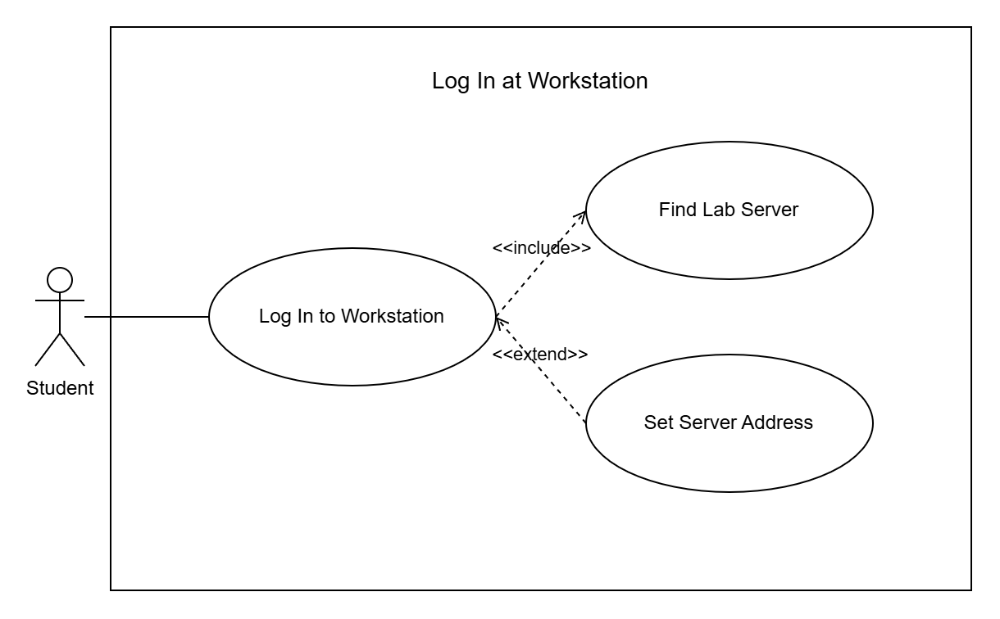

*Figure 3.36: System Use Case for log in at workstation*

### S-176  ·  AUTHENTICATE WORKSTATION

**Use Case Name:** AUTHENTICATE WORKSTATION  
**Purpose:** Let a student sign in from the CAMS client installed on a laboratory workstation, binding the sign-in to the machine the student is sitting at.  
**Actors:**

- Student (Primary Actor)

**Input Parameters:**

- `request` : `StudentClientLoginRequest`

**Output Parameters:**

- A `StudentClientLoginResponse` carrying the student identity, the workstation registration and the session state.

**Pre-Condition:**

- None. The client reaches this before any session exists. The workstation must have found the server and must trust the CAMS root certificate.

**Post-Condition:**

- The change is committed to the database and visible to the next read.
- The caller sees the outcome reported on the page they return to.

**Successful Scenario:**

1. The CAMS client finds the server on the laboratory network.
2. The student enters a username and a password in the client.
3. The client posts the credentials together with the name of the workstation.
4. The server verifies the credentials and confirms the account is a student that is active and not locked out.
5. The server registers the workstation against the student, reassigning it if it was held by someone else who is no longer using it.
6. The client receives the session details and the monitored session begins.

**Exception Scenario:**

- **No server was found on the network** — the client reports that it cannot reach CAMS and offers the endpoint to be entered by hand.
- **The workstation is already held by another active session** — the sign-in is refused rather than displacing the student using it.
- **The account is not a student** — the client refuses the sign-in; teacher and administrator accounts use the web portal.

**Additional Remarks:**

- Implemented by `ClientAuthController.Login` (POST).
- Appears in the *LOG IN AT WORKSTATION* module of the use case diagram.
- Can be extended by **SET SERVER ADDRESS** (`<<extend>>`) when the server cannot be found on its own.

### S-177  ·  DISCONNECT WORKSTATION

**Use Case Name:** DISCONNECT WORKSTATION  
**Purpose:** End the workstation session from the client, releasing the workstation so another student may sign in to it.  
**Actors:**

- Student (Primary Actor)

**Input Parameters:**

- None beyond the signed-in identity carried on the authentication cookie.

**Output Parameters:**

- Confirmation that the session was closed and the workstation released.

**Pre-Condition:**

- The caller is signed in as a student.

**Post-Condition:**

- The change is committed to the database and visible to the next read.
- The caller sees the outcome reported on the page they return to.

**Successful Scenario:**

1. The student signs out from the CAMS client.
2. The server ends the lab session and records its end time.
3. The workstation is released so another student may sign in at it.

**Exception Scenario:**

- **Not signed in or wrong role** — the request is refused and the caller is sent to the access denied page.
- **Validation fails** — the form is redisplayed with the offending fields marked and nothing is written.

**Additional Remarks:**

- Implemented by `ClientAuthController.Logout` (POST).
- Appears in the *LOG IN AT WORKSTATION* module of the use case diagram.

### S-178  ·  SET SERVER ADDRESS

**Use Case Name:** SET SERVER ADDRESS  
**Purpose:** Point the client at the server by hand, for the case where discovery finds nothing. The address is checked for shape before it is saved, and the client retries the sign-in with it.  
**Actors:**

- Student (Primary Actor)
- None; this behaviour runs inside **AUTHENTICATE WORKSTATION** (Secondary Actor)

**Input Parameters:**

- None beyond the signed-in identity carried on the authentication cookie.

**Output Parameters:**

- The behaviour completes and its effect is visible to the use case that includes it.

**Pre-Condition:**

- The caller is signed in.
- **AUTHENTICATE WORKSTATION** has reached the point where this is optionally performed.

**Post-Condition:**

- The caller has the requested information. Nothing in the database has changed.

**Successful Scenario:**

1. The including use case reaches the point where this behaviour is required.
2. The server runs `SetServerAddress` and applies its result.
3. Control returns to the including use case, which continues.

**Exception Scenario:**

- The behaviour fails and the including use case reports the failure rather than continuing as if it had succeeded.

**Additional Remarks:**

- Implemented by `MainForm.ShowServerUrlDialog` (CAMS client).
- Appears in the *LOG IN AT WORKSTATION* module of the use case diagram.
- Drawn as `<<extend>>` to **AUTHENTICATE WORKSTATION**.

## MANAGE OWN ACCOUNT  ·  `ClientAuthController`

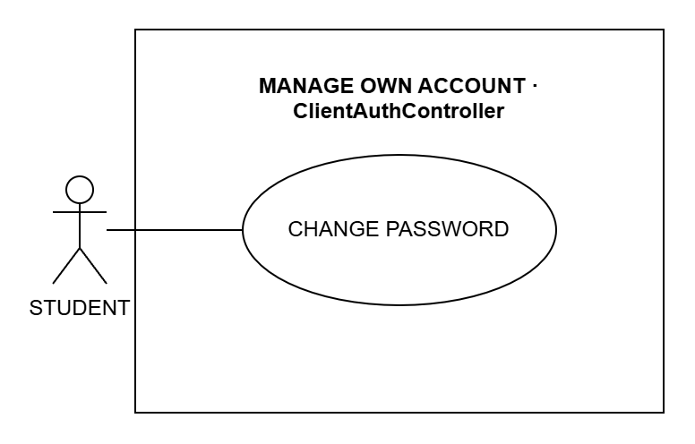

*Figure 3.37: System Use Case for manage own account*

### S-179  ·  CHANGE PASSWORD

**Use Case Name:** CHANGE PASSWORD
**Purpose:** Let the student signed in at a workstation replace their own password from the CAMS client, after proving they know the current one. The web portal does not admit students, so the client is the only place a student can do this.
**Actors:**

- Student (Primary Actor)

**Input Parameters:**

- `request` : `StudentClientPasswordChangeRequest`

**Output Parameters:**

- No content when the password has been changed, or the reason it was refused, which the client shows in its change-password dialog.

**Pre-Condition:**

- The caller is signed in as a student at the workstation.

**Post-Condition:**

- The new password is stored as a hash and the old one no longer signs in.
- The change is recorded in the audit log together with the workstation's address.

**Successful Scenario:**

1. The student chooses Change password in the CAMS client window.
2. The student enters the current password and the new password twice.
3. The client checks that the new password has at least eight characters, differs from the current one and matches its confirmation.
4. The client posts the current and new passwords on the student's sign-in cookie.
5. The server verifies the current password and stores the new one.
6. The client confirms the change, and the student uses the new password at the next log in.

**Exception Scenario:**

- **The current password is wrong** — nothing changes and the dialog says the current password is incorrect.
- **The new password breaks a rule** — it is too short, the same as the current one, or does not match its confirmation; nothing is written and the dialog says which.
- **Five wrong current passwords in a row** — further attempts for that student are refused for a minute. The count is kept per student, so classmates behind the same address are not affected.
- **The sign-in has expired** — the request is refused and the student is asked to log out and log in again.

**Additional Remarks:**

- Implemented by `ClientAuthController.ChangePassword` (POST).
- Appears in the *MANAGE OWN ACCOUNT* module of the use case diagram.

## USE THE CLIENT AGENT  ·  `MainForm + TrayIconController`

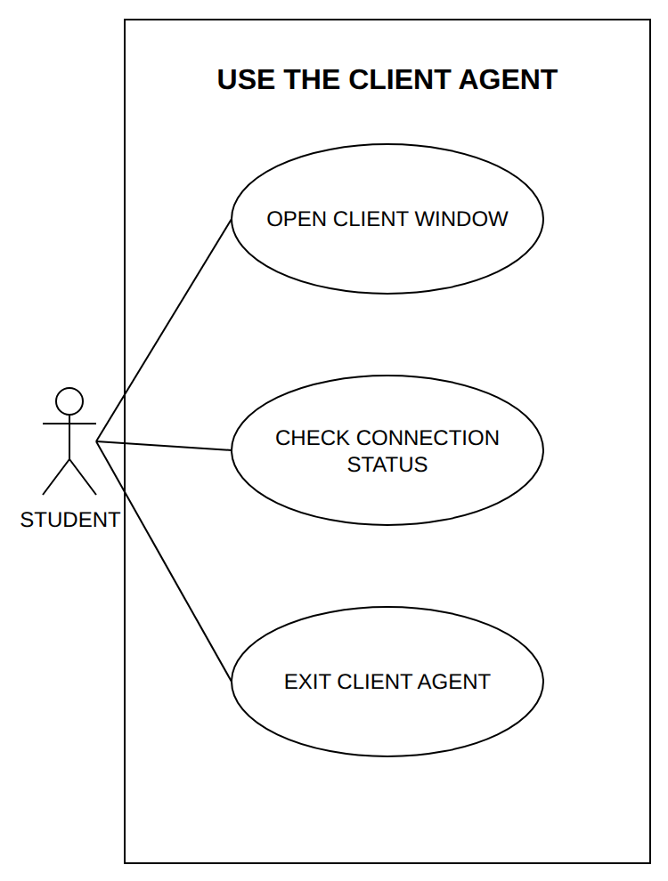

*Figure 3.38: System Use Case for use the client agent*

### S-180  ·  OPEN CLIENT WINDOW

**Use Case Name:** OPEN CLIENT WINDOW  
**Purpose:** Bring the CAMS window back from the notification area, where the agent sits while the student works. It reopens in the middle of the screen.  
**Actors:**

- Student (Primary Actor)

**Input Parameters:**

- None beyond the signed-in identity carried on the authentication cookie.

**Output Parameters:**

- The behaviour completes and its effect is visible to the use case that includes it.

**Pre-Condition:**

- The caller is signed in.

**Post-Condition:**

- The caller has the requested information. Nothing in the database has changed.

**Successful Scenario:**

1. The including use case reaches the point where this behaviour is required.
2. The server runs `OpenClientWindow` and applies its result.
3. Control returns to the including use case, which continues.

**Exception Scenario:**

- The behaviour fails and the including use case reports the failure rather than continuing as if it had succeeded.

**Additional Remarks:**

- Implemented by `MainForm.RestoreFromTray` (CAMS client).
- Appears in the *USE THE CLIENT AGENT* module of the use case diagram.

### S-181  ·  CHECK CONNECTION STATUS

**Use Case Name:** CHECK CONNECTION STATUS  
**Purpose:** Show who is signed in at this workstation, whether the agent is connected to the server, and how much of the lab session is left, without leaving what the student is doing.  
**Actors:**

- Student (Primary Actor)

**Input Parameters:**

- None beyond the signed-in identity carried on the authentication cookie.

**Output Parameters:**

- The behaviour completes and its effect is visible to the use case that includes it.

**Pre-Condition:**

- The caller is signed in.

**Post-Condition:**

- The caller has the requested information. Nothing in the database has changed.

**Successful Scenario:**

1. The including use case reaches the point where this behaviour is required.
2. The server runs `CheckConnectionStatus` and applies its result.
3. Control returns to the including use case, which continues.

**Exception Scenario:**

- The behaviour fails and the including use case reports the failure rather than continuing as if it had succeeded.

**Additional Remarks:**

- Implemented by `MainForm.ShowTrayStatus` (CAMS client).
- Appears in the *USE THE CLIENT AGENT* module of the use case diagram.

### S-182  ·  EXIT CLIENT AGENT

**Use Case Name:** EXIT CLIENT AGENT  
**Purpose:** Close the agent from the notification area. Any lab session still open is signed out first, so the workstation is released rather than left showing an occupant who has gone.  
**Actors:**

- Student (Primary Actor)

**Input Parameters:**

- None beyond the signed-in identity carried on the authentication cookie.

**Output Parameters:**

- The behaviour completes and its effect is visible to the use case that includes it.

**Pre-Condition:**

- The caller is signed in.

**Post-Condition:**

- The caller has the requested information. Nothing in the database has changed.

**Successful Scenario:**

1. The including use case reaches the point where this behaviour is required.
2. The server runs `ExitClientAgent` and applies its result.
3. Control returns to the including use case, which continues.

**Exception Scenario:**

- The behaviour fails and the including use case reports the failure rather than continuing as if it had succeeded.

**Additional Remarks:**

- Implemented by `MainForm.ExitFromTray` (CAMS client).
- Appears in the *USE THE CLIENT AGENT* module of the use case diagram.
