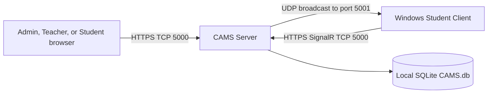

# CAMS Computer Account Management System

CAMS is a local-first classroom monitoring and computer laboratory management system for Windows networks. It combines an ASP.NET Core server, authenticated browser portals, a Windows student client, SignalR monitoring and control, and a local SQLite database. CAMS is designed for supervised classroom use on a trusted private LAN; it does not require a CAMS cloud service.

[](https://github.com/ACTstudent/RemoteAcessMonitoringSoftware4sale/actions/workflows/ci-full.yml)
[](https://github.com/ACTstudent/RemoteAcessMonitoringSoftware4sale/releases/latest)
[](https://dotnet.microsoft.com/download/dotnet/8.0)
[](LICENSE)

## Implemented Scope

- Live authenticated screen monitoring with a client capture-loop target of 50 ms. This is not a promised frame rate; effective throughput depends on workstation load, capture time, SignalR backpressure, and LAN conditions.
- Timed student lab sessions with persisted running, paused, resumed, ended, and expiration state.
- Lab-wide live monitoring, warnings, screen broadcast, remote input and bulk session controls; teacher/adviser-class checks still apply to individual session actions, records, alerts and exports.
- Workstation lock, release of CAMS lock state, logout, restart, shutdown, and remote input commands. Releasing CAMS state cannot unlock the Windows secure desktop; Windows credentials are still required after `LockWorkStation`.
- Application and normalized-domain policies. Blocked applications can be terminated; website violations display CAMS-owned topmost dialogs and are recorded, but CAMS does not close the browser.
- Account, class, roster, workstation, session-rule, global-policy, report, audit, database-maintenance, LAN-status, and Deployment Hub administration.
- Durable bounded client telemetry for temporary disconnections, browser status history without credentials or page content, grouped alert lifecycle, and command auditing.

## Fixed Roles And Scope

CAMS has three fixed application roles: `Admin`, `Teacher`, and `Student`. Authorization is implemented by role claims and server-side object-scope checks. The Roles and Permissions page displays seeded role metadata; CAMS does not provide configurable RBAC or runtime permission assignment.

| Role | Current scope |
| --- | --- |
| Admin | Global account, class, roster, workstation, policy, session-rule, lab-wide session, reporting, lockout, database, LAN-status, and deployment controls. |
| Teacher | Global operational access to Teacher and Student accounts, classes, rosters/imports, workstation mappings/history, restrictions/categories, session rules, lab-wide session controls, all connected Student monitoring, and remote commands. Teachers can manage peer Teacher accounts but cannot edit, unlock, deactivate, or archive themselves; peer deactivation also requires active classes to be reassigned or archived. Individual session actions and older Teacher pages, analytics, records and alerts retain teacher/adviser-class scope. Administrator accounts, role metadata, Admin reports/logs, database maintenance, LAN status, and Deployment Hub remain Admin-only. |
| Student | Browser portal access to session information, alerts, and account settings. The WinForms CLIENT login is stricter: it supplies the machine name and can create or safely reassign the workstation before creating or resuming a session. Conflicting active sessions and archived/maintenance workstations are rejected. |

## Architecture And Network



- The server hosts `/Account/Login`, the role portals, `/Admin/Deployment`, `/api/client/*`, and `/remoteMonitoringHub`.
- The student client receives discovery advertisements on UDP `5001`; the server sends them and does not need an inbound UDP `5001` rule.
- The server needs inbound TCP `5000` on the Windows Private profile. A student firewall policy may need to allow inbound UDP `5001` for `Client.exe`.
- Discovery is optional. The exact manual endpoint is `https://<server-ip>:5000/remoteMonitoringHub`.
- LAN Status is detected, read-only diagnostic information. CAMS does not configure DHCP, DNS, gateways, adapters, or runtime binding from that page.

## Downloads And Deployment Surfaces

The checked-in [public portal source](portal/) is intended for GitHub Pages, while [GitHub Releases](https://github.com/ACTstudent/RemoteAcessMonitoringSoftware4sale/releases/latest) hosts public release artifacts. The expected Pages address is `https://actstudent.github.io/RemoteAcessMonitoringSoftware4sale/`; verify that the Pages workflow has completed before advertising it because the site is not available until Pages is enabled and deployed. Neither public surface provides a deployment's private trust material.

The authenticated local `https://<server-ip>:5000/Admin/Deployment` page is the CAMS Deployment Hub. It displays detected certificate-compatible endpoints, running server and packaged client versions, installer size and SHA-256, certificate details and SHA-256, warnings, and the number of currently connected clients. It can download the validated client installer, deployment manifest, local public root certificate, or a complete offline workstation bundle.

Release assets:

- [CAMS Server Setup](https://github.com/ACTstudent/RemoteAcessMonitoringSoftware4sale/releases/latest/download/CAMS-Server-Setup.exe)
- [CAMS Server SHA-256](https://github.com/ACTstudent/RemoteAcessMonitoringSoftware4sale/releases/latest/download/CAMS-Server-Setup.exe.sha256)
- [CAMS Student Client Setup](https://github.com/ACTstudent/RemoteAcessMonitoringSoftware4sale/releases/latest/download/CAMS-Client-Setup.exe)
- [CAMS Student Client SHA-256](https://github.com/ACTstudent/RemoteAcessMonitoringSoftware4sale/releases/latest/download/CAMS-Client-Setup.exe.sha256)
- `release-manifest.json` from the same release, when published by the current release workflow

Both installers are Windows x64 self-contained deployments; target PCs do not need a separate .NET runtime. See [DEPLOYMENT.md](DEPLOYMENT.md) for the complete trust bootstrap, offline bundle, version, firewall, and validation procedure.

## First Start

There are no default passwords. The server installer asks only for Administrator credentials and passes the password to a synchronous initialization process without saving it in `appsettings.json`. On a fresh database it creates the Administrator; on an existing database it resets the matching Administrator password, activates the account, and clears lockout state. Create Teacher and Student accounts from the authenticated Admin portal.

In local CA mode, first start creates a stable local root CA and a server certificate for the current machine name and detected LAN addresses. Trust only the public `CAMS-Server-Root.cer`; never copy or distribute either `.pfx` file. Restart CAMS after changing networks so the server certificate and discovery endpoint reflect the new address, then confirm the endpoint in Deployment Hub and update saved client URLs if the address changed.

## Build From Source

Prerequisites are the [.NET 8 SDK](https://dotnet.microsoft.com/download/dotnet/8.0) and [Inno Setup 6](https://jrsoftware.org/isdl.php).

```powershell
.\build-everything.ps1
```

The canonical script tests and builds the solution, publishes self-contained client and server binaries, packages both installers, stages the exact client installer/checksum/deployment manifest inside the server package, creates release hashes and `release-manifest.json`, and runs installer validation. `version.json`, assembly/installer versions, deployment manifest versions, and a release tag such as `v2.9.7` must match.

## Release And GitHub Pages Flow

- A push to `main` that changes `portal/**` (or a manual dispatch) is configured to deploy the static public portal through `.github/workflows/pages.yml`; confirm the workflow and expected Pages URL after repository Pages is enabled.
- A `vMAJOR.MINOR.PATCH` tag, or manual release dispatch with that tag, runs `.github/workflows/release.yml` on Windows.
- The release workflow rejects a tag that does not match `version.json`, runs the canonical build and validation, and publishes both installers, both checksum files, and `release-manifest.json` to GitHub Releases.
- The public site links to public release assets. Deployment-specific `CAMS-Server-Root.cer` files and offline bundles remain available only from each authenticated local Deployment Hub.

## Windows And LAN Validation Checklist

Validate on the actual classroom hardware and network before rollout:

- Confirm every machine is Windows x64 and uses the intended Windows user account; the interactive client install, settings, and certificate trust are per user.
- Mark the classroom network Private. Confirm inbound TCP `5000` reaches the server and, if discovery is required, clients receive UDP `5001`.
- Confirm the Deployment Hub endpoint is certificate-compatible and the installer SHA-256/version match its manifest.
- Test first trust without bypassing TLS warnings, then test browser login and client login with workstation registration separately.
- Confirm the client appears in Deployment Hub's connected-client count and the teacher's lab-wide monitoring grid.
- Test screen updates, warning dialogs, pause/resume/end, application/domain policy, reconnect, and one approved remote command. Treat the 50 ms capture interval as a target, not guaranteed FPS.
- Test lock and CAMS unlock-state behavior with the Windows secure desktop limitation understood.
- Disconnect/reconnect the LAN, then restart the server after an address change and verify certificate coverage, the new endpoint, client URL updates, and reconnection.
- Test any hotspot, VLAN, guest Wi-Fi, endpoint security, firewall, shutdown/restart privilege, and remote-input policy in that environment; CAMS cannot guarantee network or OS policy behavior it does not control.

## Documentation

- [CAMS Guide](CAMS-Guide.md)
- [Deployment Guide](DEPLOYMENT.md)
- [Entity Relationship Diagram](DIAGRAMS/ERD.md)
- [System Flowchart](DIAGRAMS/Flowchart.md)
- [Menu Structure](DIAGRAMS/Menu-Structure-Diagram.md)
- [SignalR Message Flow](DIAGRAMS/SignalR-Message-Flow.md)
- [Use Cases](DIAGRAMS/Use-Case-Diagram.md)

## License

Distributed under the [MIT License](LICENSE).
